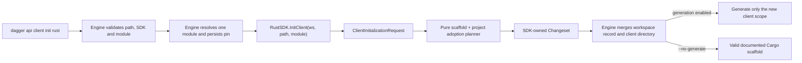
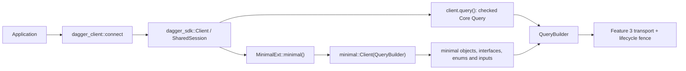
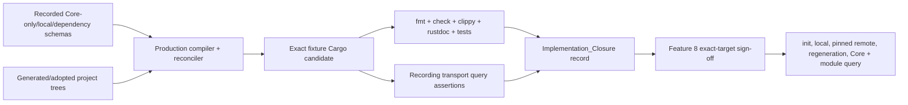

# Design Document: Rust SDK Standalone Client Generation

## Overview

Feature 7 completes the standalone-client path opened by Feature 5. The target result
is a Cargo package which owns no engine runtime and no second copy of the Core schema:
it depends on the exact published `dagger-sdk`, exposes that crate as its Core API, and
adds one generated, namespaced Rust surface for the single module selected by the
workspace client record. Initialization, schema projection, project reconciliation,
publication, compilation, and query verification remain directly testable without a
Dagger engine.

The client-facing API is an extension of the existing owned Rust client rather than a
Go-shaped global or a generated wrapper session. For a module named `minimal`, a
generated package has this shape:

```rust
use minimal_dagger_client::dagger_client::{self, prelude::*};

let client = dagger_client::connect().await?;
let message = client.minimal().hello("Ada").await?;
let container = client.query().container();
client.close().await?;
```

`dagger_client::connect` and `client.query()` are the exact lifecycle and Core
bindings from `dagger-sdk`. `MinimalExt::minimal` is a locally defined extension trait
implemented for `dagger_sdk::Client` and `dagger_sdk::QueryBuilder`; it selects the
exact `Query.minimal` Wire_Name and returns `minimal::Client`. All other selected-module
types live below `dagger_client::minimal`, so a module type cannot shadow a Core type.
The generated module root is called `Client` inside its namespace; an exact module
prefix is removed from other generated Rust type names where doing so is unambiguous.
The semantic binding catalog records every resulting Rust path and its unchanged wire
coordinate.

The engine contract at Dagger commit
`25300124ca110612edc09c43f89cb5fad6028170` remains authoritative. In particular:

- `core/sdk.go:113-140` defines the `ClientInitializer` ABI;
- `core/schema/workspace_client.go:26-155` owns workspace records, module resolution,
  pin persistence, and generation scope;
- `core/schema/modulesource.go:3804-3842` constructs the client-visible schema from the
  complete Core schema plus exactly one normally namespaced bound module; and
- `core/integration/generators_test.go:1236-1266` proves that target-private module
  exclusions do not apply to clients, module functions are not promoted, and module
  dependencies are not installed into the client schema.

The generated Go client and generator at the target revision, together with the
definitive Go SDK at commit `1309520660f6a5b35ef97b4fbe151e32a06a8dc5`, provide
behavioural evidence where the engine does not settle an outcome. Go packages,
process-global helpers, template layout, pointer optionality, and mutable overlay
implementation do not determine the Rust API.

Generation has four explicit stages:

1. **Client schema projection** validates the exact Core manifest, identifies zero or
   one module root, proves that every extension coordinate belongs to its reachable
   closure, and builds a canonical `ClientBindingPlan`.
2. **Rust rendering** transforms that plan into generated source and an exhaustive
   semantic catalog. It performs no I/O, process execution, Cargo invocation, network
   access, or engine call.
3. **Project reconciliation** reads only the selected client root and compatible
   enclosing toolchain declarations, preserves authored Cargo/source/documentation
   content, and produces typed semantic amendments plus generator-owned artifacts.
4. **Manifest-authorized publication** verifies previous ownership, stages the whole
   candidate, rolls back on failure, and publishes the updated operation manifest last.

The generated package's stable authored boundary is `pub mod dagger_client`. A new
package receives a small `src/lib.rs` declaring that module. An existing library gets
one syntactically validated SDK-owned module declaration while the rest of the file is
left byte-for-byte intact. Generated source lives below a `dagger_client/**` directory
adjacent to the selected library root; `Cargo.toml`, the library root,
`.gitattributes`, and the README are semantic amendments rather than whole-file
generated artifacts. Their
owned keys or marked regions are recorded separately so unrelated caller edits remain
legal after the first generation.

Every local checkpoint is Rust-first and engine-free. The production compiler,
reconciler, publisher, runtime bridge, generated API, recording transport, fixture
resolver, completeness validator, and direct Go ABI helpers are exercised directly.
Checked Core output is reused unless an owning input changes. Feature 8 later consumes
this closure evidence and uses one reusable exact-target engine artifact for the small
set of workspace and real-query facts that a direct harness cannot prove.

## Dependencies and Non-Goals

### Owning relationships

- Feature 1 owns capability identities, mapping validation, evidence admission,
  blocker rendering, and status transitions. Feature 7 supplies its mapping, policy
  records, evidence subjects, and the correction moving `TestProvision` to Feature 3.
- Feature 2 owns `Client`, `SharedSession`, connection configuration, explicit close,
  and the no-global lifecycle. Generated clients clone its existing lease.
- Feature 3 owns request execution, GraphQL and transport errors, timeouts,
  cancellation, telemetry, and recording-transport behaviour.
- Feature 4 owns the exact Core manifest, canonical schema, projection semantics,
  wrapper model, naming primitives, generated Core bindings, semantic catalog model,
  and `QueryBuilder`. Feature 7 projects only the client-specific extension closure
  and resolves Core references back to `dagger-sdk`.
- Feature 5 owns the private operation protocol, immutable target and dependency
  descriptor, confined operation root, packaged Rust tool, renderer dispatch,
  manifest-last publication, runtime adapter, and workspace/client generation hook.
  Feature 7 extends those types rather than adding a parallel generator executable.
- Feature 6 owns module TypeDef authoring and dispatch. Its output determines the
  bound module schema consumed here; none of its dispatcher or module binary is copied
  into a standalone client.
- Feature 8 owns the reusable exact-target engine artifact, one-engine sign-off run,
  platform and cross-SDK conformance, and the final digest-bound verdict. Feature 7
  defines and validates the client case inventory but does not execute it locally.
- Feature 9 owns crates.io publication, public release automation, migration policy,
  and stable-release presentation. Feature 7 consumes an exact registry or immutable
  Git `PublishedSdkDependency`; it does not publish the generated package or the SDK.
- `dagger-codegen` remains the pure compiler. It owns client schema scope, local names,
  type projection, method shape, Rust rendering, and the semantic binding catalog.
- `dagger-sdk` owns the public runtime and a deliberately tiny, exact-version,
  `#[doc(hidden)]` bridge used by external generated code. The bridge does not become
  a second public query API.
- `dagger-sdk-engine` owns Cargo/toolchain discovery, authored-file reconciliation,
  post-work, ownership verification, filesystem publication, checkpoint planning, and
  fixture Cargo execution.
- `dagger-sdk-completeness` owns Feature 7 mapping and evidence validation.
- `sdk/rust/runtime` remains a thin Go ABI adapter. It selects engine objects, validates
  workspace records and pins, marshals closed Rust requests, and returns Dagger
  changesets. It does not implement Rust naming, Cargo editing, schema traversal, or
  source rendering.

### Construction rules

1. Exact target identity, module identity and pin, visible-schema bytes and digest,
   output root, published dependency, project snapshot, and prior ownership manifest
   are explicit inputs. Ambient working directories, environment variables, map
   order, and filesystem enumeration order are not semantic inputs.
2. The pure compiler consumes bytes and validated scalar types only. It cannot read the
   filesystem, run Cargo or rustfmt, resolve a module, use a network, or reach an engine.
3. The client schema contains the exact target Core manifest plus either no extension
   root or exactly one field whose Wire_Name is the bound module name. All non-Core
   coordinates must be transitively reachable from that root.
4. Core bindings, transport, lifecycle, errors, scalars, and IDs always resolve to the
   exact `dagger-sdk` dependency. The renderer never emits a Core object or a second
   session type.
5. Module-local Rust names are planned as one set before rendering. Prefix removal is
   accepted only when the resulting public path is unique and non-keyword; otherwise
   generation fails rather than adding an order-dependent suffix.
6. Every generated handle stores a `QueryBuilder`, so nested selections inherit one
   `SharedSession`. No generated value opens, closes, caches, or globally stores a
   session.
7. Required arguments are ordinary method parameters. Omittable arguments use owned
   `Opts` or input builders whose `None` means omission; an explicit `Some(false)`,
   `Some(0)`, empty string, empty list, or explicit GraphQL null remains observable.
8. Generated source is safe Rust. Exact-version bridge operations preserve session and
   selection identity without exposing `SessionHandle` or `Selection` to callers.
9. `Cargo.toml`, `src/lib.rs`, README, and VCS files are reconciled semantically. The
   generator records only its keys or delimited regions and never claims the whole
   authored file merely because it touched it.
10. `Cargo.lock` is always caller-owned in Feature 7. Initialization and generation do
    not run dependency resolution or modify it.
11. Generator-owned artifacts and semantic amendments form one transaction. The prior
    compatible manifest is the only authority for replacement/removal; the manifest is
    published last.
12. Workspace client roots are normalized, sorted, and checked for prefix overlap
    before any per-client operation is constructed. Each client is projected from its
    own module source and schema.
13. The modern workspace path and legacy `GenerateClient` path translate to the same
    Rust request. Path-dependent control fields may differ, but the path-relativized
    generated API, catalog, target, schema, module, and dependency identities do not.
14. Local compilation uses the exact project candidate and an engine-free local
    dependency resolver. Generation never changes the immutable dependency declaration
    to make the fixture build convenient.
15. Every public generated module and item receives semantic rustdoc. Inline comments
    explain ownership, omission, session, or wire invariants; they do not narrate the
    following statement or cite implementation task numbers.

### Dependency decisions

- Generated packages have one SDK dependency, `dagger-sdk` from the exact
  `PublishedSdkDependency`, plus the existing documented direct Tokio runtime
  dependency needed by an executable async quickstart. They do not depend on `dagger-codegen`,
  `dagger-sdk-engine`, `dagger-sdk-completeness`, or another SDK.
- Generated serde implementations use the exact-version re-export under
  `dagger_sdk::__private::serde`. This avoids accidentally selecting a second public
  serde policy while keeping the generated package's Cargo surface small. The hidden
  bridge is version-locked by the exact SDK dependency.
- Existing `toml_edit`, `syn`, `quote`, and `proc-macro2` workspace dependencies are
  used for format-preserving Cargo edits, Rust module-declaration validation, and
  source rendering. No text substitution is used for semantic Cargo ownership.
- Existing `serde_graphql_input` behaviour behind `QueryBuilder` remains the GraphQL
  input encoder. Generated code passes typed values through that boundary and does not
  serialize GraphQL literals itself.
- Existing `proptest`, `trybuild`, and recording-transport fixtures cover properties,
  compile-time API outcomes, and emitted query documents. No bespoke randomized-test
  framework is introduced.
- Existing manifest-last publication is extended with semantic amendments and reused.
  A second client-only transaction mechanism would create competing ownership rules.
- The checkpoint planner added in Feature 6 is extended with Feature 7 packages and
  targets. Its closed action enum remains incapable of starting Dagger or entering
  another SDK.

### Non-goals

- Generating one client containing the selected module's transitive dependencies.
- Adding inherent methods to `dagger_sdk::Client`, `dagger_sdk::Query`, or any other
  foreign Core type.
- Copying Core generated source, transport code, session state, error types, telemetry,
  or provisioning into the standalone project.
- Supporting more than one bound module in one generated client.
- Recreating the Go SDK's package-global `dag`, pointer-option conventions, package
  graph, templates, `go.mod` mutations, or zero-value omission.
- Resolving a module or constructing the client-visible schema inside Rust. Those are
  engine responsibilities; Rust validates the supplied identity and schema.
- Rewriting a caller's package name, version, feature graph, profiles, workspace
  membership, existing targets, lockfile, or unrelated source and documentation.
- Adopting `workspace = true` for `dagger-sdk`. A standalone client must retain its
  exact dependency when copied outside the workspace; an inherited SDK source is
  therefore rejected even when its current workspace value happens to match.
- Running `cargo update`, `cargo generate-lockfile`, `cargo metadata` with network
  access, or any other dependency resolution during initialization or generation.
- Publishing the generated client crate or any SDK crate.
- Running another SDK's generator, building another SDK, starting a Dagger engine, or
  continuously regenerating checked Core bindings at Feature 7 checkpoints.
- Claiming the exact CLI workspace flow, remote fetch, or real engine query before the
  deferred SDK sign-off.

## Repository Layout

```text
sdk/rust/
├── crates/
│   ├── dagger-codegen/
│   │   └── src/client/
│   │       ├── mod.rs                 # pure ClientCompiler facade
│   │       ├── scope.rs               # Core + one-root closure validation
│   │       ├── naming.rs              # module namespace and local symbol plan
│   │       ├── types.rs               # Core/local type and wrapper resolution
│   │       ├── fields.rs              # typed method/Opts/re-entry projection
│   │       ├── catalog.rs             # client-specific semantic bindings
│   │       ├── render.rs              # generated Rust source
│   │       └── diagnostic.rs          # client projection diagnostics
│   ├── dagger-sdk/
│   │   └── src/query/generated.rs     # exact-version external-code bridge
│   ├── dagger-sdk-engine/
│   │   └── src/client/
│   │       ├── mod.rs                 # client operation orchestration
│   │       ├── initialization.rs       # InitClient scaffold planner
│   │       ├── project.rs              # Cargo/source/docs/VCS reconciliation
│   │       ├── ownership.rs            # semantic amendment verification
│   │       ├── fixture.rs              # engine-free candidate compilation
│   │       └── checkpoint.rs           # Feature 7 checkpoint composition
│   └── dagger-sdk-completeness/
│       └── src/client_generation.rs    # scope, closure, and sign-off admission
├── completeness/
│   ├── mappings/rust-sdk-client-generation.json
│   ├── policies/rust-client-generation.json
│   └── evidence/rust-sdk-client-generation/
├── fixtures/client-generation/
│   ├── core-only/
│   ├── local-module/
│   ├── dependency-bound/
│   ├── project-adoption/
│   └── fail/
└── CLIENT_GENERATION.md                # durable user/contributor workflow
```

The current `engine/client.rs` baseline becomes a thin `OperationRenderer` adapter over
the new pure `client` module. Existing common schema and projection modules remain the
single implementation of GraphQL wrappers, directives, canonicalization, and target
drift. The current `dagger-sdk-engine` runner and publisher gain client project inputs
and semantic amendments without moving generic operation code beneath a client-only
module.

One generated client root has this stable layout:

```text
<client>/
├── Cargo.toml                           # authored file with SDK-owned keys
├── README.md                            # authored prose + one owned quickstart region
├── rust-toolchain.toml                  # created only if no compatible policy exists
├── .gitattributes                       # authored lines + generated-path policy
├── src/
│   ├── lib.rs                           # authored source + one owned module item
│   └── dagger_client/
│       ├── mod.rs                       # lifecycle/Core exports and extension trait
│       └── generated/
│           ├── mod.rs                   # private generated index/support
│           ├── binding-catalog.json     # canonical semantic catalog
│           └── minimal/
│               ├── mod.rs               # public selected-module namespace
│               ├── client.rs            # namespaced module root
│               └── worker.rs            # one generated type unit
└── .dagger/rust/operation-manifest.json # Generated_Client_Manifest, published last
```

`src/dagger_client/**`, `examples/dagger-client-quickstart.rs`, and the operation
manifest are whole-file generator-owned in the default layout. For a custom library
root, `dagger_client/**` is adjacent to that root. The `dagger_client` module
declaration, Cargo keys, quickstart region, and `.gitattributes` line are semantic
amendments. `README.md`, `Cargo.toml`, the selected library root, and `.gitattributes`
therefore remain authored files even after they have SDK-owned portions.

## Architecture

### Initialization and scoped generation control plane



The engine owns the workspace record and calls `InitClient` before deciding whether to
run the returned one-client scope. The Rust adapter does not receive `NoGenerate` and
does not emulate it. It validates the client path, ignores the potentially
credential-bearing module reference after checking it is non-empty, derives a stable
package name from the client-root basename, and sends only non-secret scaffold inputs
to the private Rust tool.

Initialization reads the selected root from an immutable Dagger directory snapshot.
It validates or creates `Cargo.toml`, validates the nearest exact toolchain policy,
creates `rust-toolchain.toml` only when none exists, preserves every existing Rust
source, and creates a documented `src/lib.rs` only when the package has no library
root. A marked README section explains that `dagger generate` creates
`dagger_client`; it does not claim bindings already exist. No lockfile or generated
binding is created. The adapter returns a changeset only after the complete candidate
is available, so an error cannot mutate the workspace.

The SDK function exposes no SDK-specific initialization arguments. The engine/module
function decoder therefore rejects unknown keys before `InitClient` executes. If a
future argument is added, it must first enter the closed request enum and its policy
table; an untyped options map never crosses into the Rust planner.

### Generation, reconciliation, and publication control plane

```mermaid
flowchart LR
    W["Workspace client records"] --> SEL["Canonical cwd selection + overlap preflight"]
    SEL --> MOD["Resolve each Bound_Module and verify pin"]
    MOD --> SCH["Engine Client_Visible_Schema"]
    SCH --> REQ["Closed GenerateClient request"]
    REQ --> DISC["Client project snapshot/discovery"]
    DISC --> IDENT["Deterministic package/crate identity"]
    REQ --> COMP["Pure ClientCompiler"]
    IDENT --> COMP
    IDENT --> REC["Semantic project reconciler"]
    COMP --> ART["Generated artifacts + binding catalog"]
    ART --> REC
    REC --> CAND["One ownership candidate"]
    CAND --> PUB["Failure-atomic manifest-last publisher"]
    PUB --> CHG["Isolated client Changeset"]
```



`GenerateClients` obtains every selected record, reads its stored module reference and
pin, resolves its `ModuleSource`, and compares the resolved pin before asking for the
schema. It sorts records by normalized path and rejects equal, ancestor, or descendant
roots before constructing a generation operation. Every operation starts from the same
workspace-before directory. Per-client results are kept isolated until all succeed;
only then does the adapter return the combined changeset.

The Rust runner validates the target, schema digest, module digest and pin, dependency,
and output root. For client generation it discovers the current Cargo/library/toolchain
state before rendering, because the generated quickstart must know the adopted package
crate name. Discovery produces a bounded byte-only `ClientProjectSnapshot`. The pure
compiler consumes that identity and the already canonical visible schema; it does not
receive filesystem access.

`ClientCompiler` first validates the exact Core coordinate manifest. It then inspects
extension coordinates on the Core `Query` type. Zero extension fields means a Core-only
client for a selected module without a runtime. One field matching the normalized
bound module name becomes `ModuleRoot`. More than one field, a differently named field,
a directly promoted module function, or any non-Core coordinate outside the type
closure reachable from that field is a schema-scope error. Every reachable extension
named type must also satisfy the engine's exact selected-module namespace rule: the
root type or the normalized bound-module type prefix recorded by the schema projection.
A coordinate belonging to any other module namespace is rejected as dependency
leakage. This makes dependency exclusion an executable invariant rather than an
assumption about engine input.

Rendering produces only the generated subtree and catalog. The reconciler separately
plans exact Cargo keys, a `dagger_client` module item, README region, generated VCS
policy, and an optional exact toolchain declaration. It verifies corresponding
semantic amendment records from the previous manifest, then builds the complete
candidate from current authored bytes. Unrelated edits are retained. The generic
publisher stages both generated artifacts and amended files, records backups, renames
in canonical order, removes only previously owned obsolete artifacts, and publishes
the acyclic operation manifest last.

The first Feature 7 generation may encounter the Feature 5 baseline manifest, which
whole-file-owns `Cargo.toml` and `src/lib.rs`. A one-way migration verifies those exact
digests, retains their semantic content, transfers only the approved Cargo keys and
module item into amendment records, and stops treating the whole files as generated.
No filename-only adoption is permitted.

### Generated Rust API data plane



The generated `dagger_client` module has these public roles:

```rust
pub use dagger_sdk::{Client, ClientConfig, connect, connect_with};
pub use dagger_sdk as core;

pub mod minimal;

pub trait MinimalExt {
    /// Selects GraphQL root field `Query.minimal` on this existing session.
    fn minimal(&self) -> minimal::Client;
}

impl MinimalExt for dagger_sdk::Client { /* query_builder + exact selection */ }
impl MinimalExt for dagger_sdk::QueryBuilder { /* exact child selection */ }

pub mod prelude {
    pub use super::MinimalExt as _;
}
```

The trait is local, so implementing it for foreign runtime types is coherent Rust. The
implementation for `QueryBuilder` makes module composition available from another
generated selection without a global root. The `as _` prelude import makes the method
available without adding a public trait name to the caller's namespace.

Object and interface clients are cloneable immutable handles containing one
`QueryBuilder`. A non-null object field returns another lazy handle. Scalar and enum
fields are async and execute through `QueryBuilder::execute`. Nullable objects and
lists first select IDs, execute the complete ID shape, then re-enter each handle on the
same session. Generated input objects and enums use exact Wire_Name serde codecs.
Required IDs accept `impl IntoID<Id>`; optional and list ID fields use target-typed
`IdInput<T>` values, preserving the same compile-time separation as Core bindings.

The public `QueryBuilder` remains the only compositional value. Its exact-version
hidden bridge gains only operations external generated code cannot express safely with
the stable API: constructing a Core handle from the current selection, constructing a
root `node(id:)` re-entry builder on the same session, and adding lazily resolved
target-typed ID inputs. `SessionHandle` and `Selection` remain private, and Core's
`Loadable` trait remains sealed.

### Engine-free checkpoint and deferred sign-off plane



The fixture compiler runs the real production `ClientCompiler`, project reconciler,
publisher, and public `dagger-sdk` bridge. Its resolver materializes the exact SDK
dependency in an isolated local source while leaving the candidate manifest bytes
unchanged. The Core-only, local-module, and dependency-bound projects are formatted,
compiled, clippy-checked, rustdoc-checked, and exercised against a recording transport.

The checkpoint planner records exact commands, selected packages and targets, elapsed
times, and whether checked generated assets were reused or refreshed. Its closed action
set rejects Dagger commands, engine construction, module invocation, other SDK paths,
unscoped generation, distribution builds, and network dependency resolution. A
proposed engine exception is evidence data requiring separate approval, not an action
the local planner can execute.

Feature 8 consumes the resulting exact-target closure record. It builds the target
artifact, required Go engine/CLI/runtime content, and Rust content at most once; starts
one engine; installs one Rust baseline; fans out the bounded client cases; records
phase timings; rejects duplicate builds or starts; and emits one atomic verdict bound
to all input digests. It does not replay the Feature 7 Cargo/property/security suite.

## Components and Interfaces

### Pure client compiler (`dagger-codegen/src/client`)

The current `engine::visible::VisibleSchemaPlan` remains the schema-validation entry.
Feature 7 adds a client-specific second phase that proves operation scope and converts
the shared projection into paths suitable for an external Cargo package.

```rust
pub struct ClientCompilationInput<'a> {
    pub target: &'a CodegenTarget,
    pub visible_schema: &'a VisibleSchemaPlan,
    pub module: &'a ModuleProjectionInput,
    pub project: &'a ClientProjectIdentity,
    pub output: &'a RelativeOperationPath,
}

pub struct ClientProjectIdentity {
    pub package_name: CargoPackageName,
    pub crate_name: RustIdentifier,
}

pub enum ClientSchemaSurface {
    CoreOnly,
    BoundModule(ModuleSurfacePlan),
}

pub struct ClientBindingPlan {
    pub target: CodegenTarget,
    pub visible_schema_digest: SemanticDigest,
    pub module: ClientModuleIdentity,
    pub project: ClientProjectIdentity,
    pub surface: ClientSchemaSurface,
    pub core_bindings: BTreeMap<SchemaCoordinate, CoreBindingReference>,
    pub generated_bindings: BTreeMap<BindingKey, ClientBindingDescriptor>,
}

pub fn compile_client(
    input: ClientCompilationInput<'_>,
) -> Result<ClientBindingPlan, DiagnosticSet>;
```

`compile_client` is a total pure function. It first requires that the target and
`VisibleSchemaPlan` agree. It then validates `Query` extension fields and constructs
the reachable closure. Reachability follows named references through object and
interface fields, arguments, interface possible types, implemented interfaces, input
fields, and recursive list/non-null wrappers. The exact target and Dagger module
TypeDef surface have no public union kind; existing canonical validation rejects a
public union before client compilation rather than inventing a Rust representation.
Core references end traversal because their source is `dagger-sdk`; every non-Core
reference must remain in the module closure. Directives
and applied metadata are included in semantic fingerprints but do not create an
independent module root.

The compiler rejects a module root when its field name does not equal the normalized
`ModuleProjectionInput.name`, its return is not a non-null object handle, or another
extension field exists on `Query`. A runtime-less module is valid only when the
extension set is empty. The engine need not label a schema as runtime-less: the absence
of an extension root is the complete observable condition.

`core_bindings` is resolved against the checked Feature 4 catalog rather than by
re-running Core naming. Each record contains the exact public `dagger_sdk` path and
binding fingerprint. A missing catalog entry is a target drift error. This makes
Core reuse mechanically exhaustive and prevents a renderer from silently emitting a
local stand-in.

### Module namespace and type planner (`dagger-codegen/src/client/naming.rs`)

One `ClientNamePlan` owns every public generated name:

```rust
pub struct ClientNamePlan {
    pub module_wire_name: SchemaName,
    pub namespace: RustIdentifier,
    pub extension_trait: RustIdentifier,
    pub root_type: RustIdentifier,
    pub bindings: BTreeMap<SchemaCoordinate, RustPath>,
}

pub fn plan_client_names(
    root: &ModuleRoot,
    closure: &BTreeSet<SchemaCoordinate>,
    projected: &RustNameMap,
) -> Result<ClientNamePlan, DiagnosticSet>;
```

The namespace is the snake-case Rust form of the exact root Wire_Name. The extension
trait is its PascalCase form plus `Ext`. The root object maps to `Client`. Other named
types first use the Feature 4 Rust name; if that name starts with the exact PascalCase
module prefix, the planner tests the non-empty suffix. It accepts the suffix only when
it is a legal identifier and unique across the complete local namespace. It never
falls back based on input order. Any duplicate namespace, type, trait, option type,
method, argument, enum variant, or helper name yields all conflicting wire coordinates
in one deterministically ordered diagnostic set.

The `dagger_client`, `generated`, `core`, `prelude`, `Client`, and `support` identifiers
are reserved. A selected module whose normalized namespace collides with one of these
receives a diagnostic rather than an arbitrary suffix. Raw identifiers are used only
for ordinary Rust keywords where the public spelling remains clear; reserved generator
roles are never escaped into ambiguous public paths.

### Typed field and codec projection (`dagger-codegen/src/client/{types,fields}.rs`)

Feature 4's `TypeRef`, `ArgumentPresence`, directive, deprecation, and field-strategy
models remain authoritative. A client-specific resolver assigns each named leaf to
either an exact Core path or a module-local path:

```rust
pub enum ClientNamedType {
    Core(CoreBindingReference),
    Module(RustPath),
    RuntimeScalar(RuntimeScalarKind),
}

pub enum ClientFieldExecution {
    LazyModuleHandle { target: RustPath },
    LazyCoreHandle { target: CoreBindingReference },
    ExecuteValue { output: RustType },
    ReenterModuleShape { target: RustPath, ids: IdShape },
    ReenterCoreShape { target: CoreBindingReference, ids: IdShape },
}

pub struct ClientFieldPlan {
    pub coordinate: SchemaCoordinate,
    pub wire_name: SchemaName,
    pub rust_name: RustIdentifier,
    pub required: Vec<ClientArgumentPlan>,
    pub omittable: Vec<ClientArgumentPlan>,
    pub return_type: RustType,
    pub execution: ClientFieldExecution,
    pub documentation: DocumentationPlan,
}
```

Wrappers are resolved recursively. A non-null leaf is `T`; nullable is `Option<T>`;
lists retain every nested list/nullability layer. The public type and the ID re-entry
shape are derived from the same wrapper tree so decoding cannot disagree with a method
signature. Unsupported recursion depth or a named reference outside Core and the
module closure fails during projection.

Required non-ID inputs use their exact typed Rust representation. Required object IDs
accept `impl dagger_sdk::IntoID<dagger_sdk::Id>`. Omittable values live in an owned
`<Owner><Field>Opts` struct and receive `with_<argument>` builders. An omitted field is
absent from the query. Explicit values are encoded even when false, zero, empty, or
null. Input objects use a constructor for required fields plus consuming builders for
omittable fields. Enums and input objects derive exact wire serialization and response
enums derive exact deserialization through the SDK's version-locked serde re-export.

Objects implement `IntoID<Id>` by resolving their generated `id` selection. A missing
or incompatible object ID field is a schema error. Interface clients preserve the
Feature 4 interface relation and re-enter through their declared GraphQL type; the
client namespace contains both the semantic trait and its lazy client handle.

### Client renderer (`dagger-codegen/src/client/render.rs`)

The renderer accepts only a completed `ClientBindingPlan`:

```rust
pub struct RenderedClient {
    pub artifacts: BTreeMap<RelativeOperationPath, CandidateArtifact>,
    pub catalog: ClientBindingCatalog,
    pub rust_sources: BTreeSet<RelativeOperationPath>,
}

pub fn render_client(
    plan: &ClientBindingPlan,
    generated_root: &RelativeOperationPath,
) -> Result<RenderedClient, DiagnosticSet>;
```

It emits:

- `<library-dir>/dagger_client/mod.rs`, containing lifecycle/Core re-exports, the module
  declaration, extension trait and implementations, and `prelude`;
- `<library-dir>/dagger_client/generated/mod.rs`, containing the private generated index and
  ID-shape support;
- `<library-dir>/dagger_client/generated/<namespace>/mod.rs`, re-exported as the one public
  selected-module namespace;
- one deterministic source file below that namespace per module-owned named type;
- `binding-catalog.json`, containing the complete client catalog; and
- `examples/dagger-client-quickstart.rs`, whose crate path uses the discovered package
  identity and whose body type-checks without editing generated source.

The generated subtree is independent of its absolute output root. Generated headers
contain target revision and schema digest, never a host path, session credential,
module source URL, or local dependency. All source is parsed with `syn` before leaving
the renderer and formatted only by the pinned formatter post-work action.

`engine::client::render` delegates to this renderer and changes its content domain
from `EngineHookBaseline` to `StandaloneClient`. The existing baseline-specific Cargo
and library-root rendering is removed; those concerns belong to the project
reconciler. `OperationPlan` carries the semantic catalog digest and project amendment
requirements alongside generated artifacts.

### Exact-version generated-code bridge (`dagger-sdk/src/query/generated.rs`)

External generated source must retain session identity without gaining access to the
private `Selection` or `SessionHandle`. The public stable `QueryBuilder` API already
covers selection, normal arguments, document construction, and typed execution. The
following `#[doc(hidden)]` methods cover the remaining generated-only operations:

```rust
impl QueryBuilder {
    #[doc(hidden)]
    pub fn generated_core_handle<T>(&self) -> T
    where
        T: Loadable + 'static;

    #[doc(hidden)]
    pub fn generated_reentry_builder(
        &self,
        id: Id,
        concrete_type: &'static str,
    ) -> QueryBuilder;

    #[doc(hidden)]
    pub fn generated_argument_id<H>(
        &self,
        name: &'static str,
        value: H,
    ) -> QueryBuilder
    where
        H: IntoID<Id>;

    #[doc(hidden)]
    pub fn generated_argument_id_shape<S>(
        &self,
        name: &'static str,
        value: S,
    ) -> QueryBuilder
    where
        S: dagger_sdk::__private::GeneratedIdInputShape;
}

impl<T> IdInput<T> {
    #[doc(hidden)]
    pub fn generated_lazy<H>(handle: H) -> Self
    where
        H: IntoID<Id>;
}
```

`generated_core_handle` calls the existing sealed Core constructor internally.
`generated_reentry_builder` creates `query { node(id:) { ... on Type } }` on the same
session and returns only another `QueryBuilder`; local generated code applies its own
private constructor. `GeneratedIdInputShape` is a hidden sealed trait implemented for
`IdInput<T>`, `Option<S>`, and `Vec<S>` recursively. Together with `generated_lazy`, it
reuses the existing resolver for every wrapper shape, so an identifier lookup completes
before the containing request is admitted and a failed lookup cannot send a partial
operation.

The exact set may be represented internally by a sealed `GeneratedQueryBridge` trait
instead of inherent methods if that yields clearer implementation boundaries, but the
observable contract stays the same: generated code can select, re-enter, and encode ID
shapes without seeing or manufacturing session internals. The bridge is re-exported
only through `dagger_sdk::__private`; its docs explicitly state that it is version
locked to generated code. `serde` is re-exported from the same namespace for generated
wire codecs.

### Client project discovery and reconciliation (`dagger-sdk-engine/src/client/project.rs`)

The project layer adds a byte-only snapshot and a pure reconciliation plan:

```rust
pub struct ClientProjectSnapshot {
    pub root: RelativeOperationPath,
    pub manifest: Option<AuthoredFile>,
    pub library_root: Option<AuthoredFile>,
    pub readme: Option<AuthoredFile>,
    pub gitattributes: Option<AuthoredFile>,
    pub lockfile_digest: Option<Sha256Digest>,
    pub toolchain: ToolchainSelection,
}

pub struct ClientProjectPlan {
    pub identity: ClientProjectIdentity,
    pub amendments: BTreeMap<AmendmentCoordinate, AmendmentCandidate>,
    pub created_files: BTreeMap<RelativeOperationPath, Vec<u8>>,
    pub toolchain: ExactRustToolchain,
}

pub fn discover_client_project(
    root: &OperationRoot,
    client_root: &RelativeOperationPath,
) -> Result<ClientProjectSnapshot, EngineDiagnostic>;

pub fn reconcile_client_project(
    snapshot: &ClientProjectSnapshot,
    request: &ClientProjectRequest,
    generated: &RenderedClient,
    previous: Option<&OperationManifest>,
) -> Result<ClientProjectPlan, EngineDiagnostic>;

pub fn select_client_project_identity(
    snapshot: &ClientProjectSnapshot,
    request: &ClientProjectRequest,
) -> Result<ClientProjectIdentity, EngineDiagnostic>;
```

Discovery follows no symlink. It reads at most `Cargo.toml`, the selected library root,
README, `.gitattributes`, `Cargo.lock` digest, and deterministic nearest toolchain
declarations. A Cargo manifest may choose a custom `[lib].path`; the path must remain
beneath the client root and becomes the library amendment target. A binary-only package
receives a new default `src/lib.rs`. Multiple candidate library roots, virtual-only
manifests, escaping custom paths, and invalid UTF-8 are typed errors.

For a new package, the planner creates version `0.1.0`, `publish = false`, edition
`2024`, `rust-version = "1.97.1"`, and the exact SDK dependency. Its package name is
the normalized client-root basename plus `-dagger-client`; invalid or empty basenames
use the normalized bound module name plus that suffix. The final name must pass Cargo
and Rust crate-name validation.

For an existing package, `toml_edit` preserves formatting and all unrelated values.
The planner:

- adds `publish = false` when absent and rejects a conflicting publication policy;
- requires edition 2024, adding it only when absent;
- requires `rust-version = "1.97.1"` and adds it only when absent;
- validates or adds the exact direct `dagger-sdk` dependency;
- validates or adds the documented Tokio runtime dependency used by the generated
  executable quickstart without changing a compatible caller runtime declaration;
- rejects `path`, wildcard, range, tag-only, branch-only, or workspace-inherited SDK
  sources;
- preserves all other dependencies, features, targets, profiles, metadata, and
  workspace entries; and
- never reads or changes `Cargo.lock`.

The generated directory is placed beside the selected library root, so the library
amendment parser can use ordinary Rust module discovery. It uses `syn` to reject
invalid authored Rust before adding:

```rust
pub mod dagger_client;
```

If an equivalent item already exists, it is adopted without a byte change. If the
identifier or path is already used incompatibly, reconciliation fails. Otherwise a
canonical SDK-owned region is appended after a newline. Future generations locate
that region by its manifest amendment coordinate, verify its semantic item and digest,
and leave every other byte unchanged.

README reconciliation uses one HTML-comment-delimited `dagger-client-quickstart-v1`
region whose opening marker contains the digest of its body. Initialization creates or
appends a scaffold region explaining generation; generation first verifies that body
digest, then replaces only that region with the compiled quickstart. An existing
malformed, nested, duplicate, or digest-mismatched owned region is an ownership
conflict. Unmarked prose remains byte-identical. `.gitattributes` uses the existing
line-preserving VCS planner to add one generated subtree pattern; it does not reorder
caller lines.

If no compatible enclosing toolchain declaration exists, initialization or first
generation creates exact `rust-toolchain.toml` under the client root. A moving,
ambiguous, below-MSRV, or otherwise incompatible declaration is rejected rather than
shadowed. A compatible exact declaration is preserved at its current location.

### Generated client manifest and publication (`dagger-sdk-engine`)

`OperationManifest` remains the durable file at
`.dagger/rust/operation-manifest.json`. For `GenerateClient`, backwards-compatible
optional client and semantic-amendment sections extend format version 1. They use
`serde(default, skip_serializing_if)` so existing manifests decode and non-client
manifest bytes do not gain empty client fields:

```rust
pub struct ClientManifestRecord {
    pub module: ClientModuleIdentity,
    pub package: ClientProjectIdentity,
    pub namespace: Option<ClientNamespaceRecord>,
    pub binding_catalog_digest: Sha256Digest,
    pub binding_count: u64,
}

pub enum AmendmentKind {
    CargoKey,
    RustModuleItem,
    DocumentationRegion,
    VcsPolicyLine,
}

pub struct AmendmentRecord {
    pub kind: AmendmentKind,
    pub file: RelativeOperationPath,
    pub coordinate: StableCoordinate,
    pub semantic_digest: Sha256Digest,
}

pub struct OperationManifest {
    // existing target, input, schema, dependency, generator and artifact fields
    pub amendments: BTreeMap<AmendmentCoordinate, AmendmentRecord>,
    pub client: Option<ClientManifestRecord>,
}
```

Whole-file `ArtifactRecord`s continue to contain post-format byte digests. Amendment
records contain a digest of the canonical semantic value, not the entire authored
file. Before replacement the verifier reparses current bytes, extracts the owned
semantic value, and compares its digest. This permits unrelated caller edits while
still detecting edits to an SDK-owned dependency, module item, docs region, or VCS
line.

`OperationCandidate` gains complete candidate bytes for amended files. Publication
validates all artifact and amendment authority before staging anything. Its journal
then treats an amended file like any other write for backup, rename, rollback, and
manifest-last ordering. Obsolete generated artifacts are the set difference between
previous and candidate artifact maps. Semantic amendments are never deleted merely
because a renderer stopped mentioning them; removal requires an explicit migration
policy so authored files are not silently rewritten.

The Feature 5 baseline migration is admitted only for `GenerateClient` and the exact
target. The old manifest must authenticate every baseline byte, and its path/digest set
must equal a fresh pure projection of the known `EngineHookBaseline` renderer for its
recorded inputs. Migration removes whole-file ownership from Cargo and `src/lib.rs`,
records their equivalent semantic entries, replaces the old generated subtree, and
publishes the extended manifest atomically. An unrecognized old manifest remains stale.

### Client initialization runner (`dagger-sdk-engine/src/client/initialization.rs`)

Initialization uses a distinct request so module-project assumptions cannot leak into
clients:

```rust
pub struct ClientInitializationRequest {
    pub format_version: FormatVersion,
    pub target: TargetIdentity,
    pub client_root: RelativeOperationPath,
    pub package_name: CargoPackageName,
    pub sdk_dependency: PublishedSdkDependency,
}

pub enum EngineExecutionRequest {
    InitializeModule(InitializationRequest),
    InitializeClient(ClientInitializationRequest),
    Generate(OperationRequest),
}
```

`plan_client_initialization` reuses the client Cargo and toolchain policies, but emits
no generated subtree, module declaration, catalog, or operation manifest. It creates a
minimal documented library and README only when those files do not exist, or appends
only the declared README scaffold region. It performs no post-work process. The result
is a valid Cargo package even under `--no-generate`; `cargo check` does not refer to
missing bindings.

Initialization runs against the adapter's immutable workspace copy. Only a successful
`ExecutionResultKind::ClientInitialization` is converted into a Dagger changeset. The
result enumerates touched paths for audit but carries no generated VCS claims.

### Go ABI and workspace adapter (`sdk/rust/runtime`)

The module-backed API adds the target signature directly:

```go
func (sdk *RustSDK) InitClient(
    ctx context.Context,
    ws *dagger.Workspace,
    clientPath string,
    moduleRef string,
) (*dagger.Changeset, error)
```

It requires non-nil `ws`, a non-empty module reference, and a path accepted by the
existing normalized workspace-path policy. It derives the package candidate from the
path, loads the immutable descriptor, sends `initialize-client`, and returns the
selected-root changeset. The module reference is not serialized into Rust request,
Cargo metadata, README, diagnostics, or generated files.

`GenerateClients` gains a pure preflight representation:

```go
type managedClientPlan struct {
    Path       string
    ModuleRef  string
    StoredPin  string
    ResolvedPin string
    Source     *dagger.ModuleSource
}
```

The adapter validates all paths and overlap, sorts by `Path`, then checks
`StoredPin == ResolvedPin` for a pinned remote client before requesting a schema. The
operation module input gains `resolved_pin`; local modules use an empty value. The
manifest records only this non-secret pin and the semantic module-source digest.

Each client operation receives the same immutable `workspaceBefore`. The adapter does
not call `GenerateModules`, enter another SDK, or reuse a schema/module source between
records. It accumulates changesets only after all operations succeed. Equivalent
legacy `GenerateClient` inputs use `ModuleSource.Pin` and the same request encoder.

Required client-generation host metadata becomes a checked canonical set covering the
project files needed by legacy generation:

```text
**/.gitattributes
**/Cargo.toml
**/README.md
**/rust-toolchain
**/rust-toolchain.toml
**/src/lib.rs
```

The set is sorted and duplicate-free. It deliberately excludes `Cargo.lock`, secrets,
VCS credentials, the whole source tree, and generated output. Modern workspace
generation already receives its workspace directory directly; both paths still use
the same Rust discovery and reconciliation code.

### Completeness and evidence (`dagger-sdk-completeness/src/client_generation.rs`)

The completeness component defines closed records for scope, local closure, and
deferred sign-off:

```rust
pub struct ClientGenerationClosureObservation {
    pub target: TargetIdentity,
    pub implementation_digest: Sha256Digest,
    pub capability_scope_digest: Sha256Digest,
    pub compiler: EvidenceSet,
    pub project: EvidenceSet,
    pub generated_api: EvidenceSet,
    pub query_transport: EvidenceSet,
    pub diagnostics_security: EvidenceSet,
    pub checkpoint: CheckpointRecord,
}

pub struct ClientSignoffInventory {
    pub initialized_local: SignoffCase,
    pub pinned_remote: SignoffCase,
    pub regeneration: SignoffCase,
    pub core_query: SignoffCase,
    pub module_query: SignoffCase,
}

pub fn admit_client_generation_closure(
    observation: ClientGenerationClosureObservation,
) -> Result<ClientGenerationClosure, CompletenessDiagnosticSet>;

pub fn validate_client_signoff_candidate(
    closure: &ClientGenerationClosure,
    run: &ExactTargetSignoffRun,
    inventory: &ClientSignoffInventory,
) -> Result<ClientSignoffVerdict, CompletenessDiagnosticSet>;
```

Closure admission requires every mapped Feature 7 evidence domain, exact target,
passed engine-free checkpoint record, matching implementation and input digests, and
no engine/other-SDK observation. It can mark Rust policy capabilities only according
to their mapping's allowed terminal status. It cannot promote the engine-backed
initialization lifecycle merely from an adapter fixture.

Sign-off validation is a pure evidence check in Feature 7. It requires the five client
cases, one admitted matching closure, one exact-target artifact identity, at-most-once
engine/CLI/Go-runtime/Rust builds, one engine start, one installed Rust baseline,
isolated case outcomes, phase timings, and one atomic digest-bound verdict. Feature 8
later produces those observations.

The mapping correction changes only the owning feature for the pinned `TestProvision`
capability and retains its fingerprint and status. The umbrella requirement that
currently suggests one client includes transitive dependencies is amended to the
approved meaning: each local or pinned remote dependency receives its own independently
bound client; a selected module's transitive dependency surfaces are excluded.

### Durable workflow guide (`sdk/rust/CLIENT_GENERATION.md`)

The guide explains:

- `dagger api client init rust`, generation, `--no-generate`, and regeneration;
- the `dagger_client`, `core`, module namespace, extension trait, and prelude imports;
- Cargo/toolchain/dependency/lockfile and authored-file ownership policy;
- how local-module and pinned remote clients differ;
- why a dependency requires a separately bound client;
- engine-free contributor fixtures and change-triggered regeneration;
- how to inspect the generated manifest and typed diagnostics; and
- the exact boundary between Implementation_Closure and Feature 8 SDK_Signoff.

It includes commands that use only `sdk/rust` packages at local checkpoints. Engine
sign-off commands remain in the separate sign-off guide and are not presented as a
fallback for a failing local fixture.

## Data Models

### Client module identity

```rust
pub struct ClientModuleIdentity {
    /// Engine-normalized name used by Query.<module>.
    pub name: StableCoordinate,
    /// Original display name retained only for safe docs and name planning.
    pub original_name: StableCoordinate,
    /// Scoped source subtree selected by the engine operation.
    pub source_subpath: RelativeOperationPath,
    /// Canonical authored source identity.
    pub source_digest: Sha256Digest,
    /// Exact remote resolution; empty for workspace-local mutable source.
    pub resolved_pin: Option<StableCoordinate>,
}
```

These fields originate from the engine-selected `ModuleSource`; they are not resolved
again in Rust. `source_subpath` is an operation-relative confinement coordinate, never
an absolute host path. The manifest includes all fields except any untrusted original
reference URL. `resolved_pin` accepts only a bounded credential-free revision spelling.

### Module root and namespace

```rust
pub struct ModuleRoot {
    pub field_coordinate: SchemaCoordinate,
    pub field_wire_name: SchemaName,
    pub object_wire_name: SchemaName,
    pub object_coordinate: SchemaCoordinate,
}

pub struct ModuleSurfacePlan {
    pub root: ModuleRoot,
    pub closure: BTreeSet<SchemaCoordinate>,
    pub names: ClientNamePlan,
}
```

`field_coordinate` traces to the one extension field on canonical Core `Query`.
`object_coordinate` is its unwrapped return object. `closure` contains every and only
non-Core coordinate reachable from the root. `ClientNamePlan` is a bijection from
publicly emitted semantic bindings to unique Rust paths under one namespace.

### Client binding descriptor

```rust
pub struct ClientBindingDescriptor {
    pub key: BindingKey,
    pub wire_coordinate: Option<SchemaCoordinate>,
    pub rust_path: Option<RustPath>,
    pub source: ClientBindingSource,
    pub rust_signature: String,
    pub semantic_shape: serde_json::Value,
    pub implementation_fingerprint: SemanticDigest,
    pub required_evidence: BTreeSet<EvidenceScope>,
}

pub enum ClientBindingSource {
    CoreRuntime { core_fingerprint: SemanticDigest },
    GeneratedModule,
    RustPolicy,
}
```

Core descriptors point to an exact Feature 4 fingerprint and `dagger_sdk` Rust path.
Generated descriptors point below the local module namespace. Policy descriptors
account for project, ownership, checkpoint, and sign-off rules which intentionally
have no schema coordinate. The catalog is exhaustive: a visible public coordinate with
no descriptor or more than one emitted descriptor is an error.

### Semantic project amendment

```rust
pub struct AmendmentCoordinate {
    pub file: RelativeOperationPath,
    pub semantic_key: StableCoordinate,
}

pub struct AmendmentCandidate {
    pub kind: AmendmentKind,
    pub prior_semantic_digest: Option<Sha256Digest>,
    pub next_semantic_digest: Sha256Digest,
    pub complete_file_bytes: Vec<u8>,
}
```

Coordinates use stable meanings such as `package.publish`,
`dependencies.dagger-sdk`, `rust-module.dagger_client`,
`docs.dagger-client-quickstart-v1`, and
`gitattributes.dagger-client-generated-root`. The candidate retains complete file
bytes for the
transaction, while authority covers only the named semantic item. Two candidates may
not target the same semantic coordinate or produce different complete bytes for the
same file.

### Generated client ownership identity

The `ClientManifestRecord` binds:

- exact target identity and generator identity from `OperationManifest`;
- semantic request digest and visible-schema digest;
- module source digest and optional resolved pin;
- exact published SDK dependency;
- output root and adopted Cargo package/crate name;
- optional module root Wire_Name, namespace, and extension-trait path;
- complete binding catalog digest and count;
- every generator-owned artifact path, kind, post-work digest, and byte digest; and
- every semantic amendment file, key, kind, and semantic digest.

The record contains no cycle: the operation manifest is not in its own artifact map.
Its canonical bytes are the final publication step and their digest is the durable
generation identity used by closure evidence.

### Workspace selection plan

```rust
pub struct WorkspaceClientPlan {
    pub path: RelativeWorkspacePath,
    pub module_reference_digest: Sha256Digest,
    pub stored_pin: Option<StableCoordinate>,
    pub resolved_module: ClientModuleIdentity,
    pub schema_digest: Sha256Digest,
}

pub struct WorkspaceClientSet {
    pub cwd: RelativeWorkspacePath,
    pub clients: Vec<WorkspaceClientPlan>,
}
```

The raw module reference is not retained; a domain-separated digest can distinguish
plans without exposing credentials. `clients` is sorted by path. Validation proves
that every path is at or below `cwd` and that no pair is equal or prefix-overlapping.
The Go adapter holds engine objects transiently beside this safe semantic plan.

### Checkpoint and sign-off records

Feature 7 reuses Feature 6's `CheckpointPlan`, `CheckpointRecord`,
`GeneratedAssetDecision`, and phase timing types. New stable test targets are added to
the closed Rust package enum rather than represented as shell strings.

`ClientSignoffInventory` uses case-kind enum values rather than display names. Every
case records the exact target artifact digest, installed Rust baseline digest, client
manifest digest, module/schema identity, outcome, and elapsed time. The final verdict
hashes the admitted closure, shared build identities, engine start identity, sorted
case records, and phase timings.

## Correctness Properties

### Property 1: Capability scope is exact, attributable, and evidence-gated

*For any* candidate Feature 7 mapping, policy inventory, ledger snapshot, and evidence
set, validation SHALL succeed if and only if the retained initialization capability,
all 24 declared Rust policy capabilities, and no other capabilities are present; the
pinned `TestProvision` capability retains its fingerprint and status while belonging
to Feature 3; every Feature 7 capability has exactly one requirement, implementation
subject, non-empty evidence domain, and allowed terminal status; Feature 5 hook
ownership is preserved; content claims cannot be closed by hook-only evidence; stale,
skipped, failed, incomplete, or target-incompatible evidence admits no transition; and
the rendered report separates initialization, generated contents, Cargo integration,
regeneration, query usability, local closure, and sign-off blockers. The umbrella
scope SHALL describe dependencies as separately bound clients rather than transitive
surfaces in one client.

**Validates: Requirements 1.1–1.12**

### Property 2: Client initialization is confined, conservative, and idempotent

*For any* normalized new or compatible existing client tree, exact descriptor, client
path, and closed initialization arguments, planning and replay SHALL expose the
`ClientInitializer` capability, create or adopt one non-publishable documented Cargo
scaffold beneath only that path, preserve every authored byte outside declared
semantic amendments, leave the workspace record to the engine, contain no credential
or absolute-host material, and converge to the same bytes when repeated. For any nil
workspace, empty or escaping path/module, unknown argument, incompatible required
path, or injected planning/publication failure, initialization SHALL return its stable
diagnostic and no mutation-capable result.

**Validates: Requirements 2.1–2.8, 2.11–2.13**

### Property 3: Initial generation obeys the engine-owned scope switch

*For any* valid initialized workspace and boolean generation decision, merging the
SDK changeset with the engine record SHALL yield exactly the new client scope; when
generation is enabled, only that scope is passed to generation and contains bindings;
when `--no-generate` is selected, no binding/catalog/operation-manifest artifact is
present and the Cargo scaffold remains valid and explicitly documents the later
generation command.

**Validates: Requirements 2.9–2.11**

### Property 4: One workspace record resolves to one exact bound module

*For any* local or remote workspace client record and resolver observation, selection
SHALL preserve a local workspace-relative binding or require equality between stored
and resolved remote pins, construct exactly one `ClientModuleIdentity`, and bind the
resulting manifest to its target, module-source digest, resolved pin, schema digest,
dependency, and generator. A mismatched pin, unresolved module, or attempt to attach a
second module SHALL fail before schema compilation or publication.

**Validates: Requirements 3.1–3.4, 3.13, 7.4**

### Property 5: Client-visible schema is exactly Core plus one reachable module closure

*For any* canonical schema formed by mutating, permuting, adding to, or removing from
the exact target Core schema and a candidate bound-module graph, client projection
SHALL succeed if and only if every target-visible Core coordinate retains its semantic
shape and the extension set is either empty or consists of one `Query.<module>` root
plus every non-Core coordinate reachable from that root. Missing hidden-to-module Core
types, promoted module functions, multiple/misnamed roots, transitive dependency
coordinates, unreachable extension coordinates, malformed wrappers, or incompatible
Core coordinates SHALL be rejected before rendering.

**Validates: Requirements 3.5–3.12**

### Property 6: Core is reused by identity rather than regenerated

*For any* valid client plan, every Core schema binding SHALL resolve to exactly one
existing Feature 4 catalog fingerprint and public `dagger_sdk` path; the generated
artifact and catalog sets SHALL contain no local Core object, interface, enum, input,
scalar, transport, lifecycle, error, ID, or session definition; the package SHALL
contain no unsafe block, ambient local SDK source, session secret, authorization value,
or absolute machine/repository path.

**Validates: Requirements 4.1–4.3, 8.9–8.12**

### Property 7: Module-root composition preserves one shared Rust client

*For any* valid runtime-backed module root and any sequence of clones and nested Core
or module selections, importing the generated prelude SHALL make exactly one local
extension method available on `dagger_sdk::Client` and `QueryBuilder`; invoking it
SHALL select the exact root Wire_Name, return the namespaced root `Client`, retain the
same session identity, perform no I/O until execution, use the public async/lifecycle
contract, and introduce no mutable process-global state. Every public item with
non-obvious wire, omission, ownership, or lifecycle semantics SHALL carry meaningful
rustdoc.

**Validates: Requirements 4.4, 4.15–4.17**

### Property 8: The generated module surface is an exhaustive typed closure

*For any* valid module surface containing objects, interfaces and implementation
relations, enums, custom scalars, and input objects, the client catalog and emitted
Rust symbols SHALL form a bijection over all public module coordinates and their
required supporting bindings. Object fields, interface fields and relations, enum
members, input fields, documentation, deprecation, and experimental metadata SHALL
retain their canonical semantics; no public coordinate may be silently erased or
represented only as untyped JSON when a supported typed representation exists.

**Validates: Requirements 4.5–4.8, 4.17**

### Property 9: Wrappers, omission, Wire_Names, and ID re-entry are faithful

*For any* generated field/input wrapper tree, argument value set, schema declaration
order, and recording-transport response shape, the public Rust signature SHALL preserve
every list/nullability layer; omitted option members SHALL omit their exact Wire_Names;
explicit false, zero, empty, enum, input, list, and null values SHALL be encoded;
selected fields and arguments SHALL use exact Wire_Names; and nullable/list object or
interface results SHALL decode the complete ID shape before re-entering handles on the
same session with the correct GraphQL type. A failed ID resolution SHALL send no
containing request and expose no partial output collection.

**Validates: Requirements 4.9–4.12, 9.7–9.10**

### Property 10: Module-local public naming is deterministic and collision-free

*For any* module Wire_Name, schema declaration permutation, Rust keyword placement,
prefix-removal opportunity, and set of generated/helper names, name planning SHALL
produce the same namespace and Rust-path mapping if every final path is unique, or one
deterministically ordered collision diagnostic naming every conflicting wire
coordinate otherwise. No generated module symbol SHALL occupy the Core namespace.

**Validates: Requirements 4.13–4.14**

### Property 11: Cargo creation and adoption preserve caller policy

*For any* absent or compatible existing Cargo manifest with permuted tables, comments,
whitespace, dependencies, features, targets, profiles, metadata, and workspace entries,
reconciliation SHALL create or retain one valid deterministic package, set or validate
edition 2024, Rust 1.97.1 compatibility, `publish = false`, and a valid stable package
name, while preserving every unrelated semantic value and every unrelated source byte.
Repeating the plan SHALL produce no further edit. An incompatible owned key SHALL
return its typed coordinate rather than rewrite caller policy.

**Validates: Requirements 2.4–2.6, 5.1–5.4, 5.10–5.13**

### Property 12: The SDK dependency is exact, immutable, and fixture-independent

*For any* approved registry or Git `PublishedSdkDependency`, Cargo reconciliation SHALL
emit or validate exactly `=<version>` plus approved registry identity, or exact Git URL
plus full revision, and record the same descriptor in the generated manifest. For any
path, wildcard, range, tag-only, branch-only, workspace-inherited, mismatched registry,
mismatched URL, or mismatched revision declaration, reconciliation SHALL reject before
publication. Engine-free fixture resolution SHALL leave the candidate declaration and
manifest digest byte-identical.

**Validates: Requirements 5.5–5.9, 8.11, 8.13, 9.13**

### Property 13: Toolchain and lockfile policy is reproducible without resolution

*For any* client tree and enclosing toolchain-declaration sequence, selection SHALL
reuse the nearest compatible exact policy or create exact target policy only when none
exists; moving, ambiguous, below-MSRV, or incompatible policies SHALL fail. Across all
successful and rejected initialization/generation plans, no network/dependency
resolution action SHALL be present and existing `Cargo.lock` bytes SHALL remain
identical.

**Validates: Requirements 5.14–5.17**

### Property 14: The generated manifest is exhaustive and generation is deterministic

*For any* valid semantic client input and any permutation of schema declarations,
filesystem enumeration, map insertion, or prior no-op generation, the generator SHALL
produce the same catalog, artifact paths and bytes, semantic amendment records, and
canonical manifest bytes. The manifest SHALL enumerate every whole-file owned path and
digest, every owned semantic coordinate and digest, the complete binding catalog
identity, exact target/module/pin/schema/dependency/output/project identities, and no
unowned path.

**Validates: Requirements 6.1–6.5**

### Property 15: Regeneration changes only proven ownership

*For any* compatible previous generated manifest, current authored tree, and next
client plan, regeneration SHALL replace changed owned artifacts and semantic values,
remove exactly the previous-owned artifact paths absent from the new plan, retain all
unchanged owned bytes, and preserve every authored file and unrelated amendment value.
Unknown occupied generated paths, modified owned semantic items, malformed manifests,
target-mismatched manifests, or ownership inferred without a record SHALL fail without
adoption or removal.

**Validates: Requirements 6.6–6.11, 6.15**

### Property 16: All client mutations are confined and failure-atomic

*For any* initial tree, generated/artifact amendment candidate, symlink topology, and
publication fault checkpoint, validation SHALL reject absolute, escaping, aliased, or
symlink-escaping destinations before exposure. A rejected or interrupted operation
SHALL leave the observable tree and prior manifest byte-identical; a successful
operation SHALL expose the complete canonically ordered candidate and publish the new
manifest after every artifact/amended file and removal.

**Validates: Requirements 2.5–2.6, 2.8, 2.12, 6.12–6.14**

### Property 17: Workspace cwd selection is canonical and Rust-only

*For any* workspace current directory and set of SDK-managed modules and clients in
arbitrary order, selection SHALL include exactly Rust-managed clients equal to or below
the cwd, order them by normalized path, resolve and derive schema independently, confine
each output and manifest to its registered root, and never schedule managed-module
generation or another SDK's generator.

**Validates: Requirements 7.1–7.7, 7.12–7.13**

### Property 18: Multiple client operations are isolated and all-or-nothing

*For any* selected client set, equal or prefix-overlapping roots SHALL be rejected
before an operation starts. For disjoint roots, clients bound to the same module SHALL
produce independent manifests/output at each path, clients bound to different modules
SHALL share no schema/source/catalog state, and injecting a failure in any one client
SHALL make the aggregate workspace changeset unavailable without publishing a partial
result from any sibling.

**Validates: Requirements 7.8–7.11**

### Property 19: Modern and legacy generation converge on one semantic result

*For any* equivalent exact target, module identity/pin, visible schema, published SDK
dependency, compatible project snapshot, and relative output, translating through the
modern workspace adapter or legacy `GenerateClient` adapter SHALL produce identical
path-relativized generated source, catalog, Cargo semantic values, project amendments,
artifact digests, and provenance. Only operation-root-relative control paths may differ.

**Validates: Requirements 7.14**

### Property 20: Diagnostics are total, stable, ordered, and safely located

*For any* invalid client schema, name set, workspace record, project snapshot,
ownership state, path, host metadata, or evidence bundle, every rejected condition SHALL
map to exactly one declared primary stable code; schema failures SHALL retain their
exact canonical coordinate, project failures their normalized relative path, manifest
conflicts their semantic key, and multi-error sets SHALL sort and de-duplicate
independently of discovery order. Rendered values SHALL contain no terminal control
sequence.

**Validates: Requirements 8.1–8.6**

### Property 21: Credentials and host identity never cross the client boundary

*For any* request, module reference, environment, Cargo/Git/registry configuration,
diagnostic cause, generated value, and hostile credential-shaped string, the initializer,
generator, manifest, generated project, checkpoint record, and rendered diagnostic
SHALL contain no session token, authorization header, embedded registry/Git credential,
absolute developer path, ambient local SDK path, or unsafe Rust. Approved immutable
repository URLs may appear only in the exact dependency descriptor with userinfo
removed; any unapproved source SHALL be rejected before output.

**Validates: Requirements 2.13, 8.7–8.13**

### Property 22: Required host-file metadata is finite and canonical

*For any* proposed required-host-file list, metadata admission SHALL accept exactly a
finite, sorted, duplicate-free set of normalized approved client project patterns and
reject empty, absolute, escaping, control-bearing, aliased, credential, broad-source,
lockfile, or generated-output entries. Encode/decode SHALL round-trip to canonical JSON
and the adapter SHALL return that exact set.

**Validates: Requirements 8.14**

### Property 23: Every generated client class passes the scoped Cargo contract

*For any* valid generated Core-only, local-module, or dependency-bound client fixture
and compatible new/adopted Cargo tree, the exact production candidate SHALL pass pinned
rustfmt checking, ordinary compilation, warning-denied Clippy, and warning-denied
rustdoc under the supported target. Its generated quickstart SHALL compile without
editing generated source, use the public connection/close API, and the harness SHALL
prove it invoked the production renderer and public runtime rather than a fixture-only
substitute.

**Validates: Requirements 9.1–9.6, 9.11–9.14**

### Property 24: Generated Core and module queries use one public transport contract

*For any* representative Core or generated-module operation and generated valid
arguments, executing through the public client against a recording transport SHALL
produce the canonical GraphQL document with exact root, field, argument, alias,
wrapper, omission, explicit-value, and response traversal semantics, and SHALL observe
the same lifecycle/error policy. The quickstart SHALL use this public route and no
hidden fixture transport in its source.

**Validates: Requirements 9.7–9.12**

### Property 25: Local checkpoints are observably engine-free and change-triggered

*For any* proposed Feature 7 checkpoint plan, asset-input state, command/package
expansion, and engine-exception record, the planner SHALL admit it only when every
action is a scoped Rust package/fixture/direct-Go-ABI action, no action constructs or
invokes Dagger, a module, another SDK, unscoped generation, distribution, network
resolution, or an engine, and checked Core/generated assets are reused unless an owning
input digest changed. A successful record SHALL account for every action, elapsed
phase time, and reuse/regeneration decision. An engine-requiring proposal SHALL remain
non-executable and require a separately recorded proof and explicit approval.

**Validates: Requirements 10.1–10.10**

### Property 26: Implementation closure consumes only complete matching local evidence

*For any* Feature 7 closure candidate and evidence permutation, admission SHALL succeed
if and only if every mapped implementation, compiler, project, generated API, query,
diagnostic/security, hygiene, and checkpoint domain passed for the same exact target,
implementation digest, catalog/manifest identities, and engine-free boundary. The
result SHALL be canonical and consumable by sign-off without replaying local work;
missing, stale, skipped, failed, mismatched, engine-backed, or other-SDK local evidence
SHALL reject closure.

**Validates: Requirements 10.11–10.12**

### Property 27: SDK sign-off inventory is bounded, reused, and atomic

*For any* admitted matching closure, exact-target build/run observation, and client
case inventory, sign-off validation SHALL succeed if and only if the inventory contains
one initialized local client, one pinned remote dependency-bound client, one schema
regeneration, one Core query, and one namespaced module query; engine, CLI/Go runtime,
and Rust content were built at most once from one reusable artifact identity; exactly
one engine and installed Rust baseline were used; cases are isolated; phase timings are
complete; and one verdict binds all digests. Any missing, stale, skipped, failed,
duplicated-build, duplicated-engine, or digest-mismatched observation SHALL reject the
entire verdict.

**Validates: Requirements 10.13–10.19**

## Error Handling

All Rust compiler diagnostics remain a sorted `DiagnosticSet`. Project, protocol,
filesystem, process, and publication failures remain one `EngineDiagnostic` with a
stable code and optional safe coordinate. Completeness validation uses its own sorted
diagnostic set. The Go adapter forwards the stable rendered code/coordinate and adds
only a fixed operation label; it never appends raw process output or a module reference.

| Condition | Internal error | External status/code |
|---|---|---|
| Exact target or packaged descriptor differs | `EngineDiagnosticCode::OperationInputInvalid` / `DiagnosticCode::TargetIdentityInvalid` | `OPERATION_INPUT_INVALID` or `TARGET_IDENTITY_INVALID` |
| Client initializer is absent from packaged API | adapter capability validation | `CLIENT_INITIALIZER_MISSING` |
| Nil workspace, empty path/module, or unknown init argument | `EngineDiagnosticCode::ClientInitializationInvalid` | `CLIENT_INITIALIZATION_INVALID` |
| Client/workspace/output path is absolute, escaping, or malformed | `EngineDiagnosticCode::OutputPathEscape` | `OUTPUT_PATH_ESCAPE` |
| Client/project path crosses a symlink or alias | `EngineDiagnosticCode::OutputSymlinkEscape` | `OUTPUT_SYMLINK_ESCAPE` |
| Existing required scaffold path or README region is incompatible | `EngineDiagnosticCode::OwnershipConflict` | `OWNERSHIP_CONFLICT` with relative path/semantic key |
| Remote stored pin differs from resolved module pin | `EngineDiagnosticCode::ClientPinMismatch` | `CLIENT_PIN_MISMATCH` |
| Module identity/source digest/pin is absent or malformed | `EngineDiagnosticCode::OperationInputInvalid` | `OPERATION_INPUT_INVALID` |
| Core coordinate is missing or changed | existing Core schema diagnostic | `SCHEMA_CORE_COORDINATE_MISSING` or `SCHEMA_CORE_COORDINATE_INCOMPATIBLE` |
| Client has multiple, promoted, missing/misnamed, or invalid module roots | `DiagnosticCode::ClientModuleRootInvalid` | `CLIENT_MODULE_ROOT_INVALID` with Query coordinate |
| Non-Core coordinate lies outside selected root closure | `DiagnosticCode::ClientSchemaScopeInvalid` | `CLIENT_SCHEMA_SCOPE_INVALID` with first offending coordinate |
| Wrapper/reference/ID mapping is unsupported | existing wrapper/reference/handle diagnostic | existing stable schema/projection code |
| Core catalog reference is absent or mismatched | `DiagnosticCode::CapabilityBindingMissing` / `CapabilityFingerprintMismatch` | same code with Core coordinate |
| Module-local Rust names collide | `DiagnosticCode::RustNameCollision` | `RUST_NAME_COLLISION` with all related coordinates |
| Generated docs or source is invalid | existing generated documentation/format diagnostic | `GENERATED_DOCUMENTATION_INVALID` / `GENERATED_FORMAT_FAILED` |
| Required host metadata is invalid or non-canonical | `DiagnosticCode::RequiredHostFileInvalid` | `REQUIRED_HOST_FILE_INVALID` |
| Cargo manifest is absent where adoption requires it | `EngineDiagnosticCode::CargoManifestMissing` | `CARGO_MANIFEST_MISSING` |
| Cargo manifest/package/library path is invalid | `EngineDiagnosticCode::CargoManifestInvalid` | `CARGO_MANIFEST_INVALID` with semantic key/path |
| Package publication/edition/MSRV policy conflicts | `EngineDiagnosticCode::ClientProjectConflict` | `CLIENT_PROJECT_CONFLICT` |
| SDK dependency differs from descriptor | `EngineDiagnosticCode::SdkDependencyConflict` | `SDK_DEPENDENCY_CONFLICT` |
| SDK dependency is local or mutable | `EngineDiagnosticCode::SdkDependencyMutable` | `SDK_DEPENDENCY_MUTABLE` |
| Toolchain is below target compatibility | `EngineDiagnosticCode::ToolchainUnsupported` | `TOOLCHAIN_UNSUPPORTED` |
| Toolchain is moving, ambiguous, or malformed | `EngineDiagnosticCode::ToolchainNonReproducible` | `TOOLCHAIN_NON_REPRODUCIBLE` |
| Client roots overlap | `EngineDiagnosticCode::ClientRootOverlap` | `CLIENT_ROOT_OVERLAP` with both roots |
| Previous manifest is malformed, stale, wrong-target, or unknown-format | `EngineDiagnosticCode::OperationManifestStale` | `OPERATION_MANIFEST_STALE` |
| Unknown bytes occupy a generated destination | `EngineDiagnosticCode::OwnershipConflict` | `OWNERSHIP_CONFLICT` |
| Owned semantic amendment changed unexpectedly | `EngineDiagnosticCode::OwnershipConflict` | `OWNERSHIP_CONFLICT` with semantic key |
| Feature 5 baseline cannot be authenticated/migrated | `EngineDiagnosticCode::OperationManifestStale` | `OPERATION_MANIFEST_STALE` |
| rustfmt fails or does not converge | `EngineDiagnosticCode::FormatFailed` / `GenerationNonConvergent` | corresponding stable code; generated path only |
| Candidate rendering/reconciliation fails | `EngineDiagnosticCode::GenerationFailed` | `GENERATION_FAILED` with stable cause code |
| Transaction staging/rename fails and rollback succeeds | `EngineDiagnosticCode::PublicationFailed` | `PUBLICATION_FAILED`; prior tree retained |
| Rollback itself cannot restore the prior tree | `EngineDiagnosticCode::RollbackFailed` | `ROLLBACK_FAILED`; fatal integrity diagnostic |
| Operation is cancelled | `EngineDiagnosticCode::OperationCancelled` | `OPERATION_CANCELLED` |
| Diagnostic might contain credential material | `EngineDiagnosticCode::DiagnosticRedactionFailed` | `DIAGNOSTIC_REDACTION_FAILED`; unsafe detail withheld |
| Generated fixture fails format/check/clippy/rustdoc/test | `ClientFixtureDiagnostic` | `CLIENT_FIXTURE_FAILED` with phase and safe relative coordinate |
| Checkpoint includes engine, Dagger, network, generation, distribution, or another SDK | existing `CheckpointScopeInvalid` | `CLIENT_CHECKPOINT_SCOPE_INVALID` |
| Checkpoint observation is incomplete/stale or lacks timing/reuse decision | existing checkpoint record diagnostic | `CLIENT_CHECKPOINT_EVIDENCE_INVALID` |
| Capability scope/mapping/fingerprint is wrong | existing completeness scope diagnostic | `CAPABILITY_SCOPE_CHANGED`, `CAPABILITY_BINDING_*`, or `CAPABILITY_FINGERPRINT_MISMATCH` |
| Closure evidence is missing, stale, failed, skipped, mismatched, or engine-backed | `ClientClosureDiagnostic` | `CLIENT_CLOSURE_INCOMPLETE` |
| Sign-off case is absent, stale, skipped, failed, or digest-mismatched | `ClientSignoffDiagnostic` | `CLIENT_SIGNOFF_INCOMPLETE` |
| Exact-target artifact/build/engine is duplicated | `ClientSignoffDiagnostic` | `CLIENT_SIGNOFF_DUPLICATE_WORK` |

New codes are added only where existing categories would erase an actionable client
contract distinction: `ClientInitializationInvalid`, `ClientPinMismatch`,
`ClientProjectConflict`, and `ClientRootOverlap` in the engine; and
`ClientModuleRootInvalid` and `ClientSchemaScopeInvalid` in the compiler. Existing
Cargo, dependency, toolchain, path, ownership, publication, target, schema, naming,
checkpoint, and completeness codes remain authoritative elsewhere.

Diagnostic messages are bounded and sanitized. Coordinates are schema coordinates,
semantic Cargo keys, or normalized operation-relative paths. Module references,
absolute paths, environment values, Cargo/Git stderr, GraphQL authorization data, and
generated query arguments are never diagnostic coordinates.

## Testing Strategy

### Property tests

Every Property 1–27 is required and uses the workspace-standard `proptest` crate with
at least 100 successful cases; project/publication and schema/name properties use at
least 256 because their permutation and fault spaces are larger. Each implementation
test uses a stable `property_NN_<name>` identifier and the task list repeats the exact
requirement trace. Per the repository's approved documentation policy, source comments
explain enduring invariants rather than carrying Feature or task labels.

| Placement | Properties | Generated input/reference model |
|---|---:|---|
| `dagger-sdk-completeness/tests/client_generation_scope.rs` | 1 | capability sets, ownership mutations, evidence states, target identities |
| `dagger-sdk-engine/tests/client_initialization_properties.rs` | 2, 3, 11, 13 | authored trees, manifests, toolchains, init decisions, failure gates |
| `dagger-sdk-engine/tests/client_workspace_properties.rs` | 4, 17–19 | workspace records, cwd trees, pins, disjoint/overlapping paths, adapter translations |
| `dagger-codegen/tests/client_schema_properties.rs` | 5, 6 | exact Core plus extension graph mutations and declaration permutations |
| `dagger-codegen/tests/client_api_properties.rs` | 7–10 | module schemas, type wrappers, names, arguments, implementation relations |
| `dagger-sdk-engine/tests/client_project_properties.rs` | 12, 14, 15 | Cargo/VCS/docs/source permutations, prior manifests, schema changes |
| `dagger-sdk-engine/tests/client_publication_properties.rs` | 16 | path/symlink trees and every publication/rollback checkpoint |
| `dagger-codegen` and `dagger-sdk-engine` diagnostic tests | 20–22 | invalid-domain generators, hostile strings, host pattern sets |
| `dagger-sdk-engine/tests/client_fixture_properties.rs` | 23 | Core-only/local/dependency schemas and new/adopted projects |
| `dagger-sdk/tests/generated_client_query_properties.rs` | 9, 24 | typed arguments, omissions, ID failures, responses, lifecycle schedules |
| `dagger-sdk-engine/tests/client_checkpoint_properties.rs` | 25 | action graphs, package selectors, asset states, observations, exceptions |
| `dagger-sdk-completeness/tests/client_generation_evidence.rs` | 26, 27 | closure/sign-off evidence permutations, digests, counts, timings |

Schema tests compare the production compiler with a small graph reachability reference
model. Cargo tests compare semantic TOML maps plus exact unaffected byte slices. Name
tests compare with a closed deterministic namespace model. Publication tests compare
the observable tree with a copy-on-write reference transaction. Query tests compare
recorded documents and admitted requests with a wrapper/omission model. Evidence tests
compare admission with exact required-set and at-most-once reference models.

### Unit and compile tests

Example-based unit tests cover fixed facts which do not benefit from generation:

- exact target root Wire_Name for representative Core-only and module fixtures;
- a module root named with a Rust keyword;
- a module prefix whose removal would produce an empty name;
- exact registry and Git Cargo syntax;
- the canonical new-package manifest, library item, README region, and VCS line;
- Feature 5 baseline-manifest migration;
- malformed/duplicate README markers and conflicting `dagger_client` module items;
- custom `[lib].path` confinement;
- exact `Query.minimal` document and root return type;
- exact stable diagnostic codes/messages for one instance of every error-table row;
- the canonical required-host-file JSON and direct Go adapter result; and
- the umbrella dependency-scope wording and Feature 3 `TestProvision` ownership.

`trybuild` pass fixtures prove extension-trait imports, Core and module coexistence,
typed object/interface/enum/input use, required and optional IDs, async return types,
and an adopted package with authored code. Compile-fail fixtures prove wrong module ID
types, use without the extension trait, attempts to instantiate private handle fields,
non-exhaustive options construction where builders are required, and unavailable
transitive dependency namespaces.

### Engine-free integration fixtures

The production fixture harness builds these exact candidates:

1. **Core-only:** a selected runtime-less module, complete client Core schema, new Cargo
   project, public `connect/query/close`, and representative Core query.
2. **Local module:** one namespaced root with scalar, enum, input, object, nullable/list
   object, interface, Core-object argument/result, defaults, docs, deprecation, and
   explicit false/zero/empty values.
3. **Dependency-bound:** a client whose selected module identity has an immutable pin;
   its own public surface is present while a recorded transitive dependency namespace
   is absent.
4. **Project adoption:** comments, custom package metadata, features, targets, profiles,
   authored `src/lib.rs`, README prose, VCS policy, compatible enclosing toolchain, and
   caller-owned `Cargo.lock` all survive first generation and regeneration.
5. **Regeneration:** a field/type is added, renamed, and removed; owned artifacts and
   catalog change exactly, obsolete paths disappear, authored changes survive, and the
   second identical run is byte-for-byte a no-op.
6. **Failure corpus:** Core drift, promoted/multiple roots, dependency leakage, naming
   collision, mutable dependency, pin mismatch, overlapping clients, stale manifest,
   unknown destination, path/symlink escape, format failure, and injected publication
   failures leave no partial result.

The resolver maps the exact registry version or Git revision to the checked local
`dagger-sdk` source outside the candidate tree. It records the candidate manifest
before and after compilation and rejects any mutation. Cargo runs offline/locked where
a fixture lock is part of the harness; generated client roots themselves retain no
generator-owned lockfile policy.

Recording-transport tests create a normal `Client` through the existing injected
connector seam, use generated extension methods, and assert raw `RawRequest` documents
and decoded results. They do not instantiate private sessions, selection nodes, or a
fixture-only generated type.

### Direct Go ABI tests

`sdk/rust/runtime` tests remain engine-free. Generated Dagger objects are replaced by
small interface seams or pure helper inputs only at the adapter boundary. Tests cover:

- normalized path/cwd selection and overlap preflight;
- canonical record ordering;
- stored/resolved pin equality;
- one schema/module request per selected client;
- aggregate all-or-nothing result construction;
- exact modern/legacy request equivalence;
- `InitClient` request shape and non-propagation of module references/credentials; and
- canonical required-host-file metadata.

These tests prove adapter construction, not engine implementation. They cannot by
themselves promote the engine-owned initialization lifecycle to complete.

### Scoped checkpoint sequence

Tasks assign narrow checkpoints to their owning slices. The feature-end local checkpoint
runs from `sdk/rust` and contains only:

```text
cargo fmt --all -- --check
cargo test -p dagger-codegen --test client_schema_properties --test client_api_properties --locked
cargo test -p dagger-sdk --test generated_client_query_properties --locked
cargo test -p dagger-sdk-engine --test client_initialization_properties --test client_workspace_properties --test client_project_properties --test client_publication_properties --test client_fixture_properties --test client_checkpoint_properties --locked
cargo test -p dagger-sdk-completeness --test client_generation_scope --test client_generation_evidence --locked
cargo clippy -p dagger-codegen -p dagger-sdk -p dagger-sdk-engine -p dagger-sdk-completeness --all-targets --locked -- -D warnings
RUSTDOCFLAGS="-D warnings" cargo doc -p dagger-sdk --no-deps --locked
cargo deny check
DAGGER_SESSION_PORT=1 DAGGER_SESSION_TOKEN=engine-free-static-check go test ./...
  (working directory: sdk/rust/runtime)
```

The executable checkpoint plan uses typed targets rather than accepting this prose as
arbitrary shell authorization. Fixture compilation is one recorded
`client_fixture_properties` phase and reuses its materialized dependency baseline;
each schema case does not rebuild the SDK. Security checks run when Cargo dependency or
security inputs change and at feature end, not after every source-only subtask.

“Runs” means the feature-end gate must possess current passed evidence for every listed
action, not that it blindly replays an unchanged action. Each observation is bound to
its own owning-input digest. The gate reuses matching checkpoint evidence and executes
only missing, failed, or stale domains; complete coverage is required, complete replay
is not.

The checkpoint must record per-phase elapsed milliseconds and one of
`CheckedGeneratedReused` or `ScopedRegenerationPerformed` with owning-input digests.
It fails if an action expands to `dagger`, engine construction, another SDK, repository-
wide generation, a distribution build, or network resolution.

### Deferred exact-target sign-off

No Feature 7 implementation task runs the engine. The feature-end result is
Implementation_Closure plus a validated sign-off inventory contract. Feature 8 later
executes exactly:

- one `dagger api client init rust` local-module case, including scoped generation;
- one pinned remote dependency-bound client;
- one schema-change regeneration;
- one representative Core query; and
- one representative namespaced module query.

The run consumes one exact-target artifact, builds engine/CLI/Go-runtime/Rust content
at most once, starts one engine, installs one Rust baseline, fans out isolated cases,
and emits one atomic verdict with phase timings. It does not build or test unrelated
SDKs and does not replay local compiler, project, Cargo hygiene, query-property, or
security evidence.

### Documentation and review gate

The implementation updates `sdk/rust/CLIENT_GENERATION.md`, `sdk/rust/ARCHITECTURE.md`,
`sdk/rust/CONTRIBUTING.md`, generated-crate READMEs, the umbrella requirements, and the
Feature 7 completeness report together. Review checks that generated and handwritten
public items follow the repository documentation rule: module-level purpose and
invariants, public-item guarantees and failure/omission semantics, and inline WHY only
where ownership, session identity, wire fidelity, or transactional correctness would
otherwise be easy to simplify incorrectly.

Implementation closure is not release sign-off. The report must say which policy
capabilities gained admitted evidence, which engine-backed initialization claim still
awaits Feature 8, and why a successful Feature 5 hook or local compilation alone does
not claim complete standalone-client behaviour.
