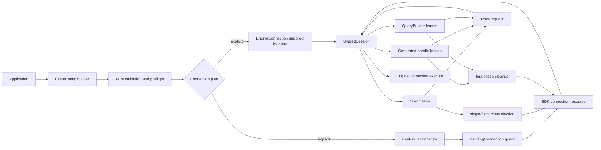

# Design Document: Rust SDK Client Lifecycle and Configuration

## Overview

Feature 2 replaces the Rust SDK's callback-scoped beta connection API with a stable,
owned `Client`. A client can be retained in application state, cloned across tasks,
used to create generated or compositional query handles, and closed explicitly. Every
such value holds a lease on one internal `SharedSession`; it never creates an engine
session merely because a Rust handle was cloned.

The public design follows the capabilities of the definitive Go SDK at
`1309520660f6a5b35ef97b4fbe151e32a06a8dc5`, but deliberately adopts Rust ownership
and error conventions. Go functional options become a validated `ClientConfig`
builder, `Client.Do` becomes `Client::execute`, and `Client.QueryBuilder` becomes a
session-bound `QueryBuilder`. The public API uses `Duration`, typed errors, immutable
query values, and private lifecycle state. Concrete Reqwest, Tokio process, session
credential, and synchronization types remain implementation details.

The client API is intentionally explicit about the generated root. Calling
`client.query()` returns a generated `Query` handle on the same session. `Client` does
not implement `Deref<Target = Query>` and the generator does not copy every root method
onto `Client`: either approach would make schema growth collide with the stable client
namespace. This adds one explicit method call while keeping the 1.0 API evolvable.

The beta callback APIs `connect(callback)` and `connect_opts(config, callback)` are
removed rather than retained as a second lifecycle model. The stable functions are
`connect()` and `connect_with(config)`, both of which return an owned client. Feature 9
will publish the mechanical migration. The conditional closure-helper criteria in
Requirements 2.13-2.15 therefore do not apply to the target API.

Shutdown is a single-flight state machine. The caller that wins `Open -> Closing`
starts an SDK-owned shutdown task; every caller, including the winner, waits on the
same recorded outcome. Consequently, cancelling one `Client::close` future cancels
only that waiter and cannot strand the session in `Closing`. Dropping the final handle
starts the same shutdown path without blocking the destructor when a Tokio runtime is
available, and uses the resource's synchronous kill-on-drop backstop otherwise.

## Dependencies and Non-Goals

### Owning relationships

- Feature 1 owns Capability_ID format, evidence validation, derived completeness
  artifacts, and status policy. Feature 2 extends its routing and policy inventory; it
  does not create a parallel parity list.
- Feature 2 owns the public client, shared lifecycle, configuration model, explicit
  connection abstraction, raw GraphQL value model, safe query-composition facade, and
  generator storage changes necessary to retain a session lease.
- Feature 3 implements connection-source precedence, CLI discovery and download,
  process launch, authentication, OpenTelemetry propagation, the concrete HTTP
  connection, and detailed transport failures behind the interfaces defined here.
- Feature 4 owns schema coverage and generated binding semantics. Feature 2 may replace
  a generated handle's lifecycle fields, but it does not add, remove, or reinterpret a
  schema field or method.
- Feature 8 owns live platform and engine conformance beyond the focused Feature 2
  tests. Feature 9 owns beta migration material, examples, publication, and the final
  SemVer gate.

### Dependency changes

- `url` becomes a direct workspace dependency used privately to validate absolute
  runner-host URIs. A transitive copy is not treated as an API dependency.
- `proptest` is enabled for `dagger-sdk` development tests; it already exists in the
  workspace and lockfile.
- `loom` is added as a development dependency for the small lifecycle election model.
  Production synchronization continues to use the standard library and Tokio.
- `trybuild` is added as a development dependency for public-encapsulation and
  compile-time trait tests.
- Existing `async-trait`, `futures`, `serde`, `serde_json`, `thiserror`, `tokio`, and
  `tracing` dependencies are reused.

Every new dependency remains covered by locked Cargo builds, `cargo deny check`,
Dependabot, and the workspace `unsafe_code = "deny"` policy.

### Non-goals

- Feature 2 does not make CLI selection, provisioning, HTTP authentication,
  observability propagation, or retry semantics complete; those remain Feature 3.
- Feature 2 does not claim every generated type or operation is correct; that remains
  Feature 4 even though all generated handles adopt the new session storage.
- Feature 2 does not expose the HTTP client, child process, authentication header,
  session token, lifecycle atomics, notification primitive, or mutable `Selection`.
- Feature 2 does not retain `config_path`, `timeout_ms`, `execute_timeout_ms`, the
  callback-scoped `connect` signature, or `connect_opts` in the stable API.
- Feature 2 does not add a default complete-request timeout. Session startup, HTTP
  connection establishment, and complete GraphQL execution remain distinct phases.
- Feature 2 does not make `EngineConnection::close` generally idempotent. The client
  owns idempotency and invokes the transferred operation once.
- Feature 2 does not promise delivery of diagnostics after final-handle drop. Explicit
  close is the deterministic cleanup and diagnostic-flush boundary.

### Conditional requirement applicability

| Criteria | Decision | Evidence treatment |
|---|---|---|
| Requirements 2.13-2.15 | Inapplicable because the target exposes no closure-scoped convenience API | Record reviewed decision evidence with the three rows; Feature 9 records the beta callback migration |

If a closure helper is proposed later, all three criteria become applicable together;
it cannot be introduced as a connection path with independent lifecycle semantics.

## Repository Layout

The public facade is separated from private adapters so `lib.rs` can enumerate every
intentional 1.0 re-export.

```text
sdk/rust/crates/dagger-sdk/src/
├── lib.rs                 # private modules plus intentional stable re-exports
├── client.rs              # Client, connect, connect_with
├── config.rs              # ClientConfig, builder, preflight and launch projection
├── connection.rs          # public EngineConnection contract and connection errors
├── diagnostic.rs          # optional progress sink contract
├── graphql.rs             # RawRequest, RawResponse and GraphQL error value types
├── query.rs               # public QueryBuilder over private Selection
├── lifecycle.rs           # private SharedSession state machine and SessionHandle
├── connector.rs           # private Feature 3 seam and pending-connection guard
├── errors.rs              # stable public error enums
├── core/                  # private concrete Feature 3 adapters during migration
└── gen.rs                 # generated handles containing private SessionHandle + Selection

sdk/rust/crates/dagger-codegen/src/rust/
├── functions.rs           # generated construction and execution through SessionHandle
└── templates/
    ├── object_tmpl.rs     # private handle storage and Loadable construction
    └── interface_tmpl.rs  # same storage contract for generated interfaces

sdk/rust/crates/dagger-sdk/tests/
├── client_lifecycle.rs    # state-machine and cancellation integration tests
├── client_config.rs       # deterministic validation and launch projection
├── raw_graphql.rs         # raw codec and partial-data tests
├── public_api.rs          # Send + Sync and supported surface assertions
└── ui/                    # trybuild cases proving internals are inaccessible
```

`core` becomes a private migration namespace. No `pub mod core` remains at the crate
root. Types which remain public are re-exported individually from their owning module.

## Architecture



### Connection pipeline

`connect_with` consumes a `ClientConfig`; consuming the value is required because an
explicit connection transfers a unique resource. Determinism means that repeated
projection of equivalent configuration and the same process inputs produces identical
launch requests, not that a consumed explicit connection can be connected twice.

1. The builder performs structural validation without filesystem, process, network,
   environment, or CLI access.
2. Preflight first detects an explicit connection. It validates its conflicts without
   reading Dagger session environment variables or probing the filesystem, then creates
   an injected plan.
3. Without an explicit connection, preflight validates the workdir against current
   filesystem state and snapshots only the process inputs needed for source selection.
4. Preflight resolves source-dependent option compatibility before CLI discovery,
   download, process creation, or network access.
5. `Connector::connect` establishes the selected resource under the session-startup
   timeout. Its `PendingConnection` guard owns any child and I/O tasks until all
   connection parameters and transport state have been accepted.
6. A successful resource is moved into `SharedSession`; only then is the guard
   disarmed and an owned `Client` returned.

The explicit path never constructs or calls a `Connector`. The default connector is a
private adapter implemented by Feature 3; tests inject a recording connector to prove
the side-effect boundary.

### Request pipeline

All request forms converge on `SharedSession::execute`:

1. Raw callers provide a `RawRequest` directly.
2. A generated handle builds a private immutable `Selection`, converts it to a
   `RawRequest`, and decodes the selected data from the resulting `RawResponse`.
3. A public `QueryBuilder` performs the same conversion using its session lease.
4. `SharedSession` checks `Open` immediately before calling the connection. No global
   request mutex is held; independent requests and query construction can proceed
   concurrently.
5. If configured, one outer timeout bounds the complete connection `execute` future.
   The concrete HTTP connection independently applies its HTTP-connect timeout.
6. If close changes the lifecycle while a request is in flight, a connection failure
   is mapped to `RequestError::InterruptedByClose`; caller cancellation simply drops
   that request future and leaves the shared lifecycle open.

Raw execution returns GraphQL `data`, `errors`, and `extensions` together. Generated
execution cannot return a partially decoded typed value, so non-empty GraphQL errors
produce `QueryError::GraphQl`, which owns the complete `RawResponse` and therefore does
not discard partial data.

## Components and Interfaces

The signatures below define the intended stable shape. Exact derives and constructor
ergonomics may be refined during implementation without weakening the contracts.

### Public client facade

```rust
pub async fn connect() -> Result<Client, ConnectError>;

pub async fn connect_with(config: ClientConfig) -> Result<Client, ConnectError>;

#[derive(Clone)]
pub struct Client {
    session: SessionHandle,
}

impl Client {
    #[cfg(feature = "gen")]
    pub fn query(&self) -> Query;
    pub fn query_builder(&self) -> QueryBuilder;
    pub async fn execute(&self, request: RawRequest) -> Result<RawResponse, RequestError>;
    pub async fn close(&self) -> Result<(), CloseError>;
}
```

`Client::query` (available with the existing `gen` feature) and
`Client::query_builder` clone only a `SessionHandle`; neither performs I/O.
`Client::close` borrows the client so all clones can observe and repeat the terminal
result. There is no public lifecycle-state mutator or resource accessor.

### Configuration

```rust
pub struct ClientConfig { /* immutable, private fields */ }

pub struct ClientConfigBuilder { /* private candidate values */ }

impl ClientConfig {
    pub fn builder() -> ClientConfigBuilder;
}

impl Default for ClientConfig {
    fn default() -> Self;
}

impl ClientConfigBuilder {
    pub fn workdir(self, path: impl Into<PathBuf>) -> Self;
    pub fn workspace(self, workspace: impl Into<String>) -> Self;
    pub fn diagnostic_sink(self, sink: Arc<dyn DiagnosticSink>) -> Self;
    pub fn load_workspace_modules(self, enabled: bool) -> Self;
    pub fn connection(self, connection: Box<dyn EngineConnection>) -> Self;
    pub fn version(self, version: impl Into<String>) -> Self;
    pub fn verbosity(self, verbosity: u64) -> Self;
    pub fn runner_host(self, runner_host: impl Into<String>) -> Self;
    pub fn environment(self, key: impl Into<OsString>, value: impl Into<OsString>) -> Self;
    pub fn session_startup_timeout(self, timeout: Duration) -> Self;
    pub fn http_connect_timeout(self, timeout: Duration) -> Self;
    pub fn graphql_execution_timeout(self, timeout: Duration) -> Self;
    pub fn build(self) -> Result<ClientConfig, ConfigError>;
}
```

The builder stores `u64` verbosity until `build`, then validates conversion to `u8`.
It stores timeouts as `Duration`; no public unit-encoded integer exists. Internally,
defaulted options retain a `was_explicitly_set` bit. Thus an explicit connection can
use the ordinary 300-second and 10-second defaults without conflict, while explicitly
setting an inapplicable startup or HTTP-connect timeout is rejected.

Builder validation is pure and covers empty strings, version syntax, runner URI
syntax, timeout positivity, verbosity range, environment shape, reserved keys,
case-insensitive duplicates, and conflicts knowable from the value itself. Preflight
validates filesystem state and source-dependent conflicts. Both use `ConfigError` and
neither panics.

`ClientConfig` has a hand-written `Debug` implementation. It reports which options are
present and the environment-key names, but never environment values, a diagnostic-sink
value, or an explicit connection's debug representation.

### Diagnostic sink

```rust
#[derive(Clone, Copy, Debug, Eq, PartialEq)]
pub enum DiagnosticStream {
    Stdout,
    Stderr,
    Lifecycle,
}

pub struct Diagnostic<'a> {
    pub stream: DiagnosticStream,
    pub payload: &'a [u8],
}

pub trait DiagnosticSink: Send + Sync + 'static {
    fn emit(&self, diagnostic: Diagnostic<'_>) -> Result<(), DiagnosticSinkError>;
}
```

`emit` is documented as a prompt, non-blocking callback. One private dispatcher
serializes events in ingestion order; source readers preserve byte order within each
stream. The session-parameter control line is consumed before the dispatcher and can
never become a diagnostic. Sink errors are recorded as redacted tracing events and do
not fail connection or close. The dispatcher catches a sink panic, emits the same
redacted failure event, and disables that sink. Final-handle drop never calls the user
sink directly.

### Explicit connection abstraction

```rust
#[async_trait::async_trait]
pub trait EngineConnection: Send + Sync + 'static {
    async fn execute(
        &self,
        request: RawRequest,
    ) -> Result<RawResponse, EngineConnectionError>;

    async fn close(&self) -> Result<(), EngineConnectionError>;

    fn abort(&self);
}
```

Ownership of the boxed implementation transfers into `ClientConfig` and then the
client. `close` is the graceful asynchronous operation and is invoked once by the
shared close election. `abort` is the required non-blocking, non-panicking backstop for
an abandoned close or a destructor without a compatible runtime; implementations make
it idempotent with their own `Drop` backstop. Cancelling one `execute` future must not
invalidate unrelated requests. The client catches an unwinding panic from an injected
`execute`, `close`, or `abort` implementation and converts it to a typed, redacted
failure; SDK-owned code never relies on that containment in place of panic-free paths.

`EngineConnectionError` stores a public error kind and an `Arc<dyn Error + Send +
Sync>` source. Its own `Display` and `Debug` are fixed, redacted summaries; callers can
inspect the source explicitly. This preserves an injected connection's typed source
without allowing the SDK's ordinary rendered error to disclose it.

### Raw GraphQL values

```rust
#[derive(Clone, Debug)]
pub struct RawRequest {
    query: String,
    variables: Option<serde_json::Value>,
    operation_name: Option<String>,
}

impl RawRequest {
    pub fn new(query: impl Into<String>) -> Self;
    pub fn with_variables(self, variables: serde_json::Value) -> Self;
    pub fn with_operation_name(self, operation_name: impl Into<String>) -> Self;
    pub fn query(&self) -> &str;
    pub fn variables(&self) -> Option<&serde_json::Value>;
    pub fn operation_name(&self) -> Option<&str>;
}

#[derive(Clone, Debug, PartialEq)]
pub enum ResponseData {
    Absent,
    Null,
    Value(serde_json::Value),
}

#[derive(Clone, Debug, PartialEq)]
pub struct RawResponse {
    data: ResponseData,
    errors: Vec<GraphQlError>,
    extensions: Option<serde_json::Map<String, serde_json::Value>>,
}
```

`ResponseData` is necessary because `Option<Value>` cannot distinguish a missing
`data` member from `"data": null`. `GraphQlError` preserves message, ordered
locations, a path of typed field/index segments, and an optional extensions object.
All fields have read-only accessors; constructors are provided where test connections
need to return values. The default HTTP codec uses a wire-only deserialization model
with a presence marker before constructing these public values.

### Query construction and generated handles

```rust
#[derive(Clone)]
pub struct QueryBuilder {
    session: SessionHandle,
    selection: Selection,
}

impl QueryBuilder {
    pub fn select(&self, field: impl Into<String>) -> Self;
    pub fn select_with_alias(
        &self,
        alias: impl Into<String>,
        field: impl Into<String>,
    ) -> Self;
    pub fn argument<T: Serialize>(&self, name: impl Into<String>, value: T) -> Self;
    pub async fn document(&self) -> Result<String, QueryBuildError>;
    pub async fn execute<T: DeserializeOwned>(&self) -> Result<T, QueryError>;
}
```

Every method returns a new immutable path, so unrelated construction never locks the
session. Argument serialization errors are stored in the new selection and returned
by `document` or `execute`; a chain-building method never unwraps. Lazy generated ID
arguments similarly resolve to `Result<String, QueryBuildError>`.

The generator changes every generated object and interface from three public fields
(`proc`, `selection`, and `graphql_client`) to two private fields:

```rust
#[derive(Clone)]
pub struct Container {
    session: SessionHandle,
    selection: Selection,
}
```

The root `Query` has the same representation. The sealed half of `Loadable` constructs
handles inside the crate, while the public half retains only bounds required by the
generated root's `r#ref` and `load` methods. Users cannot inject an unrelated session
or transport into a generated value.

### Internal connector seam

```rust
#[async_trait::async_trait]
pub(crate) trait Connector: Send + Sync {
    async fn connect(
        &self,
        request: ConnectionRequest,
    ) -> Result<Box<dyn EngineConnection>, ConnectError>;
}

pub(crate) struct PendingConnection {
    child: Option<tokio::process::Child>,
    io_tasks: Vec<tokio::task::JoinHandle<()>>,
    armed: bool,
}
```

`PendingConnection` is created before spawning the CLI. Its failure path asynchronously
terminates and reaps the child and joins or aborts I/O tasks before returning. Its
`Drop` path starts termination immediately and transfers reaping to a Tokio task; the
child is configured with `kill_on_drop(true)` as the final no-runtime backstop. Only
`disarm_into_connection` can transfer these resources to the successful concrete
connection.

## Data Models and Invariants

### Configuration projection

Private `ValidatedConfig` contains normalized values and explicitness bits. It projects
with a read-only `ProcessInputs` snapshot into exactly one plan:

```rust
enum ConnectionPlan {
    Explicit { connection: Box<dyn EngineConnection>, execution_timeout: Option<Duration> },
    Existing { params: ExistingSessionParams, request: ExistingConnectionRequest },
    NewCli { request: CliLaunchRequest },
}
```

`CliLaunchRequest` keeps ordered argument and environment vectors. Rendering appends
each option once in this order: workdir, workspace, module loading, version, verbosity;
managed environment is assembled before validated additional environment entries.
The ordering is an internal canonical policy, making equivalent input deterministic
without claiming CLI argument order is semantically significant.

| Selected plan | Compatible configuration | Typed rejection |
|---|---|---|
| Explicit | explicit connection, optional GraphQL execution timeout | any explicitly configured CLI/source/HTTP option -> `ExplicitConnectionConflict` |
| Existing | diagnostic sink, HTTP connect timeout, GraphQL execution timeout, startup timeout | workdir or workspace state -> `ExistingSessionConflict`; other ineffective CLI-only input -> `OptionConflict` |
| New CLI | every non-explicit configuration input | explicit connection is a different plan, never silently ignored |

Environment keys are compared by ASCII lowercase bytes, never locale. Validation
rejects empty keys, `=`, NUL, NUL values, duplicates, and all seven reserved keys from
the requirements before constructing a plan. Values remain `OsString` through process
launch and are never converted for diagnostics.

### Lifecycle state machine

```rust
#[repr(u8)]
enum LifecycleState {
    Open = 0,
    Closing = 1,
    Closed = 2,
}

struct SharedSession {
    state: AtomicU8,
    leases: AtomicUsize,
    abort_started: AtomicBool,
    terminal: OnceLock<TerminalCloseResult>,
    closed: tokio::sync::Notify,
    connection: Arc<dyn EngineConnection>,
    execution_timeout: Option<Duration>,
}

#[derive(Clone)]
struct TerminalCloseResult(Result<(), Arc<CloseFailure>>);
```

The transition table is total:

| Current state | Operation | Effect | Result |
|---|---|---|---|
| `Open` | request | recheck state, invoke connection without a global lock | request result |
| `Open` | close | one compare-exchange elects and spawns shutdown | await terminal result |
| `Open` | final lease drop | elect graceful task, or invoke abort backstop | return immediately |
| `Closing` | request | do not invoke connection | `RequestError::ClientClosed` |
| `Closing` | close | join the existing notification path | recorded terminal result |
| `Closing` | final lease drop | shutdown task already owns a lease | return immediately |
| `Closed` | request | do not invoke connection | `RequestError::ClientClosed` |
| `Closed` | close | read `OnceLock` | recorded terminal result |
| `Closed` | any drop | release memory only | return immediately |

The winner spawns a future containing a `CloseCompletionGuard`. Success, connection
failure, or a caught panic records exactly one terminal result, stores it before the
`Release` transition to `Closed`, and wakes waiters. If the runtime drops the task
before completion, the guard invokes the abort backstop and records
`CloseErrorKind::Interrupted`. Waiters create their notification future before
rechecking `OnceLock`, preventing a lost wake. Reads use `Acquire` ordering.

`SessionHandle` wraps `Arc<SharedSession>` and implements `Clone` by incrementing the
explicit `leases` counter. `Drop` decrements that counter; the value `1` identifies the
final lease and initiates close. `Arc::strong_count` is never used as a lifecycle
decision because internal shutdown ownership must not look like an application handle.
The lease decision and close election are separate: the lifecycle compare-exchange is
the single shutdown correctness boundary. A scheduled shutdown task owns a raw
internal `Arc`, not a lease, so the resource remains alive until the attempt records a
result without postponing final-lease detection. `abort_started` makes every fallback
path converge on one invocation of `EngineConnection::abort`.

New requests are fenced by the `Open -> Closing` transition. A request that passed the
gate before close is allowed to be interrupted by resource shutdown; it cannot be
misreported as a normal transport success after the resource reports cancellation.

### Resource ownership

| Source | `EngineConnection` owns | graceful `close` | `abort` / drop backstop |
|---|---|---|---|
| New CLI | HTTP transport, child stdin, child handle, stdout/stderr tasks | close stdin/transport, terminate if needed, reap child, join I/O tasks | start kill and retain `kill_on_drop` |
| Existing session | HTTP transport only | release transport state | release transport state; never signal external engine |
| Explicit | transferred caller implementation | call implementation once | call implementation's non-blocking backstop once |

No generated handle separately stores a process or transport. This removes the
possibility that one field is cloned while another is accidentally detached from the
lifecycle that owns it.

## Correctness Properties

Every property below becomes a mandatory task and test. Property tests use bounded
generators with deterministic seeds in CI; focused example tests cover human-readable
edge cases.

### Property 1: Exact feature scope and routing preservation

For every successfully verified Feature 2 scope declaration, the sorted existing set
is exactly the declared 23 IDs, its direct SHA-256 digest over compact JSON equals
`sha256:81ad1a4f2efe1604b9091468bd6a6006d598a2a8ae54a94a974acf08d74b8b40`,
and the added policy set is exactly the declared 14 IDs. Re-routing any other row can
change only its owner and blocking gap; status, fingerprint, and evidence references
remain byte-equivalent.

**Validates: Requirements 1.1, 1.2, 1.3, 1.4, 1.5, 1.6, 1.7**

### Property 2: Complete status is evidence-closed

For every candidate Feature 2 status transition with a meaningful Rust counterpart, a
Complete_Status is accepted if and only if same-target implementation and verification
evidence validate. `Inapplicable` instead requires same-target decision evidence and
must carry no contradictory implementation or verification evidence. A residual sibling
dependency always produces an exact blocking gap, and the Feature 2 owner set has no
blocker only when every local and cross-feature obligation validates.

**Validates: Requirements 1.8, 1.9, 1.10, 1.11**

### Property 3: Handles share exactly one session

For every sequence of client clones, generated-handle derivations, query-builder
derivations, and non-final drops, all live values have the same session identity, no
additional connector call occurs, and any handle remains usable while the shared state
is `Open`.

**Validates: Requirements 2.1, 2.2, 2.7, 2.8, 2.9**

### Property 4: Public handles are safely shareable and encapsulated

For every enabled generated schema fixture, `Client`, `QueryBuilder`, root `Query`, and
each representative object/interface handle satisfy `Send + Sync` without unsafe code,
while compile-fail consumers cannot access an HTTP client, child process, credential,
session field, or mutable selection field.

**Validates: Requirements 2.3, 2.4, 2.5, 2.6, 2.10, 2.11, 2.12, 10.10, 10.11, 10.12**

### Property 5: Close linearizes once

For every interleaving of one or more close calls across client and generated handles,
exactly one caller wins `Open -> Closing`, exactly one resource close begins, every
waiter observes the same success or failure value, and the final observable state is
`Closed` even when the elected caller or resource future is cancelled or panics.

**Validates: Requirements 3.1, 3.2, 3.3, 3.4, 3.5, 3.6, 3.7, 3.10, 3.14**

### Property 6: Close respects resource ownership

For every successful close of a new-CLI resource, the child is reaped and its stdout
and stderr tasks terminate before success is recorded. For every Existing_Session
close, no external-engine termination action occurs.

**Validates: Requirements 3.8, 3.9, 3.13**

### Property 7: The close fence prevents new transport work

For every request scheduled relative to the close linearization point, requests whose
gate occurs after `Open` return `ClientClosed` without incrementing the connection call
count; a previously admitted request interrupted by close returns a typed lifecycle or
cancellation error.

**Validates: Requirements 3.11, 3.12, 8.16**

### Property 8: Only the final lease initiates implicit cleanup

For every handle tree and drop order, dropping a non-final lease leaves the state open.
Dropping the final lease elects cleanup once, returns without awaiting asynchronous
work, schedules graceful close when a compatible runtime exists, and otherwise invokes
the non-blocking abort backstop without panicking.

**Validates: Requirements 4.1, 4.2, 4.3, 4.4, 4.9, 4.11**

### Property 9: Pending connection resources cannot escape cancellation

For every connection stage after child or I/O-task creation, failure, startup timeout,
or future cancellation terminates the child, arranges reaping, and terminates every
started I/O task. Ordinary failure waits for reap before returning; cancellation uses
the owned background cleanup path.

**Validates: Requirements 4.5, 4.6, 4.7, 4.8, 9.5, 9.6, 9.11**

### Property 10: Implicit-cleanup diagnostics are secret-safe

For every generated credential, header, environment value, and injected cleanup
failure, implicit cleanup neither panics nor emits any generated secret through the
diagnostic sink, tracing fields, `Display`, or `Debug`.

**Validates: Requirements 4.9, 4.10, 10.5, 10.6, 10.7, 10.8, 10.9**

### Property 11: Configuration construction is total and side-effect free

For every candidate builder input, `build` returns either one normalized config or one
typed `ConfigError`, never panics, performs no external work, uses `Duration` for all
timeouts, rejects every specified invalid scalar, and supplies exactly the documented
defaults when inputs are absent.

**Validates: Requirements 5.1, 5.2, 5.3, 5.4, 5.6, 5.7, 5.8, 5.9, 5.10, 5.11, 5.12, 9.1, 9.2, 9.3, 10.3**

### Property 12: Preflight failure precedes external work

For every structurally valid config and generated process-input snapshot, a preflight
failure returns its typed error while connector, discovery, network, and process-spawn
counters all remain zero.

**Validates: Requirements 5.5, 5.13, 5.14, 5.15**

### Property 13: Stable configuration contains no beta unit/path fields

For every public API compile fixture, `config_path`, `timeout_ms`, and
`execute_timeout_ms` are unavailable; the migration inventory contains each removed or
renamed beta field and its stable replacement.

**Validates: Requirements 5.16, 5.17, 5.18**

### Property 14: CLI launch projection is deterministic and complete

For every valid non-explicit config, projecting twice with equal process inputs yields
byte-equivalent ordered arguments and environment. Every applicable value occurs once,
disabled module loading emits no flag, and verbosity is represented without truncation.

**Validates: Requirements 6.1, 6.2, 6.3, 6.4, 6.5, 6.6, 6.7, 6.8, 6.9, 6.19**

### Property 15: Additional environment validation is portable

For every ordered native key/value vector, validation preserves accepted insertion
order and rejects exactly empty/`=`/NUL keys, NUL values, ASCII-case-insensitive
duplicates, and ASCII-case-insensitive reserved keys without rendering values.

**Validates: Requirements 6.9, 6.10, 6.11, 6.12, 6.13**

### Property 16: Diagnostic delivery is ordered and non-fatal

For every generated progress sequence and sink failure schedule, absence of a sink
produces no callback, presence preserves ingestion order, and any sink error leaves the
connection or close outcome unchanged.

**Validates: Requirements 6.14, 6.15, 6.16**

### Property 17: Source compatibility fails closed

For every config/source pair, all inputs which cannot affect that source produce the
specific invariant or option-conflict error before source work. An explicit connection
bypasses environment selection, discovery, download, and process creation and is moved
into exactly one shared session.

**Validates: Requirements 6.17, 6.18, 7.6, 7.7, 7.8, 7.9, 7.10, 7.11**

### Property 18: Injected execution preserves its abstraction

For every recording `Send + Sync` connection and raw request sequence, the client
delegates raw requests without changing their fields, applies the configured complete
execution timeout, calls asynchronous close through the trait, and preserves any
connection error as the typed source.

**Validates: Requirements 7.1, 7.2, 7.3, 7.4, 7.5, 7.12, 7.13**

### Property 19: Raw GraphQL round-trips protocol information

For every bounded JSON request and response value, encoding and decoding preserve
query, absent/present variables, operation name, absent/null/value data, ordered
errors, locations, typed paths, error extensions, and response extensions. Malformed
request or response forms produce the corresponding typed codec error.

**Validates: Requirements 8.1, 8.2, 8.3, 8.4, 8.5, 8.6, 8.7, 8.8, 8.9, 8.10, 8.11**

### Property 20: Every query surface uses the same session concurrently

For every mix of raw, generated, and compositional requests derived from one client,
the recording connection observes the same session identity; immutable construction
requires no session lock, and concurrent execution does not serialize unrelated
request construction.

**Validates: Requirements 8.12, 8.13, 8.14, 8.15**

### Property 21: Timeout phases are independent and non-poisoning

For every positive triple of startup, HTTP-connect, and optional execution durations,
only the elapsed phase returns its corresponding typed timeout. HTTP-connect or
execution timeout leaves the session open and a later request can succeed; cancelling
one request likewise leaves unrelated requests usable.

**Validates: Requirements 9.4, 9.7, 9.8, 9.9, 9.10, 9.12**

### Property 22: Public failure paths are typed and panic-free

For every generated invalid input and injected failure schedule, connection, request,
query construction, shutdown, and background-task paths return the documented typed
error family, expose no `eyre::Error`, and contain no input-dependent `unwrap` or
`expect` path.

**Validates: Requirements 10.1, 10.2, 10.3, 10.4**

### Property 23: The stable surface is documented and intentionally exported

For every public item in the Feature 2 facade, rustdoc builds with warnings denied,
advanced test hooks are labelled, module documentation states its invariants, and an
API snapshot contains the promised client, config, connection, raw value, and error
types without private implementation modules.

**Validates: Requirements 10.10, 10.13, 10.14, 10.15, 10.16, 10.17, 10.18**

## Error Handling

Public errors use `thiserror` only as an implementation aid; their variants and source
relationships are deliberate API. No public variant contains `eyre::Error`, a raw
authentication value, an environment value, or a concrete Reqwest/Tokio error.
Error enums are `#[non_exhaustive]` so Feature 3 can add source-specific typed failures
without a breaking release; currently specified leaf variants and their semantics
remain stable. `ConfigError`, `ConnectError`, `RequestError`, `QueryError`, and
`CloseError` remain distinct rather than collapsing phase information into one SDK
error.

| Operation | Condition | Public result | Side-effect guarantee |
|---|---|---|---|
| config build | invalid workdir syntax/value | `ConfigError::InvalidWorkdir` | no external work |
| config build | empty workspace | `ConfigError::InvalidWorkspace` | no external work |
| config build | malformed version | `ConfigError::InvalidVersion` | no external work |
| config build | malformed runner URI | `ConfigError::InvalidRunnerHost` | no external work |
| config build | zero timeout | `ConfigError::InvalidTimeout { phase }` | no external work |
| config build | verbosity above `u8` | `ConfigError::VerbosityOutOfRange` | no external work |
| config build | invalid/duplicate/reserved environment key | corresponding `ConfigError` variant with key only | value is never formatted |
| config build | environment value contains NUL | `ConfigError::InvalidEnvironmentValue { index }` | value is never stored in error |
| config build | explicit connection plus an explicitly incompatible input | `ConfigError::ExplicitConnectionConflict` | no process-input or filesystem read |
| preflight | missing/non-directory workdir | `ConnectError::Config(ConfigError::InvalidWorkdir)` | no connector call |
| preflight | Existing_Session workspace invariant | `ConnectError::Config(ConfigError::ExistingSessionConflict)` | no connector call |
| preflight | ineffective source option | `ConnectError::Config(ConfigError::OptionConflict)` | no connector call |
| connect | session-startup timeout | `ConnectError::StartupTimeout { duration }` | pending guard owns cleanup |
| connect | Feature 3 source/provision failure | typed `ConnectError` source variant | pending guard cleans partial resource |
| raw encode | request cannot serialize | `RequestError::RequestEncoding` | connection is not called |
| raw decode | response is malformed | `RequestError::ResponseDecoding` | session remains open |
| request | HTTP connect timeout | `RequestError::TransportConnectTimeout` | session remains open |
| request | complete execution timeout | `RequestError::ExecutionTimeout` | session remains open |
| request | state is Closing/Closed before gate | `RequestError::ClientClosed` | connection is not called |
| request | close interrupts admitted request | `RequestError::InterruptedByClose` | close outcome remains authoritative |
| injected request | connection returns failure | `RequestError::Connection(EngineConnectionError)` | typed source retained |
| injected request | connection future panics | `RequestError::ConnectionPanicked` | panic payload is not rendered; session remains controllable |
| generated build | argument/lazy ID serialization fails | `QueryError::Build(QueryBuildError)` | connection is not called |
| generated response | GraphQL errors are non-empty | `QueryError::GraphQl { response }` | partial data retained in response |
| generated response | selected data cannot decode | `QueryError::Decode(ResponseDecodingError)` | raw response cause retained |
| close | resource close fails | `CloseError::Connection(EngineConnectionError)` | failure recorded and state becomes Closed |
| close | shutdown task is abandoned/panics | `CloseError::Interrupted` / `CloseError::Panicked` | abort backstop runs and waiters wake |
| diagnostic emit | sink returns error/panics | no public operation error | redacted trace only; operation continues |
| implicit drop | cleanup cannot complete | no returned error | no panic; redacted trace/backstop only |

`CloseError` is cloneable through an internal `Arc<CloseFailure>` so every close caller
receives the same terminal information. `Display` messages are static descriptions;
`Debug` includes safe enum fields but omits opaque sources by default. Source access is
still available through `std::error::Error::source` where the caller intentionally
requests it.

## Completeness Contract Integration

Feature 2 replaces `baseline/go-client` with path-bounded, digest-fenced routing rules.
The selector model gains an exact repository-relative source-path predicate so
`dagger.gen.go`, `client.go`, `engineconn/**`, tests, and examples can route without a
1,759-entry override list. Mixed files retain small explicit overrides. Every rule has
an expected expansion digest, so new authority declarations fail Integrity rather than
silently inheriting an owner.

The completeness verifier also gains a `FeatureScopeDeclaration` reader for the exact
heading, digest line, and fenced ID lists in this requirements document. It validates:

- the 23 existing IDs and their recorded digest;
- the 14 newly added `rust-policy` IDs;
- the post-routing Feature 2 owner set;
- ownership-only preservation of status, fingerprint, and evidence; and
- candidate status changes against target-scoped evidence in the same change.

The 14 policy definitions receive pinned spec and `sdk/rust/AGENTS.md` authority
anchors. Routing can land in the Feature 2 implementation before all 23 Go capabilities
become complete. In particular, options whose observable effect is a Feature 3 CLI or
transport behaviour remain `Partial` with an exact Feature 3 blocker until live
verification exists. Ownership correction alone never increases the Implemented count.

## Testing Strategy

### Pure and property tests

- `proptest` generates configuration candidates, environment bytes valid for the host,
  JSON trees, GraphQL errors, secret marker strings, handle-operation sequences, and
  deterministic process-input snapshots.
- A pure reference lifecycle model accepts clone, derive, request, close, cancel-close,
  and drop commands. The real state machine's event log must match its single close
  linearization and request-gate decisions.
- The raw wire codec is tested in both directions, including missing versus null data,
  partial data with errors, mixed field/index paths, and arbitrary extension objects.
- Launch projection snapshots compare structured vectors, not shell-escaped display
  text, so native path and environment values remain portable.
- Secret tests place the same high-entropy marker in tokens, headers, environment
  values, sink failures, and injected error sources, then search all ordinary rendered
  output for that marker.

### Concurrency and cancellation tests

- `loom` explores the close-election atomics, terminal-result publication, waiter wake,
  and final-lease election in a small synchronization model.
- Tokio multi-thread tests use barriers and a recording connection to race close,
  request admission, cancellation, clone drop, and generated-handle drop.
- Paused Tokio time proves startup, HTTP-connect, and execution timeouts fire only at
  their own boundary and do not poison a later request.
- A controllable pending-resource fixture pauses after child creation and after each
  I/O task creation; dropping or failing the connection future must produce terminate,
  reap, and task-end events in the required order.
- A close future is dropped immediately after election to prove the SDK-owned task
  still records the result and wakes a later close caller.

### Compile, documentation, and API tests

- Generic compile assertions prove `Client`, `QueryBuilder`, `Query`, and representative
  object/interface handles implement `Send + Sync`.
- `trybuild` pass cases implement an injected `EngineConnection`; compile-fail cases
  attempt to access client, generated-handle, selection, process, transport, and
  credential internals or the removed beta config fields.
- Rustdoc runs with warnings denied and doctests demonstrate owned connect, generated
  query use, raw execution, explicit close, and injected test connections.
- A checked public-API snapshot makes re-exports and removal of `pub mod core`
  reviewable; Feature 9 uses the same snapshot for the stable release gate.
- A source audit rejects `unwrap`, `expect`, `panic!`, and unsafe blocks in the new
  lifecycle, connector, request, shutdown, and background-task paths, with any
  syntactically unavoidable test-only occurrence explicitly excluded.

### Integration and completeness tests

- A recording `Connector` proves invalid preflight and explicit injection never reach
  discovery, download, network, or process stages.
- A recording `EngineConnection` proves request fidelity, concurrency, execution
  timeout, terminal close reuse, and exact close/abort counts.
- A fake CLI resource proves explicit close waits for child reap and I/O-task completion
  while final drop returns immediately.
- Completeness fixture tests perturb one scope ID, route, fingerprint, evidence link,
  and digest at a time and require deterministic Integrity failures.
- Feature 2 evidence is emitted only from target-bound passing tests. Rows depending on
  the Feature 3 concrete connector remain blocked until those engine-backed tests are
  available; the test suite asserts that these blockers cannot be erased locally.

### Required verification commands

Implementation tasks will use the repository Dagger toolchain rather than ad hoc host
commands as their final evidence boundary:

```text
dagger call -m toolchains/rust-sdk-dev check --source=.
dagger call -m toolchains/rust-sdk-dev test --source=.
dagger call -m toolchains/rust-sdk-dev completeness-verify --source=.
```

Focused `cargo test -p dagger-sdk ...` and `cargo test -p
dagger-sdk-completeness ...` commands remain useful during development, but do not by
themselves justify a complete target-scoped ledger status.
