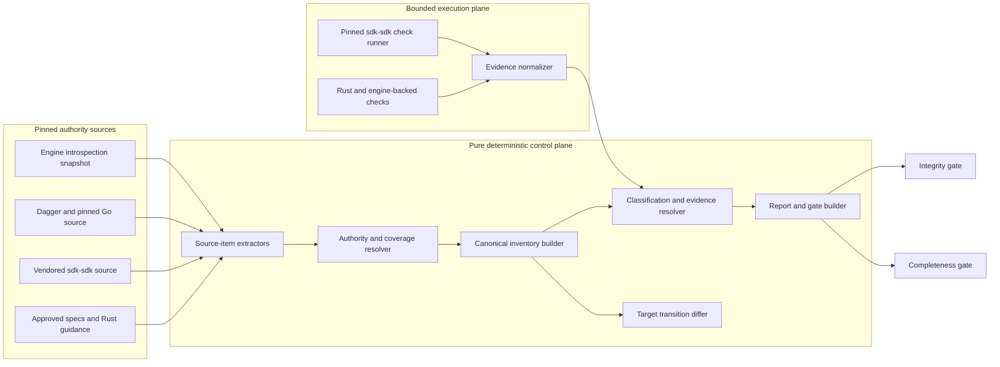

# Design Document: Rust SDK Completeness Contract

## Overview

Feature 1 introduces an internal, non-published Rust contract engine named
`dagger-sdk-completeness`. It deterministically converts pinned authority sources into
four checked-in products: a canonical capability inventory, a fully resolved Rust
completeness ledger, a machine-readable report, and a deterministically equivalent
human report.
The same engine validates evidence, detects authority drift, and constructs explicit
target-transition records.

The design preserves three peer authority scopes from the approved requirements:

- the engine introspection contract is definitive for wire shape;
- `dagger/sdk-sdk` is definitive for the common SDK-module behaviours asserted by its
  pinned black-box checks; and
- the pinned Go client, engine SDK, generator, and tests are the parity reference for
  behaviour outside that common contract.

The initial source identities are Dagger commit
`25300124ca110612edc09c43f89cb5fad6028170`, Go client commit
`1309520660f6a5b35ef97b4fbe151e32a06a8dc5`, and `dagger/sdk-sdk` commit
`8c164424b7a8a37b33a77367ef7547490d5b87b5`. Engine shape is derived from
`cmd/codegen/introspection/introspection.graphql` and the response model in
`cmd/codegen/introspection/introspection.go`. The Go pin is extracted from the
`goSDKLibVersion` string literal in `core/sdk/go_sdk.go`, never from its adjacent
version comment. The harness inventory is derived from the pinned
[`sdk-sdk.dang`](https://github.com/dagger/sdk-sdk/blob/8c164424b7a8a37b33a77367ef7547490d5b87b5/sdk-sdk.dang).

The contract engine deliberately does not depend on `dagger-sdk`, `dagger-codegen`, or
`dagger-bootstrap`. Reusing the SDK's current generated introspection model to certify
that same SDK would create a circular proof. The new crate uses independent, strict
data models and only general workspace dependencies. Its core is synchronous, pure,
and filesystem-free; source loading, Git resolution, process execution, engine
capture, and artifact writes stay in adapters.

## Dependencies and Non-Goals

### Owning relationships

- The approved
  `.kiro/specs/rust-sdk-complete-implementation/requirements.md` owns the Feature 1–9
  programme and the meaning of Go-level completeness.
- This design owns stable Capability_IDs, authority ingestion, classification,
  evidence validation, drift detection, compatibility data, and verdict production.
- Features 2–7 implement client, transport, schema generation, engine SDK, module, and
  client-generation capabilities. They update rows created here; they do not create
  parallel parity lists.
- Feature 8 extends live conformance beyond the common `sdk-sdk` profile and supplies
  Rust-specific evidence for client, transport, observability, semantic, security,
  and platform capabilities.
- Feature 9 consumes validated compatibility data and the Completeness_Verdict for
  release gating and public compatibility publication.
- `toolchains/rust-sdk-dev/main.go` remains the Dagger automation boundary. It already
  captures engine introspection through `DaggerEngine.IntrospectionJSON()` for client
  generation and runs Rust checks in a digest-pinned Rust container. This design adds
  completeness operations to that toolchain rather than creating another CI module.
- `future/sdk-tests.md` and active `core/integration/module_*_test.go` scenarios are
  source inventory for later Feature 8 ports. F1 records their stable identities and
  ownership but does not port them.
- `sdk/rust/AGENTS.md` and `sdk/rust/CONTRIBUTING.md` remain authored contributor
  guidance. F1 updates their source-of-truth wording to the approved peer authority
  scopes so repository instructions cannot contradict the executable contract.

### New dependencies

- `proptest` is added as a workspace development dependency for the mandatory
  property tests. The lockfile pins the resolved graph.
- `semver` is added to the internal contract crate for validated Dagger and Rust
  version ordering in bounded compatibility claims.
- Runtime code reuses `serde`, `serde_json`, `sha2`, `clap`, `thiserror`, and
  `tempfile`, which already exist in the Rust workspace.
- The Go source extractor uses only the Go standard library (`go/ast`, `go/parser`,
  `go/token`, and `go/format`) and therefore adds no Go module dependency.

All additions remain subject to `cargo deny check`, the workspace `unsafe_code =
"deny"` lint, and locked Cargo execution.

### Non-goals

- F1 does not make a currently failing Rust capability pass.
- F1 does not alter `crates/dagger-sdk/src/gen.rs`, SDK ownership, transport,
  provisioning, or module runtime architecture.
- F1 does not infer behavioural semantics from arbitrary Go function bodies. It
  extracts exhaustive source items and requires reviewed atomic capability definitions
  to account for them.
- F1 does not treat generated Go or Rust client bindings as behavioural authority.
- F1 does not execute moving branches, mutable tags, or unpinned remote modules during
  normal verification.
- F1 does not make the common `sdk-sdk` profile a proxy for client generation,
  session/transport behaviour, deep module semantics, or non-`linux/amd64` platforms.
- F1 does not enable the Completeness_Verdict as a required CI gate. The initial
  required gate is Integrity only.
- F1 does not silently update active contract artifacts. Target refresh and evidence
  import render into a staging directory or Dagger Changeset for review.

## Repository Layout and Artifact Format

The implementation adds this layout:

```text
sdk/rust/
├── crates/dagger-sdk-completeness/
│   ├── Cargo.toml                 # publish = false
│   ├── src/                       # pure core, adapters, CLI
│   └── tests/                     # fixture and end-to-end tests
└── completeness/
    ├── README.md                  # contributor workflow and artifact ownership
    ├── extractors/go/             # standard-library Go source-item helper
    ├── target.json                # authored TargetDescriptor
    ├── authorities.json           # authored AuthorityRegistry
    ├── capabilities.json          # reviewed behavioural/policy definitions
    ├── classifications.json       # explicit rows and bounded rules
    ├── harness-mappings.json      # reviewed check scope mappings
    ├── compatibility.json         # authored compatibility claim
    ├── sources/
    │   └── sdk-sdk/<revision>/    # exact pinned remote source subset
    ├── snapshots/
    │   └── schema.json            # raw authoritative engine introspection
    ├── evidence/                  # normalized, target-bound evidence records
    ├── artifacts/
    │   ├── source-items.json      # derived extraction inventory
    │   ├── inventory.json         # derived CanonicalInventory
    │   ├── ledger.json            # derived ResolvedLedger
    │   ├── report.json            # derived CompletenessReport
    │   └── report.md              # deterministic projection of report.json
    └── transitions/               # reviewed immutable TargetTransition records
```

The relevant files under `sources/sdk-sdk/<revision>/` are copied byte-for-byte from
the immutable commit during an explicit refresh. This makes normal locator and check
inventory validation offline and reproducible. The local `sdk/go/**` mirror remains
the offline Go client source; it is not duplicated.

All JSON artifacts use a single canonical encoding:

- UTF-8, LF line endings, two-space indentation, and one trailing newline;
- `#[serde(deny_unknown_fields)]` on every durable object;
- snake_case field names and enum values using the exact policy spellings from the
  requirements, including `Idiomatic_Equivalent`, `subject-conformance`, and
  `not-applicable`;
- recursively lexicographic object keys and explicitly sorted set-like arrays;
- absent optional fields instead of `null`;
- repository-relative `/`-separated paths with neither `.` nor `..` components; and
- digests encoded as `sha256:<64 lowercase hexadecimal characters>`.

Hashes are domain-separated. For example, a Capability_Fingerprint is SHA-256 over
`dagger-rust-sdk-capability-v1\0` followed by the canonical Semantic_Signature bytes.
Artifact, source, rule-expansion, compatibility, and target digests use distinct
domain prefixes. A source digest hashes the ordered sequence of repository-relative
path plus exact content digest, ignoring filesystem metadata and directory iteration
order.

`report.md` is never independently authored. It is rendered solely from the validated
`CompletenessReport`; verification regenerates both report forms and compares their
bytes to the checked-in files.

## Architecture

The control plane derives and validates contract state. The execution plane runs
engine- or CLI-backed checks and produces bounded evidence, but it cannot classify a
capability or widen evidence scope.



### Normal verification

1. Load authored files, pinned source subsets, schema snapshot, evidence, and checked-in
   derived artifacts without network access.
2. Validate the Target_Descriptor and Authority_Registry before reading a path selected
   by either.
3. Extract a fresh ordered SourceItem inventory from the current authoritative source
   bytes and pinned snapshots.
4. Require every SourceItem to be covered by at least one capability definition,
   Harness_Check_Mapping, or explicit authority exclusion.
5. Build the Canonical_Inventory, expand classification rules, validate evidence, and
   construct the Resolved_Ledger.
6. Recompute all derived JSON and Markdown bytes and compare them with the checked-in
   artifacts.
7. Emit all diagnostics in deterministic order, then calculate independent Integrity
   and Completeness verdicts.

Normal verification is read-only. A false Completeness_Verdict is expected during the
programme; only structural, evidence-shape, source-drift, or derived-artifact mismatch
failures make Integrity false.

### Explicit target refresh

1. Accept a candidate Target_Descriptor whose repositories and revisions are immutable.
2. Resolve local Git objects and fetch only missing immutable remote commits into an
   isolated temporary directory. A branch name or unresolved tag is rejected.
3. Capture the candidate engine schema, copy the selected `sdk-sdk` source subset, and
   extract all authority SourceItems.
4. Build a candidate inventory and compare it with the validated current inventory.
5. Render the candidate artifacts and TargetTransition into a new staging directory.
6. Require reviewed classifications for additions, evidence revalidation for semantic
   changes, historical records for removals, and SemVer/migration decisions before a
   candidate can pass Integrity.

The command never replaces the active `completeness/` tree. The Dagger wrapper exposes
the staged output as a Changeset, preserving normal repository review and generation
semantics.

### Harness execution

The harness runner enumerates the pinned mapping inventory and executes each check
through the public `dagger check <check-id> --no-generate` interface against the Rust
SDK workspace. It supplies the exact configured `sdk_contract_cli_version`, immutable
module revision, and platform rather than accepting the harness default. Check IDs are
the public CLI identities obtained from the pinned check listing; source locators keep
the corresponding Dang function identity. Running checks individually gives every
outcome a stable identity without parsing presentation-oriented TUI output.

The initial pinned source exports 18 `@check` functions: 17 exercise the subject SDK,
while `initModuleRendersRootType` exercises `sdk-sdk` itself. The latter is always
classified `harness-self`, carries no Capability_IDs, and may affect harness integrity
only. Subject-check failures produce `Missing` or `Partial` evidence state; they do not
make Integrity false merely because Rust is incomplete.

The runner records only normalized command identity, target digest, verified CLI
artifact digest, platform, check identity, outcome, and output digests. Raw logs remain
ephemeral because they may contain host paths or sensitive process output. Only a
passing `subject-conformance` result whose declared scope matches its mapping can
become Verification_Evidence.

## Components and Interfaces

### Contract crate (`sdk/rust/crates/dagger-sdk-completeness`)

The crate contains a library and a thin binary. Library modules are arranged by
responsibility:

```text
src/
├── canonical.rs       # canonical JSON, ordering, domain-separated digests
├── model.rs           # durable and internal types
├── target.rs          # target and compatibility validation
├── authority.rs       # registry validation, source coverage, precedence
├── extract/
│   ├── schema.rs      # independent introspection extraction
│   ├── go.rs          # adapter for normalized Go helper output
│   ├── harness.rs     # pinned @check inventory
│   └── policy.rs      # reviewed policy locator inventory
├── inventory.rs       # capability construction and fingerprinting
├── classification.rs  # exact rule expansion and status entry rules
├── evidence.rs        # locator, target, platform, and outcome audit
├── transition.rs      # semantic target diff and historical preservation
├── report.rs          # counts, verdicts, JSON and Markdown projections
├── diagnostic.rs      # total stable diagnostic-code mapping
├── io.rs              # repository path and atomic staging adapters
├── command.rs         # argv-only process adapter and environment allowlist
├── cli.rs             # command definitions and exit policy
└── main.rs            # argument parsing and rendering only
```

Representative pure interfaces:

```rust
pub fn derive_source_items(
    target: &TargetDescriptor,
    registry: &AuthorityRegistry,
    sources: &SourceBundle,
) -> Validation<SourceItemInventory>;

pub fn build_inventory(
    source_items: &SourceItemInventory,
    definitions: &CapabilityDefinitions,
    harness: &HarnessMappings,
) -> Validation<CanonicalInventory>;

pub fn resolve_ledger(
    inventory: &CanonicalInventory,
    classifications: &ClassificationInput,
    evidence: &EvidenceRegistry,
) -> Validation<ResolvedLedger>;

pub fn build_report(
    target: &TargetDescriptor,
    inventory: &CanonicalInventory,
    ledger: &ResolvedLedger,
    diagnostics: &[Diagnostic],
) -> CompletenessReport;

pub fn diff_targets(
    from: &ValidatedContract,
    to: &CandidateContract,
) -> Validation<TargetTransition>;
```

`Validation<T>` accumulates independent diagnostics instead of returning after the
first error. Ordering is applied only at the boundary, using `(diagnostic_code,
subject_id, locator)`.

### Source bundle and coverage resolver

`SourceBundle` is an in-memory `BTreeMap<RepositoryRelativePath, Vec<u8>>`. I/O adapters
must resolve every included path beneath its registered repository root, reject
symlink escape and parent traversal, and return exact bytes. Extractors cannot open
additional files themselves.

Each extractor emits `SourceItem` records. Schema elements, exported Go declarations,
active Go test/subtest identities, removed-test handoff rows, harness checks, and Rust
policy clauses therefore share one coverage mechanism. A SourceItem must be:

- the primary source of one or more atomic capabilities;
- a non-primary reference anchor attached to a capability; or
- explicitly excluded with the exact rationale registered by the authority.

Uncovered items and stale exclusions fail Integrity. This is how human-authored
behaviour descriptions remain exhaustive without pretending a parser can infer all
observable semantics from source code.

### Schema extractor

The schema extractor deserializes the exact response requested by
`cmd/codegen/introspection/introspection.graphql`, including `__schemaVersion`, roots,
deprecated fields and inputs, nested TypeRefs, interfaces, possible types, enum values,
defaults, descriptions, directive definitions, and applied directives. It defines its
own strict GraphQL introspection types and does not use
`dagger_sdk::core::introspection`.

Raw meta-types and other non-public elements are removed only by registered policy.
All remaining elements become atomic schema capabilities. Ordering in the raw response
does not affect coordinates, fingerprints, or output bytes.

### Go source extractor (`sdk/rust/completeness/extractors/go`)

A standard-library-only Go helper parses the registered Go Source_Sets at the selected
revision. It emits normalized JSON containing:

- exported package declarations and complete public type/function signatures;
- methods, parameters, results, type parameters, constants, and deprecation markers;
- stable test and literal subtest identities, with skipped state preserved;
- exact source locators and normalized AST fingerprints; and
- the evaluated `goSDKLibVersion` string literal from `core/sdk/go_sdk.go`.

Dynamic subtest names that cannot be statically enumerated remain attached to their
parameterized parent and test-table source item. The checked-in capability definition
then records the finite SDK/language cases selected by authority policy. Generated
bindings are excluded before behavioural definition and remain represented by schema
capabilities.

The Rust adapter validates the helper's format and canonicalizes it again. Rust is the
only component allowed to construct Capability_IDs, ledger rows, evidence, or verdicts.

### Harness source extractor

The harness extractor uses a small string/comment-aware Dang lexical scanner over the
vendored source. It recognizes public function declarations annotated `@check`, keeps
balanced signatures and bodies for semantic fingerprinting, and rejects syntax it
cannot classify. It is intentionally not a permissive regular expression: an upstream
grammar change becomes an extractor-version transition requiring review. The extracted
function set is cross-checked with the pinned public `dagger check --list` identities
captured during refresh.

### Inventory builder and authority precedence

Schema capabilities receive IDs directly from canonical coordinates. Behavioural and
policy capabilities come from reviewed definitions in `capabilities.json`. IDs use:

```text
schema/<authority-id>/<schema-kind>/<escaped-coordinate>
behavior/<authority-id>/<semantic-coordinate>
policy/<authority-id>/<semantic-coordinate>
```

Coordinates contain lowercase ASCII segments separated by `/`; names originating in
the schema use reversible percent-encoding. IDs never contain line numbers, commit
labels, or implementation paths.

When `sdk-sdk` and Go cover the same common lifecycle behaviour, one capability uses
the `sdk-contract-harness` authority as its primary definition and retains the Go item
as a reference anchor. Competing primary semantic signatures for one ID are rejected
as `CAPABILITY_DUPLICATE`. A harness assertion incompatible with the selected engine
target is rejected as `SDK_CONTRACT_TARGET_MISMATCH`; precedence is never used to hide
target incompatibility.

### Classification and ledger resolver

`classifications.json` contains exact records and compact rules. The rule selector
language is intentionally non-programmable: conjunctions of exact `authority_id`,
`capability_kind`, `stability`, `source_item_kind`, and `capability_id_prefix`
predicates. It has no regex, scripts, filesystem access, negative match, or predicate
over classification output. Each rule stores either its full ordered expected
Capability_ID set or the domain-separated digest of that set.

Resolution expands rules, applies exact-ID overrides, rejects overlaps, then requires
exactly one classification for every Active_Capability. The resolved artifact contains
one explicit row per capability even when the authored input used a rule. Status entry
validation is implemented as a closed state machine over the five approved statuses;
unknown status strings fail deserialization.

### Evidence auditor

Commands are stored as an argv vector plus repository-relative working directory and
an explicit environment allowlist, never as a shell string. Evidence locators are
validated against the SourceItem inventory or exact repository bytes at the pinned
revision. Verification evidence additionally binds:

- the Target_Descriptor digest;
- exact CLI/engine and, where applicable, CLI artifact digest;
- operating system and architecture scope;
- stable assertion or check identity;
- normalized expected and observed outcomes; and
- the exact ordered Capability_ID set proved.

Documentation, issue, PR, skipped-test, removed-test, failed-check, and harness-self
records remain useful authority or decision evidence but are ineligible as passing
Verification_Evidence. Shared evidence is expanded back to every ledger row it proves.
If `go_sdk_version_label` is present, target validation also requires immutable
ref-resolution evidence recording the label, Git ref object, and peeled commit observed
during explicit refresh. Normal verification checks that record offline; the initial
mismatched `v0.21.7` comment is not placed in the optional target field.

### Transition and compatibility engines

The transition differ compares Capability_ID sets, Capability_Fingerprints, authority
source digests, and Harness_Check fingerprints. Removed capabilities retain their full
prior ledger rows. Changed capabilities lose eligibility for prior passing evidence
until the evidence target and assertion are revalidated. Added capabilities must be
classified before the candidate Integrity_Verdict can pass.

Compatibility uses either an exact ordered target set or an inclusive SemVer range
whose lower and upper boundaries are full Target_Descriptors. Both boundaries require
passing conformance evidence. Public Rust stability is independent of Go API shape:
stable, experimental, internal, and not-applicable are explicit values, and a reviewed
transition supplies `none`, `additive`, `deprecation`, or `breaking` SemVer effect.

### CLI

The binary exposes four commands:

```text
dagger-sdk-completeness verify --root <repo> --gate integrity|completeness --format human|json
dagger-sdk-completeness render --root <repo> --output <empty-staging-dir>
dagger-sdk-completeness transition --root <repo> --candidate <target.json> --output <empty-staging-dir>
dagger-sdk-completeness import-evidence --root <repo> --run <run.json> --output <empty-staging-dir>
```

`verify` performs no writes. `render`, `transition`, and `import-evidence` refuse an
existing non-empty output directory and never edit the active tree. Exit status is `0`
when the selected gate is true, `1` when a complete report is produced but the selected
gate is false, and `2` when an I/O or invocation failure prevents a complete report.
Human diagnostics go to stderr; the selected report representation goes to stdout.

### Dagger Rust toolchain (`toolchains/rust-sdk-dev`)

The toolchain's source filter adds `sdk/rust/completeness/**`. A new
`completeness.go` provides:

```go
// +check
func (t *RustSdkDev) CompletenessIntegrity(ctx context.Context) error

// +generate
func (t *RustSdkDev) CompletenessArtifacts() *dagger.Changeset

func (t *RustSdkDev) CompletenessHarness(ctx context.Context) *dagger.File
```

`CompletenessIntegrity` runs the offline Integrity gate. `CompletenessArtifacts`
captures the engine schema through the existing `DaggerEngine.IntrospectionJSON()`
path, renders into staging, and returns only the resulting Changeset. The initial
`CompletenessHarness` is callable but not annotated `+check`, because expected subject
failures must not make the programme's Integrity CI red. It returns a normalized run
file suitable for `import-evidence`. Feature 8 may promote profiles to required checks
as their owned capabilities become complete.

The Dagger path runs the Go helper in a digest-pinned Go container compatible with the
root `go.mod` directive, then passes only its normalized JSON to the digest-pinned Rust
container. Image identity becomes part of tool evidence rather than affecting
canonical capability semantics.

## Data Models

All durable structs derive `Serialize`, `Deserialize`, `Eq`, and `Clone`, use
`deny_unknown_fields`, and validate through constructors before becoming their
corresponding `Validated*` newtype.

### Identity and source models

```rust
struct TargetDescriptor {
    contract_format_version: FormatVersion,
    dagger_repository: RepositoryId,
    dagger_revision: CommitSha,
    engine_version: DaggerVersion,
    schema_version: String,
    schema_digest: Digest,
    go_sdk_repository: RepositoryId,
    go_sdk_revision: CommitSha,
    go_sdk_version_label: Option<String>,
    sdk_contract_repository: RepositoryId,
    sdk_contract_revision: CommitSha,
    sdk_contract_cli_version: DaggerVersion,
    rust_sdk_version: SemverVersion,
    rust_edition: RustEdition,
    rust_version: SemverVersion,
    previous_target: Option<TargetDigest>,
}

struct AuthoritySource {
    authority_id: AuthorityId,
    authority_class: AuthorityClass,
    repository: RepositoryId,
    revision: CommitSha,
    include: Vec<SourceSelector>,
    exclude: Vec<SourceExclusion>,
    extractor: ExtractorIdentity,
    source_digest: Digest,
}

struct SourceItem {
    source_item_id: SourceItemId,
    authority_id: AuthorityId,
    item_kind: SourceItemKind,
    locator: SourceLocator,
    semantic_signature: CanonicalValue,
    fingerprint: Digest,
    state: SourceItemState,
}
```

`TargetDescriptor` and `AuthoritySource` fields correspond one-for-one with their
requirements policy tables. `SourceItem` is an internal exhaustiveness layer:
`SourceItemState` is `active`, `deprecated`, `skipped`, `removed`, or `harness-self`.
Only active/deprecated target behaviours can become Active_Capabilities; the other
states remain coverage and audit evidence.

### Capability and classification models

```rust
struct CapabilityDefinition {
    capability_id: CapabilityId,
    authority_id: AuthorityId,
    capability_kind: CapabilityKind,
    source_item_ids: Vec<SourceItemId>,
    source_anchors: Vec<EvidenceReference>,
    summary: String,
    semantic_signature: CanonicalValue,
    capability_fingerprint: Digest,
    stability: Stability,
}

struct ClassificationRule {
    rule_id: RuleId,
    authority_id: AuthorityId,
    selector: ClassificationSelector,
    expected_capability_ids: ExpectedSet,
    classification: ClassificationValues,
    overrides: BTreeMap<CapabilityId, ClassificationValues>,
}

struct ClassificationValues {
    status: Status,
    gap: Option<String>,
    owner_feature: Option<FeatureId>,
    implementation_evidence: Vec<EvidenceId>,
    verification_evidence: Vec<EvidenceId>,
    decision_evidence: Vec<EvidenceId>,
}

struct CapabilityRecord {
    definition: CapabilityDefinition,
    classification: ClassificationValues,
}
```

The canonical serializer flattens `CapabilityRecord` to the exact Capability Record
field surface defined in the requirements. `Status`, `Stability`, and `FeatureId` are
closed enums; Feature ownership accepts only Features 2–9.

### Harness and evidence models

```rust
struct HarnessCheckMapping {
    check_id: CheckId,
    check_kind: HarnessCheckKind,
    harness_revision: CommitSha,
    source_locator: SourceLocator,
    capability_ids: Vec<CapabilityId>,
    execution_target: TargetDigest,
    platform_scope: Vec<Platform>,
    invocation: CommandSpec,
    expected_outcome: ExpectedOutcome,
    verification_evidence: Option<EvidenceId>,
    limitations: Vec<String>,
}

struct CommandSpec {
    program: ExecutableId,
    args: Vec<String>,
    working_directory: RepositoryRelativePath,
    environment: BTreeMap<String, String>,
}

struct EvidenceReference {
    evidence_id: EvidenceId,
    evidence_kind: EvidenceKind,
    repository: RepositoryId,
    revision: CommitSha,
    path: RepositoryRelativePath,
    locator: SourceLocator,
    claim: String,
    command: Option<CommandSpec>,
    expected_outcome: Option<ExpectedOutcome>,
    execution_target: Option<TargetDigest>,
    platform_scope: Vec<Platform>,
    proved_capability_ids: Vec<CapabilityId>,
}

struct HarnessCheckResult {
    check_id: CheckId,
    check_kind: HarnessCheckKind,
    target: TargetDigest,
    cli_artifact_digest: Digest,
    platform: Platform,
    outcome: CheckOutcome,
    stdout_digest: Digest,
    stderr_digest: Digest,
}

struct ConformanceScenario {
    scenario_id: ScenarioId,
    source_anchors: Vec<EvidenceReference>,
    observable_behavior: CanonicalValue,
    capability_ids: Vec<CapabilityId>,
    harness_adapter: HarnessAdapter,
    invocation: CommandSpec,
    expected_outcome: ExpectedOutcome,
}

enum HarnessAdapter {
    SdkTarget,
    ModTest,
}
```

The extra stable IDs and proved-capability set make references deduplicable and
auditable; the canonical Resolved_Ledger expands them to the requirements' evidence
field shape. `harness-self` requires an empty Capability_ID set. `ConformanceScenario`
is the extension boundary consumed by Feature 8: every port records its source
behaviour independently of Go command syntax and selects exactly one public harness
adapter. Command environments accept only documented non-secret keys; session tokens
and credentials are never durable fields.

### Transition, compatibility, and report models

```rust
struct TargetTransition {
    from_target: TargetDigest,
    to_target: TargetDescriptor,
    added_capabilities: Vec<CapabilityId>,
    removed_capabilities: Vec<HistoricalCapabilityRecord>,
    changed_capabilities: Vec<CapabilityChange>,
    authority_changes: Vec<AuthorityChange>,
    harness_changes: Vec<HarnessCheckChange>,
    semver_effect: SemverEffect,
    migration_requirements: Vec<SpecReference>,
}

enum SupportedTargets {
    Exact(Vec<TargetDigest>),
    InclusiveRange {
        lower: TargetDigest,
        upper: TargetDigest,
    },
}

struct CompatibilityClaim {
    rust_sdk_version: SemverVersion,
    supported_targets: SupportedTargets,
    range_boundaries: Vec<TargetDigest>,
    conformance_evidence: Vec<EvidenceId>,
    outside_range_capability: CapabilityId,
    claim_digest: Digest,
}

struct CompletenessReport {
    contract_format_version: FormatVersion,
    target_descriptor: TargetDescriptor,
    inventory_digest: Digest,
    ledger_digest: Digest,
    integrity_verdict: bool,
    completeness_verdict: bool,
    counts_by_authority: BTreeMap<AuthorityId, u64>,
    counts_by_kind: BTreeMap<CapabilityKind, u64>,
    counts_by_status: BTreeMap<Status, u64>,
    counts_by_owner: BTreeMap<FeatureId, u64>,
    integrity_errors: Vec<Diagnostic>,
    blocking_capabilities: Vec<CapabilityId>,
    complete_exceptions: Vec<CompleteException>,
}
```

These fields correspond one-for-one with the Target Transition, Compatibility Claim,
and Completeness Report policy tables. `harness_changes` is the explicit representation
required by Requirement 12.12.

`counts_by_authority` counts each capability once under its primary authority; reference
anchors do not inflate totals. `CompleteException` contains Capability_ID, complete
exception status, and the reviewed decision-evidence identities, so `report.json` does
not reduce an exception to an unexplained ID.

`DaggerVersion` accepts the repository's canonical leading `v` representation but
normalizes to a `semver::Version` for ordering. `SemverVersion` rejects that prefix.
Neither type treats a version as source identity; immutable target digests and commits
remain the identity boundary.

## Correctness Properties

Each property is implemented with `proptest`, uses a reference model where practical,
and runs at least 256 generated cases in the normal test profile. Expensive
integration-level properties may reduce per-case engine execution by generating a
case corpus once and replaying it through a fixture adapter, but they may not be
downgraded to optional tests.

### Property 1: Canonical artifact determinism

*For any* valid durable model and any permutation of semantically unordered maps,
sets, source directory enumeration, or introspection response ordering, canonical
serialization SHALL produce byte-identical output, byte-identical domain-separated
digests, and an equal value after deserialize/serialize round-trip.

**Validates: Requirements 3.13, 8.10**

### Property 2: Immutable target identity

*For any* Target_Descriptor, validation SHALL accept it only when every required field
is well-formed, all repository revisions are immutable full commits, the schema and
source digests match, the engine-selected Go commit matches, an optional Go label
resolves to that same commit, Rust metadata matches the workspace, and harness
execution identity matches the selected target.

**Validates: Requirements 1.1–1.11, 11.7, 12.1, 12.5, 12.14**

### Property 3: Authority registry totality and containment

*For any* generated registry and SourceBundle, validation SHALL accept the registry
exactly when every authority class has one valid source, identifiers are unique,
revisions match the target, includes resolve non-empty source sets, exclusions resolve
exact items with rationales, every path remains beneath its repository root, and the
recomputed source digest matches.

**Validates: Requirements 2.1–2.6, 2.10, 2.11**

### Property 4: Complete schema extraction

*For any* valid generated introspection graph, the schema extractor SHALL emit exactly
the reference-model set of public roots, types, fields, arguments, input fields, enum
values, directives, and directive arguments, preserving every required semantic
property and full nested list/nullability TypeRef while rejecting dangling
relationships.

**Validates: Requirements 3.1–3.12**

### Property 5: Exhaustive source-item coverage

*For any* SourceItem inventory and reviewed capability/exclusion mappings, inventory
construction SHALL succeed exactly when every selected exported Go declaration,
active or removed test identity, engine SDK/generator behaviour, harness assertion,
and Rust policy item is accounted for, with generated bindings excluded only through
registered schema-backed policy.

**Validates: Requirements 2.7–2.9, 4.1–4.9, 4.11, 4.12**

### Property 6: Stable capability identity and semantic fingerprinting

*For any* capability definition, changes limited to line numbers, source ordering, or
other non-semantic location data SHALL preserve its Capability_ID and fingerprint;
changes to its normalized semantic contract SHALL preserve coordinate-derived identity
and change its Capability_Fingerprint; colliding identities with different signatures
SHALL be rejected.

**Validates: Requirements 4.10, 5.1–5.3**

### Property 7: Exact classification-rule expansion

*For any* inventory, rule set, and exact-ID overrides, the resolver SHALL equal a
simple reference-model expansion and reject added matches, lost expected matches,
overlaps, stale overrides, unclassified capabilities, or an incorrect expected-set
digest.

**Validates: Requirements 5.4–5.9**

### Property 8: Status-entry state machine

*For any* capability and combination of implementation, verification, decision, gap,
and ownership evidence, status validation SHALL accept exactly the evidence shapes
defined for `Missing`, `Partial`, `Implemented`, `Idiomatic_Equivalent`, and
`Inapplicable`, never treating planned work, source presence, or documentation alone
as completion.

**Validates: Requirements 6.1–6.10, 10.1–10.3**

### Property 9: Evidence provenance and scope

*For any* Evidence_Reference and source/evidence registry, validation SHALL accept it
only when repository, immutable revision, contained relative path, exact locator,
claim, conditional command/outcome, target, platform, and proved Capability_ID set all
exist and agree; shared evidence SHALL retain an exact reverse mapping to every ledger
row it proves.

**Validates: Requirements 6.11, 6.12, 7.1–7.8**

### Property 10: Harness inventory partition

*For any* pinned harness check inventory and mapping set, validation SHALL require one
mapping per check and no extras, detect check addition/removal/semantic change, require
all mapping fields, assign non-empty Capability_IDs only to `subject-conformance`, and
assign an empty set to `harness-self`.

**Validates: Requirements 8.13, 12.2, 12.3, 12.12, 12.15**

### Property 11: Harness evidence containment

*For any* harness mapping/result pair, the evidence auditor SHALL admit a passing
result only when check identity, check kind, harness revision, target, explicitly
selected CLI/engine, verified artifact, platform, expected outcome, and Capability_ID
scope match exactly; omitted behaviours, other platforms, failures, and harness-self
results SHALL never prove Rust completeness, and an expected subject-check failure
SHALL alter capability evidence state without changing Integrity by itself.

**Validates: Requirements 1.10, 1.11, 6.13, 6.14, 7.9, 7.10, 12.4–12.9, 12.16**

### Property 12: Authority precedence without silent conflict

*For any* overlapping Go and target-compatible harness source items, the resolver SHALL
select the harness semantic assertion as the primary common-contract definition and
retain Go as a reference anchor; any harness/engine target incompatibility SHALL fail
instead of being resolved by precedence.

**Validates: Requirements 12.13, 12.14**

### Property 13: Semantic drift and target-transition diff

*For any* two validated contracts, the transition differ SHALL produce exactly the
reference-model sets of added, removed, fingerprint-changed, authority-changed, and
harness-changed items; removed rows SHALL retain prior audit data, changed rows SHALL
require revalidation, and added rows SHALL require explicit classification.

**Validates: Requirements 8.1–8.9, 8.13, 12.12**

### Property 14: Stability and migration classification

*For any* public Rust capability transition, the transition validator SHALL require a
valid stability state, classify incompatible stable API movement as breaking, require
graduation/removal conditions for experimental APIs, and require a Feature 9 migration
reference for every user-facing breaking change.

**Validates: Requirements 8.11, 8.12, 11.4–11.6**

### Property 15: Verdict and report aggregation

*For any* validated inventory, ledger, and diagnostic set, the report builder SHALL
equal a reference-model aggregation for all authority/kind/status/owner counts,
blockers, exceptions, and errors; Integrity SHALL be true exactly when no integrity
diagnostic exists, and Completeness SHALL be true exactly when Integrity is true and no
`Missing` or `Partial` row exists.

**Validates: Requirements 9.1–9.7**

### Property 16: Gate selection

*For any* CompletenessReport and selected gate, CLI success SHALL be equivalent to the
selected verdict, with the initial CI profile selecting Integrity and the Feature 9
release profile selecting Completeness.

**Validates: Requirements 9.8–9.11, 10.14**

### Property 17: Blocking-work ownership

*For any* `Missing` or `Partial` capability, ownership routing SHALL assign exactly the
Feature 2–9 domain defined by the approved umbrella, retain `initClient` omissions in
Feature 7, and retain unverified platform obligations in Feature 8.

**Validates: Requirements 10.4–10.11, 10.15, 10.16**

### Property 18: Downstream traceability preservation

*For any* child-spec Capability_ID declaration or proposed ledger status change, the
traceability validator SHALL accept it only when every referenced ID exists and every
changed status carries status-appropriate implementation and verification evidence in
the same candidate contract.

**Validates: Requirements 10.12, 10.13**

### Property 19: Compatibility-claim truthfulness

*For any* exact target set or bounded target range, compatibility validation SHALL
accept the claim only when targets are valid, range boundaries are ordered and each has
passing conformance evidence, the typed outside-range capability exists, and the claim
digest and derived release metadata match the normalized validated inputs.

**Validates: Requirements 11.1–11.3, 11.7, 11.8**

### Property 20: Rejection is artifact-preserving

*For any* invalid contract, evidence import, or target-transition request and any
pre-existing active artifact tree, command execution SHALL leave every active byte
unchanged and emit all applicable deterministic diagnostics.

**Validates: Requirements 7.5–7.7, 8.1–8.5, 9.3–9.5**

### Property 21: Portable conformance extensions

*For any* Rust-specific black-box scenario added by Feature 8, extension validation
SHALL accept it only when it reuses the public `SdkTarget` or `mod-test` integration
boundary, maps an exact non-empty Capability_ID set, and expresses the observable
source behaviour without requiring obsolete or Go-specific CLI syntax.

**Validates: Requirements 12.10, 12.11**

## Error Handling

All contract failures use `ContractDiagnostic { code, subject, locator, detail }`.
`code` is a closed Rust enum with one variant per external code; each variant serializes
to the exact requirements spelling. Details may add context but never change machine
classification. The table groups the otherwise one-to-one variants and is exhaustive
for the approved requirements.

| Condition family | Internal category | External codes |
|---|---|---|
| Unsupported artifact schema | `DiagnosticCode::Format` | `FORMAT_UNSUPPORTED` |
| Dagger target identity | `DiagnosticCode::Target` | `TARGET_REPOSITORY_INVALID`, `TARGET_REVISION_INVALID`, `TARGET_VERSION_MISMATCH` |
| Schema target identity | `DiagnosticCode::Schema` | `SCHEMA_VERSION_MISMATCH`, `SCHEMA_DIGEST_MISMATCH` |
| Go target identity | `DiagnosticCode::GoTarget` | `GO_AUTHORITY_INVALID`, `GO_REVISION_MISMATCH`, `GO_VERSION_LABEL_MISMATCH` |
| Rust target identity | `DiagnosticCode::RustTarget` | `RUST_TARGET_MISMATCH` |
| SDK contract target identity | `DiagnosticCode::SdkContractTarget` | `SDK_CONTRACT_AUTHORITY_INVALID`, `SDK_CONTRACT_REVISION_MISMATCH`, `SDK_CONTRACT_TARGET_MISMATCH` |
| Authority registry | `DiagnosticCode::Authority` | `AUTHORITY_DUPLICATE`, `AUTHORITY_CLASS_INVALID`, `AUTHORITY_REPOSITORY_INVALID`, `AUTHORITY_REVISION_MISMATCH`, `AUTHORITY_SOURCE_EMPTY`, `AUTHORITY_EXCLUSION_INVALID`, `AUTHORITY_EXTRACTOR_INVALID`, `AUTHORITY_DRIFT` |
| Capability definition | `DiagnosticCode::Capability` | `CAPABILITY_DUPLICATE`, `CAPABILITY_AUTHORITY_MISSING`, `CAPABILITY_KIND_INVALID`, `CAPABILITY_SOURCE_MISSING`, `CAPABILITY_SUMMARY_MISSING`, `CAPABILITY_SIGNATURE_INVALID`, `CAPABILITY_FINGERPRINT_MISMATCH`, `CAPABILITY_STATUS_INVALID`, `CAPABILITY_STABILITY_INVALID`, `CAPABILITY_GAP_INVALID`, `CAPABILITY_OWNER_MISSING` |
| Classification rule | `DiagnosticCode::Classification` | `CLASSIFICATION_RULE_DUPLICATE`, `CLASSIFICATION_SELECTOR_INVALID`, `CLASSIFICATION_OVERRIDE_INVALID`, `LEDGER_DRIFT` |
| Status evidence | `DiagnosticCode::StatusEvidence` | `IMPLEMENTATION_EVIDENCE_MISSING`, `VERIFICATION_EVIDENCE_MISSING`, `DECISION_EVIDENCE_INVALID` |
| General evidence | `DiagnosticCode::Evidence` | `EVIDENCE_KIND_INVALID`, `EVIDENCE_REPOSITORY_INVALID`, `EVIDENCE_REVISION_MISMATCH`, `EVIDENCE_PATH_INVALID`, `EVIDENCE_LOCATOR_INVALID`, `EVIDENCE_CLAIM_MISSING`, `EVIDENCE_COMMAND_INVALID`, `EVIDENCE_OUTCOME_MISSING`, `EVIDENCE_TARGET_MISMATCH`, `EVIDENCE_PLATFORM_INVALID` |
| Harness mapping/evidence | `DiagnosticCode::Harness` | `HARNESS_CHECK_DUPLICATE`, `HARNESS_CHECK_KIND_INVALID`, `HARNESS_REVISION_MISMATCH`, `HARNESS_CHECK_MISSING`, `HARNESS_CAPABILITY_MISSING`, `HARNESS_TARGET_MISMATCH`, `HARNESS_PLATFORM_INVALID`, `HARNESS_INVOCATION_INVALID`, `HARNESS_OUTCOME_MISSING`, `HARNESS_EVIDENCE_INVALID`, `HARNESS_SCOPE_INVALID` |
| Target transition | `DiagnosticCode::Transition` | `TRANSITION_BASE_INVALID`, `TRANSITION_DIFF_INVALID`, `TRANSITION_SEMVER_INVALID`, `TRANSITION_MIGRATION_MISSING` |
| Compatibility claim | `DiagnosticCode::Compatibility` | `COMPATIBILITY_TARGET_INVALID`, `COMPATIBILITY_RANGE_INVALID`, `COMPATIBILITY_EVIDENCE_MISSING`, `COMPATIBILITY_RESPONSE_MISSING`, `COMPATIBILITY_DRIFT` |
| Report projection | `DiagnosticCode::Report` | `REPORT_TARGET_MISMATCH`, `REPORT_DIGEST_MISMATCH`, `REPORT_VERDICT_INVALID`, `REPORT_COUNT_MISMATCH`, `REPORT_ERROR_SET_MISMATCH`, `REPORT_BLOCKER_SET_MISMATCH`, `REPORT_EXCEPTION_SET_MISMATCH` |
| Tool cannot complete evaluation | `ToolError::{Io,Process,Decode}` | stderr diagnostic plus exit status `2`; no partial report is presented as authoritative |

Invalid contract data never panics. Multiple independent diagnostics accumulate. A
process failure is redacted before display, retains its argv identity and exit status,
and never includes environment secrets.

## Security and Provenance

- Verification opens only paths selected after Target_Descriptor and Authority_Registry
  validation, canonicalizes them beneath registered roots, and rejects symlink escape.
- Commands execute directly from argv without a shell. Only an explicit environment
  allowlist is passed; session tokens, registry credentials, and host-sensitive paths
  are excluded from durable output.
- Normal verification has no network adapter. The transition command is the only path
  allowed to retrieve remote data, and it accepts full commits only.
- Pinned remote source bytes, Dagger release checksum evidence, source digests, target
  digest, and platform are retained together. A version label alone is never
  provenance.
- Raw verification logs are not committed. Normalized outcomes and content digests
  provide audit identity without persisting secrets.
- The contract crate is `publish = false`, contains no unsafe Rust, and has no runtime
  dependency on the public SDK crates it assesses.
- Staging writes use a temporary directory on the destination filesystem and rename
  only within that staging tree. The active contract tree changes solely through a
  reviewed Git patch or Dagger Changeset.

## Testing Strategy

### Property tests

All 21 properties live beside the pure module they test under
`crates/dagger-sdk-completeness/src/**/tests.rs` or in
`crates/dagger-sdk-completeness/tests/properties/` when they cross modules. They use
`proptest`, a deterministic persisted regression corpus, and at least 256 generated
cases. Generators produce valid values first and then targeted single- and
multi-condition mutations, which gives both acceptance and rejection coverage.

### Example-based unit tests

Fixed fixtures cover facts that are not useful generated input spaces:

- the exact initial Dagger, Go, and `sdk-sdk` commits;
- extraction of `goSDKLibVersion` rather than the misleading `v0.21.7` comment;
- the pinned 18-check harness inventory, its 17/1 subject/self partition, and
  `initModuleRendersRootType` classification;
- `initClient` absence, the `linux/amd64` runner boundary, and explicit CLI selection;
- all durable enum spellings and every diagnostic-code serialization;
- the exact five status rows and Feature 2–9 routing boundaries;
- fixed malformed paths, Git revisions, schema TypeRefs, skipped/removed evidence, and
  version-range boundaries; and
- human report headings and stable zero-count rendering.

### Integration tests

Integration fixtures under `crates/dagger-sdk-completeness/tests/fixtures/` use small
synthetic repositories and source bundles. Tests cover:

- `verify` from a clean checkout with network unavailable;
- byte-for-byte render comparison with the checked-in initial artifacts;
- Go helper extraction and Rust revalidation;
- engine introspection capture through `RustSdkDev.CompletenessArtifacts`;
- one passing harness-self check plus expected subject-SDK failures without an
  Integrity failure;
- one Rust extension scenario through each public `SdkTarget` and `mod-test` adapter,
  including rejection of a command-shaped port with no observable-behaviour mapping;
- per-check target/platform mismatch rejection;
- staged target transition generation, including add/remove/change and historical
  preservation;
- evidence import into staging with no active-tree mutation;
- JSON/human report equivalence and CLI exit statuses; and
- repeated execution from different absolute checkout paths producing identical
  durable artifacts.

### Repository verification

Implementation completion requires, from `sdk/rust`:

```console
cargo fmt --all --check
cargo check --workspace --all-features --locked
cargo test --workspace --all-features --locked
cargo clippy --workspace --all-targets --all-features --locked -- -D warnings
RUSTDOCFLAGS="-D warnings" cargo doc --workspace --all-features --no-deps --locked
cargo deny check
```

It also requires the new Dagger Integrity check, artifact regeneration comparison,
and the pinned harness profile invocation. Subject conformance failures are reported
as baseline blockers; they are not omitted and are not misreported as F1 failures.

## Design Consent Gate

`tasks.md` is not authored until this design is approved. The task phase must create a
required PBT task for every property above, preserve requirement citations, and order
work from durable models and pure validation through extractors, artifacts, Dagger
integration, baseline population, and final repository gates.
