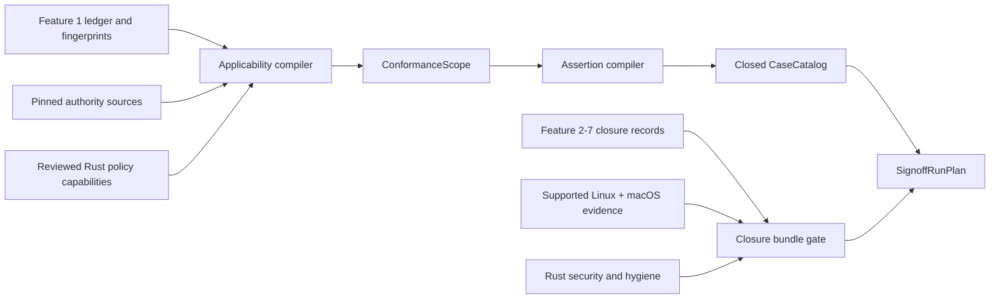
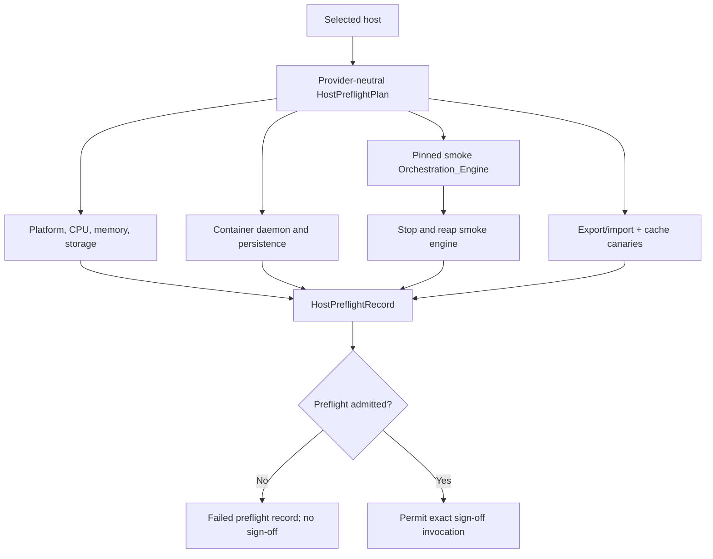
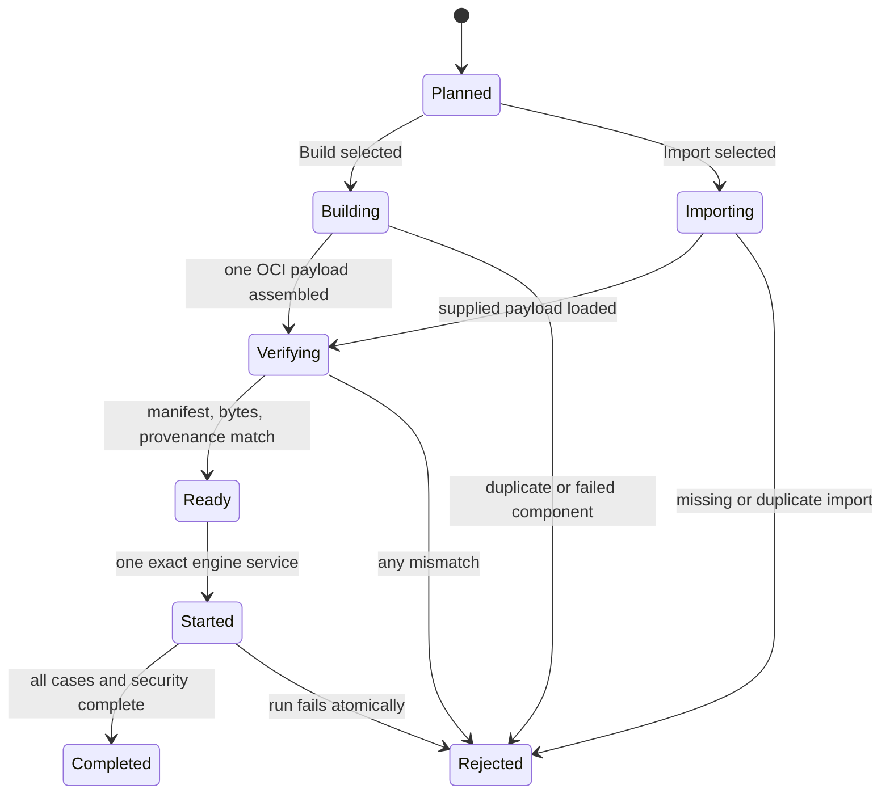
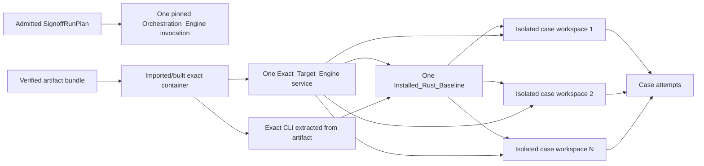
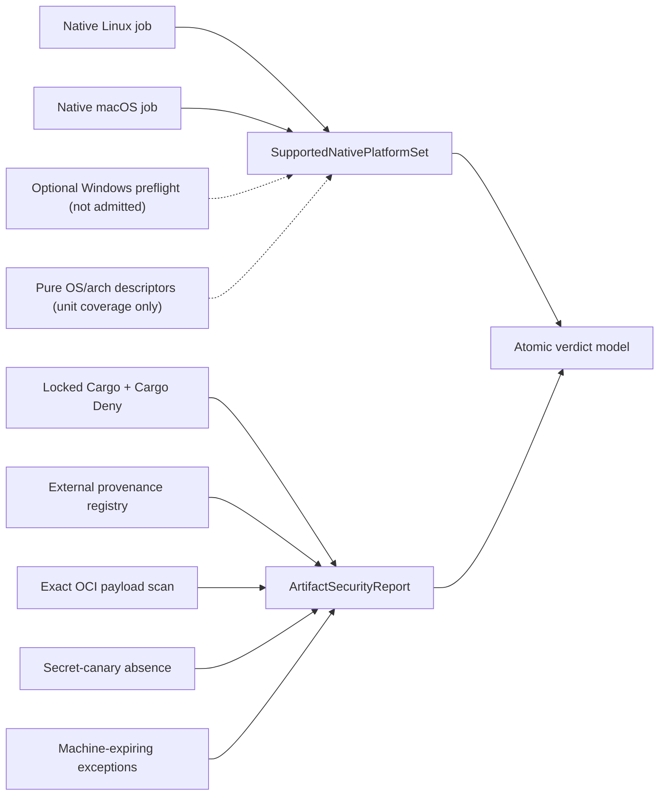
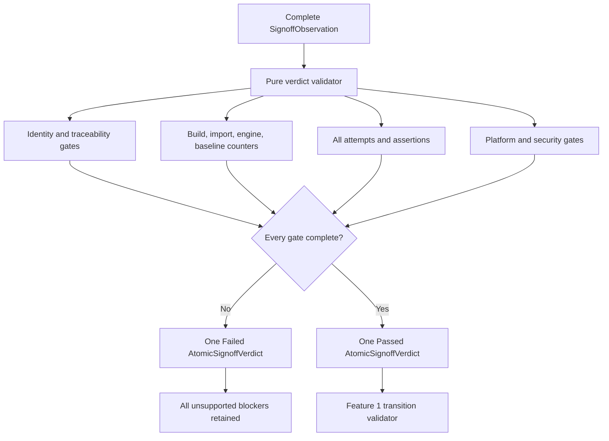

# Design Document: Rust SDK Conformance, Platform, and Security Gates

## Overview

Feature 8 turns the independently completed Rust SDK layers into one admissible
Go-level SDK claim. It does not add another public SDK abstraction. Instead, it adds a
private conformance control plane which accounts for every selected authority row,
plans a closed exact-engine case catalog, admits matching engine-free closure and
native-platform evidence, constructs or imports one reusable target artifact, and
derives one atomic verdict from the complete run.

The design has two deliberately different execution modes:

1. **Rust-first closure** compiles applicability, assertions, case plans, artifact
   state, platform policy, security policy, counters, and verdicts as pure data. Local
   checkpoints exercise the production models directly without Dagger or an engine.
2. **Exact-target sign-off** consumes those already-proved models and evidence. A thin
   Dagger graph adapter materializes one artifact, starts one target engine, installs
   one Rust baseline, and executes only the closed Rust case catalog.

The one approved operation before target construction is
`Signoff_Host_Preflight`. Its production policy is provider-neutral and its first live
validation occurs on the dedicated Namespace XL Linux/amd64 devbox. The Namespace
identity is retained only as non-authoritative execution metadata. The checked host
profile—not the provider name—decides admission.

Two engine roles are named explicitly:

- the **Orchestration_Engine** is the pinned prebuilt Dagger engine used by the host to
  evaluate the `rust-sdk-dev` graph; and
- the **Exact_Target_Engine** is the single engine constructed from, or imported with,
  the sign-off artifact and exercised by Rust cases.

The preflight smoke engine proves that the host can provide the first role and is
stopped before sign-off. A sign-off invocation may then use one pinned
Orchestration_Engine to evaluate the graph. The exact-one engine and restart counters
apply to the Exact_Target_Engine. Both infrastructure and target-engine identities and
counts are recorded, so the distinction cannot conceal duplicate work.

The reusable artifact is real content, not a Dagger object ID or a digest standing in
for bytes. Its payload is an OCI archive of the focused exact-target engine containing
the exact CLI, mandatory Go runtime content, and packaged Rust SDK content. A canonical
manifest, provenance record, and component digest set accompany that archive. The
bundle can be exported to the host's persistent workspace, imported after a new
session, verified before engine startup, and scanned without rebuilding it.

The 1,081 current Feature 8 authority rows remain a discovery inventory. A canonical
`Applicability_Record` makes a capability-local disposition for each row. Applicable
rows map to reviewed Rust-observable assertions and exact case routes. Genuine
engine-owned and foreign-SDK-only rows may become `Inapplicable`, but only with local
decision evidence which proves that no Rust obligation was discarded. Assertions may
share a case where the same observable invariant and fixture context genuinely cover
multiple rows; wildcard closure and another SDK's pass remain impossible.

The fixed case families include the 17 pinned `sdk-sdk` subject checks, the live stable
connector, representative generated Core shapes, the Feature 5 integration matrix,
the Feature 6 authoring matrix and packaged self-consumer, the five deferred Feature 7
client cases, the nine definitive Go-client behaviours, and every additional
applicable integration assertion. Additional integration cases are compiled from one
small Rust-first conformance manifest. Each entry retains immutable Go authority
provenance, a source-language-neutral scenario spine, and exactly one generated Core or
reviewed idiomatic Rust realization. The authority source may scaffold the spine but is
never the executable Rust contract. Case definitions contain typed identities, not
caller-provided shell commands, copied Go source, or a general operation language. The
manifest and catalog are complete and digest-bound before the artifact is built or
imported.

The fixed inventory also runs the committed `cli`, `backend`, and `frontend`
standalone Rust example roots from the exact Subject_Revision with their committed
lockfiles. These are build-only sign-off cases: the CLI output remains inside its
isolated workspace, while the backend and frontend force their image graphs and assert
the expected content without entering their explicit publication paths. Registry
credentials are absent, external writes are forbidden, and any attempted publish or
host export outside the case workspace is a terminal assertion failure.

Every case branches from one immutable `Installed_Rust_Baseline` and binds to the same
Exact_Target_Engine. Workspaces, environment namespaces, cache namespaces, and
credentials remain isolated. Assertion failures are terminal for the complete run;
only classified infrastructure interruptions can consume a bounded retry, and every
attempt remains visible.

The native Linux and macOS jobs exercise process, path, filesystem, cache, redaction,
and cleanup behaviour without an engine. Pure descriptor cases may exercise additional
OS/architecture names, but cannot widen support. The initial exact-engine verdict is
Linux/amd64 only. Windows is outside current sign-off; a different supported platform
requires its own artifact and verdict.

Security is part of the verdict rather than an adjacent green check. All Cargo roots
use committed lockfiles and Cargo Deny; unsafe remains denied; external images, tools,
archives, and the scanner database have immutable reviewed provenance; the exact
artifact payload is scanned in place; exceptions are finding-specific and
machine-expiring; and high-entropy canaries prove that credentials do not enter any
retained boundary.

The final `AtomicSignoffVerdict` is always derived by the Rust policy model. It binds
the target, subject revision, host profile and preflight, artifact bytes, closure
bundle, case catalog, platform matrix, security report, every attempt, every count, and
every phase timing. A missing, stale, skipped, failed, leaking, duplicated, or
overbroad input yields one failed verdict and no admissible successful subset.

A passing imported-artifact verdict also derives one `ReleaseHandoffRecord`. The
record is a deliberately narrow boundary: it preserves the exact outer bundle, inner
payload, manifest, security report, verdict, subject, and platform identities for
Feature 9. It cannot authorize publication, widen a platform claim, or bless a rebuilt
payload. Feature 9 may add a release envelope around those bytes, but the signed-off
payload itself remains immutable.

## Dependencies and Non-Goals

### Owning relationships

- Feature 1 owns capability identity, source fingerprints, ledger status transitions,
  blocker rendering, and evidence admission. Feature 8 supplies exact applicability,
  assertion, case, security, platform, and verdict evidence; it never writes an
  unvalidated status directly.
- Feature 2 owns public session lifecycle and engine-free transport foundations.
  Feature 8 consumes its matching closure and exercises only exact-engine facts not
  already proved by the direct transport model.
- Feature 3 owns request execution, typed errors, telemetry, provisioning, and the
  stable connector. Feature 8 executes the deferred production-distribution
  observation with the artifact CLI on `PATH` and reports verified download or
  compatibility fallback honestly.
- Feature 4 owns schema validation, semantic projection, generated Core bindings, and
  the Core catalog. Feature 8 selects representative paths from that complete catalog;
  it does not regenerate Core continuously or make sampled execution the proof of
  generator completeness.
- Feature 5 owns engine integration, operation packaging, runtime dispatch, focused
  source selection, and its ten-case matrix. Feature 8 replaces the provisional
  feature-local sign-off shape with one umbrella artifact, baseline, service, and
  verdict.
- Feature 6 owns Rust module authoring, TypeDef projection, dispatch, generated assets,
  and packaged self-consumption. Its provisional sign-off manifest becomes an input to
  the umbrella catalog rather than an independently releasable verdict.
- Feature 7 owns standalone client generation, project reconciliation, generated
  module API, and its five deferred cases. Its admitted engine-free closure and case
  inventory are consumed without replay.
- Feature 9 owns immutable Git-tagged SDK distribution, release version
  synchronization, exact asset assembly, SBOMs, attestations, Apple signing
  disposition, release automation, migration presentation, and the public `v1.0.0`
  release claim. It accepts only a passing Feature 8 verdict and matching
  `ReleaseHandoffRecord`; it does not rebuild the handed-off payload.
- `dagger-sdk-completeness` owns all pure Feature 8 contract types, canonical encoding,
  applicability and case compilation, evidence admission, security/platform policy,
  and verdict derivation.
- `dagger-sdk-engine` retains the closed local-checkpoint action vocabulary. Feature 8
  extends it only where the generic engine-free checkpoint model needs a new typed Rust
  action; it does not put sign-off execution in the SDK engine adapter.
- `toolchains/rust-sdk-dev` owns the thin Dagger graph adapter which builds/imports the
  artifact, starts the exact service, materializes the baseline, and dispatches typed
  cases. It does not decide applicability, terminal status, retries, security
  admission, or verdict success.
- `toolchains/engine-dev` remains authoritative for focused engine construction and
  production engine layout. Feature 8 adds export/import seams around its resulting
  container and exact CLI; it does not fork the engine builder.
- `toolchains/security` owns the Trivy invocation over an exact supplied payload.
  Feature 8 adds immutable scanner/database observation and canonical result
  translation; it does not rebuild the engine for scanning.
- GitHub Actions owns routine native hosted execution for Linux and macOS and assembles
  the current supported native-platform set. The separately dispatched engine-free
  Windows preflight is optional future-support evidence and cannot enter the current
  verdict. Namespace Personal is not assumed to provide a Windows runner.
- The host provider or remote-execution wrapper owns transport to a machine. The
  `devbox exec` command is used to reach the first Namespace host, but no Namespace
  command, account, box ID, or API enters a repository contract or retained verdict.

### Construction rules

1. All durable Feature 8 values use canonical, versioned, deny-unknown-fields models.
   Semantically unordered sets and maps are represented by sorted collections before
   hashing.
2. Exact target, Subject_Revision, platform, host profile, authority scope, closures,
   artifact inputs, case catalog, network policy, retry policy, and security policy are
   explicit inputs. Ambient working directories, usernames, provider account IDs,
   environment enumeration, and map order are not semantic inputs.
3. Applicability is capability-local. A review helper may propose records in bulk, but
   the admitted artifact contains one complete record per exact Capability_ID and no
   glob, source-file wildcard, or implicit default disposition.
4. An applicable capability has at least one assertion. Every exact-engine assertion
   has at least one case route. Every case lists its exact assertions and capability
   scope. These relations are validated as a closed bipartite graph before sign-off.
5. The case catalog uses a closed `CaseProgram` enum plus reviewed fixture identities.
   A catalog cannot inject command text, arbitrary packages, another SDK, or a new
   network endpoint.
6. Local Feature 8 checkpoints execute production pure models and native Rust/Go
   adapter fixtures only. Their typed action vocabulary cannot construct an engine or
   invoke Dagger.
7. Host preflight is infrastructure-only. It runs before target artifact work, uses a
   pinned prebuilt smoke engine, claims no capability, and terminates its engine before
   sign-off.
8. A Signoff_Run_Plan selects either `Build` or `Import`. It cannot build and import in
   one run, fall back from a failed import to an undeclared build, or materialize a
   second artifact.
9. The artifact bundle contains the actual OCI payload and canonical sidecars. Dagger
   graph object IDs, cache keys, image tags, and manifest digests without bytes are not
   portable artifacts.
10. The imported OCI payload is verified before service creation. The exact CLI is
    extracted from that payload for every baseline and connector observation; a host
    CLI is never treated as target content.
11. One Orchestration_Engine invocation may evaluate one sign-off graph. Exactly one
    Exact_Target_Engine service is admitted after all pre-engine gates pass. The
    verdict records both roles and rejects additional target starts.
12. One installed baseline is immutable. Case workspaces branch from it through
    Dagger's immutable container graph and receive distinct workspace, environment,
    cache, and credential namespaces.
13. Assertion results are not retryable. Only a typed `InfrastructureFailureClass`
    declared by the case policy can be retried, within one service and artifact. All
    attempts remain in the verdict.
14. Engine-free closure, platform, and ordinary Rust security evidence are consumed by
    identity. Sign-off does not replay their commands merely to appear thorough.
15. Native platform claims come only from the matching native OS job. Descriptor
    simulation can prove pure naming and archive selection, not native process or
    filesystem semantics.
16. Scanner, vulnerability database, builder images, toolchains, CLI inputs, and base
    images are accepted only through the checked provenance registry. Tags may aid
    humans but never supply immutable identity.
17. Secret canary values exist only in the live security harness. Durable models carry
    the canary-set digest, inspected-domain set, and absence result, never the values.
18. A failed preflight produces a failed infrastructure record and prevents sign-off.
    After sign-off starts, any failed policy, infrastructure, case, platform, or
    security observation produces a failed atomic verdict. Validation never returns a
    partial passing admission.
19. Source documentation follows the repository WHY-not-WHAT rule. Public internal
    contract types document guarantees and rejection semantics. Implementation source
    comments and test names do not cite feature or task numbers.
20. The Rust SDK development/sign-off module declares the repository's `v1.0.0-0`
    engine API floor. Its checked core binding must expose `GitRef.asWorkspace`, and
    the nested engine-development constructor receives that immutable Workspace rather
    than the ambient module Workspace before `WithGitSource` narrows the build source.

### Dependency decisions

- No new dependency enters the public `dagger-sdk` or `dagger-sdk-macros` packages for
  Feature 8.
- `dagger-sdk-completeness` continues to use the workspace `serde`, `serde_json`,
  `sha2`, `thiserror`, `clap`, and `proptest` dependencies. Canonical models and policy
  do not depend on Docker, Dagger, a network client, or an async runtime.
- The private `dagger-rust-sdk-signoff` binary uses `std::process` behind a typed
  `HostProbe` adapter for host metadata, Docker, smoke, persistence, and export/import
  probes. A large Docker client dependency would duplicate the exact command boundary
  already owned by the host and make platform support harder to audit.
- The live preflight adapter accepts only a checked `HostPreflightPlan`; it does not
  expose an arbitrary command runner through the CLI. Unit and property tests use an
  in-memory `HostProbe` implementation.
- Existing `toolchains/rust-sdk-dev` Go and Dagger SDK dependencies remain the graph
  orchestration mechanism. Rewriting the repository toolchain module in Rust is not
  required to prove the Rust SDK; the artifact's packaged Rust SDK remains the SDK
  used by module and standalone-client cases.
- The existing focused engine builder is reused. The artifact path adds one OCI export
  and one OCI import rather than reimplementing an engine image layout.
- Existing Trivy 0.69.3 remains the initial scanner only if its checked publisher,
  repository, and immutable image digest pass the new provenance gate. Pinning is
  necessary but is not treated as proof of provenance by itself.
- GitHub-hosted native runners provide platform execution. Their image identity and
  installed Rust toolchain observation are recorded; Rust itself remains pinned to
  1.97.1 through the repository toolchain file.
- `proptest` remains the only randomized-test framework. Reference models are small
  pure functions independent of the production validators.

### Non-goals

- Porting the complete Go integration suite or any foreign SDK suite to Rust syntax.
- Translating pinned Go test bodies into a second language-neutral or Rust executable
  specification which can drift from the authority scenario.
- Running another SDK's generator, builder, package manager, or test suite merely
  because its source established an authority observation.
- Treating every one of the 1,081 authority rows as a distinct engine invocation.
- Reopening completed transport, Core generation, module authoring, or standalone
  client design without a concrete conformance defect.
- Making Namespace a required provider, CI service, behavioural authority, SDK
  dependency, or evidence source.
- Treating the preflight smoke engine or Orchestration_Engine as target conformance
  evidence.
- Claiming a second exact-engine platform from the initial Linux/amd64 verdict.
- Publishing a crate, changing stable release versions, or modifying public release
  presentation.
- Accepting a path dependency, mutable Git ref, ambient checkout, host CLI, or Dagger
  object ID as release evidence.
- Rebuilding target content for a vulnerability scan or retry.
- Erasing an assertion failure because a later attempt passed.
- Persisting secret canary values, absolute host paths, personal account identities,
  provider box IDs, or raw unbounded process output.
- Guaranteeing a performance benchmark for a correctness case. Phase budgets bound
  work and expose regressions; they do not turn benchmark results into parity gates.

## Repository Layout

```text
sdk/rust/
├── crates/
│   ├── dagger-sdk-completeness/
│   │   └── src/
│   │       ├── conformance/
│   │       │   ├── mod.rs              # Feature 8 facade and format version
│   │       │   ├── applicability.rs    # exact scope and disposition compiler
│   │       │   ├── assertion.rs        # Rust-observable assertion catalog
│   │       │   ├── case_catalog.rs     # closed typed case graph
│   │       │   ├── preflight.rs        # host profile/observation admission
│   │       │   ├── closure.rs          # child closure and platform bundle gate
│   │       │   ├── artifact.rs         # artifact manifest/materialization model
│   │       │   ├── platform.rs         # native and descriptor matrix policy
│   │       │   ├── security.rs         # provenance, findings, exceptions, canaries
│   │       │   └── verdict.rs          # run plan, attempts, counters, atomic verdict
│   │       └── bin/
│   │           └── dagger-rust-sdk-signoff.rs # typed host preflight/evidence CLI
│   └── dagger-sdk-engine/
│       └── src/checkpoint.rs            # closed engine-free Feature 8 actions
├── completeness/
│   ├── conformance-applicability.json   # one record per selected authority row
│   ├── conformance-assertions.json      # reviewed Rust-observable assertions
│   ├── conformance-cases.json           # canonical case-family and route policy
│   ├── signoff-host-profile.json        # provider-neutral resource/budget contract
│   ├── signoff-provenance.json          # external input publisher and digest registry
│   ├── signoff-security-exceptions.json # normally empty, machine-expiring exceptions
│   └── evidence/
│       ├── platform-matrix.json
│       ├── conformance-implementation-closure.json
│       └── sdk-signoff-verdict.json
├── fixtures/conformance/
│   ├── core/
│   ├── engine-integration/
│   ├── module-authoring/
│   ├── standalone-client/
│   ├── go-client-observables/
│   └── applicability/
└── CONFORMANCE_SIGNOFF.md                # durable local/preflight/sign-off workflow

toolchains/rust-sdk-dev/
├── main.go                               # existing dev facade
├── signoff.go                            # artifact and exact-run Dagger graph
└── internal/signoff/
    ├── catalog.go                        # typed Rust catalog decoder/dispatcher
    ├── artifact.go                       # OCI bundle assembly/import
    ├── baseline.go                       # exact CLI and one installed baseline
    ├── cases.go                          # closed CaseProgram executor registry
    └── observation.go                    # canonical safe raw observations

.github/workflows/
├── rust-sdk-security.yml                 # locked/Cargo Deny/public-package gates
├── rust-sdk-platform.yml                 # supported engine-free Linux/macOS jobs
└── rust-sdk-windows-preflight.yml        # optional non-gating future-support evidence
```

Feature 6 and Feature 7 provisional sign-off models remain readable during migration
but do not produce independent passing release verdicts. The Feature 8 compiler
imports their exact closure and deferred-case identities into the umbrella model. Once
all call sites and evidence fixtures use the umbrella types, the duplicate provisional
artifact, counter, and verdict structs are removed rather than maintained in parallel.

## Architecture

### Contract compilation and engine-free closure



`derive_conformance_scope` consumes the exact active Feature 8 ledger rows, the
reviewed applicability input, and the new Rust policy capability inventory. It first
verifies the current 1,081-item set, count partition, and scope digest. The compiler
then validates one record per ID, source fingerprint equality, authority coordinates,
disposition-specific decision evidence, terminal policy, and the complete
assertion/case graph.

The authored applicability file may be scaffolded from the ledger, but generated
placeholders remain invalid. There is no inherited source-file disposition. A review
tool may group exact IDs which share a rationale, yet it expands the group to
capability-local records before canonical output. Review therefore sees the full
status impact and exact source delta.

Assertions state Rust-observable results, not Go implementation steps. An assertion
records its authority anchors, observable preconditions, result predicate, idiomatic
equivalence decision where needed, and permitted case families. The compiler folds
semantically identical assertions only when their normalized predicate and fixture
context match. Similar prose is insufficient.

The case catalog is built entirely without an engine. Fixed child-feature inventories
are translated into the umbrella `CaseProgram` enum. Additional applicable assertions
are compiled through a `RustFirstConformanceManifest` containing a deliberately small
`ScenarioSpine` and exactly one `RustRealization`. `GeneratedCore` realizations name a
checked public schema coordinate and generated Rust fixture; `ReviewedRustFixture`
realizations name one checked idiomatic Rust function for lifecycle, module, CLI,
concurrency, or complex setup. The source inventory retains the normalized authority
body only for review, candidate scaffolding, and drift detection. The catalog builder
validates total forward and reverse traceability: every applicable capability reaches
an assertion, scenario, concrete Rust realization, and case; every case claims known
assertions and capabilities; and no case widens its claim beyond those routes.

The manifest is intentionally not an abstract test-system product. There is one Rust
renderer/fixture registry, no backend interface, no Go or TypeScript realization, and
no universal expression language. An optional `sdk-sdk-candidate` marker identifies a
small portable client-contract idea for later review; it cannot affect execution or
evidence. If Dagger later expands `sdk-sdk`, only those reviewed portable spines—not the
complete integration inventory—are candidates for distillation.

The `ImplementationClosureBundle` admits one current closure for Features 2–7 plus the
supported Linux/macOS native-platform set and ordinary Rust security/hygiene result. Each input binds
the same target and Subject_Revision or an explicitly compatible checked-asset
identity. The bundle gate runs before artifact materialization. It never replays the
underlying Cargo, Go adapter, or native-platform work.

### Host preflight and sign-off boundary



The checked `SignoffHostProfile` contains platform, minimum resources, storage and
container requirements, the pinned preflight CLI/engine identities, network policy,
phase budgets, and persistence/export semantics. `plan_host_preflight` turns it into a
closed ordered set of typed steps. The live binary executes those steps through a
`HostProbe`; it cannot accept additional commands from the caller.

The initial workflow copies or builds the private host binary, then invokes it inside
the dedicated Namespace XL box through `devbox exec`. `devbox` supplies remote
transport only. The record identifies the checked profile and canonical observed host
class; Namespace account, box ID, user path, and provider credentials are discarded.

The smoke phase uses a reviewed digest-pinned Dagger CLI/engine pair to execute one
bounded service reachability operation. It starts and reaps exactly one smoke engine.
The canary export/import and cache phases operate on non-target bytes. No Exact_Target
source, Rust SDK installation, Case_Definition, or Capability_ID enters preflight.

The production host adapter records command category, immutable tool identity,
sanitized outcome, elapsed time, and resource measurements. Raw stdout/stderr is
bounded and scanned before any safe excerpt is retained. A profile, container daemon,
or pinned preflight-tool identity change invalidates the record.

### Reusable artifact state machine



`ArtifactPlan` is a pure state machine selected by the `SignoffRunPlan`. The build
variant predicts all immutable component inputs and permits one construction. The
import variant names the expected manifest and payload digests and permits one import
and zero component builds. No error path silently changes strategy.

For a build, `toolchains/rust-sdk-dev` asks the existing focused engine builder for one
fully configured exact-target container with its exact CLI, exact target Go content,
and previously built Rust SDK content. It calls `AsTarball` once, computes the payload
digest, extracts or queries exact component identities, and constructs canonical
manifest/provenance sidecars. The actual archive and sidecars are assembled into one
exportable bundle.

The engine builder's constructor is itself part of the immutable-source boundary. The
adapter converts the admitted credential-free Git ref to a Workspace and supplies it
at construction time; passing the ambient injected Workspace and replacing it later
would still taint constructor evaluation and cache identity. Engine-free source and
compile audits reject a missing conversion, a legacy module API floor, or an ambient
Workspace argument before the artifact-producing graph can run.

For an import, the host supplies that bundle from persistent storage. The graph
validates the outer bundle, canonical manifest, archive digest, every declared
component, platform, target, subject revision, toolchain, and provenance before
calling `Container.Import`. Import does not call an engine, CLI, Go runtime, or Rust
content builder.

The artifact build uses the focused source closure already audited in Feature 5. Go is
required as a build input for the engine binary, exact CLI, mandatory packaged Go SDK
content, and Rust runtime adapter; the Go SDK test suite is not. Unrelated SDK trees,
builders, tests, generators, examples, and distribution targets remain excluded.

The imported or newly built archive is also the exact scanner subject. The security
graph receives the existing archive file and never requests a rebuilt container.

### One target engine, one baseline, and isolated case fan-out



The host invokes one top-level Dagger sign-off function. The Orchestration_Engine
identity comes from the preflight profile and is recorded as infrastructure. Within
that graph, the runner starts exactly one service from the verified target container
and validates the engine version, revision, Rust content manifest, and descriptor
before installing anything.

The runner extracts the target CLI already present in the artifact container and adds
that file to a clean runner image. It initializes one Git workspace and performs one
`dagger sdk install --here rust` against the target service. The resulting immutable
container and workspace form `Installed_Rust_Baseline`; its digest includes the exact
CLI, installed configuration, packaged SDK descriptor, runner image, and target
service identity.

Every case clones that baseline and overlays only its fixture. A canonical namespace
derived from the case ID scopes workspace paths, cache volumes, environment, session
credentials, and trace collection. The runner uses bounded concurrency from the
catalog. Case results are returned by index and canonically reordered; completion
order cannot affect evidence.

The three standalone-example branches additionally overlay only the exact committed
example root, its committed lockfile, and the minimal exact-subject Rust workspace
source needed by its path dependency. Their executor selects a closed build-only mode:
`cli` proves its executable export inside the branch, and `backend`/`frontend` force,
export, and inspect bounded local OCI content. No example receives registry
credentials or an external publication destination. The dedicated
`network/read-only-public-dependencies` policy binds the committed source and lockfile,
pinned tool versions, resolved image identities, and exported output identities. It
permits only those declared public dependency reads; it does not pretend the examples
are engine-only or network-free. Mutable outputs and cache keys remain case-namespaced,
and any credential use or external write fails admission.

`CaseProgram` dispatch is a closed Go switch which calls production Dagger operations
or runs a Rust fixture binary built against the installed packaged SDK. The catalog
contains no executable text. The executor rejects an unknown enum, fixture digest,
network endpoint, or capability set before the target service starts.

The stable connector case deliberately leaves explicit local CLI selection unset. Its
case environment contains the artifact CLI on `PATH`. It performs the production
manifest request, records whether verified download or definitive 403/404
compatibility fallback selected the exact CLI, establishes an authenticated target
query, closes the client, and proves child reaping. A fallback pass cannot claim a
verified download.

An assertion failure immediately makes the complete run ineligible. A case policy may
allow a small number of retries for closed infrastructure categories such as a lost
orchestration transport or transient immutable remote fetch. Retrying clones a new
case workspace from the same baseline and retains every previous attempt. A retry
cannot rebuild/import the artifact, start another target engine, reinstall the
baseline, or convert an assertion failure into infrastructure.

### Platform and security admission



The supported native workflow runs one engine-free job on Linux and one on macOS. The
same private Rust test binary selects the native job plan and records observed OS,
architecture, Rust version, lockfile identity, source identity, test inventory, and
outcomes. It exercises native executable discovery, cache publication, path and link
boundaries, child lifecycle, control-line parsing, redaction, and cleanup. Pure tests
separately cover all six descriptor pairs.

The security compiler joins ordinary Rust security evidence with exact-artifact
security. It validates Cargo roots and Dependabot ecosystem coverage, immutable
external provenance, scanner image identity, vulnerability database identity, exact
payload identity, findings, exceptions, and canary scanning. Exceptions name one
finding, reachability rationale, owner, upstream remediation, and a machine-evaluable
expiry predicate; an expired or no-longer-matching exception fails closed.

The Trivy adapter mounts the existing OCI archive read-only, updates or imports the
pinned database according to the run plan, records the database metadata digest, and
emits canonical JSON. The Rust security model—not shell exit text—decides whether the
finding set passes. High and critical findings require a current exact exception;
lower severities remain recorded for audit.

Each credential-bearing boundary receives a unique high-entropy canary. Scanners
inspect source and generated files, artifact entries, cache/provenance keys,
stdout/stderr, typed errors, debug output, diagnostics, traces, reports, and the draft
verdict. The durable report retains only a digest of the canary set and the inspected
domain set. Any occurrence fails the complete run.

### Atomic verdict and ledger transition



The graph adapter returns raw typed observations and cannot return `passed`. The Rust
validator reconstructs every expected digest and relation, validates counts and
timings, folds attempt histories, admits platform/security results, and creates the
only canonical verdict. Diagnostics are stable, sorted, bounded, and safe.

A passed verdict enumerates only capabilities supported by a passed assertion or an
admitted applicability decision. It then asks the Feature 1 transition model to derive
`Implemented`, `Idiomatic_Equivalent`, or justified `Inapplicable` statuses. A failed
verdict contains no admitted status changes. Reports distinguish applicability
closure, implementation closure, native-platform closure, security closure, and
exact-engine sign-off.

## Components and Interfaces

### Conformance scope and applicability compiler
(`dagger-sdk-completeness/src/conformance/applicability.rs`)

```rust
pub enum ApplicabilityDisposition {
    RustObservableSameMechanism,
    RustObservableIdiomatic,
    EngineOwnedNoRustObligation,
    ForeignSdkNoRustObligation,
}

pub struct ApplicabilityRecord {
    pub capability_id: CapabilityId,
    pub authority_anchor: AuthorityAnchor,
    pub source_fingerprint: Digest,
    pub disposition: ApplicabilityDisposition,
    pub assertion_ids: CanonicalSet<AssertionId>,
    pub case_ids: CanonicalSet<SignoffCaseId>,
    pub decision_evidence: Option<ApplicabilityDecision>,
    pub terminal_policy: Status,
}

pub struct ConformanceScopeInput {
    pub format_version: ConformanceFormatVersion,
    pub target_digest: TargetDigest,
    pub existing_scope_digest: Digest,
    pub existing_records: Vec<ApplicabilityRecord>,
    pub policy_capabilities: Vec<PolicyCapability>,
}

pub struct ConformanceScope { /* canonical private maps and digests */ }

pub fn derive_conformance_scope(
    ledger: &ResolvedLedger,
    input: ConformanceScopeInput,
) -> Result<ConformanceScope, ConformanceDiagnosticSet>;
```

`AuthorityAnchor` contains repository, full revision, source path, stable locator, and
source item kind. It must agree with the ledger row and selected authority registry.
`ApplicabilityDecision` is a tagged value: idiomatic equivalence names the observable
contract and Rust mechanism; engine-owned evidence proves the absence of a Rust input,
output, lifecycle, or compatibility effect; foreign-SDK evidence names the exact
mechanism and routes every shared invariant to a Rust assertion.

The compiler verifies the fixed 1,081-item initial scope and its digest before applying
any decisions. New policy capabilities are validated separately so an authority row
cannot be hidden by changing the policy count. Duplicate, missing, out-of-scope,
fingerprint-mismatched, unjustified, or terminal-policy-incompatible records fail as a
set. `ConformanceScope` exposes read-only maps and canonical digests only after the
whole input is valid.

### Assertion and case compiler
(`dagger-sdk-completeness/src/conformance/{assertion,case_catalog}.rs`)

```rust
pub struct ConformanceAssertion {
    pub id: AssertionId,
    pub authority_anchors: CanonicalSet<AuthorityAnchor>,
    pub capability_ids: CanonicalSet<CapabilityId>,
    pub fixture_context: FixtureContextId,
    pub predicate: ObservablePredicate,
    pub equivalence_decision: Option<DecisionId>,
}

pub enum CaseFamily {
    CommonHarness,
    StableConnector,
    CoreGeneratedApi,
    EngineIntegration,
    ModuleAuthoring,
    StandaloneClient,
    DefinitiveGoClient,
    IntegrationAssertion,
}

pub enum CaseProgram {
    CommonHarness { check: CheckId },
    StableConnector,
    CoreShape { shape: CoreCaseShape },
    EngineIntegration { case: EngineIntegrationCase },
    ModuleAuthoring { case: ModuleAuthoringCase },
    StandaloneClient { case: StandaloneClientCase },
    DefinitiveGoClient { case: GoClientBehaviour },
    IntegrationAssertion { fixture: ReviewedFixtureId },
}

pub struct CaseDefinition {
    pub id: SignoffCaseId,
    pub family: CaseFamily,
    pub program: CaseProgram,
    pub fixture_digest: Digest,
    pub assertion_ids: CanonicalSet<AssertionId>,
    pub capability_ids: CanonicalSet<CapabilityId>,
    pub timeout: NonZeroMillis,
    pub retry: RetryPolicy,
    pub network: NetworkPolicyId,
    pub concurrency_class: ConcurrencyClass,
}

pub fn compile_case_catalog(
    scope: &ConformanceScope,
    assertions: Vec<ConformanceAssertion>,
    cases: Vec<CaseDefinition>,
) -> Result<CaseCatalog, ConformanceDiagnosticSet>;
```

`ObservablePredicate` is a closed semantic description sufficient for review and
traceability; execution remains owned by the fixture program. It includes result,
error, lifecycle, filesystem, query, and metadata predicate variants. It never embeds
source-language code.

The compiler requires all fixed case families and exact child-feature cases. It
validates assertion/capability equality in both directions, rejects unknown or
duplicate IDs, and ensures each program is permitted only in its family. A
`ReviewedFixtureId` must exist in the checked executor registry with the same fixture
digest; it is not a path or command supplied at runtime.

### Provider-neutral host preflight
(`dagger-sdk-completeness/src/conformance/preflight.rs`)

```rust
pub struct SignoffHostProfile {
    pub profile_version: NonZeroU32,
    pub platform: PlatformDescriptor,
    pub minimum_cpu_count: NonZeroU32,
    pub minimum_memory_bytes: NonZeroU64,
    pub minimum_workspace_bytes: NonZeroU64,
    pub container_policy: ContainerDaemonPolicy,
    pub smoke_tool: ProvenanceId,
    pub smoke_engine: ProvenanceId,
    pub persistence_policy: PersistencePolicy,
    pub network_policy: NetworkPolicyId,
    pub phase_budgets: BTreeMap<HostPreflightPhase, NonZeroMillis>,
}

pub enum HostPreflightStep {
    ObserveHost,
    ObserveContainerDaemon,
    RoundTripPersistentCanary,
    RoundTripExportedPayload,
    ObserveCacheReuse,
    StartSmokeEngine,
    ProbeSmokeService,
    StopSmokeEngine,
    ScanRetainedOutput,
}

pub trait HostProbe {
    fn observe(
        &mut self,
        step: &HostPreflightStep,
    ) -> Result<HostStepObservation, HostProbeError>;
}

pub fn plan_host_preflight(
    profile: SignoffHostProfile,
) -> Result<HostPreflightPlan, ConformanceDiagnosticSet>;

pub fn admit_host_preflight(
    plan: &HostPreflightPlan,
    observation: HostPreflightObservation,
) -> Result<HostPreflightRecord, ConformanceDiagnosticSet>;
```

The plan orders smoke start/probe/stop explicitly and requires the stop observation
even after a failed probe. A small outer runner guarantees cleanup and records a
cleanup failure as preflight failure. Provider identity may appear in an ephemeral
operator log but is not a field in `HostPreflightRecord`.

The initial Namespace execution runs this same binary and profile used by any later
Linux/amd64 host. Ambient Go, Rust, and Dagger versions are observations, not selected
toolchains. The exact build later consumes pinned artifact/container toolchains; the
known Namespace Go 1.25.3 therefore neither passes nor fails a Go 1.26.1 target build.

### Implementation closure bundle
(`dagger-sdk-completeness/src/conformance/closure.rs`)

```rust
pub enum ChildClosure {
    Transport,
    ClientLifecycle,
    CoreCodegen,
    EngineIntegration,
    ModuleAuthoring,
    StandaloneClient,
}

pub struct ChildClosureReference {
    pub child: ChildClosure,
    pub target_digest: TargetDigest,
    pub subject_or_asset_digest: Digest,
    pub closure_digest: Digest,
    pub engine_free: bool,
    pub outcome: ClosureOutcome,
}

pub struct ImplementationClosureBundleInput {
    pub target_digest: TargetDigest,
    pub subject_revision: CommitSha,
    pub child_closures: Vec<ChildClosureReference>,
    pub generated_assets: BTreeMap<GeneratedAssetDomain, Digest>,
    pub platform_matrix_digest: Digest,
    pub rust_security_digest: Digest,
}

pub fn assemble_implementation_closure_bundle(
    input: ImplementationClosureBundleInput,
) -> Result<ImplementationClosureBundle, ConformanceDiagnosticSet>;
```

The exact six-child set is closed. A child closure may bind an immutable checked asset
when the child implementation predates Subject_Revision, but the asset compatibility
relation must be explicit and validated against current inputs. Engine-backed
historical Feature 5 evidence is not mislabeled engine-free; its direct implementation
closure is consumed, while the fixed Feature 5 exact cases run inside the umbrella
sign-off.

### Artifact planner and canonical bundle
(`dagger-sdk-completeness/src/conformance/artifact.rs`)

```rust
pub enum ArtifactMaterialization {
    Build,
    Import {
        manifest_digest: Digest,
        payload_digest: Digest,
    },
}

pub struct ArtifactComponentRecord {
    pub component: ArtifactComponent,
    pub input_digest: Digest,
    pub content_digest: Digest,
    pub provenance: CanonicalSet<ProvenanceId>,
}

pub struct ExactTargetArtifactManifest {
    pub format_version: ArtifactFormatVersion,
    pub target_descriptor_digest: TargetDigest,
    pub target_revision: CommitSha,
    pub subject_revision: CommitSha,
    pub platform: PlatformDescriptor,
    pub engine_input_digest: Digest,
    pub cli_input_digest: Digest,
    pub go_runtime_digest: Digest,
    pub rust_manifest_digest: Digest,
    pub rust_descriptor_digest: Digest,
    pub toolchain_digests: BTreeMap<ToolchainRole, Digest>,
    pub components: BTreeMap<ArtifactComponent, ArtifactComponentRecord>,
    pub payload_digest: Digest,
    pub provenance_digest: Digest,
}

pub struct ArtifactBuildReceipt {
    pub plan_digest: Digest,
    pub bundle_digest: Digest,
    pub manifest_digest: Digest,
    pub payload_digest: Digest,
    pub events: Vec<ArtifactEvent>,
    pub construction_count: u32,
    pub import_count: u32,
    pub component_build_counts: BTreeMap<ArtifactComponent, u32>,
    pub forbidden_work_counts: BTreeMap<ForbiddenArtifactWork, u32>,
    pub materialization_elapsed_millis: NonZeroMillis,
    pub receipt_digest: Digest,
}

pub struct ArtifactImportReceipt {
    pub plan_digest: Digest,
    pub bundle_digest: Digest,
    pub verified_component_digests: BTreeMap<ArtifactComponent, Digest>,
    pub events: Vec<ArtifactEvent>,
    pub construction_count: u32,
    pub import_count: u32,
    pub component_build_counts: BTreeMap<ArtifactComponent, u32>,
    pub forbidden_work_counts: BTreeMap<ForbiddenArtifactWork, u32>,
    pub materialization_elapsed_millis: NonZeroMillis,
    pub receipt_digest: Digest,
}

pub fn admit_artifact_build_receipt(
    plan: &ArtifactPlan,
    bundle: &VerifiedArtifactBundle,
    receipt: &ArtifactBuildReceipt,
) -> Result<AdmittedArtifactBuildReceipt, ConformanceDiagnosticSet>;

pub fn admit_artifact_import_receipt(
    plan: &ArtifactPlan,
    bundle: &VerifiedArtifactBundle,
    receipt: &ArtifactImportReceipt,
) -> Result<AdmittedArtifactImportReceipt, ConformanceDiagnosticSet>;
```

The producing and importing adapters supply typed raw observations; Rust never creates
an ideal history from the expected strategy. Each receipt is canonical, digest-bound,
and independently re-admitted against the original plan and exact bundle. A build
requires one construction, zero imports, exactly one required component evaluation,
and zero forbidden work. An import requires zero construction or component builds,
exactly one import, independently observed target component identities, and zero
forbidden work. The admitted values retain verified identities and safe logical
locators; they never claim that a digest can recover missing bytes.

The current verified bundle representation is memory-backed and may retain roughly
three to five simultaneous payload-sized allocations during assembly and decode. Its
hard limit is therefore 8 GiB: the modeled worst case remains about 40 GiB on the
64-GiB sign-off host, leaving operating headroom for the policy process and engine.
Exact-bound input is admitted and `+1` fails before allocation. Raising this limit
requires a streamed or file-backed verified-bundle representation rather than a larger
constant.

### Dagger artifact and execution adapter (`toolchains/rust-sdk-dev/signoff.go`)

The Dagger-facing object is intentionally small:

```go
type RustSignoffArtifact struct {
    Bundle           *dagger.File
    PlanJSON         string
    ManifestJSON     string
    BuildReceiptJSON string
    PayloadDigest    string
    // private retained graph objects and files cannot cross the public schema
}

func (t *RustSdkDev) SignoffArtifact(
    ctx context.Context,
    seedJSON string,
) (*RustSignoffArtifact, error)

func (t *RustSdkDev) Signoff(
    ctx context.Context,
    planJSON string,
    catalogJSON string,
    closureJSON string,
    platformJSON string,
    artifact *dagger.File,
) (string, error)
```

`SignoffArtifact` re-derives a clean immutable subject seed, builds once, exposes the
portable bytes and canonical Build receipt, and keeps graph objects private.
Authoritative `Signoff` is bundle-required and import-only: it records one independently
observed Import receipt and reuses that same receipt through security and verdict
admission. It cannot silently fall back to a build strategy or reconstruct ideal
counters after the producing session ended.

The adapter decodes canonical Rust-authored plan/catalog JSON and validates its digest
before entering the graph. Go mirrors only the closed enum spellings needed for
dispatch. It does not reimplement applicability or verdict policy. Raw observations
are canonical JSON with stable identifiers and digests; the Rust CLI validates and
renders the verdict after the Dagger call.

### Installed baseline and case executor
(`toolchains/rust-sdk-dev/internal/signoff`)

```rust
pub struct InstalledRustBaseline {
    pub baseline_digest: Digest,
    pub artifact_digest: Digest,
    pub engine_identity: Digest,
    pub cli_digest: Digest,
    pub installed_config_digest: Digest,
    pub dependency_descriptor_digest: Digest,
    pub runner_image_digest: Digest,
}

pub enum InfrastructureFailureClass {
    OrchestrationTransport,
    ImmutableRemoteFetch,
    RunnerCapacity,
}

pub enum CaseAttemptOutcome {
    Passed { observation_digest: Digest },
    AssertionFailed { diagnostic: SafeDiagnostic },
    InfrastructureFailed {
        class: InfrastructureFailureClass,
        diagnostic: SafeDiagnostic,
    },
}

pub struct CaseAttempt {
    pub attempt: NonZeroU32,
    pub workspace_digest: Digest,
    pub environment_digest: Digest,
    pub cache_namespace_digest: Digest,
    pub elapsed_millis: u64,
    pub outcome: CaseAttemptOutcome,
}

pub struct CaseObservation {
    pub case_id: SignoffCaseId,
    pub case_digest: Digest,
    pub execution_binding_digest: Digest,
    pub attempts: Vec<CaseAttempt>,
    pub final_outcome: CaseFinalOutcome,
    pub elapsed_millis: u64,
}
```

The Go executor produces the equivalent wire shape; the Rust model owns decoding and
admission. `execution_binding_digest` binds the catalog case to the admitted artifact
manifest and payload, exact engine identity, and installed baseline. `RetryPolicy`
contains a maximum attempt count and permitted infrastructure classes. There is no
catch-all transient class. A passed case requires a passed final attempt and no earlier
assertion failure. Infrastructure retries must retain identical artifact, target
engine, baseline, fixture, and case digests.

The exact executor registry maps fixed `CaseProgram` values to reviewed production
paths and maps integration cases to checked `RustScenarioBinding` values. Each binding
names the pinned Go test selector, source fingerprint, Rust fixture or reviewed
Rust-focused equivalent, and allowed Rust production boundary. Go remains orchestration:
the selected Rust fixture's result is the only subject evidence. The runner rejects a
binding that selects a Go, TypeScript, Python, Java, PHP, or other foreign SDK fixture,
and it never runs an unselected test from the wider integration suite.

Feature 5's `resolution` case is refactored to use the common exact CLI and baseline
rather than constructing its own installation. The existing bounded concurrency
pattern is retained, with each branch cloned from the same immutable baseline.

### Supported native-platform set
(`dagger-sdk-completeness/src/conformance/platform.rs`)

```rust
pub enum NativeOs { Linux, MacOs, Windows }
pub enum Architecture { Amd64, Arm64 }

pub struct NativePlatformObservation {
    pub os: NativeOs,
    pub architecture: Architecture,
    pub runner_image_digest: Digest,
    pub rust_toolchain_digest: Digest,
    pub source_digest: Digest,
    pub lockfile_digest: Digest,
    pub test_inventory_digest: Digest,
    pub domains: BTreeMap<NativePlatformDomain, PlatformDomainOutcome>,
}

pub struct SupportedNativePlatformSet {
    pub target_digest: TargetDigest,
    pub native_observations: BTreeMap<OperatingSystem, NativePlatformObservation>,
    pub observation_set_digest: Digest,
}

pub fn assemble_supported_native_platform_set(
    target_digest: TargetDigest,
    native: Vec<NativePlatformObservation>,
) -> Result<SupportedNativePlatformSet, ConformanceDiagnosticSet>;
```

The required native domain set covers PATH/executable discovery, cache publication and
retention, path/link boundaries, child start/termination/reaping, control-line
isolation, diagnostics, redaction, cleanup, public API compilation, and docs. Admission
requires exactly current matching Linux and macOS observations. The optional Windows
producer uses native Windows semantics but its output is not an input to current sign-off.

### Supply-chain and secret security
(`dagger-sdk-completeness/src/conformance/security.rs`)

```rust
pub struct ProvenanceRecord {
    pub id: ProvenanceId,
    pub role: ExternalInputRole,
    pub publisher: NonEmptyText,
    pub repository: NonEmptyText,
    pub immutable_digest: Digest,
    pub review_evidence_digest: Digest,
}

pub struct VulnerabilityFinding {
    pub finding_id: FindingId,
    pub package: NonEmptyText,
    pub installed_version: NonEmptyText,
    pub severity: VulnerabilitySeverity,
    pub artifact_payload_digest: Digest,
}

pub struct SecurityException {
    pub finding_id: FindingId,
    pub reachability: NonEmptyText,
    pub impact: NonEmptyText,
    pub owner: NonEmptyText,
    pub upstream_remediation: NonEmptyText,
    pub expiry: ExpiryPredicate,
}

pub struct ArtifactSecurityObservation {
    pub payload_digest: Digest,
    pub scanner_provenance: ProvenanceId,
    pub database_digest: Digest,
    pub findings: Vec<VulnerabilityFinding>,
    pub exceptions: Vec<SecurityException>,
    pub canary_set_digest: Digest,
    pub inspected_domains: CanonicalSet<SecretInspectionDomain>,
    pub leaks: Vec<SecretLeakObservation>,
    pub elapsed_millis: u64,
}

pub fn admit_artifact_security(
    policy: &SecurityPolicy,
    artifact: &AdmittedArtifact,
    observation: ArtifactSecurityObservation,
) -> Result<ArtifactSecurityReport, ConformanceDiagnosticSet>;
```

`ExpiryPredicate` is closed and machine-evaluable: fixed UTC date, fixed target
revision boundary, fixed patched-version threshold, or upstream-advisory withdrawal.
Free-form "review later" text is not an expiry. Exception admission recomputes the
predicate from current structured inputs.

Secret scanning receives canary bytes out of band. A leak observation contains only
the canary category, output domain, and safe relative coordinate. The persisted
security observation is rejected if it contains a canary value or an unredacted host
identity even when the leak list is non-empty.

### Sign-off run plan and atomic verdict
(`dagger-sdk-completeness/src/conformance/verdict.rs`)

```rust
pub struct SignoffRunPlan {
    pub target_digest: TargetDigest,
    pub subject_revision: CommitSha,
    pub platform: PlatformDescriptor,
    pub host_profile_digest: Digest,
    pub preflight_digest: Digest,
    pub artifact_plan: ArtifactPlan,
    pub closure_bundle_digest: Digest,
    pub case_catalog_digest: Digest,
    pub network_policies: BTreeMap<NetworkPolicyId, NetworkPolicy>,
    pub maximum_concurrency: NonZeroU32,
    pub total_budget: NonZeroMillis,
}

pub struct SignoffExecutionCounts {
    pub orchestration_engine_starts: u32,
    pub artifact: ArtifactCounters,
    pub exact_target_engine_starts: u32,
    pub rust_baseline_materializations: u32,
    pub closure_replays: u32,
    pub unrelated_actions: u32,
}

pub struct SignoffObservation {
    pub run_plan_digest: Digest,
    pub host_preflight_digest: Digest,
    pub artifact: ArtifactObservation,
    pub closure_bundle_digest: Digest,
    pub platform_matrix_digest: Digest,
    pub security_report_digest: Digest,
    pub engine_identity: Digest,
    pub baseline: InstalledRustBaseline,
    pub execution_counts: SignoffExecutionCounts,
    pub phase_timings: SignoffPhaseTimings,
    pub cases: Vec<CaseObservation>,
    pub forbidden_events: Vec<ForbiddenSignoffEvent>,
}

pub enum VerdictDecision {
    Passed { capability_ids: CanonicalSet<CapabilityId> },
    Failed { diagnostics: ConformanceDiagnosticSet },
}

pub struct AtomicSignoffVerdict {
    pub format_version: ConformanceFormatVersion,
    pub verdict_digest: Digest,
    pub target_digest: TargetDigest,
    pub subject_revision: CommitSha,
    pub platform: PlatformDescriptor,
    pub run_plan_digest: Digest,
    pub host_preflight_digest: Digest,
    pub artifact_manifest_digest: Digest,
    pub artifact_payload_digest: Digest,
    pub closure_bundle_digest: Digest,
    pub case_catalog_digest: Digest,
    pub platform_matrix_digest: Digest,
    pub security_report_digest: Digest,
    pub execution_counts: SignoffExecutionCounts,
    pub phase_timings: SignoffPhaseTimings,
    pub cases: BTreeMap<SignoffCaseId, CaseObservation>,
    pub decision: VerdictDecision,
}

pub struct ReleaseHandoffRecord {
    pub format_version: ConformanceFormatVersion,
    pub handoff_digest: Digest,
    pub target_digest: TargetDigest,
    pub subject_revision: CommitSha,
    pub platform: PlatformDescriptor,
    pub signoff_bundle_digest: Digest,
    pub artifact_manifest_digest: Digest,
    pub artifact_payload_digest: Digest,
    pub security_report_digest: Digest,
    pub verdict_digest: Digest,
    pub authority: ReleaseHandoffAuthority,
}

pub enum ReleaseHandoffAuthority {
    EvidenceOnly,
}

pub fn derive_atomic_signoff_verdict(
    context: &SignoffAdmissionContext<'_>,
    observation: SignoffObservation,
) -> AtomicSignoffVerdict;

pub fn derive_release_handoff(
    bundle: &VerifiedArtifactBundle,
    verdict: &AtomicSignoffVerdict,
) -> Result<ReleaseHandoffRecord, ConformanceDiagnosticSet>;
```

`derive_atomic_signoff_verdict` is total for a decodable observation: it returns a
failed verdict rather than an early policy error. Input decoding and gross size limits
occur before this boundary and produce a minimal failed invocation record. The verdict
digest is calculated from the complete value with the digest field omitted, then
inserted and independently rechecked on read.

The Subject_Revision must be one full reachable commit whose focused source digest
matches the workspace admitted to the artifact plan. A dirty tree, mutable ref, or
unreachable fork revision is rejected. A reachable fork commit is valid; canonical
upstream ownership is not confused with subject provenance.

Exactly one Orchestration_Engine start is expected for the sign-off invocation;
preflight's earlier smoke start belongs only to the preflight record. Exactly one
Exact_Target_Engine start and baseline materialization are mandatory. The artifact
counters depend on Build versus Import. Closure replay and unrelated action counts
must remain zero.

`derive_release_handoff` succeeds only for the authoritative imported-artifact path
and a passing verdict whose complete identity set matches the verified bundle. The
caller must retain the actual bundle and payload bytes; a digest without recoverable
content is insufficient. A failed verdict, rebuilt or mutated payload, subject drift,
or platform change returns a typed diagnostic and no handoff record.

### Completeness admission and reporting
(`dagger-sdk-completeness/src/conformance/mod.rs`)

```rust
pub fn derive_conformance_status_changes(
    scope: &ConformanceScope,
    verdict: &AtomicSignoffVerdict,
) -> Result<CandidateStatusChanges, ConformanceDiagnosticSet>;

pub fn derive_conformance_report(
    scope: &ConformanceScope,
    closure: Option<&ImplementationClosureBundle>,
    platform: Option<&SupportedNativePlatformSet>,
    security: Option<&ArtifactSecurityReport>,
    verdict: Option<&AtomicSignoffVerdict>,
) -> Result<ConformanceReport, ConformanceDiagnosticSet>;
```

Only a passed verdict can request transitions for applicable exact-engine assertions.
Reviewed inapplicability decisions may be admitted through the same complete verdict,
ensuring scope, cases, and security are not bypassed merely because some rows need no
engine execution. Feature 1 validates every requested transition against prior status
and allowed policy.

The report keeps the five phases independent. It never turns implementation closure,
a native-platform set, or a clean artifact scan into SDK sign-off. The Markdown report uses
measured counts and neutral wording; it does not present `Inapplicable` as implemented
Rust behaviour.

### Durable contributor and operator workflow (`sdk/rust/CONFORMANCE_SIGNOFF.md`)

The guide records:

- how applicability, assertion, and case artifacts are regenerated and reviewed;
- the engine-free local checkpoint and native-platform evidence workflow;
- how to build and run the host preflight binary;
- how the initial Namespace XL execution is reached without making Namespace a
  repository dependency;
- how to export one artifact to persistent storage and import it after restart;
- how to run built and imported sign-off paths;
- how to inspect counters, timings, case attempts, scanner/database identities, and
  failures;
- how to verify a clean reproducible completeness diff; and
- which evidence is implementation closure versus release sign-off;
- how the exact outer bundle and inner payload are retained for Feature 9; and
- why the release handoff permits neither rebuild, platform widening, nor publication.

Commands use placeholders for provider transport, artifact directory, and subject
revision. No personal account, box ID, or absolute developer path is checked in.

## Data Models

### Capability-to-case traceability

The admitted trace graph has four layers:

```text
Capability_ID -> Applicability_Record -> Conformance_Assertion -> Case_Definition
```

For applicable rows, every arrow is non-empty. For justified inapplicable rows, the
record ends in a typed `ApplicabilityDecision` and has no case route. The canonical
scope stores reverse indexes for assertion-to-capability and case-to-assertion so an
overbroad or orphaned claim is detected without scanning prose.

| Field | Contract source | Invariant |
|---|---|---|
| `capability_id` | Requirement 1 existing/policy scope | Exact active ID, once |
| `authority_anchor` | selected authority registry | Pinned repository/revision/path/locator |
| `source_fingerprint` | Feature 1 ledger | Equal to current row |
| `disposition` | applicability policy | One closed variant |
| `assertion_ids` | observable review | Non-empty for applicable rows |
| `case_ids` | closed case catalog | Exact live routes for engine assertions |
| `decision_evidence` | equivalence/inapplicability policy | Present exactly where required |
| `terminal_policy` | Feature 1 transition policy | Compatible with disposition |

### Host profile and preflight record

`SignoffHostProfile` is reviewed repository policy. Resource and timing values are
checked data rather than constants spread across scripts. The initial profile is
Linux/amd64 and sized for the dedicated XL host; future providers implement the same
contract or introduce a reviewed profile version.

`HostPreflightRecord` contains the profile digest, canonical platform and resource
observations, container daemon/API/storage-driver identity, pinned smoke tool and
engine identities, start/ready/stop counts, persistence/export/cache canary digests,
phase timings, retained-output scan result, and record digest. It contains no provider
or personal identity.

### Case identity and attempt history

A catalog case digest is derived from target, Subject_Revision, artifact-plan identity,
closure, program, fixture, assertion/capability sets, timeout, retry, network, and
concurrency policy. At execution, a second binding digest joins that case to the actual
artifact manifest and payload, engine identity, and baseline. A workspace digest
additionally includes the binding digest and attempt number. This permits a retry to
use a fresh workspace without changing semantic case identity.

`CaseObservation` contains the expected case digest, ordered non-empty attempt list,
final outcome, and aggregate elapsed time. It is invalid when attempt numbers are not
contiguous, an assertion failure is followed by another attempt, a retry class is not
permitted, the final result disagrees with attempts, or any attempt changes shared
identities.

### Artifact manifest and bundle

The canonical bundle layout is:

```text
rust-sdk-signoff-<payload-digest>.tar
├── manifest.json
├── provenance.json
├── engine.oci.tar.zst
└── checksums.sha256
```

The outer tar is a transport envelope. `payload_digest` identifies the exact
`engine.oci.tar.zst` bytes which are imported and scanned. `manifest.json` identifies
semantic inputs and component outputs. `provenance.json` contains reviewed external
origin records. `checksums.sha256` is derived from canonical member bytes and uses a
fixed member order, permissions, ownership, timestamps, and compression policy so the
same inputs reproduce the same bundle. It lists the manifest, provenance record, and
OCI payload only; it does not recursively list itself.

The successful imported run retains this complete outer bundle and its inner OCI
payload as the Feature 9 handoff. Release automation may copy the bundle or wrap the
unchanged payload with release-only metadata. It may not reconstruct the OCI archive,
recompress the payload under the same identity, replace a member, or infer support for
another platform. Each additional platform requires its own bundle, security report,
passing verdict, and `ReleaseHandoffRecord`.

### Closure bundle

The bundle contains exactly six child-closure references, the current generated-asset
map, supported native-platform identity, ordinary Rust security identity, target, subject,
and canonical digest. It does not embed complete test logs. Each reference points to a
bounded evidence artifact which can be independently inspected.

### Supported platform evidence

The current matrix has exactly two native observations—Linux and macOS—and four pure
Linux/macOS descriptor observations. Native results carry their real architecture; no
requirement assumes that GitHub hosts both architectures for every OS. Descriptor
coverage supplies the other architecture where execution is pure. Windows evidence is
not a member of this supported set. Exact-engine platform identity is deliberately
absent from this matrix and belongs to the verdict.

### Security report

`ArtifactSecurityReport` binds:

- the exact artifact payload and manifest digests;
- ordinary locked/Cargo Deny/unsafe/automation evidence;
- the complete external provenance registry digest;
- scanner image and vulnerability database digests;
- canonical findings and admitted exception identities;
- the Secret_Canary_Set digest and complete inspected-domain set;
- scan and policy-evaluation timings; and
- one pass/fail security outcome.

An exception record is evidence, not a suppression side effect. The underlying finding
remains in the report and is paired with the exact current exception decision.

### Phase timings and counters

All durations are monotonic elapsed milliseconds and non-zero for executed phases.
Clock timestamps are optional operator metadata and do not affect digests. The shared
timing model includes host preflight, artifact build/import, target engine startup,
Rust installation, security scan, every case attempt, verdict evaluation, and total
run duration.

Counters are explicit observations rather than inferred from a green result. Artifact
construction/import and component build counters, orchestration and target engine
starts, baseline materializations, closure replays, and unrelated actions all enter the
verdict.

## Correctness Properties

### Property 1: Existing and Rust-policy scope is exact

*For any* active ledger and any mutation, permutation, duplication, omission, or
addition to the reviewed Feature 8 inventory, scope derivation SHALL accept exactly the
1,081 pinned existing Capability_IDs with the reviewed count partition and scope
digest, plus the complete distinct Rust-policy inventory, or reject with the exact
scope delta before any applicability record is admitted.

**Validates: Requirements 1.1–1.4, 1.16**

### Property 2: Applicability is total, local, and evidence-gated

*For any* complete capability set and applicability-record permutation, admission SHALL
succeed if and only if every active ID has exactly one current authority/fingerprint
record, each applicable disposition has known assertions and case routes, each
equivalence or inapplicability disposition has compatible capability-local decision
evidence and terminal policy, and no Rust-observable effect is discarded. Every
unproved or invalid item SHALL remain blocking, and closure SHALL contain no
unjustified blocker.

**Validates: Requirements 1.5–1.15, 1.17–1.18**

### Property 3: Host planning is provider-neutral and fail-fast

*For any* valid host profile, provider label, resource observation, platform, daemon
identity, and phase schedule, preflight planning SHALL produce the same typed steps
independent of provider identity; the initial Namespace execution SHALL treat its
provider as non-authoritative metadata; and any platform, resource, daemon, timeout,
profile, or identity mismatch SHALL fail before target artifact construction and
prevent sign-off.

**Validates: Requirements 2.1–2.6, 2.16–2.20**

### Property 4: Preflight proves infrastructure without claiming conformance

*For any* preflight step observation and injected failure point, admission SHALL require
one pinned smoke-engine start, ready probe, isolated service reachability, clean reap,
unchanged export/import canary, observable cache reuse, and safe retained output; it
SHALL reject target builds, Rust installation, Case_Definitions, or Capability_ID
claims and preserve cleanup requirements after failure.

**Validates: Requirements 2.7–2.15**

### Property 5: The case catalog is closed, complete, and deterministic

*For any* applicable scope, assertion set, child case inventories, fixture registry,
and declaration permutation, catalog compilation SHALL produce the same digest and
accept if and only if it binds the exact target, subject, and platform; contains every
applicable assertion, all fixed case families and cases, immutable fixture/assertion
identities, and bounded timeout/network/retry/concurrency policy; has total
capability/assertion/case traceability; and contains no unknown, duplicate, unrelated
SDK, complete foreign suite, or repository-wide generation route. Every selected
integration case SHALL also bind one current authority anchor and source fingerprint
to one small Scenario_Spine and exactly one executable generated-Core or reviewed Rust
realization. A boundary label or source selector alone SHALL fail admission.

**Validates: Requirements 3.1–3.37**

### Property 6: Closure admission consumes exactly current engine-free evidence

*For any* child closure, generated-asset, platform, and Rust-security evidence set,
bundle assembly SHALL accept exactly one complete matching closure for each Feature
2–7 domain plus the complete current matrix/security identities, reject every missing,
failed, skipped, stale, engine-backed-as-local, or target-incompatible input before
engine startup, and schedule no replay of Rust tests, fixture suites, formatting,
Clippy, rustdoc, Cargo Deny, or direct Go ABI tests.

**Validates: Requirements 4.1–4.19**

### Property 7: Artifact identity accounts for every immutable byte source

*For any* target, subject, platform, component-input, toolchain, provenance, and
payload set, artifact admission SHALL produce one deterministic manifest and identity
if and only if every Artifact Manifest Contract field and component digest is complete,
the actual payload bytes match their digest, provenance is reviewed, and all identities
are mutually compatible. Changing any semantic input or payload byte SHALL change the
artifact identity; missing bytes SHALL never be recoverable from a digest claim.

**Validates: Requirements 5.1–5.6, 5.10–5.11, 5.17–5.18, 5.20**

### Property 8: Build and import are exclusive at-most-once state machines

*For any* artifact plan and sequence of build, import, component, unrelated-path, and
verification events, admission SHALL accept a build only with one construction, zero
imports, and at most one engine/CLI/Go-runtime/Rust-content build; accept an import only
with one import, zero constructions/component builds, and matching payload/components;
exclude unrelated SDK, suite, generation, and distribution work; and reject every
duplicate, mixed, fallback, or mismatched sequence.

**Validates: Requirements 5.7–5.9, 5.12–5.16, 5.19**

### Property 9: Exact CLI installation and distribution observation are honest

*For any* admitted artifact, target service, baseline candidate, and production
manifest outcome, baseline construction SHALL verify the target identity, install the
Rust SDK once from the exact artifact descriptor without a repository path, place only
the artifact CLI on `PATH`, and leave explicit local selection unset. A 403/404 SHALL
record exact compatibility fallback without claiming verified download; an available
manifest SHALL require verified download.

**Validates: Requirements 6.2–6.10**

### Property 10: Case fan-out uses one target engine and one immutable baseline

*For any* closed catalog, concurrency schedule, workspace tree, environment, cache,
session values, and case failures, execution admission SHALL require exactly one
Exact_Target_Engine start and baseline materialization, bind every case to them, derive
distinct mutable namespaces from the baseline, prevent cross-case observation or
mutation, preserve sibling workspaces after failure, stop and reap the service, and
reject zero, duplicate, or cross-case use. The three standalone examples SHALL use
their exact committed sources and lockfiles in build-only branches, prove their local
CLI/image outputs, receive no registry credentials, and reject every external
publication attempt.

**Validates: Requirements 6.1, 6.3–6.5, 6.11–6.15, 6.19–6.28**

### Property 11: Retry history cannot erase an assertion failure or duplicate work

*For any* case policy and attempt sequence, retry admission SHALL allow only declared
infrastructure classes within the attempt bound, retain every attempt, require the same
artifact, target engine, baseline, and case identity, and reject any attempt following
an assertion failure or requiring another artifact, engine, or baseline. A case SHALL
pass only when its complete history is policy-compliant and contains no assertion
failure.

**Validates: Requirements 6.16–6.18**

### Property 12: Authority mechanisms translate to observable Rust contracts

*For any* selected Go or integration authority assertion, conformance mapping SHALL
preserve the applicable observable result through the public Rust client/module or a
reviewed idiomatic equivalent, avoid copying foreign mechanisms, route engine-owned
Rust-observable behaviour through Rust, bind immutable authority provenance to one
minimal Scenario_Spine and concrete Rust_Realization, treat Go source only as review
and scaffolding input rather than executable subject evidence, and report exact added,
removed, or
reclassified assertion scope when authority inputs drift. A completeness claim SHALL
fail for every applicable assertion without a passing outcome and sufficient
capability evidence.

**Validates: Requirements 7.1–7.4, 7.16–7.23**

### Property 13: Common harness and standalone clients remain correctly bounded

*For any* common-harness and standalone-client observation set, sign-off SHALL require
all 17 subject checks with claims restricted to mapped harness capabilities and SHALL
build every standalone client outside the Dagger Cargo workspace. A harness-self check,
client-generation omission, repository path dependency, or foreign suite result SHALL
not widen those claims.

**Validates: Requirements 7.5–7.7**

### Property 14: Module authoring exercises the complete production semantic matrix

*For any* valid packaged Rust module fixture and generated inputs, the module case set
SHALL exercise initialization, development, generation, loading, execution, dependency
use, constructor, sync, async, stateful, Core, self, dependency, interface, enum,
default, error, panic, cancellation, and concurrent behaviour through production
TypeDef/dispatcher paths, and the packaged self-consumer SHALL resolve only artifact
SDK content.

**Validates: Requirements 7.8–7.9, 7.11**

### Property 15: Core and standalone-client cases use public generated APIs

*For any* representative Core-shape and standalone-client fixture, sign-off SHALL cover
every selected Core shape, immutable pinned remote generation, schema regeneration
with authored preservation, public generated Core querying, and namespaced bound-module
querying. Changed schema SHALL change owned generated content without changing authored
content.

**Validates: Requirements 7.10, 7.12–7.15**

### Property 16: Descriptor and exact-engine platform claims never widen

*For any* descriptor input and platform-result permutation, the platform compiler SHALL
bind every admitted Linux/macOS result to exact platform/toolchain/source/test
identities, require Linux/amd64 for the initial exact-engine verdict, treat additional
descriptor targets as non-widening unit coverage, and reject reuse of that artifact or
verdict for another platform.

**Validates: Requirements 8.4–8.9, 8.18, 8.20–8.21**

### Property 17: Native OS closure proves native behaviour without an engine

*For any* native Linux and macOS observation set and domain-outcome mutation, supported
set assembly SHALL accept exactly one current passing job per supported OS whose native
PATH, cache, link/path, child lifecycle, control-line, diagnostic, and redaction domains
ran under Rust 1.97.1 with committed lockfiles and no engine or other SDK. Missing,
stale, skipped, failed, duplicated, simulated-native, or injected Windows evidence SHALL
fail current sign-off admission.

**Validates: Requirements 8.1–8.3, 8.10–8.17, 8.19**

### Property 18: Rust dependency security is locked, complete, and least-privileged

*For any* supported Cargo-root, dependency graph, license, source, unsafe-policy,
automation, packaged dependency, and workflow-permission observation, security
admission SHALL require committed `--locked` resolution, all Cargo Deny classes,
approved licenses/sources, no active reachable advisory, no unapproved wildcard, the
workspace unsafe denial or a narrow proved exception, correct Cargo automation for
every live root, immutable packaged sources, and minimum workflow permissions.

**Validates: Requirements 9.1–9.10, 9.24–9.25**

### Property 19: External provenance and exact-payload vulnerability policy fail closed

*For any* external input registry, artifact payload, scanner/database identity, finding
set, and exception set, security admission SHALL require immutable reviewed image,
archive, tool, scanner, and database provenance; scan the exact sign-off payload
without rebuilding it; reject every unexcepted high/critical finding; and accept an
exception only when its exact finding, reachability, impact, owner, remediation, and
machine-evaluable expiry are current. A true expiry predicate SHALL make the exception
invalid.

**Validates: Requirements 9.11–9.23**

### Property 20: Secret canaries and host identity never enter retained evidence

*For any* generated non-production Secret_Canary_Set, credential-bearing boundary,
output chunking, diagnostic cause, file/artifact/cache content, trace, report, and
verdict candidate, the leak scanner SHALL inspect every required domain independent of
chunk boundaries and reject the whole run if any canary appears. Persisted evidence
SHALL contain no canary value, absolute host path, personal/provider identity, real
credential, unbounded diagnostic, or unredacted failure source.

**Validates: Requirements 10.1–10.17**

### Property 21: Feature 8 checkpoints are engine-free by construction

*For any* local checkpoint proposal, package/target expansion, asset-input state, and
engine-exception request, the planner SHALL admit only direct Rust applicability,
artifact, case, platform/security, verdict, and scoped adapter fixtures; reject Dagger,
an engine, a module, another SDK, repository-wide generation, or unchanged-asset
regeneration; and keep the host preflight as the only approved pre-sign-off engine
infrastructure exception requiring explicit review.

**Validates: Requirements 11.1–11.11, 11.16–11.18**

### Property 22: Checkpoint evidence is timed, counted, reusable, and complete

*For any* validated checkpoint plan, current prior observations, action outcomes,
elapsed times, Cargo counts, and generated-asset decisions, the recorder SHALL reuse
only matching passed evidence, schedule every missing/failed/stale domain, account for
every action exactly once within its phase budget, record all timings/counts/reuse
decisions, require the complete format/check/test/Clippy/rustdoc/Cargo Deny/source/
evidence/platform closure, and avoid claiming SDK sign-off.

**Validates: Requirements 11.12–11.15, 11.19–11.20**

### Property 23: A verdict binds every identity, counter, outcome, and timing

*For any* sign-off plan and observation declaration order, verdict derivation SHALL
produce one deterministic value binding the exact target, subject, platform, host
profile/preflight, artifact manifest/payload, closure, case catalog, platform matrix,
security report, all build/import/engine/baseline counters, every attempt, and every
required shared/case timing, including the three standalone-example outcomes. Any
mutation to a bound value SHALL change the verdict digest.

**Validates: Requirements 12.1–12.19**

### Property 24: Sign-off admission is atomic and fail-closed

*For any* complete or malformed sign-off observation, verdict derivation SHALL pass if
and only if every required case/assertion/input/security/platform gate passed, every
identity is current, the work counters contain no duplicate or unrelated action, no
canary leaked, and all capability claims equal the proved assertion/decision set. Any
missing, skipped, unknown, failed, stale, mismatched, duplicated, leaking, or overbroad
condition SHALL yield one failed verdict, admit no successful subset or status change,
retain implementation/platform/security/sign-off phase distinctions, require a clean
derived diff, reject any external publication observation, and prevent Feature 9
release admission.

**Validates: Requirements 12.20–12.42**

### Property 25: Release handoff preserves exact signed-off bytes and scope

*For any* verified artifact bundle, atomic verdict, payload mutation, subject
mutation, and platform mutation, handoff derivation SHALL produce one deterministic
record if and only if the authoritative imported-artifact verdict passed and every
bundle, manifest, payload, security, subject, and platform identity matches. A failed
verdict, unavailable bytes, rebuild, byte mutation, or platform widening SHALL produce
no handoff, and a valid handoff SHALL never authorize publication by itself.

**Validates: Requirements 5.21–5.22, 12.36–12.40**

## Error Handling

Pure Feature 8 validation returns a sorted non-empty `ConformanceDiagnosticSet`.
Host/Dagger adapters return typed bounded observations wherever possible; an adapter
failure becomes a safe diagnostic with a phase or case coordinate. Raw shell, Docker,
Dagger, Cargo, Git, scanner, and engine output never becomes the stable error contract.

| Condition | Internal error | Stable external code |
|---|---|---|
| Existing 1,081-item set/count/digest differs | `ConformanceScopeChanged` | `CONFORMANCE_SCOPE_CHANGED` |
| Policy capability inventory differs | `ConformancePolicyScopeChanged` | `CONFORMANCE_POLICY_SCOPE_CHANGED` |
| Applicability row missing, duplicate, unknown, or stale | `ApplicabilityRecordInvalid` | `APPLICABILITY_RECORD_INVALID` |
| Disposition/decision/terminal policy incompatible | `ApplicabilityDecisionInvalid` | `APPLICABILITY_DECISION_INVALID` |
| Assertion missing, orphaned, duplicated, or overbroad | `AssertionCatalogInvalid` | `CONFORMANCE_ASSERTION_INVALID` |
| Case missing, unknown, duplicated, or incorrectly routed | `CaseCatalogInvalid` | `CONFORMANCE_CASE_CATALOG_INVALID` |
| Case includes arbitrary command, other SDK, or forbidden graph | `CaseProgramForbidden` | `CONFORMANCE_CASE_FORBIDDEN` |
| Host profile is malformed or unsupported | `HostProfileInvalid` | `SIGNOFF_HOST_PROFILE_INVALID` |
| Host platform/resources/daemon are insufficient | `HostPreflightFailed` | `SIGNOFF_HOST_PREFLIGHT_FAILED` with phase |
| Smoke engine is unpinned, unreachable, duplicated, or unreaped | `HostSmokeInvalid` | `SIGNOFF_HOST_SMOKE_INVALID` |
| Preflight canary/cache/export/persistence result fails | `HostBoundaryInvalid` | `SIGNOFF_HOST_BOUNDARY_INVALID` |
| Preflight record is stale or contains host identity | `HostPreflightRecordInvalid` | `SIGNOFF_HOST_PREFLIGHT_STALE` or `EVIDENCE_REDACTION_FAILED` |
| Child closure is missing, failed, stale, or incompatible | `ClosureBundleIncomplete` | `IMPLEMENTATION_CLOSURE_INCOMPLETE` |
| Closure claims engine-free while containing engine work | `ClosureBoundaryInvalid` | `IMPLEMENTATION_CLOSURE_BOUNDARY_INVALID` |
| Artifact strategy is mixed, missing, or duplicated | `ArtifactStateInvalid` | `SIGNOFF_ARTIFACT_STATE_INVALID` |
| Artifact manifest field/component is missing or incompatible | `ArtifactManifestInvalid` | `SIGNOFF_ARTIFACT_MANIFEST_INVALID` |
| Payload bytes are absent or digest-mismatched | `ArtifactPayloadInvalid` | `SIGNOFF_ARTIFACT_PAYLOAD_INVALID` |
| Artifact/provenance identity is mutable or unreviewed | `ArtifactProvenanceInvalid` | `SIGNOFF_ARTIFACT_PROVENANCE_INVALID` |
| Component/build/import counter exceeds policy | `DuplicateWork` | `SIGNOFF_DUPLICATE_WORK` |
| Imported OCI archive cannot be decoded safely | adapter artifact error | `SIGNOFF_ARTIFACT_IMPORT_FAILED` |
| Exact engine identity differs from artifact/target | `EngineIdentityMismatch` | `SIGNOFF_ENGINE_IDENTITY_MISMATCH` |
| Exact engine is zero-started, duplicated, or unreaped | `EngineLifecycleInvalid` | `SIGNOFF_ENGINE_LIFECYCLE_INVALID` |
| Baseline is missing, duplicate, path-backed, or stale | `BaselineInvalid` | `SIGNOFF_RUST_BASELINE_INVALID` |
| Connector observation overclaims verified download/fallback | `DistributionObservationInvalid` | `SIGNOFF_DISTRIBUTION_OBSERVATION_INVALID` |
| Case workspace/environment/cache isolation is violated | `CaseIsolationInvalid` | `SIGNOFF_CASE_ISOLATION_VIOLATION` |
| Case attempt is skipped, assertion-failed, or unknown | `CaseOutcomeInvalid` | `SIGNOFF_CASE_FAILED`, `SIGNOFF_CASE_SKIPPED`, or `SIGNOFF_CASE_UNKNOWN` |
| Retry follows assertion failure or changes shared identity | `RetryPolicyInvalid` | `SIGNOFF_RETRY_INVALID` |
| Native OS or descriptor observation is missing/stale/failed | `PlatformMatrixIncomplete` | `PLATFORM_MATRIX_INCOMPLETE` |
| Platform evidence is widened to another target platform | `PlatformClaimInvalid` | `PLATFORM_CLAIM_INVALID` |
| Cargo advisory/license/ban/source/lock gate fails | `RustSecurityInvalid` | `RUST_SECURITY_GATE_FAILED` |
| Unsafe or workflow-permission policy fails | `RustPolicySecurityInvalid` | `RUST_SECURITY_POLICY_FAILED` |
| Scanner/database/publisher provenance is absent | `SecurityProvenanceInvalid` | `ARTIFACT_SECURITY_PROVENANCE_INVALID` |
| Exact payload has an unexcepted high/critical finding | `VulnerabilityGateFailed` | `ARTIFACT_VULNERABILITY_GATE_FAILED` |
| Exception is incomplete, unrelated, or expired | `SecurityExceptionInvalid` | `ARTIFACT_SECURITY_EXCEPTION_INVALID` |
| Canary is found in any inspected output | `SecretCanaryLeak` | `SECRET_CANARY_LEAK` with safe domain only |
| Local checkpoint crosses a forbidden boundary | existing checkpoint diagnostic | `CONFORMANCE_CHECKPOINT_SCOPE_INVALID` |
| Local checkpoint exceeds phase budget | `CheckpointBudgetExceeded` | `CONFORMANCE_CHECKPOINT_TIMEOUT` |
| Checkpoint evidence is incomplete/stale/miscounted | `CheckpointEvidenceInvalid` | `CONFORMANCE_CHECKPOINT_EVIDENCE_INVALID` |
| Sign-off contains unrelated SDK/distribution action | `ForbiddenSignoffEvent` | `SIGNOFF_UNRELATED_WORK` |
| Verdict identity/timing/counter/evidence is incomplete | `VerdictIncomplete` | `SIGNOFF_VERDICT_INCOMPLETE` |
| Release handoff bytes, verdict, subject, or platform differ | `ReleaseHandoffInvalid` | `SIGNOFF_RELEASE_HANDOFF_INVALID` |
| Persisted output contains a path, identity, control text, or secret | `EvidenceRedactionFailed` | `EVIDENCE_REDACTION_FAILED` |

Diagnostics contain only stable capability/assertion/case IDs, semantic policy fields,
safe repository-relative paths, platform coordinates, finding IDs, and phase names.
They are bounded, control-character free, sorted, and de-duplicated. An unsafe adapter
cause is retained only in an ephemeral canary-scanned operator log and replaced by a
stable safe summary in evidence.

Cleanup errors are never hidden behind an earlier failure. The final failed verdict may
contain both the primary case/preflight failure and a distinct cleanup diagnostic,
while preserving canonical ordering.

## Testing Strategy

### Property tests

All Properties 1–25 are required and use workspace-standard `proptest` with at least
100 successful cases. Scope, graph, artifact state-machine, isolation, secret-chunking,
and atomic-verdict properties use at least 256 cases because their mutation spaces are
larger. Stable function names (`property_01_exact_scope`, and so on) carry traceability;
source comments explain the invariant without referencing specification feature or
task numbers.

| Placement | Properties | Generator/reference model |
|---|---:|---|
| `dagger-sdk-completeness/tests/conformance_scope_properties.rs` | 1–2 | ledger sets, fingerprints, dispositions, decisions, terminal policies |
| `dagger-sdk-completeness/tests/signoff_preflight_properties.rs` | 3–4 | host profiles, resource/daemon observations, step/failure schedules |
| `dagger-sdk-completeness/tests/conformance_catalog_properties.rs` | 5 | assertion/case bipartite graphs, fixed inventories, fixture registries |
| `dagger-sdk-completeness/tests/conformance_closure_properties.rs` | 6 | child evidence sets, target/subject/asset compatibility, replay events |
| `dagger-sdk-completeness/tests/signoff_artifact_properties.rs` | 7–8 | component inputs/bytes/provenance and build/import event sequences |
| `dagger-sdk-completeness/tests/signoff_execution_properties.rs` | 9–11 | baseline inputs, case schedules, namespaces, retries, connector outcomes |
| `dagger-sdk-completeness/tests/conformance_observable_properties.rs` | 12–15 | authority/assertion translations and fixed family observations |
| `dagger-sdk-completeness/tests/platform_matrix_properties.rs` | 16–17 | native/descriptor matrices and identity/status mutations |
| `dagger-sdk-completeness/tests/signoff_security_properties.rs` | 18–20 | Cargo graphs, provenance, findings/exceptions, chunked canary outputs |
| `dagger-sdk-engine/tests/conformance_checkpoint_properties.rs` | 21–22 | typed action plans, asset states, prior evidence, timings/counts |
| `dagger-sdk-completeness/tests/signoff_verdict_properties.rs` | 23–25 | complete observation trees, artifact bytes, arbitrary order, all failure mutations |

The scope reference model performs exact set equality and disposition truth tables.
The catalog model uses simple forward/reverse set joins. The artifact model is a small
exclusive build/import automaton. The execution model assigns immutable shared IDs and
unique mutable namespaces. The retry model is a list fold with assertion failure as an
absorbing state. The platform/security models use exact required-set and finding/
exception predicates. The verdict model is an independent conjunction over all
required identities, counts, results, and gates.

### Unit and compile tests

Example-based tests cover fixed facts which do not benefit from randomized inputs:

- exact 1,081-item initial count, status partition, and scope digest;
- the 22 new Rust policy capability spellings;
- all 17 pinned sdk-sdk subject check IDs and exclusion of its harness-self check;
- the nine definitive Go-client behaviour IDs;
- exact Feature 5, Feature 6, and Feature 7 case inventories;
- the initial Namespace-compatible Linux/amd64 host profile without any Namespace
  identity in its encoded bytes;
- canonical built and imported artifact manifests and outer bundle layout;
- the exact beta.10 403/404 PATH-fallback observation and a future verified-download
  observation;
- one stable message for every error-table row;
- exact Trivy image/provenance registry entry, database metadata decoding, and finding
  severity mapping;
- every exception expiry variant at its boundary;
- canonical failed and passed verdict JSON, release handoff JSON, and Markdown
  rendering; and
- umbrella documentation wording that distinguishes checkpoint, preflight,
  Orchestration_Engine, Exact_Target_Engine, and release sign-off.

Compile tests prove that the private models remain independent of the public SDK and
that no Feature 8 dependency enters public crate manifests. The public `dagger-sdk`
API snapshot must remain unchanged unless a concrete conformance defect requires a
separately reviewed fix.

### Engine-free integration fixtures

The production Rust compilers and validators run against checked fixtures for:

1. the complete current ledger and applicability artifact;
2. a compact mixed same/idiomatic/engine-owned/foreign-only applicability corpus;
3. all fixed case-family inventories, the three build-only standalone Rust examples,
   plus grouped integration assertions;
4. complete and stale Feature 2–7 closure bundles;
5. built/imported artifact event logs with actual small canary payload bytes;
6. Linux/macOS supported native observations, optional rejected Windows evidence, and
   non-widening descriptor pairs;
7. Cargo Deny/provenance/finding/exception/canary security documents; and
8. passed and every-class-failed sign-off observations; and
9. exact-byte, mutated-byte, and widened-platform release handoff candidates.

The fixture host adapter uses a deterministic in-memory filesystem, daemon, service,
cache, and clock. It executes the real preflight planner/recorder but cannot start
Docker or Dagger. The fixture artifact adapter round-trips real small tar bytes and
canonical manifests, not target engine content.

Go tests under `toolchains/rust-sdk-dev/internal/signoff` remain engine-free. They parse
the real production adapter and validate:

- one artifact builder/import branch;
- exact focused source exclusions;
- one target service construction site;
- one common baseline construction site;
- no per-case engine, content, CLI, or SDK-install construction;
- complete closed `CaseProgram` dispatch;
- bounded canonical fan-out and case isolation inputs;
- exact artifact file reuse by scanner and runner; and
- raw observation fields matching the Rust wire model.

These source/fixture tests verify graph construction, not engine behaviour.

### Native platform jobs

`.github/workflows/rust-sdk-platform.yml` runs the same engine-free platform test
binary on Linux and macOS with Rust 1.97.1 and committed lockfiles, then admits their
matching observations as the current supported native-platform set.
`.github/workflows/rust-sdk-windows-preflight.yml` may produce an explicitly dispatched
future-support observation, but that artifact is non-gating and cannot enter current
sign-off. The production compiler rejects any missing or mismatched supported job and
rejects Windows evidence at the current verdict boundary.

The jobs do not install Dagger, start Docker, build an engine, execute a module, or run
another SDK. They may compile the public Rust packages and private platform test
binary. Descriptor cases for non-native architectures remain pure data tests within
the Rust suite.

### Scoped local checkpoint

Feature 8 implementation slices run narrow owning tests. The feature-end local closure
accounts for current evidence for this closed engine-free set:

```text
cargo fmt --all -- --check
cargo test -p dagger-sdk-completeness --test conformance_scope_properties --test signoff_preflight_properties --test conformance_catalog_properties --test conformance_closure_properties --test signoff_artifact_properties --test signoff_execution_properties --test conformance_observable_properties --test platform_matrix_properties --test signoff_security_properties --test signoff_verdict_properties --locked
cargo test -p dagger-sdk-engine --test conformance_checkpoint_properties --locked
cargo clippy -p dagger-sdk-completeness -p dagger-sdk-engine --all-targets --locked -- -D warnings
RUSTDOCFLAGS="-D warnings" cargo doc -p dagger-sdk-completeness -p dagger-sdk-engine --no-deps --locked
cargo deny check
go test ./internal/enginefree ./internal/signoff
  (working directory: toolchains/rust-sdk-dev)
```

The typed checkpoint planner, not this prose, authorizes actual commands. Matching
passed evidence is reused by owning-input digest; only missing, failed, or stale slices
execute. The feature-end gate requires complete coverage, not blind replay. Every
phase has a reviewed timeout, elapsed time, Cargo invocation count, and generated-asset
reuse decision.

No local checkpoint invokes `dagger`, builds/starts an engine, runs a module, builds or
tests another SDK, performs repository-wide generation, or enters a distribution
build. If implementation appears to require such a checkpoint, work pauses for a
model-insufficiency proof and explicit approval; the preflight remains the only
already-approved infrastructure exception.

### Initial live Namespace preflight

The first live infrastructure action after the pure preflight model and host binary are
complete is a bounded validation on the dedicated Namespace XL devbox:

1. transfer or build the exact private preflight binary and checked profile;
2. invoke it through `devbox exec` without embedding provider identity in arguments;
3. observe platform/resources, Docker, persistence, export/import, cache reuse, and one
   pinned smoke engine;
4. prove smoke service reachability and reap;
5. scan retained output; and
6. retrieve the canonical provider-neutral record.

This is not a local checkpoint or Feature 8 implementation closure and does not run a
Rust SDK case. It is the early infrastructure proof requested before investing in
exact artifact work.

### Final exact-target sign-off

No ordinary implementation checkpoint runs this sequence. After applicability,
catalog, child closures, supported Linux/macOS platform evidence, Rust security, artifact, runner, and
verdict model are complete, one bounded Linux/amd64 sign-off does the following:

1. validate the current host preflight record and immutable Signoff_Run_Plan;
2. build one exportable exact artifact or import one previously exported bundle;
3. scan that exact payload and admit the security report;
4. start one Exact_Target_Engine from that payload;
5. extract its exact CLI and materialize one Installed_Rust_Baseline;
6. fan out the closed isolated Rust case catalog with bounded concurrency;
7. stop and reap the target service;
8. derive one atomic Rust verdict from all observations; and
9. derive one Release_Handoff_Record from the passing imported-artifact verdict; and
10. reproduce the completeness artifacts and require a clean reviewed diff.

The initial validation exercises both artifact paths without duplicating target work:
a built run exports the bundle; a later invocation after host/session restart imports
those same bytes and may be used for the authoritative verdict. The imported run has
zero component builds. If both paths are retained as evidence, only the one declared
authoritative run supplies the release verdict; the build/export observation proves
artifact production and the import observation proves restart reuse.

### Documentation and review gate

Implementation updates `sdk/rust/CONFORMANCE_SIGNOFF.md`, `ARCHITECTURE.md`,
`CONTRIBUTING.md`, the completeness README/report, native/security workflow docs, and
the umbrella requirements together. Review verifies that:

- public internal models document purpose, invariants, and rejection semantics;
- comments explain capability locality, artifact bytes, engine-role distinction,
  baseline identity, retry absorption, and atomic verdict reasoning;
- comments do not narrate control flow or cite feature/task numbers;
- generated evidence contains no machine-local or provider identity;
- Go graph code remains orchestration rather than SDK policy; and
- a passing report states exactly which capabilities are implemented, idiomatically
  equivalent, or justified inapplicable without inflating the implemented count.
