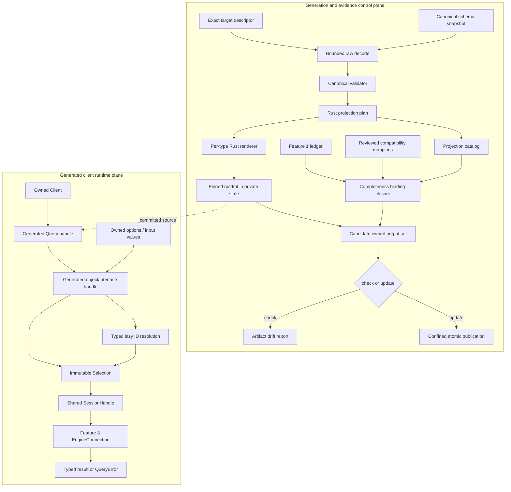
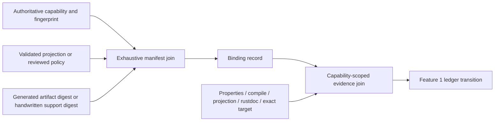

# Design Document: Rust SDK Core Schema Code Generation

## Overview

Feature 4 replaces the current best-effort Rust generator with a target-pinned,
fallible projection pipeline and replaces the monolithic generated client with a
coordinate-complete Rust API. The pipeline consumes the checked engine introspection
snapshot selected by `sdk/rust/completeness/target.json`, validates it into an
order-independent canonical model, derives one typed binding plan, renders per-type
Rust modules, formats them with the pinned toolchain, and assembles the exhaustive
Generated_Binding_Manifest before any repository file can change.

The design keeps code generation and query execution separate. `dagger-codegen` is a
pure schema compiler: it performs no filesystem, process, network, engine, or
completeness-ledger I/O. `dagger-bootstrap` is the repository orchestration boundary:
it reads checked inputs, invokes the formatter in private temporary state, asks the
completeness crate to close the authoritative capability mapping, and either verifies
or transactionally publishes the declared output set. Generated bindings remain thin
projections over Feature 2's `SessionHandle` and immutable `Selection`; Feature 3's
typed transport, GraphQL, engine-domain, timeout, and lifecycle failures therefore
remain the only execution path.

The public shape is Rust-owned rather than translated Go. Required values are direct
parameters or constructor inputs. Optional and defaulted values are represented by
owned, cloneable options values whose `Option<T>` fields distinguish omission from
every concrete value. Object-ID arguments use a target-typed `IdInput<T>` erasure so a
raw `Id` or a compatible generated handle can be retained inside an options value
without exposing Go-style pointer options or making an options struct generic over
every caller handle type. Interfaces become traits plus concrete interface handles;
objects implement the traits declared by the schema. `Id`, `Json`, and `Platform` are
small handwritten scalar newtypes validated and selected by the generator, while
GraphQL `Void` maps to `()` as an explicit idiomatic-equivalence policy.

Generated source moves from `src/gen.rs` to one generated module per public named
type under `src/gen/`. A generated index preserves the supported crate-root re-exports,
while type-local methods and options remain together. This boundary makes a schema
change produce localized diffs, allows obsolete files to be identified exactly, and
avoids a 15,000-line artifact becoming the unit of review. The output set also contains
a generated public-reachability test, an exhaustive query-projection test catalog, and
the binding manifest. Handwritten runtime support and public API snapshots are not
silently claimed as generator-owned files.

Wire shape and defaults come from the Canonical_Schema at Dagger revision
`25300124ca110612edc09c43f89cb5fad6028170`. Generated-client observations not settled
by that schema come from `github.com/dagger/dagger-go-sdk` revision
`1309520660f6a5b35ef97b4fbe151e32a06a8dc5`. The 21 retained Go code-generator
capabilities are treated as shared mapping policies, not as authority for Go syntax.
Every non-obvious Rust divergence is represented by a reviewed binding kind or
Idiomatic_Equivalent record rather than hidden in a template.

The common `sdk-sdk` checks remain pinned by the target descriptor to revision
`8c164424b7a8a37b33a77367ef7547490d5b87b5`. They are authoritative for checks they
actually declare and may contribute matching evidence, but they do not enlarge their
scope by implication. Compilation and formatting use the target's Rust 2024 edition
and Rust `1.97.1` toolchain.

## Dependencies and Non-Goals

### Owning relationships

- Feature 1 owns Capability_ID construction, authority extraction, ledger status
  policy, evidence registration, and derived reports. Feature 4 extends the
  completeness crate with binding-manifest assembly and validation; it does not create
  an independent parity ledger.
- Feature 2 owns `Client`, `SessionHandle`, immutable `Selection`, `QueryBuilder`,
  `Loadable`, `IntoID`, argument-build failures, and the close/timeout fence. Feature 4
  adds generated uses and one typed ID-erasure support value; it does not introduce a
  second query or lifecycle stack.
- Feature 3 owns connection establishment, authenticated transport, W3C propagation,
  exact-target compatibility, `QueryError`, and engine-domain failures. Generated
  execution delegates to those paths unchanged.
- Feature 4 owns raw schema decoding for code generation, canonical validation, Rust
  naming and type projection, directive interpretation for the core client, generated
  source, core binding records, and exact-target generated-client evidence.
- Feature 5 owns the engine-facing `GenerateLibrary`, `GenerateModule`,
  `GenerateClient`, and `GenerateEntrypoint` operations. It may reuse Feature 4's
  canonical model and renderer, but it owns registration, request dispatch, overlay
  orchestration, and generator operation semantics.
- Feature 6 owns Rust user-source discovery, TypeDef emission, module interface/object
  discovery, and runtime dispatch. No user-module type is admitted to the Feature 4
  Core_Schema manifest.
- Feature 7 owns complete standalone, module, and dependency client projects. Feature
  4 supplies the core bindings those projects import; it does not create their Cargo
  projects or workspace configuration.
- Feature 8 owns the multi-platform, cross-SDK, and full application conformance
  matrix. Feature 4 supplies focused exact-target engine evidence for the generated
  categories it claims.
- Feature 9 owns crate publication, user migration, final SemVer review, and the stable
  release gate. Feature 4 detects when its public change requires a breaking-change
  fragment but does not publish a crate.

### Rust construction rules

- `dagger-codegen` has no dependency on `dagger-sdk`. Generated source names private
  SDK support paths, but the schema compiler cannot open a client, discover a CLI, or
  import transport implementation types.
- Raw introspection values never reach render functions. Rendering accepts only a
  validated `ProjectionPlan`, so a template cannot reinterpret nullability, defaults,
  directives, or names independently.
- Canonical maps and sets are ordered. Source-array order is never used as output
  order, collision precedence, manifest order, or evidence identity.
- Generated public types contain only session/selection storage or schema values.
  Reusable behaviour such as scalar validation, typed ID erasure, re-entry, and
  documentation sanitization is handwritten once or generated from one shared
  strategy, not copied into divergent ad hoc helpers.
- GraphQL strings are serialized by the existing argument encoder. The generator never
  assembles quoted GraphQL values with `format!`, so embedded quotes, escapes, and
  backslashes cannot change the document grammar.
- Generated methods never parse Git locator shorthand, materialize schema defaults, or
  apply client-side policy that belongs to the engine.
- No `allow(missing_docs)`, rustdoc-warning suppression, `cargo fix`, `unwrap`, or
  invariant-free `expect` is part of successful generation.

### Dependency changes

- `dagger-codegen` removes its runtime dependency on `dagger-sdk` and replaces the
  current `eyre`/`genco` rendering boundary with typed diagnostics plus
  `proc-macro2`, `quote`, and `syn`. `syn` validates each rendered Rust file and
  supplies syntax-aware public-symbol inspection; the pinned `rustfmt`, not an
  alternative pretty-printer, remains canonical formatting authority.
- `graphql-parser` becomes a direct `dagger-codegen` dependency for parsing GraphQL
  default literals. Version `0.4.1` is already present in the workspace lockfile
  through `graphql_client`; making it direct prevents a hand-written partial default
  grammar.
- `sha2`, `serde`, `serde_json`, and `thiserror` are direct codegen dependencies for
  target digests, wire input, canonical manifests, and typed failures. They already
  exist in the workspace and lockfile.
- `dagger-bootstrap` removes its dependency on `dagger-sdk`, adds the internal
  `dagger-sdk-completeness` library, and reuses the workspace `tempfile` dependency for
  private formatting and publication state.
- `dagger-sdk-completeness` depends on `dagger-codegen`'s data-only projection catalog
  types so it can map authoritative capabilities without parsing Rust source text.
  The dependency direction remains one-way: codegen has no knowledge of the ledger.
- `proptest` and `trybuild` remain the workspace-standard property and compile-fail
  tools. No snapshot framework, template runtime, async-trait helper, or additional
  code-formatting crate is introduced.

Every direct addition remains subject to `cargo deny check`, locked builds, the
workspace registry/source policy, and `unsafe_code = "deny"`.

### Non-goals

- Feature 4 does not consume a live engine schema during repository regeneration. A
  target refresh is an explicit Feature 1 authority operation; ordinary generation
  uses the checked snapshot and target descriptor.
- Feature 4 does not expose the raw introspection model from `dagger-sdk` or make schema
  compiler types part of the application SDK.
- Feature 4 does not retain the current `DynGenerator` callback abstraction. There is
  one validated Rust projection; Feature 5 composes it through typed operations rather
  than registering arbitrary render callbacks.
- Feature 4 does not promise object safety for generated interface traits. They are
  statically dispatched capability traits using return-position `impl Future`; the
  concrete interface handle is the value used where one runtime type is required.
- Feature 4 does not provide explicit GraphQL-null setters for nullable/defaulted
  generated arguments. Omission and concrete values are typed; callers needing a raw
  `null` use Feature 2's `RawRequest`.
- Feature 4 does not interpret `@` or `#` Git locator syntax. `Query.git` transports its
  URL and exposes `GitRepository.ref`, `tag`, `branch`, `commit`, and `head` exactly as
  the schema defines them.
- Feature 4 does not make currently target-inactive directives silently active. A new
  application stops generation until a projection rule is reviewed.
- Feature 4 does not generate mutation, subscription, or public union bindings for a
  target that contains none. Their future appearance is a typed target-drift failure.
- Feature 4 does not split one engine request into retries or partial success. Lazy ID
  resolution finishes before the containing document is transmitted, and request
  transmission stays Feature 3-owned and at most once.
- Feature 4 does not make the public API snapshot, changelog fragment, Cargo metadata,
  or handwritten scalar support generator-owned. Verification checks those required
  companions without deleting or rewriting them.

## Repository Layout

```text
sdk/rust/
├── crates/
│   ├── dagger-codegen/
│   │   ├── src/
│   │   │   ├── lib.rs                 # pure projection facade
│   │   │   ├── diagnostic.rs          # stable coordinate-bearing diagnostics
│   │   │   ├── target.rs              # target identity and digest contract
│   │   │   ├── schema/
│   │   │   │   ├── mod.rs             # RawSchema -> CanonicalSchema boundary
│   │   │   │   ├── raw.rs             # bounded introspection wire model
│   │   │   │   ├── canonical.rs       # ordered validated graph
│   │   │   │   ├── defaults.rs        # GraphQL const parsing/type checking
│   │   │   │   └── validate.rs        # total reference/wrapper/directive validation
│   │   │   ├── naming.rs              # Rust 2024 identifier map and collisions
│   │   │   ├── directive.rs           # active/inactive directive projection
│   │   │   ├── projection/
│   │   │   │   ├── mod.rs             # CanonicalSchema -> ProjectionPlan
│   │   │   │   ├── types.rs           # recursive Rust type strategies
│   │   │   │   ├── fields.rs          # method/argument/execution strategies
│   │   │   │   └── catalog.rs         # binding keys and implementation fingerprints
│   │   │   └── render/
│   │   │       ├── mod.rs             # ProjectionPlan -> candidate artifacts
│   │   │       ├── docs.rs            # rustdoc normalization
│   │   │       ├── index.rs            # generated module index
│   │   │       └── type_file.rs        # one file per named type
│   │   └── tests/
│   │       ├── properties.rs           # schema/name/type/render PBTs
│   │       ├── exact_target.rs          # checked target projection assertions
│   │       └── fixtures/                # minimal malformed/drift schemas
│   ├── dagger-bootstrap/
│   │   └── src/
│   │       ├── cli.rs
│   │       └── generate/
│   │           ├── mod.rs              # check/update orchestration
│   │           ├── format.rs           # pinned rustfmt adapter
│   │           └── publish.rs           # owned-set comparison/publication
│   ├── dagger-sdk-completeness/
│   │   └── src/core_codegen.rs          # scope correction + binding closure
│   └── dagger-sdk/
│       ├── src/
│       │   ├── scalar.rs                # Id, Json, Platform
│       │   ├── id_input.rs              # target-typed lazy ID erasure
│       │   ├── query.rs                 # shared Selection plus re-entry helpers
│       │   └── gen/                     # wholly generated directory
│       │       ├── mod.rs               # sorted private modules + public re-exports
│       │       ├── address.rs            # one named type and its options/methods
│       │       ├── container.rs
│       │       ├── query.rs
│       │       ├── ...
│       │       └── projection_tests.rs  # cfg(test), every field/argument wire name
│       └── tests/
│           ├── generated_public_api.rs  # generated positive compile surface
│           ├── core_codegen.rs           # handwritten runtime category tests
│           └── ui/core_codegen/          # representative generated compile failures
├── completeness/
│   ├── core-codegen-mappings.json        # reviewed Go/policy mapping exceptions
│   └── artifacts/
│       └── core-codegen-bindings.json    # Generated_Binding_Manifest
└── rust-toolchain.toml                    # formatter/compiler authority

toolchains/rust-sdk-dev/
├── main.go                                # generate/check/core-conformance functions
└── completeness.go                        # ledger verification and evidence commands
```

Every file below `dagger-sdk/src/gen/` is generated and carries a provenance header.
The previous manifest, not a directory wildcard, identifies obsolete files. A file
present in that directory but absent from the previous manifest is rejected as an
ownership conflict and is never deleted. The legacy `src/gen.rs` path is an explicit
one-time predecessor in the first Feature 4 update and is not a permanent broad delete
rule.

## Architecture

The control plane compiles checked authorities into candidate artifacts. The runtime
plane consumes only the committed generated Rust and handwritten SDK support; it never
loads the schema or manifest.



### Generation pipeline

1. `dagger-bootstrap generate` resolves paths relative to an explicit Rust workspace
   root and reads the target descriptor, schema snapshot, current ledger, reviewed
   mapping file, and previous binding manifest. It rejects non-regular inputs and size
   violations before decoding.
2. The raw decoder accepts either the checked `{"__schema": ...}` shape or a full
   GraphQL `{"data":{"__schema": ...}}` response, but the repository command requires
   the checked snapshot path and verified digest.
3. Validation resolves the query root, public named types, fields, arguments, input
   fields, enum values, interfaces, possible types, defaults, directive definitions,
   and directive applications into ordered canonical values. It accumulates sorted
   diagnostics and produces no partial canonical model.
4. Projection assigns all Rust names before rendering, detects global and local
   collisions including generated secondary names, recursively maps every wrapper,
   chooses one execution strategy per field, and produces one binding descriptor per
   schema coordinate or explicit no-symbol policy.
5. Rendering creates a complete in-memory candidate set. Each source file is parsed by
   `syn`; failure is a generator diagnostic, not input for `cargo fix`.
6. The formatter adapter writes only to a unique private temporary directory, invokes
   the formatter selected by `rust-toolchain.toml`, reparses the result, and returns
   bytes. No repository path is mounted or passed as formatter output.
7. The completeness binding closer maps the projection catalog across the corrected
   3,261 existing Feature 4 capabilities and 16 Rust policy capabilities. Unmatched,
   duplicate, ambiguous, wrong-owner, or fingerprint-drifted rows reject the complete
   candidate.
8. Finalization computes formatted artifact digests, implementation fingerprints, and
   canonical compact JSON for the binding manifest. Only then may check or update mode
   inspect repository output paths.

### Verification and update

Check mode compares the complete candidate against the previous manifest and worktree
without changing either. Added, removed, and byte-changed artifacts are reported in
lexicographic path order. A missing previous manifest, an unlisted generated-looking
file, or a manifest that lists a path outside the declared roots is a typed ownership
failure rather than an invitation to adopt or delete files.

Update mode first acquires an SDK-codegen publication lock, revalidates that inputs and
the previous manifest did not change after planning, and stages every candidate plus
rollback metadata beside its destination. Each replacement uses a same-filesystem
rename. Obsolete paths are renamed into rollback state before deletion is committed.
If any publication step fails, completed steps are rolled back and the error reports
both the initiating failure and any rollback failure. Check mode never acquires this
lock and uses a unique temporary directory, so concurrent checks share no mutable
state.

### Generated request pipeline

Generated methods first build an immutable selection and attach required arguments.
An options method borrows its options value and clones only values retained by the new
selection. Concrete serializable arguments use `Selection::arg`; expected-type values
use `Selection::arg_lazy` with an `IdInput<T>` resolver. A list resolver evaluates each
element once, preserves its input index, and returns the first indexed typed failure.
`Selection::build` must finish successfully before `SessionHandle::execute` can run.

Non-null object/interface fields remain lazy and return a handle immediately. Nullable
object/interface fields execute an ID probe and map `null` to `None`. Object/interface
lists execute the same wrapper shape with `Id` leaves, then map each present ID to a
handle rooted at `Query.node(id)` plus the exact inline-fragment Wire_Name. Scalar,
enum, input-value, and Void fields execute and decode directly. Every executing path
therefore crosses the same Feature 2/3 close, timeout, transport, GraphQL, engine-error,
and decode boundary.

## Components and Interfaces

Signatures are representative public or crate-internal contracts. Naming refinements
may improve readability during implementation only if they preserve the approved
wire, ownership, and evidence semantics.

### Pure codegen facade (`dagger-codegen/src/lib.rs`)

```rust
pub struct CoreProjectionRequest<'a> {
    pub target: &'a CodegenTarget,
    pub schema_json: &'a [u8],
}

pub struct ProjectionPlan {
    target: CodegenTarget,
    schema: CanonicalSchema,
    names: RustNameMap,
    named_types: BTreeMap<TypeName, TypeProjection>,
    fields: BTreeMap<FieldCoordinate, FieldProjection>,
    directives: BTreeMap<DirectiveName, DirectivePolicyRecord>,
    catalog: ProjectionCatalog,
}

pub struct RenderedCandidate {
    pub artifacts: BTreeMap<ArtifactPath, CandidateArtifact>,
    pub catalog: ProjectionCatalog,
}

pub fn project_core(
    request: CoreProjectionRequest<'_>,
) -> Result<ProjectionPlan, DiagnosticSet>;

pub fn render_core(plan: &ProjectionPlan) -> Result<RenderedCandidate, DiagnosticSet>;
```

`ProjectionPlan` fields are inspectable through read-only methods for tests and the
completeness bridge but cannot be mutated after validation. `RenderedCandidate` paths
are validated relative paths; construction rejects absolute paths, parent traversal,
empty segments, and platform-dependent aliases. The library API returns typed
diagnostics and contains no `eyre::Result`, filesystem path opening, global logger
initialization, or runtime requirement.

### Target and schema input (`target.rs`, `schema/raw.rs`)

```rust
#[derive(Clone, Debug, Eq, PartialEq)]
pub struct CodegenTarget {
    pub dagger_revision: Revision,
    pub engine_version: Version,
    pub schema_version: Version,
    pub schema_digest: Sha256Digest,
    pub go_sdk_revision: Revision,
    pub sdk_contract_revision: Revision,
    pub rust_sdk_version: Version,
    pub rust_edition: RustEdition,
    pub rust_version: Version,
}

#[derive(Deserialize)]
struct RawIntrospectionResponse { /* accepted envelope only */ }

#[derive(Deserialize)]
struct RawSchema { /* optional wire fields retained as optional */ }
```

The target is projected from Feature 1's descriptor; no second target file is added.
Digest calculation uses Feature 1's canonical schema digest algorithm and verifies the
same `schema_digest` already recorded in `target.json`. `RawSchema` deliberately
retains absence and unknown kinds so validation can distinguish missing data from a
supported empty list and can report the authoritative coordinate that failed.

The loader bounds complete schema input before deserialization. Wrapper recursion is
decoded through a bounded seed rather than unbounded derived recursion. JSON cannot
contain a reference cycle, while programmatically constructed raw fixtures can; the
validator tracks visited raw wrapper-node identities and rejects a repeated active
node as `SCHEMA_WRAPPER_INVALID`.

### Canonical schema validator (`schema/canonical.rs`, `schema/validate.rs`)

```rust
pub struct CanonicalSchema {
    pub query: TypeName,
    pub types: BTreeMap<TypeName, TypeDefinition>,
    pub directives: BTreeMap<DirectiveName, DirectiveDefinition>,
}

pub enum TypeDefinition {
    Scalar(ScalarDefinition),
    Object(ObjectDefinition),
    Interface(InterfaceDefinition),
    Enum(EnumDefinition),
    InputObject(InputObjectDefinition),
}

#[derive(Clone, Debug, Eq, PartialEq, Ord, PartialOrd)]
pub struct TypeUse {
    pub nullable: bool,
    pub shape: TypeShape,
}

#[derive(Clone, Debug, Eq, PartialEq, Ord, PartialOrd)]
pub enum TypeShape {
    Named(TypeName),
    List(Box<TypeUse>),
}
```

`TypeUse` is the only post-validation wrapper representation. `NON_NULL(T)` becomes
`nullable: false` at that exact level; an unwrapped named/list value becomes
`nullable: true`. A list owns another complete `TypeUse`, so list and element
nullability cannot be flattened accidentally. A repeated `NON_NULL`, absent `ofType`,
named wrapper, unnamed leaf, unsupported leaf kind, or excessive depth is invalid.

Validation is multi-pass and rejection-atomic:

1. collect unique public named definitions and the query-root name;
2. collect and validate directive definitions;
3. resolve every type reference and wrapper;
4. validate fields, interface implementations, possible types, and ID surfaces;
5. parse/type-check defaults;
6. validate directive applications and legacy deprecation fields; and
7. compare the canonical coordinate inventory with the exact target inventory.

Mutation, subscription, union, or unknown public kinds are retained as diagnostics and
prevent a canonical value. Introspection types whose names begin with `__` are parsed
for a valid response but are not public Core_Schema bindings or manifest coordinates.

### Default literal validation (`schema/defaults.rs`)

```rust
pub enum ConstValue {
    Null,
    Boolean(bool),
    Int(i64),
    Float(FiniteF64),
    String(String),
    Enum(WireName),
    List(Vec<ConstValue>),
    Object(BTreeMap<WireName, ConstValue>),
}

fn parse_default(
    coordinate: &SchemaCoordinate,
    source: &str,
    expected: &TypeUse,
    schema: &CanonicalTypeIndex,
) -> Result<ConstValue, Diagnostic>;
```

`graphql-parser` parses GraphQL constant syntax; a target-aware checker then enforces
the declared scalar, enum, input-object, list, and nullability shape. The normalized
value is retained for documentation and fingerprints only. Generated options do not
contain or synthesize it, which leaves the engine authoritative when the argument is
omitted.

### Rust naming (`naming.rs`)

```rust
pub enum NameContext {
    Type,
    Trait,
    Variant,
    Method,
    Argument,
    Field,
    Module,
    SecondaryType,
}

pub struct RustName {
    pub source: WireName,
    pub identifier: String,
    pub token_form: IdentifierToken,
}

pub struct RustNameMap {
    entries: BTreeMap<(SchemaCoordinate, NameContext), RustName>,
}
```

GraphQL identifiers are ASCII by contract. The mapper tokenizes underscores,
lowercase-to-uppercase boundaries, acronym-to-word boundaries, and digit boundaries.
Type and variant names use UpperCamelCase (`JSONValue` becomes `JsonValue`); methods,
arguments, fields, and module filenames use snake_case. Complete Rust 2024 keywords
use a raw identifier when Rust permits it. `self`, `Self`, `super`, and `crate`, which
cannot be used as ordinary raw identifiers in every required position, use stable
documented suffix forms. The Wire_Name is never derived back from the Rust name.

One registry reserves primary names and every generated secondary name (`Client`,
`Opts`, trait implementation, module filename, setter, and constructor) before source
rendering. Two distinct coordinates that normalize to the same namespace entry produce
one diagnostic containing both coordinates; traversal order cannot decide a winner.

### Type and field projection (`projection/types.rs`, `projection/fields.rs`)

```rust
pub enum RustType {
    Bool,
    F64,
    I64,
    String,
    Id,
    Json,
    Platform,
    Unit,
    Enum(TypeName),
    Input(TypeName),
    Handle(TypeName),
    InterfaceHandle(TypeName),
    Option(Box<RustType>),
    Vec(Box<RustType>),
}

pub enum FieldStrategy {
    LazyHandle { target: TypeName },
    NullableHandle {
        target: TypeName,
        wrappers: WrapperPlan,
        id_probe: FieldCoordinate,
    },
    ReenterList {
        target: TypeName,
        wrappers: WrapperPlan,
        id_path: FieldCoordinate,
    },
    ExecuteValue { output: RustType },
    ExpectedTypeSelf { parent: TypeName, id_path: FieldCoordinate },
}
```

Projection is a total function over canonical types. Built-in scalar mappings are
fixed: Boolean/bool, Float/f64, target Int/i64, String/String, ID/Id, JSON/Json,
Platform/Platform, and Void/(). Enum and input-object names resolve through the name
map. Output wrappers recursively apply `Option` and `Vec`; input wrappers use the same
shape except that a nullable/defaulted top-level argument becomes an options-field
omission state rather than `Option<Option<T>>`.

Requiredness is computed from both wrapper and default: only a non-null outer wrapper
without a default is a direct required argument. Every other argument appears in the
field's options type. Expected-type directives replace an ID leaf with `IdInput<T>`;
lists retain their wrappers around that leaf. Projection rejects an expected target
without the required object/interface and ID/re-entry surface.

### Directive projection (`directive.rs`)

```rust
pub enum DirectivePolicy {
    ExpectedType(ExpectedTypePolicy),
    Deprecated(DeprecationPolicy),
    Experimental(ExperimentalPolicy),
    TargetInactive { definition_fingerprint: Sha256Digest },
}
```

Every definition and argument is validated against the target snapshot. Active
`expectedType`, `deprecated`, and `experimental` applications must have exactly the
defined arguments and parseable values. `isDeprecated` and `deprecationReason` must
agree with the directive application when both representations exist. Inactive
directives receive a manifest policy record containing their definition fingerprint.
An application of one of those definitions is `TARGET_INACTIVE_DIRECTIVE_CHANGED`,
not ignored metadata.

### Projection catalog and compatibility closure

```rust
#[derive(Clone, Debug, Eq, PartialEq, Ord, PartialOrd, Serialize)]
pub struct BindingKey {
    pub wire_coordinate: Option<SchemaCoordinate>,
    pub rust_symbol: Option<PublicSymbol>,
    pub strategy: BindingStrategy,
}

#[derive(Clone, Debug, Serialize)]
pub struct BindingDescriptor {
    pub key: BindingKey,
    pub binding_kind: BindingKind,
    pub signature: RustSignature,
    pub implementation_fingerprint: Sha256Digest,
    pub required_evidence: BTreeSet<EvidenceScope>,
}

pub struct ProjectionCatalog {
    pub target: CodegenTarget,
    pub artifacts: BTreeMap<ArtifactPath, ArtifactDescriptor>,
    pub bindings: BTreeMap<BindingKey, BindingDescriptor>,
}
```

The catalog describes semantics, not source spans guessed by regex. A binding's
implementation fingerprint is the digest of canonical JSON containing its wire
coordinate, exact Rust signature, wrapper plan, argument plan, directives, execution
strategy, symbol path, and evidence domains. Formatting-only changes do not change the
semantic fingerprint; the artifact digest still detects their byte diff.

`dagger-sdk-completeness::core_codegen` joins this catalog to the corrected Feature 4
ledger scope. Engine-schema coordinates join by exact semantic coordinate. Generated
Go declarations join through closed rules for schema operations, enum constants,
options, input values, interface conversions, ID/load/re-entry helpers, and serde or
Rust-language equivalents. The 21 shared Go-codegen capabilities and 16 Rust policy
capabilities join through exact reviewed IDs in `core-codegen-mappings.json`.
Catch-all or name-only fallback is forbidden: every rule declares the authority kind,
semantic signature predicate, Binding_Kind, and evidence scope, and exact-set tests
prove that no extra row matched.

### Rust renderer (`render/`)

The renderer uses `quote` to produce syntax tokens from `ProjectionPlan`; it does not
perform semantic decisions. Each generated file starts with module rustdoc and a
machine-readable comment naming the target revision, schema digest, generator format,
and ownership. The index declares type modules in GraphQL Wire_Name order and publicly
re-exports their public items in Rust-name order.

Each type file contains one primary schema type and only the secondary public values
owned by its fields: options structs and their fluent setters. Object files also
contain their generated interface-trait implementations. Cross-file references use
the generated index or crate-private handwritten support, never a relative path that
depends on render order.

`syn::parse_file` validates candidate syntax before formatting and formatted syntax
after formatting. A syntax error is attached to the owning schema coordinate and
artifact. There is no compiler-repair phase.

### Public scalar and ID-input support (`dagger-sdk/src/scalar.rs`, `id_input.rs`)

```rust
#[derive(Clone, Debug, Eq, Hash, Ord, PartialEq, PartialOrd, Deserialize, Serialize)]
#[serde(transparent)]
pub struct Id(String);

#[derive(Clone, Debug, Eq, Hash, Ord, PartialEq, PartialOrd, Deserialize, Serialize)]
#[serde(transparent)]
pub struct Json(String);

#[derive(Clone, Debug, Eq, Hash, Ord, PartialEq, PartialOrd, Deserialize, Serialize)]
#[serde(transparent)]
pub struct Platform(String);

pub struct IdInput<T> {
    value: IdInputValue,
    marker: PhantomData<fn() -> T>,
}

enum IdInputValue {
    Ready(Id),
    Lazy(Arc<dyn ErasedIdResolver>),
}
```

The scalar newtypes have private storage, `new`/`as_str`/`into_inner`, `Display`,
`From<String>`, `From<&str>`, and exact transparent serde. `Json` preserves the
engine's JSON-encoded string rather than parsing and reserializing it. `Platform`
preserves the exact engine spelling rather than interpreting OS/architecture. `Id`
implements the existing identity `IntoID<Id>` contract. None exposes a hand-written
GraphQL quoting helper.

`IdInput<T>` is a public, cloneable, target marker around a private replayable lazy
resolver. A generic `From<Id>` accepts raw IDs for every target. The generator emits
`From<CompatibleHandle> for IdInput<T>` only for the exact object/interface target and
declared interface implementations. Options fields can therefore own
`Option<IdInput<Directory>>`, and required methods can accept
`impl Into<IdInput<Directory>>`, without allowing a `Container` handle where a
`Directory` is required. Resolver execution maps through existing `IntoID<Id>` and
returns existing typed `QueryError`; its `Debug` never resolves or exposes a query.

### Generated options and input objects

```rust
#[derive(Clone, Debug, Default)]
#[non_exhaustive]
pub struct QueryGitOpts {
    pub experimental_service_host: Option<IdInput<Service>>,
    pub http_auth_header: Option<IdInput<Secret>>,
    pub http_auth_token: Option<IdInput<Secret>>,
    pub http_auth_username: Option<String>,
    pub keep_git_dir: Option<bool>,
    pub ssh_auth_socket: Option<IdInput<Socket>>,
    pub ssh_known_hosts: Option<String>,
}

impl QueryGitOpts {
    pub fn with_keep_git_dir(mut self, value: bool) -> Self;
    // one documented fluent setter per field
}
```

An options type is emitted only for a field with nullable or defaulted arguments.
`#[non_exhaustive]` prevents schema growth from forcing external struct literals;
callers use `Default` plus fluent setters and may inspect documented public fields.
Every value is owned and `Clone`; options uniformly implement `Debug` and `Default`
but do not promise equality for lazy ID resolvers. No generated lifetime parameter
exists. The ordinary method accepts required arguments only; the `_opts` form
additionally borrows `&...Opts`, allowing one value to be reused without mutation.

Input objects are also owned and `#[non_exhaustive]`. A `new` constructor requires all
non-null, non-default fields, and fluent setters supply optional/defaulted fields.
Fields remain publicly inspectable and derive exact serde renames; absent optional
fields use `skip_serializing_if = "Option::is_none"`. The constructor, rather than a
fallible runtime builder, makes required omission a compile error.

### Generated handles, interfaces, and execution

```rust
#[derive(Clone)]
pub struct Container {
    pub(crate) session: SessionHandle,
    pub(crate) selection: Selection,
}

pub trait Node: Clone + Send + Sync {
    fn id(&self) -> impl Future<Output = Result<Id, QueryError>> + Send;
}

#[derive(Clone)]
pub struct NodeClient {
    pub(crate) session: SessionHandle,
    pub(crate) selection: Selection,
}
```

Every object and interface handle has exactly the same two-field representation. The
interface trait declares the complete interface surface, including `_opts` forms;
`NodeClient` and each possible object implement it. Trait implementations build the
interface-declared selection directly, so GraphQL covariance cannot leak an
object-only return type into the interface contract.

`Loadable` remains sealed. Generated implementations supply only the exact GraphQL
type name and crate-private reconstruction. A crate-private query helper creates a
typed handle at `query.root().select("node").arg("id", id).inline_fragment(type)`.
Nullable and list re-entry use that one helper. All handles retain a cloned
`SessionHandle`, and no generated value stores a connection, process, token, or HTTP
client.

Representative generated methods have these shapes:

```rust
impl Query {
    pub fn git(&self, url: impl Into<String>) -> GitRepository;

    pub fn git_opts(
        &self,
        url: impl Into<String>,
        opts: &QueryGitOpts,
    ) -> GitRepository;
}

impl Container {
    pub fn with_directory(
        &self,
        path: impl Into<String>,
        directory: impl Into<IdInput<Directory>>,
    ) -> Container;

    pub async fn stat(
        &self,
        path: impl Into<String>,
    ) -> Result<Option<Stat>, QueryError>;
}
```

The exact target's `keepGitDir: Boolean = true` becomes
`Option<bool>` in `QueryGitOpts`: `None` emits no argument, `Some(false)` emits
`keepGitDir:false`, and `Some(true)` emits `keepGitDir:true`. The URL remains an opaque
string and reference selection remains a `GitRepository` operation.

### Documentation renderer (`render/docs.rs`)

Schema text is normalized to stable UTF-8 lines, preserves paragraph and code content,
turns bare URLs into explicit Markdown links, escapes untrusted HTML delimiters, and
renders ambiguous bracket text as code rather than an intra-doc link. Unbalanced code
fences are closed deterministically. Control characters other than documented
whitespace are rejected with the owning coordinate.

Every public item receives either sanitized schema content or a generated contract
sentence naming its Wire_Name and behaviour. Options fields document omission and any
engine default without materializing it. Deprecated methods and fields receive
`#[deprecated(note = ...)]` where Rust can represent the source; deprecated arguments
are documented on their options field/direct method parameter because Rust has no
parameter deprecation attribute. Experimental reasons are prominent rustdoc notes and
do not create an invented Cargo feature.

### Bootstrap command and artifact publication (`dagger-bootstrap/src/generate/`)

```text
dagger-rust generate --workspace <sdk/rust> --check
dagger-rust generate --workspace <sdk/rust> --update
```

Exactly one mode is required. Repository-relative defaults below the explicit
workspace locate `completeness/target.json`, `completeness/snapshots/schema.json`,
`completeness/artifacts/ledger.json`, `completeness/core-codegen-mappings.json`, the
previous binding manifest, and the declared generated roots. Narrow path overrides are
available for fixture tests but cannot expand destination ownership beyond an explicit
temporary test root.

The CLI uses typed `clap` extraction; required values are never obtained with
`unwrap`. It returns a stable non-zero exit with sorted diagnostics for bad paths,
invalid UTF-8 where text is required, invalid JSON, schema failure, mapping failure,
format failure, drift, or publication failure. `--check` prints nothing on success;
`--update` reports changed paths without source contents or environment values.

`rustfmt` is resolved through the pinned toolchain command and its version must agree
with the target Rust version. All Rust candidates are formatted before the manifest is
finalized. The publication transaction is confined to paths declared by the previous
and candidate manifests plus the explicit legacy predecessor; symlinks and
non-regular destinations are rejected without following them.

### Completeness integration (`dagger-sdk-completeness/src/core_codegen.rs`)

```rust
pub fn assemble_core_codegen_manifest(
    target: &TargetDescriptor,
    ledger: &Ledger,
    mappings: &CoreCodegenMappings,
    catalog: &ProjectionCatalog,
    artifacts: &FormattedArtifactSet,
) -> Result<GeneratedBindingManifest, DiagnosticSet>;

pub fn verify_core_codegen_evidence(
    manifest: &GeneratedBindingManifest,
    evidence: &EvidenceRegistry,
) -> Result<(), DiagnosticSet>;
```

Assembly first applies the approved ownership correction as an exact transition: six
Go-client rows route to Feature 3, 19 Go-codegen rows to Feature 5, and 43 Go-codegen
rows to Feature 6 without changing status. It registers the 16 exact Rust policy IDs,
then requires equality with the approved 3,261-row retained scope digest. The mapping
join produces exactly one record per active Feature 4 capability. A record may point
to a public symbol, a private runtime strategy, or a reviewed no-symbol policy, but it
must always name its implementation fingerprint and required evidence.

Evidence verification does not infer success from a manifest. It joins recorded
implementation, property/compile/projection, documentation, and exact-target evidence
whose subject revision, target, command, result identity, and capability scope match.
The ledger transition engine remains the only writer of status; a missing evidence
domain leaves the existing `Partial` or `Missing` result intact.

### Repository Dagger workflow (`toolchains/rust-sdk-dev`)

`WithGeneratedClient` stops mounting live engine introspection and stops running
`cargo fix`. It invokes `dagger-rust generate --update` against the checked workspace
and returns only the declared change set. A `GeneratedClientCheck` function invokes
`--check`, the generated positive/negative compile suites, query-projection tests,
rustdoc with warnings denied, and completeness binding verification.

A separate `CoreConformance` function starts the Exact_Target engine and runs focused
tests for scalar, enum, input object, object, interface, nullable handle, list re-entry,
expected-type ID conversion, Void, lifecycle close, timeout, GraphQL, and engine-domain
errors. Its evidence record names that live target and only the capabilities observed
by those cases. The existing `CargoFmt`, `CargoCheck`, `Test`, `CargoClippy`,
`CargoDoc`, and `CargoDeny` checks remain independently visible.

## Data Models and Invariants

### Target and source identity

```rust
pub struct SchemaInput {
    pub target: CodegenTarget,
    pub introspection: RawIntrospectionResponse,
}
```

The descriptor is decoded from the Feature 1 target registry. Digests are lowercase,
fixed-width SHA-256 values and revisions are full Git object IDs. The schema digest is
computed from the checked snapshot bytes before JSON decoding; this makes the approved
artifact, rather than a reserialized equivalent, the trust boundary. The canonical
model carries the verified target but never accepts a target supplied independently by
a template caller.

The target invariant is:

```text
snapshot bytes digest == target.schema_digest
target identity == approved Exact_Target
projection catalog target == target identity
binding manifest target == target identity
evidence target == binding manifest target
```

No later layer can replace or weaken one member of this chain.

### Canonical schema

```rust
pub struct CanonicalSchema {
    target: CodegenTarget,
    query_root: TypeName,
    types: BTreeMap<TypeName, NamedType>,
    directives: BTreeMap<DirectiveName, DirectiveDefinition>,
}

pub struct TypeUse {
    pub nullable: bool,
    pub shape: TypeShape,
}

pub enum TypeShape {
    Named(TypeName),
    List(Box<TypeUse>),
}
```

Named types retain exact descriptions, interfaces, fields, arguments, input fields,
enum values, deprecation metadata, directive applications, and source coordinates.
Each collection is keyed by its case-sensitive Wire_Name. Canonicalization rejects
duplicate keys instead of resolving them by input order.

`TypeUse` is the only wrapper representation after validation. A GraphQL
`NON_NULL(LIST(NON_NULL(T)))` becomes a non-null outer `TypeUse` whose list member is a
non-null named `TypeUse`; no flattened `required`, `list`, or `element_nullable` flags
exist. Validation walks the finite raw wrapper graph with an explicit depth bound and
cycle guard, resolves every named reference, and only then constructs this recursive
value.

Default literals are retained as parsed GraphQL values associated with their declared
`TypeUse`. They are typechecked during validation and recorded for documentation and
manifest fingerprints. They are not converted into Rust initializer expressions.

### Projection plan

```rust
pub struct ProjectionPlan {
    target: CodegenTarget,
    schema: CanonicalSchema,
    named_types: BTreeMap<TypeName, TypeProjection>,
    fields: BTreeMap<FieldCoordinate, FieldProjection>,
    directives: BTreeMap<DirectiveName, DirectivePolicyRecord>,
    names: RustNameMap,
    catalog: ProjectionCatalog,
}

pub struct FieldProjection {
    pub coordinate: FieldCoordinate,
    pub rust_name: RustIdentifier,
    pub wire_name: WireName,
    pub arguments: Vec<ArgumentProjection>,
    pub return_type: RustType,
    pub strategy: FieldStrategy,
}

pub enum FieldStrategy {
    LazyHandle { target: TypeName },
    NullableHandle {
        target: TypeName,
        wrappers: WrapperPlan,
        id_probe: FieldCoordinate,
    },
    ReenterList {
        target: TypeName,
        wrappers: WrapperPlan,
        id_path: FieldCoordinate,
    },
    ExecuteValue { output: RustType },
    ExpectedTypeSelf { parent: TypeName, id_path: FieldCoordinate },
}
```

Every public coordinate must produce exactly one projection or a diagnostic. The plan
does not contain an `Option<FieldProjection>` escape hatch, and renderers cannot skip
an entry they do not understand. The strategy carries enough information for query
construction and exhaustive tests without reopening the raw schema.

The Rust name map is global to the generated namespace. It reserves primary item
names, options names, interface trait and handle names, method names within their
owners, enum variants, module names, artifact paths, generated test helper names, and
handwritten crate-root exports. Collision validation therefore occurs before any
source token is rendered.

### Argument and value projection

```rust
pub enum ArgumentPresence {
    Required,
    Omittable { engine_default: Option<CanonicalDefault> },
}

pub struct ArgumentProjection {
    pub coordinate: ArgumentCoordinate,
    pub rust_name: RustIdentifier,
    pub wire_name: WireName,
    pub rust_type: RustType,
    pub presence: ArgumentPresence,
    pub encoder: InputEncoder,
}

pub enum InputEncoder {
    Value,
    Enum,
    InputObject,
    TypedId { target: TypeName },
    List(Box<InputEncoder>),
}
```

Required arguments are direct method parameters. Every nullable or defaulted argument
is an `Option<T>` field of the field-specific options value, where `None` means “do not
emit this Wire_Name”. Nested GraphQL nullability still lives inside `T`; omission and
an explicitly representable wire value are never inferred from Rust's `Default` for
the value type. Options values contain owned data and generated methods borrow them.

Input objects follow the same recursive encoder but have their own construction rule:
all required fields are parameters of `new`, while optional fields begin absent and
have consuming `with_<field>` setters. Serialization uses the exact Wire_Name and
omits only absent optional fields.

### Generated artifact set

```rust
pub struct FormattedArtifactSet {
    pub files: BTreeMap<ArtifactPath, Artifact>,
}

pub struct Artifact {
    pub kind: ArtifactKind,
    pub bytes: Vec<u8>,
    pub sha256: ArtifactDigest,
    pub provenance: Provenance,
}

pub enum ArtifactKind {
    RustModule,
    RustTest,
    BindingManifest,
}
```

Paths are validated normalized repository-relative paths below explicit generated
roots. Absolute paths, `..`, empty components, platform prefixes, and symlink traversal
are invalid. A source artifact's digest covers its final rustfmt output. The binding
manifest is assembled after those digests exist and does not recursively list itself.

The Owned_Output_Set is the union of candidate manifest paths, prior manifest paths,
and the explicitly named one-time predecessor `dagger-sdk/src/gen.rs`. No directory
scan grants ownership. A file not declared by that union is untouchable even if it
lives below `dagger-sdk/src/gen/`.

### Generated binding manifest

```rust
pub struct GeneratedBindingManifest {
    pub format_version: u32,
    pub target: CodegenTarget,
    pub retained_scope_digest: ScopeDigest,
    pub schema_digest: SchemaDigest,
    pub artifacts: BTreeMap<ArtifactPath, ArtifactRecord>,
    pub bindings: BTreeMap<CapabilityId, BindingRecord>,
}

pub struct BindingRecord {
    pub capability_id: CapabilityId,
    pub authority_id: AuthorityId,
    pub capability_fingerprint: CapabilityFingerprint,
    pub binding_kind: BindingKind,
    pub wire_coordinate: Option<SchemaCoordinate>,
    pub rust_symbol: Option<RustPath>,
    pub implementation_fingerprint: ImplementationFingerprint,
    pub required_evidence: BTreeSet<EvidenceDomain>,
}

pub enum BindingKind {
    PublicSymbol,
    RuntimeStrategy,
    MappingPolicy,
    IdiomaticEquivalent { decision_id: DecisionId },
    TargetInactiveDirective,
}
```

The manifest is an exhaustive join, not a generator-produced assertion of status.
Records without a public symbol are permitted only for an enumerated private runtime
strategy, mapping policy, or target-inactive directive. A materially different public
shape requires an approved decision ID. The manifest cannot set `Implemented`,
`Partial`, or `Missing`; Feature 1 derives those states after joining evidence.

The binding invariant is:

```text
keys(bindings) == active Feature 4 capability IDs
count(binding records per capability) == 1
record fingerprint == authoritative capability fingerprint
record implementation fingerprint == current projection/policy fingerprint
record required evidence is non-empty
```

### Runtime handle invariants

Every generated object or interface handle contains exactly a cloned `SessionHandle`
and immutable `Selection`. Extending a non-null object selection performs no engine
I/O. An executing operation delegates through that handle, so close, timeout,
transport, GraphQL, and engine-domain behaviour cannot fork from Features 2 and 3.

Object values are never decoded from arbitrary nested JSON into detached handles.
Nullable single handles execute an ID probe and, when present, re-enter through the
same session. Object/interface lists first resolve the ordered ID projection in one
request and then build one handle per returned element with the exact concrete inline
fragment. All ID inputs are resolved before the containing request is sent.

`IdInput<T>` is target-typed and owns either an `Id` or a lazy ID resolver:

```rust
pub struct IdInput<T> {
    value: IdInputValue,
    target: PhantomData<fn() -> T>,
}
```

The erased resolver is crate-private, `Send + Sync`, and returns the existing typed
lazy-identifier result. Generated `From<Handle>` implementations exist only for
schema-compatible targets, including declared interface implementations. There is no
blanket handle conversion capable of erasing an expected-type mismatch.

## Correctness Properties

Each property is a universal contract over generated fixture data, canonical target
data, or both. Property tests run at least 100 successful cases per strategy unless
the finite Exact_Target domain is exhaustively enumerated instead.

### Property 1: Ownership correction is exact and status-neutral

*For any* accepted pre-Feature-4 ledger, applying the reviewed ownership transition
routes exactly 3,261 retained capabilities to Feature 4, six trace/error declarations
to Feature 3, 19 generator-operation declarations to Feature 5, and 43 module-source
or introspection declarations to Feature 6; it also registers exactly the 16 Rust
policy IDs and leaves every pre-existing status unchanged.

**Validates: Requirements 1.1, 1.2, 1.3, 1.4, 1.5, 1.6**

### Property 2: Binding closure is a capability bijection

*For any* validated target ledger and projection catalog, manifest assembly succeeds
if and only if the manifest keys equal the active Feature 4 capability IDs, every ID
has one fingerprint-matching record, every materially different shape cites a reviewed
idiomatic-equivalence decision, and every record declares capability-scoped executable
evidence; source or compile evidence alone cannot complete an unproved behaviour.

**Validates: Requirements 1.7, 1.8, 1.9, 1.10, 10.1, 10.2, 10.3, 10.19, 10.20**

### Property 3: Target identity gates all publication

*For any* snapshot, target registry, and requested generation target, changing the
snapshot bytes, target revision, engine version, source revisions, scope fingerprint,
or authority fingerprints causes a target- or digest-bearing diagnostic and leaves
the committed artifact set unchanged until every identity agrees.

**Validates: Requirements 1.11, 2.1, 2.2, 2.11**

### Property 4: Schema validation is total and coordinate-complete

*For any* malformed raw schema, validation returns a sorted diagnostic without panic;
missing public types or coordinates, unresolved references, malformed or cyclic
wrappers, invalid defaults, contradictory directive applications, and unsupported
public kinds each produce their specified coordinate-bearing diagnostic before
rendering begins.

**Validates: Requirements 2.3, 2.4, 2.5, 2.6, 2.7, 2.8, 2.9, 2.12**

### Property 5: Canonicalization and rendering ignore source order

*For any* semantically equivalent schema, permuting types, fields, arguments, input
fields, enum values, interfaces, directives, or directive arguments yields an equal
canonical model and byte-identical formatted artifact set; rerunning an identical
input also yields byte-identical output.

**Validates: Requirements 2.10, 9.1, 9.2**

### Property 6: Recursive wrappers preserve independent absence

*For any* finite composition of named, nullable, non-null, list, and nested-list type
nodes, projection preserves wrapper order recursively, distinguishes a missing list
from an empty list and a missing element from a present element, omits only redundant
outer `Option`, and places every required argument or input field on a compile-time
required construction path.

**Validates: Requirements 3.9, 3.10, 3.11, 3.12, 3.13, 3.16, 3.17, 10.5, 10.8**

### Property 7: Scalar projection and decoding are exact

*For any* supported scalar coordinate and admissible wire value, projection selects
`bool`, `f64`, `i64`, owned `String`, `Id`, `Json`, `Platform`, or `()` according to
the declared GraphQL scalar and round-trips the exact public value; `null` at a
non-null position or an invalid scalar wire representation returns a typed decoding
failure.

**Validates: Requirements 3.1, 3.2, 3.3, 3.4, 3.5, 3.6, 3.7, 3.8, 3.14, 3.15, 7.14**

### Property 8: Named-type and field projection is exhaustive

*For any* validated public object, interface, implementation edge, or field in the
Exact_Target, the plan contains exactly one reachable handle, trait, implementation,
or operation as applicable; a projection unable to retain wrapper or Wire_Name fails
instead of disappearing.

**Validates: Requirements 4.2, 4.3, 4.4, 4.5, 4.6, 4.15**

### Property 9: Lazy handles preserve the originating lease

*For any* client root or non-null object/interface-returning field, the resulting
handle contains the originating `SessionHandle`, extends the immutable selection
without I/O, and keeps that same lease through later identifier re-entry.

**Validates: Requirements 4.1, 4.7, 6.9**

### Property 10: Nullable handles reflect target presence

*For any* nullable object/interface-returning operation response, a null ID probe
produces `None`, while a present ID produces `Some(handle)` rooted at the exact
selection and the originating session.

**Validates: Requirements 4.8, 4.9**

### Property 11: Object-list re-entry preserves structure

*For any* ordered object or interface ID response, re-entry returns the same
cardinality and order, uses the exact concrete GraphQL inline-fragment Wire_Name for
every handle, preserves session identity, and rejects a target lacking the required ID
surface at generation time.

**Validates: Requirements 4.10, 6.9, 6.10, 6.12, 10.12**

### Property 12: Executing fields preserve runtime behaviour

*For any* executing scalar, enum, input-value, or Void operation, execution uses the
originating shared session and preserves Feature 2/3 close, timeout, transport,
GraphQL, engine-domain, and decoding failures without wrapping them in an untyped
generator error.

**Validates: Requirements 4.11, 4.12, 4.13, 4.14, 10.18**

### Property 13: Argument omission is distinct from zero-like values

*For any* public argument, required arguments are direct parameters and optional or
defaulted arguments have an explicit omission state; omission emits no Wire_Name,
whereas `false`, numeric zero, empty string, empty list, and an explicitly selected
defaulted enum emit their exact values, without materializing an omitted engine
default.

**Validates: Requirements 5.1, 5.2, 5.3, 5.4, 5.5, 5.6, 5.7, 5.8, 5.9, 5.10, 5.11, 10.6**

### Property 14: Options are owned, wire-exact, and reusable

*For any* generated options value and two generated calls borrowing it, all
caller-supplied data remains unchanged, Rust-renamed arguments encode only their exact
Wire_Name, and serialization failure returns the existing argument-encoding error
before transport execution.

**Validates: Requirements 5.12, 5.13, 5.14, 5.15**

### Property 15: Typed ID compatibility is closed and all-or-nothing

*For any* expected target, raw `Id` conversion performs no lookup, compatible object
or interface handles resolve through `IntoID`, ordered lists retain input order, and
any failed element resolution returns a typed lazy-identifier error before the
containing GraphQL request; incompatible handle conversions do not compile.

**Validates: Requirements 6.1, 6.2, 6.3, 6.4, 6.5, 6.6, 6.7, 10.11**

### Property 16: Expected-type self return is type- and selection-safe

*For any* valid self-return ID field carrying `expectedType`, projection returns the
declared parent handle with the original session and exact concrete inline fragment;
an unknown or incompatible expected type returns `EXPECTED_TYPE_INVALID`.

**Validates: Requirements 6.8, 6.9, 6.10, 6.11**

### Property 17: Enum mapping is a wire-name bijection

*For any* active enum and value, one unambiguous Rust variant encodes and decodes its
exact case-sensitive Wire_Name; every public enum/value is present, and any unknown
wire value returns a typed decoding failure.

**Validates: Requirements 7.1, 7.2, 7.3, 7.4, 10.9**

### Property 18: Input objects preserve requiredness and concrete values

*For any* active input object, every field has one serializable Rust field, required
fields cannot be omitted from construction, absent optional fields are omitted, and
present zero-like values are retained under their exact Wire_Name.

**Validates: Requirements 7.5, 7.6, 7.7, 7.8, 10.10**

### Property 19: Directive projection is explicit and drift-sensitive

*For any* target directive application, `expectedType`, `deprecated`, and
`experimental` invoke their registered typed-ID, deprecation, or stability policy;
each inactive definition has a fingerprinted inactive record, and a new application
or changed definition fails until its projection policy is reviewed.

**Validates: Requirements 7.9, 7.10, 7.11, 7.12, 7.13, 10.14**

### Property 20: Rust naming is valid, exact, and collision-free

*For any* GraphQL type, field, argument, enum value, or generated secondary name,
mapping produces a Rust 2024-valid identifier with the required case, treats acronym
and keyword boundaries deterministically, retains the exact Wire_Name, and rejects
two distinct coordinates that collide in one namespace with both coordinates named.

**Validates: Requirements 8.1, 8.2, 8.3, 8.4, 8.5, 8.6, 10.13**

### Property 21: Generated documentation is complete and warning-free

*For any* public generated item, sanitized schema documentation or a precise generated
contract is present; deprecation and experimental reasons appear at the nearest Rust
surface, malformed markup cannot create rustdoc warnings, and no module-wide
documentation suppression is needed.

**Validates: Requirements 7.10, 7.11, 8.7, 8.8, 8.9, 8.10, 8.11, 8.12, 8.13, 10.15**

### Property 22: The supported public surface respects release policy

*For any* generated public API, the exhaustive reachability program compiles through
the supported `dagger-sdk` namespace at the workspace MSRV and declared features; a
breaking correction requires its repository fragment, while disabling `gen` leaves
the handwritten raw client compilable.

**Validates: Requirements 8.14, 8.15, 10.4, 10.16**

### Property 23: Provenance and output ownership are exhaustive

*For any* successful candidate artifact set, every generated file identifies the
Exact_Target and schema digest, every repository-generated core artifact is declared,
and update mode can change or remove only paths admitted by the prior/candidate
manifest union or the explicit legacy predecessor.

**Validates: Requirements 9.3, 9.6, 9.9, 9.12**

### Property 24: Verification is pure, complete, and concurrency-safe

*For any* current checkout and any number of concurrent verification processes,
`--check` uses process-private temporary output, leaves the worktree unchanged,
reports the complete sorted set of added, removed, and changed artifacts, and fails
whenever any generated output drifts.

**Validates: Requirements 9.4, 9.5, 9.13, 9.15**

### Property 25: Publication is atomic and failure-preserving

*For any* update attempt, each changed artifact appears by an atomic same-filesystem
replacement only after the complete candidate is validated and formatted; generation,
formatting, or replacement failure preserves every previously committed generated
artifact and reports the incomplete transaction.

**Validates: Requirements 9.7, 9.8**

### Property 26: Semantic source and formatting have single owners

*For any* semantic generated-source change, the pre-format token stream differs due to
generator logic or a reviewed template, never compiler fix-up output, and the final
bytes result only from the formatter supplied by the pinned Rust toolchain.

**Validates: Requirements 9.10, 9.11**

### Property 27: Bootstrap input failure is diagnostic

*For any* invalid workspace path, non-regular or symlinked input, invalid JSON, bad
UTF-8 text input, or invalid schema passed to direct generation, the command exits
non-zero with a stable diagnostic and without panic or publication.

**Validates: Requirements 9.14**

### Property 28: Query projection covers every wire coordinate

*For any* Exact_Target public field and argument, the generated projection suite
observes the exact field Wire_Name and argument Wire_Name in a constructed document,
including the applicable omission and concrete-value cases; no catalog coordinate is
unobserved and no unknown coordinate is observed.

**Validates: Requirements 10.7**

### Property 29: Exact-target conformance spans every generated category

*For any* focused conformance run accepted as Feature 4 evidence, the live engine is
the Exact_Target and the suite successfully exercises representative scalar, enum,
input, object, interface, nullable, object-list, expected-type, and Void paths through
the generated public API.

**Validates: Requirements 10.17**

### Property 30: Evidence cannot outlive its subject

*For any* registered Feature 4 verification result, changing its target, subject
revision, command identity, result digest, capability scope, implementation
fingerprint, or required evidence domain prevents the result from satisfying the
binding record.

**Validates: Requirements 1.9, 10.19, 10.20**

## Error Handling

### Generator diagnostics

Expected bad input is represented by `DiagnosticSet`, not `eyre`, a panic, or template
output that later fails to compile:

```rust
pub struct Diagnostic {
    pub code: DiagnosticCode,
    pub coordinate: Option<DiagnosticCoordinate>,
    pub message: String,
    pub related: Vec<RelatedCoordinate>,
}

pub struct DiagnosticSet {
    diagnostics: Vec<Diagnostic>,
}
```

Diagnostics sort by code, normalized coordinate, and message before crossing a crate
or CLI boundary. Messages may include repository-relative paths and schema values but
never environment contents, authentication values, engine tokens, or transport
headers. Related coordinates carry both sides of a collision or incompatible mapping.

The stable codes are partitioned by failure boundary:

| Boundary | Stable diagnostic codes |
|---|---|
| Target and schema identity | `TARGET_IDENTITY_INVALID`, `SCHEMA_DIGEST_MISMATCH`, `SCHEMA_ROOT_INVALID` |
| Schema structure | `SCHEMA_TYPE_UNSUPPORTED`, `SCHEMA_REFERENCE_INVALID`, `SCHEMA_WRAPPER_INVALID`, `SCHEMA_DEFAULT_INVALID`, `SCHEMA_DIRECTIVE_ARGUMENT_INVALID` |
| Exhaustive projection | `SCHEMA_FIELD_UNMAPPED`, `SCHEMA_ARGUMENT_UNMAPPED`, `SCHEMA_INPUT_FIELD_UNMAPPED`, `SCHEMA_ENUM_VALUE_UNMAPPED`, `SCHEMA_DIRECTIVE_UNMAPPED` |
| Handle and argument policy | `OBJECT_HANDLE_MAPPING_INVALID`, `LIST_REENTRY_TYPE_INVALID`, `EXPECTED_TYPE_INVALID`, `OPTION_ARGUMENT_MAPPING_INVALID`, `WIRE_NAME_MISMATCH` |
| Directive policy | `DEPRECATION_DIRECTIVE_INVALID`, `EXPERIMENTAL_DIRECTIVE_INVALID`, `TARGET_INACTIVE_DIRECTIVE_CHANGED` |
| Rust surface | `RUST_NAME_INVALID`, `RUST_NAME_COLLISION`, `GENERATED_DOCUMENTATION_INVALID`, `GENERATED_PROVENANCE_INVALID` |
| Completeness closure | `CAPABILITY_SCOPE_CHANGED`, `CAPABILITY_BINDING_MISSING`, `CAPABILITY_BINDING_DUPLICATE`, `CAPABILITY_FINGERPRINT_MISMATCH`, `CAPABILITY_EVIDENCE_INCOMPLETE` |
| Repository orchestration | `GENERATED_FORMAT_FAILED`, `GENERATED_OUTPUT_DRIFT`, `GENERATED_PUBLICATION_FAILED` |

`REQUIRED_ARGUMENT_OMITTED` is the named compile-fail evidence class, not a runtime
generator error: valid generation deliberately produces no Rust call shape in which a
required argument can be omitted.

Validation accumulates independent failures within a phase so maintainers can repair a
target refresh coherently. Later phases do not run after an earlier phase fails:

```text
identity -> raw decode -> canonical validation -> projection -> rendering
         -> syntax validation -> formatting -> manifest closure -> publication
```

This prevents cascaded template or compiler noise from obscuring the source error.
Renderer failures after a validated projection are still ordinary diagnostics and
identify the projection coordinate plus intended artifact path.

### Runtime failures

Generated operations add no public error hierarchy. Argument encoding and lazy ID
resolution use Feature 2's existing `QueryBuildError` variants; response decoding,
closed-session, timeout, transport, GraphQL, and engine-domain failures use Feature
3's `QueryError`. `From` conversions preserve their typed source and do not replace a
structured error with a generated string.

A required lazy ID failure aborts document construction. The runtime therefore cannot
report both “ID resolution failed” and a downstream transport failure for a request
that should never have been sent. List response decoding reports element/path context
through the existing decode source, while never returning a partial vector of handles.

### Atomic publication and recovery

Generation first creates a unique temporary directory below the destination
filesystem. After schema validation, source rendering, syntax validation, pinned
formatting, provenance validation, and manifest closure all succeed, the bootstrap
command computes a deterministic change plan. Each candidate file is fsynced where the
platform supports it and atomically renamed into place. Obsolete owned files are moved
to transaction backup names only in update mode.

If any replacement fails, bootstrap restores already replaced or retired paths from
the transaction backups and returns `GENERATED_PUBLICATION_FAILED` with the first
failed path plus any rollback failure. It never broad-deletes a generated directory.
Successful completion removes transaction state; stale transaction state from a killed
process is detected on the next update and must be recovered or diagnosed before a new
publication begins. Check mode never enters this path.

## Completeness and Evidence Flow

The binding manifest connects four independently reviewable facts:



Implementation evidence identifies the manifest record and artifact or handwritten
support fingerprint. Verification evidence identifies its domain, target, subject
revision, command, result digest, and the exact binding records covered. A shared
property may cover many records only from the generated catalog that parameterized the
test; a hand-maintained capability list is not accepted.

The minimum evidence domains are chosen by binding kind:

| Binding kind | Minimum evidence domains |
|---|---|
| Public type or public field symbol | implementation, public reachability, relevant property/projection, documentation |
| Executing field strategy | implementation, query projection, runtime error preservation, and representative exact-target category |
| Expected-type or list re-entry policy | implementation, exhaustive property, negative compatibility compile case, representative exact-target category |
| Scalar/enum/input mapping | implementation, exhaustive round-trip or omission property, public reachability, representative exact-target category |
| Naming/documentation policy | implementation, generated-domain property, compile/rustdoc |
| Target-inactive directive | implementation fingerprint, definition validation, inactive-domain property |
| Idiomatic equivalent | all applicable executable domains plus reviewed decision evidence |

The exact-target suite is representative by behaviour category rather than falsely
claiming one live call per schema coordinate. Exhaustive coordinate proof comes from
the manifest, compile catalog, and document projection suite. The live suite proves
that each generated runtime strategy composes with the engine and Feature 2/3 runtime.

Evidence expires whenever the target, subject revision, test command identity, result
digest, capability scope, projection fingerprint, or implementation fingerprint no
longer matches. The report retains `Partial` or `Missing` until every record's declared
domains close; manifest generation itself moves no status.

## Testing Strategy

### Test layers

| Layer | Location | Purpose |
|---|---|---|
| Canonical schema unit tests | `dagger-codegen/src/schema/` | Raw-envelope decoding, bounds, reference checks, wrappers, defaults, directives, and order invariance |
| Naming and projection unit tests | `dagger-codegen/src/naming.rs`, `projection/` | Rust 2024 names, collisions, scalar/wrapper mapping, field strategies, and typed ID compatibility |
| Property tests | `dagger-codegen/tests/properties/` | Universal properties over generated schemas, names, wrappers, values, and permutations |
| Renderer tests | `dagger-codegen/tests/render.rs` | Syntax-valid token output, deterministic file boundaries, docs, provenance, and absence of forbidden suppressions/fix-ups |
| Compile-pass/fail tests | generated catalog plus `dagger-sdk/tests/ui/` | Public reachability, requiredness, typed-ID compatibility, interface traits, feature boundaries, and negative contracts |
| Query-projection tests | generated `dagger-sdk/tests/core_projection.rs` | Every target field/argument Wire_Name, omission, concrete zero values, re-entry shape, and no premature transport |
| Runtime unit tests | `dagger-sdk/src/` | `IdInput`, scalar newtypes, session preservation, all-or-nothing lazy IDs, decoding, lifecycle, timeout, and error fidelity |
| Manifest/evidence tests | `dagger-sdk-completeness/tests/` | Ownership correction, scope digest, bijection, mapping fingerprints, evidence expiry, and status conservatism |
| Bootstrap integration tests | `dagger-bootstrap/tests/generation.rs` | Check purity, exact drift sets, bad inputs, private temporary state, atomic update, rollback, symlink rejection, and concurrency |
| Exact-target integration | `toolchains/rust-sdk-dev` | Representative live generated scalar, enum, input, object, interface, nullable, list, expected-type, Void, and error paths |

Every property test includes a source tag of the form:

```rust
// Feature: rust-sdk-core-codegen, Property 13: Argument omission is distinct from zero-like values
```

The target-wide generated tests are derived from `ProjectionCatalog`; they do not copy
schema coordinates into test source by hand. Tests compare structured selections or
parsed GraphQL documents rather than brittle pretty-printed whitespace. Fixture-only
schemas add kinds and wrapper combinations absent from the Exact_Target, including
nullable list elements, nested lists, a future union, invalid references, colliding
names, changed inactive directives, and adversarial documentation markup.

### Compile verification

One generated positive program names every public generated type, trait, options
value, method, scalar, enum, variant, and input constructor through the supported crate
namespace. It typechecks method items without executing engine requests. `syn`
inspection of generated artifacts supplies the expected public-symbol set, and the
manifest records the program entry covering each symbol.

Focused `trybuild` cases prove contracts that runtime tests cannot:

- omitting each shape of required method argument or input field fails;
- compatible raw IDs, object handles, and interface implementors compile;
- incompatible expected-type handles fail;
- generated interface implementations expose their declared methods;
- no generated binding is reachable when the `gen` feature is disabled, while the raw
  handwritten client still compiles;
- the declared MSRV and ordinary feature set need no undocumented flags.

Stable `.stderr` fixtures assert the error class and relevant public name without
pinning incidental compiler spans more tightly than the repository toolchain requires.

### Query-projection verification

The exhaustive projection suite installs a recording executor behind Feature 2's
session abstraction. For every generated field it invokes the public operation or
constructs its lazy handle and parses the resulting document. For every argument it
checks the exact Wire_Name, required presence, optional absence, and representative
concrete value. Boolean, numeric, string, list, enum, input object, and typed-ID values
receive category-specific values rather than one generic placeholder.

The recorder also proves the side-effect boundary: lazy non-null handles perform no
request, failed lazy IDs perform no containing request, and executing/probing paths
perform the documented single request. Object-list and nullable-handle cases return
synthetic ordered IDs so session identity, selection rooting, inline fragments,
cardinality, and order can be inspected without a live engine.

### Exact-target verification

`CoreConformance` starts the engine revision named by `target.json`, connects through
Feature 3, and first confirms target compatibility. It then uses only generated public
bindings for representative operations selected from the manifest. Tests cover:

- scalar and custom-scalar encode/decode, enum round-trip, input-object omission, and
  explicit zero-like options including `keepGitDir: false`;
- lazy objects, interface-typed results, nullable handles, ordered object lists,
  expected-type handle/raw-ID inputs, self-return re-entry, and Void;
- close fencing, timeout, GraphQL failure, engine-domain failure, and decoding failure
  through generated methods.

The test treats Git URL/ref strings as opaque schema values. It does not exercise or
choose between the CLI/module-source `@version` syntax and GitRef-setting `#ref`
syntax; those engine/CLI parsing concerns are outside this generated-client boundary.

### Repository quality gates

Before a Feature 4 implementation checkpoint can claim its covered capabilities, the
relevant subset and ultimately the whole set pass:

```text
cargo fmt --all --check
cargo check --workspace --all-features --locked
cargo test --workspace --all-features --locked
cargo clippy --workspace --all-targets --all-features --locked -- -D warnings
RUSTDOCFLAGS="-D warnings" cargo doc --workspace --all-features --no-deps --locked
cargo test -p dagger-sdk --no-default-features --locked
cargo deny check
dagger-rust generate --workspace sdk/rust --check
dagger call rust-sdk-dev generated-client-check
dagger call rust-sdk-dev core-conformance
```

The Dagger function names are the stable repository interface; their internal command
composition remains independently visible in CI. `dagger generate -y` must also leave
the checkout clean after the checked target artifacts have been deliberately updated.

## Design Consent Gate

This design deliberately commits to the pure compiler/orchestrator split, recursive
wrapper model, owned options plus typed `IdInput<T>`, per-type generated modules,
manifest/evidence closure, and representative exact-target strategy. Implementation
tasks are not derived until this document is explicitly approved.
