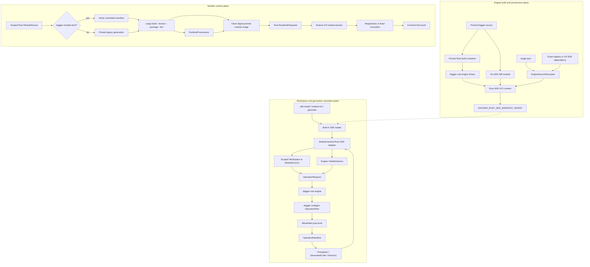

# Design Document: Rust SDK Engine Integration

## Overview

Feature 5 adds Rust to Dagger's exact-target SDK lifecycle without making the public
Rust API inherit the implementation shape of the Go SDK. The engine recognizes the
built-in name `rust`, loads an engine-packaged SDK module, executes a private Rust
operation binary for project and code-generation work, and returns a Rust-built
container runtime. Workspace installation and initialization use the current
`dagger sdk install rust` and `dagger module init rust <name>` contracts.

The selected architecture is a **packaged SDK module with a Rust operation core**. It
matches the engine seam already used by the target's Python and TypeScript SDKs:
`core/sdk/loader.go` imports an OCI content manifest, loads its `runtime/` Dagger
module, and passes the complete packaged source directory into that module's
constructor. A small Go module under `sdk/rust/runtime` implements the Dagger SDK ABI
because that ABI is currently a Dagger module loaded through the Go bootstrap runtime.
It contains no schema projection, Cargo mutation, generated-source rendering, or
public Rust API policy. Those decisions live in Rust in `dagger-codegen` and the new
private `dagger-sdk-engine` crate.

This division is deliberate. Dagger's `SDK`, `ModuleInitializer`, `CodeGenerator`,
`ClientGenerator`, `Runtime`, and `ModuleRuntime` contracts are Go engine interfaces at
the Target_Revision (`core/sdk.go @
25300124ca110612edc09c43f89cb5fad6028170`). Implementing the adapter in Go avoids a
parallel engine protocol. Keeping its inputs and outputs declarative prevents Go
syntax, ownership, zero-value conventions, or generator structures from becoming Rust
SDK design. Rust controls Cargo package discovery, manifest preservation, immutable
dependency selection, operation planning, diagnostics, artifact ownership, and the
runtime entrypoint source.

The engine packages one OCI root containing:

- the Go ABI adapter Dagger module under `runtime/`;
- the `dagger-rust-engine` executable compiled from private Rust workspace crates;
- the exact `EngineSourceDescriptor` selected by the engine build;
- the Rust `1.97.1` build environment and declared cache seeds; and
- only the templates and metadata named by the packaged-asset manifest.

`rust` is therefore usable without a repository checkout or a network fetch for SDK
implementation assets. A generated user project depends only on the publishable
`dagger-sdk` crate through an exact registry version or immutable Git revision. It
never names `dagger-codegen`, `dagger-bootstrap`, `dagger-sdk-engine`, or a filesystem
path.

The design consumes the complete engine-supplied `VisibleSchema`. It validates the
target Core_Schema as an exact compatible subgraph, treats module and dependency types
as operation-local extensions, and then produces a typed `OperationPlan`. The pure
compiler returns candidate artifacts and declared post-work. The engine runner performs
filesystem, formatter, Cargo, and process I/O only in an ephemeral Dagger container and
publishes a complete `OperationManifest` after every step succeeds.

Feature 5 makes all four historical generator selectors real. `GenerateLibrary` and
`GenerateModule` use production renderers. `GenerateClient` traverses the real engine
hook and emits the Feature 5 baseline project; Feature 7 remains responsible for
declaring that project complete across core, module, and dependency clients.
`GenerateEntrypoint` traverses the real operation and emits a private fixed protocol
probe; Feature 6 replaces that renderer with source-derived TypeDefs and general user
dispatch. Hook evidence is stored separately from delegated-content evidence.

Runtime construction has two explicit modes. Current `dagger-module.toml` projects use
committed generated files and fail with a `dagger generate` repair if their manifest is
missing or stale. Legacy `dagger.json` projects may regenerate into the private
container filesystem. Both paths select one Cargo package and binary, require an exact
toolchain and compatible lockfile, build with `--locked`, copy only the resulting
entrypoint and runtime necessities into a clean final image, and bind a canonical
`RuntimeProvenance` record to that image.

The behavioural and wire authorities are the exact files cited in the approved
requirements. Cargo workspace discovery uses the versioned `cargo metadata
--format-version 1 --no-deps` contract rather than an invented manifest-walking
approximation. `toml_edit` supplies format-preserving Cargo manifest mutation; it is a
private engine-tool dependency and does not enter `dagger-sdk`'s public dependency
graph.

Implementation closure and SDK sign-off are separate gates. Ordinary Feature 5
checkpoints execute the production Rust compiler, operation facade, project/runtime
planners, protocol model, and evidence model through an engine-free contract harness.
The packaged adapter and exact-engine matrix remain production code, but engine
construction and execution occur only at SDK sign-off. Until that later matrix passes,
engine-dependent completeness rows remain Partial.

## Dependencies and Non-Goals

### Owning relationships

- Feature 1 owns Capability_ID construction, ledger transitions, evidence admission,
  authority extraction, and derived reporting. Feature 5 adds an exact scope mapping,
  operation manifests, integration observations, and Rust-policy rows through those
  existing mechanisms.
- Feature 2 owns `Client`, `SessionHandle`, `QueryBuilder`, generated handle ownership,
  shutdown, and raw execution. The runtime probe calls those public paths and does not
  introduce a second connection or query stack.
- Feature 3 owns existing-session validation, authenticated loopback transport,
  propagation, typed query errors, compatibility checks, diagnostics, and process
  cleanup. A Rust runtime entrypoint receives the nested Dagger session through that
  exact connector.
- Feature 4 owns canonical schema decoding, Rust naming, type projection, generated
  Core_Schema bindings, and pure rendering invariants. Feature 5 generalizes the input
  policy from exact core-only schema to exact core plus operation-scoped visible
  extensions and composes the compiler through typed engine operations.
- Feature 5 owns built-in resolution, workspace installation, Rust initialization,
  operation dispatch, path-confined publication, runtime construction, packaged
  assets, the fixed protocol probe, and exact-target engine evidence.
- Feature 6 owns Rust source discovery, public authoring attributes or macros, TypeDef
  derivation, state encoding, arbitrary function dispatch, and the final semantic
  entrypoint renderer.
- Feature 7 owns complete standalone client content, client initialization choices,
  dependency-client composition, and user-facing client usability. Feature 5 supplies
  the lossless `GenerateClient` operation and its baseline renderer.
- Feature 8 owns the full platform, SDK, engine-distribution, and application
  conformance matrix. Feature 5 adds focused Linux engine-build and runtime evidence
  for the exact target.
- Feature 9 owns stable Git-tagged distribution, version synchronization, migration
  guidance, exact-revision Cargo rehearsal, release assets, and presentation. Feature
  5 preserves `dagger-sdk` as the sole external SDK entry package.

### Construction rules

- `dagger-codegen` remains pure. It accepts data and returns plans or candidates; it
  performs no filesystem, process, network, engine-session, or completeness-ledger I/O.
- `dagger-sdk-engine` is private orchestration shipped inside the engine. It may read
  and write only the operation roots supplied by its CLI, run allowlisted Cargo or
  formatter actions, and publish only paths named by a complete candidate manifest.
- `sdk/rust/runtime` is an engine ABI adapter. It builds Dagger object graphs and maps
  the Rust tool's result into `Changeset`, `GeneratedCode`, `Directory`, or `Container`
  values. It may not parse introspection JSON, edit Cargo TOML, render Rust, infer
  generated ownership, or manufacture evidence.
- The engine loads the Rust adapter through the existing module-backed SDK mechanism.
  No `rustSDK` clone of `goSDK` is added to `core/sdk`; Rust therefore reuses the
  ordinary `module` adapters and their surface detection.
- A bare workspace SDK installation records `source = "rust"`. The engine treats that
  as an embedded built-in SDK module, not as a local path. This behavior is confined to
  known built-ins whose loader returns an actual module.
- The packaged adapter constructor requires `sdkSourceDir`. An absent directory is a
  typed load error; there is no fallback to a repository checkout or downloaded helper.
- `EngineSourceDescriptor` is generated by the engine build and cannot be overridden by
  a module, environment variable, or user Cargo manifest.
- All paths cross one lexical validator and one symlink-aware filesystem validator.
  Paths become typed relative paths before entering a plan; raw strings cannot become
  artifact destinations later.
- `OperationManifest` is the sole ownership authority for generated replacement and
  removal. Directory membership, filename prefixes, and generated-looking headers are
  not sufficient authority.
- Current module configuration selects committed generation. Legacy configuration
  selects private runtime generation. No environment switch can change that choice.
- Runtime compilation selects an engine-approved Cargo package and binary. User input
  cannot replace the build command, `--manifest-path`, `--package`, `--bin`, target
  directory, or final entrypoint path.
- Post-work is a closed Rust enum, not a string command. The runner never invokes a
  shell and never evaluates caller-provided executable names or arguments.
- The final runtime is assembled from a clean digest-pinned base. Cargo homes, target
  directories, Git state, source code, SDK assets, build sockets, and credentials are
  not inherited from the build container.

### Dependency decisions

- Add a private workspace crate named `dagger-sdk-engine`, with `publish = false`, and
  a binary named `dagger-rust-engine`. It depends on `dagger-codegen`, not
  `dagger-sdk-completeness` or the public runtime crate.
- Add `toml_edit` as a locked workspace dependency for preserving unrelated Cargo
  manifest formatting and semantic tables. It is used only by
  `dagger-sdk-engine`.
- Use the pinned Cargo executable's versioned JSON contract through `cargo metadata
  --format-version 1 --no-deps`. Decode only the fields required for workspace member,
  manifest, package, target, edition, and Rust-version selection; tolerate unknown
  fields as the Cargo contract permits.
- Reuse existing `serde`, `serde_json`, `sha2`, `thiserror`, `clap`, `tempfile`,
  `fs4`, `tokio`, `proc-macro2`, `quote`, and `syn` workspace dependencies.
- Reuse `proptest` as the workspace-standard property framework. Go adapter properties
  use table/model tests because the repository has no Go PBT dependency and the
  generated input space is small; the Rust core owns the variable input models.
- Do not add `cargo_metadata`: the pinned CLI is already required for project builds,
  its `--no-deps` mode avoids fetching dependencies, and a narrow serde view keeps
  opaque Cargo source identifiers out of policy.
- Do not add a template runtime, shell parser, filesystem walker, command-execution
  abstraction, or second TOML implementation.

Every addition is locked, licensed through the existing deny policy, covered by the
Rust security workflow, and excluded from `dagger-sdk`'s published dependency surface.

### Non-goals

- Feature 5 does not design the public Rust module authoring API. The fixed protocol
  probe is private and cannot be generalized by adding branches during Feature 5.
- Feature 5 does not select an attribute, procedural macro, inventory/linker registry,
  reflection framework, or source parser for Feature 6.
- Feature 5 does not claim arbitrary constructors, functions, object state,
  interfaces, enums, dependency objects, async dispatch, or return-value conversion.
- Feature 5 does not mark standalone Rust clients complete. The baseline client
  renderer exists to exercise the engine hook and provide a reviewable foundation.
- Feature 5 does not publish private codegen or engine crates and does not copy their
  source into generated projects.
- Feature 5 does not make user projects depend on the Dagger repository filesystem,
  an engine content mount, a mutable branch, a wildcard version, or an unpublished
  registry package.
- Feature 5 does not support `rust@<version>` shorthand at the target. Explicit local
  or immutable external SDK module references retain the engine's ordinary external
  resolution behavior.
- Feature 5 does not add live schema fetching to repository regeneration. Engine
  operations consume the schema file supplied by the engine; repository regeneration
  remains checked-target work.
- Feature 5 does not change Feature 4's public naming, nullability, default omission,
  directive, scalar, interface, documentation, or serialization policies.
- Feature 5 does not add a host-installed Rust or Cargo prerequisite. All engine
  operations run in the packaged Dagger container.
- Feature 5 does not promise offline resolution of arbitrary user dependencies. It
  packages its own implementation and may seed the selected `dagger-sdk` dependency,
  while ordinary Cargo dependencies retain their declared network and credential
  requirements.
- Feature 5 does not expand the full release matrix or publish a stable `1.0.0` crate.

## Architecture Decision

### Selected: packaged module plus private Rust operation binary

The selected design uses the existing `loadBuiltinSDK` path. The engine build creates
an OCI content manifest and sets `DAGGER_RUST_SDK_MANIFEST_DIGEST`. The loader imports
that manifest, opens `runtime/` as a Dagger module, and supplies the complete root to
its optional `sdkSourceDir` constructor input. The module exposes the standard SDK
function names, so `core/sdk/module*.go` performs ordinary typed adaptation.

This has four useful consequences:

1. the engine owns the exact SDK assets and provenance;
2. the adapter remains replaceable without adding a second engine interface;
3. Cargo and codegen logic is compiled from Rust and directly property-tested; and
4. user projects see only the publishable `dagger-sdk` dependency.

The Go adapter is not considered the Definitive_Go_SDK and does not contribute Rust
API parity evidence. It is equivalent to an FFI shim: review should reject business
rules that appear there instead of in Rust.

### Rejected alternatives

| Alternative | Rejection reason |
|---|---|
| Copy `goSDK` into a new hand-written `rustSDK` engine type | Duplicates loader/runtime orchestration, bypasses ordinary module surface detection, and leaves workspace generator integration bespoke |
| Ship Rust as an external Git SDK module only | Makes bare `rust` availability depend on network state and cannot bind implementation assets to the engine manifest |
| Publish `dagger-codegen` or `dagger-sdk-engine` | Exposes internal compiler/orchestration APIs to user dependency resolution and contradicts the approved crate graph |
| Generate repository path dependencies | Works only beside a matching checkout, cannot support crates.io consumers, and recreates PR #12229's most serious packaging flaw |
| Implement the SDK adapter itself as a general Rust Dagger module | Requires Feature 6's authoring and dispatch system in order to bootstrap Feature 5, creating a dependency cycle |
| Add hard-coded general Rust dispatch to bootstrap the adapter | Creates a second, throwaway authoring model whose behavior would be difficult to distinguish from Feature 6 |
| Run arbitrary post-generation commands from a manifest | Turns schema or project input into command execution and makes deterministic evidence impossible |

## Repository Layout

```text
sdk/rust/
├── Cargo.toml
├── ARCHITECTURE.md
├── crates/
│   ├── dagger-codegen/
│   │   └── src/
│   │       ├── lib.rs
│   │       ├── schema/
│   │       │   ├── canonical.rs
│   │       │   └── validate.rs
│   │       ├── engine/
│   │       │   ├── mod.rs             # VisibleSchema -> OperationPlan
│   │       │   ├── input.rs           # typed operation inputs
│   │       │   ├── visible.rs         # exact core + visible extension closure
│   │       │   ├── library.rs          # library artifact plan
│   │       │   ├── module.rs           # module artifact plan
│   │       │   ├── client.rs           # engine-hook baseline client renderer
│   │       │   └── entrypoint.rs       # private protocol-probe renderer
│   │       └── render/
│   ├── dagger-sdk-engine/
│   │   ├── Cargo.toml                  # publish = false
│   │   ├── README.md
│   │   └── src/
│   │       ├── lib.rs                  # private orchestration facade
│   │       ├── main.rs                 # dagger-rust-engine
│   │       ├── cli.rs                  # closed operation command shape
│   │       ├── descriptor.rs           # engine provenance decode/validation
│   │       ├── project/
│   │       │   ├── mod.rs              # Cargo metadata selection
│   │       │   ├── manifest.rs         # toml_edit semantic patching
│   │       │   ├── toolchain.rs        # exact compatible toolchain
│   │       │   └── vcs.rs              # narrow ignore/attribute edits
│   │       ├── operation.rs             # plan -> candidate orchestration
│   │       ├── post_work.rs             # closed Cargo/rustfmt actions
│   │       ├── ownership.rs             # previous-manifest collision policy
│   │       ├── publish.rs               # confined transaction
│   │       ├── runtime.rs               # committed/legacy verification
│   │       └── diagnostic.rs            # stable typed private failures
│   ├── dagger-bootstrap/                # repository generation only
│   ├── dagger-sdk-completeness/
│   │   └── src/engine_integration/
│   │       ├── scope.rs
│   │       ├── manifest.rs
│   │       └── evidence.rs
│   └── dagger-sdk/                      # sole publishable crate
│       └── src/gen/                     # Feature 4 generated core bindings
├── runtime/
│   ├── dagger.json                      # Go bootstrap module
│   ├── go.mod
│   ├── main.go                          # declarative engine ABI adapter
│   ├── operation.go                     # Dagger container composition
│   ├── runtime.go                       # clean runtime assembly
│   ├── internal/dagger/                 # generated Go bindings
│   └── dagger.gen.go                    # generated adapter dispatcher
├── completeness/
│   ├── engine-integration-mappings.json
│   └── artifacts/
│       ├── engine-integration-manifest.json
│       └── engine-integration-report.json
└── tests/
    └── engine-integration/
        ├── fixtures/
        └── README.md

core/sdk/
├── loader.go                            # rust built-in dispatch
├── sdkmeta/sdkmeta.go                   # canonical rust metadata
└── workspace_module.go                  # dagger-rust-sdk / built-in source

engine/distconsts/consts.go              # Rust manifest digest env name
toolchains/engine-dev/build/sdk.go        # Rust OCI content builder
core/integration/rust_sdk_test.go          # exact-target engine integration
toolchains/rust-sdk-dev/main.go            # focused development gates/evidence
```

`dagger-bootstrap` remains repository-only. Creating `dagger-sdk-engine` prevents the
engine operation protocol from becoming an accidental second mode of the repository
regenerator and gives packaging a closed asset boundary.

## Architecture

The build plane creates one immutable engine/SDK pair. The operation plane turns
engine objects into data and delegates all Rust decisions to the packaged binary. The
runtime plane consumes committed artifacts or a private legacy regeneration, builds
one selected binary, and then enters the nested engine session.



### Engine build path

1. `rustSDKContent` reads the checked target and engine version/revision supplied by
   the build, validates the immutable `PublishedSdkDependency`, and creates canonical
   `EngineSourceDescriptor` bytes.
2. A digest-pinned Rust `1.97.1` build container runs
   `cargo build --release --locked --package dagger-sdk-engine --bin
   dagger-rust-engine`. The produced binary is copied into a fresh content root; the
   Cargo target directory is not copied.
3. The content root receives the exact `sdk/rust/runtime` module, binary, descriptor,
   declared template files, and optional non-secret Cargo cache seed. A canonical
   asset manifest records every payload path and digest; it excludes itself and the
   descriptor to keep the digest domain acyclic.
4. The root is converted to an OCI tarball, unpacked into the engine content store,
   and its manifest digest is assigned to
   `DAGGER_RUST_SDK_MANIFEST_DIGEST` exactly as existing packaged SDKs are assigned.
5. A build missing a full revision, dependency revision/version, digest-pinned base,
   required asset, or target match fails before the engine image is returned.

### SDK resolution and workspace path

1. `sdkmeta.Builtins` contains `rust` once. `parseSDKName` rejects any `rust@...`
   shorthand before external fallback.
2. Bare `rust` loads the OCI manifest through `loadBuiltinSDK`; the existing module
   adapter installs `runtime/`, constructs it with `sdkSourceDir`, and detects its
   implemented surfaces.
3. `WorkspaceModuleForRuntime("rust")` returns installation name `dagger-rust-sdk`
   and built-in source `rust`. Workspace installation recognizes this known built-in,
   resolves its packaged module for validation, and persists the bare source. The
   running engine resolves that source through its immutable packaged descriptor; no
   new workspace provenance field is invented.
4. Reinstall compares the same normalized built-in source and becomes a no-op. A name
   occupied by another source retains the target collision diagnostic.
5. Module initialization loads the installed built-in SDK module. The adapter executes
   the Rust `InitModule` operation against the engine-supplied workspace directory and
   returns only the SDK-owned Changeset. The engine separately owns `dagger.toml` and
   `dagger-module.toml`.
6. Unless `--no-generate` is selected, the existing scoped generator path calls the
   adapter's generator for only the initialized module cwd. The adapter then invokes
   the same Rust `GenerateModule` operation used by ordinary engine codegen.

### Operation path

1. The Go adapter scopes `ModuleSource` through the target engine adapters and asks the
   engine for the exact introspection file required by the operation.
2. It constructs a canonical request file containing only typed values and IDs already
   resolved by the engine, mounts that file, schema, selected project directory,
   descriptor, and packaged executable into a private container, and invokes the
   executable without a shell.
3. `dagger-sdk-engine` verifies request/descriptor identity, runs Cargo metadata when a
   package is required, reads the previous compatible operation manifest, and presents
   pure values to `dagger-codegen`.
4. `dagger-codegen` validates VisibleSchema, creates one `OperationPlan`, and renders a
   complete ordered candidate plus a closed list of post-work actions.
5. The runner stages candidate files in private state, runs only the typed post-work,
   re-reads changed owned paths, formats Rust, computes final digests, and constructs
   canonical manifest bytes.
6. Publication revalidates every destination and previous-manifest digest, then
   atomically replaces the owned set. Any failure rolls back the private operation
   tree; the caller's Dagger Directory has not changed until the successful result is
   selected.
7. The adapter returns the resulting directory through the engine's required value
   (`Changeset`, `GeneratedCode`, or `Directory`) and supplies explicit VCS generated
   and ignored path sets.

### Runtime path

1. The adapter identifies current versus legacy config through the engine-provided
   optional introspection file. It does not infer mode from the presence of generated
   files.
2. Current mode invokes `verify-runtime` against the committed OperationManifest,
   generated files, Cargo manifest, Cargo.lock, toolchain, descriptor, and scoped
   source. It performs no schema request or regeneration.
3. Legacy mode runs `GenerateModule` in the mounted private context and never returns
   that generated directory to the host.
4. The adapter selects one package and the generated `dagger-module` binary target,
   then executes Cargo with explicit `--manifest-path`, `--package`, `--bin`,
   `--release`, `--locked`, and an SDK-owned target directory.
5. After optional stripping, the adapter invokes the closed `finalize-runtime`
   subcommand with the verified provenance input and selected binary. Rust hashes the
   final binary and emits the canonical `RuntimeProvenance`; the pre-build verifier
   never invents a digest for bytes that do not exist yet.
6. Registry, Git, and compiler caches are mounted only for build duration. Credential
   secrets are mounted through Dagger secret inputs and never appear in command args,
   environment snapshots, request JSON, or provenance.
7. A clean digest-pinned runtime base receives only the stripped binary and canonical
   non-secret provenance file. It uses `core.RuntimeWorkdirPath` and the binary as its
   entrypoint; build caches and mounts are absent.
8. `ContainerRuntime.Call` clones the filesystem/mount/meta state per call. The Rust
   entrypoint uses `dagger_sdk::connect()` to select the nested existing session. An
   empty function name registers the private fixed TypeDef; the fixed probe function
   reports its result through `FunctionCall.returnValue`.

## Components and Interfaces

Signatures below are representative contracts. Implementation may refine private names
without changing ownership, input completeness, or error behavior.

### Canonical built-in metadata (`core/sdk/sdkmeta/sdkmeta.go`)

```go
const (
    // existing values...
    Rust = "rust"
)

var Builtins = []string{
    Go, Dang, Python, Typescript, PHP, Elixir, Java, Rust,
}
```

The order is stable presentation policy; membership and uniqueness are tested
independently. `Rust` participates in the same `IsBuiltin` and available-SDK rendering
as every other value. No second list is added to the CLI or workspace packages.

### Loader and workspace mapping (`core/sdk/loader.go`, `workspace_module.go`)

```go
const sdkRust sdk = sdkmeta.Rust

func (l *Loader) namedSDK(
    ctx context.Context,
    root *core.Query,
    cfg *core.SDKConfig,
) (core.SDK, error) {
    // existing cases...
    case sdkRust:
        return l.loadBuiltinSDK(
            ctx,
            root,
            cfg,
            digest.Digest(os.Getenv(distconsts.RustSDKManifestDigestEnvName)),
        )
}

func workspaceModuleForBuiltinSDK(name sdk, suffix string) (WorkspaceModule, bool) {
    // existing cases...
    case sdkRust:
        return WorkspaceModule{Name: "rust-sdk", Source: "rust"}, true
}
```

`parseSDKName` includes `sdkRust` in the exact built-in set that rejects version
suffixes. A missing, malformed, or absent OCI digest is not interpreted as an external
reference; loading fails with Rust SDK provenance context.

The built-in workspace source is valid only on an `AsSDK` installation entry and only
when the loader result supplies `AsModule`. Ordinary ambient workspace loading already
skips built-in SDK installation entries. The install resolver adds a narrow built-in
path that loads and validates the packaged module, chooses the canonical install name,
and persists `source = "rust"` without treating it as a local filesystem path.

### Engine distribution constant and content builder

```go
const RustSDKManifestDigestEnvName = "DAGGER_RUST_SDK_MANIFEST_DIGEST"

func (build *Builder) rustSDKContent(
    ctx context.Context,
) (*sdkContent, error)
```

`rustSDKContent` uses the same `sdkContent`/OCI application path as Go, Python, and
TypeScript. Its input image constants are complete digest references; a tag-only value
is rejected by a unit-tested validator before a Dagger build graph is created.

The builder creates these content-root paths:

```text
runtime/                                      packaged Go Dagger module
dist/dagger-rust-engine                      private Rust operation executable
dist/rustfmt                                 exact-toolchain formatter executable
dist/engine-source.json                      canonical EngineSourceDescriptor
dist/packaged-assets.json                    path/digest manifest
dist/client-generation.json                  validated required-host-file metadata
dist/cargo-home/                             optional non-secret cache seed
LICENSE                                      repository license
```

The `runtime/` include set is explicit. `packaged-assets.json` covers every payload
path but excludes itself and `engine-source.json`; the final OCI digest covers all
paths. Tests, local targets, credentials, `.git`, the
repository completeness artifacts, and unpublished Rust crate source are not copied
unless a path is named as a runtime template in the asset manifest. The operation
executable is built from source during the same engine build. The formatter component
is installed from the exact target toolchain during that build and copied as its real
binary rather than a rustup proxy; both executables are hashed by the asset manifest,
and no checked-in binary is trusted.

### Module-backed engine adapter (`sdk/rust/runtime`)

```go
type RustSDK struct {
    SDKSourceDir *dagger.Directory
}

func New(sdkSourceDir *dagger.Directory) (*RustSDK, error)

func (sdk *RustSDK) InitModule(
    ctx context.Context,
    ws *dagger.Workspace,
    name string,
    path string,
) (*dagger.Changeset, error)

func (sdk *RustSDK) Codegen(
    ctx context.Context,
    modSource *dagger.ModuleSource,
    introspectionJSON *dagger.File,
) (*dagger.GeneratedCode, error)

func (sdk *RustSDK) RequiredClientGenerationFiles(
    ctx context.Context,
) ([]string, error)

func (sdk *RustSDK) GenerateClient(
    ctx context.Context,
    modSource *dagger.ModuleSource,
    introspectionJSON *dagger.File,
    outputDir string,
) (*dagger.Directory, error)

func (sdk *RustSDK) ModuleRuntime(
    ctx context.Context,
    modSource *dagger.ModuleSource,
    // +optional
    introspectionJSON *dagger.File,
) (*dagger.Container, error)
```

The optional `introspectionJSON` input makes
`module.RuntimeTrustsCommittedFiles()` true. A nil value selects current committed
mode; a present file selects legacy private codegen, matching the target engine's
module-backed adapter contract.

`InitModule`, `Codegen`, and `GenerateClient` call one private helper that:

1. obtains the engine-scoped `Directory` and normalized subpaths from Dagger objects;
2. builds a typed request from values, never from interpolated shell fragments;
3. mounts the request, schema, source, descriptor, and executable at fixed paths;
4. invokes one closed CLI subcommand with `experimentalPrivilegedNesting` only when the
   target operation requires nested engine access;
5. selects the resulting directory and manifest; and
6. maps it into the exact engine return type.

`RequiredClientGenerationFiles` reads the canonical
`dist/client-generation.json` packaged with the SDK. The Rust engine-content builder
validates and writes that data from renderer metadata; the baseline list is empty
because Cargo project shape is derived from the scoped ModuleSource directory already
supplied to the operation. Feature 7 may replace the data with a finite normalized set
if client coexistence needs additional host manifests. An absolute or escaping value
is rejected when content is built and again before it reaches the engine.

The adapter does not implement `targetRuntime`: the installed SDK module also owns
`moduleRuntime`, so the target engine records the installed SDK module ref through its
existing default path. A later split implementation must add `targetRuntime` explicitly
and return one canonical immutable ref; Feature 5 does not advertise a separation it
does not use.

The module does not implement `moduleTypes`; registration uses the runtime empty-call
path selected by `core/sdk/go_sdk.go:66-73` and
`core/sdk/module_typedefs.go @ Target_Revision`. `AsModule` is naturally true because
the adapter is a Dagger module. Clone and attachment behavior remains the existing
`core/sdk/module.go` implementation; Feature 5 adds exact isolation tests rather than
another clone implementation.

### Engine operation facade (`dagger-codegen/src/engine/mod.rs`)

```rust
#[derive(Clone, Copy, Debug, Eq, PartialEq, Serialize, Deserialize)]
#[serde(rename_all = "kebab-case")]
pub enum OperationKind {
    GenerateLibrary,
    GenerateModule,
    GenerateClient,
    GenerateEntrypoint,
}

pub struct OperationProjectionRequest<'a> {
    pub target: &'a CodegenTarget,
    pub operation: OperationKind,
    pub visible_schema_json: &'a [u8],
    pub module: Option<&'a ModuleOperationInput>,
    pub output: &'a RelativeOperationPath,
    pub sdk_dependency: &'a PublishedSdkDependency,
    pub entrypoint: Option<&'a EntrypointInput>,
}

pub struct OperationPlan {
    target: CodegenTarget,
    operation: OperationKind,
    schema: VisibleSchemaPlan,
    artifacts: BTreeMap<RelativeOperationPath, CandidateArtifact>,
    post_work: Vec<PostWorkPlan>,
    vcs_generated: BTreeSet<RelativeOperationPath>,
    vcs_ignored: BTreeSet<RelativeOperationPath>,
    projection_pass_limit: NonZeroU8,
}

pub fn project_operation(
    request: OperationProjectionRequest<'_>,
) -> Result<OperationPlan, DiagnosticSet>;
```

Construction enforces the operation/input matrix:

| Operation | Module input | Entrypoint TypeDef input | Project mutation | Output class |
|---|---|---|---|---|
| GenerateLibrary | optional module identity only | forbidden | generated library root only | reusable binding artifacts |
| GenerateModule | required | probe input permitted only for the private fixture | Cargo semantic amendments plus generated roots | `GeneratedCode` candidate |
| GenerateClient | required scoped source | forbidden | selected standalone output subtree | baseline client project |
| GenerateEntrypoint | required | required | exactly one owned entrypoint subtree | entrypoint artifact |

Missing required input and supplied forbidden input are different diagnostics. An
unknown serialized enum variant cannot construct an `OperationKind`; CLI decoding
returns `OPERATION_UNKNOWN` before schema or project access.

### Visible schema validation (`dagger-codegen/src/engine/visible.rs`)

```rust
pub struct VisibleSchemaPlan {
    canonical: CanonicalSchema,
    core_coordinates: BTreeMap<SchemaCoordinate, SemanticFingerprint>,
    extension_coordinates: BTreeMap<SchemaCoordinate, SemanticFingerprint>,
    projection: ProjectionPlan,
}

pub fn project_visible_schema(
    target: &CodegenTarget,
    input: &[u8],
) -> Result<VisibleSchemaPlan, DiagnosticSet>;
```

The Feature 4 decoder and canonicalizer gain a validation mode rather than a second
schema model:

```rust
pub enum SchemaCompatibilityMode<'a> {
    ExactTarget,
    ExactCoreWithExtensions(&'a CoreCoordinateManifest),
}
```

`ExactTarget` remains repository core generation. `ExactCoreWithExtensions` selects
one operation-specific core manifest: library and client operations require every
target core coordinate, while module and entrypoint operations permit only the exact
introspection scrub closure selected by `core/moddeps.go:17-25,161-171` and
`core/env.go:42-52 @ Target_Revision`. Every retained semantic fingerprint remains
exact; an incompatible replacement or unrelated omission fails. Target-known dangling
interface edges left by the engine's `ScrubType` implementation are admitted only when
their missing named-type coordinate belongs to that same scrub closure. Additional
module/dependency coordinates still pass the same reference resolution, wrapper,
default, directive, naming, collision, documentation, and deterministic ordering
checks.

The target's dynamic schema merger has one authoritative directive-shape exception.
`dagql/server.go:412-457` and `core/schema/module.go:41-86` declare all five
`sourceMap` arguments non-null, while `core/schematool.go:207-220 @ Target_Revision`
stamps module types and constructor fields with only `module`. The validator therefore
admits omitted `filename`, `line`, `column`, and `url` only for that exact `sourceMap`
application and only when a valued `module` argument is present. A missing `module`,
an unknown argument, a malformed value, or any required omission on another directive
retains the general directive diagnostic. This compatibility belongs in the shared
Rust canonicalizer so all four production operations observe one rule.

The target core manifest is generated from the same checked target snapshot used by
Feature 4. It is not inferred by name prefixes from the incoming schema. An extension
may reference a core coordinate; it cannot redefine it. The complete schema identity
is the digest of canonical semantic JSON, so source array order is irrelevant.

### Operation renderers

All renderers consume `VisibleSchemaPlan`; none re-decodes JSON or reassigns names.

#### Library renderer (`engine/library.rs`)

`GenerateLibrary` renders the visible client bindings into a caller-selected generated
root. Core types resolve to the published `dagger-sdk` crate; module and dependency
types are emitted as operation-owned extension modules. The output includes an index
and semantic catalog but no Cargo package, user source, or entrypoint.

#### Module renderer (`engine/module.rs`)

The module hook baseline renders:

```text
src/dagger_generated/mod.rs
src/dagger_generated/<visible extension>.rs
src/bin/dagger-module.rs
```

The generated binary path is declared in Cargo TOML as `dagger-module`. The starter
source remains user-owned. The entrypoint contains only the private protocol probe
until Feature 6 replaces its renderer. Generated extension bindings reuse the public
`dagger-sdk` client and never embed transport code. The runner, rather than this
renderer, appends `.dagger/rust/operation-manifest.json` after final bytes and post-work
are known.

#### Client renderer (`engine/client.rs`)

The baseline client renderer creates a valid Cargo package at the requested output,
uses the immutable `PublishedSdkDependency`, and emits visible-schema bindings. Its
manifest labels the content domain `engine-hook-baseline`; completeness evidence
can close the operation hook but cannot close Feature 7's client-content capability
set. Feature 7 replaces this renderer behind the same typed operation input.

#### Entrypoint renderer (`engine/entrypoint.rs`)

The Feature 5 renderer accepts exactly the checked `ModuleProtocolProbe` TypeDef
document. It rejects any other object/function set. The generated program:

- starts one Tokio current-thread runtime;
- calls `dagger_sdk::connect()` and therefore selects the nested existing session;
- reads `currentFunctionCall.name`;
- on an empty name, constructs the fixed probe TypeDef and calls `Module.serve`;
- on the one fixed probe name, returns the canonical fixed JSON value through
  `FunctionCall.returnValue`;
- returns a typed nonzero failure for every other name; and
- explicitly closes the client, preserving a query failure ahead of a later close
  failure while retaining both in a bounded diagnostic chain.

It does not inspect Rust user source, load a dynamic symbol, scan attributes, decode
object state, or invoke a caller function.

### Engine source descriptor (`dagger-sdk-engine/src/descriptor.rs`)

```rust
#[derive(Clone, Debug, Eq, PartialEq, Serialize, Deserialize)]
#[serde(deny_unknown_fields)]
pub struct EngineSourceDescriptor {
    pub format_version: u32,
    pub repository: CanonicalRepositoryUrl,
    pub dagger_revision: FullRevision,
    pub engine_version: Version,
    pub rust_sdk_version: Version,
    pub rust_toolchain: ExactRustToolchain,
    pub sdk_dependency: PublishedSdkDependency,
    pub core_schema_digest: Sha256Digest,
    pub packaged_asset_manifest_digest: Sha256Digest,
}

#[derive(Clone, Debug, Eq, PartialEq, Serialize, Deserialize)]
#[serde(tag = "source", rename_all = "kebab-case", deny_unknown_fields)]
pub enum PublishedSdkDependency {
    Registry {
        registry: CanonicalRegistry,
        package: String,
        exact_version: Version,
    },
    Git {
        url: CanonicalRepositoryUrl,
        revision: FullRevision,
        package: String,
    },
}
```

Registry requirements render as `=1.0.0-beta.10`-style exact constraints. Git
requirements render with `git` plus full `rev`; branch, tag, path, wildcard, and
default-branch forms are unrepresentable. `package` must equal `dagger-sdk` for this
feature. URL normalization removes userinfo before storage and rejects non-HTTPS
origins outside an explicit test fixture policy.

The engine build first computes `packaged_asset_manifest_digest` over payload assets,
excluding `engine-source.json` and `packaged-assets.json` themselves. It then writes
that manifest, writes the descriptor that embeds its digest, and finally computes the
OCI manifest digest over the complete root. The engine records the OCI and descriptor
digests as separate image metadata, avoiding a cryptographic fixed-point cycle.
Runtime requests carry the descriptor digest; the binary loads the canonical descriptor
from the packaged fixed path and rejects caller-supplied bytes with another digest.

### Cargo project discovery (`dagger-sdk-engine/src/project/mod.rs`)

```rust
#[derive(Clone, Debug, Eq, PartialEq)]
pub struct DiscoveredCargoProject {
    pub workspace_root: AbsoluteOperationPath,
    pub target_package: CargoPackage,
    pub lockfile: Option<AbsoluteOperationPath>,
    pub toolchain: ToolchainSelection,
}

pub struct RuntimeCargoProject {
    pub discovered: DiscoveredCargoProject,
    pub target_binary: CargoTarget,
    pub lockfile: AbsoluteOperationPath,
    pub toolchain: ExactRustToolchain,
}

#[derive(Deserialize)]
struct CargoMetadataV1 {
    packages: Vec<CargoMetadataPackage>,
    workspace_members: BTreeSet<String>,
    workspace_root: PathBuf,
    target_directory: PathBuf,
}

pub async fn discover_project(
    cargo: &ExactCargoExecutable,
    module_source: &AbsoluteOperationPath,
    manifest_hint: Option<&RelativeOperationPath>,
    cancel: &Cancellation,
) -> Result<DiscoveredCargoProject, EngineDiagnostic>;
```

The runner invokes:

```text
cargo metadata --format-version 1 --no-deps --manifest-path <candidate>
```

`--no-deps` keeps discovery local and does not fetch dependencies. The decoder treats
Cargo package IDs and source strings as opaque and tolerates unknown JSON fields. It
normalizes manifest paths against the mounted operation root and selects the one
workspace member whose package root equals the engine-selected module source. Zero or
multiple matches are typed failures. Symlink validation follows filesystem metadata
after Cargo returns; an apparently confined lexical path is not sufficient.

Runtime verification promotes a discovered project to `RuntimeCargoProject` only after
the lockfile, exact toolchain, compatible OperationManifest, and manifest-declared
`dagger-module` target have all been verified. A caller-created binary with the same
name but no ownership record is a conflict, not a target selection override.

### Cargo manifest and toolchain planning

```rust
pub struct CargoManifestPlan {
    pub original_digest: Option<Sha256Digest>,
    pub rendered: Vec<u8>,
    pub dependency_changed: bool,
    pub binary_target_changed: bool,
}

pub fn plan_manifest(
    current: Option<&[u8]>,
    package: &SelectedPackage,
    dependency: &PublishedSdkDependency,
    generated_binary: &RelativeOperationPath,
) -> Result<CargoManifestPlan, EngineDiagnostic>;

pub fn select_toolchain(
    project: &ProjectToolchainInputs,
    target: &CodegenTarget,
) -> Result<ToolchainSelection, EngineDiagnostic>;
```

`toml_edit` retains comments, decoration, table order, unrelated dependencies,
features, profiles, patches, workspace inheritance, and package fields. The planner
edits only these semantic subjects when required:

- package creation fields for a new project;
- the `dagger-sdk` dependency;
- the generated `dagger-module` binary target; and
- the target-compatible edition and `rust-version` for a newly created package.

An existing edition or Rust version is preserved when compatible. An existing
`dagger-sdk` dependency is accepted only when its canonical source equals the
descriptor. A semantically conflicting entry returns a diagnostic; it is never
overwritten. Workspace-inherited dependencies are inspected through the selected
workspace manifest and amended at their owning table only when unambiguous.

Toolchain precedence is selected-package declaration, enclosing workspace declaration,
then target default. A declaration must resolve to one exact `1.97.1`-compatible
toolchain for this target. Channel aliases such as `stable`, ranges, and mutable
toolchain files are rejected for runtime evidence. A lower toolchain returns an MSRV
diagnostic; a higher exact stable version is accepted only when the Cargo package's
declared `rust-version` and SDK MSRV remain compatible.

### VCS and authored-file policy (`project/vcs.rs`)

The runner uses line-preserving editors for `.gitignore` and `.gitattributes`. It adds
only normalized missing entries selected by the operation plan and retains all other
bytes. Generated paths are committed and may be marked `linguist-generated`; Cargo
`target/` and private operation scratch paths are ignored. The operation manifest
documents the exact regeneration command.

Starter source is created only when no Rust source target exists. Existing `.rs` files
are never passed to a renderer or formatter by initialization. Generated roots are
replaced only through previous manifest ownership.

### CLI and operation runner (`dagger-sdk-engine/src/cli.rs`)

```text
dagger-rust-engine execute \
  --request /run/dagger-rust/request.json \
  --schema /run/dagger-rust/schema.json \
  --descriptor /usr/local/share/dagger/rust/engine-source.json \
  --project /work

dagger-rust-engine verify-runtime \
  --request /run/dagger-rust/request.json \
  --descriptor /usr/local/share/dagger/rust/engine-source.json \
  --project /work

dagger-rust-engine finalize-runtime \
  --plan /run/dagger-rust/runtime-plan.json \
  --binary /work/target/dagger-owned/release/dagger-module \
  --output /run/dagger-rust/runtime-provenance.json
```

There is no generic executable/argument option. `execute` decodes a closed
`OperationRequest`; `verify-runtime` accepts only the runtime verification subset;
`finalize-runtime` accepts only a verified plan plus the engine-selected binary path.
Fixture overrides exist only under `cfg(test)` through direct library calls, not hidden
production CLI flags.

The CLI emits no source content on success. `execute` publishes the canonical operation
manifest, `verify-runtime` emits the pre-build plan, and `finalize-runtime` emits the
canonical post-build provenance. On failure, stderr contains bounded, sorted,
credential-redacted diagnostics and the process exits with a stable private exit class.
The Go adapter wraps that failure with the operation kind and preserves its underlying
Dagger execution error.

### Post-work (`dagger-sdk-engine/src/post_work.rs`)

```rust
pub enum PostWorkPlan {
    FormatRust { files: BTreeSet<RelativeOperationPath> },
    GenerateLockfile { manifest: RelativeOperationPath },
    VerifyLockedMetadata { manifest: RelativeOperationPath },
}
```

The executor constructs argument arrays itself:

- packaged `rustfmt --edition 2024 <sorted-files>`, whose binary is hashed from the
  exact target toolchain during engine-content construction and mounted back into its
  target-specific rustup path so relative private-library lookup remains valid;
- `cargo generate-lockfile --manifest-path <path>` only when initialization creates or
  deliberately changes dependency resolution; and
- `cargo metadata --format-version 1 --locked --manifest-path <path>` when verifying an
  existing resolved project.

No shell is used. Environment is assembled from an allowlist, with credential-bearing
values represented as secret mounts rather than serialized strings. Output is bounded
and redacted before a diagnostic can retain it. The operation declares a maximum of
two projection passes: the first may discover lockfile or formatted-byte changes, and
the second must converge. A third candidate is `GENERATION_NON_CONVERGENT`.

### Ownership and publication

```rust
pub struct OperationCandidate {
    pub artifacts: BTreeMap<RelativeOperationPath, CandidateArtifact>,
    pub removed: BTreeSet<RelativeOperationPath>,
    pub manifest: OperationManifest,
}

pub fn verify_ownership(
    root: &OperationRoot,
    previous: Option<&OperationManifest>,
    candidate: &OperationCandidate,
) -> Result<PublicationPlan, EngineDiagnostic>;

pub fn publish(
    root: &OperationRoot,
    plan: PublicationPlan,
) -> Result<PublicationOutcome, EngineDiagnostic>;
```

Ownership validation requires every previous artifact's current digest before it may
be changed or removed. An unknown file at a candidate path, a symlink at any traversed
component, path alias, case-fold collision, escaped output, or changed previous
manifest rejects the candidate. The operation root is an explicit directory
capability; the library accepts no ambient cwd.

Publication reuses the failure-atomic transaction pattern established by Feature 4's
`dagger-bootstrap`, but its implementation remains in the engine crate because the
operation root and manifest format differ. Each replacement is staged beside its
destination, flushed, renamed, and recorded for rollback. The manifest is published
last. In Dagger execution this mutates only an immutable-derived container filesystem;
the host receives a result only after the container exec succeeds.

### Runtime verifier and builder contract

```rust
pub struct RuntimeBuildPlan {
    pub project: RuntimeCargoProject,
    pub mode: RuntimeCodegenMode,
    pub manifest: OperationManifest,
    pub cargo_args: Vec<String>,
    pub provenance_input: RuntimeProvenanceInput,
}

pub fn verify_runtime(
    request: RuntimeVerificationRequest<'_>,
) -> Result<RuntimeBuildPlan, EngineDiagnostic>;

pub fn finalize_runtime(
    input: RuntimeProvenanceInput,
    binary: &Path,
) -> Result<RuntimeProvenance, EngineDiagnostic>;
```

The Rust verifier owns all deterministic checks and returns exact Cargo arguments. The
Go adapter owns Dagger container construction from that plan. To keep the boundary
data-only, the runner writes canonical `runtime-plan.json` after validation; it
contains no secret, token, absolute host path, or arbitrary environment value.

`finalize_runtime` revalidates the binary path against the plan's fixed target output,
hashes the post-strip bytes, and writes provenance beside the private plan. A caller
cannot use it to select another binary or amend any pre-build provenance coordinate.

The adapter mounts Cargo registry, Cargo Git, and compiler target caches at fixed build
paths, runs the returned argument vector without a shell, and selects the exact output
binary. It then creates a clean runtime container, copies the binary and provenance,
sets `core.RuntimeWorkdirPath`, removes all default args, and configures the binary as
entrypoint. Cache mounts are never copied or retained.

### Runtime protocol probe

The probe input is committed under an integration fixture as canonical TypeDef JSON
plus its digest. It declares one object and one zero-argument function returning a
fixed scalar JSON value. The generated source contains a header naming the target,
probe digest, generator format, and private-probe status; it contains no specification
feature label.

The runtime reads call context through generated target bindings rather than raw
environment parsing. `dagger_sdk::connect()` performs existing-session validation;
`Query.current_function_call()` obtains call metadata; `Query.module()` and
`Query.type_def()` construct registration; `FunctionCall.return_value()` reports the
fixed result. These surfaces are present in the Feature 4 output at the Target_Revision.

The probe executable's error type retains connection, query, protocol, result, and
close sources. Its ordinary display includes only stable phase and engine coordinates.
No session port, token, URL, headers, environment values, parent JSON, or response body
is rendered.

### Completeness integration

```rust
pub fn assemble_engine_integration_manifest(
    target: &TargetDescriptor,
    ledger: &Ledger,
    mappings: &EngineIntegrationMappings,
    packaged_assets: &PackagedAssetManifest,
    operations: &[OperationManifest],
) -> Result<EngineIntegrationManifest, DiagnosticSet>;

pub fn verify_engine_integration_evidence(
    manifest: &EngineIntegrationManifest,
    observations: &[EngineIntegrationObservation],
) -> Result<CapabilityEvidenceSet, DiagnosticSet>;
```

Assembly requires the exact existing 31-row Feature 5 scope digest and all 22 new
`policy/rust-policy/engine-*` IDs. Every row maps to one implementation subject, one
evidence-domain set, and one allowed terminal classification. Mapping by Go symbol name
alone is forbidden; reviewed Go-specific mechanisms use `IdiomaticEquivalent` records
that name the Rust invariant replacing them.

Evidence subjects include the engine revision/version, core and visible schema
digests, Rust SDK dependency, Rust toolchain, packaged OCI asset digest, operation
input/manifest digests, and exact proved Capability_IDs. The registry rejects any
subject mismatch before asking the Feature 1 transition engine for a status change.
Hook observations and delegated Feature 6/7 content observations use different
evidence IDs and non-overlapping capability sets.

### Repository development workflow (`toolchains/rust-sdk-dev`)

Feature 5 adds focused functions rather than one monolithic six-hour build:

```text
rust-sdk-dev engine-unit
rust-sdk-dev engine-content
rust-sdk-dev engine-integration --cases <name>[,<name>...]
rust-sdk-dev engine-evidence
```

Local Feature 5 checkpoints invoke Cargo and Go directly; they do not require a Dagger
engine or a `rust-sdk-dev` function. At SDK sign-off, `engine-unit` reproduces the Rust
operation properties and compile/static Go adapter tests in the containerized Dagger
graph, and `engine-content` returns a `RustEngineContent` object holding
the OCI root, target-bound engine construction inputs, and their canonical digests.
`engine-integration --cases` accepts one or more finite case selectors, constructs that
object once in the same top-level Dagger DAG, and fans the selected cases out from the
actual object. A singleton selector remains the focused development path.
`engine-evidence` constructs the object once, runs the complete exact-target matrix in
parallel branches, and writes the committed observation only after every required case
passes. All four functions are SDK-sign-off tools: an implementation
checkpoint does not invoke them, substitute simulated success for them, or admit their
evidence.

The content digest is evidence and a cache identity; it is never treated as a transport
for the content bytes. Correctness therefore does not depend on a fresh GitHub runner
sharing another runner's content store or remote cache. If cases are ever split across
top-level jobs, the OCI content must be exported once and imported with digest
verification rather than reconstructed from the digest string.

The content result is cacheable by target descriptor, source digests, Cargo.lock,
runtime adapter source, dependency descriptor, Rust image digest, and engine platform.
Changing an integration test alone does not rebuild the Rust compiler/toolchain layer.

## Data Models and Invariants

The engine adapter exchanges canonical JSON with `dagger-rust-engine`; the pure
generator accepts the corresponding Rust values directly. Every serialized model uses
an explicit `format_version`, rejects unknown enum discriminants, emits object keys in
lexical order, and normalizes relative paths before hashing. Digests use lowercase
`sha256:<hex>` strings over the canonical bytes of the named subject.

### Relative operation paths

```rust
#[derive(Clone, Debug, Eq, Hash, Ord, PartialEq, PartialOrd)]
pub struct RelativeOperationPath(Box<str>);

impl RelativeOperationPath {
    pub fn parse(value: &str) -> Result<Self, PathDiagnostic>;
    pub fn join_lexically(&self, root: &Path) -> PathBuf;
}
```

`RelativeOperationPath` represents engine-selected output directories, required client
files, generated artifacts, VCS entries, and manifest paths (Requirements 3.6-3.7,
5.13-5.15, 7.4-7.7, and 12.9). It is never empty unless the containing field explicitly
permits the operation root, never absolute, contains no `.` or `..` component, and uses
`/` as the canonical separator. The private I/O layer's `OperationRoot` capability,
not this pure lexical type, rejects a symlink outside the real operation root.
Filesystem publication revalidates the resolved parent immediately before every write;
lexical validation alone is insufficient.

### Operation request

```rust
#[derive(Clone, Debug, Eq, PartialEq, Serialize, Deserialize)]
pub struct OperationRequest {
    pub format_version: u32,
    pub operation: OperationKind,
    pub target: TargetIdentity,
    pub visible_schema: SchemaInput,
    pub module: Option<ModuleOperationInput>,
    pub sdk_dependency: PublishedSdkDependency,
    pub output_root: RelativeOperationPath,
    pub entrypoint_type_defs: Option<SchemaInput>,
}

#[derive(Clone, Debug, Eq, PartialEq, Serialize, Deserialize)]
pub struct ModuleOperationInput {
    pub name: String,
    pub original_name: String,
    pub source_subpath: RelativeOperationPath,
    pub config_format: ModuleConfigFormat,
    pub source_digest: Sha256Digest,
}
```

`target`, `visible_schema`, `module`, `sdk_dependency`, and `output_root` are the exact
operation identities required by Requirements 5.8-5.13. `entrypoint_type_defs` exists
only for Generate_Entrypoint. A previous manifest is ownership state loaded by the
runner, not a semantic operation input; it therefore cannot perturb `input_digest` for
an otherwise identical second run. Unknown fields are rejected at this engine boundary
rather than silently discarded.

`ModuleOperationInput.source_digest` is computed over the implementation-scoped source
as a canonical path-ordered inventory of metadata-free leaf-file digests after
overlaying the engine's normalized module-config representation, then excluding only
the SDK-owned generated binding subtree, generated runtime entrypoint,
operation-manifest subtree, and Dagger-maintained `.gitattributes` and `.gitignore`
bookkeeping. Empty directories and parent scaffolding created solely by excluded paths
do not affect identity. Those excluded bytes are products authenticated separately by
`OperationManifest.artifacts`; including them in their own input identity would make a
newly published manifest stale immediately. Cargo inputs, lock state, module config,
and every caller-authored implementation file remain inside the semantic source digest.

### Operation plan and manifest

```rust
#[derive(Clone, Debug, Eq, PartialEq)]
pub struct OperationPlan {
    pub target: CodegenTarget,
    pub operation: OperationKind,
    pub schema: VisibleSchemaPlan,
    pub artifacts: BTreeMap<RelativeOperationPath, CandidateArtifact>,
    pub vcs_generated: BTreeSet<RelativeOperationPath>,
    pub vcs_ignored: BTreeSet<RelativeOperationPath>,
    pub post_work: Vec<PostWorkPlan>,
    pub projection_pass_limit: NonZeroU8,
}

#[derive(Clone, Debug, Eq, PartialEq, Serialize, Deserialize)]
pub struct OperationManifest {
    pub format_version: u32,
    pub operation: OperationKind,
    pub mode: GenerationMode,
    pub target: TargetIdentity,
    pub input_digest: Sha256Digest,
    pub visible_schema_digest: Sha256Digest,
    pub module_source_digest: Option<Sha256Digest>,
    pub sdk_dependency: PublishedSdkDependency,
    pub output_root: RelativeOperationPath,
    pub artifacts: BTreeMap<RelativeOperationPath, ArtifactRecord>,
    pub post_work: Vec<PostWorkRecord>,
    pub generator: GeneratorIdentity,
}

#[derive(Clone, Debug, Eq, PartialEq, Serialize, Deserialize)]
pub struct ArtifactRecord {
    pub kind: ArtifactKind,
    pub digest: Sha256Digest,
    pub ownership: ArtifactOwnership,
}
```

The ordered collections make artifact and diagnostic order independent of filesystem
enumeration (Requirements 6.13-6.15). `OperationManifest` records every identity that
can change generated semantics (Requirements 5.16, 6.10, 9.11, and 9.12). The manifest
is a generator-owned control artifact but is excluded from its own `artifacts` map to
avoid a self-digest cycle. It is published last, after all artifact and post-work
digests have been recomputed. A path appears at most once across the artifact map, and
a generated path cannot also be an ignored cache path.

### Cargo project and package selection

The project-discovery component uses typestate. `DiscoveredCargoProject` contains the
validated `workspace_root`, uniquely selected `target_package`, optional pre-init
lockfile, and declared/default toolchain selection. `RuntimeCargoProject` can be
constructed only after the exact lockfile, toolchain, generated manifest, and
engine-approved binary target have been proved. These fields are derived from
versioned Cargo metadata and the engine-selected module source, not a recursive
`Cargo.toml` scan (Requirements 4.1-4.5 and 8.17). Exactly one package must own the
normalized source path. The workspace root, every manifest path, and every selected
target must remain within the scoped Dagger directory. Cargo package IDs are opaque
comparison keys only and are not written into generated source.

### Engine and dependency provenance

`EngineSourceDescriptor` and `PublishedSdkDependency` use the exact strict wire models
declared in the descriptor component. Their fields are the immutable build coordinates
from Requirements 2.5-2.8, 2.13-2.14, and 11.1-11.12. A registry dependency renders an
exact `=<version>` Cargo requirement. A Git dependency renders `git` plus a full
revision and never a branch, tag, path, or moving default revision. Repository URL
normalization removes user information before persistence. The descriptor digest is
embedded both in the OCI content and in the engine image metadata; disagreement is a
construction failure.

### Runtime provenance

```rust
#[derive(Clone, Debug, Eq, PartialEq, Serialize, Deserialize)]
pub struct RuntimeProvenanceInput {
    pub format_version: u32,
    pub engine_source: EngineSourceDescriptor,
    pub toolchain: ExactRustToolchain,
    pub base_image_digest: Sha256Digest,
    pub lockfile_digest: Sha256Digest,
    pub module_source_digest: Sha256Digest,
    pub operation_manifest_digest: Sha256Digest,
    pub target: RustTarget,
    pub mode: RuntimeCodegenMode,
}

#[derive(Clone, Debug, Eq, PartialEq, Serialize, Deserialize)]
pub struct RuntimeProvenance {
    pub input: RuntimeProvenanceInput,
    pub binary_digest: Sha256Digest,
}
```

The two-phase model prevents pre-build code from fabricating `binary_digest`. Together,
the input and final digest form the complete semantic cache identity for Requirements
8.2-8.9 and contain no host path, token, header, registry authentication, Git
credential, or raw environment value. `binary_digest` is computed after a successful
locked build and optional strip, before the clean runtime image is assembled. The final
image carries the canonical record so inspection can prove which inputs produced it.

### Integration evidence

```rust
#[derive(Clone, Debug, Eq, PartialEq, Serialize, Deserialize)]
pub struct EngineIntegrationManifest {
    pub format_version: u32,
    pub scope_digest: Sha256Digest,
    pub target: TargetIdentity,
    pub engine_source_digest: Sha256Digest,
    pub packaged_assets_digest: Sha256Digest,
    pub mappings: BTreeMap<CapabilityId, CapabilityMapping>,
}

#[derive(Clone, Debug, Eq, PartialEq, Serialize, Deserialize)]
pub struct EngineIntegrationObservation {
    pub format_version: u32,
    pub evidence_id: EvidenceId,
    pub subject: EvidenceSubject,
    pub cases: BTreeMap<CaseId, CaseObservation>,
    pub proved_capabilities: BTreeSet<CapabilityId>,
}
```

The manifest contains exactly the approved 31 existing Feature 5 rows and 22 Rust
engine-policy rows (Requirement 1). An observation is admissible only if every subject
coordinate equals the manifest and checked target, every claimed capability belongs to
the observation's evidence domain, and no required case is skipped or failed
(Requirements 13.24-13.29). Hook evidence and delegated Feature 6/7 content evidence
have distinct `EvidenceId` namespaces; neither can imply the other.

### Cross-model invariants

- A target, dependency descriptor, schema digest, or generated artifact never changes
  meaning without changing every enclosing canonical digest.
- User-owned files are never members of `OperationManifest.artifacts`; semantic Cargo,
  toolchain, and VCS edits are represented separately in the applied Changeset.
- Engine-visible directories contain only normalized relative paths. Absolute paths are
  internal transient implementation details and are excluded from serialized models.
- The adapter cannot request an operation or post-work action outside the closed Rust
  enums, and the Rust runner cannot execute a command string through a shell.
- A result becomes visible to the engine only after validation, post-work, digest
  recomputation, and manifest-last publication have all succeeded.

## Correctness Properties

Each property is implemented with the workspace-standard Rust property-test library
and at least 100 successful generated cases. Properties that model filesystem
boundaries use a fresh temporary tree per case and generate symlinks on platforms that
support them. Engine facts that do not vary over an input space remain fixed
integration tests in the next section rather than artificial properties.

### Property 1: Exact capability scope and evidence separation

*For any* valid completeness ledger and Feature 5 mapping input, assembly SHALL either
produce exactly the approved 31 existing capability IDs plus the 22 declared Rust
engine-policy IDs with one owner and evidence-domain mapping each, or reject the input;
missing, duplicate, moved, unclassified, delegated, and out-of-scope rows SHALL never
be silently admitted, and hook evidence SHALL never close delegated content.

**Validates: Requirements 1.1–1.12**

### Property 2: Deterministic Rust SDK resolution

*For any* SDK reference and fixed loader registry, bare `rust` SHALL select the one
canonical built-in without external resolution, `rust@<value>` SHALL return the stable
unsupported-shorthand error without network access, an explicit immutable external
reference SHALL follow only the external path, and any unresolved reference SHALL
preserve both applicable resolution causes in stable order.

**Validates: Requirements 2.1–2.4, 2.9–2.12**

### Property 3: Engine source provenance is complete and target-bound

*For any* engine build descriptor, construction SHALL succeed if and only if the full
revision, engine version, Rust SDK version, exact dependency, schema, toolchain, and
packaged-asset identities are present and mutually target-compatible; changing one
coordinate SHALL change the descriptor digest and a runtime mismatch SHALL be rejected
before an SDK result is exposed.

**Validates: Requirements 2.5–2.8, 2.13, 2.14, 11.1–11.5**

### Property 4: Workspace installation is collision-safe and reversible

*For any* workspace SDK map and sequence of install/reinstall/uninstall operations,
installing bare Rust SHALL create the canonical `dagger-rust-sdk` entry exactly once,
repeating the same source SHALL be idempotent, a distinct source occupying that name
SHALL leave the workspace unchanged, and uninstall SHALL remove only ownership records
for the selected Rust-managed module.

**Validates: Requirements 3.1–3.3, 3.14, 3.15**

### Property 5: Initialization changes are confined and failure-atomic

*For any* initial workspace tree, selected module subpath, initialization arguments,
and injected failure phase, a successful initialization SHALL publish only its declared
user-owned amendments and generated artifacts beneath the module scope, select exactly
the requested generation mode, and preserve unrelated bytes; any rejection SHALL
publish no Changeset and leave the original tree byte-identical.

**Validates: Requirements 3.4–3.10, 3.13, 4.13–4.18, 12.10**

### Property 6: Initialization argument and working-directory semantics

*For any* valid Rust-specific argument set and nested workspace working directory,
decoding SHALL preserve each typed value and generation SHALL resolve the same module
source selected by the engine; adding any unknown argument SHALL yield the stable
argument diagnostic without executing generation or mutating the workspace.

**Validates: Requirements 3.11, 3.12, 3.16**

### Property 7: Cargo package selection has exactly-one semantics

*For any* versioned Cargo metadata graph and normalized module source path, project
discovery SHALL select the package whose source root uniquely owns that path, create a
new package only when no manifest exists, and reject zero or multiple matching members
without depending on directory enumeration order.

**Validates: Requirements 4.1–4.5**

### Property 8: Cargo adoption preserves caller policy

*For any* compatible authored Cargo manifest, workspace manifest, toolchain file, and
unrelated TOML formatting, the initializer SHALL make only the semantic Dagger
dependency and target changes required by the plan, preserve all unrelated keys and
comments, retain a compatible enclosing toolchain, and render the selected dependency
as either an exact registry version or immutable Git full revision.

**Validates: Requirements 4.2, 4.6–4.12, 11.8–11.12**

### Property 9: Authored and generated ownership never cross

*For any* mixture of authored files, compatible prior generated manifests, unknown
content at generated paths, and VCS rules, planning SHALL preserve every authored byte,
replace only paths owned by the compatible manifest, reject unknown collisions, amend
VCS policy without removing unrelated entries, and document every generated path's
regeneration command.

**Validates: Requirements 4.13–4.16, 4.19, 4.20, 9.5**

### Property 10: Visible schema validation is compatible and order-invariant

*For any* Visible Schema, validation SHALL accept exactly those documents whose Core
coordinates remain compatible, whose operation-scoped module and dependency references
resolve, and whose Rust names do not collide; any permutation of otherwise equivalent
schema arrays SHALL yield the same canonical projection, artifacts, and diagnostics.

**Validates: Requirements 5.1–5.7, 5.17, 5.18, 6.18**

### Property 11: Operation identities are complete and path-confined

*For any* operation request and filesystem tree, validation SHALL retain the exact
target, schema, module source, dependency, and normalized output identities; changing
any one identity SHALL change the input and manifest digests, while an absolute,
escaping, or cross-boundary symlink path SHALL be rejected before reads or writes
outside the selected root occur.

**Validates: Requirements 5.8–5.16, 7.4, 7.6, 7.7, 13.20, 13.21**

### Property 12: Operation dispatch is total and lossless

*For any* valid operation request and finite test renderer, each of the four typed
operation selectors SHALL invoke exactly its corresponding renderer once and preserve
every required schema, module, TypeDef, output, artifact, and operation-specific input;
every unknown selector SHALL fail without invoking a renderer.

**Validates: Requirements 6.1–6.7**

### Property 13: Post-work is closed, bounded, and convergent

*For any* generated operation plan, the runner SHALL execute only the closed post-work
variants and argument classes represented by that plan, record all resulting owned
changes, perform no more than the declared maximum of two projection passes, and
either reach a fixed point or return the non-convergence diagnostic without publishing
partial output.

**Validates: Requirements 6.8–6.12**

### Property 14: Generation is deterministic and failure-atomic

*For any* operation input, filesystem enumeration order, and injected renderer,
formatter, post-work, or manifest failure, two successful runs SHALL produce identical
ordered artifacts, diagnostics, manifests, and semantic Changesets; a failed run SHALL
leave the published tree byte-identical to its initial state.

**Validates: Requirements 6.13–6.17, 6.19, 12.11, 12.15**

### Property 15: Engine capability surfaces report only implemented hooks

*For any* adapter configuration, capability discovery SHALL expose codegen,
initialization, client generation, runtime target, registration, and AsModule surfaces
if and only if the corresponding callable implementation is present, SHALL select
exactly one registration strategy, and SHALL return the exact generated or module
result rather than a placeholder.

**Validates: Requirements 7.1–7.13, 7.16, 7.17**

### Property 16: Cloned SDK state is isolated

*For any* base adapter state and two distinct ModuleSource configurations, cloning and
mutating either derived state SHALL not change the other, and attached cache-backed
results SHALL contain only identities owned by their respective clone.

**Validates: Requirements 7.14, 7.15**

### Property 17: Runtime provenance is complete and secret-free

*For any* successful runtime build, the returned container SHALL carry exactly one
canonical provenance record containing every required engine, toolchain, image,
lockfile, source, generated-manifest, binary, target, and mode identity, while omitting
all host paths, credentials, secret environment values, and mutable references.

**Validates: Requirements 8.1–8.9, 11.13–11.16**

### Property 18: Runtime toolchain, lockfile, and target selection is reproducible

*For any* Cargo project configuration, the runtime planner SHALL select the compatible
exact declared toolchain or the target default, reject below-MSRV or mutable toolchain
inputs, require and preserve locked resolution in checked mode, compile only the
engine-selected target, and configure that binary at the engine runtime workdir without
caller-controlled arguments.

**Validates: Requirements 8.10–8.19**

### Property 19: Equivalent runtime inputs produce equivalent construction

*For any* pair of runtime requests with equal canonical Runtime Provenance inputs, the
planner SHALL produce the same ordered container operations, mounts, Cargo argument
vector, entrypoint, workdir, and non-secret cache keys regardless of ambient host state
or map enumeration order.

**Validates: Requirements 8.20, 11.16**

### Property 20: Generated-file mode is an explicit state machine

*For any* module configuration and generated-artifact state, the derived runtime mode
SHALL be checked for current configuration and legacy for legacy configuration; checked
mode SHALL consume only matching committed artifacts or return an actionable generate
repair, while legacy mode SHALL regenerate only in discardable private state and SHALL
never mutate the host source.

**Validates: Requirements 9.1–9.12**

### Property 21: Protocol branch and result behavior follows call context

*For any* private probe call context, an empty function name SHALL take only the
registration branch and report the target module identity, the fixed probe function
SHALL take only the invocation branch and report its expected value through
FunctionCall, and malformed session or call context SHALL return the corresponding
typed source-preserving diagnostic without claiming general dispatch.

**Validates: Requirements 10.1–10.13**

### Property 22: Concurrent runtime calls remain isolated

*For any* finite set of concurrent ModuleRuntime calls against one runtime container,
each call SHALL observe only its own execution metadata and private filesystem state,
and its reported registration, value, failure, or cancellation SHALL be attributable
to exactly that call.

**Validates: Requirements 10.14, 12.13**

### Property 23: Packaged assets and public dependencies form a closed graph

*For any* successful engine distribution build, every required Rust integration asset
SHALL be present beneath the packaged content digest, `dagger-sdk` SHALL be the only
publishable Rust workspace crate, private crates SHALL be build inputs only, and every
generated project dependency SHALL resolve without an engine-checkout path or an
unpublished crate.

**Validates: Requirements 11.1–11.12**

### Property 24: Build credentials and caches cannot cross the runtime boundary

*For any* build request containing registry, Git, session, or environment secrets and
arbitrary cache contents, generated files, provenance, cache keys, diagnostics, and the
final runtime filesystem SHALL reveal none of those secret values; the runtime SHALL
contain no registry, Git, compiler cache, mutable SDK mount, or build-only credential.

**Validates: Requirements 11.13–11.23**

### Property 25: Security audit roots cover the shipped graph

*For any* workspace dependency and packaged-asset graph, derivation of security audit
roots SHALL include every Rust crate and binary reachable from the publishable SDK,
generator, engine tool, or packaged runtime roots exactly once; the distribution SHALL
be rejected when any reachable subject is absent from the locked repository cargo-deny
and security workflow inputs.

**Validates: Requirements 11.24, 13.34, 13.37**

### Property 26: Diagnostics have a stable typed taxonomy

*For any* failing resolution, compatibility, Cargo selection, dependency, ownership,
drift, toolchain, compilation, runtime, or protocol operation, the operation SHALL
return rather than panic, select exactly the matching taxonomy variant, retain the
underlying source where one exists, identify stable operation/path coordinates, and
render with deterministic ordering and redaction.

**Validates: Requirements 12.1–12.9, 12.14–12.16**

### Property 27: Rejection and cancellation expose no partial result

*For any* initialization, generation, runtime construction, or child-process execution
and any injected rejection or cancellation point, the integration SHALL publish no
partial Changeset, artifact set, runtime registration, or process; every started child
SHALL be terminated and reaped before control returns.

**Validates: Requirements 4.17, 4.18, 6.16, 9.8, 12.10–12.13**

### Property 28: Evidence admission is exact-target and capability-local

*For any* integration observation, admission SHALL succeed only when its engine,
version, schema, SDK source, toolchain, packaged assets, case outcomes, and capability
set exactly match the approved manifest; skipped, stale, failed, cross-target, sibling,
or out-of-domain claims SHALL be rejected without changing ledger state.

**Validates: Requirements 13.24–13.27**

### Property 29: Completeness reports are derived rather than presented

*For any* admitted evidence set and prior completeness ledger, every status change
SHALL be produced by the Feature 1 transition policy, and the resulting report SHALL
preserve the exact remaining blocker identities and distinguish engine-hook,
committed-generation, legacy-generation, and delegated content evidence.

**Validates: Requirements 1.6, 1.10–1.12, 9.12, 13.28, 13.29**

### Property 30: Canonical models round-trip without semantic loss

*For any* valid operation request, manifest, engine descriptor, runtime provenance, or
integration observation, canonical encode followed by strict decode SHALL reproduce an
equal typed value and equal digest; invalid enum values, unknown fields, non-canonical
paths, mutable dependency references, and malformed digests SHALL be rejected rather
than normalized into a different meaning.

**Validates: Requirements 2.6–2.8, 5.9–5.16, 6.10, 8.2–8.9, 13.24–13.26**

## Error Handling

`EngineDiagnostic` is the Rust taxonomy. Each variant owns a stable uppercase code,
structured non-secret coordinates, an optional source, and a human remediation. The
CLI serializes the structured diagnostic to the adapter; the adapter preserves its
code and message in the Dagger error chain rather than translating it into an unrelated
Go category. Multi-error results sort by code then normalized coordinate.

| Condition | Internal diagnostic | External behavior |
| --- | --- | --- |
| Scope manifest omits, duplicates, or misclassifies a capability | `SCOPE_MANIFEST_INVALID` | Evidence assembly fails and names the capability coordinate; no ledger mutation |
| Source row or owner drifts at the checked target | `SCOPE_DRIFT` | Evidence is rejected and the old classification remains |
| Bare Rust is absent or duplicated in canonical metadata | `SDK_RUST_METADATA_INVALID` | Engine construction/test fails before resolution is exposed |
| Versioned Rust shorthand is supplied | `SDK_VERSION_UNSUPPORTED` | Loader reports that `rust@…` is unsupported and suggests bare `rust` or an immutable external ref; no external lookup |
| Neither built-in nor external SDK resolution succeeds | `SDK_RESOLUTION_FAILED` | Engine error preserves the built-in and external causes in stable order |
| Engine source descriptor is missing or malformed | `SDK_MANIFEST_INVALID` | SDK load fails before adapter construction |
| Descriptor target differs from the running engine | `ENGINE_TARGET_MISMATCH` | SDK load fails with expected and actual non-secret coordinates |
| Required build provenance is absent or OCI content disagrees | `ENGINE_PROVENANCE_INCOMPLETE` | Engine distribution build fails before image publication |
| Workspace installation name is occupied by another source | `WORKSPACE_INSTALL_COLLISION` | Changeset is rejected and the workspace is unchanged |
| Rust-specific initialization argument is unknown or malformed | `INIT_ARGUMENT_INVALID` | Initialization names the argument; no generator or Changeset runs |
| Initialization path is absolute, escaping, or resolves outside scope | `INIT_PATH_ESCAPE` | Initialization fails before reading or writing the escaped target |
| Cargo manifest cannot be found | `CARGO_MANIFEST_MISSING` | Error names the normalized candidate and create action |
| Cargo manifest cannot be parsed | `CARGO_MANIFEST_INVALID` | Error names the normalized candidate and parse source |
| No Cargo package owns the module source | `CARGO_PACKAGE_MISSING` | Error names the normalized source path; no heuristic fallback |
| Multiple Cargo packages match the module source | `CARGO_PACKAGE_AMBIGUOUS` | Error lists sorted package coordinates; no package is selected |
| Existing Dagger dependency conflicts with the descriptor | `SDK_DEPENDENCY_CONFLICT` | Manifest is preserved and the expected immutable source is reported |
| Dependency is wildcard, branch-only, path-based, or otherwise mutable | `SDK_DEPENDENCY_MUTABLE` | Initialization rejects the exact dependency coordinate |
| Dependency resolution or lock generation fails | `DEPENDENCY_RESOLUTION_FAILED` | Bounded redacted Cargo source is retained; no new manifest/lock is published |
| Declared toolchain is below MSRV | `TOOLCHAIN_UNSUPPORTED` | Error reports required and selected stable versions |
| Toolchain is moving, ambiguous, or cannot be pinned | `TOOLCHAIN_NON_REPRODUCIBLE` | Runtime or init fails before Cargo build |
| Required lockfile is absent in checked mode | `LOCKFILE_MISSING` | Error names `dagger generate` or lock generation as the repair action |
| Lockfile is stale for the selected manifest | `LOCKFILE_STALE` | Locked build stops without rewriting committed state |
| Core schema coordinate is incompatible | `SCHEMA_CORE_MISMATCH` | Operation rejects the coordinate before rendering |
| Visible schema reference is unresolved | `SCHEMA_REFERENCE_INVALID` | Operation reports the stable schema path and source |
| Visible schema produces a Rust name collision | `RUST_NAME_COLLISION` | Operation reports all sorted colliding GraphQL coordinates |
| Operation selector is unknown | `OPERATION_UNKNOWN` | CLI exits non-zero without accessing schema, project, or renderer |
| Operation-specific input is absent, forbidden, or invalid | `OPERATION_INPUT_INVALID` | CLI names the operation and stable input coordinate without invoking a renderer |
| Output or required-file path escapes lexically | `OUTPUT_PATH_ESCAPE` | Operation rejects the normalized coordinate before filesystem access |
| A symlink crosses the operation boundary | `OUTPUT_SYMLINK_ESCAPE` | Operation rejects the resolved path before publication |
| Unknown bytes occupy a generated-owned path | `OWNERSHIP_CONFLICT` | User bytes are preserved and regeneration stops |
| Prior operation manifest is incompatible or corrupt | `OPERATION_MANIFEST_STALE` | Replacement is denied and a clean regeneration action is reported |
| Post-work asks for an unapproved action or argument | `POST_WORK_REJECTED` | No process starts and staged artifacts are discarded |
| Projection exceeds its pass bound | `GENERATION_NON_CONVERGENT` | Operation reports the changing artifact coordinates and publishes nothing |
| Renderer or non-formatting post-work fails | `GENERATION_FAILED` | Underlying source is retained; staged output is discarded |
| Rust formatting fails | `FORMAT_FAILED` | Formatter source is retained; staged output is discarded |
| Manifest-last publication fails | `PUBLICATION_FAILED` | No operation result is returned and the prior published tree is restored |
| Restoration of a failed publication also fails | `ROLLBACK_FAILED` | Rollback failure is chained without hiding the primary publication cause |
| Generated artifact is absent in checked mode | `GENERATED_MISSING` | Runtime names the path and `dagger generate` repair action |
| Generated artifact digest is stale in checked mode | `GENERATED_STALE` | Runtime names the path and `dagger generate` repair action |
| Engine-selected Cargo target is absent or replaced | `RUNTIME_TARGET_INVALID` | Build stops before compilation and ignores arbitrary caller binaries |
| Cargo compilation fails | `RUNTIME_BUILD_FAILED` | Bounded credential-safe Cargo diagnostic is preserved; no runtime is registered |
| Nested session metadata is absent or malformed | `RUNTIME_SESSION_INVALID` | Entrypoint exits non-zero without attempting an unauthenticated connection |
| Engine call context is malformed | `RUNTIME_PROTOCOL_INVALID` | Entrypoint returns a protocol-phase error without response data |
| Registration protocol operation fails | `RUNTIME_PROTOCOL_FAILED` | Typed engine source is preserved; no registration success is claimed |
| Function result reporting fails | `RESULT_REPORT_FAILED` | Typed FunctionCall source is preserved; no invocation success is claimed |
| Operation is cancelled | `OPERATION_CANCELLED` | Child processes are terminated/reaped and staged state is discarded |
| Build output contains a credential-bearing URL, header, token, or secret | `DIAGNOSTIC_REDACTION_FAILED` | Unsafe diagnostic is replaced by the stable redaction failure code |
| Integration observation is skipped, stale, failed, or target-mismatched | `EVIDENCE_SUBJECT_MISMATCH` | Registry rejects the entire observation without partial admission |
| Observation claims a sibling or out-of-domain capability | `EVIDENCE_SCOPE_VIOLATION` | Registry names only the offending capability IDs and preserves ledger state |

The Go adapter also retains ordinary engine cancellation and Dagger error wrapping.
Panics in a private Rust binary are treated as `RUNTIME_BUILD_FAILED` or
`GENERATION_FAILED` at the process boundary, but production Rust code is designed to
return diagnostics and compiles under the repository's panic/unwrap/unsafe policy.

## Testing Strategy

### Property tests

Rust property suites use `proptest`, a minimum of 100 successful cases per property,
deterministic failure persistence, and normal shrinking. The generated value strategies
live beside the owning pure model rather than in one global test-support crate.

| Placement | Properties | Principal generated models |
| --- | --- | --- |
| `dagger-codegen/src/engine/visible.rs` | 10 | schema permutations, compatible extensions, unresolved references, naming collisions |
| `dagger-codegen/src/engine/mod.rs` and renderers | 12–14 | operation variants, finite renderer outputs, post-work plans, failure phases |
| `dagger-sdk-engine/src/path.rs` and `operation.rs` | 11, 30 | relative paths, symlink trees, canonical wire models, identity mutations |
| `dagger-sdk-engine/src/project/` | 5–9 | workspace trees, Cargo metadata graphs, TOML documents, VCS policies |
| `dagger-sdk-engine/src/descriptor.rs` plus engine builder fixtures | 3, 23, 25 | build descriptors, dependency/source graphs, packaged asset sets, security roots |
| `dagger-sdk-engine/src/runtime.rs` | 17–20, 24, 27 | toolchains, lock states, provenance, cache/secret sets, failure injection |
| `dagger-sdk-engine/src/protocol.rs` | 21, 22 | call contexts, concurrent call IDs, session failures |
| `dagger-sdk-completeness` engine-integration modules | 1, 28, 29 | ledgers, mappings, evidence subjects, capability claims |
| Go adapter model tests plus Rust adapter fixtures | 2, 4, 15, 16 | loader references, workspace transitions, hook configurations, clone state |
| Cross-layer canonical model tests | 26 | error variants, source chains, coordinate ordering, secret-bearing strings |

Property identity is encoded in stable test names such as
`property_01_exact_capability_scope`, and the implementation task retains the
requirement links. Inline test comments state the invariant when it is not evident from
the assertion, but do not name specification features. This applies the repository's
WHY-not-WHAT documentation standard and the operator's explicit preference against
feature-spec labels in source comments. Go uses the same naming convention and does not
add a second property framework.

### Example-based unit tests

Fixed tests cover facts that are not useful generated input spaces:

- exact canonical built-in metadata and workspace installation names;
- exact CLI discriminants, JSON format versions, environment constant names, OCI paths,
  runtime workdir, target binary name, and descriptor field spellings;
- each stable diagnostic code and one representative remediation message;
- the exact default Rust toolchain and MSRV for the target;
- exact Cargo argument vectors for metadata, lock generation, formatting, and runtime
  compilation;
- the private probe's fixed TypeDef, registration identity, function name, and result;
- empty versus finite required-client-file responses; and
- manifest-last ordering and rollback behavior under deterministic fault injection.

Pure Rust tests run without an engine or network. Process tests use fixture executables
that record argument vectors and model success, failure, cancellation, and redaction;
they never depend on the developer's ambient Cargo configuration.

The pure contract harness uses deterministic exact-core, module-visible, and
engine-authored `sourceMap(module: ...)` fixtures. It runs the real production
projection and renderer for Generate_Library, Generate_Module, Generate_Client, and
Generate_Entrypoint, plus the project/runtime planners and protocol state machine. Its
negative fixtures remove `sourceMap.module`, omit a required argument from another
directive, mutate core coordinates, escape roots, cross symlinks, collide with authored
files, stale locks/toolchains, and inject credential-shaped failures. This harness is
the local integration boundary; it does not instantiate the production Dagger runner.

Generated-binding verification is change-triggered rather than cyclical. Documentation,
fixtures, Rust internals, and implementation-only Go edits do not run a Dagger generator.
Only a reviewed change to the owning Dagger module API or schema authorizes one scoped
refresh of that module's bindings; the resulting diff is inspected once, then direct
compile/static checks guard it for the remainder of the checkpoint. SDK sign-off may
perform its own reproducibility regeneration after the engine boundary is intentionally
entered.

### Go adapter and engine-build tests

Focused Go tests compile and statically inspect the module-backed ABI adapter and its
fixed reflected surface. Rust remains the sole behavioural implementation of schema,
Cargo, ownership, rendering, runtime planning, protocol, and evidence policy. Go tests
must not recreate those contracts as a second behavioural harness. Engine builder and
live reflection observations are reserved for SDK sign-off.

Local tests run directly through Cargo and Go. At SDK sign-off, `engine-unit` reproduces
that static boundary inside the Dagger graph, while `engine-content` returns a reusable
`RustEngineContent` object and exposes its digest for evidence. A top-level sign-off
invocation passes the actual object to parallel case branches instead of rebuilding the
Rust toolchain layer or assuming a digest string can recover bytes on another runner.

### SDK sign-off exact-target integration matrix

The SDK-sign-off suite builds revision
`25300124ca110612edc09c43f89cb5fad6028170` with the current Feature 5 patch and uses
that engine for all cases. Requirements 13.1-13.23 are deliberately example-based
end-to-end observations, because each names one fixed target behavior rather than a
variable invariant.

| Case | Required observation | Requirements |
| --- | --- | --- |
| `resolution` | Rust appears once; bare install succeeds; shorthand fails without external resolution | 13.1–13.3, 13.16 |
| `init-empty` | empty Cargo project initializes and automatic generation is scoped | 13.4, 13.7 |
| `init-existing` | compatible Cargo project is adopted and unrelated workspace bytes remain unchanged | 13.5, 13.6 |
| `init-no-generate` | initialization succeeds while generated artifacts are absent | 13.8 |
| `operations` | distinct library, module, client, and entrypoint selector observations are retained; module and client additionally traverse their real engine adapter hooks; finite client and entrypoint renderers retain inputs | 13.9–13.11 |
| `runtime-checked` | committed generated artifacts produce a Runtime Container and private probe registration/invocation succeed | 13.12, 13.14, 13.15 |
| `runtime-legacy` | private ephemeral generation produces a Runtime Container without host mutation | 13.13 |
| `negative-generated-lock-toolchain` | missing generation, stale lock, and incompatible toolchain return their typed repairs | 13.17–13.19 |
| `negative-path-ownership` | lexical escape, symlink escape, and unknown ownership collision preserve external files | 13.20–13.22 |
| `negative-redaction` | injected credential values do not occur in files, provenance, cache keys, or diagnostics | 13.23 |

The protocol case runs registration and invocation through `ModuleRuntime.Call`; calling
the private binary directly is not admissible evidence. The test also launches at
least two overlapping calls to cover call isolation without claiming Feature 6
dispatch completeness.

### Completeness and security verification

`rust-sdk-dev engine-evidence` consumes only passed exact-target cases, rebuilds the
canonical integration observation, verifies its target and scope digests, and then
invokes the Feature 1 admission and transition APIs. A skipped case is not success.
Reports are regenerated and compared in the same clean-worktree checkpoint so derived
counts cannot drift from admitted evidence.

Feature 5 implementation closure runs, in order:

1. formatting checks for changed Rust and Go source;
2. locked Rust checks and tests for all workspace crates;
3. warning-denied clippy and rustdoc;
4. the repository cargo-deny policy over the locked graph;
5. compile or static tests for every changed Go ABI-adapter package;
6. the complete pure Rust contract harness without constructing a Dagger engine;
7. repository Rust security checks; and
8. clean-worktree verification after report rendering, with generated bindings compared
   rather than regenerated unless their owning API/schema changed.

This is the executable coverage for Requirements 13.30-13.37. Individual development
checkpoints run their owning unit/property slice; implementation closure runs the
complete engine-free contract once. SDK sign-off separately runs the exact-target
matrix using one shared engine content object, admits its observations, regenerates the
integration report, and verifies the clean derived result. Build cache keys exclude
test-only source from the packaged Rust toolchain layer while retaining every source
and provenance input that can affect shipped content.

## Iteration and Feedback Notes

- Requirements were reviewed and approved before this design was written.
- The selected architecture follows the target engine's existing packaged module SDK
  seam. The Go adapter exists because that seam is a Dagger module ABI; it owns
  container composition only, while Rust owns Cargo policy, schema validation,
  rendering, provenance, diagnostics, and runtime verification.
- Pull request #12229 remains historical evidence. Its successful connection points
  informed the operation boundary; its local path mounts, Go-owned Rust behavior,
  older template, and premature authoring macros were not adopted.
- The private protocol probe establishes a real executed boundary without constraining
  Feature 6's idiomatic Rust authoring design. Generate_Client establishes the lossless
  Feature 7 hook without claiming standalone client completeness.
- The packaged descriptor makes fork-built engines and future canonical release engines
  use the same mechanism: only their immutable `dagger-sdk` dependency coordinate
  differs. No ambient checkout path enters a user project.
- Direct Cargo and Go commands are the local gate. `engine-unit`, content,
  integration-case, and evidence functions remain SDK-sign-off machinery; they do not
  sit on the ordinary Feature checkpoint path and do not manufacture evidence before a
  live run.
- The current Rust guide's mandatory `// Feature: ...` property-test tag must be
  reconciled with the approved no-feature-label comment policy before implementation;
  stable property test names retain traceability without leaking planning vocabulary
  into source comments.
