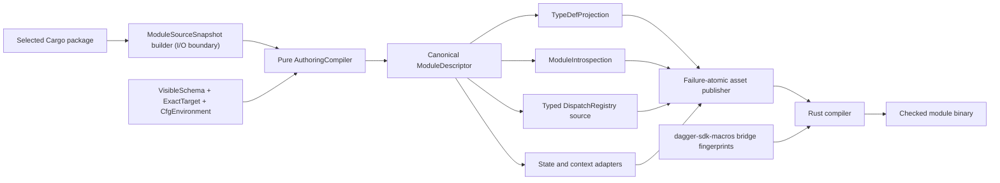
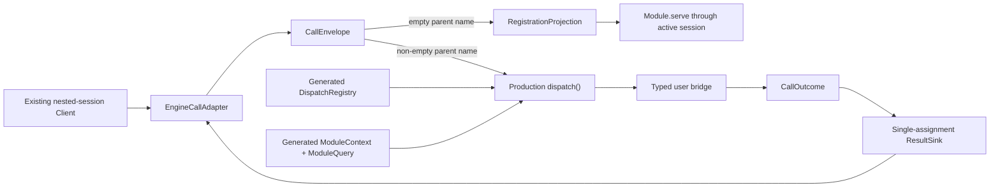

# Design Document: Rust SDK Module Authoring and Dispatch

## Overview

Feature 6 replaces the fixed private protocol probe with a complete Rust-native module
authoring compiler and production dispatcher. A module author marks ordinary Rust
structs, traits, enums, newtypes, fields, constructors, and methods explicitly; the
generator reads those declarations without executing them, builds one canonical
`ModuleDescriptor`, and emits the TypeDef registration, introspection, state codecs,
self bindings, and typed dispatch adapters from that descriptor. Rust compilation is
the final semantic convergence check: generated adapters call the real Rust symbols and
compare their expected authoring fingerprints with the companion macros' fingerprints.

The production path has two deliberately separate phases:

1. **Authoring compilation** is a pure transformation from a bounded
   `ModuleSourceSnapshot`, `VisibleSchema`, and exact target into a descriptor and
   generated assets. It performs no filesystem I/O, process execution, network access,
   Cargo build, user-code execution, or engine call.
2. **Call dispatch** is an engine-independent asynchronous state machine over a
   `CallEnvelope`, generated `DispatchRegistry`, call-scoped `ModuleContext`, and
   single-assignment `ResultSink`. Registration and invocation both enter through a
   call envelope. The real entrypoint and the local Rust harness invoke this same state
   machine. Only the narrow `EngineCallAdapter` knows how to read and publish a Dagger
   `FunctionCall`.

The engine contract at Dagger commit
`25300124ca110612edc09c43f89cb5fad6028170` owns the wire behaviour. In particular,
`core/typedef.go:2387-2513` defines the current function name, parent name, parent JSON,
named inputs, JSON-number preservation, null values, and single terminal result;
`core/schema/module.go:2658-2671` exposes the distinct value and error publication
paths. The generator under `cmd/codegen/generator/go/templates/**` at that revision and
the Go SDK at `1309520660f6a5b35ef97b4fbe151e32a06a8dc5` supply observable authoring
evidence where the engine does not settle behaviour. Their reflection, pointer,
package-global, and template mechanisms are not copied.

The selected Rust API is intentionally explicit and compiler checked:

```rust
use dagger_generated::{ModuleContext, ModuleError};

#[dagger_sdk::object(root)]
pub struct Greeter {
    #[dagger(field)]
    prefix: String,

    #[dagger(state)]
    token: Option<String>,

    transient_cache: std::collections::BTreeMap<String, String>,
}

#[dagger_sdk::methods]
impl Greeter {
    #[dagger(constructor)]
    fn new(prefix: String) -> Self {
        Self {
            prefix,
            token: None,
            transient_cache: Default::default(),
        }
    }

    /// Returns the configured greeting.
    #[dagger(function)]
    async fn greet(
        &self,
        #[dagger(context)] context: ModuleContext,
        #[dagger(default = "world")] name: String,
    ) -> Result<String, ModuleError> {
        let engine_version = context.query().version().await?;
        Ok(format!("{} {name} from {engine_version}", self.prefix))
    }
}
```

`pub` remains ordinary Rust visibility and does not export anything by itself.
`#[dagger(field)]` exposes and persists an object field; `#[dagger(state)]` persists a
private field without placing it in the TypeDef; an unannotated field is neither
exposed nor serialized and is reconstructed with `Default::default()`. Functions may
remain Rust-private because `#[dagger_sdk::methods]` emits crate-private typed bridge
methods in the declaring impl. Exported types must be accessible as `pub(crate)` or
`pub` so descriptor-generated sibling code can name them; the macros never broaden
authored visibility. There is no parallel schema and no hand-written string dispatcher.

Procedural attributes cannot live in an ordinary Rust library crate. The idiomatic
surface therefore requires a small `dagger-sdk-macros` companion which `dagger-sdk`
re-exports, following the conventional library-plus-proc-macro shape. This is a narrow,
explicit successor to Feature 5's “`dagger-sdk` is the sole publishable crate” packaging
rule: the public dependency graph now contains `dagger-sdk` and its exact-version macro
companion, while every engine, codegen, bootstrap, and completeness crate remains
private. Feature 6 makes that graph packageable but does not publish it; Feature 9 owns
registry publication and stable-release presentation.

Local implementation closure is strictly engine-free. It compiles representative
module crates, drives the production compiler and dispatcher through direct Rust
fixtures, and checks generated assets without continuously regenerating Core bindings.
The Dagger engine is used only by the later exact-target SDK sign-off matrix unless a
separately documented and approved exception proves that a contract cannot be modeled
locally.

`MChorfa/dagger-zig` commit `1ae0304f173fc2f617960cd67a7daad1729357bb`
provides comparative—not authoritative—evidence for this split. Its
`tests/module_e2e.zig` invokes production TypeDef, dispatch, serde, and method shims
without an engine; `.github/workflows/ci.yml` and `ci/pipeline/dagger.json` then use the
repository SDK from a Zig-authored Dagger module; and `sdk/main.go` retains a narrow Go
bootstrap. The v0.3.4 failure recorded in
`docs/blog/v0.3.4-community-update.md` also demonstrates why a real sign-off consumer
must resolve only packaged SDK contents. Zig reflection and API decisions do not alter
the Rust authoring design.

## Dependencies and Non-Goals

### Owning relationships

- Feature 1 owns capability IDs, status transitions, evidence admission, blocker
  rendering, and target identity. This design supplies the corrected Feature 6 scope,
  mappings, and evidence subjects but does not mutate ledger status directly.
- Feature 4 owns the fallible GraphQL schema compiler, `VisibleSchema`, generated Core
  bindings, name planning, `QueryBuilder`, and generated-artifact publication. This
  design consumes those primitives for core, self, and dependency handles rather than
  creating a second GraphQL client.
- Feature 5 owns engine SDK resolution, Cargo project selection, operation dispatch,
  runtime construction, nested-session connection, generated-file modes, and the Go
  ABI adapter. This design replaces the fixed probe inputs and protocol model with
  general module assets and call dispatch while preserving those seams.
- Feature 7 owns complete standalone client projects and the final dependency-client
  authoring experience. Feature 6 emits the self and dependency types already present
  in the operation's `VisibleSchema`; it does not claim standalone-client closure.
- Feature 8 owns the exhaustive engine-backed, cross-SDK, and cross-platform
  conformance matrix, including promotion of the bounded packaged self-consumer into a
  complete consumer workflow. Feature 6 defines only the representative exact-target
  sign-off cases needed to admit its capabilities.
- Feature 9 owns crates.io publication, migration guidance, compatibility policy, and
  stable-release presentation, including any claim that the Rust SDK builds, tests,
  and releases itself. It consumes the packageable two-crate public graph established
  here.
- `dagger-codegen` remains the pure compiler. `dagger-sdk-engine` owns filesystem,
  Cargo-project, process, publication, and engine-operation boundaries.
- `dagger-sdk` owns public runtime types, call-scoped lifecycle, codecs, query
  construction, errors, and the generic production dispatcher.
- `dagger-sdk-macros` owns only compile-time authoring attributes and typed bridges. It
  contains no schema, filesystem, engine, transport, or global runtime behaviour.
- `sdk/rust/runtime` remains a Go ABI adapter. It may marshal closed operation inputs
  and apply returned changesets; it does not analyze Rust, construct descriptors, or
  implement dispatch semantics.

### Construction rules

1. The exact target, target configuration, selected Cargo package, source snapshot,
   visible schema, and generator identity are explicit inputs. Ambient directories,
   environment variables, map order, and filesystem enumeration order are not semantic
   inputs.
2. The source snapshot builder may read files, but the authoring compiler accepts only
   immutable bytes and normalized relative paths. It cannot reach the host filesystem.
3. Discovery follows Rust module declarations from the selected crate root. It does
   not execute build scripts, procedural macros, Cargo, rustc, or user code.
4. Standard target and feature `cfg` values are evaluated from the explicit
   `CfgEnvironment`. An exported declaration depending on an unresolved custom or
   build-script-produced `cfg` is rejected with a source-located diagnostic.
5. Every semantic collection is canonicalized into a `BTreeMap` or sorted vector before
   hashing, projection, rendering, diagnostic aggregation, or publication.
6. Authoring attributes and generated bridge symbols are versioned by an
   `AuthoringAbi`. A generated adapter compiled against a different macro
   interpretation fails during Rust compilation rather than dispatching incorrectly.
7. Generated code contains no reflection or name-based fallback. Strings select a
   generated match arm; typed code in that arm reconstructs the exact receiver and
   arguments and invokes the exact bridge symbol.
8. A call owns its client lease, cancellation signal, telemetry context, arguments,
   receiver value, and result state. No mutable process-global value participates.
9. Publication remains manifest-last and failure-atomic. An authoring or compilation
   failure cannot replace the last valid generated module assets.
10. Checkpoint commands select Rust packages and fixtures explicitly. A changed
    authoring compiler does not imply a Core-schema refresh or any other SDK build.

### Dependency decisions

- Add `dagger-sdk-macros` as an exact-version workspace dependency of `dagger-sdk` and
  re-export its public attributes from `dagger_sdk`. The companion uses existing
  workspace `syn`, `quote`, and `proc-macro2` versions and introduces no runtime
  dependency.
- Keep `serde_json` as the wire and state representation because the engine
  `FunctionCall` contract is JSON. Supported typed paths always cross a typed codec;
  raw `serde_json::Value` is an internal boundary, not a supported authoring fallback.
- Keep `tokio` and `futures` for the existing asynchronous SDK runtime, cancellation
  races, panic containment, and boxed generated dispatch futures. No second executor is
  introduced.
- Keep `opentelemetry` as the telemetry implementation already selected by the SDK and
  expose it through the SDK-owned `TelemetryContext` alias. Generated crates therefore
  do not acquire an undeclared transitive dependency. `ModuleContext` carries one
  call-scoped context and never reads or changes a process-global propagator.
- Use the existing `proptest`, `loom`, and `trybuild` workspace dependencies for value
  properties, concurrency models, and source-coordinate compile fixtures.
- Avoid a runtime registration crate such as `inventory` or `linkme`. The source
  compiler produces a closed registry, which is easier to audit, deterministic across
  platforms, and does not rely on linker sections or static constructors.
- Avoid `serde` derives as the authoring contract for local object state. Generated
  codecs use SDK-owned traits so field visibility, private persistent state, handle
  IDs, interfaces, defaults, and diagnostics retain Dagger semantics.

### Non-goals

- Publishing either public crate, reserving names, or defining registry credentials.
- Replacing the Feature 5 runtime container, loader, project discovery, or Go ABI.
- Generating all standalone Core, module, and dependency clients.
- Treating arbitrary Rust reflection, generic functions, associated types, payload
  enums, trait objects, closures, references with call-external lifetimes, or
  build-script-generated authoring declarations as supported module contracts.
- Executing user code or build scripts during discovery.
- Recreating the Go package-global `dag`, pointer optionality rules, `New` naming rule,
  reflection visitor, panic helpers, or template layout.
- Making `serde_json::Value` an escape hatch for types that have a supported typed
  representation.
- Claiming engine registration, runtime-container, platform, or common-harness evidence
  from the local Rust harness.
- Running a Dagger engine at ordinary checkpoints or continuously regenerating the Core
  SDK.

## Repository Layout

```text
sdk/rust/
├── crates/
│   ├── dagger-sdk/
│   │   └── src/module/
│   │       ├── mod.rs                 # public runtime surface and hidden bridge ABI
│   │       ├── context.rs             # call-scoped generated query root
│   │       ├── codec.rs               # typed state/input/result/handle codecs
│   │       ├── call.rs                # engine-independent call envelope
│   │       ├── dispatch.rs            # production dispatch state machine
│   │       ├── result.rs              # single-assignment result sink
│   │       ├── cancellation.rs        # call-local cancellation model
│   │       └── error.rs               # typed safe application/runtime errors
│   ├── dagger-sdk-macros/
│   │   └── src/
│   │       ├── lib.rs                 # object/interface/enum/scalar/method attributes
│   │       ├── attribute.rs           # compile-time attribute grammar
│   │       ├── bridge.rs              # typed bridge emission
│   │       └── fingerprint.rs         # canonical authoring fingerprint
│   ├── dagger-codegen/
│   │   └── src/module/
│   │       ├── mod.rs                 # pure AuthoringCompiler facade
│   │       ├── source.rs              # snapshot model, Rust module and cfg discovery
│   │       ├── authoring.rs           # source-side attribute grammar
│   │       ├── model.rs               # canonical ModuleDescriptor
│   │       ├── types.rs               # Rust-to-Dagger type policy
│   │       ├── metadata.rs            # docs/default/cache/source metadata
│   │       ├── projection.rs          # TypeDef and introspection projection
│   │       ├── dispatch.rs            # closed registry rendering
│   │       ├── render.rs              # generated module assets
│   │       └── diagnostic.rs          # source-located compiler diagnostics
│   ├── dagger-sdk-engine/
│   │   └── src/project/source_snapshot.rs
│   └── dagger-sdk-completeness/
│       └── src/module_authoring.rs
├── completeness/
│   ├── mappings/rust-sdk-module-authoring.json
│   ├── policies/rust-module-authoring.json
│   └── evidence/rust-sdk-module-authoring/
└── fixtures/module-authoring/
    ├── pass/
    ├── fail/
    └── dispatch/
```

Generated projects receive only generator-owned content beneath
`src/dagger_generated/**`, the generic `src/bin/dagger-module.rs`, and the compatible
manifest entries declared by the Feature 5 operation manifest. User modules do not
depend on `dagger-codegen`, `dagger-sdk-engine`, or `dagger-sdk-completeness`.

## Architecture

### Control plane: source to checked generated assets



`dagger-sdk-engine` first resolves the selected package using Feature 5's exact-one
Cargo policy. `SourceSnapshotBuilder` then collects the manifest, crate root, and
bounded Rust source files beneath that package without following paths out of scope.
The result records every byte and digest, not host paths. The pure compiler follows
`mod` declarations, applies the explicit `CfgEnvironment`, parses authoring attributes,
computes the transitive local-type closure, validates every signature and metadata
item, and produces one canonical descriptor.

Projection and rendering consume only the descriptor. Module introspection is merged
back into the `VisibleSchema` before Feature 4 rendering, which breaks the apparent
self-binding cycle: self types and root operations are known from source before the
runtime crate is compiled. Dependency and Core types already present in the visible
schema use the same Feature 4 projection. Generated typed adapters refer to the actual
user symbols, so Cargo/rustc proves access, trait, codec, async, and return-type
convergence.

The source compiler and procedural macros intentionally have separate jobs. The source
compiler owns semantic discovery and diagnostics; the macros consume attributes so
normal Rust compilation accepts them and emit private state/invocation bridges. Both
canonicalize each exported declaration to an `AuthoringFingerprint`. Generated code
expects the compiler's fingerprint as a const-generic marker and each bridge returns
the macro's marker. A disagreement is a type error at the authored coordinate. The
fixture corpus and Property 3 additionally compare acceptance and canonical semantics
for the authoring grammar shared by both front ends.

The fingerprint covers only the normalized authoring grammar both front ends own:
markers, names, metadata, field policies, parameter roles, and the authored type-token
shape. It does not pretend that a procedural macro can perform rustc name or trait
resolution. The generated adapter's ordinary typed calls prove resolved receiver,
argument, return, alias, async, codec, and conversion compatibility. This keeps the
macro thin while making both syntactic and semantic disagreement fail compilation.

### Data plane: registration and invocation



The generic entrypoint connects once to the existing nested session and reads
`Query.currentFunctionCall`. Every call becomes an engine-independent `CallEnvelope`.
An empty parent name selects registration and applies the descriptor-derived
registration projection with `Module.serve`; a non-empty parent name selects
invocation. Within invocation, an empty function name selects the constructor rather
than registration. Argument objects are collected before dispatch so duplicates remain
observable; parent JSON remains separate from the engine-only current-node identity.

`dispatch` validates the parent/function coordinate, parent shape, complete argument
set, and every typed value before user code runs. It constructs one concrete generated
`ModuleContext` and `ModuleQuery` from the active client lease, cancellation signal,
and telemetry context, invokes exactly one generated bridge, awaits if necessary, and
converts the result into one `CallOutcome`. The result sink elects exactly one terminal
value, application error, panic error, cancellation, or publication error. Explicit
client close always runs; a primary operation failure retains precedence over a
secondary close failure.

The local harness substitutes an in-memory `ResultSink` and a fixture transport behind
the same `Client`/`QueryBuilder` abstraction. It does not substitute the authoring
compiler, generated registry, codecs, context, dispatcher, or result election. No
engine process or Go behavioural model participates.

### Capability and evidence plane

The completeness crate owns a target-bound `ModuleAuthoringScope` containing the 79
retained existing capabilities after the 17 lifecycle rows are returned to Feature 5
or SDK sign-off, plus the 32 declared Rust policy capabilities. Each row has exactly
one owning requirement, allowed terminal status, and minimum evidence domain. Local
compiler, compile-fixture, property, hygiene, and security evidence may close only
authoring/dispatch claims. Engine registration and invocation observations are admitted
only from the exact-target sign-off manifest. Reports are always derived from admitted
evidence and retain every unclosed blocker.

## Components and Interfaces

### Procedural authoring companion (`dagger-sdk-macros/src/lib.rs`)

The companion exposes four item attributes and one impl attribute, all re-exported by
`dagger_sdk`:

```rust
#[proc_macro_attribute]
pub fn object(args: TokenStream, item: TokenStream) -> TokenStream;

#[proc_macro_attribute]
pub fn interface(args: TokenStream, item: TokenStream) -> TokenStream;

#[proc_macro_attribute]
pub fn enum_type(args: TokenStream, item: TokenStream) -> TokenStream;

#[proc_macro_attribute]
pub fn scalar(args: TokenStream, item: TokenStream) -> TokenStream;

#[proc_macro_attribute]
pub fn methods(args: TokenStream, item: TokenStream) -> TokenStream;
```

The attributes accept only the grammar supported by `AuthoringAbi`. Nested
`#[dagger(...)]` metadata is legal only where the outer attribute owns the complete
item: `field`/`state` on object fields, `constructor`/`function` on inherent methods,
`context` and argument metadata on parameters, and wire/docs/deprecation metadata on
enum variants and interface methods. Unknown, duplicate, or conflicting metadata
produces `compile_error!` at its span.

An exported object, interface, enum, or scalar must be `pub(crate)` or `pub`. That is
ordinary Rust accessibility required by generated code in a sibling module, not an
export signal: an accessible unmarked type remains absent from the Dagger API. Fields
and callable methods may remain private because their macro-generated bridge lives in
the declaring module.

`object` emits a crate-private implementation of
`crate::dagger_generated::__private::ModuleObjectBridge`. The generated support module
re-exports the exact SDK bridge ABI, so expansion neither hardcodes the Cargo dependency
name nor inspects the caller's environment. Renaming `dagger-sdk` in `Cargo.toml` and
invoking the re-exported attribute through that alias therefore remains valid. The
bridge exposes only an owned tuple of declared persistent field values, reconstructs
the object from that tuple while filling unannotated fields through `Default`, and
returns an `AuthoringFingerprint<N>` for the object contract. It performs no JSON or
Dagger type conversion. Descriptor-generated codecs own wire names, field order,
interface/handle identity, and error coordinates. The bridge never makes an authored
field public.

`methods` preserves each authored method and adds a uniquely named crate-private bridge
associated with its Rust method name. The bridge retains the concrete receiver,
argument, async, and return types, injects context only at the marked parameter, and
returns its fingerprint marker. A fallible bridge performs the standard
`Into<ModuleError>` conversion inside the declaring module, so an authored error type
may remain private and generated sibling code never needs to name it. Because Rust
forbids duplicate inherent method names, multiple impl blocks remain safe without a
global registry or link-time constructor.

`interface`, `enum_type`, and `scalar` emit only their corresponding typed access and
fingerprint bridges. Descriptor-generated code owns their Dagger codecs. A custom
scalar must be a transparent one-field newtype over a supported scalar representation;
the attribute exposes owned wrap/unwrap operations and does not permit a transforming
or lossy user codec.

The macro crate reports Rust syntax errors needed for compilation but does not replace
the source compiler's multi-diagnostic semantic pass. A valid generated project must
pass both.

### Hidden bridge ABI (`dagger-sdk/src/module/codec.rs`)

The hidden ABI is public only because generated code crosses a crate boundary. The
generated `crate::dagger_generated::__private` module re-exports it for macro-expanded
bridges. It is excluded from the stability manifest and documented as version-locked
implementation detail:

```rust
#[doc(hidden)]
pub mod __private {
    pub struct AuthoringFingerprint<const VALUE: u128>;

    pub trait ModuleObjectBridge: Sized {
        type PersistentState;
        type Fingerprint;

        fn from_persistent_state(state: Self::PersistentState) -> Self;
        fn into_persistent_state(self) -> Self::PersistentState;
        fn authoring_fingerprint() -> Self::Fingerprint;
    }

    pub trait ModuleValueCodec: Sized {
        fn decode_input(value: &ModuleJson, context: &ModuleContextBase)
            -> Result<Self, DecodeError>;
        fn encode_output(self, context: &ModuleContextBase)
            -> ModuleBoxFuture<Result<ModuleJson, EncodeError>>;
    }
}
```

The macro-owned access traits and descriptor-owned codec traits are distinct. Actual
codec traits split scalar, list, optional, local-state, handle, interface, and result
concerns so an implementation cannot accidentally use an input codec as an output
codec. The representative combined signature above shows the boundary, not the final
trait granularity. Local object codec implementations are rendered from the descriptor;
they encode/decode the declared field sequence and then call the macro bridge's owned
tuple conversion. The macro never interprets JSON or chooses a wire name.

No module state or value codec implementation exists for `ModuleContext`, cancellation,
telemetry context, client, transport, raw session, or result sink. Attempting to
persist any of them therefore fails compilation, and a source-side check supplies the
earlier authored diagnostic.

### Source snapshot boundary (`dagger-codegen/src/module/source.rs`)

```rust
#[derive(Clone, Debug, Eq, PartialEq)]
pub struct ModuleSourceSnapshot {
    pub package: ModulePackageIdentity,
    pub crate_root: ModuleSourcePath,
    pub manifest: SourceDocument,
    pub files: BTreeMap<ModuleSourcePath, SourceDocument>,
    pub cfg: CfgEnvironment,
    pub digest: Sha256Digest,
}

#[derive(Clone, Debug, Eq, PartialEq)]
pub struct CfgEnvironment {
    pub target_triple: String,
    pub features: BTreeSet<String>,
    pub standard_atoms: BTreeSet<String>,
    pub declared_custom_atoms: BTreeSet<String>,
}
```

The immutable model and its validated `ModuleSourcePath` newtype live in the pure
compiler crate. `dagger-sdk-engine/src/project/source_snapshot.rs` owns the
`SourceSnapshotBuilder` I/O adapter and converts Feature 5 paths and package identity
into that model; this preserves the existing dependency direction in which the engine
crate depends on codegen, never the reverse. The builder runs after Feature 5 package
selection, applies the same lexical and resolved path containment rules as generated
publication, rejects symlink escapes, excludes `target`, VCS internals, generated
output, and unrelated packages, and enforces per-file, file-count, and total-byte
bounds. It records normalized UTF-8 source and the selected manifest. The compiler
receives no directory handle.

Build scripts are not run. A custom cfg is usable only when it is an explicit selected
configuration input. If an exported contract depends on an atom whose value cannot be
known, discovery returns `MODULE_CFG_UNRESOLVED`; it does not guess from the developer's
machine or silently drop the declaration.

### Pure authoring compiler (`dagger-codegen/src/module/mod.rs`)

```rust
#[derive(Clone, Debug, Eq, PartialEq)]
pub struct ModuleAuthoringRequest {
    pub target: ModuleTarget,
    pub source: ModuleSourceSnapshot,
    pub visible_schema: VisibleSchema,
    pub generator: GeneratorIdentity,
}

pub struct ModuleCompilation {
    pub descriptor: ModuleDescriptor,
    pub registration: RegistrationProjection,
    pub introspection: ModuleIntrospection,
    pub artifacts: GeneratedModuleAssets,
}

pub struct AuthoringCompiler;

impl AuthoringCompiler {
    pub fn compile(
        &self,
        request: &ModuleAuthoringRequest,
    ) -> Result<ModuleCompilation, ModuleDiagnosticSet>;
}
```

The compiler parses the manifest only to identify the selected library/bin crate root,
edition, enabled features, and module name. It walks inline modules and explicit `mod`
declarations using Rust privacy and cfg rules, retaining normalized source coordinates.
It accepts `#[path = "..."]` only when the resolved normalized path stays inside the
snapshot. Include macros, generated source, and arbitrary macro expansion do not create
exports; an explicit Dagger export hidden behind an uninspectable macro is rejected.

Before type discovery, the compiler constructs a deterministic crate-local namespace
for `crate`, `self`, `super`, nested and grouped `use`, renamed imports, explicit
re-exports, Cargo dependency aliases, and unambiguous glob imports. Transparent,
non-recursive type aliases are expanded; generic aliases are accepted only when every
parameter is supplied and expansion terminates in the supported type algebra. Ambiguous
imports, recursive aliases, and unresolved paths fail at their authored references.
This permits ordinary idiomatic Rust organization without pretending to implement all
of rustc name resolution or macro expansion.

Discovery begins at exactly one `#[dagger_sdk::object(root)]`, then reaches every
explicit local type referenced by exported fields, interface implementations,
constructors, arguments, and returns. A type reached more than once is interned by its
canonical Rust symbol. Impl blocks are merged before methods are ordered by normalized
wire coordinate. Unsupported foreign types and stale generated types fail at the
reference, not at a later generated file.

The compiler accumulates independent diagnostics, sorts them by code, source
coordinate, and wire coordinate, and emits no descriptor when any error is present.
This preserves a useful multi-error authoring loop without continuing into invalid
projection.

`ModulePackageIdentity`, `ModuleSourcePath`, `ModuleTarget`, `SourceDocument`, and
`GeneratorIdentity` are pure codegen-owned value types. The engine operation layer
performs explicit fallible conversion from its richer project and target models, so
codegen never acquires an inverse dependency on engine integration.

### Rust-to-Dagger type policy (`dagger-codegen/src/module/types.rs`)

The type policy is one closed recursive algebra:

```rust
pub enum RustModuleType {
    String,
    Integer,
    Boolean,
    Float,
    Void,
    List(Box<RustModuleType>),
    Optional(Box<RustModuleType>),
    LocalObject(LocalTypeId),
    LocalInterface(LocalTypeId),
    LocalEnum(LocalTypeId),
    CustomScalar(LocalTypeId),
    GeneratedObject(GeneratedTypeId),
    GeneratedInterface(GeneratedTypeId),
}

pub enum FunctionReturn {
    Value(RustModuleType),
    Fallible {
        ok: RustModuleType,
        error: RustSymbol,
    },
}
```

`String`, `i64`, `bool`, `f64`, `()`, `Vec<T>`, and representable `Option<T>` map
recursively and exactly. `Result<T, E>` belongs to function return semantics, not
GraphQL nullability. Local state values use local codecs; generated object and
interface inputs are ID-backed; generated outputs resolve the lazy selection to its ID
through the active session. Unsupported integers, tuples, maps, nested references,
borrowed values, generics, and wrapper combinations are rejected unless a later target
policy explicitly adds a lossless mapping.

Explicit `false`, zero, empty string, and empty list values remain present. Omission is
represented by a missing optional argument, never inferred from a Rust zero value.
Defaults are authored as restricted typed Rust expressions: primitive literals,
arrays, `None`/`Some(...)`, enum variants, and transparent scalar constructors. They
are parsed without evaluation, checked against the declared argument type, and then
canonicalized through the same value policy used by the runtime codec. Arbitrary
function calls, blocks, closures, macros, and ambient constants are rejected. The
descriptor stores canonical JSON, not the authored token spelling.

Every Go-supported module input/output category is recorded in the type-policy
manifest as `Equivalent`, `IdiomaticEquivalent`, `UnsupportedByTarget`, or
`DeferredWithOwner`. There is no implicit JSON fallback row.

### Canonical descriptor (`dagger-codegen/src/module/model.rs`)

```rust
#[derive(Clone, Debug, Eq, PartialEq, Serialize, Deserialize)]
#[serde(deny_unknown_fields)]
pub struct ModuleDescriptor {
    pub format_version: u32,
    pub authoring_abi: AuthoringAbi,
    pub target: TargetIdentity,
    pub source_digest: Sha256Digest,
    pub visible_schema_digest: Sha256Digest,
    pub generator_digest: Sha256Digest,
    pub module: ModuleIdentity,
    pub root: LocalTypeId,
    pub types: Vec<LocalTypeDescriptor>,
    pub functions: Vec<FunctionDescriptor>,
    pub dispatch: Vec<DispatchCoordinate>,
    pub helper_capabilities: Vec<HelperCapabilityMapping>,
    pub provenance: DescriptorProvenance,
    pub digest: Sha256Digest,
}

#[derive(Clone, Debug, Eq, PartialEq, Serialize, Deserialize)]
pub struct FunctionDescriptor {
    pub id: FunctionId,
    pub parent: LocalTypeId,
    pub rust_symbol: RustSymbol,
    pub wire_name: WireName,
    pub receiver: ReceiverKind,
    pub execution: ExecutionKind,
    pub arguments: Vec<ArgumentDescriptor>,
    pub return_type: FunctionReturn,
    pub metadata: FunctionMetadata,
    pub source: SourceCoordinate,
    pub fingerprint: AuthoringFingerprintValue,
}
```

Object, interface, enum, scalar, field, argument, metadata, source-map, state-codec, and
implementation descriptors follow the same strict serializable pattern. IDs are
content-derived typed newtypes, while display order is normalized wire order. Rust
symbols and wire names are retained separately. The digest covers every field except
the digest itself using canonical JSON and a domain separator containing the exact
target and format version.

`DescriptorProvenance` records the normalized input file digests, cfg environment,
visible schema, target, generator, and macro ABI. It contains no absolute host path,
source content, token, environment secret, or transport value. A semantic input change
therefore identifies its owning domain and changes the descriptor digest.

### Objects, interfaces, enums, and scalars

Object descriptors distinguish three field policies:

| Authored form | TypeDef | Module state | Reconstruction |
| --- | --- | --- | --- |
| `#[dagger(field)]` | Exposed with docs/type/source map | Encoded at exact wire name | Decoded through typed state codec |
| `#[dagger(state)]` | Omitted | Encoded at exact wire name | Decoded through typed state codec |
| no field marker | Omitted | Omitted | `Default::default()` for the Rust field type |

An explicit field rename is shared by TypeDef and state JSON. Local interface state
stores both the interface ID and concrete object identity. Generated handles store only
the target-compatible ID representation. A root has exactly one explicit constructor
or an explicit `default` root policy; unsafe, zeroed, and uninitialized construction are
never generated.

An exported interface is a Rust trait with supported receiver methods only. The
descriptor records each local object implementation discovered through an explicit
annotated trait impl, and verifies method wire shapes against the interface. A value
crossing the boundary uses a generated closed interface handle containing its target
ID and concrete type identity; `dyn Trait` is not the wire representation.

An exported enum contains unit variants only. Variant wire names use an explicit name
when present, otherwise the target-compatible common-prefix rule evidenced by
`cmd/codegen/generator/go/templates/module_enums.go`. Decoding is exhaustive and rejects
unknown values. An exported scalar is a one-field transparent newtype over a supported
scalar representation:

```rust
#[dagger_sdk::scalar]
pub struct EmailAddress(String);
```

The attribute emits the hidden `DaggerScalarBridge`: encoding moves out the sole inner
value and decoding constructs the newtype after the representation's ordinary typed
decode. This path is lossless by construction and still has the required infallible
scalar-to-representation and fallible wire-to-representation directions. Multi-field,
unit, transforming, or user-supplied scalar codecs are rejected; arbitrary code is not
executed or trusted to claim a round-trip law.

### Metadata projection (`dagger-codegen/src/module/metadata.rs`)

Rustdoc, deprecation, wire rename, cache policy, check, generator, up, optionality,
typed default expression, default path, default address, ignore patterns, and source
coordinates are parsed into typed metadata enums. Only target-supported spellings and
combinations are accepted. Required deprecated arguments, duplicate names after
normalization, generic functions, unsupported receivers, and invalid target
combinations fail before projection.

Injected context is identified only by `#[dagger(context)]` plus the generated
`ModuleContext` type; it is omitted from TypeDefs and must occur at most once. Every
other parameter is a data argument. Async and sync functions share one descriptor
shape. `Result<T, E>` exposes only `T`; `()` and `Result<(), E>` expose target Void.
Generated async bridges await directly and do not call a blocking executor.

### Registration and introspection projection (`dagger-codegen/src/module/projection.rs`)

`RegistrationProjection` is a data-only, ordered representation of the SDK query calls
needed to construct the target TypeDefs. `ModuleIntrospection` is the canonical GraphQL
introspection document used to merge self types into the visible schema. Both are pure
views over `ModuleDescriptor`; neither parses source or infers new metadata.

For every shared item, a structural comparison verifies name, kind, nullability, list
shape, docs, deprecation, source map, cache/function metadata, arguments, defaults, and
implementation relationships. The introspection contains exactly one `Query` root
constructor. A collision with Core or dependency coordinates is reported before either
view is returned. Failure publishes neither projection.

The existing runtime registration renderer turns `RegistrationProjection` into typed
calls through `query.type_def()`, `query.function(...)`, `query.module()`, and
`serve()`, retaining the active session. The local harness observes the data projection
and a recording registration adapter; it does not need an engine to prove construction.

### Generated module assets (`dagger-codegen/src/module/render.rs`)

```text
src/dagger_generated/
├── mod.rs
├── core/...
├── visible/...
├── module_context.rs
├── module_descriptor.rs
├── module_registration.rs
├── module_dispatch.rs
├── module-introspection.json
├── binding-catalog.json
└── generated-module-assets.json
src/bin/dagger-module.rs
```

`module_context.rs` defines the concrete generated context and query root over the
resolved SDK's public `QueryBuilder`:

```rust
#[derive(Clone)]
pub struct ModuleContext {
    inner: super::__private::ModuleContextBase,
    query: ModuleQuery,
}

#[derive(Clone)]
pub struct ModuleQuery {
    builder: super::__private::QueryBuilder,
}

impl ModuleContext {
    pub fn query(&self) -> &ModuleQuery;
    pub fn cancellation(&self) -> &super::ModuleCancellation;
    pub fn telemetry_context(&self) -> &super::TelemetryContext;
    pub fn current_call(&self) -> &super::CurrentCall;
}
```

`mod.rs` also defines a `#[doc(hidden)] __private` module which re-exports only the
exact versioned bridge ABI needed by macro expansion. The renderer uses the actual
Cargo dependency alias selected by Feature 5; neither public generated signatures nor
macro output assume that the dependency is literally named `dagger_sdk`. The generated
module publicly re-exports `ModuleCancellation`, `TelemetryContext`, `CurrentCall`, and
`ModuleError` from that resolved SDK dependency, so rustdoc and user imports remain
rooted in `dagger_generated` rather than exposing the manifest alias.

`ModuleQuery` exposes the complete Feature 4 Core root plus every selected self and
dependency root method. Lazy handles retain the same `QueryBuilder` session; immediate
scalar operations execute through it. The 36 definitive Go global helpers map
exhaustively to `ModuleQuery`, call-scoped context inspection, entrypoint-owned close,
or a reviewed target inapplicability. No helper initializes or stores a global client.

`module_dispatch.rs` contains one generated match tree over normalized parent then
function. Every arm:

1. asserts the compiler/macro fingerprint marker type;
2. decodes the exact receiver when required;
3. decodes every already-validated typed argument;
4. obtains the generated context only when declared;
5. invokes the exact crate-private bridge;
6. awaits it when asynchronous; and
7. converts the successful value or application error through the typed result codec.

The generic binary contains no module names or functions. It delegates to the generated
registration and dispatch entrypoints, so equivalent authored modules differ only in
generated assets. All generated modules include ownership headers, target/generator
provenance, rustdoc where public, and no feature/task planning labels.

`GeneratedModuleAssetsManifest` lists every owned path, content digest, semantic owner,
input-domain digest, and regeneration class. It is published last using Feature 5's
atomic publisher. Unknown paths are never adopted. Stale owned paths are removed only
when the prior compatible manifest proves ownership.

The intentional author-facing surface is limited to the re-exported attributes,
generated module types, concrete `ModuleContext`/`ModuleQuery`, `ModuleCancellation`,
`TelemetryContext`, `CurrentCall`, `ModuleError`, and documented scalar/detail value
types. `ModuleContextBase`, `ModuleJson`, `CallEnvelope`, registry/sink traits, bridge
codecs, fingerprints, prepared calls, receipts, and adapter errors are
`#[doc(hidden)]` exact-version generated ABI. They remain accessible to generated code
and workspace fixtures without becoming general SDK extension points.

### Runtime call model (`dagger-sdk/src/module/call.rs`)

```rust
#[derive(Clone, Debug, Eq, PartialEq)]
pub struct CallIdentity {
    pub call_id: String,
    pub selector: CallSelector,
}

#[derive(Clone, Debug, Eq, PartialEq)]
pub enum CallSelector {
    Registration,
    Invocation {
        parent_wire_name: WireName,
        function_wire_name: WireName,
    },
}

#[derive(Clone, Debug, Eq, PartialEq)]
pub struct CallArgument {
    pub wire_name: WireName,
    pub value: ModuleJson,
}

pub struct CallEnvelope {
    pub identity: CallIdentity,
    pub parent: ModuleJson,
    pub arguments: Vec<CallArgument>,
    pub cancellation: ModuleCancellation,
}
```

The adapter maps an empty parent name only to `CallSelector::Registration` and a
non-empty parent name only to `Invocation`, making a branch/parent disagreement
unrepresentable. The invocation selector retains the target's empty function-name
constructor sentinel in a distinct validated type.
It generates the local `call_id`; that identity is for isolation and diagnostics, not
an engine wire field.
`parent` preserves the exact JSON value returned by the SDK. The argument collection
remains a vector until validation so duplicate names are not lost. `ModuleJson`
validates one complete canonical JSON value with number preservation and bounded
diagnostic rendering.

`prepare_call` finds the generated dispatch coordinate, verifies constructor versus
instance parent rules, builds an ordered argument map, reports missing/duplicate/unknown
arguments, and decodes all typed values before returning `PreparedCall`. A validation
error cannot invoke a bridge or mutate a sink.

### Call-scoped context base (`dagger-sdk/src/module/context.rs`)

```rust
pub type TelemetryContext = opentelemetry::Context;

#[derive(Clone)]
pub struct ModuleCancellation(std::sync::Arc<CancellationState>);

impl ModuleCancellation {
    pub fn is_cancelled(&self) -> bool;
    pub async fn cancelled(&self);
}

#[doc(hidden)]
#[derive(Clone)]
pub struct ModuleContextBase {
    query_builder: QueryBuilder,
    cancellation: ModuleCancellation,
    telemetry: TelemetryContext,
    call: CurrentCall,
}

impl ModuleContextBase {
    #[doc(hidden)]
    pub fn query_builder(&self) -> QueryBuilder;

    #[doc(hidden)]
    pub fn cancellation(&self) -> &ModuleCancellation;

    #[doc(hidden)]
    pub fn telemetry_context(&self) -> &TelemetryContext;

    #[doc(hidden)]
    pub fn current_call(&self) -> &CurrentCall;
}
```

`ModuleContextBase` is a version-locked bridge excluded from the stable public API
manifest. The generated registry consumes it to construct the concrete generated
`dagger_generated::ModuleContext` and `ModuleQuery` shown above; module authors never
name a generic SDK context or implement a query-root trait. The concrete generated
context exposes only the typed methods valid for its checked visible schema.

The actual fields remain private and neither the base nor generated context implements
a module state codec. `CurrentCall` exposes typed current-call, current-module,
current-node, and engine/local-context selections without conflating parent JSON with
engine-held current-node identity.

Every generated handle cloned from `query()` shares the active session lease. No
context method calls `connect`, reads session environment variables, owns
process-global state, or closes the client. Close remains entrypoint-owned.

### Application error contract (`dagger-sdk/src/module/error.rs`)

Fallible exported functions may use any error type satisfying
`E: Into<ModuleError> + Send + 'static`. The generated bridge uses the standard
`Into::into` conversion; there is no SDK-specific conversion trait:

```rust
#[derive(Debug)]
pub struct ModuleError {
    message: String,
    details: BTreeMap<String, ModuleErrorDetail>,
}

impl ModuleError {
    pub fn new(message: impl Into<String>) -> Self;
    pub fn message(&self) -> &str;
    pub fn details(&self) -> impl Iterator<Item = (&str, &ModuleErrorDetail)>;
    pub fn with_detail(
        self,
        name: impl Into<String>,
        value: ModuleErrorDetail,
    ) -> Result<Self, ModuleErrorBuildError>;
}
```

`ModuleError` uses Rust's standard reflexive conversion. User error types normally
implement `From<UserError> for ModuleError`, which supplies `Into<ModuleError>` through
the standard library. This keeps `Result<T, E>` idiomatic while making the engine error
message an intentional author choice rather than arbitrary `Debug` output. The SDK
implements `From<QueryError> for ModuleError`: a single GraphQL error retains its safe
message and sorted extensions, while other already-redacted query errors retain their
safe display as the application message. Consequently ordinary `context.query()` calls
compose with `?`.

`ModuleError` implements `Display` and `std::error::Error`; its display is the message,
while bounded canonical-JSON details map in sorted order to the target Error's
`withValue` selections. Messages and details are validated before the adapter constructs
that target object. Transport sources, panic payloads, environment values, and opaque
debug representations are never inserted automatically.

### Dispatcher and result election (`dagger-sdk/src/module/dispatch.rs`)

```rust
pub trait DispatchRegistry: Send + Sync {
    fn descriptor(&self) -> &'static ModuleDescriptorView;

    fn invoke<'a>(
        &'a self,
        call: PreparedCall,
        context: ModuleContextBase,
    ) -> ModuleBoxFuture<'a, Result<ModuleJson, InvocationError>>;
}

pub trait ResultSink: Send + Sync {
    fn publish<'a>(
        &'a self,
        outcome: CallOutcome,
    ) -> ModuleBoxFuture<'a, Result<(), ResultPublishError>>;
}

pub trait RegistrationSink: Send + Sync {
    fn serve<'a>(
        &'a self,
        registration: &'a RegistrationView,
    ) -> ModuleBoxFuture<'a, Result<(), RegistrationError>>;
}

pub async fn handle_call<R, G, S>(
    registry: &R,
    envelope: CallEnvelope,
    context: ModuleContextBase,
    registration_sink: &G,
    result_sink: &S,
) -> Result<CallReceipt, DispatchError>
where
    R: DispatchRegistry,
    G: RegistrationSink,
    S: ResultSink;

pub async fn dispatch<R: DispatchRegistry, S: ResultSink>(
    registry: &R,
    envelope: CallEnvelope,
    context: ModuleContextBase,
    sink: &S,
) -> Result<DispatchReceipt, DispatchError>;
```

`handle_call` accepts every `CallEnvelope`, routes registration to the
descriptor-derived registration adapter, and routes invocation to `dispatch`. The
production binary and direct harness call that same wrapper; registration is not a
special harness shortcut.

`dispatch` owns a `ResultElection` state machine. It races user execution only with the
call's cancellation signal, contains an unwind at the spawned user-future boundary,
encodes the successful value, and publishes one outcome. Application errors become
structured `ModuleError` values. The engine adapter creates the target
`Error` object and passes its ID to `FunctionCall.return_error`; values use
`return_value`. Panic payloads are never rendered verbatim.

The election is `Pending -> Publishing(kind) -> Published(kind)` or
`Pending -> Cancelled`. Only one transition out of `Pending` can win. A publication
failure is terminal and preserves the selected outcome kind and function coordinate;
dispatch never attempts a second value/error path. Cancellation winning before
publication prevents success. Cancellation after the sink has accepted an outcome does
not rewrite it.

User execution and result encoding are separate phases so diagnostics distinguish an
application error, panic, encoding failure, cancellation, and transport publication
failure. Production library code returns typed errors and contains no deliberate panic
or unchecked unwrap.

### Engine call adapter and entrypoint

The generated binary's `run` function performs exactly these steps:

1. connect to the existing nested session through `dagger_sdk::connect()`;
2. read the active `FunctionCall` name, parent name, parent, and all input argument
   values into one `CallEnvelope`, deriving registration only from an empty parent name
   and retaining an empty function name as constructor selection;
3. construct the active-session `ModuleContextBase` and cancellation bridge;
4. route the envelope through `handle_call`, which invokes generated registration or
   the generic production dispatcher;
5. publish an invocation's terminal engine result exactly once; and
6. close the client, preserving primary-operation precedence.

An instance call requires a matching nonempty parent state. A constructor/top-level
call does not reconstruct a receiver even though the engine supplies an empty parent
object. Core, self, and dependency IDs are re-entered through generated constructors on
the same `QueryBuilder`; no connection or global marshal context is created.

The adapter catches only the user-future unwind inside the runtime. A bug before that
boundary still terminates the private process and is reported by the existing Feature 5
runtime failure path, while the workspace's panic/unwrap policy makes such a path a
defect rather than normal control flow.

### Completeness integration (`dagger-sdk-completeness/src/module_authoring.rs`)

`ModuleAuthoringScope::derive` verifies the pinned ledger digest, the 17-row lifecycle
ownership correction, all 79 retained rows, and all 32 Rust policy rows. Each mapping
records requirement, authority, rationale, allowed terminal status, evidence domain,
and current blocker state. Duplicate, missing, moved, stale, delegated, or out-of-scope
rows reject the complete mapping.

Evidence producers emit strict observations for compiler properties, compile fixtures,
dispatcher properties, hygiene/security gates, and later engine sign-off cases. The
Feature 1 admission API is the only status mutation route. Local observations cannot
claim `engine-registration`, `runtime-container`, `sdk-sdk`, or cross-platform domains;
an engine smoke cannot claim exhaustive source/type/dispatch closure.

### Engine-free development workflow

The ordinary loop is package-scoped:

1. run the owning unit/property or `trybuild` fixture slice;
2. format/check only the changed Rust workspace packages;
3. compile the representative generated fixture against checked assets; and
4. regenerate only when an authoring input, visible schema, exact target, or owning
   generator digest changed.

Implementation closure runs the complete Rust module-authoring suite once, followed by
locked format, check, test, clippy, rustdoc, cargo-deny, repository Rust security,
asset-drift, and clean-worktree gates. The command recorder captures command vectors,
elapsed time, package selection, whether generation ran, and an assertion that no
engine process/module/network graph was started. No other language SDK is built.

An engine exception requires a written contract gap, proof that the direct model cannot
represent it, a minimal proposed engine observation, explicit approval, and a note that
the result belongs to sign-off evidence. Convenience, uncertainty, or regeneration is
not a valid exception.

## Data Models and Invariants

### Authoring identities

`RustSymbol` is the canonical crate-relative module path plus item/member name. It is
never derived from an absolute path. `WireName` is a validated target name after an
explicit rename or deterministic normalization. `LocalTypeId`, `FunctionId`, and
`GeneratedTypeId` are typed digests over their stable semantic coordinates. Two Rust
symbols may not own one wire coordinate, and one Rust symbol may not produce two
incompatible descriptor items.

`SourceCoordinate` contains a normalized package-relative path and one-based line and
column. It points to the most specific authored token responsible for a diagnostic or
source map. Generated coordinates retain both the generated path and original authored
coordinate, but diagnostics prefer the authored location.

### Descriptor invariants

- Exactly one local object is the root.
- Every referenced local type occurs exactly once in `types`.
- Every callable constructor or method occurs exactly once in `functions` and
  `dispatch`.
- Constructor coordinates have no receiver; instance coordinates have exactly one
  object receiver.
- Every function argument has a unique wire name and at most one injected context.
- Every type, field, function, argument, enum value, and implementation retains a Rust
  symbol, wire coordinate, source coordinate, and target-compatible type shape.
- Every generated-type reference carries the exact visible-schema and target identity.
- Descriptor, registration, introspection, codec, context, and registry renderers add
  no semantics absent from the descriptor.
- Canonical serialization is strict: unknown fields, invalid enums, malformed paths,
  noncanonical digests, and unsupported format/ABI versions are rejected.

### State and value invariants

- Exposed and private persistent fields round-trip through one typed state codec at the
  exact wire name.
- Unannotated fields never enter TypeDefs or state and are reconstructed only through
  `Default`.
- Local interfaces retain interface and concrete identities; generated handles retain
  exact target-compatible IDs.
- Optionality, omission, null, zero, empty string, and empty list remain distinct when
  the target type can represent them.
- Argument validation is complete before user execution.
- A supported output is encoded exactly once; unit is JSON `null`.
- `ModuleContext`, client/session state, cancellation, telemetry, and result sinks are
  never serializable module state.

### Call lifecycle invariants

Each `CallEnvelope` owns one distinct context and one result election. Its state is:

```text
Received
  -> Validated
  -> Running
  -> Encoding
  -> Publishing(Value | ApplicationError | PanicError)
  -> Published

Received | Validated | Running | Encoding
  -> Cancelled

Any non-user phase
  -> Failed(typed diagnostic)
```

Validation failure never reaches `Running`. Only `Pending` may elect a result.
Publication failure never retries through another terminal kind. Client close follows
every operation attempt; it is primary only when the operation otherwise succeeded.
All child work owned by the SDK and every call-local lease is terminated or released
before the call returns.

### Generated ownership and regeneration invariants

The generated-assets manifest is the sole ownership authority. Its input domains are:

- `authoring`: selected manifest, source snapshot, cfg, and macro ABI;
- `visible-schema`: Core/self/dependency schema and Feature 4 generator;
- `target`: engine revision/version, Rust SDK version, toolchain, and edition; and
- `generator`: module compiler and renderer identity.

No changed domain means a byte-identical no-op. An authoring-only change cannot refresh
unrelated Core bindings. A visible-schema change refreshes only derived visible/context
assets and consumers. A target or generator change refreshes all module assets. Repeated
successful generation is byte-identical. Failure leaves the previous manifest and
owned files byte-identical.

### Packaging invariants

The public application dependency graph contains exactly `dagger-sdk` and its
exact-version `dagger-sdk-macros` companion. Both carry matching version, edition,
MSRV, repository, and Apache-2.0 metadata; `dagger-sdk` re-exports the macros and pins
the companion with an exact registry version plus a workspace path. The macro crate has
no runtime dependency on `dagger-sdk`, avoiding a cycle. All other Rust workspace
crates remain `publish = false` and absent from the public graph. A packaged module
resolves without an engine-checkout path.

## Correctness Properties

Each property is implemented with `proptest` or, for synchronization state machines,
`loom`, with at least 100 successful generated cases where the library supports an
iteration count. Fixed target spellings and compiler diagnostics remain example-based
tests rather than artificial properties.

### Property 1: Capability scope is exact and evidence-local

*For any* pinned completeness ledger and Feature 6 mapping input, derivation SHALL
either produce exactly the approved 79 retained existing rows plus all 32 Rust policy
rows with one requirement, terminal status, and minimum evidence domain each, or reject
the complete mapping; the 17 corrected lifecycle rows, stale evidence, skipped/failed
observations, sibling claims, and out-of-domain claims SHALL never change ledger state,
and every unclosed blocker SHALL remain in the derived report.

**Validates: Requirements 1.1–1.10**

### Property 2: Export is explicit and preserves Rust visibility

*For any* syntactically valid Rust module containing arbitrary public/private and
marked/unmarked declarations, discovery SHALL export exactly the explicitly marked
crate-accessible types and their explicitly marked fields, constructors, and functions;
ordinary `pub` items SHALL not appear, private fields and methods SHALL remain private,
an inaccessible marked type SHALL receive a visibility diagnostic, and bridge
generation SHALL not broaden authored Rust visibility or require a parallel schema or
dispatcher.

**Validates: Requirements 2.1–2.5, 2.10–2.12**

### Property 3: Source and macro interpretations converge

*For any* generated authoring declaration in the supported grammar and any valid Cargo
alias for the SDK dependency, source analysis and procedural-macro expansion SHALL
agree on the shared attribute grammar and fingerprint, and malformed shared metadata
SHALL identify the same offending coordinate; changing one semantic attribute SHALL
change the fingerprint, source-only target/type validation SHALL remain authoritative
without being duplicated in the macro, compiling an adapter against a different
fingerprint or resolved Rust signature SHALL fail before a binary is produced, and
macro expansion SHALL resolve through the generated crate-local bridge rather than a
hardcoded dependency name.

**Validates: Requirements 2.6–2.9, 3.6, 14.10**

### Property 4: Source discovery is closed, deterministic, and inert

*For any* bounded source snapshot, selected cfg environment, file/declaration
permutation, import/alias arrangement, and graph of local/foreign/generated type
references, discovery SHALL resolve every unambiguous ordinary Rust path, produce
exactly one root and the transitive unique supported local-type closure in canonical
order, retain compatible generated references, reject missing/ambiguous roots,
ambiguous paths, recursive aliases, foreign types, stale provenance, unresolved cfg,
and escaping modules at their source coordinates, and perform no filesystem, process,
user-code, network, or engine operation.

**Validates: Requirements 3.1–3.14**

### Property 5: Object state and construction are lossless and safe

*For any* supported object declaration and generated state value, exposed and private
persistent fields SHALL encode and decode at their exact wire names, only exposed
fields SHALL enter the TypeDef, local interfaces and generated handles SHALL preserve
identity, unannotated fields SHALL be omitted and default-constructed, and construction
SHALL succeed only through the one explicit constructor or declared safe default path
without unsafe, zeroed, or uninitialized state.

**Validates: Requirements 4.1–4.15**

### Property 6: Interface projection and identity are closed

*For any* supported exported interface and set of local implementations, projection
SHALL emit the exact methods and implementation relationships once, interface
encode/decode SHALL preserve target ID plus concrete identity, compatible generated
interfaces SHALL use their generated adapters, and any unsupported associated item or
generic method SHALL reject the declaration before projection.

**Validates: Requirements 5.1–5.5**

### Property 7: Enum and scalar codecs are exact

*For any* supported unit enum or transparent scalar newtype and valid value, encode
followed by decode SHALL reproduce an equal value and exact declared wire
representation; enum prefix normalization SHALL follow the target rule, and every
unknown enum member, payload variant, non-transparent scalar, or unsupported
representation SHALL be rejected rather than coerced.

**Validates: Requirements 5.6–5.12**

### Property 8: Recursive type semantics preserve Rust distinctions

*For any* type generated from the supported Rust-to-Dagger algebra and any valid or
invalid value, projection and codecs SHALL preserve recursive list/optional shape,
primitive kinds, Void/null, local identity, generated IDs, explicit zero/false/empty
values, and target numeric bounds; each supported typed Rust default expression SHALL
canonicalize to the same value its runtime codec accepts, while wrong kinds, arbitrary
default expressions, and unrepresentable wrappers SHALL return typed errors, and no
supported type SHALL use untyped JSON fallback.

**Validates: Requirements 6.1–6.16**

### Property 9: Function shape is independent of execution syntax

*For any* supported sync/async, value/unit, infallible/fallible function declaration,
projection SHALL expose the same target function shape for equivalent success types,
omit exactly one marked context parameter, retain every data argument, and generated
execution SHALL invoke or await the exact typed bridge without blocking the executor.

**Validates: Requirements 7.1–7.6, 7.15, 7.17**

### Property 10: Function and argument metadata is exact and target-valid

*For any* supported combination of rustdoc, cache, check, generator, up, deprecation,
default, default-path, default-address, ignore, rename, and source metadata, projection
SHALL retain the canonical target values and order; required deprecated arguments,
normalization collisions, unknown or incompatible metadata, generic functions, and
unsupported receivers SHALL reject at their most specific source coordinate.

**Validates: Requirements 7.7–7.16**

### Property 11: Descriptor identity is canonical and change-sensitive

*For any* valid authoring request, equivalent file, declaration, impl, map, and set
orders SHALL produce byte-identical descriptors and digests containing every discovered
semantic item; changing any semantic source, cfg, visible-schema, target, generator, or
macro-ABI input SHALL change the owning provenance coordinate and descriptor digest.

**Validates: Requirements 8.1–8.4, 8.10–8.12**

### Property 12: Registration and introspection are equivalent projections

*For any* valid descriptor, registration and introspection SHALL derive only from that
descriptor and agree for every shared item's wire name, type shape, nullability,
metadata, source map, arguments, defaults, and implementation relationship;
introspection SHALL contain exactly one Query root constructor, and any core/dependency
collision or projection failure SHALL produce neither partial view nor partial asset.

**Validates: Requirements 8.5–8.9, 8.13**

### Property 13: Dispatch registry is a total closed mapping

*For any* descriptor and parent/function wire coordinate, generation SHALL produce
exactly one registry entry per callable descriptor item, a valid coordinate SHALL select
exactly its typed bridge, an unknown parent or function SHALL return its distinct typed
error, a duplicate coordinate SHALL prevent generation, and no reflection or fallback
invocation SHALL occur.

**Validates: Requirements 9.4–9.8, 9.11, 9.12**

### Property 14: Registration and invocation branches are disjoint

*For any* active-call parent/function names and adapter failure injection, an empty
parent name SHALL perform only complete descriptor registration, a non-empty parent
name SHALL construct exactly one invocation envelope, an empty function name within
that invocation SHALL select the constructor without reconstructing a receiver,
instance dispatch SHALL require the matching parent, and the production entrypoint and
local harness SHALL call the same generated registry.

**Validates: Requirements 9.1–9.3, 9.9–9.11**

### Property 15: Parent and argument validation precedes execution

*For any* selected callable, parent JSON, and permutation/multiset of named arguments,
dispatch SHALL invoke user code if and only if parent state is compatible and every
required argument occurs exactly once with a decodable value while optional/defaulted
arguments resolve correctly; malformed parent, missing, duplicate, unknown, and invalid
arguments SHALL report the exact coordinate and leave user and sink observations
unchanged.

**Validates: Requirements 10.1–10.11, 10.15**

### Property 16: Handle reconstruction retains identity and session

*For any* valid core, self, dependency, object, or interface ID argument, decoding SHALL
re-enter the exact generated handle or closed interface representation on the active
session while retaining concrete interface identity; no new connection or untyped
handle substitute SHALL be created.

**Validates: Requirements 10.12–10.14, 12.2, 12.14**

### Property 17: Successful values encode exactly once

*For any* supported value, unit, local object, generated handle, or interface result,
successful execution SHALL produce exactly one canonical JSON outcome, with unit as
null, local state through its declared codec, handles resolved to IDs on the active
session, and interfaces retaining concrete identity; an encoding failure SHALL retain
the selected function and value-kind coordinates without publishing a partial value.

**Validates: Requirements 11.1–11.5, 11.7, 11.10**

### Property 18: Failure and close precedence is deterministic

*For any* application error, user panic, cancellation, result-encoding failure,
publication failure, and close result, the dispatcher SHALL select at most one
credential-safe terminal outcome, contain panic payloads, never retry via a different
result kind, retain the primary operation failure over a secondary close failure, and
return close as primary only after an otherwise successful operation.

**Validates: Requirements 11.6–11.14**

### Property 19: Module context is scoped to the active call

*For any* valid call and visible schema, context injection SHALL provide the generated
Core/self/dependency query root, current-call/module/node/local-context access,
cancellation, and telemetry on the existing shared session; lazy and immediate
operations SHALL retain that session, and the context SHALL neither reconnect nor use a
process-global mutable client nor implement module-state serialization.

**Validates: Requirements 12.1–12.8, 12.13–12.15**

### Property 20: Definitive helper capabilities are exhaustively mapped

*For any* of the 36 definitive Go SDK helper capabilities, the target-bound mapping
SHALL assign it exactly once to a generated `ModuleQuery` root operation, scoped
context operation, entrypoint-owned lifecycle action, or reviewed Rust inapplicability;
adding, removing, duplicating, or leaving a helper unmapped SHALL fail the mapping
check.

**Validates: Requirements 12.9–12.12**

### Property 21: Concurrent calls remain isolated

*For any* finite set of overlapping calls with distinct parents, arguments, contexts,
cancellation signals, telemetry, fixture filesystem roots, and outcomes, each call
SHALL observe and mutate only its own receiver/context/result state; one call's failure
or panic SHALL not prevent any sibling from publishing, and every completed call SHALL
release its session lease and SDK-owned child work.

**Validates: Requirements 13.1–13.6, 13.10–13.12**

### Property 22: Cancellation and publication have one winner

*For any* scheduler interleaving between cancellation, user-future completion,
encoding, and result publication, exactly one permitted terminal transition SHALL win:
cancellation before sink acceptance SHALL prevent success, sink acceptance before
cancellation SHALL remain immutable, and cancelled SDK-owned work SHALL terminate or
be abandoned without leaking a successful value.

**Validates: Requirements 13.7–13.10**

### Property 23: Diagnostics are typed, stable, ordered, and redacted

*For any* discovery, metadata, type, projection, generation, dispatch, codec,
application, panic, cancellation, publication, or evidence failure and arbitrary
secret-bearing source causes, rendering SHALL select the matching stable code, retain
the most specific source and wire coordinates plus safe source chain, sort independent
diagnostics deterministically, map generated locations back to authored code, and omit
tokens, credentials, absolute host paths, environment secrets, and panic payloads.

**Validates: Requirements 14.1–14.6, 14.10–14.12**

### Property 24: Rejection and generation failure are atomic

*For any* initial generated tree and injected discovery, descriptor, render, formatting,
or publication failure, the operation SHALL expose no partial descriptor, TypeDef,
introspection, dispatch asset, or manifest and SHALL leave the prior valid generated
tree byte-identical; successful replacement SHALL touch only manifest-owned paths and
publish the new manifest last.

**Validates: Requirements 14.7–14.9, 15.1, 15.3–15.6**

### Property 25: Regeneration is scoped, deterministic, and convergent

*For any* generated-assets manifest and sequence of authoring, visible-schema, target,
and generator input changes, the selector SHALL regenerate exactly the assets owned by
the changed domains, perform no work for identical inputs, remove only proven obsolete
owned paths, and converge to byte-identical output on repetition without refreshing the
complete Core SDK or building another language SDK.

**Validates: Requirements 15.2, 15.7–15.13**

### Property 26: The direct harness exercises production semantics

*For any* generated module fixture and call-envelope sequence, the pure Rust harness
SHALL invoke the production authoring compiler, descriptor/projections, generated
registry, codecs, context, cancellation, dispatcher, and result sink for registration
and invocation, covering every required execution/result/failure class without a
parallel reference implementation replacing any production layer.

**Validates: Requirements 16.1–16.8**

### Property 27: Compile fixtures fence the public authoring contract

*For any* fixture derived from the supported and rejected authoring grammar, the compile
harness SHALL accept all representative valid combinations and reject invalid source,
metadata, names, state, wrapper, receiver, generic, context, and fingerprint cases at
the expected authored coordinate; fixture order and generated wrapper nesting SHALL not
change the result.

**Validates: Requirements 16.9–16.11**

### Property 28: Local checkpoints are observably engine-free and scoped

*For any* Feature 6 local checkpoint plan, validation SHALL accept it only when every
command is Rust-package scoped, consumes checked assets unless an owning input changed,
starts no engine process/module/network graph, builds no unrelated SDK, records elapsed
time and generation decisions, and carries any requested engine use only as a separately
approved sign-off exception with proof of necessity.

**Validates: Requirements 16.12–16.19**

### Property 29: Implementation closure admits only complete local evidence

*For any* implementation-closure observation, admission SHALL succeed if and only if
all production compiler/dispatcher properties, compile fixtures, changed-package
format/check/test/clippy/rustdoc gates, cargo-deny, repository Rust security,
generated-asset drift, ownership, and clean-worktree checks passed without constructing
or executing an engine; a skipped, stale, failed, or engine-backed local gate SHALL not
close implementation.

**Validates: Requirements 17.1–17.8**

### Property 30: SDK sign-off is exact-target and claim-bounded

*For any* sign-off observation, admission SHALL require the exact target engine,
complete registration, representative constructor/sync/async/unit/value/error/panic/
context/self/dependency cases, applicable pinned common-harness results, matching
generated-asset and implementation-evidence digests, and enumerated capability IDs;
stale, cross-target, skipped, failed, local-only, or overbroad smoke claims SHALL be
rejected, and the final report SHALL distinguish implementation closure from sign-off.

**Validates: Requirements 17.9–17.18**

### Property 31: Public package graph is closed and version-coherent

*For any* package assembly at the selected target, `dagger-sdk` and
`dagger-sdk-macros` SHALL have equal exact versions, edition, MSRV, repository, and
license metadata; the SDK SHALL resolve its macro companion without an engine-checkout
path, the companion SHALL introduce no runtime or cyclic dependency, and every other
workspace crate SHALL remain absent from the public dependency graph.

**Validates: Requirements 2.3, 2.5, 17.3, 17.6**

### Property 32: Canonical wire models round-trip without semantic loss

*For any* valid source snapshot, descriptor, introspection document, registration
projection, call envelope, generated-assets manifest, or evidence observation,
canonical encode followed by strict decode SHALL reproduce an equal value and digest;
unknown fields, invalid enum variants, malformed paths/digests, unsupported ABI/format
versions, and noncanonical JSON SHALL be rejected rather than normalized into a
different meaning.

**Validates: Requirements 8.1–8.4, 14.1, 15.1–15.2, 17.13–17.15**

## Error Handling

Compile-time source failures use `ModuleDiagnostic`; runtime call failures use
`DispatchError` or `ModuleError`; engine adaptation wraps them without changing their
stable code. Every diagnostic owns a typed code, safe structured coordinates, optional
source, and remediation. Multiple compiler diagnostics sort by code then normalized
source/wire coordinate. External codes are lowercase domain-qualified strings. The
engine adapter preserves them in the Dagger error chain; the CLI renderer may add
presentation but cannot interpolate unsafe source values.

| Condition | Internal error | External code / behaviour |
| --- | --- | --- |
| Capability scope is missing, duplicated, moved, or misclassified | `ModuleScopeInvalid` | `module.scope-invalid`; no evidence or ledger mutation |
| Evidence target, digest, status, or domain is incompatible | `ModuleEvidenceRejected` | `module.evidence-rejected`; entire observation rejected |
| No root exists | `RootMissing` | `module.root-missing`; source compilation stops |
| Multiple roots exist | `RootAmbiguous` | `module.root-ambiguous`; all sorted root coordinates reported |
| Module path escapes, cycles, is absent, or cannot be decoded | `SourceModuleInvalid` | `module.source-invalid`; no descriptor |
| Import, re-export, dependency alias, or type alias is ambiguous, recursive, or unresolved | `RustPathInvalid` | `module.rust-path`; authored path coordinate retained |
| Export depends on unresolved cfg | `CfgUnresolved` | `module.cfg-unresolved`; names cfg and authored coordinate |
| Foreign type is unsupported | `ForeignTypeUnsupported` | `module.foreign-type`; names Rust type and reference |
| Generated type provenance is stale or target-incompatible | `GeneratedTypeStale` | `module.generated-type-stale`; generation repair, no fallback |
| Export marker is missing where referenced contract requires it | `ExplicitExportRequired` | `module.export-required`; points to declaration |
| Exported type is not accessible to generated sibling code | `ExportVisibilityInvalid` | `module.export-visibility`; suggests `pub(crate)` without rewriting visibility |
| Authoring metadata is malformed | `MetadataMalformed` | `module.metadata-malformed`; points to token/span |
| Authoring metadata is unknown for ABI/target | `MetadataUnknown` | `module.metadata-unknown`; names supported target |
| Metadata is duplicated, conflicting, or target-invalid | `MetadataConflict` | `module.metadata-conflict`; reports all conflicting coordinates |
| Source and macro fingerprints disagree | `AuthoringFingerprintMismatch` | Rust type error plus `module.authoring-drift`; no binary |
| Normalized type, field, function, argument, or enum name collides | `WireNameCollision` | `module.name-collision`; sorted Rust/wire owners |
| Wire or Rust name is invalid | `NameInvalid` | `module.name-invalid`; authored coordinate retained |
| Root construction is absent, duplicated, or unsafe | `ConstructorInvalid` | `module.constructor-invalid`; no generated constructor |
| Object state cannot be reconstructed losslessly | `StateShapeInvalid` | `module.state-invalid`; identifies field/type |
| Parent JSON is malformed | `ParentJsonInvalid` | `module.parent-json-invalid`; call/parent/function retained |
| Parent JSON has incompatible state shape | `ParentStateInvalid` | `module.parent-state-invalid`; typed field path retained |
| Interface declaration or implementation is unsupported/incompatible | `InterfaceInvalid` | `module.interface-invalid`; trait/object/method coordinate |
| Enum has payload, duplicate/invalid wire value, or unknown decoded member | `EnumInvalid` | `module.enum-invalid`; variant or runtime member retained safely |
| Scalar is non-transparent or lacks a valid representation | `ScalarInvalid` | `module.scalar-invalid`; newtype and representation retained |
| Type/wrapper has no lossless target mapping | `TypeUnsupported` | `module.type-unsupported`; exact Rust type path |
| Numeric value is out of target range | `NumericOutOfRange` | `module.numeric-range`; argument/field/result coordinate |
| JSON value has wrong kind or structure | `ValueDecodeFailed` | `module.value-decode`; typed value path without raw secret value |
| Default expression is unsupported or incompatible with its argument type | `DefaultInvalid` | `module.default-invalid`; expression and argument coordinate |
| Function is generic or receiver/return shape is unsupported | `FunctionSignatureInvalid` | `module.function-signature`; method coordinate |
| Required argument is deprecated or metadata combination is invalid | `FunctionMetadataInvalid` | `module.function-metadata`; metadata coordinate |
| Descriptor invariant or strict decode fails | `DescriptorInvalid` | `module.descriptor-invalid`; no projection/assets |
| Registration and introspection disagree | `ProjectionMismatch` | `module.projection-mismatch`; no partial view |
| Local coordinate conflicts with Core/dependency schema | `VisibleSchemaCollision` | `module.schema-collision`; all owners reported |
| Parent wire name is unknown | `UnknownParent` | `module.unknown-parent`; no user invocation |
| Function wire name is unknown for a valid parent | `UnknownFunction` | `module.unknown-function`; no user invocation |
| Dispatch coordinate is duplicated | `DispatchDuplicate` | `module.dispatch-duplicate`; generation fails |
| Required argument is missing | `ArgumentMissing` | `module.argument-missing`; exact callable/argument |
| Argument occurs more than once | `ArgumentDuplicate` | `module.argument-duplicate`; no map overwrite |
| Argument name is unknown | `ArgumentUnknown` | `module.argument-unknown`; no user invocation |
| Argument cannot be decoded | `ArgumentDecodeFailed` | `module.argument-decode`; typed path, no raw value |
| Handle/interface ID cannot re-enter active session | `HandleReentryFailed` | `module.handle-reentry`; target/type coordinate |
| User function returns an application error | `ModuleError` | `module.application`; structured error returned through `return_error` |
| User code panics | `InvocationError::PanicContained` | `module.panic`; payload suppressed, sibling calls unaffected |
| Successful result cannot be encoded/resolved | `ResultEncodeFailed` | `module.result-encode`; no partial result |
| A second terminal result is attempted | `ResultAlreadySet` | `module.result-already-set`; first outcome immutable |
| Result publication to engine/fixture sink fails | `ResultPublishFailed` | `module.result-publish`; selected kind/function retained, no retry |
| Call is cancelled before publication | `DispatchCancelled` | `module.cancelled`; no successful value |
| SDK-owned child work cannot terminate | `CancellationCleanupFailed` | `module.cancel-cleanup`; cancellation remains primary |
| Active session/context construction fails | `ModuleContextFailed` | `module.context`; no reconnect fallback |
| Operation fails and close also fails | `OperationAndCloseFailed` | primary operation code returned; safe close fact attached |
| Operation succeeds and close fails | `SessionCloseFailed` | `module.close`; close is primary |
| Source discovery fails after independent errors | `ModuleDiagnosticSet` | all sorted safe diagnostics; no descriptor |
| Asset render or formatting fails | `ModuleGenerationFailed` | `module.generation`; staged state discarded |
| Generated ownership is unknown or colliding | `GeneratedOwnershipConflict` | `module.ownership`; user bytes preserved |
| Generated assets are stale/missing in checked mode | `GeneratedAssetsStale` | `module.generated-stale`; scoped generation repair |
| Atomic publication or restoration fails | `ModulePublicationFailed` | `module.publication`; primary plus safe rollback source |
| Checkpoint command is unscoped or enters engine/other SDK | `CheckpointScopeInvalid` | `module.checkpoint-scope`; no closure evidence |
| Public package graph is cyclic, private, or version-incoherent | `PackageGraphInvalid` | `module.package-graph`; release/package check fails |
| Diagnostic contains a credential, secret, unsafe host path, or panic payload | `DiagnosticRedactionFailed` | `module.redaction`; unsafe text replaced entirely |

Unknown internal failures at the private binary boundary retain the existing Feature 5
runtime-build/runtime-protocol category, but they do not become normal authoring errors.
Production library code denies unsafe and avoids deliberate panic and unchecked unwrap;
only the explicit user-future unwind boundary converts a user panic into a safe module
error.

## Testing Strategy

### Property tests

Property tests use `proptest` with at least 100 successful cases and deterministic
failure persistence. Concurrency elections use `loom` across all modeled scheduler
interleavings. Strategies live beside their owning pure models and share typed builders;
the suite does not maintain a second parser/dispatcher implementation.

| Placement | Properties | Principal generated models |
| --- | --- | --- |
| `dagger-sdk-completeness/src/module_authoring.rs` | 1, 20, 29, 30 | ledger rows, helper inventory, evidence subjects, closure/sign-off manifests |
| `dagger-codegen/src/module/authoring.rs` plus macro fixture driver | 2, 3, 27 | marked/unmarked Rust items, metadata tokens, fingerprints, source spans |
| `dagger-codegen/src/module/source.rs` | 4 | module graphs, cfg expressions, file/declaration permutations, type-reference graphs |
| `dagger-codegen/src/module/types.rs` and generated codec fixtures | 5–8 | object state, interface IDs, enums/scalars, recursive type/value trees |
| `dagger-codegen/src/module/metadata.rs` | 9, 10 | sync/async signatures, return wrappers, argument/function metadata combinations |
| `dagger-codegen/src/module/model.rs` and `projection.rs` | 11, 12, 32 | descriptors, input mutations, registration/introspection pairs, strict wire values |
| `dagger-codegen/src/module/dispatch.rs` | 13, 14 | callable registries, parent/function coordinates, entrypoint branches |
| `dagger-sdk/src/module/call.rs` and `codec.rs` | 15–17 | parent/argument multisets, IDs/sessions, typed result values |
| `dagger-sdk/src/module/dispatch.rs` and `result.rs` | 18, 21, 22 | failure/close precedence, overlapping calls, cancellation/publication schedules |
| `dagger-sdk/src/module/context.rs` | 16, 19 | active sessions, visible roots, current-call state, nonserializable context |
| `dagger-codegen/src/module/diagnostic.rs` | 23 | failure variants, source/wire coordinates, secret-shaped sources |
| `dagger-sdk-engine` asset publisher and selector | 24, 25, 28 | initial trees, failure phases, changed input domains, checkpoint plans |
| Cross-crate fixture harness | 26, 31 | production module fixtures, package graphs, versions/licenses/dependency edges |

Property test names use stable identities such as
`property_15_parent_and_arguments_validate_before_execution`. One-line comments explain
the invariant where needed without referring to specification features or task numbers.

### Compile-pass and compile-fail fixtures

`trybuild` fixtures under `sdk/rust/fixtures/module-authoring` compile small real crates
against the public `dagger-sdk` re-exports and checked generated assets. Pass fixtures
cover:

- private and public roots, fields, state, functions, and multiple impl blocks;
- nested modules, grouped/renamed/glob imports, re-exports, type aliases, and a renamed
  `dagger-sdk` dependency;
- explicit and default root construction;
- local interfaces and implementations, enums, and transparent scalar newtypes;
- every primitive/list/optional/local/generated type-policy row;
- typed defaults for primitive, array, option, enum, and transparent scalar values;
- sync, async, unit, value, `Result<T, E>`, and `Result<(), E>` functions;
- context injection, Core/self/dependency operations, current-call operations, lazy
  handles, and immediate scalar execution;
- complete target metadata and wire renames; and
- macro/source fingerprints compiled through the generated registry.

Fail fixtures pin authored source coordinates for missing/duplicate roots, unknown or
conflicting metadata, ordinary `pub` without export where a referenced local contract
requires an export, inaccessible marked types, stale generated types, unresolved cfg,
ambiguous imports, recursive aliases, name collisions, unsupported
foreign/generic/receiver/wrapper shapes, payload enums, invalid scalar/state codecs,
multiple contexts, context persistence,
non-transparent scalars, required deprecated arguments, arbitrary or type-incompatible
defaults, and deliberate fingerprint drift.

Expected diagnostics check stable codes and coordinates, not full rustc prose. The
fixture runner normalizes only toolchain-owned line decoration and absolute temporary
paths.

### Engine-free production integration harness

Representative fixture crates are snapshot inputs to the real `AuthoringCompiler`.
Their generated assets compile once and are then checked inputs to the call harness. A
recording Feature 4 transport supplies deterministic query/ID results through the real
`Client`, `QueryBuilder`, generated handles, context, registry, codecs, and dispatcher.
An in-memory single-assignment sink records values or structured errors.

The matrix covers registration; constructors; instance methods; sync/async;
unit/value/error/panic; local state; private persistent state; interfaces; enums;
scalars; optional/default/explicit zero values; Core/self/dependency handle arguments
and results; context/current-node access; malformed parents and arguments; unknown
dispatch coordinates; encoding/publication failures; cancellation races; concurrent
isolation; and close precedence.

The harness asserts that no engine binary, Dagger module invocation, Go behavioural
harness, network-backed engine graph, or unrelated SDK process is created. Fixture
transports are Rust values, not recorded engine snapshots pretending to prove target
registration.

### Example-based unit tests

Fixed tests cover facts that do not benefit from generated input spaces:

- exact attribute spellings, descriptor format version, `AuthoringAbi`, generated path
  names, manifest format, and stable diagnostic codes;
- exact Target Revision, engine/SDK version, toolchain, edition, and pinned authority
  commits;
- the target enum common-prefix examples and one canonical metadata projection for each
  supported target flag;
- each of the 36 definitive helper names and its reviewed mapping;
- the exact 79 retained existing capability IDs, 17 ownership corrections, and 32 Rust
  policy IDs;
- one representative source map into an authored file and one generated-to-authored
  diagnostic mapping;
- exact JSON null and number-preserving examples from the `FunctionCall` contract; and
- exact-version, Apache-2.0, repository, MSRV, and edition metadata for both public
  packages.

### Scoped checkpoint sequence

Implementation tasks will assign each checkpoint to its owning package/property slice.
The feature-end engine-free checkpoint runs from `sdk/rust` and includes:

1. `cargo fmt --all --check`;
2. locked package-scoped checks/tests for `dagger-sdk-macros`, `dagger-codegen`,
   `dagger-sdk`, `dagger-sdk-engine`, and `dagger-sdk-completeness`;
3. the complete `trybuild`, property, and direct production-dispatch fixture suites;
4. warning-denied clippy and rustdoc for the changed Rust workspace;
5. `cargo deny check` and the repository Rust security workflow equivalent;
6. generated-module asset drift/ownership/package checks; and
7. a clean-worktree and command-record verification.

The task plan must expose smaller commands and expected time boundaries rather than
re-running this entire sequence at every checkpoint. Core bindings regenerate once
only when their owning schema/API changes; otherwise the suite consumes checked assets.
No unscoped `dagger generate -y`, Dagger engine build, module invocation, other SDK
build, or sdk-sdk run belongs to implementation closure.

### SDK sign-off exact-target matrix

SDK sign-off is a separate later gate. It builds engine revision
`25300124ca110612edc09c43f89cb5fad6028170` once, reuses that exact content across
cases, and records target, generated-assets, implementation-evidence, runtime, and case
digests. Representative cases prove:

| Case | Required engine observation |
| --- | --- |
| `registration` | Complete descriptor TypeDefs register and introspect with exact metadata/source maps |
| `constructor-state` | Root construction and public/private state round-trip through real calls |
| `execution-shapes` | Sync, async, unit, value, fallible, and panic-contained functions report the expected terminal paths |
| `types` | Primitive/list/optional/enum/scalar/local/interface and explicit zero/default values preserve target shape |
| `handles-context` | Core, self, and dependency handles plus current-call/current-node/context operations reuse the nested session |
| `negative-dispatch` | Unknown parent/function, malformed parent/input, application error, and publication failure retain typed distinctions |
| `concurrency-cancellation` | Overlapping calls and cancellation isolate state and publish at most one result each |
| `packaged-self-consumer` | A Rust-authored Dagger module resolves only the engine-packaged Rust SDK, uses its generated Core surface to run a bounded Rust SDK build-and-test workflow, and fails if any repository-relative or unpackaged SDK dependency is required |
| `common-harness` | Applicable pinned sdk-sdk lifecycle checks pass without being used as authoring-content proof |

The real engine adapter is exercised here because registration query execution,
`FunctionCall` transport, runtime-container construction, and actual engine IDs are the
contracts the pure harness deliberately does not claim. A smoke observation closes only
the enumerated engine capabilities; it cannot replace the exhaustive compiler,
dispatch, fixture, hygiene, or security evidence.

The packaged self-consumer is a bounded Feature 6 sign-off observation, not the local
checkpoint runner and not a complete self-hosting claim. Feature 8 expands it into the
full initialization, development, generation, execution, dependency, and platform
matrix. Feature 9 owns published-package installation, release rehearsal, signing, and
stable-release automation.

### Documentation and review gates

Every new Rust module receives a `//!` ownership/invariant introduction. Public
attributes, context, scalar/error traits, cancellation, and generated query roots
document their guarantees, restrictions, lifecycle, failure semantics, and generated
ownership. Inline comments explain canonicalization, fingerprint convergence,
single-result election, cancellation ordering, session reuse, state identity, and
failure precedence. They do not narrate control flow or cite feature/task labels.

The public API manifest and rustdoc fence the intentional authoring surface. Review must
explicitly approve the two-crate package graph, attribute grammar, type-policy manifest,
36-helper mapping, generated ownership, engine-free checkpoint record, exact target,
and any deliberate difference from the Go authoring mechanism.
