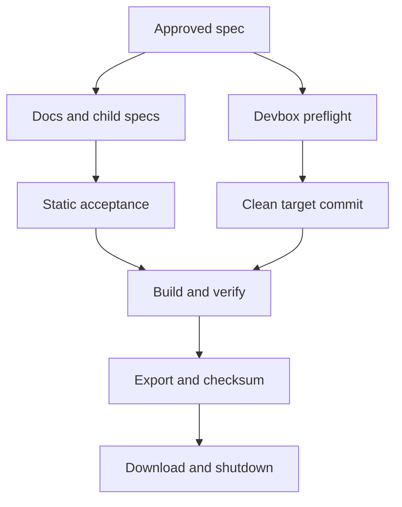

# Design Document

## Overview

This design implements a deliberately small, non-publishing readiness pass for the Rust
SDK merged at `0513782e713257a9285b101f45230af00e3558d8`. It updates nine maintained Rust
documentation surfaces and seven accepted child specifications, then exports exact
merged-main artifacts through the existing `rust-client-dev` `Build` and `Verify` entry
points.

The work changes no SDK capability and creates no release service. It removes obsolete
delivery history while retaining real generated ownership, atomic publication,
immutable dependency, runtime safety, and completeness contracts.

Three identities remain distinct:

- **working source:** `0513782e713257a9285b101f45230af00e3558d8`;
- **engine core:** beta.11 target `501b57e0476dee5881b99a064c3c04173134ecc7`
  with engine version `v1.0.0-beta.11.rust.1`; and
- **Rust engine content:** the manifest built from the Rust SDK at the working source.

The normal build composes the pinned engine core with the current Rust content. Records
preserve both identities rather than describing the engine core as if it came from the
working-source commit.

The local branch is the reviewable editing surface. The devbox clone remains the clean
artifact authority. A local patch is applied there only when validation requires it,
and exact artifacts are exported only after the clone is restored to a clean detached
working-source commit.

## Behavioral Authorities

The README and maintained guides use the peer-authority model documented in
`sdk/rust/completeness/README.md`:

- the engine schema and protocol define the public wire surface;
- target-compatible `sdk-sdk` checks define lifecycle behavior only within each check's
  target, platform, and declared scope;
- the pinned definitive Go SDK and tests inform behavior outside the harness scope and
  where peer scopes overlap; and
- Rust policy defines ownership, lifetimes, naming, errors, safety, async behavior, and
  ergonomics.

No authority has blanket precedence. Documentation describes compatible overlap,
records genuine incompatibility or beta limitations, and never suggests that Go syntax,
package layout, ownership, or public API shape was copied into Rust.

## Dependencies and Non-Goals

### Owning relationships

- The accepted Features 1–7 own implemented Rust SDK behavior. Their child specs are
  edited only to remove obsolete release/signoff ownership and delivery labels.
- `.dagger/modules/rust-client-dev/main.go` owns package construction,
  RustEngineContent, complete-engine composition, and isolated external-consumer
  verification.
- `.dagger/modules/engine-dev` owns standard engine assembly.
- `dagger-rust-sdk-check` and `ordinary_build.rs` remain the package and selected-Rust-
  manifest authorities.
- `dagger-sdk-engine` owns immutable generated-project dependency validation.

### Non-goals

- Recreating F8/F10 signoff, provenance, conformance, security, or platform machinery.
- Adding TUF, signing, publication credentials, or GitHub Actions.
- Adding a committed readiness policy, acceptance runner, evidence registry, verdict
  schema, readiness database, or combined readiness record.
- Changing Rust SDK source, tests, generated files, Cargo manifests/lockfiles, Go
  integration code, Dagger modules, or CLI code.
- Publishing to crates.io, creating a hosted release, or creating or pushing a Git tag.
- Changing Dagger CLI behavior or source.
- Revalidating or taking ownership of an already-addressed upstream Dagger regression.
- Changing accepted behavior, generated output, package APIs, or compatibility.
- Removing runtime, dependency, generated-file, cache, or Result_Sink safety semantics.
- Claiming source, package-layout, ownership, or API-shape compatibility with Go.
- Naming downstream consumer products or platforms.

## Architecture

A blocker terminates readiness before later outputs can be accepted.



### Control plane

1. Keep reviewable specification and documentation edits on the local branch.
2. Classify every sensitive publication, provenance, workflow, Feature, and signoff
   occurrence before editing it.
3. Validate hard-zero patterns, semantic preservation, and positive boundary assertions
   over the closed maintained scope.
4. Before every remote build session, record the `dagger` binary and version, Docker
   availability, runner host, Git revision, status, and AppleDouble scan.
5. Reverse any temporary remote patch and recheck the clean detached revision before
   exact artifact export.
6. Finalize and download artifacts without publication.

### Data plane

`RustClientDev.Build` reads the workspace version, validates exactly
`dagger-sdk-macros` and `dagger-sdk`, builds RustEngineContent, composes a complete
beta.11 engine, and validates the selected Rust manifest. `RustSdkBuild.Verify` unpacks
only the two package artifacts, starts that complete engine, installs its matching
client, compiles an isolated path-based consumer, queries the engine version, and closes
the Rust client. No parallel build aggregate or publisher is introduced.

## Components and Interfaces

### 1. Local worktree and remote patch protocol

The branch `kiro/rust-sdk-release-readiness` is authoritative for edits. Its base is the
working-source commit. Remote transfer follows this contract:

```text
local base == working-source commit
remote base == working-source commit
patch paths == explicitly approved validation paths
remote post-apply diff == local scoped patch
```

Documentation/spec changes are not required in the devbox to build exact merged-main
artifacts. Any validation patch is reverted before artifact export.

### 2. Sensitive-occurrence classifier

Every match in the maintained documentation and child-spec scopes is assigned one
semantic disposition before editing:

```text
SensitiveOccurrence
  path: repository-relative path
  section: nearest Markdown heading
  token: matched text
  class:
    obsolete-delivery
    external-publication
    internal-publication
    safety-provenance
    package-classification
    accepted-capability
    historical-release
  disposition: remove | rewrite | retain | exclude
  rationale: policy-table reference
```

| Class | Disposition |
|---|---|
| `SDK_Signoff`, F8/F10 process, future Feature 8/9 release owner, verdict, signoff inventory, or admitted release evidence | Remove or rewrite to a durable current boundary |
| Deleted `.github/workflows/rust-sdk-security.yml` | Remove; do not replace with another workflow |
| Present-tense crates.io or hosted-release promise | Remove; use supported artifacts/manual authorization boundary |
| Manifest-last generated-file update | Retain as Internal_Publication |
| Atomic CLI cache update | Retain as Internal_Publication |
| `Result_Sink` terminal election | Retain as Internal_Publication |
| Runtime, dependency, lockfile, binary, CLI artifact, generated header, or operation-manifest identity | Retain as Runtime_Safety_Identity |
| Cargo `publish = false` or public/private package eligibility | Retain as package classification |
| Accepted client, transport, codegen, engine, module, or completeness behavior | Retain |
| Truthful historical changelog/release entry | Exclude from present-tense scans |

The classifier is a review model, not a committed evidence or verdict database.

### 3. Maintained documentation transformations

The documentation edit is one coherent terminology and workflow correction across nine
files.

| Document | Transformation | Preserved contract |
|---|---|---|
| `sdk/rust/README.md` | Remove `cargo add` claim; describe current capabilities; add Development and release builds | Owned client, transport, diagnostics, examples, focused guides |
| `sdk/rust/crates/dagger-sdk/README.md` | Replace unconditional registry installation with final-artifact-supported installation | Client quickstart, close, macros, standalone-client reuse, feature matrix |
| `sdk/rust/ARCHITECTURE.md` | Use “two public package artifacts”; separate local checks and engine assembly | Ownership, acyclic package graph, operation manifests, clean runtime promotion |
| `sdk/rust/CONTRIBUTING.md` | Mark direct Cargo/Go commands engine-free; make complete-engine verification separate | Peer authorities, toolchain, generated ownership, scoped commands |
| `sdk/rust/ENGINE_INTEGRATION.md` | Remove deleted workflow, release matrix/evidence, Feature closure, canonical crates.io path; use Build/Verify | Runtime safety, direct checks, focused regression cases, immutable dependency |
| `sdk/rust/MAINTAINING.md` | Replace release-evidence flow with the six-step non-publishing procedure | Generated checks/update, target refresh, rollback, direct authorization |
| `sdk/rust/MODULE_AUTHORING.md` | Replace Feature/signoff terms with engine-free checkpoint and completed-engine boundary | Macros, dispatch, Result_Sink, cancellation, generated assets |
| `sdk/rust/CLIENT_GENERATION.md` | Replace published SDK and evidence language with immutable dependency and Verify | Initialization, typed API, caller ownership, manifest-last generation |
| `sdk/rust/completeness/README.md` | Replace initial-F1/current-future Feature narrative with current contract-maintenance guide | Peer authorities, deterministic derivation, isolated staging, scope validation |

#### Root README structure

`sdk/rust/README.md` becomes the current user-facing capability overview:

1. beta status and exact compatibility;
2. current capability table;
3. owned-client quickstart;
4. module-authoring quickstart or minimal invocation;
5. Development and release builds; and
6. links to focused architecture, module, client-generation, engine, contribution, and
   maintenance guides.

The capability table covers:

- owned client lifecycle and configuration;
- deterministic session and transport behavior;
- diagnostics, typed errors, redaction, and tracing;
- generated Core API types and query construction;
- built-in engine integration;
- Rust-native module authoring and dispatch;
- standalone Core, local-module, and dependency-bound clients; and
- exactly two public package artifacts, Rust 1.97.1, edition 2024, and private tooling.

Each claim is checked against merged Rust code and the applicable peer authorities.
The definitive Go SDK is described as behavioral reference evidence, not API-shape or
source compatibility.

#### Artifact-supported installation

This forked beta does not promise crates.io availability. The package README documents
only an installation form validated by the final artifacts:

1. obtain both authorized `.crate` artifacts;
2. unpack them into local vendor directories;
3. use a path dependency on `dagger-sdk`; and
4. patch `dagger-sdk-macros` to its sibling vendor directory.

This mirrors the isolated external consumer used by Ordinary_Verification. The engine
integration and client-generation guides may document a generated immutable Git source,
but only as a credential-free canonical HTTPS URL plus a full reachable lowercase
40-character commit. Exact registry descriptors remain an implementation capability,
not the canonical installation path for this release.

#### Development and release builds

The root README and contributor guides distinguish:

- **engine-free local checks:** direct format, check, test, Clippy, rustdoc, deny,
  focused Rust fixtures, and direct Go compile/static tests; and
- **engine-backed assembly:** Ordinary_Build creates the two packages,
  RustEngineContent, and Complete_Engine; Ordinary_Verification runs one isolated
  external consumer against Complete_Engine.

Focused engine cases remain diagnosis/regression tools. They are neither ordinary local
checks nor a release-evidence system.

#### Maintenance sequence

`MAINTAINING.md` presents exactly this release preparation sequence:

1. run canonical direct Cargo and Go Engine_Free_Checks;
2. validate exactly the two public package artifacts;
3. build RustEngineContent and Complete_Engine through Ordinary_Build;
4. run the external consumer through Ordinary_Verification;
5. export both packages, the complete OCI archive, and checksums; and
6. only after direct authorization, invoke a separate manual GitHub Release attachment
   path.

No step publishes a crate, creates a tag, or creates a hosted release automatically.

### 4. Child-spec transformations

The clean umbrella and release-readiness specs are excluded. The other seven child specs
retain implementation content while removing obsolete future release ownership.

| Child spec | Preserve | Remove or rewrite |
|---|---|---|
| Completeness contract | Deterministic inventory/ledger/report, isolated staging, secret-free normalized outcomes | Future Feature 8/9 conformance/publication/release profiles |
| Client lifecycle | Owned client/session, close election, cancellation, typed configuration/errors | Future Feature 8/9 live conformance, migration, publication, final gate |
| Transport/observability | Verified CLI download, redaction, tracing, artifact provenance, atomic cache publication | Feature 8/9 platform/security/release owners and obsolete beta.10 release gate |
| Core codegen | Pure checked generator, schema mapping, generated ownership, atomic publication | Feature 8/9 conformance, migration, assets, stable gate |
| Engine integration | Engine-free checks, focused regressions, immutable dependency, runtime provenance | `SDK_Signoff`, workflow, evidence admission, sole-package/release-owner claims |
| Module authoring | Two packages, compiler/dispatcher, Result_Sink, cancellation, generated assets | `SDK_Signoff`, workflow, signoff manifests, Feature 8/9 self-hosting |
| Client generation | Engine-free project/runtime checks, immutable dependency, authored-byte preservation | `SDK_Signoff`, deferred verdict plane, Feature 8/9 publication ownership |

Technical exact-engine cases remain focused regressions where they still exercise real
behavior. Their signoff inventory, evidence-admission, or release-verdict role is
removed.

### 5. Direct static acceptance

Acceptance uses direct repository searches over the nine docs and seven child-spec
directories, followed by human semantic diff review. The clean umbrella,
release-readiness spec, `CHANGELOG.md`, and `.changes/**` are explicit exclusions where
applicable. No committed runner, policy engine, evidence registry, or verdict schema is
introduced.

#### Hard-zero patterns

```text
F8
F10
SDK_Signoff
rust-sdk-security.yml
cargo add dagger-sdk
canonical crates.io release
```

A second case-insensitive delivery-language search flags future Feature 8/9 release
owners, Feature-end gates, release-evidence flow, release-signed-off state, signoff
gates/matrices/manifests, final SemVer gates, release-asset owners, and public release
automation. Every match must be absent or explicitly historical outside the maintained
scope.

#### Semantic allowlist

A broad `publish|publication|provenance` search is reviewed rather than forced to zero.
Allowed matches are Internal_Publication, existing runtime/dependency/generated-file
identity safeguards, package classification, truthful Historical_Release_Records, and
the directly authorized manual GitHub Release boundary. External crate publication
promises, signoff provenance, admitted release verdicts, TUF/signing metadata, and
automated hosted-release actions fail acceptance.

#### Positive assertions

Direct searches and diff review also prove the maintained docs state:

- canonical direct Rust and Go checks are engine-free;
- focused engine cases are regression tools;
- Ordinary_Build produces exactly two packages, RustEngineContent, and Complete_Engine;
- Ordinary_Verification runs one isolated external consumer;
- no crate publication occurs;
- manual GitHub Release attachment requires a separate path and direct authorization;
  and
- generated Git dependencies require credential-free HTTPS plus a full lowercase
  40-character commit and reject path, branch, tag, default, and credentials.

The checks run interactively from the local worktree. Their output is not admitted to or
persisted in an evidence system.

### 6. Ordinary build and verification

No new build method is introduced:

```text
RustClientDev.Build(platform?) -> RustSdkBuild
RustSdkBuild.Packages           -> Directory
RustSdkBuild.CompleteEngine     -> Container
RustSdkBuild.Version            -> String
RustSdkBuild.Verify()           -> Void
```

Exact command syntax is confirmed from active CLI help before long work. Expected
operations are:

```console
dagger -m .dagger/modules/rust-client-dev call build version
dagger -m .dagger/modules/rust-client-dev call build packages export --path <packages>
dagger -m .dagger/modules/rust-client-dev call build complete-engine as-tarball export --path <oci>
dagger -m .dagger/modules/rust-client-dev call build verify
```

The package directory contains only:

- `dagger-sdk-macros-1.0.0-beta.11.rust.1.crate`; and
- `dagger-sdk-1.0.0-beta.11.rust.1.crate`.

The OCI archive comes from Complete_Engine, never isolated RustEngineContent. Existing
validation proves the standard engine and CLI binaries exist and the selected Rust
manifest equals the workspace-built manifest.

### 7. Checksums and retrieval

The closed artifact set is:

```text
dagger-sdk-macros-1.0.0-beta.11.rust.1.crate
dagger-sdk-1.0.0-beta.11.rust.1.crate
dagger-engine-v1.0.0-beta.11.rust.1-linux-amd64.oci.tar
SHA256SUMS
```

`SHA256SUMS` contains sorted relative paths and lowercase SHA-256 digests for the two
packages and OCI archive. Duplicate, missing, extra, or mismatched paths fail
finalization. Downloaded bytes are independently rehashed before the unique marker is
removed and the devbox is stopped.

## Data Models

No new persistent or in-memory readiness model is introduced. The work reuses existing
package metadata, immutable dependency, Build/Verify, and selected-manifest contracts.
The documentation policy remains the approved tables in `requirements.md` and is applied
through interactive scans and semantic diff review rather than committed code.

## Artifact Integrity Output

### Artifact checksums

`SHA256SUMS` is the only machine-consumed integrity file added by this work. It maps the
three downloadable artifact paths directly to lowercase SHA-256 values and contains no
policy result, source-evidence graph, attestation, signature, or publication metadata.

### Blocker handling

Failures remain ordinary terminal command/check failures with bounded native
diagnostics. No blocker database or custom error-code registry is created. A failure is
reported to the user and stops dependent work.

## Correctness Properties

### Property 1: Cleanup scope is closed

*For any* acceptance run, the maintained documentation set SHALL equal the nine approved
paths and the maintained child-spec set SHALL equal the seven approved directories,
while the umbrella, readiness spec, changelog, historical changes, Rust SDK source,
tests, generated files, manifests, Go integration code, Dagger modules, and CLI code
remain outside the edit set.

**Validates: Requirements 1.3, 1.4, 1.12, 1.14, 4.1, 5.11**

### Property 2: Cleanup preserves accepted semantics

*For any* sensitive occurrence, classification SHALL remove obsolete delivery or
external publication machinery and SHALL retain Internal_Publication,
Runtime_Safety_Identity, package classification, historical truth, and accepted Features 1–7
behavior.

**Validates: Requirements 1.5, 1.6, 1.7, 1.8, 1.9, 1.10, 1.11, 4.21, 4.22, 5.1, 5.2, 5.3, 5.4**

### Property 3: README capability claims are authority-bounded

*For any* capability claimed in the root README, the claim SHALL be supported by merged
Rust implementation and applicable engine-schema, scoped harness, pinned Go, and Rust-
policy authorities, and SHALL NOT imply Go source or API-shape compatibility.

**Validates: Requirements 4.2, 4.3, 4.4, 4.5, 4.6, 4.23**

### Property 4: Every maintained document satisfies its policy

*For any* approved documentation path, acceptance SHALL succeed only when every
required assertion from the per-document table is present, every prohibited
current-state claim is absent, and every preserved concept remains semantically
represented.

**Validates: Requirements 4.7, 4.8, 4.9, 4.10, 4.11, 4.12, 4.14, 4.15, 4.16, 4.17, 4.18, 4.19, 4.20, 4.21, 4.22**

### Property 5: Generated Git dependency coordinates are immutable and safe

*For any* documented generated Git dependency, acceptance SHALL require a credential-
free canonical HTTPS repository plus one reachable lowercase 40-character commit and
SHALL reject paths, credentials, branches, tags, defaults, queries, and fragments.

**Validates: Requirements 4.13, 5.10**

### Property 6: Upstream regressions remain outside Rust SDK readiness

*For any* readiness execution, a dedicated long-query reproducer or result SHALL NOT be
required, recorded, or accepted as Rust SDK evidence, and an ordinary Build/Verify
failure SHALL NOT authorize attribution to that historical issue or an engine change.

**Validates: Requirements 2.1, 2.2, 2.3**

### Property 7: Public package closure is exact

*For any* package metadata and archive set, validation SHALL succeed if and only if the
public set is exactly the two required packages at one version with required roots,
files, features, and exact macro dependency.

**Validates: Requirements 3.4, 3.5, 3.9, 3.13, 5.7, 5.8**

This is already implemented with 256 Proptest cases in `ordinary_build.rs`.

### Property 8: Complete-engine Rust manifest selection is exact

*For any* expected digest, selected digest, and blob set, validation SHALL succeed if
and only if both digests are equal canonical SHA-256 values and the selected blob
exists, regardless of unrelated standard SDK blobs.

**Validates: Requirements 3.6, 3.7, 3.8, 3.13, 5.7**

This is already implemented with 256 Proptest cases in `ordinary_build.rs`.

### Property 9: Positive boundaries cannot be satisfied by deletion

*For any* maintained-document edit, hard-zero scans alone SHALL NOT pass acceptance
unless engine-free checks, focused-regression scope, exact Build outputs, isolated
Verify behavior, non-publication, direct authorization, and immutable Git requirements
are all positively stated.

**Validates: Requirements 5.5, 5.6, 5.7, 5.8, 5.9, 5.10, 5.12**

### Property 10: Artifact checksums form a bijection

*For any* finalized file set and checksum manifest, retrieval SHALL be accepted if and
only if every required relative path occurs exactly once, no extra release artifact is
present, and every downloaded byte stream matches its digest.

**Validates: Requirements 3.10, 3.11, 3.12, 6.1, 6.2, 6.5**

### Property 11: Release identity and authorization are invariant

*For any* changed release-facing document, Release_Identity SHALL map exactly to
Source_Version, compatibility SHALL remain exact, no crates.io/automated release action
SHALL appear, and manual GitHub Release attachment SHALL require a separate path and
direct authorization.

**Validates: Requirements 4.20, 4.23, 4.24, 4.25, 4.26, 4.27, 5.9, 5.12**

### Property 12: Failure cannot be replaced by stale evidence

*For any* readiness execution, the first blocker SHALL prevent later acceptance, and no
artifact or command result from another revision, prior build, or retry SHALL substitute.

**Validates: Requirements 1.1, 1.2, 1.13, 1.14, 3.1, 3.2, 3.3, 3.13, 6.3, 6.4, 6.5**

## Error Handling

| Condition | Blocker | Result |
|---|---|---|
| Scope differs from approved paths | `scope-mismatch` | Stop cleanup acceptance |
| Hard-zero or obsolete delivery term remains | `prohibited-language` | Correct the owning document/spec |
| Internal publication, safety provenance, or accepted capability removed | `preservation-loss` | Restore semantic contract before acceptance |
| Required positive boundary absent | `positive-assertion-missing` | Add grounded current wording |
| Changed Markdown is invalid | `markdown-invalid` | Correct before design/task completion |
| Wrong revision | `source-mismatch` | Stop before Dagger |
| Dirty exact-build source | `worktree-dirty` | Stop before artifact build |
| AppleDouble file | `appledouble-present` | Stop before validation/build |
| Dagger unavailable | `dagger-unavailable` | Stop build session |
| Docker unavailable | `docker-unavailable` | Stop build session |
| Runner host absent | `runner-host-missing` | Stop before Dagger |
| Build failure | `build-failed` | Preserve bounded diagnostic; accept nothing |
| Package closure rejected | `package-set-invalid` | Accept no package |
| Engine validation rejected | `engine-content-invalid` | Accept no OCI |
| Consumer failed | `consumer-failed` | Accept no artifact set |
| Required file absent | `artifact-missing` | Do not finalize checksums |
| Remote checksum mismatch | `checksum-mismatch` | Do not finalize download |
| Local checksum mismatch | `download-mismatch` | Keep marker and task incomplete |

No failure path publishes, creates a release/tag, mutates the archive branch, or removes
another namespace marker.

## Testing Strategy

### Policy and source properties

Apply the approved path and pattern tables through interactive repository scans. Review
hard-zero, publication, provenance, immutable Git, and positive-boundary matches against
the requirements tables and existing production validators. Save no committed runner,
policy result, verdict, or evidence object.

Semantic preservation still receives human diff review because a text classifier cannot
prove that a complex capability contract survived. Review each changed child spec
against its approved preserve/remove row.

### Existing package and engine properties

Reuse the existing 256-case Proptest coverage for package closure and engine-manifest
selection in `sdk/rust/crates/dagger-sdk-completeness/tests/ordinary_build.rs`. Do not
duplicate those reference models.

### Documentation checks

- Run Markdown diagnostics over every changed guide and child spec.
- Trace each README capability row to merged code and its applicable authority.
- Validate code fences, links, command names, package names, version mapping, and
  immutable Git examples.
- Confirm Historical_Release_Records remain unchanged unless a separate historical
  correction is requested.

### Ordinary integration acceptance

1. Check source, cleanliness, AppleDouble files, Dagger, Docker, and runner.
2. Run Ordinary_Build and Ordinary_Verification.
3. Export exact packages and complete OCI.
4. Validate filenames, versions, binaries, selected manifest, and consumer close.
5. Generate and verify sorted checksums.
6. Download and independently verify checksums.
7. Remove only the marker and stop the devbox.

Previously passing broad workspace suites remain context; exact artifact and consumer
paths are re-evaluated from merged main.
