# Design Document: Rust SDK Transport, Observability, and Reliability

## Overview

Feature 3 supplies the concrete connection machinery behind Feature 2's stable,
owned `Client`. It turns an implicit `ConnectionPlan` into exactly one transferred
`SessionResource`: selecting an existing engine session or a CLI source, provisioning
the exact CLI when necessary, starting and supervising the CLI, constructing an
authenticated loopback GraphQL transport, propagating W3C context, and validating the
engine identity before the client becomes observable.

The definitive Go SDK at `1309520660f6a5b35ef97b4fbe151e32a06a8dc5` remains the
behavioural authority. The Rust implementation deliberately does not reproduce Go's
package shape or its incidental weaknesses. Source precedence, fallback conditions,
CLI arguments, authentication, propagation, and engine-domain error meaning match Go;
Rust expresses them through explicit state, owned guards, bounded I/O, typed errors,
cross-process atomic cache publication, and private dependency-injection seams.

The connection pipeline has one commit point. Until the exact-target compatibility
probe succeeds, a `PendingConnection` owns every SDK-created process, transport, and
background task. Any error, timeout, or cancellation before that point invokes the
same cleanup path. On success, those resources move into Feature 2's `SharedSession`.
An explicit caller-supplied connection does not enter this pipeline and therefore
bypasses source selection, provisioning, and the compatibility probe.

Provisioning is a transaction rather than a downloader utility. Bytes are streamed
into a private temporary archive while hashing and enforcing bounds, the one expected
executable is extracted into a second private temporary file, and only a verified,
regular, non-symlink file with executable permissions may be atomically published.
The cross-process cache lock protects revalidation, publication, and retention; it is
not held while the network is read. Concurrent losers revalidate and reuse the
winner's entry instead of replacing it.

Diagnostics are security-sensitive data flow. The first stdout line is bounded
control data and is never sent to a diagnostic sink. Stderr is held behind a gate
until the control token is known and registered with the redactor. Thereafter stdout
and stderr are independently redacted, bounded for retained snapshots, and routed to
the configured sink. Sink failures never break the protocol or process-reaping path,
but every background I/O outcome is recorded for startup and shutdown reporting.

The common `sdk-sdk` harness remains authoritative for the checks it defines, but it
does not exercise this transport boundary. Feature 3 therefore uses deterministic
process, HTTP, archive, cache, clock, and propagation fixtures plus one exact-target
live connection. Completeness status changes are admitted only when those scoped
artifacts satisfy Feature 1's evidence rules.

## Dependencies and Non-Goals

### Owning relationships

- Feature 1 owns ledger schema, status policy, evidence validation, and derived
  completeness artifacts. Feature 3 extends its generic traceability machinery; it
  does not create a separate parity inventory.
- Feature 2 owns `Client`, configuration preflight, `ConnectionPlan`,
  `PendingConnection`, `SessionResource`, `SharedSession`, raw GraphQL values,
  diagnostics contracts, and single-flight close. Feature 3 implements the implicit
  connector and enriches its resource and error payloads without adding a second
  lifecycle model.
- Feature 3 owns source selection after Feature 2 preflight, CLI discovery and
  provisioning, child-session protocol, authenticated HTTP, W3C propagation,
  transport diagnostics, compatibility validation, and engine-domain error mapping.
- Feature 4 owns schema-complete generated operations. Mapping an already-represented
  `EXEC_ERROR` extension is transport error semantics and belongs here.
- Feature 8 owns the closing live platform, conformance, and security matrices.
  Deterministic Linux, macOS, and Windows archive fixtures here do not claim that gate.
- Feature 9 owns migration guidance and publication of the complete SDK.

### Rust construction rules

The Go SDK determines observations, not Rust structure. Implementation follows these
constraints throughout this design:

- production components are concrete and owned by value unless runtime type erasure
  is part of the stable extension boundary;
- private side-effect seams use static dispatch and native `async fn` in traits, with
  recording implementations compiled only into tests;
- source choice, resource state, origin, leases, and failure layers are enums or
  newtypes rather than correlated flags and optional fields;
- subprocesses, cache locks, temporary artifacts, stream tasks, and connections move
  through RAII owners with one transfer point;
- Go package names, function adapters, mutable test globals, goroutine/wait-group
  construction, and error wrapper shapes are not reproduced; and
- abstraction is introduced only where it enforces an ownership invariant or replaces
  a genuinely nondeterministic boundary.

### Dependency changes

- Add `opentelemetry` as the private API-level context and carrier dependency and
  `tracing-opentelemetry` solely to obtain the OpenTelemetry context associated with
  the current `tracing` span.
- Add `opentelemetry_sdk` with default features disabled and only the minimal trace
  feature required by its stateless W3C `TraceContextPropagator` and
  `BaggagePropagator`. The SDK library does not construct an OpenTelemetry provider,
  exporter, runtime, subscriber, or processor and does not mutate the application's
  global propagator.
- Pin `opentelemetry`, `opentelemetry_sdk`, and `tracing-opentelemetry` as one
  compatible workspace family and update them atomically. An integration test using
  that bridge must prove that a current tracing span is visible before any dependency
  update is accepted.
- Add `zip` for bounded Windows release extraction. Existing `tar` and `flate2`
  continue to handle Linux and macOS release archives.
- Add `fs4` for portable advisory cache-file locking. Blocking lock acquisition runs
  on Tokio's blocking pool and remains cancellation-safe through an owned guard.
- Reuse `reqwest`, `sha2`, `semver`, `tempfile`, `tokio`, `serde`, `serde_json`,
  `thiserror`, `url`, `which`, `futures`, and `tracing` already present in the
  workspace.
- Retain `async-trait` only at the existing object-safe `Connector` and
  `EngineConnection` boundaries. New private, statically dispatched traits use native
  `async fn` in traits.
- Extend the existing `proptest`, `trybuild`, and Tokio test setup. A small process
  fixture binary replaces shell scripts so the same protocol tests run on Windows.

All additions remain workspace-pinned and covered by locked builds, `cargo deny
check`, Dependabot, the repository Rust security workflow, and `unsafe_code = "deny"`.
No platform API requires SDK-owned unsafe code.

The propagation behaviour is required by the approved contract; these crate choices
are Rust implementation decisions. They use the official W3C codecs rather than
copying Go's carrier helpers or maintaining a security-sensitive local parser.
`tracing` remains the SDK's instrumentation and diagnostic facade;
`opentelemetry` is confined to vendor-neutral distributed context and propagation,
and no OpenTelemetry type appears in the Dagger public API.

### Non-goals

- Feature 3 does not widen compatibility beyond Dagger `v1.0.0-beta.10` at revision
  `25300124ca110612edc09c43f89cb5fad6028170`.
- It does not retry GraphQL requests, non-ETXTBSY process failures, archive downloads,
  manifest failures, authentication failures, or a selected source.
- It does not expose concrete HTTP clients, cache paths, download URLs, CLI commands,
  credentials, propagators, clocks, or fixture controls in the public API.
- It does not configure application telemetry, install an OpenTelemetry provider or
  exporter, replace the tracing subscriber, or mutate process-global propagation.
- It does not accept non-loopback implicit transports, follow redirects, honor proxy
  environment variables, or place the token in a password field.
- It does not retain the beta downloader or CLI-session implementation as an
  alternate path after the stable connector adopts the new components.
- It does not promise diagnostic delivery after abrupt process termination. It does
  promise bounded retained evidence and deterministic reporting at explicit close.
- It does not make `sdk-sdk` evidence for behaviours that its checks do not observe.
- It does not add source comments that cite specification feature or task numbers.
  Source documentation explains contracts and non-obvious reasons in domain terms.

## Repository Layout

```text
sdk/rust/crates/dagger-sdk/src/
├── connector.rs            # connection orchestration and the single transfer point
├── preflight.rs            # one environment snapshot and pure source plan
├── target.rs               # generated exact CLI/engine/revision constants
├── discovery.rs            # explicit-local and compatibility-PATH resolution
├── provision.rs            # release descriptor, manifest, download and cache transaction
├── archive.rs              # bounded tar.gz and ZIP extraction
├── session.rs              # process launch, control protocol and resource assembly
├── transport.rs            # private authenticated loopback Reqwest connection
├── telemetry.rs            # W3C environment/header propagation
├── diagnostic.rs           # sink contract plus private redaction gate and tail
├── connection.rs           # EngineConnection contract and transport failures
├── graphql.rs              # lossless raw response and extension helpers
├── query.rs                # generated/composed decoding and domain-error mapping
├── errors.rs               # stable public error taxonomy
├── lifecycle.rs            # existing Feature 2 single-owner state machine
├── lib.rs                  # intentional stable re-exports
└── core/                   # removed once replacement adapters are connected

sdk/rust/crates/dagger-sdk/tests/
├── source_selection.rs     # reference-model precedence and no-fallback tests
├── provisioning.rs         # bounded archives, integrity, cache and cancellation
├── session_protocol.rs     # portable child-process fixture integration tests
├── transport.rs            # loopback HTTP, auth, redirects and at-most-once requests
├── observability.rs        # W3C precedence and diagnostic redaction
├── compatibility.rs        # exact-target handshake model and cleanup
├── shutdown.rs             # graceful/forced close and failure aggregation
├── error_api.rs            # taxonomy, redaction and lossless EXEC_ERROR mapping
└── support/session_fixture.rs

sdk/rust/completeness/src/
├── contract.rs             # generic feature-scope policy extraction
└── traceability.rs         # reusable declarations and evidence-closed status changes

sdk/rust/completeness/
├── authorities.json        # includes this approved requirements source
├── classifications.json    # 26 new policies plus routed status changes
├── evidence.json           # deterministic and exact-target evidence records
├── compatibility.json      # exact target descriptor
└── target.json             # pinned source revisions and generated constants authority
```

`core/downloader.rs` and `core/cli_session.rs` are removed when the new pipeline is
connected. Keeping either reachable would create a second source order and cleanup
model, so migration is completed atomically at the connector boundary.

## Architecture

```mermaid
flowchart LR
    App["connect_with(ClientConfig)"] --> Preflight["Feature 2 preflight"]
    Preflight --> Plan{"ConnectionPlan"}
    Plan -->|"Explicit"| Shared["SharedSession"]
    Plan -->|"Existing session"| Existing["Validate env session"]
    Plan -->|"New CLI"| Source{"CLI source plan"}
    Source -->|"configured local"| Resolve["Resolve regular executable"]
    Source -->|"compiled target"| Provision["Provisioning transaction"]
    Provision --> Manifest["Bounded manifest"]
    Manifest --> Download["Stream + hash archive"]
    Download --> Extract["Bounded expected-member extraction"]
    Extract --> Lock["Lock, revalidate, publish, retain"]
    Manifest -->|"403 or 404 only"| Path["PATH compatibility fallback"]
    Resolve --> Launch["CLI session launcher"]
    Lock --> Launch
    Path --> Launch
    Existing --> Transport["Loopback HTTP transport"]
    Launch --> Control["Bounded control line"]
    Control --> Gate["Token-aware diagnostic gate"]
    Gate --> Transport
    Transport --> Probe["Exact-target version probe"]
    Probe --> Pending["PendingConnection commit"]
    Pending --> Shared
```



### Connection and source pipeline

Feature 2 preflight snapshots the relevant process environment once. It continues to
choose `ExplicitConnection` before consulting process inputs. For an implicit plan it
captures `DAGGER_SESSION_PORT`, `DAGGER_SESSION_TOKEN`,
`_EXPERIMENTAL_DAGGER_CLI_BIN`, runner variables, and propagation variables as raw
`OsString` values. No later component re-reads these variables, so concurrent process
environment mutation cannot produce a hybrid decision.

The source decision is pure and presence-based:

1. A present session port selects `ExistingSession`; validation failures terminate
   that path and never consult the local CLI or downloader.
2. Otherwise, a present explicit CLI variable selects `ExplicitLocalCli`; an empty,
   unresolved, non-regular, or non-executable target is a discovery error. Native
   executable resolution may follow a symlink to that target.
3. Otherwise, the compiled exact target selects `VerifiedDownload`.
4. Only a typed `ReleaseUnavailable` from a checksum-manifest HTTP 403 or 404 may
   replace the final source with `CompatibilityPathFallback`.

Every decision records a credential-free source kind for diagnostics and errors. Raw
environment values and resolved tokens never implement revealing `Debug` or `Display`.

### Provisioning transaction

Provisioning advances through an explicit internal state machine:

```text
Targeted -> CacheChecked -> ExistingEntryReused
                       \-> ManifestAccepted -> ArchiveVerified -> ExecutableExtracted
                          -> CacheRechecked -> ExistingEntryReused | EntryPublished
                          -> RetentionComplete
```

The archive request is not made until a bounded manifest has produced exactly one
digest for the expected archive. The archive body is streamed to a private temporary
file while counting compressed bytes and updating SHA-256. A digest mismatch deletes
the temporary state before any extraction begins. Extraction accepts only the one
platform descriptor member, rejects links and special files, normalizes no attacker
controlled path, and stops before output would exceed one GiB.

Before any network request, the provisioner acquires the cache-wide lock and validates
the expected final entry without following links. A valid hit is returned with the
lock converted into its execution lease; an unsafe entry fails; absence releases the
lock before download. After download and extraction, the publisher reacquires the lock
and revalidates. A valid winner entry is reused; otherwise the verified temporary
executable is permissioned, durably flushed, and atomically renamed within the cache
filesystem. Retention then removes only parseable SDK-managed regular files while the
same lock is held. The active target and lock file are never candidates.

The resulting `LaunchExecutable` retains an execution lease on that lock until
`Command::spawn` has either opened the executable successfully or definitively failed.
This closes the validation-to-execution window in which another conforming
provisioner could otherwise retain a different target and delete this path. Network
I/O and control-line waiting never occur while the lock is held.

An owned `ProvisioningAttempt` tracks every temporary path, blocking worker, and lock
guard. Cancellation signals extraction workers to stop between bounded reads, awaits
their outcome through a cleanup task, releases the lock, and removes incomplete files.
The guard's destructor is a backstop; successful publication is the only operation
that disarms removal of an artifact.

A blocking lock-acquisition task owns its file handle and sends the acquired guard
through a one-shot channel. If the async receiver has been cancelled by the time the
lock becomes available, the task drops the guard immediately. The task itself is part
of `ProvisioningAttempt`, so cancellation cannot detach a future lock owner.

### Session startup and diagnostic flow

The launcher builds one canonical argument and environment projection, then starts the
selected executable. It retries only the platform-equivalent text-file-busy error and
only within the fixed ten-attempt schedule. Each failed attempt owns no surviving
child. All other errors return immediately.

`PendingResources` owns the child, its stdin, and typed stdout/stderr task handles
before any asynchronous reader begins. Stdout reads one newline-terminated record
through a 64-KiB limiting reader. The record must decode into a port in `1..=65535`
and a non-empty token; unknown JSON fields are ignored. No byte from this record is
diagnostic output.

Before the token is known, stderr enters a bounded sealed buffer rather than the sink.
Once control validation succeeds, the token is installed in `SecretRedactor`, the
buffer is redacted and flushed, and both stream tasks enter normal diagnostic mode.
If startup fails before a trustworthy token exists, buffered raw bytes are discarded;
the safe retained snapshot may therefore be empty. This is preferable to exposing an
unknown credential. Sink panic or error is isolated, recorded once, and disables only
that sink, never the stream drain.

The connector constructs the transport and runs the compatibility probe while the
pending guard remains armed. Only after both succeed does `PendingResources` become a
`CliSessionResource` and move into the `SharedSession`.

### HTTP request and compatibility pipeline

The implicit Reqwest client is constructed with proxy use disabled and redirect
policy set to none. Its base URL is produced internally as
`http://127.0.0.1:<port>/query`; no user-controlled authority is accepted. Every
request receives Basic authentication whose username is the session token and whose
password is empty, plus W3C `traceparent`, `tracestate`, and `baggage` generated from
the request's active context. Request bodies are transmitted once and never replayed.

After an implicit transport is usable, the connector sends the constant raw query
`query RustSdkCompatibility { version }`. The response must contain one semantically
valid version matching `v1.0.0-beta.10` after SemVer normalization. Its build metadata
must be the clean Dagger form `+25300124`, whose eight lowercase hexadecimal
characters equal the Target Revision prefix. Absent, malformed, or dirty provenance
is unverified rather than assumed compatible; a different well-formed revision is a
known mismatch. Known mismatch and unprovable identity are separate public error
kinds.

This handshake is inside the session-startup timeout. Failure leaves the pending guard
armed: SDK-created CLI sessions are gracefully closed or killed and reaped, whereas an
existing external session has no child to terminate. Explicit connections bypass the
probe because the caller has explicitly supplied transport and compatibility policy.

### Shutdown convergence

Feature 2 remains the sole close election. Feature 3's CLI resource implementation
performs these bounded operations when elected:

1. close child stdin to request graceful engine shutdown;
2. wait up to 300 seconds for process exit while continuing to drain both streams;
3. kill and reap a child that exceeds the bound;
4. await all registered background outcomes;
5. return one deterministically ordered aggregate containing process, stream,
   diagnostic, and forced-termination failures plus a redacted bounded tail.

Drop never performs a blocking wait. Its kill-on-drop child backstop prevents an
orphan, while Feature 2's runtime-aware cleanup task performs the complete sequence
whenever possible.

## Components and Interfaces

The signatures below are representative. Public names, ownership, error layers, and
security boundaries are normative; private helper shapes may be refined without
weakening the properties.

### Exact target and process snapshot

```rust
pub(crate) const TARGET_ENGINE_VERSION: &str = "v1.0.0-beta.10";
pub(crate) const TARGET_CLI_VERSION: &str = "1.0.0-beta.10";
pub(crate) const TARGET_REVISION: &str =
    "25300124ca110612edc09c43f89cb5fad6028170";

pub(crate) struct ProcessInputs {
    pub session_port: Option<OsString>,
    pub session_token: Option<OsString>,
    pub explicit_cli: Option<OsString>,
    pub runner_host: Option<OsString>,
    pub runner_token: Option<OsString>,
    pub discovery: NativeDiscoveryInputs,
    pub propagation: PropagationEnvironment,
}

pub(crate) struct NativeDiscoveryInputs {
    pub path: Option<OsString>,
    pub path_ext: Option<OsString>,
    pub home_dir: Option<PathBuf>,
    pub current_dir: Result<PathBuf, NativeContextError>,
}

pub(crate) enum CliSourcePlan {
    ExplicitLocal { configured: OsString },
    CompiledRelease { target: CliTarget },
}
```

The three constants are generated from the repository target transition and checked
against `completeness/target.json`; hand editing either side fails verification.
`ProcessInputs` has a redacted custom `Debug` and is constructed once per connect.

### Native CLI discovery

```rust
fn resolve_explicit_cli(
    configured: OsString,
    inputs: &NativeDiscoveryInputs,
) -> Result<LaunchExecutable, CliDiscoveryError>;

fn resolve_compatibility_path_cli(
    inputs: &NativeDiscoveryInputs,
) -> Result<LaunchExecutable, CliDiscoveryError>;
```

Discovery is a pair of pure functions over one native snapshot, not a service. A
leading home marker is expanded from the captured home directory. A bare executable
name is resolved against captured `PATH`, current directory, and Windows `PATHEXT`
semantics; a path-shaped value is validated directly. The compatibility function
resolves only the platform's canonical Dagger executable name. Both return
`ExecutableLease::Unmanaged`, and neither can access provisioning.

Snapshotting records a safe current-directory error as data rather than returning it.
That error is consulted only if the selected discovery form needs a current directory,
so Existing Session and absolute explicit-local paths cannot fail because of an
irrelevant host observation.

### Connector orchestration

```rust
#[async_trait]
pub(crate) trait Connector: Send + Sync {
    async fn connect(
        &self,
        plan: ImplicitConnectionPlan,
    ) -> Result<PendingConnection, ConnectError>;
}

pub(crate) struct DefaultConnector {
    core: ConnectorCore<
        DefaultCliProvisioner<ReqwestProvisioningHttp>,
        TokioSessionLauncher,
        ReqwestLoopbackFactory,
    >,
}

struct ConnectorCore<P, L, T> {
    provisioner: P,
    launcher: L,
    transport: T,
    propagation: W3cPropagation,
    compatibility: CompatibilityValidator,
}
```

`DefaultConnector` owns concrete production components by value. `ConnectorCore`
implements `Connector` for the small private trait bounds actually needed by its
algorithm; tests instantiate that generic core with recording components. The one
object-safe `Connector` trait remains because Feature 2 deliberately accepts a
type-erased connector at its test boundary, just as public explicit connection
injection requires a type-erased `EngineConnection`. Internal production composition
does not use an `Arc<dyn Trait>` service graph.

`W3cPropagation` and `CompatibilityValidator` are concrete stateless/value components,
not replaceable services. There is no mutable global URL, environment, clock,
filesystem, command, or telemetry hook. `PendingConnection` remains Feature 2's
cleanup guard and is disarmed only by `SharedSession` construction.

### Platform and release descriptor

```rust
#[derive(Clone, Copy, Debug, Eq, PartialEq)]
pub(crate) enum OperatingSystem { Linux, Darwin, Windows }

#[derive(Clone, Copy, Debug, Eq, PartialEq)]
pub(crate) enum Architecture { Amd64, Arm64 }

#[derive(Clone, Copy, Debug, Eq, PartialEq)]
pub(crate) enum ArchiveFormat { TarGz, Zip }

pub(crate) struct CliTarget {
    version: Version,
    os: OperatingSystem,
    arch: Architecture,
}

pub(crate) struct ArchiveDescriptor {
    archive_name: String,
    member_name: &'static str,
    format: ArchiveFormat,
    manifest_url: Url,
    archive_url: Url,
}
```

`ArchiveDescriptor::for_target` is a total mapping only for the six supported target
pairs. Linux and Darwin select `.tar.gz`; Windows selects `.zip` and member
`dagger.exe`. Unsupported values fail before filesystem or network side effects.

### Provisioning adapters and transaction

```rust
type DownloadChunks =
    Pin<Box<dyn Stream<Item = Result<Vec<u8>, DownloadReadError>> + Send>>;

pub(crate) struct DownloadResponse {
    status: u16,
    content_length: Option<u64>,
    body: DownloadChunks,
}

pub(crate) trait ProvisioningHttp: Send + Sync {
    async fn get(&self, url: Url) -> Result<DownloadResponse, ProvisioningHttpError>;
}

pub(crate) trait CliProvisioner: Send + Sync {
    async fn acquire(&self, target: CliTarget) -> Result<LaunchExecutable, ProvisionError>;
}

pub(crate) struct DefaultCliProvisioner<H> {
    http: H,
    cache: CliCache,
}

pub(crate) struct LaunchExecutable {
    path: PathBuf,
    origin: CliOrigin,
    lease: ExecutableLease,
}

enum ExecutableLease {
    Unmanaged,
    Cache(CacheExecutionLease),
}
```

The private async traits above are generic compile-time boundaries, not trait objects;
native `async fn` in traits is used for them. `DefaultCliProvisioner<H>` is
monomorphized with `ReqwestProvisioningHttp` in production and with a deterministic
stream source in tests.

`DownloadChunks` is boxed only to erase the concrete streaming-body type returned by
the HTTP library. It has one owner and one consumer; it is not a shared service or a
dependency-injection mechanism.

`LaunchExecutable` is the owned capability to start one selected CLI. Explicit-local
and PATH sources use `ExecutableLease::Unmanaged`; a cache source carries its
`CacheExecutionLease`. The launcher consumes the whole value and releases the lease
only after the spawn result is known, so no path and optional coordination flag can be
separated accidentally.

The production HTTP adapter accepts only fixed HTTPS `dl.dagger.io` URLs. A limiting
reader enforces eight MiB for the manifest and one GiB each for compressed input and
extracted executable, regardless of absent or dishonest `Content-Length` headers.
Manifest parsing is line-oriented and accepts exactly one well-formed SHA-256 entry
for the descriptor's basename.

The cache implementation uses real private filesystem operations even in most tests,
rooted in `TempDir`; only platform, HTTP, clock, and deliberate filesystem-failure
points need adapters. This keeps atomic rename and cross-process lock evidence close
to production semantics.

### Session process and streams

```rust
pub(crate) struct CliSessionStart {
    executable: LaunchExecutable,
    options: CliLaunchRequest,
    labels: SessionLabels,
    propagation_environment: Vec<(OsString, OsString)>,
}

pub(crate) struct SessionLabels {
    sdk_name: &'static str,
    sdk_version: &'static str,
}

pub(crate) trait SessionLauncher: Send + Sync {
    async fn launch(
        &self,
        request: CliSessionStart,
    ) -> Result<PendingResources, SessionStartError>;
}

pub(crate) struct SessionParameters {
    port: NonZeroU16,
    token: SecretString,
}

pub(crate) enum StreamKind { Stdout, Stderr }

pub(crate) struct StreamOutcome {
    kind: StreamKind,
    bytes_seen: u64,
    failure: Option<BackgroundFailure>,
}

pub(crate) struct PendingResources {
    child: Child,
    stdin: Option<ChildStdin>,
    stdout: JoinHandle<StreamOutcome>,
    stderr: JoinHandle<StreamOutcome>,
    diagnostics: DiagnosticRouter,
}
```

`CliLaunchRequest` remains Feature 2's validated native argument, environment,
diagnostic, and timeout projection. Feature 3 wraps it rather than replacing it with a
second options model. `SessionLabels` is a fixed two-field value, so duplicate or
caller-overridden SDK labels are unrepresentable. The diagnostic router derives its
initial redaction values from the validated environment before the child starts and
adds the control token after parsing; there is no separately maintained redaction
copy on the launch request.

`PendingResources` is constructed with all ownership fields before tasks can yield.
Ordinary failure paths consume it through async cleanup and join both tasks. If the
owning future is cancelled, drop transfers the intact bundle to the connection cleanup
supervisor; abort-on-drop task wrappers and the child's kill-on-drop setting are the
no-runtime backstop. No path merely drops a Tokio `JoinHandle` and detaches its task.
The production launcher is tested with a Rust fixture binary that can emit split
control lines, oversized input, invalid UTF-8, token-bearing diagnostics, early exit,
long-running output, and delayed termination without relying on shell behaviour.

### Redaction and diagnostics

```rust
pub(crate) struct SecretRedactor { /* escaped byte patterns, longest first */ }

pub(crate) enum DiagnosticGate {
    Sealed { stderr: BoundedTail },
    Active { redactor: SecretRedactor, tail: BoundedTail },
    Disabled { tail: BoundedTail, failure: BackgroundFailure },
}

impl DiagnosticGate {
    fn activate(&mut self, secrets: impl IntoIterator<Item = SecretString>);
    fn route(&mut self, kind: StreamKind, chunk: &[u8]);
    fn snapshot(&self) -> DiagnosticSnapshot;
}
```

Redaction works on bytes with carry-over sufficient for a secret spanning adjacent
chunks. It knows the session token, runner token, authorization encodings, and other
SDK-owned secret forms. It bounds both pre-token stderr and the retained redacted tail
to one MiB. `DiagnosticSnapshot`, `Debug`, `Display`, and error sources contain only
already-redacted material.

### Propagation and HTTP transport

```rust
pub(crate) struct W3cPropagation {
    propagator: TextMapCompositePropagator,
}

impl W3cPropagation {
    fn child_environment(
        &self,
        inherited: &PropagationEnvironment,
    ) -> Vec<(OsString, OsString)>;

    fn inject_request_headers(&self, headers: &mut HeaderMap);
}

pub(crate) trait LoopbackTransportFactory: Send + Sync {
    type Connection: EngineConnection;

    fn loopback(
        &self,
        params: SessionParameters,
        connect_timeout: Option<Duration>,
    ) -> Result<Self::Connection, EngineConnectionError>;
}
```

`W3cPropagation` owns a local composite of the official W3C Trace Context and Baggage
propagators. It first asks the current `tracing` span for its OpenTelemetry context,
then checks an explicitly attached OpenTelemetry `Context`; a valid active span wins
over inherited process values as one coherent source. When no valid active span
exists, it extracts valid inherited values and re-emits canonical fields. Invalid
inherited values are omitted rather than forwarded. Request injection consults the
active context for every execution, so concurrent requests do not share mutable
carriers. It never reads or changes OpenTelemetry's global text-map propagator.

`ReqwestLoopbackFactory` implements the private `LoopbackTransportFactory` compile-time
boundary. It accepts already-validated parameters and creates a Reqwest client with
`no_proxy`, no redirect following, and a connection-only timeout. Its connection
implementation owns the base URL and secret; neither is publicly accessible.

### Compatibility validation

```rust
pub(crate) struct CompatibilityValidator {
    expected_version: Version,
    expected_revision: Revision,
}

pub(crate) enum CompatibilityOutcome {
    Exact,
    VersionMismatch { actual: Version },
    RevisionMismatch { actual: Revision },
    Unverified { reason: CompatibilityEvidenceGap },
}

impl CompatibilityValidator {
    async fn validate<C: EngineConnection + ?Sized>(
        &self,
        connection: &C,
    ) -> Result<(), CompatibilityError>;
}
```

The validator executes a constant raw request rather than depending on generated
schema coverage. It treats response errors, missing or non-string data, invalid
SemVer, absent revision evidence, dirty builds, and unknown build formats as typed
failures. It never logs the full response body.

### Public error and engine-domain API

```rust
#[non_exhaustive]
#[derive(Clone, Debug, Error)]
pub enum ConnectError {
    ExistingSession(ExistingSessionError),
    Discovery(CliDiscoveryError),
    Provisioning(ProvisionError),
    Process(SessionStartError),
    Protocol(SessionProtocolError),
    Transport(EngineConnectionError),
    Compatibility(CompatibilityError),
    StartupTimeout(StartupTimeoutError),
}

#[non_exhaustive]
#[derive(Clone, Debug, Error)]
pub enum QueryError {
    Request(RequestError),
    GraphQl { response: RawResponse },
    Exec { error: ExecError, response: RawResponse },
    Decode { path: Vec<PathSegment>, message: String, response: RawResponse },
}

#[derive(Clone)]
pub struct ExecError { /* private parsed extension fields */ }

impl ExecError {
    pub fn message(&self) -> &str;
    pub fn exit_code(&self) -> Option<i32>;
    pub fn command(&self) -> Option<&[String]>;
    pub fn stdout(&self) -> Option<&str>;
    pub fn stderr(&self) -> Option<&str>;
    pub fn extensions(&self) -> &Map<String, Value>;
}
```

Leaf errors expose a non-exhaustive `kind()` enum and safe contextual accessors while
holding implementation sources in `Arc` where cloneability is required by Feature 2's
terminal close result. Custom `Debug` and `Display` implementations omit secret,
authorization, raw environment, command output, and unredacted response content.

`EXEC_ERROR` detection is conservative: it requires the definitive extension type
marker and parses known fields without rejecting unknown fields. A successful mapping
returns `QueryError::Exec` with both the typed view and the original `RawResponse`.
Malformed known fields leave the response as `QueryError::GraphQl`; they never panic
or discard data.

### Completeness traceability

```rust
pub(crate) struct FeatureScopePolicy {
    feature: FeatureId,
    heading: &'static str,
    expected_scope_digest: &'static str,
    expected_status_ids: &'static [CapabilityId],
    expected_policy_ids: &'static [PolicyId],
    allowed_blocking_owners: &'static BTreeMap<CapabilityId, FeatureId>,
}

pub(crate) fn validate_feature_scope(
    repository: &RepositoryModel,
    policy: &FeatureScopePolicy,
) -> Result<FeatureScopeDeclaration, ContractError>;
```

The Feature 2 special case becomes a descriptor passed to this generic validator.
Feature 3 supplies its own descriptor for the approved 32 status-change IDs and 26
new policies. Eleven declared status rows may retain Feature 2 as their blocking owner
until Feature 3 supplies the missing transport evidence; the validator therefore
checks the exact approved owner map rather than assuming that every scoped row is
owned by the current feature. Feature 8 rows remain untouched.

The requirements source is added to `authorities.json`. Policy extraction validates
exact identifiers and normalized text, not merely a count. Status changes require
routed implementation, test, and target evidence whose observed target matches
`target.json`; unrelated harness success cannot satisfy the route.

## Data Models and Invariants

### Source decision

```rust
enum ImplicitConnectionPlan {
    ExistingSession(ExistingSessionInput),
    NewCli { source: CliSourcePlan, launch: CliLaunchRequest },
}

enum ConnectionSourceKind {
    ExistingSession,
    NewCli(CliOrigin),
}

enum CliOrigin {
    ExplicitLocal,
    VerifiedDownload,
    CompatibilityPathFallback,
}
```

The selected enum variant is the source decision; there is no loop over candidates.
Consequently a failure has no representation from which it could advance to a lower
priority. The provisioner may return `ReleaseUnavailable`, but only the compiled
release arm can translate that one value into a PATH lookup.

### Secret-bearing values

```rust
struct SecretString(Arc<str>);

struct ExistingSessionInput {
    port: OsString,
    token: Option<OsString>,
}

struct PropagationEnvironment {
    traceparent: Option<OsString>,
    tracestate: Option<OsString>,
    baggage: Option<OsString>,
}
```

`SecretString` intentionally implements neither `AsRef<str>` nor derived `Debug`;
private methods expose its bytes only at authentication and redaction boundaries.
Conversions validate native text before constructing it. Secret-bearing values do not
appear in error sources because safe rendering cannot be recovered after an arbitrary
source has captured them.

### Manifest and archive values

```rust
struct ExpectedArchive {
    descriptor: ArchiveDescriptor,
    sha256: [u8; 32],
}

enum ArchiveMemberDecision {
    Ignore,
    ExtractExpected,
    RejectSpecial,
    RejectDuplicate,
}

struct BoundedCounter {
    observed: u64,
    limit: u64,
    phase: ProvisionPhase,
}
```

The manifest parser returns either one `ExpectedArchive` or one typed error. It never
returns an unvalidated digest string. Archive member selection compares normalized
basenames without joining member paths to any destination. `BoundedCounter` checks
before each write, so the visible output cannot exceed its limit even by one chunk.

### Cache transaction

```rust
enum CacheEntryState {
    Absent,
    Accepted { path: PathBuf },
    Unsafe { kind: UnsafeEntryKind },
}

struct PublicationGuard {
    target: PathBuf,
    temporary: Option<NamedTempFile>,
    lock: Option<CacheLockGuard>,
    committed: bool,
}
```

Cache validation uses no-follow metadata at every decision point. Publication and
retention operate only while `lock` is present. The temporary file and final target
share a filesystem. `committed` becomes true only after successful atomic rename and
post-publication validation; all earlier drops remove the private temporary file.

### Control and diagnostic state

```rust
#[derive(Deserialize)]
struct ControlLineWire {
    port: u64,
    session_token: String,
}

enum StartupState {
    Spawned(PendingResources),
    ParametersReady(PendingResources, SessionParameters),
    TransportReady(PendingConnection),
    Compatible(PendingConnection),
    Transferred,
}
```

Unknown control fields are accepted by Serde's default behaviour. Validation narrows
`u64` to `NonZeroU16` and converts the token immediately to `SecretString`; the wire
value is then dropped. Every pre-transfer state owns the complete resource bundle, so
there is no state in which a child or task exists without a cleanup owner.

### GraphQL and engine-domain mapping

```rust
struct ExecExtensionView {
    message: String,
    command: Option<Vec<String>>,
    exit_code: Option<i32>,
    stdout: Option<String>,
    stderr: Option<String>,
}

enum DomainMapping {
    Exec(ExecError),
    Generic,
}
```

The view is derived from, never substituted for, the corresponding `RawGraphQlError`.
The complete `RawResponse` remains the owning value in `QueryError`. Mapping is all or
generic for known fields: a wrongly typed known member cannot create a misleading
partial `ExecError`, while unknown members remain untouched in the raw extension map.

### Shutdown result

```rust
#[non_exhaustive]
#[derive(Clone, Debug, Eq, PartialEq)]
pub enum ShutdownFailureKind {
    UnexpectedExit,
    GracePeriodExpired,
    Kill,
    Reap,
    Stdout,
    Stderr,
    DiagnosticSink,
    TaskJoin,
}

pub struct SessionCloseError {
    failures: Vec<ShutdownFailure>,
    diagnostics: DiagnosticSnapshot,
}
```

Failures are sorted by a fixed phase order, not completion timing, so Feature 2 can
record and replay one stable terminal result to every caller. A forced termination is
reported even when kill and reap subsequently succeed. The diagnostic snapshot is
already bounded and redacted before it enters the cloneable close result.

## Authority-to-Implementation Tracing

| Definitive authority | Rust owner | Preserved observation |
|---|---|---|
| `sdk/go/engineconn/engineconn.go` `Get` | `preflight.rs`, `connector.rs` | exact source order and terminal selected-source failure |
| `sdk/go/engineconn/env.go` | `preflight.rs`, `transport.rs` | port-presence selection, validated token, external ownership |
| `sdk/go/engineconn/cli.go` | `discovery.rs`, `provision.rs`, `archive.rs` | local authority, compiled version, narrow PATH fallback, verified release |
| `sdk/go/engineconn/session.go` | `session.rs`, `diagnostic.rs` | launch projection, retry bound, control line, child ownership and close |
| `sdk/go/engineconn/otel.go` | `telemetry.rs`, `transport.rs` | active-context precedence, environment fallback, per-request W3C injection |
| `sdk/go/dagger/client.gen.go` error mapping | `query.rs`, `graphql.rs`, `errors.rs` | typed `EXEC_ERROR` without loss of raw GraphQL response |
| `core/schema/query.go` `Query.version` | `target.rs`, `connector.rs` | public constant handshake independent of generated coverage |
| `completeness/target.json` | generated `target.rs` constants | one exact engine version, CLI version, and revision claim |

Rust-strengthened mechanisms are traced to explicit policy capabilities rather than
misrepresented as Go declarations. Those include bounded inputs, cross-process first
publication, private permissions, cancellation cleanup, redaction gating, sink-panic
containment, at-most-once transmission, exact compatibility rejection, and aggregate
shutdown evidence.

## Correctness Properties

Every property below is an executable invariant. Property tests use at least 100
generated cases unless the property describes an exhaustive finite matrix, a modeled
concurrent schedule, or an external live target.

### Property 1: Exact feature-scope extraction

For any mutation of the approved status list, scope digest, policy identifier, or
normalized policy statement, contract validation rejects the declaration; the exact
32 status IDs, digest
`sha256:11568be7e981928bba0883527a4a5dd83401c7a226e341321ab9f94a9becb4c7`, and 26
policies are accepted.

**Validates: Requirements 1.1-1.3**

### Property 2: Evidence-closed and owner-correct status transitions

For any scoped capability, a complete transition is accepted if and only if its
routed implementation, test, and target evidence is valid and its prior blocking
owner matches the approved owner map. The 11 cross-feature rows may transition from
their declared Feature 2 owner; Feature 8-only rows and unverified rows cannot change.

**Validates: Requirements 1.4-1.12**

### Property 3: Source precedence is a pure reference function

For every combination of explicit connection, session-port presence, explicit-local
presence, and post-snapshot environment mutation, production selection equals the
four-level reference function and selects once. Every non-`ReleaseUnavailable`
failure remains on the selected source.

**Validates: Requirements 2.1-2.13**

### Property 4: Existing-session validation is total and secret-safe

For arbitrary native port/token inputs, a missing port ignores the token; a present
port yields either validated loopback parameters or the corresponding typed error.
No formatted value contains the token or raw invalid environment value, and closing a
valid external session sends no engine shutdown signal.

**Validates: Requirements 3.1-3.8**

### Property 5: Explicit-local selection is authoritative

For arbitrary explicit-local native values and filesystem resolutions, presence
selects that source, applies native tilde/PATH/path rules exactly once, and returns its
typed resolution or startup result without manifest access or compatibility PATH
fallback.

**Validates: Requirements 3.9-3.15**

### Property 6: Platform descriptors are exact and side-effect free

For the six supported OS/architecture pairs, descriptor construction produces the
approved version, archive name, format, member, and fixed HTTPS URLs. Every other
pair, or drift between generated target constants and target metadata, fails before
cache, process, or network access. Fixture substitution remains private.

**Validates: Requirements 4.1-4.15**

### Property 7: Manifest parsing is bounded and total

For arbitrary byte streams, chunk boundaries, lengths, Unicode, line forms, archive
names, and digest text, parsing either yields exactly one valid digest for the exact
descriptor or a typed bounded error. It never reads beyond eight MiB and never
panics.

**Validates: Requirements 5.1-5.4, 5.17-5.18**

### Property 8: Archive acceptance is integrity-gated, bounded, and path-confined

For arbitrary tar.gz and ZIP fixtures, chunking, headers, member paths, member types,
duplicates, payload lengths, and expected digests, publication is reachable only when
all compressed bytes hash correctly and exactly one regular expected member produces
at most one GiB. No archive path influences a destination path, no failed input leaves
a final executable, and no rendered error contains body bytes.

**Validates: Requirements 5.5-5.15, 5.17-5.18, 14.4**

### Property 9: Provisioning cancellation removes private state

At every await and blocking-worker checkpoint, cancelling a provisioning attempt
eventually removes its temporary archive and executable, releases any lock, publishes
no partial target, and terminates its cooperative worker.

**Validates: Requirements 5.16, 6.20**

### Property 10: Cache validation is no-follow and network-free on hits

For every final-path state, only a regular non-symlink managed executable with the
required permissions is accepted. An accepted hit returns the exact path without HTTP
access; symlink and non-regular states return the corresponding typed unsafe-entry
error.

**Validates: Requirements 6.1-6.6**

### Property 11: Concurrent publication has one atomic result

For any interleaving of independent provisioners targeting the same empty cache,
observers see either absence or one complete verified executable. After lock
acquisition, losers revalidate and reuse a winner; temporary and final files share a
filesystem, permissions precede atomic rename, the execution lease prevents retention
before spawn has opened the selected path, and every lock is released.

**Validates: Requirements 6.7-6.13, 6.20, 14.5-14.6**

### Property 12: Retention is locked, confined, and non-destructive

For arbitrary cache directory entries and removal failures, retention under the cache
lock preserves the selected target, lock, unrelated files, symlinks, non-regular
files, and unrecognized names. It removes only obsolete managed regular entries; a
failure keeps the selected result successful and emits one safe non-fatal diagnostic.

**Validates: Requirements 6.14-6.19**

### Property 13: Fallback follows the finite policy table

For every provisioning phase, HTTP status, lookup result, and PATH startup result,
PATH is attempted if and only if the checksum manifest returned 403 or 404. The
warning contains the compiled version and safe selected path, and a failed fallback
retains both the release-unavailable and fallback cause without considering another
source.

**Validates: Requirements 7.1-7.13**

### Property 14: Spawn retry is narrow, bounded, and cancellable

For arbitrary sequences of spawn outcomes, only the recognized executable-busy OS
identity causes another attempt; there are at most ten attempts and each delay is at
most 100 ms. Every failed attempt releases pipes and ownership, while cancellation or
startup timeout interrupts the current backoff without another spawn.

**Validates: Requirements 7.14-7.19**

### Property 15: Request transmission is at most once

For any injected connect, write, response, status, decode, or cancellation failure,
one `execute` invocation causes at most one HTTP request to reach the fixture server.

**Validates: Requirements 7.20, 14.10**

### Property 16: CLI launch projection is complete and collision-free

For arbitrary validated launch options and inherited environments, the child receives
the Feature 2 canonical arguments, pipes, managed values, active-or-inherited W3C
state, and exactly one Rust SDK name and package-version label. Managed labels and
propagation keys cannot be overridden by user additions.

**Validates: Requirements 8.1-8.5, 9.10, 14.9**

### Property 17: Control input is parsed once and never diagnosed

For arbitrary first-stdout byte streams and chunk boundaries, at most 64 KiB including
the delimiter is consumed as one control record. Exactly a valid port and non-empty
token succeeds; encoding, framing, JSON, range, token, EOF, and early-exit defects are
typed. No control byte reaches a sink, trace, retained tail, or rendered error.

**Validates: Requirements 8.8-8.13, 10.1-10.5, 14.7**

### Property 18: Pending resources have one owner and one transfer

For cancellation, timeout, or failure at every startup state after spawn, the pending
guard owns, terminates, reaps, and joins all resources. On complete session parameters,
transport, and compatibility, ownership transfers exactly once and disarms the guard;
the beta process owner is never constructed.

**Validates: Requirements 8.6-8.7, 8.14-8.20**

### Property 19: Implicit HTTP is confined and authenticated

For every valid session port, proxy environment, redirect response, and request body,
the transport targets only `127.0.0.1:<port>/query`, sets JSON content type, uses the
token as Basic username with an empty password, bypasses proxies, and refuses redirect
following. No error or trace renders authentication material.

**Validates: Requirements 9.1-9.6, 9.13-9.17**

### Property 20: W3C propagation has coherent precedence and request isolation

For arbitrary valid or invalid active and inherited trace-context/baggage carriers, a
valid active context is selected coherently; otherwise valid inherited values are
canonicalized and invalid values omitted. Concurrent requests with distinct active
contexts receive distinct correct headers without cross-request leakage.

**Validates: Requirements 9.7-9.12, 14.9**

### Property 21: Diagnostics are isolated, redacted, bounded, and contained

For arbitrary stdout/stderr chunking, high-entropy secrets split across chunks,
configured sensitive values, output volume, and sink error or panic, every delivered,
retained, traced, or formatted payload is secret-free. The retained tail never exceeds
one MiB, live drain continues past that bound, ordering through the dispatcher is
serial, and sink failure cannot fail or unwind transport cleanup.

**Validates: Requirements 10.1-10.13, 10.18-10.20, 14.8**

### Property 22: Background outcomes remain observable

For every stdout read, stderr read, join, unexpected child-exit, and sink failure
combination after transfer, the session retains one typed outcome per component and
explicit close returns all observed failures rather than silently discarding a task.

**Validates: Requirements 10.14-10.17, 14.11**

### Property 23: The failure taxonomy is total, stable, and panic-free

For arbitrary runtime environment, HTTP, JSON, process, protocol, and extension input,
each failure maps to exactly one documented layer and inspectable kind, safe sources
are retained, timeouts remain phase-specific, and ordinary stable-library paths use
neither `eyre::Error`, runtime `unwrap`, nor panic.

**Validates: Requirements 11.1-11.6, 11.21-11.22**

### Property 24: Engine-domain mapping is lossless and conservative

For arbitrary raw GraphQL data, ordered errors, response extensions, error extension
maps, known field types, and unknown members, only a valid `_type = EXEC_ERROR` maps
to `ExecError`. Mapping preserves every required typed field and the structurally
identical complete raw response; invalid known fields remain generic, and ordinary
formatting does not append command output.

**Validates: Requirements 11.7-11.20**

### Property 25: Compatibility accepts exactly the declared target

For arbitrary version response shapes and Dagger version strings, an implicit
connection succeeds only when semantic version and clean VCS provenance prove the
generated exact target. Known mismatch and unprovable identity are distinct, safely
inspectable errors; new-CLI failure cleans its child, existing-session failure leaves
the external engine running, PATH fallback has no exemption, and explicit connections
bypass the probe.

**Validates: Requirements 12.1-12.15**

### Property 26: Shutdown is bounded, exhaustive, and repeatable

For arbitrary child exit timing/status, kill/reap outcomes, stream outcomes, sink
outcomes, caller cancellation, and repeated closes, stdin closes first, graceful wait
is bounded to 300 seconds, forced termination is followed by reaping, and all failures
appear once in deterministic order with a safe bounded snapshot. Every close caller
observes Feature 2's same terminal result and no failure path leaves an owned child.

**Validates: Requirements 13.1-13.17**

### Property 27: Evidence declares what it actually observes

For any evidence record, deterministic fixtures that execute no engine cannot claim a
live target. Exact-target live evidence is accepted only when it establishes a Rust
SDK-started session, executes at least `Query.version`, explicitly closes the client,
and proves the child was reaped on the declared target.

**Validates: Requirements 14.1-14.3, 14.12-14.16**

### Property 28: Stable surface and documentation preserve the contract

For every public transport error item and each concrete connector, provisioning,
session, transport, and error module, source inspection and compile fixtures find the
required contract/invariant documentation, no private seam or mutable test global is
publicly nameable, and implementation comments contain domain WHY reasoning without
specification feature/task references or narrated control flow.

**Validates: Requirements 4.13-4.15, 14.17-14.24**

## Error Handling

The error model follows ownership boundaries, not implementation libraries. Public
enums are `#[non_exhaustive]`; leaf errors are cloneable where a terminal lifecycle
result must be replayed. A concrete `reqwest::Error`, Tokio join error, I/O error, or
archive error may be retained as a safe opaque source, but none appears as a public
field. Sources that could have captured a credential or raw response body are reduced
to a safe typed record at the boundary.

`Display` gives a stable phase summary. `Debug` adds only documented inspectable safe
fields. Access to command stdout/stderr and raw GraphQL response data is explicit
through methods; ordinary formatting never appends them. The table is total for every
specified transport failure:

| Operation | Condition | Public result | Resource and disclosure result |
|---|---|---|---|
| target setup | compiled CLI/version/revision constants disagree | `ConnectError::Provisioning(InternalTargetMismatch)` | no filesystem, process, or network work |
| source snapshot | process input is not native text where text is required | source-specific `ExistingSessionError` or `CliDiscoveryError` | variable name only; raw value omitted |
| source snapshot | native current-directory discovery fails | `CliDiscoveryError::NativeContext` | no source resolution, process, or network work |
| existing session | port missing | source is not selected | token alone is ignored |
| existing session | port non-integer, zero, or above 65535 | `ExistingSessionError::InvalidPort` | no CLI source considered |
| existing session | token missing or empty | `ExistingSessionError::MissingToken` / `EmptyToken` | token never rendered |
| explicit local | configured value is empty | `CliDiscoveryError::EmptyExplicitLocal` | no manifest or PATH fallback |
| explicit local | tilde/native/PATH resolution fails | `CliDiscoveryError::ExplicitLocalLookup` | safe path role; no raw environment |
| explicit local | native resolution yields no executable regular target | `CliDiscoveryError::ExplicitLocalLookup` | native symlinks may resolve normally; no download or fallback |
| platform | unsupported OS or architecture | `CliDiscoveryError::UnsupportedPlatform` | no cache or network work |
| platform | descriptor cannot be constructed | `ProvisionError::ArchiveDescriptor` | no cache or network work |
| cache hit | final path is a symlink | `ProvisionError::UnsafeCacheEntry(Symlink)` | no network and link is not followed |
| cache hit | final path is non-regular or permission-invalid | `ProvisionError::UnsafeCacheEntry(...)` | no network and entry is unchanged |
| cache | native cache directory cannot be resolved/created/private | `ProvisionError::CacheDirectory` | safe directory role only |
| manifest request | transport/connect/TLS/timeout failure | `ProvisionError::ManifestTransport` | no PATH fallback or response body rendering |
| manifest response | status 403 or 404 | internal `ReleaseUnavailable` | only condition eligible for PATH fallback |
| manifest response | any other non-200 status | `ProvisionError::ManifestStatus` | status retained; no fallback |
| manifest read | stream failure or more than eight MiB | `ProvisionError::ManifestRead` / `ManifestTooLarge` | temporary state removed |
| manifest parse | invalid UTF-8, wrong field count, bad digest, duplicate/missing exact name | corresponding `ProvisionError::Manifest...` kind | no archive request |
| PATH fallback | native lookup fails | `CliDiscoveryError::CompatibilityFallback` | preserves `ReleaseUnavailable` and lookup cause |
| PATH fallback | selected CLI startup fails | `SessionStartError::CompatibilityFallback` | preserves `ReleaseUnavailable` and startup cause |
| archive request | any non-200 status, including 403/404 | `ProvisionError::ArchiveStatus` | no PATH fallback |
| archive read | stream failure or compressed input above one GiB | `ProvisionError::ArchiveRead` / `ArchiveTooLarge` | temporary archive removed |
| integrity | computed digest differs | `ProvisionError::ChecksumMismatch` | safe expected/actual digest; no extraction/publication |
| extraction | invalid gzip/tar/ZIP structure | `ProvisionError::ArchiveFormat` | body bytes omitted; temporary output removed |
| extraction | expected member missing or duplicated | `ProvisionError::MissingMember` / `AmbiguousMember` | no final executable |
| extraction | matching member is special or output exceeds one GiB | `ProvisionError::UnsafeMember` / `ExecutableTooLarge` | no final executable |
| provisioning | future cancelled | no returned value | owned cleanup removes temporary state and releases eventual lock |
| lock | open/acquire/join fails | `ProvisionError::CacheLock` | temporary state removed; no partial final path |
| publication | permissions, flush, close, rename, or validation fails | `ProvisionError::CachePublication` | lock released; no accepted partial entry |
| retention | obsolete managed entry removal fails | no operation failure | selected CLI returned; safe non-fatal diagnostic |
| process | pipe creation or spawn fails | `SessionStartError::Spawn` | all acquired handles released |
| process | recognized executable-busy persists for ten attempts | `SessionStartError::ExecutableBusyExhausted` | ten failed attempts cleaned; no further retry |
| process | child exits before parameters | `SessionStartError::EarlyExit` | child reaped; safe bounded diagnostic tail |
| protocol | first stdout line exceeds 64 KiB or lacks delimiter | `SessionProtocolError::ControlLineTooLarge` / `UnexpectedEof` | control bytes never exposed |
| protocol | first line invalid UTF-8 or JSON | `SessionProtocolError::Encoding` / `Json` | line bytes never exposed |
| protocol | port invalid or token empty | `SessionProtocolError::InvalidPort` / `EmptyToken` | token and control record omitted |
| startup | session startup phase exceeds configured bound | `ConnectError::StartupTimeout` | pending resources terminated, reaped, and joined |
| diagnostics | sink returns error | no request/startup failure | sink disabled; typed background outcome retained |
| diagnostics | sink panics | no unwind or request/startup failure | payload not formatted; sink disabled |
| diagnostics | stdout or stderr read fails | retained `BackgroundFailure::Stream` | close exposes typed component and safe tail |
| transport construction | invalid internal endpoint invariant | `EngineConnectionError::Endpoint` | token omitted; no request |
| HTTP connect | configured connect timeout expires | `EngineConnectionError::ConnectTimeout` | request is not retried |
| HTTP | proxy/redirect policy is challenged | `EngineConnectionError::Redirect` for redirect; proxy bypass remains local | Authorization never leaves loopback |
| HTTP | transport read/write/TLS failure | `EngineConnectionError::Transport` | request is not replayed; token omitted |
| HTTP | non-success response without valid GraphQL body | `EngineConnectionError::HttpStatus` | status retained, body not rendered |
| HTTP | non-success response with valid GraphQL body | `EngineConnectionError::HttpStatusWithResponse` | complete raw response inspectable explicitly |
| GraphQL | success-status response has errors | `QueryError::GraphQl { response }` | partial data, ordered errors, and extensions preserved |
| engine domain | valid `EXEC_ERROR` extension | `QueryError::Exec { error, response }` | typed fields plus full raw response retained |
| engine domain | missing/unknown `_type` or malformed known field | `QueryError::GraphQl { response }` | no panic; original extension unchanged |
| compatibility | query transport/GraphQL/shape failure | `CompatibilityError::Unverified` | expected target safe; raw body and token omitted |
| compatibility | semantic version differs | `CompatibilityError::UnsupportedVersion` | safe expected/observed semantic versions |
| compatibility | VCS revision differs | `CompatibilityError::UnsupportedRevision` | safe expected/observed revisions |
| compatibility | revision absent, dirty, or unknown format | `CompatibilityError::Unverified` | no compatibility assumption |
| request | complete GraphQL execution timeout | Feature 2 `RequestError::ExecutionTimeout` | connection remains governed by client lifecycle; no retry |
| shutdown | child exits with unexpected status | `SessionCloseError` containing `UnexpectedExit` | child reaped; safe tail retained |
| shutdown | 300-second grace expires | `SessionCloseError` containing `GracePeriodExpired` | forced termination starts |
| shutdown | kill or reap fails | aggregate `SessionCloseError` with `Kill` / `Reap` | kill-on-drop remains armed |
| shutdown | stream/sink/join also fails | same aggregate with every component | deterministic order; no cause overwritten |
| shutdown | later caller closes again | Feature 2's recorded `CloseError` | no second shutdown operation |
| final drop | no async result receiver exists | no returned error | non-blocking cleanup task or kill-on-drop backstop; no panic |

The compatibility query itself uses the same HTTP and raw GraphQL codecs, but maps any
failure into `CompatibilityError::Unverified` with a safe categorical cause. This
prevents a transport parsing detail from being mistaken for positive target evidence.

## Completeness Contract Integration

The current completeness parser hard-codes Feature 2's heading, counts, digest, policy
list, and owner assumption. It is refactored into data-driven `FeatureScopePolicy`
instances without weakening Feature 2 validation. Both descriptors are exercised in
the same fixture suite, so generalization cannot silently accept drift in the already
merged feature.

Feature 3 integration performs these steps as one contract change:

1. add this approved requirements document as a pinned `rust-policy` authority;
2. extract the exact 26 policy anchors by stable identifier and normalized statement;
3. validate the exact 32-row status declaration and its recorded digest;
4. validate the approved current blocking-owner map, including the 11 Feature 2 rows;
5. route the 21 Feature 3-owned Go declarations and the new policy rows to concrete
   Rust source and tests with digest-fenced selectors;
6. attach deterministic evidence only to the behaviours each fixture observes;
7. attach live evidence only to the exact-target default-connector run; and
8. transition a row only after its complete routed evidence set passes.

The candidate change set is 58 rows: 32 existing declarations plus 26 new policies.
That is a scope ceiling, not a promised status count. A row whose residual evidence is
still missing remains `Partial` or `Missing` with an exact blocker. The two Feature 2
rows reserved for Feature 8 live verification are outside the descriptor and any
attempt to change them fails integrity validation.

Generated reports remain pure projections of the ledger. Neither implementation nor
tests edit them by hand, and the candidate report must reproduce from the checked-in
authorities, classifications, evidence, and target metadata.

## Testing Strategy

### Test placement

| Properties | Production owner | Primary test placement and library |
|---|---|---|
| 1-2 | `dagger-sdk-completeness/contract.rs`, `traceability.rs` | completeness crate property fixtures with `proptest` |
| 3-5 | `preflight.rs`, `discovery.rs`, `connector.rs` | `tests/source_selection.rs` with `proptest` and recording adapters |
| 6 | `target.rs`, `provision.rs` descriptor model | provisioning module unit properties plus `tests/provisioning.rs` |
| 7-9 | `provision.rs`, `archive.rs` | module parser properties and `tests/provisioning.rs` with `proptest` |
| 10-12 | `provision.rs` cache transaction | `tests/provisioning.rs`, Tokio barriers, `TempDir`, and process fixtures |
| 13-14 | `connector.rs`, `discovery.rs`, `session.rs` | `source_selection.rs` and `session_protocol.rs` with paused Tokio time |
| 15 | `transport.rs` | `tests/transport.rs` with the counting loopback server |
| 16-18 | `session.rs`, `telemetry.rs`, `connector.rs` | `session_protocol.rs` and portable process fixture |
| 19-20 | `transport.rs`, `telemetry.rs` | `transport.rs` and `observability.rs` with loopback and OTel fixtures |
| 21-22 | `diagnostic.rs`, `session.rs` | `observability.rs` and `shutdown.rs` with canary secrets/failure injection |
| 23-24 | `errors.rs`, `graphql.rs`, `query.rs` | module properties, `error_api.rs`, and `trybuild` cases |
| 25 | `target.rs`, `connector.rs` | `compatibility.rs` with generated identities and pending-resource fixture |
| 26 | `session.rs`, `lifecycle.rs` | `shutdown.rs`, paused time, process fixture, and lifecycle model |
| 27 | completeness evidence and live connector | completeness fixtures plus exact-target integration test |
| 28 | public modules and `lib.rs` | rustdoc, public API snapshot, `trybuild`, and syntax-aware source audit |

Every numbered property has one primary property test named
`property_<number>_<short_name>` so tasks and evidence can cite a stable test without
depending on line numbers.

### Pure and property tests

- `proptest` generates source-presence matrices, native-text candidates, manifest
  bytes, digest strings, archive member metadata, chunk boundaries, control lines,
  GraphQL response trees, version identities, diagnostic chunks, and failure
  schedules. Shrunk counterexamples retain the phase and seed in test output.
- A small reference function models source precedence and the sole
  `ReleaseUnavailable` transition. Recording adapters assert both the returned result
  and the complete absence of calls to lower-priority sources.
- Platform tests enumerate all six supported descriptors directly rather than
  branching on the host. Unsupported values are generated around those enum domains.
- Manifest and control-line parsers accept arbitrary bytes and sizes around every
  boundary. Limits are tested at `limit - 1`, `limit`, and `limit + 1`, including a
  delimiter or final archive byte that crosses a chunk boundary.
- Tar.gz and ZIP fixtures are built in memory from generated member sequences. Cases
  include traversal components, absolute paths, links, special types, duplicates,
  missing members, invalid headers, decompression expansion, and oversized logical
  lengths. The assertion is on accepted output bytes and filesystem effects, never
  merely an error string.
- Domain-error properties generate complete `RawResponse` values with reordered,
  missing, invalid, and unknown extension members, then compare the retained response
  structurally with the input.
- Version properties generate valid and invalid SemVer, build metadata, dirty
  markers, prefix lengths, and revision mismatches against a pure compatibility
  reference model.
- Secret properties generate high-entropy canaries and split each at every possible
  chunk boundary. They search sink output, retained snapshots, traces, `Display`,
  `Debug`, and safe source chains for the original token and authorization encodings.

### Filesystem, concurrency, and cancellation tests

- Most cache tests use the production filesystem implementation under a private
  `TempDir`. They inspect no-follow metadata and file contents during staged pause
  points to prove that partial bytes never occupy the final path.
- Tokio barrier tests run independent `DefaultCliProvisioner` instances against one
  cache with separately streamed archives. A process-fixture mode repeats the same
  first-publication race in independent OS processes, proving that the advisory lock
  is not merely an in-process mutex.
- A filesystem observation loop races publication and asserts each read sees absence
  or the complete verified digest. Losers must report cache reuse and the final cache
  contains exactly one accepted target.
- Retention fixtures mix recognized versions, the selected version, unrelated files,
  directories, symlinks, and injected removal failures. Only the permitted managed
  regular files may disappear.
- Every provisioning await point and every bounded extraction read exposes a test
  barrier. Dropping the acquire future at each barrier must eventually leave no temp
  artifact, held lock, blocking worker, or final executable.
- Paused Tokio time proves the ten-attempt/100-ms startup schedule, immediate
  cancellation during backoff, the session-startup bound, and the 300-second shutdown
  transition without sleeping in real time.
- The existing Feature 2 lifecycle model is extended with pending process and stream
  outcomes. Modeled schedules prove one transfer, one close election, deterministic
  failure aggregation, and the kill-on-drop backstop.

### Portable process protocol tests

`tests/support/session_fixture.rs` builds as a native Rust executable with declarative
modes passed through arguments. It can:

- return executable-busy or ordinary spawn-equivalent fixture outcomes through an
  injected launcher;
- emit a control record whole, byte-by-byte, without a delimiter, over the limit, with
  invalid UTF-8, or followed immediately by arbitrary stdout;
- place a provided canary in stderr before and after control validation;
- close stdout, close stderr, exit early, choose an exit status, or continue writing;
- wait for stdin EOF and exit gracefully; or ignore EOF until killed.

Tests record the fixture PID and use the production wait/reap path. After every
startup failure, cancellation, explicit close, forced close, and final-drop backstop,
the harness asserts that the child has been waited and no stream task remains live.
No shell quoting, signal name, or Unix-only helper is part of the protocol suite.

### HTTP and observability integration tests

- A minimal Tokio loopback server captures raw method, authority, path, headers, body,
  connection count, and request count. It can return GraphQL bodies, malformed bodies,
  arbitrary statuses, redirects, truncated responses, and delayed accepts/reads.
- Authentication assertions decode Basic credentials only inside the fixture and
  compare username/token plus empty password. Failure output is searched for the
  canary rather than printing either value.
- Redirect tests run a second non-loopback-authority listener and prove it receives no
  request. Proxy tests execute in an isolated helper process with proxy variables set
  and prove only the loopback listener is contacted; the main test process never races
  global environment mutation.
- A failure-after-body-read fixture counts requests and proves all failure and timeout
  schedules remain at one transmission.
- OpenTelemetry tests install an in-memory provider per isolated test context. They
  inspect exact child environment carriers and captured HTTP headers for active-span
  precedence, inherited fallback, baggage preservation, invalid-value omission, and
  concurrent request isolation. One test crosses a real `tracing-opentelemetry` layer
  rather than supplying a context directly, fencing compatibility across the pinned
  crate family.
- A capture layer records structured tracing fields. Canary searches prove that
  tokens, authorization values, control bytes, raw environment values, and unredacted
  command output never enter spans or events.
- Sink fixtures return an error, panic with a canary payload, block until released, or
  record mixed streams. Tests prove serialized callbacks, permanent disablement after
  the first failure, continued stream drain, and failure observation at close.

### Public API, documentation, and source tests

- `trybuild` pass cases match on the documented non-exhaustive error families and
  inspect safe `ExecError` data. Compile-fail cases attempt to name concrete transport,
  provisioner, cache, propagator, secret, control-line, child, and adapter types.
- The public API snapshot verifies that no mutable URL override, Reqwest client,
  credential, beta session owner, `eyre::Error`, or private test seam is exported.
- Rustdoc runs with warnings denied. Module docs are checked for source precedence,
  publication, control isolation, shutdown, authentication, retry, propagation,
  inspectability, and redaction contracts.
- A syntax-aware source audit covers the new stable library path for runtime
  `unwrap`/`expect`, panic macros, unsafe blocks, and comments containing specification
  feature/task references. Review handles any unavoidable test-only allowlist.
- Review additionally requires WHY comments at lock lifetime, no-follow validation,
  atomic publication, cancellation handoff, secret carry-over redaction, redirect
  confinement, and shutdown ordering. Obvious control flow remains uncommented.

### Completeness and exact-target verification

- Contract fixtures mutate one heading, scope ID, digest, policy ID, policy statement,
  prior owner, route, evidence reference, observed target, and generated target
  constant at a time. Each mutation must produce its deterministic integrity category.
- Feature 2 and Feature 3 descriptors run through the same generic parser. Golden
  tests prove Feature 2's accepted scope is unchanged by the refactor.
- Each deterministic evidence record names the property, fixture, platform model, and
  absence of an executed engine. It cannot satisfy a live-only evidence selector.
- The exact-target live test launches an isolated Rust test process with session and
  explicit-local variables absent. That process calls the stable default connector,
  provisions/starts the compiled CLI target, completes the implicit compatibility
  handshake, executes authenticated `Query.version`, and explicitly closes the
  client.
- A private test observer on the otherwise production `DefaultConnector` records the
  real child identity and wait completion. The parent verifies successful process
  exit and reaping; this observer is neither public API nor a replacement process
  adapter.
- The live evidence record pins Rust package version, compiled CLI version, observed
  engine version/provenance, Dagger target revision, host platform, request success,
  close result, and child-reap observation. Any unknown field leaves affected ledger
  rows blocking.
- The common `sdk-sdk` harness is still run and recorded for its common checks. Its
  result is never routed to source selection, provisioning, session protocol,
  authentication, propagation, transport error, or shutdown assertions that it does
  not execute.

### Required verification commands

Implementation checkpoints use focused host commands while iterating, followed by the
repository Dagger toolchain as the evidence boundary:

```text
cargo test -p dagger-sdk
cargo test -p dagger-sdk-completeness
cargo test -p dagger-sdk --doc
cargo deny check

dagger call -m toolchains/rust-sdk-dev check --source=.
dagger call -m toolchains/rust-sdk-dev test --source=.
dagger call -m toolchains/rust-sdk-dev completeness-verify --source=.
```

The repository Rust security workflow, formatting, Clippy-with-warnings-denied,
rustdoc, and public API checks remain required. A locally passing focused test is
development evidence, not by itself authority for a complete target-scoped status.
