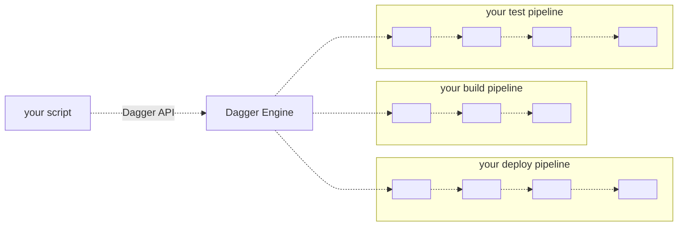

# Dagger

Dagger is a cross-platform CI/CD engine with 3 defining features:

1. Portable. Your pipelines run in containers so you get the same behavior on your local machine and in your CI environment.
2. Scriptable. Develop pipelines in Go, Typescript, Python, or even a shell script. No niche language or proprietary YAML required.
3. Extensible. Each pipeline has an API. Pipelines can be shared and reused across projects, teams or the entire community.

This can drastically improve the experience of developing and running CI/CD pipelines:

| | Before Dagger | After Dagger |
| -- | -- | -- |
| To test a pipeline manually... | `git push` then wait a few minutes |  run it locally in a few seconds |
| To test a pipeline automatically... | spend months developing a custom test framework  | use regular test tools for your favorite programming language |
| To document a pipeline... | Write a document then manually keep it up to date. | Every pipeline has an API and auto-generated documentation. |
| To detect a typing error in your pipeline... | `git push` then wait a few minutes | Use regular type checking tools for your programming language |
| Development and CI pipelines are... | Completely different. Drift and duplicate logic are a common problem | Always the same. Write once, run anywhere.
| To share pipelines across teams... | Force all teams to use the same CI and dev tools | Share Dagger pipelines. Each team can run them from the CI and dev tools of their choice.|
| To migrate to a new CI... | Re-write all your pipeline logic to a new proprietary YAML | Install Dagger on the new CI. Run the same pipelines without modification. |
| To compose a large pipeline from smaller ones... | Copy-paste YAML, or stitch 5 scripts together into a "frankenstein monster" script | Import and call a pipeline API the same way you would import and call a library |
| To understand the devops setup of your application... | Ask the devops team or read 10 books | Read the scripts. They're written in a familiar language, and they're short. |
| To optimize caching in your pipelines... | Even basic caching requires CI-specific configuration for each pipeline | All pipelines steps are cached automatically. Optimizing a pipeline makes it faster on all CI and development environments. |

## Getting Started

* [Documentation](docs/unxpq-introduction.md)
* [Join the Discord server](https://discord.gg/ufnyBtc8uY)
