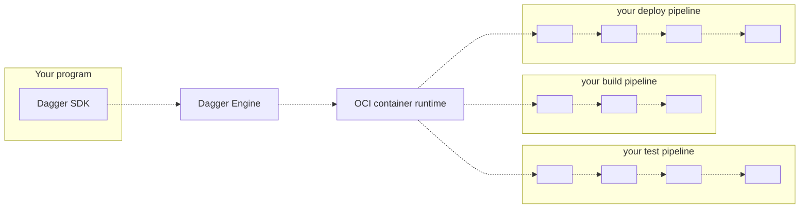

## What is Dagger?

Dagger is a CI/CD engine that is **programmable** and **container-native**.

* **Programmable**: develop your CI/CD pipelines as code, in the same programming language as your application.

* **Container-native**: Dagger executes your pipelines entirely as [standard OCI containers](https://opencontainers.org), so the same pipeline can run on your local machine, a CI runner, a dedicated server, or any container hosting service. Other benefits of container-native pipelines include superior caching; cross-language instrumentation; compatibility with the massive Docker ecosystem; and more.

## Who is it for?

Dagger may be a good fit if you are...

* A developer wishing your CI pipelines were code instead of YAML
* Your team's "designated devops person", hoping to replace a pile of artisanal scripts with something more powerful
* A platform engineer writing custom tooling, with the goal of unifying continuous delivery across organizational silos
* A cloud-native developer advocate or solutions engineer, looking to demonstrate a complex integration on short notice

## How does it work?

1. Your program imports the Dagger SDK in your language of choice.
2. Using the SDK, your program opens a new session to a Dagger Engine: either by connecting to an existing engine, or by provisioning one on-the-fly.
3. Using the SDK, your program prepares API requests describing pipelines to run, then sends them to the engine. The wire protocol used to communicate with the engine is private and not yet documented, but this will change in the future. For now, the SDK is the only documented API available to your program.
4. When the engine receives an API request, it computes a [Directed Acrylic Graph (DAG)](https://en.wikipedia.org/wiki/Directed_acyclic_graph) of low-level operations required to compute the result, and starts processing operations concurrently.
5. When all operations in the pipeline have been resolved, the engine sends the pipeline result back to your program.
6. Your program may use the pipeline's result as input to new pipelines.

## Getting started

To get started with Dagger, simply choose a SDK, then follow that SDK's getting started guide.

### Which SDK should I use?

| If you are... | then you should... |
| -- | -- |
| a Go developer | uUse the [Go SDK](sdk/go) |
| looking for an excuse to learn Go | Use the [Go SDK](sdk/go) |
| waiting for your favorite language to be supported | [Let us know which one](https://blocklayer.typeform.com/to/a6m5gKSS), and we'll notify you when it is ready
| a fan of the [CUE](https://cuelang.org) language | Use the [Dagger CUE SDK](sdk/cue) |
| enjoying the declarative nature of YAML, but wish it were more powerful | Take a look at the [CUE language](https://cuelang.org). If you like what you see, the [CUE SDK](sdk/cue) may be a good fit. |
| Not sure which SDK to choose 🤷 | In doubt, try the [Go SDK](sdk/go). It does not require advanced Go knowledge, and what you learn will transpose well to future SDKs

## Getting Started

[Documentation website](https://docs.dagger.io/)

## Community

* [Join the Dagger community on Discord](https://discord.gg/ufnyBtc8uY)
