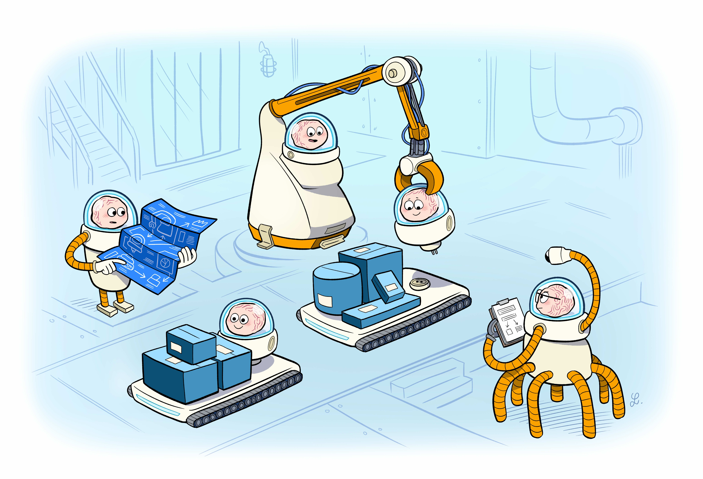

## What is Dagger?

Dagger is an open-source runtime for composable workflows. It's perfect for systems with many moving parts and a strong need for **repeatability**, **modularity**, **observability** and **cross-platform support**. This makes it a great choice for AI agents and CI/CD workflows.

## Key Features

- **Reproducible execution engine**, powered by containerized functions and a declarative DAG scheduler.

- **Universal type system**, for strongly typed composition and discovery, across platforms and languages.

- **Powerful data layer**: out-of-the-box caching, immutable state, and data tracability.

- **Native SDKs for 5 languages**. Go, Typescript, Python, PHP, Java - and more on the way.

- **Open ecosystem**: [Thousands of modules](https://daggerverse.dev) at your fingertips, all interoperable across languages and platforms.

- **Interactive command-line environment**, for rapid prototyping and debugging.

- **Batteries-included observability**. Deep tracing, metrics (including token count), and logs, all accessible from the CLI or a web UI.

- **Adapts to you**. Seamlessly integrate with all major compute and storage platforms, CI systems, languages, and agent frameworks.

- **LLM augmentation**. Connect to any LLM endpoint (OpenAI, Google, Anthropic, LLama, DeepSeek, etc.) and give it access to your Dagger objects. Dagger automatically handles the agentic loop. No complicated framework needed.

## Getting started

- [Dagger for AI Agents](https://docs.dagger.io/ai-agents)
- [Dagger for CI](https://docs.dagger.io/quickstart)

## Join the community

- Join the [Dagger community server](https://discord.gg/NpzVhsGnZu)
- Follow us on [Twitter](https://twitter.com/dagger_io)
- Check out our [community activities](https://dagger.io/community)
- Read more in our [documentation](https://docs.dagger.io)

## Contributing

Interested in contributing or building dagger from scratch? See
[CONTRIBUTING.md](https://github.com/dagger/dagger/tree/main/CONTRIBUTING.md).
