# Releasing 

This describes how to release Dagger:

- [🚙 Engine + 🚗 CLI ⏱ `30mins`](#-engine---cli--30mins)
- [🐹 Go SDK ⏱ `30mins`](#-go-sdk--30mins)
- [🐍 Python SDK ⏱ `5mins`](#-python-sdk--5mins)
- [⬢ TypeScript SDK ⏱ `5mins`](#-typescript-sdk--5mins)
- [🧪 Elixir SDK ⏱ `5mins`](#-elixir-sdk--5mins)
- [🐘 PHP SDK ⏱ `5mins`](#-php-sdk--5mins)
- [📒 Documentation ⏱ `5mins`](#-documentation--5mins)
- [🛝 Playground ⏱ `2mins`](#-playground--2mins)

This is a high-level diagram of how all the pieces fit together:

```mermaid
flowchart TB
    repo(["🐙 github.com/dagger/dagger"])
    docs["📒 Documentation"]
    playground["🛝 Playground"]
    repo -.-> docs & playground

    subgraph Dagger
        engine("🚙 Engine")
        cli("🚗 CLI &nbsp;")
    end

    repo ==> engine & cli

    S3["🗄 dl.dagger.io/dagger"]
    brew-tap["🐙 github.com/dagger/homebrew-tap"]
    cli --> S3 --> brew-tap

    registry["📦 registry.dagger.io/engine"]
    ghcr["🐙 ghcr.io/dagger/engine"]
    engine --> ghcr --> registry


    go["🐹 Go SDK"]
    go-repo["🐙 github.com/dagger/dagger-go-sdk"]
    go-pkg["🐹 dagger.io/dagger"]
    go-ref["🐹 pkg.go.dev/dagger.io/dagger"]

    repo ==> go --> go-repo --> go-pkg & go-ref
    registry -.- S3 -.- go & python & typescript & elixir

    python["🐍 Python SDK"]
    pypi["🐍 pypi.org/project/dagger-io"]
    readthedocs["📖 dagger-io.readthedocs.io"]
    repo ==> python --> pypi & readthedocs

    typescript["⬢ TypeScript SDK"]
    npm["⬢ npmjs.com/@dagger.io/dagger"]
    repo ==> typescript --> npm

    elixir["🧪 Elixir SDK"]
    hex["🧪 hex.pm/packages/dagger"]
    repo ==> elixir --> hex

    php["🐘 PHP SDK"]
    php-repo["🐙 github.com/dagger/dagger-php-sdk"]
    php-pkg["🐘 packagist.org/packages/dagger/dagger"]
    repo ======> php --> php-repo --> php-pkg
```



## Let the team know

Before you go ahead and produce a new release, remember that it's a team
effort. The first step is to let the team know what is going to happen,
preferably a few days in advance so that they can react. To do this:

- [ ] Create a new milestone in [GitHub](https://github.com/dagger/dagger/milestones),
      e.g. [`v0.9.11 Milestone`](https://github.com/dagger/dagger/milestone/36)
- [ ] Create a new post in [Discord #ask-the-team](https://discord.com/channels/707636530424053791/1098872348570038322),
      e.g. [`v0.9.11 release - 20th February 2024`](https://discord.com/channels/707636530424053791/1207018781654917181)

This allows others to weigh in whether:

- we should go for a patch / minor bump
- there are any PRs that people are waiting to get merged
- any big features which need to remain experimental?
- etc.

Maybe there are breaking changes which we should be aware of and message
accordingly. Giving other team members a day or two to react - because
timezones! - will make this entire process smoother.

Most importantly, patch vs minor is **not** a technical decision. If you want
to read more about this, see [this (private) Discord
thread](https://discord.com/channels/707636530424053791/1101242942267601038/1101508879671623780).

> [!NOTE]
>
> Once you know what type of release we are producing - patch vs minor -
> remember to edit the `?` in the Discord thread.

## Improve this doc while releasing 改善

In order to keep this relevant & accurate, we improve this doc during the
release process. It's the best time to pause, observe how it all fits together,
and improve it. We want small, constant improvements which compound. Therefore:

- [ ] Save a copy of this doc outside of this repository (e.g.
      `~/Downloads/RELEASING.md`). Now open that copy in your editor and start
      ticking items off it as you make progress. Remember to add / remove / edit
      any parts which could be improved. As inspiration, [see what a past PR with
      improvements looks like](https://github.com/dagger/dagger/pull/5056).
- [ ] Update the date in the shields.io badge, first line in this file.

> [!NOTE]
>
> We believe in documentation first, automation second. Documenting a process
> forces us to understand it well. Continuously editing this documentation
> refines our understanding. Once we have a good grasp of the problem space,
> and reach an elegant solution, it comes natural to automate & speed things
> up, to make the process more efficient. We should still be able to perform
> things manually if we need to - because sometimes automation fails 🤷. This
> is when everyone wishes they had good documentation, the original author(s)
> or both! It's also worth mentioning that when it's time to improve this
> automation, we want to be looking at the blueprint - this doc right here -
> not the implementation. If you ever had to migrate from Chef/Puppet to
> Ansible/Terraform, you know what it was like to migrate the implementation.

## 🚙 Engine + 🚗 CLI ⏱ `30mins`

> [!WARNING]
>
> It is important to always do an Engine + CLI release prior to releasing any
> SDK. This will ensure that all the APIs in the SDK are also available in the
> Engine it depends on.

- [ ] Create e.g. `.changes/v0.9.11.md` by either running `changie batch patch`
      (or `changie batch minor` if this is a new minor).

> [!NOTE]
>
> If you do not have `changie` installed, see https://changie.dev

- [ ] Make any necessary edits to the newly generated file, e.g.
      `.changes/v0.9.11.md`
- [ ] Update `CHANGELOG.md` by running `changie merge`.
- [ ] `30 mins` Submit a PR - e.g. `add-v0.9.11-release-notes` with the new release notes
      so that they can be used in the new release. Get the PR reviewed & merged.
      The merge commit is what gets tagged in the next step.
- [ ] Ensure that all checks are green ✅ for the `<ENGINE_GIT_SHA>` on the
      `main` branch that you are about to release.
- [ ] `30mins` When you have confirmed that all checks are green, run the following:

```console
git checkout main

# If not named "origin" in your local checkout, replace "origin" with whatever the
# github.com/dagger/dagger repo is named for you locally
export DAGGER_REPO_REMOTE=origin

git pull $DAGGER_REPO_REMOTE main

export ENGINE_GIT_SHA="$(git rev-parse --verify HEAD)"
export ENGINE_VERSION="$(changie latest)"
git tag "${ENGINE_VERSION:?must be set}" "${ENGINE_GIT_SHA:?must be set}"

git push "${DAGGER_REPO_REMOTE:?must be set}" "${ENGINE_VERSION:?must be set}"

export CHANGIE_ENGINE_VERSION="$ENGINE_VERSION"
```

This will kick off
[`.github./workflows/publish.yml`](https://github.com/dagger/dagger/actions/workflows/publish.yml).
After the `publish` job in this workflow passes, a new `draft` PR will
automatically be created to bump the Engine version in the various SDKs.

- [ ] Checkout the `bump-engine` branch locally & generate changelogs for all SDKs:

```console
# Fill in the value with the PR number of the bump-engine PR just created
export BUMP_ENGINE_PR=
```

```console
git fetch "${DAGGER_REPO_REMOTE:?must be set}"
git checkout bump-engine

cd sdk/go
changie new --kind "Dependencies" --body "Bump Engine to $ENGINE_VERSION" --custom "Author=github-actions" --custom "PR=${BUMP_ENGINE_PR:?must be set}"
changie batch patch
changie merge

cd ../python
changie new --kind "Dependencies" --body "Bump Engine to $ENGINE_VERSION" --custom "Author=github-actions" --custom "PR=${BUMP_ENGINE_PR:?must be set}"
changie batch patch
changie merge

cd ../typescript
changie new --kind "Dependencies" --body "Bump Engine to $ENGINE_VERSION" --custom "Author=github-actions" --custom "PR=${BUMP_ENGINE_PR:?must be set}"
changie batch patch
changie merge

cd ../elixir
changie new --kind "Dependencies" --body "Bump Engine to $ENGINE_VERSION" --custom "Author=github-actions" --custom "PR=${BUMP_ENGINE_PR:?must be set}"
changie batch patch
changie merge

cd ../php
changie new --kind "Dependencies" --body "Bump Engine to $ENGINE_VERSION" --custom "Author=github-actions" --custom "PR=${BUMP_ENGINE_PR:?must be set}"
changie batch patch
changie merge

cd ../..
```

- [ ] Commit and push the changes with the message `Add SDK release notes`
- [ ] `30mins` Open this draft PR in
      [github.com/dagger/dagger/pulls](https://github.com/dagger/dagger/pulls) &
      click on **Ready to review**.
- [ ] **After all checks pass**, merge this PR. Tip: go to the **Files
      changed** tab on the PR to review without an explicit request.

## 🐹 Go SDK ⏱ `30mins`

- [ ] Ensure that all checks are green ✅ for the `<SDK_GIT_SHA>` on the `main`
      branch that you are about to release. This will usually be the commit that
      bumps the Engine version, the one that you merged earlier.

```console
git checkout main
git pull "${DAGGER_REPO_REMOTE:?must be set}"
git branch -D bump-engine

export SDK_GIT_SHA="$(git rev-parse --verify HEAD)"
```

- [ ] Tag & publish:

```console
cd sdk/go && export GO_SDK_VERSION=$(changie latest) && cd ../..
git tag "sdk/go/${GO_SDK_VERSION:?must be set}" "${SDK_GIT_SHA:?must be set}"
git push "${DAGGER_REPO_REMOTE:?must be set}" "sdk/go/${GO_SDK_VERSION:?must be set}"
```

This will trigger the [`publish-sdk-go`
workflow](https://github.com/dagger/dagger/actions/workflows/publish-sdk-go.yml)
which publishes to [🐙
github.com/dagger/dagger-go-sdk](https://github.com/dagger/dagger-go-sdk/tags).

- [ ] `20mins` Bump the Go SDK version in our internal mage CI targets & check
      that Engine tests pass locally. If everything looks good, submit a new PR
      with this change so that we can check that all our workflows pass with the new
      SDK version before we create a new GitHub release and make it widely public.

```console
go mod edit -require dagger.io/dagger@${GO_SDK_VERSION:?must be set}
go mod tidy
cd internal/mage
go mod edit -require dagger.io/dagger@${GO_SDK_VERSION:?must be set} -require github.com/dagger/dagger@${GO_SDK_VERSION:?must be set}
go mod tidy

# Check that the most important workflow works locally:
go run main.go -w ../.. engine:test

git checkout -b improve-releasing-during-${ENGINE_VERSION:?must be set}
# Commit & push

# Test using the just-released CLI
# curl -L https://dl.dagger.io/dagger/install.sh | BIN_DIR=$HOME/.local/bin DAGGER_VERSION=0.9.11 sh
# mv ~/.local/bin/dagger{,-0.9.11}
dagger version | grep ${ENGINE_VERSION:?must be set}
cd ../..
dagger run ./hack/make engine:test
```

- [ ] Check with `@gerhard` that our dagger-runners have been updated to the
      just-released Dagger Engine image
- [ ] After you confirm that our internal tooling works with the new Go SDK
      release, [🐙
      github.com/dagger/dagger-go-sdk](https://github.com/dagger/dagger-go-sdk/tags),
      double-check that is was picked up by
      [pkg.go.dev](https://pkg.go.dev/dagger.io/dagger). You can manually request
      this new version via `open https://pkg.go.dev/dagger.io/dagger@${GO_SDK_VERSION:?must be set}`.
      The new version can take up to `60mins` to appear, it's OK to move on.

> [!NOTE]
>
> To upload the release notes, we need to have the [`gh`
> CLI](https://cli.github.com/) installed, e.g. `brew install gh`

- [ ] Upload the release notes by running:

```console
gh release create "sdk/go/${GO_SDK_VERSION:?must be set}" \
    --draft --verify-tag --title sdk/go/$GO_SDK_VERSION \
    --notes-file sdk/go/.changes/$GO_SDK_VERSION.md
```

- [ ] Check that release notes look good in `Preview`
- [ ] ⚠️ De-select **Set as the latest release** (only used for 🚙 Engine + 🚗 CLI releases)
- [ ] Click on **Publish release**

## 🐍 Python SDK ⏱ `5mins`

- [ ] Tag & publish:

```console
git checkout main
cd sdk/python && export PYTHON_SDK_VERSION=$(changie latest) && cd ../..
git tag "sdk/python/${PYTHON_SDK_VERSION:?must be set}" "${SDK_GIT_SHA:?must be set}"
git push "${DAGGER_REPO_REMOTE:?must be set}" sdk/python/${PYTHON_SDK_VERSION}
```

This will trigger the [`Publish Python SDK`
workflow](https://github.com/dagger/dagger/actions/workflows/publish-sdk-python.yml)
which publishes [dagger-io to 🐍 PyPI](https://pypi.org/project/dagger-io)

- [ ] Upload the release notes by running:

```console
gh release create "sdk/python/${PYTHON_SDK_VERSION:?must be set}" \
    --draft --verify-tag --title sdk/python/$PYTHON_SDK_VERSION \
    --notes-file sdk/python/.changes/$PYTHON_SDK_VERSION.md
```

- [ ] ⚠️ De-select **Set as the latest release** (only used for 🚙 Engine + 🚗 CLI releases)
- [ ] Check that release notes look good in `Preview`. FWIW:
      https://readthedocs.org/projects/dagger-io/builds/
- [ ] Click on **Publish release**

## ⬢ TypeScript SDK ⏱ `5mins`

- [ ] Tag & publish:

```console
cd sdk/typescript && export TYPESCRIPT_SDK_VERSION=$(changie latest) && cd ../..
git tag "sdk/typescript/${TYPESCRIPT_SDK_VERSION:?must be set}" "${SDK_GIT_SHA:?must be set}"
git push "${DAGGER_REPO_REMOTE:?must be set}" sdk/typescript/${TYPESCRIPT_SDK_VERSION}
```

This will trigger the [`Publish TypeScript SDK`
workflow](https://github.com/dagger/dagger/actions/workflows/publish-sdk-typescript.yml)
which publishes a new version to [⬢ npmjs.com/package/@dagger.io/dagger](https://www.npmjs.com/package/@dagger.io/dagger)

- [ ] Upload the release notes by running:

```console
gh release create "sdk/typescript/${TYPESCRIPT_SDK_VERSION:?must be set}" \
    --draft --verify-tag --title sdk/typescript/$TYPESCRIPT_SDK_VERSION \
    --notes-file sdk/typescript/.changes/$TYPESCRIPT_SDK_VERSION.md
```

- [ ] Check that release notes look good in `Preview`
- [ ] ⚠️ De-select **Set as the latest release** (only used for 🚙 Engine + 🚗 CLI releases)
- [ ] Click on **Publish release**

## 🧪 Elixir SDK ⏱ `5mins`

- [ ] Tag & publish:

```console
cd sdk/elixir && export ELIXIR_SDK_VERSION=$(changie latest) && cd ../..
git tag "sdk/elixir/${ELIXIR_SDK_VERSION:?must be set}" "${SDK_GIT_SHA:?must be set}"
git push "${DAGGER_REPO_REMOTE:?must be set}" sdk/elixir/${ELIXIR_SDK_VERSION}
```

This will trigger the [`Publish Elixir SDK`
workflow](https://github.com/dagger/dagger/actions/workflows/publish-sdk-elixir.yml)
which publishes a new version to [🧪 hex.pm/packages/dagger](https://hex.pm/packages/dagger)

- [ ] Upload the release notes by running:

```console
gh release create "sdk/elixir/${ELIXIR_SDK_VERSION:?must be set}" \
    --draft --verify-tag --title sdk/elixir/$ELIXIR_SDK_VERSION \
    --notes-file sdk/elixir/.changes/$ELIXIR_SDK_VERSION.md
```

- [ ] Check that release notes look good in `Preview`
- [ ] ⚠️ De-select **Set as the latest release** (only used for 🚙 Engine + 🚗 CLI releases)
- [ ] Click on **Publish release**

## 🐘 PHP SDK ⏱ `5mins`

- [ ] Tag & publish:

```console
cd sdk/php && export PHP_SDK_VERSION=$(changie latest) && cd ../..
git tag "sdk/php/${PHP_SDK_VERSION:?must be set}" "${SDK_GIT_SHA:?must be set}"
git push "${DAGGER_REPO_REMOTE:?must be set}" sdk/php/${PHP_SDK_VERSION}
```

This will trigger the [`Publish PHP SDK`
workflow](https://github.com/dagger/dagger/actions/workflows/publish-sdk-php.yml)
which publishes to
[github.com/dagger/dagger-php-sdk](https://github.com/dagger/dagger-php-sdk/tags).

- [ ] Upload the release notes by running:

```console
gh release create "sdk/php/${PHP_SDK_VERSION:?must be set}" \
    --draft --verify-tag --title sdk/php/$PHP_SDK_VERSION \
    --notes-file sdk/php/.changes/$PHP_SDK_VERSION.md
```

- [ ] Check that release notes look good in `Preview`
- [ ] ⚠️ De-select **Set as the latest release** (only used for 🚙 Engine + 🚗 CLI releases)
- [ ] Click on **Publish release**

## 📒 Documentation ⏱ `5mins`

> [!WARNING]
>
> Merging a documentation PR does NOT automatically deploy the
> new documentation to the production website.

There are two websites for documentation:

1. Staging: https://devel.docs.dagger.io - [Netlify dashboard](https://app.netlify.com/sites/devel-docs-dagger-io)
2. Production: https://docs.dagger.io - [Netlify dashboard](https://app.netlify.com/sites/docs-dagger-io)

### Staging release

When a PR is merged, a new deployment is created for the documentation
site and it is automatically published to https://devel.docs.dagger.io
via Netlify.

Use this staging website to test the documentation, including:

- verifying that the new content appears in the navigation
- verifying internal and external links work correctly
- verifying that images appear correctly
- etc.

### Production release

When a PR is merged, a new production deployment is also created for
https://docs.dagger.io. However, this deployment is not automatically
published.

After testing the documentation using the staging website and if you
are satisfied with it, manually publish the
production deployment via Netlify as follows:

- [ ] Log in to the [Netlify dashboard for
      https://docs.dagger.io](https://app.netlify.com/sites/docs-dagger-io).
- [ ] Refer to the list of "production deploys" and select the one you wish to
      deploy. Usually, this will be the most recent one. You can confirm this by
      checking the deployment hash against the latest commit hash in the
      [dagger/dagger repository main branch](https://github.com/dagger/dagger).
- [ ] On the deployment page, click the "Preview" button to once again
      preview/check the deployment. You can also check the deployment log to
      confirm there were no errors during the documentation build process.
- [ ] If you are satisfied with the preview, click the "Publish deploy" button.
      This will publish the selected deployment on https://docs.dagger.io

> [!NOTE]
>
> There have been cases where Netlify builds have failed with errors,
> but the same build succeeds when performed locally. In the past, one reason
> for this has been Netlify's use of a stale cache. In case you encounter
> this error, click "Options -> Clear cache and retry with latest branch commit"
> to recreate the deployment with a clean cache.

## 🛝 Playground ⏱ `2mins`

The [Dagger Playground](https://play.dagger.cloud) is set to automatically
update once there's a new release of the Dagger Engine.

Follow these steps to verify the Playground Dagger version:

1. Login with your GitHub account at https://play.dagger.cloud
2. Open your browser's Developer Tools, and then the **Network** tab
3. Click the **Execute query** button
4. Click in the `/playgrounds` POST request row in the **Network** tab
5. Verify that the `X-Dagger-Engine` response header value matches the just-released Engine version

## 🌌 Daggerverse

This is documented internally, ping @jpadams, @vito or anyone who knows about Daggerverse deployment.

## Last step

- [ ] When all the above done, remember to add the `RELEASING.md` changes to
      the `improve-releasing-during-v...` PR that you have opened earlier (remember
      to toggle all the checkboxes back to `[ ]`). Here is an example:
      https://github.com/dagger/dagger/pull/5658
- [ ] Close the Discord release thread you created in [Let the team know](#let-the-team-know)
- [ ] Close the GitHub milestone you created in [Let the team know](#let-the-team-know)
  - If there are remaining PRs/issues that were not resolved, then move
    them into the next milestone (or remove it from a milestone entirely)
