# Releasing 

This describes how to release Dagger:

- [🚙 Engine + 🚗 CLI ⏱ `30mins`](#-engine---cli--30mins)
- [🐹 Go SDK ⏱ `10mins`](#-go-sdk--10mins)
- [🐍 Python SDK ⏱ `5mins`](#-python-sdk--5mins)
- [⬢ TypeScript SDK ⏱ `5mins`](#-typescript-sdk--5mins)
- [🧪 Elixir SDK ⏱ `5mins`](#-elixir-sdk--5mins)
- [🐘 PHP SDK ⏱ `5mins`](#-php-sdk--5mins)
- [☸️ Helm chart ⏱ `2mins`](#%EF%B8%8F-helm-chart--2mins)
- [📒 Documentation ⏱ `5mins`](#-documentation--5mins)
- [🛝 Playground ⏱ `2mins`](#-playground--2mins)
- [🌌 Daggerverse ⏱ `2mins`](#-daggerverse--2mins)
- [☁️ Dagger Cloud ⏱ `2mins`](#-dagger-cloud--2mins)
- [🪣 Install scripts ⏱ `2mins`](#-install-scripts--2mins#)
- [🐙 dagger-for-github ⏱ `10mins`](#-dagger-for-github--10mins#)
- [🍺 dagger Homebrew ⏱ `2mins`](#-dagger-homebrew--2mins#)
- [❄️ nix ⏱ `2mins`](#-nix--2mins#)
- [⚙️ CI ⏱ `2mins`](#-ci--2mins)

This is a high-level diagram of how all the pieces fit together:

```mermaid
flowchart TB
    repo(["🐙 github.com/dagger/dagger"])
    docs["📒 Documentation"]
    ci["⚙️ CI"]
    repo -.-> docs & ci

    subgraph Dagger
        engine("🚙 Engine")
        cli("🚗 CLI &nbsp;")
    end

    repo ==> engine & cli

    S3["🗄 dl.dagger.io/dagger"]
    brew-tap["🐙 github.com/dagger/homebrew-tap"]
    github-action["🐙 github.com/dagger/dagger-for-github"]
    nix["❄️ github.com/dagger/nix"]
    cli --> S3 ------> brew-tap & github-action & nix

    registry["📦 registry.dagger.io/engine"]
    ghcr["🐙 ghcr.io/dagger/engine"]
    engine --> ghcr --> registry

    go["🐹 Go SDK"]
    go-repo["🐙 github.com/dagger/dagger-go-sdk"]
    go-pkg["🐹 dagger.io/dagger"]
    go-ref["🐹 pkg.go.dev/dagger.io/dagger"]
    playground["🛝 Playground"]
    daggerverse["🌌 Daggerverse"]
    cloud["☁️ Dagger Cloud"]

    repo ==> go --> go-repo --> go-pkg & go-ref
    go-pkg -.-> daggerverse & cloud
    registry -.- S3 -.- go & python & typescript & elixir & php & helm

    registry -.....- playground

    python["🐍 Python SDK"]
    pypi["🐍 pypi.org/project/dagger-io"]
    readthedocs["📖 dagger-io.readthedocs.io"]
    repo ==> python --> pypi & readthedocs

    typescript["⬢ TypeScript SDK"]
    npm["⬢ npmjs.com/@dagger.io/dagger"]
    repo ==> typescript --> npm

    elixir["🧪 Elixir SDK"]
    hex["🧪 hex.pm/packages/dagger"]
    repo ==> elixir --> hex

    php["🐘 PHP SDK"]
    php-repo["🐙 github.com/dagger/dagger-php-sdk"]
    php-pkg["🐘 packagist.org/packages/dagger/dagger"]
    repo ======> php --> php-repo --> php-pkg

    helm["☸️ Helm chart"]
    repo ======> helm
```



## Let the team know

Before you go ahead and produce a new release, remember that it's a team
effort. The first step is to let the team know what is going to happen,
preferably a few days in advance so that they can react. We do our release
threads in public wherever possible, to give the community more visibility, and
to help external contributors to more easily keep in sync with the release
cadence.

To let the team know:

- [ ] Create a new milestone in [GitHub](https://github.com/dagger/dagger/milestones),
      e.g. [`v0.11.5 Milestone`](https://github.com/dagger/dagger/milestone/47)
- [ ] Create a new post in [Discord #engine-dev](https://discord.com/channels/707636530424053791/1003718839739105300),
      e.g. [`v0.11.5 release - 28th May 2024`](https://discord.com/channels/707636530424053791/1240714480275689574)

This allows others to weigh in whether:

- we should go for a patch / minor bump
- there are any PRs that people are waiting to get merged
- any big features which need to remain experimental?
- etc.

Maybe there are breaking changes which we should be aware of and message
accordingly. Giving other team members a day or two to react - because
timezones! - will make this entire process smoother.

Most importantly, patch vs minor is **not** a technical decision. If you want
to read more about this, see [this (private) Discord
thread](https://discord.com/channels/707636530424053791/1101242942267601038/1101508879671623780).

- [ ] If doing a minor release, determine if there are any deprecations that
      can be removed.

> [!NOTE]
>
> Once you know what type of release we are producing - patch vs minor -
> remember to edit the `?` in the Discord thread.

### Backwards compatibility

Where possible, we try to ensure backwards compatibility between mismatched cli
and engine versions. However, for technical reasons, this isn't always possible:
sometime the communication protocol changes, or a bug fix or new feature
requires changes on both the CLI and the engine.

Before releasing, make sure to sanity check the backwards compatibility of a
release. If you enounter issues, then:

- [ ] Add a release note using `changie new` (or add it later manually).
- [ ] Bump the minimum version numbers in [engine/version.go](https://github.com/dagger/dagger/blob/main/engine/version.go).

If unsure, bump both the client and engine minimum version numbers, but if
the backwards compatibility is only an issue in one direction, you only need
to bump that one.

## Improve this doc while releasing 改善

In order to keep this relevant & accurate, we improve this doc during the
release process. It's the best time to pause, observe how it all fits together,
and improve it. We want small, constant improvements which compound. Therefore:

- [ ] Save a copy of this doc outside of this repository (e.g.
      `~/Downloads/RELEASING.md`). Now open that copy in your editor and start
      ticking items off it as you make progress. Remember to add / remove / edit
      any parts which could be improved. As inspiration, [see what a past PR with
      improvements looks like](https://github.com/dagger/dagger/pull/5056).
- [ ] Update the date in the shields.io badge, first line in this file.

> [!NOTE]
>
> We believe in documentation first, automation second. Documenting a process
> forces us to understand it well. Continuously editing this documentation
> refines our understanding. Once we have a good grasp of the problem space,
> and reach an elegant solution, it comes natural to automate & speed things
> up, to make the process more efficient. We should still be able to perform
> things manually if we need to - because sometimes automation fails 🤷. This
> is when everyone wishes they had good documentation, the original author(s)
> or both! It's also worth mentioning that when it's time to improve this
> automation, we want to be looking at the blueprint - this doc right here -
> not the implementation. If you ever had to migrate from Chef/Puppet to
> Ansible/Terraform, you know what it was like to migrate the implementation.

## Workflow for releases off non-main branch

Currently, some of the steps here vary depending on whether we are running a
release off of `main` vs. off of a separate branch.

They are marked with 🚨 in the steps below.

We do this process when we need to do a patch release but don't want to include
every commit that has been merged to `main` since the last release.

In the long term we should strive to make the process the same regardless of
the branch we are releasing off of, but for now, we need to be aware of the
differences.

## Required tooling

Before starting the releasing process, make sure you have your local
environment setup and ready to go. You'll need (at least) the following tools -
though you probably already have most of them if you're regularly contributing
to dagger.

- A UNIX environment and shell
- [git](https://git-scm.com/)
- [dagger](https://github.com/dagger/dagger) (the most recent release)
- [changie](https://changie.dev)
- [gh](https://cli.github.com/) github cli tool
- [golang](https://go.dev)

## 🚙 Engine + 🚗 CLI ⏱ `30mins`

> [!WARNING]
>
> It is important to always do an Engine + CLI release prior to releasing any
> SDK. This will ensure that all the APIs in the SDK are also available in the
> Engine it depends on.

Setup some variables used throughout the release process:

```console
# 🚨 change this from `main` to `release-vX.Y.Z` if releasing off a non-main branch
export RELEASE_BRANCH=main

# If not named "origin" in your local checkout, replace "origin" with whatever the
# github.com/dagger/dagger repo is named for you locally
export DAGGER_REPO_REMOTE=origin
```

> [!NOTE]
>
> This process involves direct pushes to the github.com/dagger/dagger repository. Recently there have been permission issues here that result in errors like
>
> `refusing to allow an OAuth App to create or update workflow` when pushing.
>
> If you encounter this, you may need to change your git remote from https to ssh, e.g.
>
> `git remote set-url $DAGGER_REPO_REMOTE git@github.com:dagger/dagger.git`
>
> It's advisable to go back to https after the release is complete to not retain excessive permissions longer than necessary, e.g. to go back run
>
> `git remote set-url $DAGGER_REPO_REMOTE https://github.com/dagger/dagger.git`

<details>
<summary>🚨 Non-main branch release only:</summary>

Create a new branch off of the previous git tag being patched named `release-vX.Y.Z` (e.g. `release-v0.11.9`)

```console
git switch -c $RELEASE_BRANCH

# e.g. if creating a new v0.11.9 release off of v0.11.8, use v0.11.8 here
git reset --hard <previous tag being patched>

git push --set-upstream $DAGGER_REPO_REMOTE "$RELEASE_BRANCH"
```

</details>

Setup the local branch to align with the remote branch being released

```console
git checkout "$RELEASE_BRANCH"

git pull $DAGGER_REPO_REMOTE "$RELEASE_BRANCH"
```

<details>
<summary>🚨 Non-main branch release only:</summary>

`git cherry-pick <commit-hash>` the commits you want to include in the release from `main` to the release branch.

You will also want to ensure you _always_ cherry-pick a few special commits:

- [ ] The SDK bump PR for the release being patched.
  - e.g. if we are creating a `v0.11.9` release based off of `v0.11.8`, you want to ensure you cherry-pick [this PR](https://github.com/dagger/dagger/pull/7690).
- [ ] The PR that bumps CI to use the new Engine version.
  - e.g. if we are creating a `v0.11.9` release based off of `v0.11.8`, you want to ensure you cherry-pick [this PR](https://github.com/dagger/dagger/pull/7702) that upgrades CI to use `v0.11.8` engines.

</details>

- [ ] Determine the next release version (use `patch`/`minor`/`major` to set the release type):

```console
export ENGINE_VERSION_TYPE=patch
export ENGINE_VERSION="$(changie next $ENGINE_VERSION_TYPE)"

# this is required to interpolate $ENGINE_VERSION to the SDK release notes
export CHANGIE_ENGINE_VERSION="$ENGINE_VERSION"
```

- [ ] Create the target release notes branch for a PR - e.g. `prep-v0.12.4`.
  - 🚨 Non-main branch release only: This PR will also include the cherry-picked commits mentioned above.

```console
git checkout -b prep-$ENGINE_VERSION
```

- [ ] Bump SDK versions to the target version

```console
dagger call sdk all bump --version="$ENGINE_VERSION" -o ./
git add sdk
git commit -s -m "chore: bump sdk dependencies to $ENGINE_VERSION"
```

- [ ] Bump Helm version to the target version

```console
dagger call helm set-version --version="$ENGINE_VERSION" -o ./helm/dagger/Chart.yaml
git add helm
git commit -s -m "chore: bump helm dependency to $ENGINE_VERSION"
```

- [ ] Push and open the PR as a draft, and capture the PR number:

```console
export RELEASE_PREP_PR=<PR>
```

- [ ] Generate bump changes for each SDK + the helm charts

```console
export GITHUB_USERNAME="YOUR USERNAME HERE" # replace with your username
find sdk/go sdk/python sdk/typescript sdk/elixir sdk/php helm/dagger -maxdepth 1 -name .changie.yaml -execdir \
      changie new --kind "Dependencies" --body "Bump Engine to $ENGINE_VERSION" --custom PR="$RELEASE_PREP_PR" --custom Author="$GITHUB_USERNAME" \;
```

- [ ] Generate release notes `.changes/**/v0.12.4.md` for all releases by
      running `changie batch $ENGINE_VERSION`:

```console
find . sdk/go sdk/python sdk/typescript sdk/elixir sdk/php helm/dagger -maxdepth 1 -name .changie.yaml -execdir changie batch $ENGINE_VERSION \;
```

- [ ] Make any necessary edits to the newly generated file, e.g. `.changes/v0.12.4.md`
- [ ] Update `CHANGELOG.md` by running `changie merge`.

```console
find . sdk/go sdk/python sdk/typescript sdk/elixir sdk/php helm/dagger -maxdepth 1 -name .changie.yaml -execdir changie merge \;
git add **/.changes
git add **/CHANGELOG.md
git commit -s -m "chore: add release notes for $ENGINE_VERSION"
```

- [ ] Update `.changes/.next` with the next release number if known -
      otherwise, make the file empty (but don't remove it).

- [ ] Update all dagger versions in `docs/current_docs/partials/_install-cli.mdx` to `$ENGINE_VERSION`

  - e.g. if bumping 0.12.5->0.12.6, can run `sed -i 's/0\.12\.5/0\.12\.6/g' docs/current_docs/partials/_install-cli.mdx`

- [ ] `30 mins` Submit, review and merge the prep PR. The merge commit is what gets tagged in the next step.
  - 🚨 Non-main branch release only: Ideally use "Rebase and Merge" rather than squashing commits when merging so we can more easily preserve the history of the cherry-picked commits.
- [ ] Ensure that all checks are green ✅ on the `$RELEASE_BRANCH` that you are about to release.
  - 🚨 Non-main branch release only: currently, CI does not run on non-main branches and some of the workflows are currently hardcoded with `main` so it's not safe to manually run them. So for now this has to be skipped in this case.
- [ ] `30mins` When you have confirmed that all checks are green, run the following:

```console
git checkout "$RELEASE_BRANCH"
git pull "$DAGGER_REPO_REMOTE" "$RELEASE_BRANCH"

export ENGINE_GIT_SHA="$(git rev-parse --verify HEAD)"
git tag "$ENGINE_VERSION" "$ENGINE_GIT_SHA"
git push "$DAGGER_REPO_REMOTE" "$ENGINE_VERSION"
```

This will kick off
[`.github./workflows/publish.yml`](https://github.com/dagger/dagger/actions/workflows/engine-and-cli-publish.yml)
which publishes:

- A new image to [ghcr.io/dagger/engine](https://github.com/dagger/dagger/pkgs/container/engine) (mirrored to registry.dagger.io/engine using https://github.com/dagger/registry-redirect).
- New cli binaries to [dl.dagger.io](https://dl.dagger.io) (served from an S3 bucket, uploaded to by goreleaser)

### Improve releasing 改善

- [ ] Download and install the latest release, and continue the rest of the
      release process using the just-released CLI. This is needed now so the
      `dev` module updated below will get `dagger.json`'s engine version bumped.

```console
# install the cli to dagger-0.13.0, and symlink dagger to it
curl -fsSL https://dl.dagger.io/dagger/install.sh | BIN_DIR=$HOME/.local/bin DAGGER_VERSION=0.13.0 sh
mv ~/.local/bin/dagger{,-0.13.0}
ln -s ~/.local/bin/dagger{-0.13.0,}

dagger version
dagger core version
```

- [ ] Update all dagger versions in `.github/` to `$ENGINE_VERSION`

  - The version numbers (of the form `<major>.<minor>.<patch>`) should be updated to the new version
  - The worker runner versions (of the form `dagger-v<major>-<minor>-<patch>-<worker>`)
  - e.g. if bumping 0.12.6->0.12.7, can run `find .github/ -type f -exec sed -i 's/0-12-6/0-12-7/g; s/0\.12\.6/0\.12\.7/g' {} +`

- [ ] Regenerate `.github/` configs by running `dagger call -m .github generate -o .`

- [ ] Open a PR with the title `Improve Releasing during $ENGINE_VERSION`

```console
git checkout -b improve-releasing-during-$ENGINE_VERSION
git add .  # or any other files changed during the last few steps
git commit -s -m "Improve releasing during $ENGINE_VERSION"
git push
```

- Swap back to `$RELEASE_BRANCH` to continue

```console
git checkout "$RELEASE_BRANCH"
```

<details>
<summary>🚨 Non-main branch release only:</summary>

Change the branch the PR is being merged into from `main` to the `release-vX.Y.Z` branch.

</details>

## 🐹 Go SDK ⏱ `10mins`

- [ ] Ensure that all checks are green ✅ on the `$RELEASE_BRANCH`
      branch that you are about to release. This will usually be the commit that
      bumps the Engine version, the one that you merged earlier.
  - 🚨 Non-main branch release only: currently, CI does not run on non-main branches and some of the workflows are currently hardcoded with `main` so it's not safe to manually run them. So for now this has to be skipped in this case.

```console
export SDK_GIT_SHA=$ENGINE_GIT_SHA
```

- [ ] Tag & publish:

```console
cd sdk/go && export GO_SDK_VERSION=$(changie latest) && cd ../..
git tag "sdk/go/$GO_SDK_VERSION" "$SDK_GIT_SHA"
git push "$DAGGER_REPO_REMOTE" "sdk/go/$GO_SDK_VERSION"
```

This will trigger the [`publish-sdk-go`
workflow](https://github.com/dagger/dagger/actions/workflows/sdk-go-publish.yml)
which publishes to [🐙
github.com/dagger/dagger-go-sdk](https://github.com/dagger/dagger-go-sdk/tags).

The release notes should be automatically uploaded as a draft to the
[Dagger releases](https://github.com/dagger/dagger/releases) page. Navigate to
the draft release, then:

- [ ] Check that release notes look good in `Preview`
- [ ] ⚠️ De-select **Set as the latest release** (only used for 🚙 Engine + 🚗 CLI releases)
- [ ] Click on **Publish release**

Finally:

- [ ] Double-check that the releases was picked up by [pkg.go.dev](https://pkg.go.dev/dagger.io/dagger).
      You can manually request this new version via `open https://pkg.go.dev/dagger.io/dagger@$GO_SDK_VERSION`.
      The new version can take up to `60mins` to appear, it's OK to move on.

### Improve releasing 改善

- [ ] Swap to the release improvement branch

```console
git checkout improve-releasing-during-$ENGINE_VERSION
```

- [ ] Bump the Go SDK version in our internal CI targets (these aren't actually
      used anywhere since we use the modularized go SDK - but it's good
      practice regardless).

```console
go mod edit -require dagger.io/dagger@$GO_SDK_VERSION
go mod edit -require github.com/dagger/dagger/engine/distconsts@$GO_SDK_VERSION
go mod tidy
dagger develop
cd .dagger
go mod edit -require github.com/dagger/dagger/engine/distconsts@$ENGINE_VERSION
go mod tidy
cd ..

# add, commit and push the changes to the PR
git add .
git commit -s -m "chore: bump internal tooling to $ENGINE_VERSION"
git push
```

- Swap back to `$RELEASE_BRANCH` to continue

```console
git checkout "$RELEASE_BRANCH"
```

## 🐍 Python SDK ⏱ `5mins`

- [ ] Tag & publish:

```console
cd sdk/python && export PYTHON_SDK_VERSION=$(changie latest) && cd ../..
git tag "sdk/python/$PYTHON_SDK_VERSION" "$SDK_GIT_SHA"
git push "$DAGGER_REPO_REMOTE" sdk/python/$PYTHON_SDK_VERSION
```

This will trigger the [`Publish Python SDK`
workflow](https://github.com/dagger/dagger/actions/workflows/sdk-python-publish.yml)
which publishes [dagger-io to 🐍 PyPI](https://pypi.org/project/dagger-io)

The release notes should be automatically uploaded as a draft to the
[Dagger releases](https://github.com/dagger/dagger/releases) page. Navigate to
the draft release, then:

- [ ] ⚠️ De-select **Set as the latest release** (only used for 🚙 Engine + 🚗 CLI releases)
- [ ] Check that release notes look good in `Preview`. FWIW:
      https://readthedocs.org/projects/dagger-io/builds/
- [ ] Click on **Publish release**

## ⬢ TypeScript SDK ⏱ `5mins`

- [ ] Tag & publish:

```console
cd sdk/typescript && export TYPESCRIPT_SDK_VERSION=$(changie latest) && cd ../..
git tag "sdk/typescript/$TYPESCRIPT_SDK_VERSION" "$SDK_GIT_SHA"
git push "$DAGGER_REPO_REMOTE" sdk/typescript/$TYPESCRIPT_SDK_VERSION
```

This will trigger the [`Publish TypeScript SDK`
workflow](https://github.com/dagger/dagger/actions/workflows/sdk-typescript-publish.yml)
which publishes a new version to [⬢ npmjs.com/package/@dagger.io/dagger](https://www.npmjs.com/package/@dagger.io/dagger)

The release notes should be automatically uploaded as a draft to the
[Dagger releases](https://github.com/dagger/dagger/releases) page. Navigate to
the draft release, then:

- [ ] Check that release notes look good in `Preview`
- [ ] ⚠️ De-select **Set as the latest release** (only used for 🚙 Engine + 🚗 CLI releases)
- [ ] Click on **Publish release**

## 🧪 Elixir SDK ⏱ `5mins`

- [ ] Tag & publish:

```console
cd sdk/elixir && export ELIXIR_SDK_VERSION=$(changie latest) && cd ../..
git tag "sdk/elixir/$ELIXIR_SDK_VERSION" "$SDK_GIT_SHA"
git push "$DAGGER_REPO_REMOTE" sdk/elixir/$ELIXIR_SDK_VERSION
```

This will trigger the [`Publish Elixir SDK`
workflow](https://github.com/dagger/dagger/actions/workflows/sdk-elixir-publish.yml)
which publishes a new version to [🧪 hex.pm/packages/dagger](https://hex.pm/packages/dagger)

The release notes should be automatically uploaded as a draft to the
[Dagger releases](https://github.com/dagger/dagger/releases) page. Navigate to
the draft release, then:

- [ ] Check that release notes look good in `Preview`
- [ ] ⚠️ De-select **Set as the latest release** (only used for 🚙 Engine + 🚗 CLI releases)
- [ ] Click on **Publish release**

## 🐘 PHP SDK ⏱ `5mins`

- [ ] Tag & publish:

```console
cd sdk/php && export PHP_SDK_VERSION=$(changie latest) && cd ../..
git tag "sdk/php/$PHP_SDK_VERSION" "$SDK_GIT_SHA"
git push "$DAGGER_REPO_REMOTE" sdk/php/$PHP_SDK_VERSION
```

This will trigger the [`Publish PHP SDK`
workflow](https://github.com/dagger/dagger/actions/workflows/sdk-php-publish.yml)
which publishes to
[github.com/dagger/dagger-php-sdk](https://github.com/dagger/dagger-php-sdk/tags).

The release notes should be automatically uploaded as a draft to the
[Dagger releases](https://github.com/dagger/dagger/releases) page. Navigate to
the draft release, then:

- [ ] Check that release notes look good in `Preview`
- [ ] ⚠️ De-select **Set as the latest release** (only used for 🚙 Engine + 🚗 CLI releases)
- [ ] Click on **Publish release**

## ☸️ Helm chart ⏱ `2mins`

- [ ] Tag & publish:

```console
export HELM_CHART_VERSION=v"$(awk '/^version: / { print $2 }' helm/dagger/Chart.yaml)"
git tag "helm/chart/$HELM_CHART_VERSION" "$SDK_GIT_SHA"
git push "$DAGGER_REPO_REMOTE" "helm/chart/$HELM_CHART_VERSION"
```

This will trigger the [`publish-helm-chart`
workflow](https://github.com/dagger/dagger/actions/workflows/helm-publish.yml)
which publishes to [🐙
registry.dagger.io/dagger-helm](https://github.com/dagger/dagger/pkgs/container/dagger-helm).

## 🚨 Non-main branch release only

After the Engine+SDKs are all released from the `release-vX.Y.Z` branch, you will need to "forward-port" a few of the commits there up to `main`. Namely:

- The commits from the release notes PR, e.g. when patching `v0.11.8` to `v0.11.9`, [this commit](https://github.com/dagger/dagger/commit/18fd28cfa8f2e5d5f2ccc58fb15a4a975a3660dd)
- The commits from the SDK engine version bump PR, e.g. when patching `v0.11.8` to `v0.11.9`, the commits from [this PR](https://github.com/dagger/dagger/pull/7746)
- The commits from the CI engine version bump PR, e.g. when patching `v0.11.8` to `v0.11.9`, [this commit](https://github.com/dagger/dagger/commit/58b1865969426357f7c38f2052a93789bd324534)

One easy way to do this is to re-use the engine version bump PR that was created against `main` earlier, cherry-picking in the missing commits.

Be sure to use "Rebase and Merge" when merging the PR to `main` to preserve the history of the cherry-picked commits.

- [Example of this here for `v0.11.9`](https://github.com/dagger/dagger/pull/7745)

## 📒 Documentation ⏱ `5mins`

> [!WARNING]
>
> Merging a documentation PR does NOT automatically deploy the
> new documentation to the production website.

There are two websites for documentation:

1. Staging: https://devel.docs.dagger.io - [Netlify dashboard](https://app.netlify.com/sites/devel-docs-dagger-io)
2. Production: https://docs.dagger.io - [Netlify dashboard](https://app.netlify.com/sites/docs-dagger-io)

### Staging release

When a PR is merged, a new deployment is created for the documentation
site and it is automatically published to https://devel.docs.dagger.io
via Netlify.

Use this staging website to test the documentation, including:

- verifying that the new content appears in the navigation
- verifying internal and external links work correctly
- verifying that images appear correctly
- etc.

### Production release

When a PR is merged, a new production deployment is also created for
https://docs.dagger.io. However, this deployment is not automatically
published.

After testing the documentation using the staging website and if you
are satisfied with it, manually publish the
production deployment via Netlify as follows:

- [ ] Log in to the [Netlify dashboard for
      https://docs.dagger.io](https://app.netlify.com/sites/docs-dagger-io).
- [ ] Refer to the list of "production deploys" and select the one you wish to
      deploy. Usually, this will be the most recent one. You can confirm this by
      checking the deployment hash against the latest commit hash in the
      [dagger/dagger repository main branch](https://github.com/dagger/dagger).
- [ ] On the deployment page, click the "Preview" button to once again
      preview/check the deployment. You can also check the deployment log to
      confirm there were no errors during the documentation build process.
- [ ] If you are satisfied with the preview, click the "Publish deploy" button.
      This will publish the selected deployment on https://docs.dagger.io

> [!NOTE]
>
> There have been cases where Netlify builds have failed with errors,
> but the same build succeeds when performed locally. In the past, one reason
> for this has been Netlify's use of a stale cache. In case you encounter
> this error, click "Options -> Clear cache and retry with latest branch commit"
> to recreate the deployment with a clean cache.

## 🛝 Playground ⏱ `2mins`

The [Dagger Playground](https://play.dagger.cloud) is set to automatically
update once there's a new release of the Dagger Engine.

- [ ] Mention in the release thread on Discord that Playground can be updated
      to the just-released version. cc @marcosnils @matipan @gerhard

## 🌌 Daggerverse ⏱ `2mins`

- [ ] Mention in the release thread on Discord that Playground can be updated
      to the just-released version. cc @marcosnils @matipan @grouville

## ☁️ Dagger Cloud ⏱ `2mins`

- [ ] Mention in the release thread on Discord that Dagger Cloud can be updated
      to the just-released version. cc @marcosnils @matipan @sipsma

## 🪣 Install scripts ⏱ `2mins`

- [ ] If the install scripts `install.sh` or `install.ps1` have changed since
      the last release, they must be manually updated on Amazon S3 (CloudFront
      should also be manually invalidated). cc @gerhard

## 🐙 dagger-for-github ⏱ `10mins`

- [ ] Submit PR with the version bump, e.g.
      https://github.com/dagger/dagger-for-github/pull/123
  - e.g. if bumping 0.12.5->0.12.6, can run `find . -type f -exec sed -i 's/0\.12\.5/0\.12\.6/g' {} +`
- [ ] Ask @gerhard or @jpadams to review it

> [!TIP]
> We should automate the above mentioned steps same as we do with the PR which
> bumps the Engine version, e.g. https://github.com/dagger/dagger/pull/7318

- [ ] Once this PR is merged, tag the new full semver version

```console
# Find the latest released patch https://github.com/dagger/dagger-for-github/releases
# or via the `gh` CLI. Use that to figure out the NEXT_PATCH_VERSION.
# For `dagger` minor bumps, bump `dagger-for-github` major version.
# For `dagger` patch bumps, bump `dagger-for-github` minor version. Use `dagger-for-github`
# patch version for fixes to bugs in `dagger-for-github`.
gh release view --repo dagger/dagger-for-github --json tagName,publishedAt

# Sign the tag, using the date as the comment, e.g. 2024-07-22
git tag --sign -m "2024-08-02" <NEXT_PATCH_VERSION>
git push origin <NEXT_PATCH_VERSION> #shouldn't need to force since new tag
```

- [ ] Create a new release from the patch tag (auto-fill release notes via the
      GitHub UI or via the `gh` CLI)
- [ ] Submit PR to change the version mentioned in Dagger docs. See example [here](https://github.com/dagger/dagger/pull/8131)

```console
# --verify-tag will ensure the last tag creation step was done
gh release create --generate-notes --verify-tag <NEXT_PATCH_VERSION>
```

- [ ] Force update the major version, currently `v6`, using the date as the comment, e.g. 2024-07-22

```console
git tag --sign -m "2024-08-02" v6 --force
git push origin v6 --force #need to force since moving this tag
```

## 🍺 dagger Homebrew ⏱ `2mins`

- [ ] Check that Dagger Homebrew formula has been updated to latest, e.g.
      [dagger 0.12.5](https://github.com/Homebrew/homebrew-core/pull/181284).
      This is automated, but note that it may take several hours to trigger.

## ❄️ nix ⏱ `2mins`

- [ ] Check that Dagger nix flake has been updated to latest, e.g. [dagger: ->
      v0.12.5](https://github.com/dagger/nix/commit/5053689af7d18e67254ba0b2d60fa916b7370104)

## Last step

- [ ] When all the above done, remember to add the `RELEASING.md` changes to
      the `improve-releasing-during-v...` PR that you have opened earlier (remember
      to toggle all the checkboxes back to `[ ]`). Here is an example:
      https://github.com/dagger/dagger/pull/5658
- [ ] Close the Discord release thread you created in [Let the team know](#let-the-team-know)
- [ ] Close the GitHub milestone you created in [Let the team know](#let-the-team-know)
  - If there are remaining PRs/issues that were not resolved, then move
    them into the next milestone (or remove it from a milestone entirely)
