# Releasing 

This describes how to release Dagger:

- [🚙 Engine + 🚗 CLI ⏱ `50mins`](#-engine---cli--50mins)
- [🐹 Go SDK ⏱ `20mins`](#-go-sdk--20mins)
- [🐍 Python SDK ⏱ `10mins`](#-python-sdk--10mins)
- [⬢ Node.js SDK ⏱ `10mins`](#-nodejs-sdk--10mins)
- [📒 Documentation ⏱ `5mins`](#-documentation--5mins)
- [🛝 Playground ⏱ `5mins`](#-playground--5mins)

This is a high-level diagram of how all the pieces fit together:

```mermaid
flowchart TD
    repo(["🐙 github.com/dagger/dagger"])
    docs["📒 Documentation"]
    playground["🛝 Playground"]
    repo -.-> docs & playground
    
    subgraph Dagger
        engine("🚙 Engine")
        cli("🚗 CLI &nbsp;")
    end

    repo ==> engine & cli

    S3["🗄 dl.dagger.io/dagger"]
    brew-tap["🐙 github.com/dagger/homebrew-tap"]
    cli --> S3 --> brew-tap

    registry["📦 registry.dagger.io/engine"]
    ghcr["🐙 ghcr.io/dagger/engine"]
    engine --> ghcr --> registry

    go["🐹 Go SDK"]
    go-repo["🐙 github.com/dagger/dagger-go-sdk"]
    go-pkg["🐹 dagger.io/dagger"]
    go-ref["🐹 pkg.go.dev/dagger.io/dagger"]

    repo ==> go --> go-repo --> go-pkg & go-ref
    registry -.- S3 -.- go & python & nodejs

    python["🐍 Python SDK"]
    pypi["🐍 pypi.org/project/dagger-io"]
    readthedocs["📖 dagger-io.readthedocs.io"]
    repo ==> python --> pypi & readthedocs

    nodejs["⬢ Node.js SDK"]
    npm["⬢ npmjs.com/@dagger.io/dagger"]
    repo ==> nodejs --> npm
```




## Let the team know

Before you go ahead and produce a new release, remember that it's a team
effort. The first step is to let the team know what is going to happen,
preferably a few days in advance so that they can react. We do this by:

- [ ] Create a new thread in Discord, e.g. `? release - 2023.05.11`

This allows others to weigh in whether:
- we should go for a patch / minor bump
- there are any PRs that people are waiting to get merged
- any big features which need to remain experimental?
- etc.

Maybe there are breaking changes which we should be aware of and message
accordingly. Giving other team members a day or two to react - timezones! -
will make this entire process smoother.

Most importantly, patch vs minor is **not** a technical decision. If you want
to read more about this, see [this (private) Discord
thread](https://discord.com/channels/707636530424053791/1101242942267601038/1101508879671623780).

> **Note**
>
> Once you know what type of release we are producing - patch vs minor -
> remember to edit the `?` in the Discord thread.


## Improve this doc while releasing 改善

In order to keep this relevant & accurate, we improve this doc during the
release process. It's the best time to pause, observe how it all fits together,
and improve it. We want small, constant improvements which compound. Therefore:

- [ ] Open this doc in your code editor. As you go through these steps, check
  them off **and also** edit the parts which could be better. As inspiration,
  [see the PR for these changes](https://github.com/dagger/dagger/pull/5056).

> **Note**
>
> We believe in documentation first, automation second. Documenting forces us
> to understand, and refine this understanding over time. Once we have a good
> grasp of the problem space, and reach an elegant solution, we automate to
> speed things up, to make them more efficient. We should still be able to
> perform things manually if we need to - because things fail 🤷 - and this is
> where good documentation comes in. Also worth mentioning that when it's time
> to improve this automation, we want to be looking at the blueprint - this
> doc! - not the implementation. If you ever tried to migrate from Chef/Puppet
> to Ansible, you know exactly what I mean.


## 🚙 Engine + 🚗 CLI ⏱ `50mins`

> **Warning**
>
> It is important to always do an Engine + CLI release prior to releasing any
> SDK. This will ensure that all the APIs in the SDK are also available in the
> Engine it depends on.

### Release

- [ ] Ensure that all checks are green ✅ for the `<ENGINE_GIT_SHA>` on the
  `main` branch that you are about to release.
- [ ] When you have confirmed that all checks are green, run the following:

```console
git checkout main
git pull

# git show --summary
# e.g. export ENGINE_GIT_SHA=a2d8aa020c6df14949abf69ab47d079a34be5a78
# e.g. export ENGINE_VERSION=v0.5.2
git tag "${ENGINE_VERSION:?must be set}" "${ENGINE_GIT_SHA:?must be set}"

git push origin "${ENGINE_VERSION:?must be set}"
```

This will kick off
[`.github./workflows/publish.yml`](https://github.com/dagger/dagger/actions/workflows/publish.yml).
After the `publish` job in this workflow passes, a new `draft` PR will
automatically be created to bump the Engine version in the various SDKs.

- [ ] Open this draft PR in
  [github.com/dagger/dagger/pulls](https://github.com/dagger/dagger/pulls) &
  click on **Ready to review** so that all checks run. 💡 While you wait, maybe
  clean up the changelog below (temporarily skip over the next item).
- [ ] **After all checks pass**, merge this PR. Tip: go to the **Files
  changed** tab on the PR to review without an explicit request.

### Changelog

After the release is out, we need to edit the release notes. Here is an example
of what we are aiming for
[v0.5.0](https://github.com/dagger/dagger/releases/tag/v0.5.0). Follow these
steps:

- [ ] Go to the [newly created release on
  GitHub](https://github.com/dagger/dagger/releases/latest)
- [ ] Click on **✏️ Edit** & then **Generate release notes** button
- [ ] Replace **Full Changelog** section with **What to do next?**
- [ ] Click through each pull request and remove all the ones that don't change
  any Engine or CLI files
- [ ] Remove all **New Contributors** which do not have a pull request under
  the **What's Changed** section
- [ ] Check that release notes look good in `Preview`
- [ ] Click on **Update release**

> **Note**
> All in all, releasing the Dagger Engine & CLI, which means all steps in this
> section, takes around `50mins`.


## 🐹 Go SDK ⏱ `20mins`

- [ ] ⚠️ Ensure that all SDKs have the same Engine version

> **Warning**
>
> If we publish one SDK with an updated Engine version, we **must** do the same
> for all other SDKs. This is important as currently our automatic provisioning
> code enforces the existence of a single Engine running at a time. Users will
> not be able to use multiple SDKs at the same time if the Engine version that
> they reference differs.

### Release

- [ ] Ensure that all checks are green ✅ for the `<SDK_GIT_SHA>` on the `main`
  branch that you are about to release. This will usually be the commit that
  bumps the Engine version, the one that you merged earlier.
- [ ] When you have confirmed that all checks are green, run the following:


```console
# To find the previously released SDK version, go to:
# https://github.com/dagger/dagger/releases?q=sdk%2Fgo&expanded=true
# e.g. export GO_SDK_VERSION=v0.6.2
# git show --summary
# e.g. export SDK_GIT_SHA=921a5b694466917615f24e7dca69e39f6341616d
git tag "sdk/go/${GO_SDK_VERSION:?must be set}" "${SDK_GIT_SHA:?must be set}"
git push origin "sdk/go/${GO_SDK_VERSION:?must be set}"
```

This will trigger the [`publish-sdk-go`
workflow](https://github.com/dagger/dagger/actions/workflows/publish-sdk-go.yml)
which publishes to [🐙
github.com/dagger/dagger-go-sdk](https://github.com/dagger/dagger-go-sdk/tags).

- [ ] After the newly published tag appears on [🐙
  github.com/dagger/dagger-go-sdk](https://github.com/dagger/dagger-go-sdk/tags),
  double-check that is was picked up by
  [pkg.go.dev](https://pkg.go.dev/dagger.io/dagger). You can manually request
  this new version via `open https://pkg.go.dev/dagger.io/dagger@v0.6.2`.
  The new version can take up to `15mins` to appear, it's OK to move on.
- [ ] Bump the Go SDK version in our internal mage CI targets. Submit a new PR
  when you are finished with the rest of the changes.

```console
cd internal/mage
go get -u dagger.io/dagger

# Check that everything works as expected:
go run main.go -w ../.. engine:lint
```

### Changelog

After the release is out, we need to create a release from the tag. Here is an
example of what we are aiming for
[sdk/go/v0.6.1](https://github.com/dagger/dagger/releases/tag/sdk%2Fgo%2Fv0.6.1).
Follow these steps:

> **Note**
>
> To start the release notes, we need to have the [`gh`
CLI](https://cli.github.com/) installed, e.g. `brew install gh`

- [ ] Generate a draft GitHub release by running the following command:

```console
# To find the previously released SDK version, go to:
# https://github.com/dagger/dagger/releases?q=sdk%2Fgo&expanded=true
# e.g. export PREVIOUS_GO_SDK_VERSION=v0.6.1

gh release create "sdk/go/${GO_SDK_VERSION:?must be set}" --generate-notes --notes-start-tag "sdk/go/${PREVIOUS_GO_SDK_VERSION:?must be set}" --draft
```

- [ ] Add this line to the top of the release notes (replace `$ENGINE_VERSION`
  with the value in `sdk/go/internal/engineconn/version.gen.go`):

```
This SDK is compatible with 🚙 Engine + 🚗 CLI version [`v0.5.2`](https://github.com/dagger/dagger/releases/tag/v0.5.2)
```

- [ ] Add link to pkg.go.dev, e.g. `🐹 https://pkg.go.dev/dagger.io/dagger@v0.6.2`
- [ ] Click through each pull request and remove all the ones that don't change
  any Go SDK files. Some pull requests are labelled with `sdk/go`, which makes
  this process quicker.
- [ ] Remove all **New Contributors** which do not have a pull request under
  the **What's Changed** section.
- [ ] Lastly, remove **Full Changelog** line since in includes changes across
  all SDKs + Engine + docs, etc.
- [ ] Check that release notes look good in `Preview`
- [ ] ⚠️ De-select **Set as the latest release** (only used for 🚙 Engine + 🚗 CLI releases)
- [ ] Click on **Publish release**

> **Note**
>
> All in all, releasing the Dagger Go SDK, which means all steps in this
> section, takes around `20mins`.


## 🐍 Python SDK ⏱ `10mins`

- [ ] ⚠️ Ensure that all SDKs have the same Engine version

> **Warning**
>
> If we publish one SDK with an updated Engine version, we **must** do the same
> for all other SDKs. This is important as currently our automatic provisioning
> code enforces the existence of a single Engine running at a time. Users will
> not be able to use multiple SDKs at the same time if the Engine version that
> they reference differs.

### Release

- [ ] Ensure that all checks are green ✅ for the `<SDK_GIT_SHA>` on the `main`
  branch that you are about to release. This will usually be the commit that
  bumps the Engine version, the one that you merged earlier.
- [ ] When you have confirmed that all checks are green, run the following:

```console
# To find the previously released SDK version, go to:
# https://github.com/dagger/dagger/releases?q=sdk%2Fpython&expanded=true
# e.g. export PYTHON_SDK_VERSION=v0.5.3
# git show --summary
# e.g. export SDK_GIT_SHA=921a5b694466917615f24e7dca69e39f6341616d
git tag "sdk/python/${PYTHON_SDK_VERSION:?must be set}" "${SDK_GIT_SHA:?must be set}"
git push origin sdk/python/${PYTHON_SDK_VERSION}
```

This will trigger the [`Publish Python SDK`
workflow](https://github.com/dagger/dagger/actions/workflows/publish-sdk-python.yml)
which publishes [dagger-io to 🐍 PyPI](https://pypi.org/project/dagger-io)


### Changelog

After the release is out, we need to create a release from the tag. Here is an
example of what we are aiming for
[sdk/python/v0.5.0](https://github.com/dagger/dagger/releases/tag/sdk%2Fpython%2Fv0.5.0).
Follow these steps:

> **Note**
>
> To start the release notes, we need to have the [`gh`
CLI](https://cli.github.com/) installed, e.g. `brew install gh`

- [ ] Generate a draft GitHub release by running the following command:

```console
# To find the previously released SDK version, go to:
# https://github.com/dagger/dagger/releases?q=sdk%2Fpython&expanded=true
# e.g. export PREVIOUS_PYTHON_SDK_VERSION=v0.5.2

gh release create "sdk/python/${PYTHON_SDK_VERSION:?must be set}" --generate-notes --notes-start-tag "sdk/python/${PREVIOUS_PYTHON_SDK_VERSION:?must be set}" --draft
```
- [ ] Add this line to the top of the release notes (replace `$ENGINE_VERSION`
  with the value in `sdk/python/src/dagger/engine/_version.py`):

```
This SDK is compatible with 🚙 Engine + 🚗 CLI version [`v0.5.2`](https://github.com/dagger/dagger/releases/tag/v0.5.2)
```

- [ ] Add link to PyPI, e.g. `🐍 https://pypi.org/project/dagger-io/0.5.3/`
- [ ] Add link to ReadTheDocs, e.g. `📖 https://dagger-io.readthedocs.io/en/sdk-python-v0.5.3/`
- [ ] Click through each pull request and remove all the ones that don't change
  any Go SDK files. Some pull requests are labelled with `sdk/python`, which makes
  this process quicker.
- [ ] Remove all **New Contributors** which do not have a pull request under
  the **What's Changed** section.
- [ ] Lastly, remove **Full Changelog** line since in includes changes across
  all SDKs + Engine + docs, etc.
- [ ] Check that release notes look good in `Preview`
- [ ] ⚠️ De-select **Set as the latest release** (only used for 🚙 Engine + 🚗 CLI releases)
- [ ] Click on **Publish release**

> **Note**
>
> All in all, releasing the Dagger Python SDK, which means all steps in this
> section, takes around `10mins`.


## ⬢ Node.js SDK ⏱ `10mins`

- [ ] ⚠️ Ensure that all SDKs have the same Engine version

> **Warning**
>
> If we publish one SDK with an updated Engine version, we **must** do the same
> for all other SDKs. This is important as currently our automatic provisioning
> code enforces the existence of a single Engine running at a time. Users will
> not be able to use multiple SDKs at the same time if the Engine version that
> they reference differs.

### Release

- [ ] Ensure that all checks are green ✅ for the `<SDK_GIT_SHA>` on the `main`
  branch that you are about to release. This will usually be the commit that
  bumps the Engine version, the one that you merged earlier.
- [ ] When you have confirmed that all checks are green, run the following:

```console
# To find the previously released SDK version, go to:
# https://github.com/dagger/dagger/releases?q=sdk%2Fnodejs&expanded=true
# e.g. export NODEJS_SDK_VERSION=v0.5.2
# git show --summary
# e.g. export SDK_GIT_SHA=70459c05a092902b4dd1f03e9d49be92d94355aa
git tag "sdk/nodejs/${NODEJS_SDK_VERSION:?must be set}" "${SDK_GIT_SHA:?must be set}"
git push origin sdk/nodejs/${NODEJS_SDK_VERSION}
```

This will trigger the [`Publish Node.js SDK`
workflow](https://github.com/dagger/dagger/actions/workflows/publish-sdk-nodejs.yml)
which publishes a new version to [⬢ npmjs.com/package/@dagger.io/dagger](https://www.npmjs.com/package/@dagger.io/dagger)

### Changelog

After the release is out, we need to create a release from the tag. Here is an
example of what we are aiming for
[sdk/nodejs/v0.5.0](https://github.com/dagger/dagger/releases/tag/sdk%2Fnodejs%2Fv0.5.0).
Follow these steps:

> **Note**
>
> To start the release notes, we need to have the [`gh`
CLI](https://cli.github.com/) installed, e.g. `brew install gh`

- [ ] Generate a draft GitHub release by running the following command:

```console
# To find the previously released SDK version, go to:
# https://github.com/dagger/dagger/releases?q=sdk%2Fnodejs&expanded=true
# e.g. export PREVIOUS_NODEJS_SDK_VERSION=v0.5.1

gh release create "sdk/nodejs/${NODEJS_SDK_VERSION:?must be set}" --generate-notes --notes-start-tag "sdk/nodejs/${PREVIOUS_NODEJS_SDK_VERSION:?must be set}" --draft
```

- [ ] Add this line to the top of the release notes (replace `$ENGINE_VERSION`
  with the value in `sdk/nodejs/provisioning/default.ts`):

```
This SDK is compatible with 🚙 Engine + 🚗 CLI version [`v0.5.2`](https://github.com/dagger/dagger/releases/tag/v0.5.2)
```

- [ ] Add link to NPMJS, e.g. `⬢ https://www.npmjs.com/package/@dagger.io/dagger/v/0.5.2`
- [ ] Add link to reference docs, e.g. `📒 https://docs.dagger.io/current/sdk/nodejs/reference/modules/api_client_gen`
- [ ] Click through each pull request and remove all the ones that don't change
  any Go SDK files. Some pull requests are labelled with `sdk/nodejs`, which makes
  this process quicker.
- [ ] Remove all **New Contributors** which do not have a pull request under
  the **What's Changed** section.
- [ ] Lastly, remove **Full Changelog** line since in includes changes across
  all SDKs + Engine + docs, etc.
- [ ] Check that release notes look good in `Preview`
- [ ] ⚠️ De-select **Set as the latest release** (only used for 🚙 Engine + 🚗 CLI releases)
- [ ] Click on **Publish release**

> **Note**
>
> All in all, releasing the Dagger Node.js SDK, which means all steps in this
> section, takes around `10mins`.


## 📒 Documentation ⏱ `5mins`

> **Warning**
>
> Merging a documentation PR does NOT automatically deploy the
> new documentation to the production website.

There are two websites for documentation:

1. Staging: https://devel.docs.dagger.io - [Netlify dashboard](https://app.netlify.com/sites/devel-docs-dagger-io)
2. Production: https://docs.dagger.io - [Netlify dashboard](https://app.netlify.com/sites/docs-dagger-io)

### Staging release

When a PR is merged, a new deployment is created for the documentation
site and it is automatically published to https://devel.docs.dagger.io
via Netlify.

Use this staging website to test the documentation, including:

- verifying that the new content appears in the navigation
- verifying internal and external links work correctly
- verifying that images appear correctly
- etc.

### Production release

When a PR is merged, a new production deployment is also created for
https://docs.dagger.io. However, this deployment is not automatically
published.

After testing the documentation using the staging website and if you
are satisfied with it, manually publish the
production deployment via Netlify as follows:

- [ ] Log in to the [Netlify dashboard for
  https://docs.dagger.io](https://app.netlify.com/sites/docs-dagger-io).
- [ ] Refer to the list of "production deploys" and select the one you wish to
  deploy. Usually, this will be the most recent one. You can confirm this by
  checking the deployment hash against the latest commit hash in the
  [dagger/dagger repository main branch](https://github.com/dagger/dagger).
- [ ] On the deployment page, click the "Preview" button to once again
  preview/check the deployment. You can also check the deployment log to
  confirm there were no errors during the documentation build process.
- [ ] If you are satisfied with the preview, click the "Publish deploy" button.
  This will publish the selected deployment on https://docs.dagger.io

> **Note**
>
> There have been cases where Netlify builds have failed with errors,
> but the same build succeeds when performed locally. In the past, one reason
> for this has been Netlify's use of a stale cache. In case you encounter
> this error, click "Options -> Clear cache and retry with latest branch commit"
> to recreate the deployment with a clean cache.

> **Note**
>
> This takes less than `5mins` to complete.


## 🛝 Playground ⏱ `5mins`

The [Dagger Playground](https://play.dagger.cloud) is set to automatically
update once there's a new release of the Dagger Engine. In order to verify
which Dagger version the Playground is using, check the `x-dagger-engine` HTTP
header with the deployed Dagger Engine version is returned for each playground
query: 


Follow these steps to retrieve and verify the Playground Dagger version:

1. Login with your GitHub account at https://play.dagger.cloud
2. Open your browser's Developer Tools, and then the **Network** tab
3. Click the **Execute query** button
4. Click in the `/playgrounds` POST request row in the **Network** tab
5. Verify that the `x-dagger-engine` response header commit value matches the `ENGINE_GIT_SHA` value from the beginning of this guide
