# Releasing 

This describes how to release Dagger:

- 🚙 Engine + 🚗 CLI
- 🐹 Go SDK
- 🐍 Python SDK
- ⬢ Node.js SDK
- 📒 Documentation

This is a high-level diagram of how all the pieces fit together:

```mermaid
flowchart TD
    repo(["🐙 github.com/dagger/dagger"])
    docs["📒 Documentation"]
    repo -.-> docs
    
    subgraph Dagger
        engine("🚙 Engine")
        cli("🚗 CLI &nbsp;")
    end
    
    repo ==> engine & cli
    
    S3["🗄 dl.dagger.io/dagger"]
    brew-tap["🐙 github.com/dagger/homebrew-tap"]
    cli --> S3 --> brew-tap

    registry["📦 registry.dagger.io/engine"]
    ghcr["🐙 ghcr.io/dagger/engine"]
    engine --> ghcr --> registry

    go["🐹 Go SDK"]
    go-repo["🐙 github.com/dagger/dagger-go-sdk"]
    go-pkg["🐹 dagger.io/dagger"]
    go-ref["🐹 pkg.go.dev/dagger.io/dagger"]

    repo ==> go --> go-repo --> go-pkg & go-ref
    registry -.- S3 -.- go & python & nodejs

    python["🐍 Python SDK"]
    pypi["🐍 pypi.org/project/dagger-io"]
    readthedocs["📖 dagger-io.readthedocs.io"]
    repo ==> python --> pypi & readthedocs

    nodejs["⬢ Node.js SDK"]
    npm["⬢ npmjs.com/@dagger.io/dagger"]
    repo ==> nodejs --> npm
```



## 🚙 Engine + 🚗 CLI

> **Warning**
> It is important to always do an Engine + CLI release prior to releasing any
> SDK. This will ensure that all the APIs in the SDK are also available in the
> Engine it depends on.

### Release

- [ ] Ensure that all checks are green ✅ for the `<ENGINE_GIT_SHA>` on the
  `main` branch that you are about to release.
- [ ] When you have confirmed that all checks are green, run the following:

```console
git checkout main
git pull

# e.g. export ENGINE_GIT_SHA=fd61da9
# e.g. export ENGINE_VERSION=v0.4.0
git tag "${ENGINE_VERSION:?must be set}" "${ENGINE_GIT_SHA:?must be set}"

git push origin "${ENGINE_VERSION:?must be set}"
```

This will kick off
[`.github./workflows/publish.yml`](https://github.com/dagger/dagger/actions/workflows/publish.yml).
At the end of this workflow, a new `draft` PR will automatically be created to
bump the Engine version in the various SDKs.

- [ ] Open this draft PR in
[github.com/dagger/dagger/pulls](https://github.com/dagger/dagger/pulls) &
click on **Ready to review** so that all checks run.
- [ ] **After all checks pass**, merge this PR. While you wait, maybe clean up the
changelog below.

### Changelog

After the release is out, we need to edit the release notes. Here is an example
of what we are aiming for
[v0.3.13](https://github.com/dagger/dagger/releases/tag/v0.3.13). Follow these
steps:

- [ ] Go to the newly created release on GitHub
- [ ] Click on **✏️ Edit** & then **Generate release notes** button
- [ ] Click through each pull request and remove all the ones that don't change
  any Engine or CLI files
- [ ] Remove all **New Contributors** which do not have a pull request under
  the **What's Changed** section
- [ ] Lastly, remove **Full Changelog** line since in includes changes across
  all SDKs + Engine + docs, etc.
- [ ] Check that release notes look good in `Preview`
- [ ] Click on **Update release**


## 🐹 Go SDK

> **Warning**
> Ensure that all SDKs have the same Engine version.
>
> If we publish one SDK with an updated Engine version, we **must** do the same
> for all other SDKs. This is important as currently our automatic provisioning
> code enforces the existence of a single Engine running at a time. Users will
> not be able to use multiple SDKs at the same time if the Engine version that
> they reference differs.

### Release

- [ ] Ensure that all checks are green ✅ for the `<SDK_GIT_SHA>` on the `main`
  branch that you are about to release. This will usually be the commit that
  bumps the Engine version, the one that you merged earlier.
- [ ] When you have confirmed that all checks are green, run the following:


```console
# To find the previously released SDK version, go to:
# https://github.com/dagger/dagger/releases?q=sdk%2Fgo&expanded=true
# e.g. export GO_SDK_VERSION=v0.5.1
# e.g. export SDK_GIT_SHA=79376b0
git tag "sdk/go/${GO_SDK_VERSION:?must be set}" "${SDK_GIT_SHA:?must be set}"
git push origin "sdk/go/${GO_SDK_VERSION:?must be set}"
```

This will trigger the [`publish-sdk-go`
workflow](https://github.com/dagger/dagger/actions/workflows/publish-sdk-go.yml)
which publishes to [🐙
github.com/dagger/dagger-go-sdk](https://github.com/dagger/dagger-go-sdk/tags).

- [ ] After the newly published tag appears on [🐙
  github.com/dagger/dagger-go-sdk](https://github.com/dagger/dagger-go-sdk/tags),
  double-check that is was picked up by
  [pkg.go.dev](https://pkg.go.dev/dagger.io/dagger). You can manually request
  this new version via `https://pkg.go.dev/dagger.io/dagger@<GO_SDK_VERSION>`.
  The new version can take up to 15mins to appear, it's OK to move on.

### Changelog

After the release is out, we need to create a release from the tag. Here is an
example of what we are aiming for
[sdk/go/v0.4.6](https://github.com/dagger/dagger/releases/tag/sdk%2Fgo%2Fv0.4.6).
Follow these steps:

> **Note**
> To start the release notes, we need to have the [`gh`
CLI](https://cli.github.com/) installed, e.g. `brew install gh`

- [ ] Generate a draft GitHub release by running the following command:

```console
# To find the previously released SDK version, go to:
# https://github.com/dagger/dagger/releases?q=sdk%2Fgo&expanded=true
# e.g. export PREVIOUS_GO_SDK_VERSION=v0.5.0

gh release create "sdk/go/${GO_SDK_VERSION:?must be set}" --generate-notes --notes-start-tag "sdk/go/${PREVIOUS_GO_SDK_VERSION:?must be set}" --draft
```

- [ ] Add this line to the top of the release notes (replace `$ENGINE_VERSION`
  with the value in `sdk/go/internal/engineconn/version.gen.go`):

```
This SDK is compatible with 🚙 Engine + 🚗 CLI version [`$ENGINE_VERSION`](https://github.com/dagger/dagger/releases/tag/$ENGINE_VERSION)
```

- [ ] Add link to pkg.go.dev, e.g. `🐹 https://pkg.go.dev/dagger.io/dagger@v0.5.0`
- [ ] Click through each pull request and remove all the ones that don't change
  any Go SDK files. Some pull requests are labelled with `sdk/go`, which makes
  this process quicker.
- [ ] Remove all **New Contributors** which do not have a pull request under
  the **What's Changed** section.
- [ ] Lastly, remove **Full Changelog** line since in includes changes across
  all SDKs + Engine + docs, etc.
- [ ] Check that release notes look good in `Preview`
- [ ] ⚠️ De-select **Set as the latest release** (only used for 🚙 Engine + 🚗 CLI releases)
- [ ] Click on **Publish release**


## 🐍 Python SDK

> **Warning**
> Ensure that all SDKs have the same Engine version.
>
> If we publish one SDK with an updated Engine version, we **must** do the same
> for all other SDKs. This is important as currently our automatic provisioning
> code enforces the existence of a single Engine running at a time. Users will
> not be able to use multiple SDKs at the same time if the Engine version that
> they reference differs.

### Release

- [ ] Ensure that all checks are green ✅ for the `<SDK_GIT_SHA>` on the `main`
  branch that you are about to release. This will usually be the commit that
  bumps the Engine version, the one that you merged earlier.
- [ ] When you have confirmed that all checks are green, run the following:

```console
# To find the previously released SDK version, go to:
# https://github.com/dagger/dagger/releases?q=sdk%2Fpython&expanded=true
# e.g. export PYTHON_SDK_VERSION=v0.4.1
# e.g. export SDK_GIT_SHA=79376b0
git tag "sdk/python/${PYTHON_SDK_VERSION:?must be set}" "${SDK_GIT_SHA:?must be set}"
git push origin sdk/python/${PYTHON_SDK_VERSION}
```

This will trigger the [`Publish Python SDK`
workflow](https://github.com/dagger/dagger/actions/workflows/publish-sdk-python.yml)
which publishes [dagger-io to 🐍 PyPI](https://pypi.org/project/dagger-io)


### Changelog

After the release is out, we need to create a release from the tag. Here is an
example of what we are aiming for
[sdk/python/v0.4.0](https://github.com/dagger/dagger/releases/tag/sdk%2Fpython%2Fv0.4.0).
Follow these steps:

> **Note**
> To start the release notes, we need to have the [`gh`
CLI](https://cli.github.com/) installed, e.g. `brew install gh`

- [ ] Generate a draft GitHub release by running the following command:

```console
# To find the previously released SDK version, go to:
# https://github.com/dagger/dagger/releases?q=sdk%2Fpython&expanded=true
# e.g. export PREVIOUS_PYTHON_SDK_VERSION=v0.4.0

gh release create "sdk/python/${PYTHON_SDK_VERSION:?must be set}" --generate-notes --notes-start-tag "sdk/python/${PREVIOUS_PYTHON_SDK_VERSION:?must be set}" --draft
```
- [ ] Add this line to the top of the release notes (replace `$ENGINE_VERSION`
  with the value in `sdk/python/src/dagger/engine/_version.py`):

```
This SDK is compatible with 🚙 Engine + 🚗 CLI version [`$ENGINE_VERSION`](https://github.com/dagger/dagger/releases/tag/$ENGINE_VERSION)
```

- [ ] Add link to PyPI, e.g. `🐍 https://pypi.org/project/dagger-io/0.4.1/`
- [ ] Add link to ReadTheDocs, e.g. `📖 https://dagger-io.readthedocs.io/en/sdk-python-v0.4.1/`
- [ ] Click through each pull request and remove all the ones that don't change
  any Go SDK files. Some pull requests are labelled with `sdk/python`, which makes
  this process quicker.
- [ ] Remove all **New Contributors** which do not have a pull request under
  the **What's Changed** section.
- [ ] Lastly, remove **Full Changelog** line since in includes changes across
  all SDKs + Engine + docs, etc.
- [ ] Check that release notes look good in `Preview`
- [ ] ⚠️ De-select **Set as the latest release** (only used for 🚙 Engine + 🚗 CLI releases)
- [ ] Click on **Publish release**


## ⬢ Node.js SDK

> **Warning**
> Ensure that all SDKs have the same Engine version.
>
> If we publish one SDK with an updated Engine version, we **must** do the same
> for all other SDKs. This is important as currently our automatic provisioning
> code enforces the existence of a single Engine running at a time. Users will
> not be able to use multiple SDKs at the same time if the Engine version that
> they reference differs.

### Release

- [ ] Ensure that all checks are green ✅ for the `<SDK_GIT_SHA>` on the `main`
  branch that you are about to release. This will usually be the commit that
  bumps the Engine version, the one that you merged earlier.
- [ ] When you have confirmed that all checks are green, run the following:

```console
# To find the previously released SDK version, go to:
# https://github.com/dagger/dagger/releases?q=sdk%2Fnodejs&expanded=true
# e.g. export NODEJS_SDK_VERSION=v0.4.1
# e.g. export SDK_GIT_SHA=79376b0
git tag "sdk/nodejs/${NODEJS_SDK_VERSION:?must be set}" "${SDK_GIT_SHA:?must be set}"
git push origin sdk/nodejs/${NODEJS_SDK_VERSION}
```

This will trigger the [`Publish Node.js SDK`
workflow](https://github.com/dagger/dagger/actions/workflows/publish-sdk-nodejs.yml)
which publishes a new version to [⬢ npmjs.com/package/@dagger.io/dagger](https://www.npmjs.com/package/@dagger.io/dagger)

### Changelog

After the release is out, we need to create a release from the tag. Here is an
example of what we are aiming for
[sdk/nodejs/v0.4.0](https://github.com/dagger/dagger/releases/tag/sdk%2Fnodejs%2Fv0.4.0).
Follow these steps:

> **Note**
> To start the release notes, we need to have the [`gh`
CLI](https://cli.github.com/) installed, e.g. `brew install gh`

- [ ] Generate a draft GitHub release by running the following command:

```console
# To find the previously released SDK version, go to:
# https://github.com/dagger/dagger/releases?q=sdk%2Fnodejs&expanded=true
# e.g. export PREVIOUS_NODEJS_SDK_VERSION=v0.4.0

gh release create "sdk/nodejs/${NODEJS_SDK_VERSION:?must be set}" --generate-notes --notes-start-tag "sdk/nodejs/${PREVIOUS_NODEJS_SDK_VERSION:?must be set}" --draft
```

- [ ] Add this line to the top of the release notes (replace `$ENGINE_VERSION`
  with the value in `sdk/nodejs/provisioning/default.ts`):

```
This SDK is compatible with 🚙 Engine + 🚗 CLI version [`$ENGINE_VERSION`](https://github.com/dagger/dagger/releases/tag/$ENGINE_VERSION)
```

- [ ] Add link to NPMJS, e.g. `⬢ https://www.npmjs.com/package/@dagger.io/dagger/v/0.4.0`
- [ ] Add link to reference docs, e.g. `📒 https://docs.dagger.io/current/sdk/nodejs/reference/modules/api_client_gen`
- [ ] Click through each pull request and remove all the ones that don't change
  any Go SDK files. Some pull requests are labelled with `sdk/nodejs`, which makes
  this process quicker.
- [ ] Remove all **New Contributors** which do not have a pull request under
  the **What's Changed** section.
- [ ] Lastly, remove **Full Changelog** line since in includes changes across
  all SDKs + Engine + docs, etc.
- [ ] Check that release notes look good in `Preview`
- [ ] ⚠️ De-select **Set as the latest release** (only used for 🚙 Engine + 🚗 CLI releases)
- [ ] Click on **Publish release**


## 📒 Documentation

> **Warning**
> Merging a documentation PR does NOT automatically deploy the
> new documentation to the production website.

There are two websites for documentation:

1. Staging: https://devel.docs.dagger.io - [Netlify dashboard](https://app.netlify.com/sites/devel-docs-dagger-io)
2. Production: https://docs.dagger.io - [Netlify dashboard](https://app.netlify.com/sites/docs-dagger-io)

### Staging release

When a PR is merged, a new deployment is created for the documentation
site and it is automatically published to https://devel.docs.dagger.io
via Netlify.

Use this staging website to test the documentation, including:

- verifying that the new content appears in the navigation
- verifying internal and external links work correctly
- verifying that images appear correctly
- etc.

### Production release

When a PR is merged, a new production deployment is also created for
https://docs.dagger.io. However, this deployment is not automatically
published.

After testing the documentation using the staging website and if you
are satisfied with it, manually publish the
production deployment via Netlify as follows:

- [ ] Log in to the [Netlify dashboard for
  https://docs.dagger.io](https://app.netlify.com/sites/docs-dagger-io).
- [ ] Refer to the list of "production deploys" and select the one you wish to
  deploy. Usually, this will be the most recent one. You can confirm this by
  checking the deployment hash against the latest commit hash in the
  [dagger/dagger repository main branch](https://github.com/dagger/dagger).
- [ ] On the deployment page, click the "Preview" button to once again
  preview/check the deployment. You can also check the deployment log to
  confirm there were no errors during the documentation build process.
- [ ] If you are satisfied with the preview, click the "Publish deploy" button.
  This will publish the selected deployment on https://docs.dagger.io

> 💡 TIP: There have been cases where Netlify builds have failed with errors,
> but the same build succeeds when performed locally. In the past, one reason
> for this has been Netlify's use of a stale cache. In case you encounter
> this error, click "Options -> Clear cache and retry with latest branch commit"
> to recreate the deployment with a clean cache.
