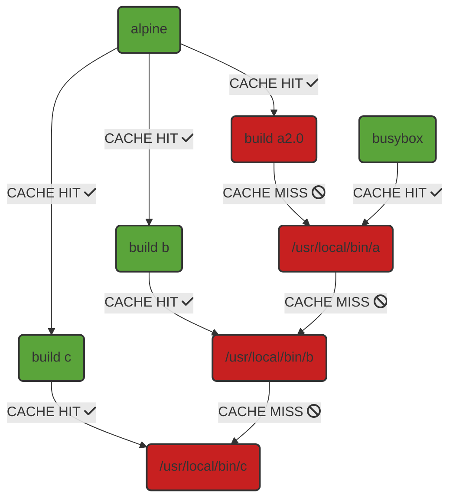
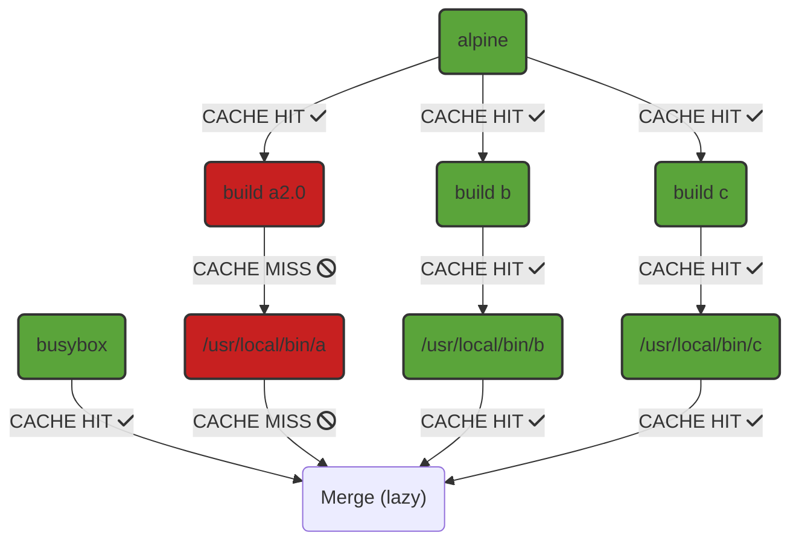

# Merge and Diff Ops

MergeOp and DiffOp are two interrelated LLB operations that enable the rebasing
of LLB results onto other results and the separation of LLB results from their
base, respectively. Underneath the hood, these ops enable fine grain
manipulation of container layer chains that can result in highly efficient
operations for many use cases.

This doc assumes some familiarity with LLB and ops like ExecOp and FileOp. More
background on LLB can be obtained from the README.md in Buildkit's git
repository. This doc also uses the Go LLB client for examples, though MergeOp
and DiffOp are not in any way language specific.

## MergeOp

MergeOp has a very simple interface:

```go
func Merge(inputs []llb.State) llb.State
```

The intuition is that it merges the contents of the provided states together
into one state (hence the name), with files from later states taking precedence
over those from earlier ones.

To be more concrete, MergeOp returns a state where each of the input states are
rebased on top of each other in the order provided. "Rebasing" a state `B` onto
another state `A` creates a state that:

- Has all the contents of `B`
- Has all the contents of `A` except when a path exists in both `B` and `A`. In this case:
  - If both paths are directories, their contents are merged. Metadata (such
    as permissions) on the directory from `B` take precedence.
  - If one of the paths is not a directory, whatever is present in `B` takes
    precedence. This also means that if a file in `B` overwrites a dir in `A`,
    then all files/dirs in the tree under at that path in `A` are also
    removed.

MergeOp is associative, i.e. using shorthand notation: `Merge(A, B, C) ==
Merge(Merge(A, B), C) == Merge(A, Merge(B, C))`. Buildkit knows this and
internally optimizes LLB merges that are equivalent in this way to re-use the
same cache entries.

There are more subtleties to the behavior of MergeOp, such as when deletions
are present in a layer making up a state, discussed in the "Advanced Details"
section of this doc.

States created by MergeOp are the same as any other LLB states in that they can
be used as the base for exec, be mounted to arbitrary paths in execs, be
plugged into other merges and diffs, be exported, etc.

As a very simple example:

```go
// a has /dir/a
a := llb.Scratch().
  File(llb.Mkdir("/dir", 0755)).
  File(llb.Mkfile("/dir/a", 0644, []byte("a")))

// b has /dir/b and /otherdir
b := llb.Scratch().
  File(llb.Mkdir("/dir", 0755)).
  File(llb.Mkfile("/dir/b", 0644, []byte("b"))).
  File(llb.Mkdir("/otherdir", 0755))

// c has /dir/a and /dir/c
c := llb.Scratch().
  File(llb.Mkdir("/dir", 0700)).
  File(llb.Mkfile("/dir/a", 0644, []byte("overwritten"))).
  File(llb.Mkfile("/dir/c", 0644, []byte("c")))

// merged will consist of /dir/a, /dir/b, /dir/c and /otherdir.
// The file at /dir/a will have contents set to "overwritten" because c is merged after a.
// /dir will have permissions set to 0700 for the same reason.
merged := llb.Merge([]llb.State{a, b, c})

// merged can be used as the base for new states
mergedPlusMore := merged.File(llb.Mkdir("/yetanotherdir", 0755))
// or as the input to other merges
mergedPlusMore = llb.Merge([]llb.State{merged, llb.Scratch().File(llb.Mkdir("/yetanotherdir", 0755))})
```

### MergeOp Container Image Export

When the result of a MergeOp is exported as a container image, the image will
consist of the layers making up each input joined together in the order of the
MergeOp. If Buildkit has cached any one of these layers already, they will not
need to be re-exported (i.e. re-packaged into compressed tarballs).
Additionally, if the image is being pushed to a registry and the registry
indicates it already has any of the layers, then Buildkit can skip pushing
those layers entirely.

Layers joined together by MergeOp do not have dependencies on each other, so a
cache invalidation of the layers of one input doesn't cascade to the layers of
the other inputs.

## DiffOp

DiffOp also has a very simple interface:

```go
func Diff(lower llb.State, upper llb.State) llb.State
```

The intuition is that it returns a state whose contents are the difference
between `lower` and `upper`. It can be viewed as something like the inverse of
MergeOp; whereas MergeOp "adds" states together, DiffOp "subtracts" `lower`
from `upper` (in a manner of speaking).

More specifically, DiffOp returns a state that has the contents present in
`upper` that either aren't present in `lower` or have changed from `lower` to
`upper`. Another way of thinking about it is that if you start at `A` and apply
`Diff(A, B)`, you will end up at `B`. Or, even more succinctly, `Merge(A,
Diff(A, B)) == B`.

Files and dirs are considered to have changed between `lower` and `upper` if
their contents are unequal or if metadata like permissions and `mtime` have
changed. Unequal `atime` or `ctime` values are not considered to be a change.

There are more subtleties to the behavior of DiffOp discussed in the "Advanced
Details" section of this doc.

States created by DiffOp are the same as any other LLB states in that they can
be used as the base for exec, be mounted to arbitrary paths in execs, be
plugged into merges and other diffs, be exported, etc.

As a very simple example:

```go
base := llb.Image("alpine")
basePlusBuilt := base.Run(llb.Shlex("touch /foo")).Root()
// diffed consists of just the file /foo, nothing in the alpine image is present
diffed := llb.Diff(base, basePlusBuilt)
```

### DiffOp Container Image Export

When the result of a DiffOp is exported as a container image, layers will be
re-used as much as possible. To explain, consider this case:

```go
lower := llb.Image("alpine")
middle := lower.Run(llb.Shlex("touch /foo")).Root()
upper := middle.Run(llb.Shlex("touch /bar")).Root()
diff := llb.Diff(lower, upper)
```

In this case, there is a "known chain" from `lower` to `upper` because `lower`
is a state in `upper`'s history. This means that when the DiffOp is exported as
a container image, it can just consist of the container layers for `middle`
joined with the container layers for `upper`.

Another way of thinking about this is that when `lower` is a state in `upper`'s
history, the diff between the two is equivalent to a merge of the states
between them. So, using the example above:

```go
llb.Diff(lower, upper) == llb.Merge([]llb.State{
  llb.Diff(lower, middle), 
  llb.Diff(middle, upper),
})
```

This behavior extends to arbitrary numbers of states separating `lower` and `upper`.

In the case where there is not a chain between `lower` and `upper` that
Buildkit can determine, DiffOp still works consistently but, when exported,
will always result in a single layer that is not re-used from its inputs.

## Example Use Case: Better "Copy Chains" with MergeOp

### The Problem

A common pattern when building container images is to independently assemble
components of the image and then combine those components together into a final
image using a chain of Copy FileOps. For example, when using the Dockerfile
frontend, this is the multi-stage build pattern and a chain of `COPY
--from=...` statements.

One issue with this type of pattern is that if any of the inputs to the copy
chain change, that doesn't just invalidate Buildkit's cache for that input, it
also invalidates Buildkit's cache for any copied layers after that one.

To be a bit more concrete, consider the following LLB as specified with the Go client:

```go
// stage a
a := llb.Image("alpine").Run("build a").Root()
// stage b
b := llb.Image("alpine").Run("build b").Root()
// stage c
c := llb.Image("alpine").Run("build c").Root()

// final combined stage
combined := llb.Image("alpine").
  File(llb.Copy(a, "/bin/a", "/usr/local/bin/a")).
  File(llb.Copy(b, "/bin/b", "/usr/local/bin/b")).
  File(llb.Copy(c, "/bin/c", "/usr/local/bin/c"))
```

Note that this is basically the equivalent of the following Dockerfile:

```dockerfile
FROM alpine as a
RUN build a

FROM alpine as b
RUN build b

FROM alpine as c
RUN build c

FROM alpine as combined
COPY --from=a /bin/a /usr/local/bin/a
COPY --from=b /bin/b /usr/local/bin/b
COPY --from=c /bin/c /usr/local/bin/c
```

Now, say you do a build of this LLB and export the `combined` stage as a
container image to a registry. If you were to then repeat the same build with
the same instance of Buildkit, each part of the build should be cached,
resulting in no work needing to be done and no layers needing to be exported or
pushed to the registry.

Then, say you later do the build again but this time with a change to `a`. The
build for `a` is thus not cached, which means that the copy of `/bin/a` into
`/usr/local/bin/a` of `combined` is also not cached and has to be re-run. The
problem is that because each copy in to `combined` is chained together, the
invalidation of the copy from `a` also cascades to its descendants, namely the
copies from `b` and `c`. This is despite the fact that `b` and `c` are
independent of `a` and thus don't need to be invalidated. In graphical form:



As a result, not only do the copies from `b` and `c` to create
`/usr/local/bin/b` and `/usr/local/bin/c` need to run again, they also result
in new layers needing to be exported and then pushed to a registry. For many
use cases, this becomes a significant source of overhead in terms of build
times and the amount of data that needs to be stored and transferred.

### The Solution

MergeOp can be used to fix the problem of cascading invalidation in copy chains:

```go
a := llb.Scratch().File(llb.Copy(llb.Image("alpine").Run("build a").Root(), "/bin/a", "/usr/local/bin/a"))
b := llb.Scratch().File(llb.Copy(llb.Image("alpine").Run("build b").Root(), "/bin/b", "/usr/local/bin/b"))
c := llb.Scratch().File(llb.Copy(llb.Image("alpine").Run("build c").Root(), "/bin/c", "/usr/local/bin/c"))
combined := llb.Merge([]llb.State{
  llb.Image("busybox"),
  a,
  b,
  c,
})
```

(*Note that newer versions of Dockerfiles support a `--link` flag when using
`COPY`, which results in basically this same pattern*)

Two changes have been made from the previous version:

1. `a`, `b`, and `c` have been updated to copy their desired contents to
   `Scratch` (a new, empty state).
1. `combined` is defined as a MergeOp of the states desired in the final image.

Say you're doing this build for the first time. The build will first create
states `a`, `b`, and `c`, resulting in each being a single layer consisting
only of contents `/usr/local/bin/a`, `/usr/local/bin/b`, and `/usr/local/bin/c`
respectively. Then, the MergeOp rebases each of those states on to the base
`busybox` image. As discussed earlier, the container image export of a MergeOp
will consist of the layers of the merge inputs joined together, so the final
image looks mostly the same as before.

The benefits of MergeOp become apparent when considering what happens if the
build of `a` is modified. Whereas before this led to invalidation of the copy
of `b` and `c`, now those merge inputs are completely unaffected; no new cache
entries or new container layers need to be created for them. So, the end result
is that the only work Buildkit does when `a` changes is re-build `a` and then
push the new layers for `/usr/local/bin/a` (plus a new image manifest).
`/usr/local/bin/b` and `/usr/local/bin/c` do not need to be re-exported and do
not need to be re-pushed to the registry. In graphical form:



An important aspect of this behavior is that MergeOp is implemented lazily,
which means that its on-disk filesystem representation is only created locally
when strictly required. This means that even though a change to `a` invalidates
the MergeOp as a whole, no work needs to be done to create the merged state
on-disk when it's only being exported as a container image. This laziness
behavior is discussed more in the "Performance Considerations" section of the
doc.

You can see a working-code example of this by comparing `examples/buildkit3`
with `examples/buildkit4` in the Buildkit git repo.

## Example Use Case: Remote-only Image Append with MergeOp

If you have some layers already pushed to a remote registry, MergeOp allows you
to create new images that combine those layers in arbitrary ways without having
to actually pull any layers down first. For example:

```go
foo := llb.Image("fooApp:v0.1")
bar := llb.Image("barApp:v0.3")
qaz := llb.Image("qazApp:v1.2")
merged := llb.Merge([]llb.State{foo, bar, qaz})
```

If `merged` is being exported to the same registry that already has the layers
for `fooApp`, `barApp` and `qazApp`, then the only thing Buildkit does during
the export is create an image manifest (just some metadata) and push it to the
registry. No layers need to be pushed (they are already there) and they don't
even need to be pulled locally to Buildkit either.

Note that if you were to instead do this:

```go
merged := llb.Merge([]llb.State{foo, bar, qaz}).Run(llb.Shlex("extra command")).Root()
```

Then `fooApp`, `barApp` and `qazApp` will need to be pulled, though they will
usually be merged together more efficiently than the naive solution of just
unpacking the layers on top of each other. See the "Performance Details"
section for more info.

Additionally, if you export your Buildkit cache to a registry, this same idea
can be extended to any LLB types, not just `llb.Image`. So, using the same
example as the previous use case:

```go
a := llb.Scratch().File(llb.Copy(llb.Image("alpine").Run("build a").Root(), "/bin/a", "/usr/bin/a"))
b := llb.Scratch().File(llb.Copy(llb.Image("alpine").Run("build b").Root(), "/bin/b", "/usr/bin/b"))
c := llb.Scratch().File(llb.Copy(llb.Image("alpine").Run("build c").Root(), "/bin/c", "/usr/bin/c"))
combined := llb.Merge([]llb.State{
  llb.Image("alpine"),
  a,
  b,
  c,
})
```

If you do a build that includes a remote cache export to a registry, then any
Buildkit worker importing that cache can run builds that do different merges of
those layers without having to pull anything down. For instance, if a separate
Buildkit worker imported that remote cache and then built this:

```go
combined2 := llb.Merge([]llb.State{
  c,
  a
})
```

An export of `combined2` would not need to pull any layers down because it's
just a merge of `c` and `a`, which already have layers in the registry thanks
to the remote cache. This works because a remote cache import is actually just
a metadata download; layers are only pulled locally once needed and they aren't
needed for this MergeOp.

## Example Use Case: Modeling Package Builds with MergeOp+DiffOp

Merge and Diff have many potential use cases, but one primary one is to assist
higher level tooling that's using LLB to model "dependency-based builds", such
as what's found in many package managers and other build systems.

More specifically, the following is a common pattern used to model the build of a "package" (or equivalent concept) in such systems:

1. The build-time dependencies of the package are combined into a filesystem.
   The dependencies are themselves just already-built packages.
1. A build is run by executing some commands that have access to the combined
   dependencies, producing new build artifacts that are somehow isolated from
   the dependencies. These isolated build artifacts become the new package's
   contents.
1. The new package can then be used as a dependency of other packages and/or
   served directly to end users, while being careful to ensure that any runtime
   dependencies are also present when the package needs to be utilized.

One way to adapt the above model to LLB might be like this:

```go
// "Packages" are just LLB states. Build-time dependencies are combined 
// together into a filesystem using MergeOp.
runtimeDeps := llb.Merge([]llb.State{depC, depD})
buildDeps := llb.Merge([]llb.State{src, depA, depB, runtimeDeps})

// Builds of a new package are ExecOps on top of the MergeOp from the previous step 
// (one ExecOp for the build and one for the install). The install ExecOp is defined 
// such that build artifacts are written to a dedicated Mount, isolating them from 
// the dependencies under /output.
builtPackage := buildDeps.Run(
  llb.Dir("/src"),
  llb.Shlex("make"),
).Root().Run(
  llb.Dir("/src"),
  llb.Shlex("make install"),
  llb.AddEnv("DESTDIR", "/output"),
  llb.AddMount("/output", llb.Scratch()),
).GetMount("/output")

// If the package needs to be run as part of a different build or by an 
// end user, the runtime deps of the state can be included via a MergeOp.
llb.Merge([]llb.State{runtimeDeps, builtPackage})
```

While the above is a bit of an over-simplification (it, for instance, ignores
the need to topologically sort dependency DAGs before merging them together),
the important point is that it only needs MergeOp and ExecOp; DiffOp is left
out entirely. For many use cases, this is completely fine and DiffOp is not
needed.

Some use cases can run into issues though, specifically with the part where
build artifacts need to be isolated from their dependencies. The above example
uses the convention of setting `DESTDIR`, an environment variable that
specifies a directory that `make install` should place artifacts under. Most
build systems support either `DESTDIR` or some type of equivalent mechanism for
isolating installed build artifacts. However, there are times when this
convention is either not available or not desired, in which case DiffOp can
come to the rescue as a generic, tool-agnostic way of separating states out
from their original dependency base. The modification from the previous example
is quite small:

```go
// Same `make` command as before
buildBase := buildDeps.Run(
  llb.Dir("/src"),
  llb.Shlex("make"),
).Root()

// Now, `make install` doesn't use DESTDIR and just installs directly 
// to the rootfs of the build. The package contents are instead isolated 
// by diffing the rootfs from before and after the install command.
builtPackage := llb.Diff(buildBase, buildBase.Run(
  llb.Dir("/src"),
  llb.Shlex("make install"),
).Root())
```

This approach using DiffOp should achieve the same end result as the previous
version but without having to rely on `DESTDIR` support being present in the
`make install` step.

The fact that DiffOp is more generic and arguably simpler than setting
`DESTDIR` or equivalents doesn't mean it's strictly better for every case. The
following should be kept in mind when dealing with use cases where both
approaches are viable:

1. The version that uses `DESTDIR` will likely have *slightly* better
   performance than the version using DiffOp for many use cases. This is because
   it's faster for Buildkit to merge in a state that is just a single layer on top
   of scratch (i.e. the first version of `builtPackage` that used `DESTDIR`) than
   it is to merge in a state whose diff is between two non-empty states (i.e. the
   DiffOp version). Whether the performance difference actually matters needs to
   be evaluated on a case-by-case basis.
1. DiffOp has some subtle behavior discussed in the "Advanced Details" section
   that, while irrelevant to most use cases, can occasionally distinguish it from
   the `DESTDIR` approach.

## Performance Considerations

### Laziness

MergeOp and DiffOp are both implemented lazily in that their on-disk filesystem
representations will only be created when absolutely necessary.

The most common situation in which a Merge/Diff result will need to be
"unlazied" (created on disk) is when it is used as the input to an Exec or File
op. For example:

```go
rootfs := llb.Merge([]llb.State{A, B})
extraLayer := rootfs.Run(llb.Shlex("some command")).Root()
```

In this case, if `extraLayer` is not already cached, `extraLayer` will need
`rootfs` to exist on disk in order to run, so `rootfs` will have to be
unlazied. The same idea applies if `extraLayer` was defined as a FileOp or if
`rootfs` was defined using a `DiffOp`.

What's perhaps more interesting are cases in which merge/diff results *don't*
need to be unlazied. One such situation is when they are exported as a
container image. As discussed previously, layers from the inputs of merge/diff
are re-used as much as possible during image exports, so that means that the
final merged/diffed result is not needed, only the inputs.

Another situation that doesn't require unlazying is when a merge/diff is used
as an input to another merge/diff. For example:

```go
diff1 := llb.Diff(A, B)
diff2 := llb.Diff(C, D)
merge := llb.Merge([]llb.State{diff1, diff2})
```

In this case, even though `diff1` and `diff2` are used as an input to `merge`, they do not need to be unlazied because `merge` is also lazy. If `A`, `B`, `C` or `D` are lazy LLB states, they also do not need to be unlazied. Laziness is transitive in this respect.

### Snapshotter-dependent Optimizations

There are some optimizations in the implementation of Merge and Diff op that
are relevant to users concerned with scaling large builds involving many
different merges and/or diffs. These optimizations are ultimately
implementation details though and don't have any impact on the actual contents
of merge/diff results.

When a merge or diff result needs to be unlazied, the "universal" fallback
implementation that works for all snapshotter backends is to create them by
copying files from the inputs as needed into a new filesystem. This works but
it can become costly in terms of disk space and CPU time at a certain scale.

However, for two of the default snapshotters (overlay and native), there is an
optimization in place to avoid copying files and instead hardlink them from the
inputs into the merged/diffed filesystem. This is at least as fast as copying
the files and often significantly faster for inputs with large file sizes.

## Advanced Details

These details are not expected to impact many use cases, but are worth
reviewing if you are experiencing surprising behavior while using Merge and
Diff op or otherwise want to understand them at a deeper level.

### Layer-like Behavior of Merge and Diff

One important principal of LLB results is that when they are exported as
container images, an external runtime besides Buildkit that pulls and unpacks
the image must see the same filesystem that is seen during build time.

That may seem a bit obvious, but it has important implications for Merge and
Diff, which are ops that are designed to re-use container layers from their
inputs as much as possible in order to maximize cache re-use and efficiency.
Many of the more surprising aspects of the behavior discussed in the rest of
this doc are a result of needing to ensure that Merge+Diff results look the
same before and after export as container layers.

### Deletions

When either 1) an LLB state deletes a file present in its parent chain or 2)
`upper` lacks a path that is present in `lower` while using DiffOp, that
deletion is considered an "entity" in the same way that a directory or file is
and can have an effect when using that state as a merge input. For example:

```go
// create a state that only has /foo
foo := llb.Scratch().File(llb.Mkfile("/foo", 0644, nil))

// create a state where the file /foo has been removed, leaving nothing
rmFoo := foo.File(llb.Rm("/foo"))

// create a state containing the file /bar on top of the previous "empty" state
bar := rmFoo.File(llb.Mkfile("/bar", 0644, nil))

merged := llb.Merge([]llb.State{foo, bar})
```

You might assume that `merged` would consist of the files `/foo` and `/bar`,
but it will actually just consist of `/bar`. This is because the state `bar`
also includes a deletion of the file `/foo` in its chain and thus a part of its
definition.

One way of understanding this is that when you merge `foo` and `bar`, you are
actually merging the diffs making up each state in the chain that created `foo`
and `bar`, i.e.:

```go
llb.Merge([]llb.State{foo, bar}) == llb.Merge([]llb.State{
  // foo's chain (only 1 layer)
  llb.Diff(llb.Scratch(), foo), // create /foo
  // bar's chain (3 layers)
  llb.Diff(llb.Scratch(), foo), // create /foo
  llb.Diff(foo, rmFoo), // delete /foo
  llb.Diff(rmFoo, bar), // create /bar
})
```

As you can see, `Diff(foo, rmFoo)` is included there and its only "content" is
a deletion of `/foo`. Therefore, when `merged` is being constructed, it will
apply that deletion and `/foo` will not exist in the final `merged` result.

Also note that if the order of the merge was reversed to be `Merge([]State{bar,
foo})`, then `/foo` will actually exist in `merged` alongside `/bar` because
then the contents of `foo` take precedent over the contents of `bar`, and then
create of `/foo` therefore "overwrites" the previous deletion of it.

One final detail to note is that even though deletions are entities in the same
way files/dirs are, they do not show up when mounted. For example, if you were
to mount `llb.Diff(foo, rmFoo)` during a build, you would just see an empty
directory. Deletions only have an impact when used as an input to MergeOp.

#### Workarounds

For use cases that are experiencing this behavior and do not want it, the best
option is to find a way to avoid including the problematic deletion in your
build definition. This can be very use-case specific, but using the previous
example one option might be this:

```go
justBar := llb.Diff(rmFoo, bar)
merged := llb.Merge([]llb.State{foo, justBar})
```

Now, `merged` consists of both `/foo` and `/bar` because `justBar` has "diffed
out" its parent `rmFoo` and consists only of the final layer that creates
`/bar`. Other use cases may require different approaches like changing build
commands to avoid unneeded deletions of files and directories.

For use cases that can't avoid the deletion for whatever reason, the fallback
option is to use a Copy op to squash the merge input and discard any deletions.
So, building off the previous example:

```go
squashedBar := llb.Scratch().File(llb.Copy(bar, "/", "/"))
merged := llb.Merge([]llb.State{foo, squashedBar})
```

This results in `merged` consisting of both `/foo` and `/bar`. This is because
`squashedBar` is a single layer that only consists of the file+directories that
existed in `bar`, not any of its deletions.

Note that there are currently performance tradeoffs to this copy approach in
that it will actually result in a copy on disk (i.e. no hardlink
optimizations), the copy will not be lazy and `squashedBar` will be a distinct
layer from its inputs as far as the Buildkit cache and any remote registries
are concerned, which may or may not matter depending on the use-case.

### Diff Corner Cases

There are some cases where it's ambiguous what the right behavior should be
when merging diffs together. As stated before, Merge+Diff resolve these
ambiguities by following the same behavior as container image import/export
implementations in order to maintain consistency.

One example:

```go
dir := llb.Scratch().File(llb.Mkdir("/dir", 0755))
dirFoo := dir.File(llb.Mkfile("/dir/foo", 0755, nil))
// rmFoo consists of a delete of /dir/foo
rmFoo := llb.Diff(dirFoo, dirFoo.File(llb.Rm("/dir/foo")))

// otherdir just consists of /otherdir
otherdir := llb.Scratch().File(llb.Mkdir("/otherdir", 0755))

// merged consists of /otherdir and /dir (no /dir/foo though)
merged := llb.Merge([]llb.State{otherdir, rmFoo})
```

In this case, you start with just `/otherdir` and apply `rmFoo`, which is a
deletion of `/dir/foo`. But `/dir/foo` doesn't exist, so it may be reasonable
to expect that it just has no effect. However, image import/export code will
actually create `/dir` even though it only exists in order to hold an
inapplicable delete. As a result, Merge+Diff also have this same behavior.
