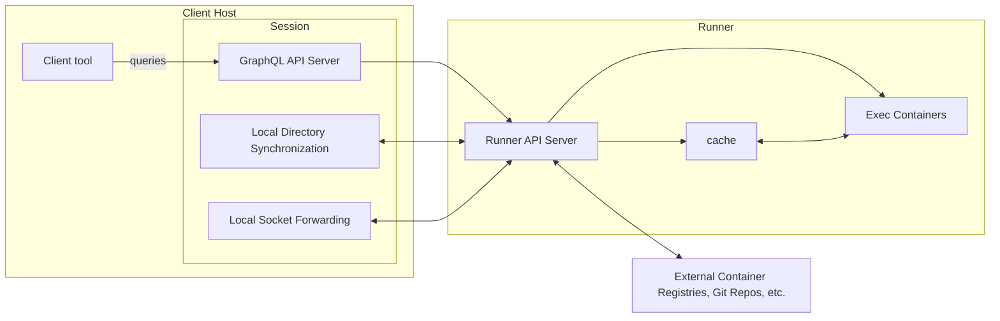
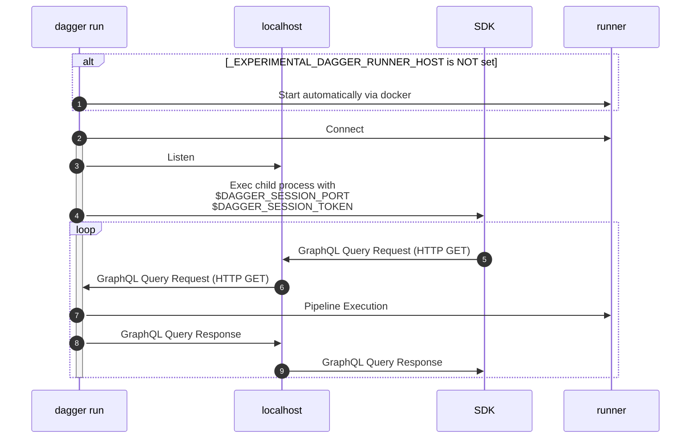
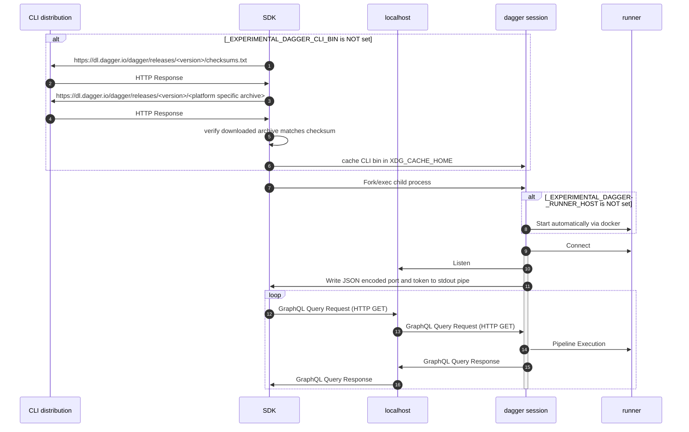

# Dagger operator manual

## Architecture

There are 3 major parts to the Dagger architecture:

### Client tool

This is the code (usually a custom command-line tool or script) making calls to the Dagger API. It typically uses one of the official Dagger SDKs, but in general could use any GraphQL client.

The default path of an official SDK is to automatically download+cache a CLI binary, which will itself automatically start up a runner via `docker`. However, there are experimental ways of using pre-installed CLI binaries and custom provisioned runners, which are detailed more in subsequent sections.

### Session

A session is served by a `dagger` CLI subcommand:

1. If you use an SDK, by default it will use an automatically downloaded CLI binary and invoke a different subcommand to start a session for the duration of the `dagger.Connect` call.
1. If you wrap execution of the client tool with `dagger run`, a session will be setup that lasts for the duration of that command. This overrides the default behavior of official SDKs.

A session is responsible for:

- Serving the GraphQL API to clients
  - Currently this is just the core API. Extensions will make it, as the name suggests, extensible.
- The synchronization of local directories into pipeline containers
  - The state of a local directory will be frozen on first use for the duration of a session
- The proxying of local sockets to exec containers
- Managing secrets available to pipelines in the session
- Managing the resolution of unpinned sources to specific versions
  - E.g. the mapping of `image:latest` to a specific digest, mapping of a git branch to a specific commit, etc.
  - This mapping will happen once per-session on first use and be frozen for the rest of the session after

Sessions are expected to be run on the same host as the SDK client, and ideally with the same privileges and working directory; otherwise local resources like directories and sockets will differ from that which is local to the client.

### Runner

A runner is the "backend" of the Dagger engine where containers are actually executed.

Runners are responsible for:

- Executing containers specified by pipelines
- Pulling container images, git repos and other sources needed for pipeline execution
- Pushing container images to registries
- Managing the cache backing pipeline execution

The runner is distributed as a container image, making it easy to run on various container runtimes like Docker, Kubernetes, Podman, etc.

It's typically run persistently, as opposed to sessions which only last for the duration of `dagger run` or `dagger.Connect` in an SDK.

## FAQ

### What compatibility is there between SDK, CLI and Runner versions?

This is only needed if you are using a custom provisioned runner or a pre-installed CLI. If you are just using an SDK directly a CLI and runner will be provisioned automatically at compatible versions.

The CLI+Runner share a version number. SDKs have their own version number, but they are currently only guaranteed to be compatible with a single CLI+Runner version at a time.

To ensure that an SDK will be used with a compatible CLI and runner:

1. Check the release notes of the SDK, which will point to the required CLI+Runner version.
1. If using a custom provisioned runner, use the base image at that version as detailed in the [Dagger installation documentation](https://docs.dagger.io/install).
1. If using a pre-installed CLI, install the CLI at that version as detailed in the [Dagger installation documentation](https://docs.dagger.io/install).
1. Once the runner and/or CLI are setup, you are safe to upgrade your SDK to the newest version.

### Can I run the Dagger Engine as a "rootless" container?

Not at this time. "Rootless mode" means running the Dagger Engine as a container without the `--privileged` flag. In this case, the container would not run as the "root" user of the system. Currently, the Dagger Engine cannot be run as a rootless container; network and filesystem constraints related to rootless usage would currently significantly limit its capabilities and performance.

#### Filesystem constraints

The Dagger Engine relies on the `overlayfs` snapshotter for efficient construction of container filesystems. However, only relatively recent Linux kernel versions fully support `overlayfs` inside of rootless user namespaces. On older kernels, there are fallback options such as [`fuse-overlayfs`](https://github.com/containers/fuse-overlayfs), but they come with their own complications in terms of degraded performance and host-specific setup.

We've not yet invested in the significant work it would take to support+document running optimally on each kernel version, hence the limitation at this time.

#### Network constraints

Running the Dagger Engine in rootless mode constrains network management due to the fact that it's not possible for a rootless container to move a network device from the host network namespace to its own network namespace.

It is possible to use userspace TCP/IP implementations such as [slirp](https://github.com/rootless-containers/slirp4netns) as a workaround, but they often significantly decrease network performance. This [comparison table of network drivers](https://github.com/rootless-containers/rootlesskit/blob/master/docs/network.md#network-drivers) shows that `slirp` is at least five times slower than a root-privileged network driver.

Newer options for more performant userspace network stacks have arisen in recent years, but they are generally either reliant on relatively recent kernel versions or in a nascent stage that would require significant validation around robustness+security.

# Appendix

These sections have more technical and "under-the-hood" details.

## Dagger Session Interface (DSI)

When an SDK calls `dagger.Connect`, there are two possible paths.

### DSI Basic

This path requires that execution of the SDK code be wrapped with `dagger run`, e.g. `dagger run go run main.go` or `dagger run yarn build`.

(1-2) `dagger run` first checks to see if `_EXPERIMENTAL_DAGGER_RUNNER_HOST` is set. If not, the default path of provisioning a runner by shelling out to `docker` will kick in. Either way, a connection with the runner is established.

(3) `dagger run` listens on localhost on a random free port and generates a random uuid to use as a session token

- The session token is checked as an HTTP basic auth header to prevent others from connecting to the session over localhost

(4) `dagger run` then execs the specified child process (e.g. `go run` or `yarn build`) with the randomly selected port and session token provided as environment variables: `DAGGER_SESSION_PORT` and `DAGGER_SESSION_TOKEN`

(5-9) Any Dagger SDK can then send GraphQL HTTP requests to the localhost listener, including the session token as a basic auth header. This continues until the child process exits, at which time the session closes.

### DSI Advanced - Automatic Provisioning

This path is followed when SDK code is executed directly, not wrapped with `dagger run`. The differences from DSI basic are:

1. The SDK is responsible for starting its own session. This requires it invoke the CLI as a subprocess (whereas with `dagger run` the relationship is inversed)
1. The CLI does not necessarily need to be pre-installed, the SDK will download a CLI binary at a compatible version (unless `_EXPERIMENTAL_DAGGER_CLI_BIN` is set).

(1) The SDK first checks to see if `_EXPERIMENTAL_DAGGER_CLI_BIN` is set.

- If so, that'll be used as the CLI bin.
- If not, then the SDK will check `$XDG_CACHE_HOME` for the CLI binary of the expected version. The expected version is a hardcoded string in the SDK source code.

(2-5) If the CLI binary is not already cached, then checksums and the CLI archive will be downloaded.

(6-7) If the checksum matches, then the archive is unpacked and the CLI binary will be cached with a name matching its version.

(8) The SDK then execs the downloaded binary as a child process. It invokes a hidden subcommand, `dagger session`, which is only intended to be used by SDKs.

(9-10) `dagger session` checks to see if `_EXPERIMENTAL_DAGGER_RUNNER_HOST` is set. If not, the default path of provisioning a runner by shelling out to `docker` will kick in. A connection with the runner is established.

(11-12) `dagger session` listens on a random available port on localhost and generates a random uuid to use as a session token (same as described in the [previous section](#dsi-basic)). The port being listened on and the session token are serialized to JSON and then written to stdout, which is a pipe connected back to the SDK parent process.

(13-17) The SDK then sends GraphQL HTTP requests to the localhost listener, including the session token as a basic auth header.
