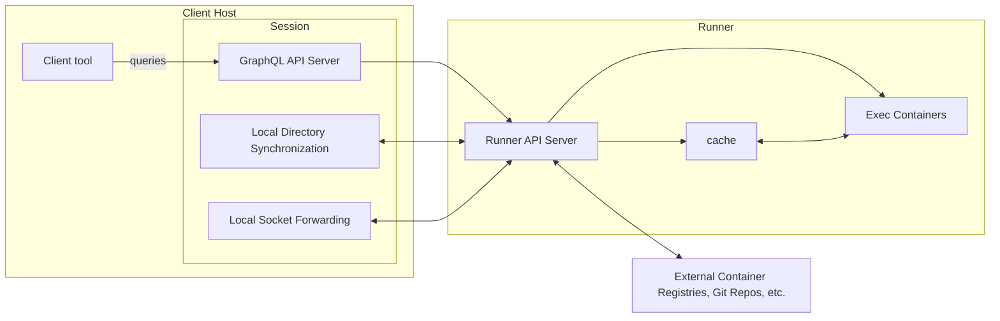
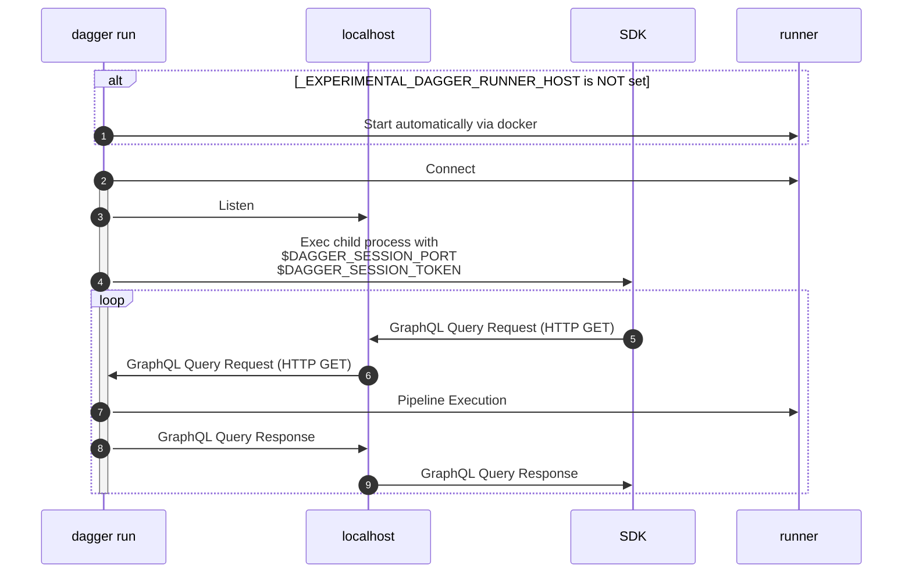
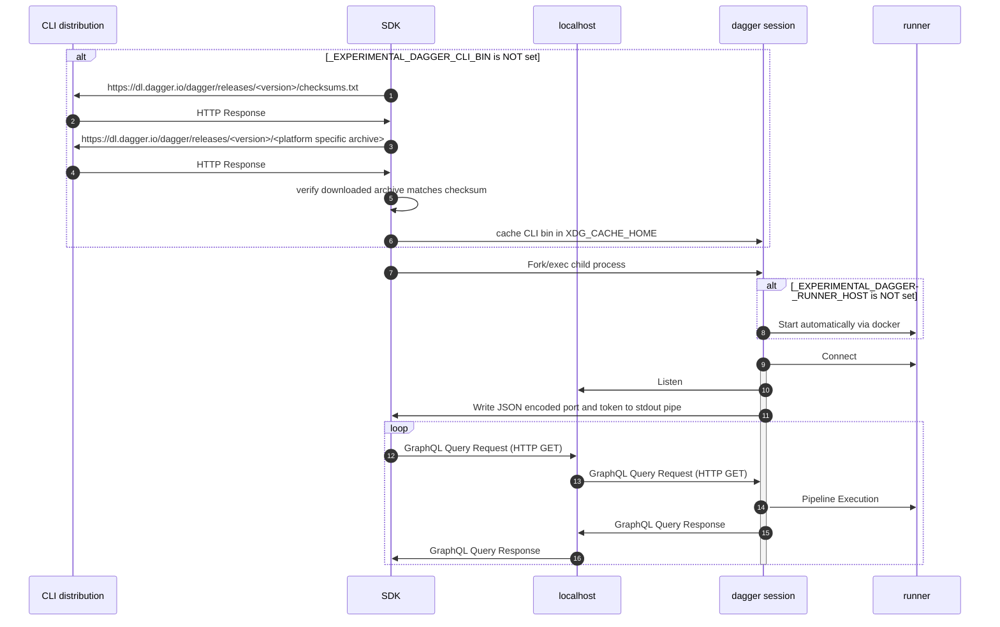

# Dagger operator manual

## Architecture

There are 3 major parts to the Dagger architecture:

### Client tool

This is the code (usually a custom command-line tool or script) making calls to the Dagger API. It typically uses one of the official Dagger SDKs, but in general could use any GraphQL client.

The default path of an official SDK is to automatically download+cache a CLI binary, which will itself automatically start up a runner via `docker`. However, there are experimental ways of using pre-installed CLI binaries and custom provisioned runners, which are detailed more in subsequent sections.

### Session

A session is served by a `dagger` CLI subcommand:

1. If you use an SDK, by default it will use an automatically downloaded CLI binary and invoke a different subcommand to start a session for the duration of the `dagger.Connect` call.
1. If you wrap execution of the client tool with `dagger run`, a session will be setup that lasts for the duration of that command. This overrides the default behavior of official SDKs.

A session is responsible for:

- Serving the GraphQL API to clients
  - Currently this is just the core API. Extensions will make it, as the name suggests, extensible.
- The synchronization of local directories into pipeline containers
  - The state of a local directory will be frozen on first use for the duration of a session
- The proxying of local sockets to exec containers
- Managing secrets available to pipelines in the session
- Managing the resolution of unpinned sources to specific versions
  - E.g. the mapping of `image:latest` to a specific digest, mapping of a git branch to a specific commit, etc.
  - This mapping will happen once per-session on first use and be frozen for the rest of the session after

Sessions are expected to be run on the same host as the SDK client, and ideally with the same privileges and working directory; otherwise local resources like directories and sockets will differ from that which is local to the client.

### Runner

A runner is the "backend" of the Dagger engine where containers are actually executed.

Runners are responsible for:

- Executing containers specified by pipelines
- Pulling container images, git repos and other sources needed for pipeline execution
- Pushing container images to registries
- Managing the cache backing pipeline execution

The runner is distributed as a container image, making it easy to run on various container runtimes like Docker, Kubernetes, Podman, etc.

It's typically run persistently, as opposed to sessions which only last for the duration of `dagger run` or `dagger.Connect` in an SDK.

## FAQ

### What are the steps for using a custom runner?

There are more [details](#runner-details) worth reviewing, but the consolidated steps are:

1. Determine the runner version required by checking the release notes of the SDK you intend to use.
1. If changes to the base image are needed, make those and push them somewhere. If no changes are needed, just use it as is.
1. Start the runner image in your target of choice, keeping the [requirements](#execution-requirements) and [configuration](#configuration) in mind.
1. Export the `_EXPERIMENTAL_DAGGER_RUNNER_HOST` environment variable with [a value pointing to your target](#connection-interface).
1. Call `dagger run` or execute SDK code directly with that environment variable set.

### What compatibility is there between SDK, CLI and Runner versions?

This is only needed if you are using a custom provisioned runner or a pre-installed CLI. If you are just using an SDK directly a CLI and runner will be provisioned automatically at compatible versions.

The CLI+Runner share a version number. SDKs have their own version number, but they are currently only guaranteed to be compatible with a single CLI+Runner version at a time.

To ensure that an SDK will be used with a compatible CLI and runner:

1. Check the release notes of the SDK, which will point to the required CLI+Runner version.
1. If using a custom provisioned runner, use the base image at that version as detailed in [Distribution and Versioning].
1. If using a pre-installed CLI, install the CLI at that version as detailed in [Versioning](#versioning).
1. Once the runner and/or CLI are setup, you are safe to upgrade your SDK to the newest version.

## Runner Details

### Distribution and Versioning

The runner is distributed as a container image at `registry.dagger.io/engine`.

- Tags are made for the version of each release.
- For example, the [`v0.3.7` release](https://github.com/dagger/dagger/releases/tag/v0.3.7) has a corresponding image at `registry.dagger.io/engine:v0.3.7`

### Execution Requirements

1. The runner container currently needs root capabilities, including among others `CAP_SYS_ADMIN`, in order to execute pipelines.
   - For example, this will be granted when using the `--privileged` flag of `docker run`.
   - There is an issue for [supporting rootless execution](https://github.com/dagger/dagger/issues/1287).
1. The runner container should be given a volume at `/var/lib/dagger`.
   - Otherwise runner execution may be extremely slow. This is due to the fact that it relies on overlayfs mounts for efficient operation, which isn't possible when `/var/lib/dagger` is itself an overlayfs.
   - For example, this can be provided to a `docker run` command as `-v dagger-engine:/var/lib/dagger`
1. The container image comes with a default entrypoint which should be used to start the runner, no extra args are needed.

### Configuration

Right now very few configuration knobs are suppported as we are still working out the best interface for exposing them.

Currently supported is:

1. Custom CA Certs - If you need any extra CA certs to be included in order to, e.g. push images to a private registry, they can be included under `/etc/ssl/certs` in the runner image.
   - This can be accomplished by building a custom engine image using ours as a base or by mounting them into a container created from our image at runtime.

> **Warning**
> The entrypoint currently invokes `buildkitd`, so there are numerous flags available there in addition to buildkit configuration files. However, this is just an implementation detail and it's highly likely the entrypoint may end up pointing to a different wrapper around `buildkitd` with a different interface in the near future, so any reliance on extra entrypoint flags or configuration files should be considered subject to breakage at any time.

### Connection Interface

After the runner starts up, the CLI needs to connect to it. In the default path, this will all happen automatically.

However if the `_EXPERIMENTAL_DAGGER_RUNNER_HOST` env var is set, then the CLI will instead connect to the endpoint specified there. It currently accepts values in the following format:

1. `docker-container://<container name>` - Connect to the runner inside the given docker container.
   - Requires the docker CLI be present and usable. Will result in shelling out to `docker exec`.
1. `podman-container://<container name>` - Connect to the runner inside the given podman container.
1. `kube-pod://<podname>?context=<context>&namespace=<namespace>&container=<container>` - Connect to the runner inside the given k8s pod. Query strings params like context and namespace are optional.
1. `unix://<path to unix socket>` - Connect to the runner over the provided unix socket.
1. `tcp://<addr:port>` - Connect to the runner over tcp to the provided addr+port. No encryption will be setup.

> **Warning**
> Dagger itself does not setup any encryption of data sent on this wire, so it relies on the underlying connection type to implement this when needed. If you are using a connection type that does not layer encryption then all queries and responses will be sent in plaintext over the wire from the CLI to the Runner.

## CLI Details

### Versioning

The CLI is released in tandem with the runner and thus shares a version number with it.

As of right now, each CLI version is expected to be used only with a runner image at the corresponding version. Backwards/forwards compatibility is not guaranteed yet.

Instructions on installing the CLI, including at a particular version, can be found in [our docs](https://docs.dagger.io/cli/465058/install).

# Appendix

These sections have more technical and "under-the-hood" details.

## Dagger Session Interface (DSI)

When an SDK calls `dagger.Connect`, there are two possible paths.

### DSI Basic

This path requires that execution of the SDK code be wrapped with `dagger run`, e.g. `dagger run go run main.go` or `dagger run yarn build`.

(1-2) `dagger run` first checks to see if `_EXPERIMENTAL_DAGGER_RUNNER_HOST` is set. If not, the default path of provisioning a runner by shelling out to `docker` will kick in. Either way, a connection with the runner is established.

(3) `dagger run` listens on localhost on a random free port and generates a random uuid to use as a session token

- The session token is checked as an HTTP basic auth header to prevent others from connecting to the session over localhost

(4) `dagger run` then execs the specified child process (e.g. `go run` or `yarn build`) with the randomly selected port and session token provided as environment variables: `DAGGER_SESSION_PORT` and `DAGGER_SESSION_TOKEN`

(5-9) Any Dagger SDK can then send GraphQL HTTP requests to the localhost listener, including the session token as a basic auth header. This continues until the child process exits, at which time the session closes.

### DSI Advanced - Automatic Provisioning

This path is followed when SDK code is executed directly, not wrapped with `dagger run`. The differences from DSI basic are:

1. The SDK is responsible for starting its own session. This requires it invoke the CLI as a subprocess (whereas with `dagger run` the relationship is inversed)
1. The CLI does not necessarily need to be pre-installed, the SDK will download a CLI binary at a compatible version (unless `_EXPERIMENTAL_DAGGER_CLI_BIN` is set).

(1) The SDK first checks to see if `_EXPERIMENTAL_DAGGER_CLI_BIN` is set.

- If so, that'll be used as the CLI bin.
- If not, then the SDK will check `$XDG_CACHE_HOME` for the CLI binary of the expected version. The expected version is a hardcoded string in the SDK source code.

(2-5) If the CLI binary is not already cached, then checksums and the CLI archive will be downloaded.

(6-7) If the checksum matches, then the archive is unpacked and the CLI binary will be cached with a name matching its version.

(8) The SDK then execs the downloaded binary as a child process. It invokes a hidden subcommand, `dagger session`, which is only intended to be used by SDKs.

(9-10) `dagger session` checks to see if `_EXPERIMENTAL_DAGGER_RUNNER_HOST` is set. If not, the default path of provisioning a runner by shelling out to `docker` will kick in. A connection with the runner is established.

(11-12) `dagger session` listens on a random available port on localhost and generates a random uuid to use as a session token (same as described in the [previous section](#dsi-basic)). The port being listened on and the session token are serialized to JSON and then written to stdout, which is a pipe connected back to the SDK parent process.

(13-17) The SDK then sends GraphQL HTTP requests to the localhost listener, including the session token as a basic auth header.
