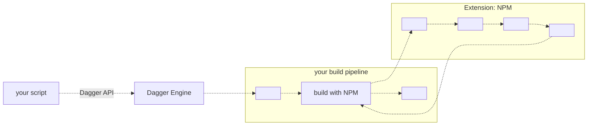

# Dagger Extensions

Pipelines can be shared and reused using Dagger *extensions*.

An extension is a collection of pipelines which can be imported into any Dagger project, and used to compose larger pipelines in the usual manner.

Extensions may themselves import other extensions.

[Learn more about writing extensions](../guides/bnzm7-extensions.md)
