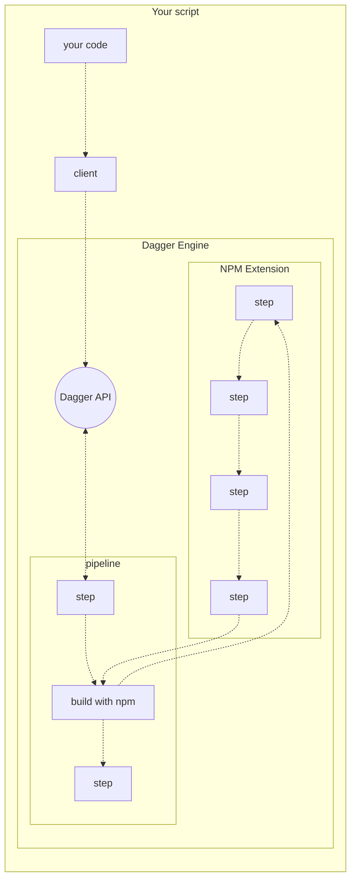

# Dagger Extensions

Developers can extend the capabilities of Dagger with extensions.

Extensions can define custom steps, which developers can then incorporate into their pipelines. Of course, these custom steps may themselves be powered by Dagger pipelines, creating endless possibilities for component reuse and composition.

Extensions are fully sandboxed, so they can be safely shared and reused between projects.

[Learn more about writing extensions](../guides/bnzm7-writing_extensions.md)