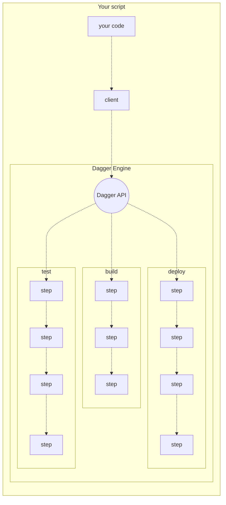

# Dagger API

The Dagger API is a GraphQL API for composing and running powerful pipelines with minimal effort. By relying on the Dagger API to do the heavy lifting, you can write a small script that orchestrates a complex workflow, knowing that it will run in a secure and scalable way out of the box, and can easily be changed later as needed.

