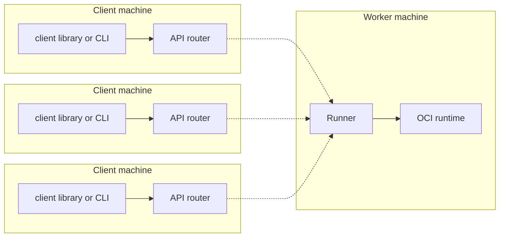

# FAQ

### What language SDKs are available for Dagger?

We currently offer technical previews of a [Go SDK](/sdk/go) and a [Python SDK](/sdk/python) as well as a [CUE SDK](/sdk/cue). Waiting for your favorite language to be supported? [Let us know which one](https://blocklayer.typeform.com/to/a6m5gKSS), and we'll notify you when it's ready.

### How do I log in to a container registry using a Dagger SDK?

Dagger SDKs use your existing Docker credentials and do not require separate authentication. Simply execute `docker login` against your container registry on the host where your Dagger pipelines are running.

### What API query language does Dagger use?

Dagger uses GraphQL as its low-level language-agnostic API query language.

### Do I need to know GraphQL to use Dagger?

No. You only need to know one of Dagger's supported SDKs languages to use Dagger. The translation to underlying GraphQL  API calls  is handled internally by the Dagger SDK of your choice.

### There's no SDK for &lt;language&gt; yet. Can I still use Dagger?

Yes. It's possible to use the Dagger GraphQL API from any language that [supports GraphQL](https://graphql.org/code/) or from the [Dagger CLI](./cli/698277-index.md).

### I've upgraded to the latest Dagger CLI and my CUE plans no longer work. Why?

The Dagger CLI has changed. The previous CUE-specific version of the Dagger CLI has been renamed to `dagger-cue` and is now part of the [Dagger CUE SDK](./sdk/cue/).

### What is the Dagger Engine?

The Dagger Engine consists of two components: an API router and a runner.

* The router serves API queries and dispatches individual operations to the runner.
* The runner talks to an Open Container Inititaive (OCI) runtime to execute actual operations. This is basically a BuildKit daemon with some glue code.

Currently, both the router and the runner are executed on the client machine. In the near-term, we expect the runner to move to worker machines.

### How do Dagger SDKs interact with the Dagger Engine?

A Dagger SDK takes care of running both router and runner.

### I am stuck. How can I get help?

Join us on [Discord](https://discord.com/invite/dagger-io), and ask your question in our [help forum](https://discord.com/channels/707636530424053791/1030538312508776540). Our team will be happy to help you there!
