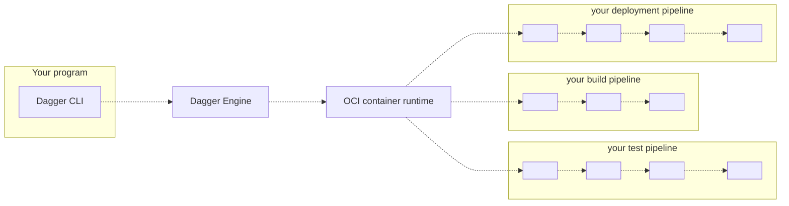

# Dagger CLI

Technical Preview

## What is the Dagger CLI?

The Dagger CLI contains everything you need to develop and run CI/CD pipelines from the command-line.

Currently the CLI consists of:

* A binary file
* This documentation

## Who is it for?

The Dagger CLI may be a good fit if you are...

*

The Dagger CLI may *not* be a good fit if you are...

* A developer who doesn't know shell scripting, and is not interested in learning it.
* Someone who loves writing YAML all day, thank you very much.
* A container skeptic: the less containers are involved, the happier you are.

## How does it work?

1. Using the Dagger CLI, your program (typically a shell script) opens a new session to a Dagger Engine: either by connecting to an existing engine, or by provisioning one on-the-fly.
2. Using the Dagger CLI, your program prepares API requests describing pipelines to run, then sends them to the engine. The wire protocol used to communicate with the engine is private and not yet documented, but this will change in the future. For now, the Dagger CLI is the only documented interface available to your program.
3. When the engine receives an API request, it computes a [Directed Acyclic Graph (DAG)](https://en.wikipedia.org/wiki/Directed_acyclic_graph) of low-level operations required to compute the result, and starts processing operations concurrently.
4. When all operations in the pipeline have been resolved, the engine sends the pipeline result back to your program.
5. Your program may use the pipeline's result as input to new pipelines.

## Get started

To learn more, [install the Dagger CLI](./465058-install.md) and [start using it](./389936-get-started.md).
