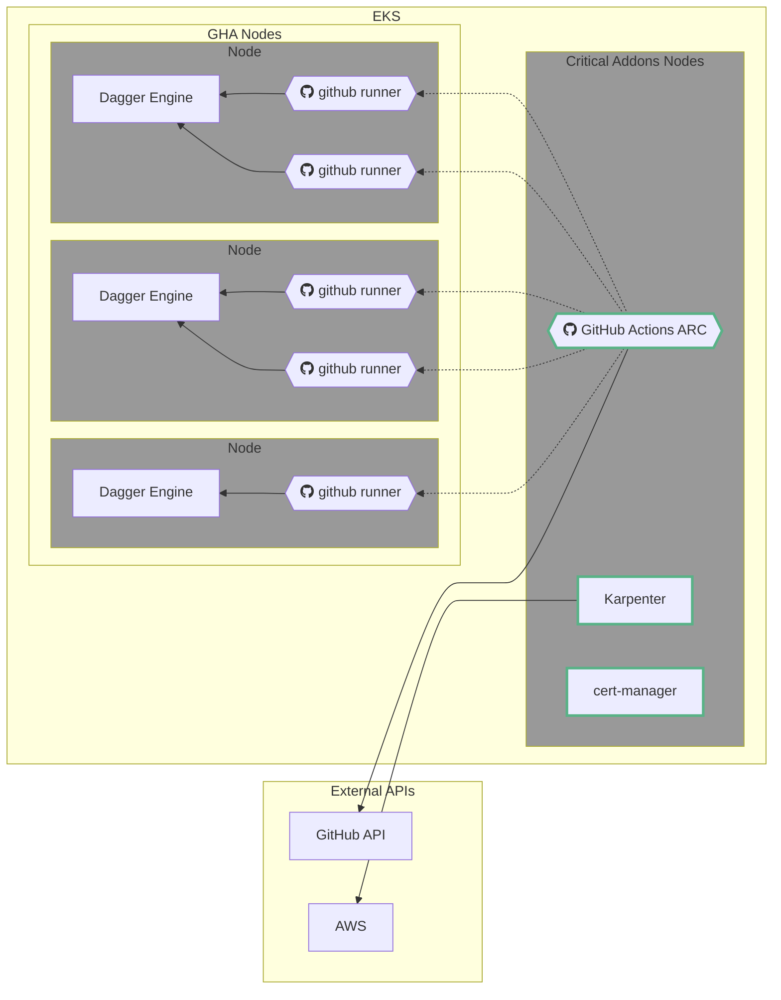

# Dagger on Kubernetes

```mermaid
graph RL
    classDef link stroke:#59b287,stroke-width:3px;  

    subgraph External APIs
        github[GitHub API]
        AWS
    end

    gha-arc --> github
    Karpenter --> AWS

    %% AWS -. create node .-> gha-node-1
    %% AWS -.-> gha-node-2
    %% AWS -.-> gha-node-3

    

    subgraph EKS
        gha-arc -.-> runner1
        gha-arc -.-> runner2.1
        gha-arc -.-> runner2.2
        gha-arc -.-> runner3.1
        gha-arc -.-> runner3.2
        %% gha-arc -.-> runner3.3
        %% gha-arc -.-> runner3.4
        %% gha-arc -.-> runner3.5
        

        subgraph crit-addons[Critical Addons Nodes]
            
            gha-arc{{ fab:fa-github GitHub Actions ARC }}:::link
            click gha-arc "https://github.com/actions/actions-runner-controller/"
            Karpenter:::link
            click Karpenter "https://karpenter.sh/"
            cert-manager:::link
            click cert-manager "https://cert-manager.io/"
        end
        style crit-addons fill:#999999;
        subgraph GHA Nodes
            direction BT
            style gha-node-1 fill:#999999;
            style gha-node-2 fill:#999999;
            style gha-node-3 fill:#999999;
            subgraph gha-node-1[Node]
                %% runner{{ fab:fa-github github runner }}
                runner1{{ fab:fa-github github runner }} --> dagger-engine[Dagger Engine]
            end
            subgraph gha-node-2[Node]
                runner2.1{{ fab:fa-github github runner }} --> dagger-engine2[Dagger Engine]
                runner2.2{{ fab:fa-github github runner }} --> dagger-engine2[Dagger Engine]
            end
            subgraph gha-node-3[Node]
                runner3.1{{ fab:fa-github github runner }} --> dagger-engine3[Dagger Engine]
                runner3.2{{ fab:fa-github github runner }} --> dagger-engine3[Dagger Engine]
                %% runner3.3{{ fab:fa-github github runner }} --> dagger-engine3[Dagger Engine]
                %% runner3.4{{ fab:fa-github github runner }} --> dagger-engine3[Dagger Engine]
                %% runner3.5{{ fab:fa-github github runner }} --> dagger-engine3[Dagger Engine]
            end
        end
    end
```
