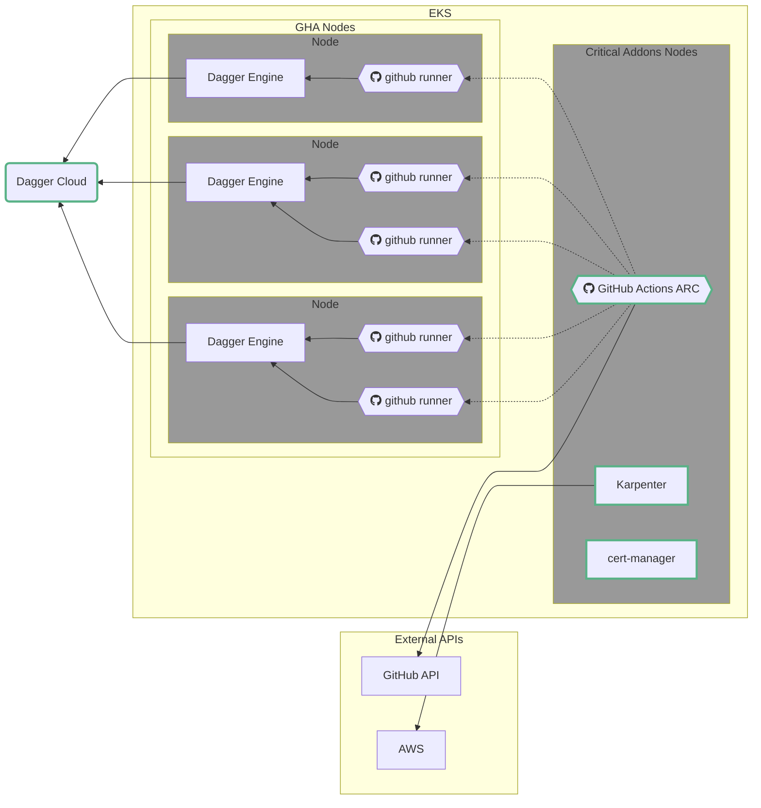

# Dagger on Kubernetes



## Overview

This guide outlines the process we have used to setup a Continuous Integration (CI) environment using Kubernetes and Dagger. While we've used GitHub for our CI, similar setups should work with GitLab, Drone, etc. We've used AWS EKS with Karpenter for auto-scaling our nodes. GKE and other managed Kubernetes services should work as well.

## Key Components

- **Kubernetes Cluster**
- **GitHub**: Our chosen CI tool. Other tools like GitLab or Drone should work similarly.
- [**cert-manager**](https://cert-manager.io/): Required by actions-runner-controller.
- [**GitHub Actions Runner Controller**](https://github.com/actions/actions-runner-controller): A Kubernetes controller that manages deploying and scaling GitHub Actions runners as Kubernetes pods.
- **[Karpenter](https://karpenter.sh/)**: Used for auto-scaling our Kubernetes nodes.
- **Dagger**

## Process
<!-- TODO: Add costs for running Dagger on a cluster? -->

1. **Set up a Kubernetes Cluster.** Given the number of ways that an cluster can be provisioned, we will not cover this in detail. If a quick start is needed, we recommend checking out [`eksctl`](https://eksctl.io/) for quickly provisioning an AWS EKS cluster.

1. **Set up runners for your CI tool in your Kubernetes cluster**: Runners are the workhorses of your CI/CD system. They execute the jobs that are defined in your pipeline. Depending on your CI tool, the process of setting up runners may vary. For GitHub, you can follow the instructions in the [GitHub Actions documentation](https://github.com/actions/actions-runner-controller#getting-started).

1. **Create a set of taints and tolerations for those runners**: Taints and tolerations in Kubernetes are a way to ensure that certain nodes are reserved for specific tasks. By setting up taints on your runner nodes, you can prevent other workloads from being scheduled on them. Tolerations are then added to the runners so that they can be scheduled on these tainted nodes. This ensures that your runners have dedicated resources for their tasks.

1. **Set up the same taints and tolerations for a Dagger Engine DaemonSet**: A DaemonSet ensures that all (or some) nodes run a copy of a Pod. In this case, you want to ensure that a Dagger Engine is running on each of your runner nodes. By setting up the same taints and tolerations as your runners, you ensure that the Dagger Engines are co-located with your runners.

1. **Use Karpenter for auto-scaling of node groups**: Karpenter is a Kubernetes-native node autoscaler. It can automatically adjust the size of your node groups based on the current workload. This means that if you have a lot of CI jobs running, Karpenter can automatically add more nodes to your cluster. Conversely, if there are few jobs running, it can remove unnecessary nodes, saving you money.

1. **Choose AWS nodes with moderate to large NVMe drives for the Dagger Engine cache**: The Dagger Engine cache is used to store intermediate build artifacts, which can significantly speed up your CI jobs. By choosing nodes with large NVMe drives, you ensure that there is plenty of space for this cache. NVMe drives are also much faster than traditional SSDs, which can further improve performance.

Remember, these steps may vary depending on your specific setup and requirements. Always refer to the official documentation of the tools you are using for the most accurate and up-to-date information.

### Dagger Engine DaemonSet

```yaml
apiVersion: apps/v1
kind: DaemonSet
metadata:
  name: dagger-engine
  namespace: dagger
  labels:
    k8s-app: dagger-engine
spec:
  selector:
    matchLabels:
      name: dagger-engine
  template:
    metadata:
      labels:
        name: dagger-engine
    spec:
      tolerations:
        - effect: NoSchedule
          key: github-actions-runner
          operator: Exists
      affinity:
        nodeAffinity:
          requiredDuringSchedulingIgnoredDuringExecution:
            nodeSelectorTerms:
            - matchExpressions:
              - key: github-actions-runner
                operator: Exists
      securityContext:
        runAsUser: 0
        runAsGroup: 1001
        fsGroup: 1001
        fsGroupChangePolicy: "OnRootMismatch"
      initContainers:
        - name: download-bin
          image: {{ .Values.dagger.engine.image.repository }}:{{ .Values.dagger.engine.image.tag }}
          command: ["sh", "-c", "wget https://github.com/moby/buildkit/releases/download/v0.11.6/buildkit-v0.11.6.linux-amd64.tar.gz -O /shared-bin/buildkit.tar.gz && tar -xvzf /shared-bin/buildkit.tar.gz --strip-components 1 bin/buildctl -C /shared-bin"]
          volumeMounts:
          - name: shared-bin
            mountPath: /shared-bin
      containers:
        - name: dagger-engine
          image: {{ .Values.dagger.engine.image.repository }}:{{ .Values.dagger.engine.image.tag }}
          imagePullPolicy: Always
          args:
            - "--oci-max-parallelism"
            - "num-cpu"
          {{- if and .Values.dagger.magicache.enabled .Values.dagger.magicache.cloud}}
          env:
          - name: _EXPERIMENTAL_DAGGER_CACHESERVICE_URL
            value: {{ required "A magicache url is required" .Values.dagger.magicache.cloud.url }}
          - name: _EXPERIMENTAL_DAGGER_CACHESERVICE_TOKEN
            value: {{ required "A magicache token is required" .Values.dagger.magicache.cloud.token }}
          {{- end }}
          securityContext:
            privileged: true
            capabilities:
              add:
                - ALL
          readinessProbe:
            exec:
              command: ["/shared-bin/buildctl", "debug", "workers"]
            initialDelaySeconds: 5
            periodSeconds: 5
          volumeMounts:
            - name: varlibdagger
              mountPath: /var/lib/dagger
            - name: varrundagger
              mountPath: /var/run/buildkit
            - name: shared-bin
              mountPath: /shared-bin
      terminationGracePeriodSeconds: 300
      volumes:
        - name: shared-bin
          emptyDir: {}
        - name: varlibdagger
          hostPath:
            path: /var/lib/dagger
        - name: varrundagger
          hostPath:
            path: /var/run/dagger
```

### Taints and Tolerations

We use these to ensure that:

- Runners are only scheduled on runner nodes
- Dagger Engines are co-located with runners

We're using a DaemonSet for the Dagger Engine to
- best utilize the NVMe hard drives of our worker nodes
- reduce the amount of network latency and bandwidth requirements
- simplify routing of Dagger SDK and CLI requests

We use the `_EXPERIMENTAL_DAGGER_RUNNER_HOST` environment variable to point to the Dagger Engine DaemonSet socket that we've mounted into our GitHub Runners. This ensures that our runners will use the local Dagger Engine for pipeline execution.

## Design Decisions

- We've chosen to use a Dagger Cloud Cache, which allows us to push cached layers up to the cloud and retrieve them at high bandwidth.
- Nodes should be sized to contain all the jobs you may want to run on them.
- We're using the combination of Karpenter and GitHub Actions Runner Controller to size our runners so that the runner will have as much RAM and CPU as we desire for that job.
- We're utilizing the fact that Kubernetes allows a noisy neighbor to actually take up a decent bit of space, even if a given pod, in this case a GitHub Actions Runner, has asked for a certain amount.

## Considerations

Many of our design decisions are based on the assumption that we'd be using some sort of cache. It's important to understand the design constraints we're operating under, so you can make your own informed decision for your design.

A few key considerations:

- Ensure you have enough storage space for your build cache. This can grow very large over time.
- Choose an appropriate size for your runner nodes based on the types of jobs you expect to run.
- Consider using a remote cache like Dagger Cloud Cache to speed up jobs that reuse the same build artifacts.
- Monitor your cluster and CI jobs to ensure everything is running smoothly and make adjustments as needed.
