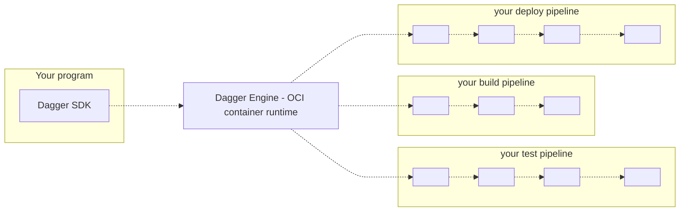

1. Your program imports the Dagger SDK in your language of choice.
2. Using the SDK, your program opens a new session to a Dagger Engine: either by connecting to an existing engine, or by provisioning one on-the-fly.
3. Using the SDK, your program prepares API requests describing pipelines to run, then sends them to the engine. The wire protocol used to communicate with the engine is private and not yet documented, but this will change in the future. For now, the SDK is the only documented API available to your program.
4. When the engine receives an API request, it computes a [Directed Acyclic Graph (DAG)](https://en.wikipedia.org/wiki/Directed_acyclic_graph) of low-level operations required to compute the result, and starts processing operations concurrently.
5. When all operations in the pipeline have been resolved, the engine sends the pipeline result back to your program.
6. Your program may use the pipeline's result as input to new pipelines.
