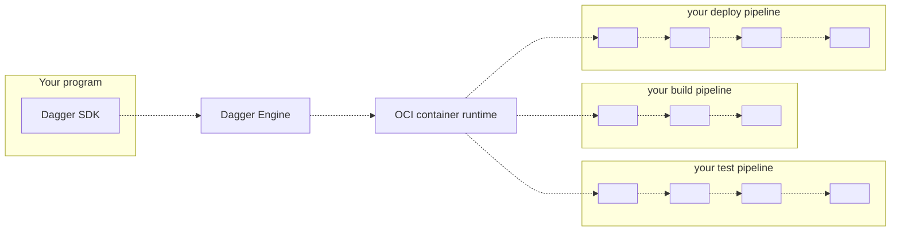

# Quickstart

import Tabs from "@theme/Tabs";
import TabItem from "@theme/TabItem";

## Understand the basics of Dagger

Before diving in to the code, here are some common questions about Dagger (and their answers).

### What is Dagger?

Dagger is a programmable CI/CD engine that runs your pipelines in containers. It enables you to develop your CI/CD pipelines as code, in the same programming language as your application, and then executes those pipelines entirely as [standard OCI containers](https://opencontainers.org/).

### Who is Dagger for?

Dagger may be a good fit if you are...

* A developer wishing your CI pipelines were code instead of YAML.
* Your team's "designated devops person", hoping to replace a pile of artisanal scripts with something more powerful.
* A platform engineer writing custom tooling, with the goal of unifying continuous delivery across organizational silos.
* A cloud-native developer advocate or solutions engineer, looking to demonstrate a complex integration on short notice.

### How does Dagger work?

1. Your program imports the Dagger SDK in your language of choice.
2. Using the SDK, your program opens a new session to a Dagger Engine: either by connecting to an existing engine, or by provisioning one on-the-fly.
3. Using the SDK, your program prepares API requests describing pipelines to run, then sends them to the engine. The wire protocol used to communicate with the engine is private and not yet documented, but this will change in the future. For now, the SDK is the only documented API available to your program.
4. When the engine receives an API request, it computes a [Directed Acyclic Graph (DAG)](https://en.wikipedia.org/wiki/Directed_acyclic_graph) of low-level operations required to compute the result, and starts processing operations concurrently.
5. When all operations in the pipeline have been resolved, the engine sends the pipeline result back to your program.
6. Your program may use the pipeline's result as input to new pipelines.
