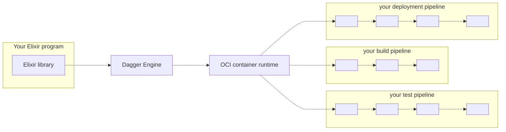

# Dagger Elixir SDK

{@include: ../../partials/_experimental-sdk-elixir.md}

## What is the Dagger Elixir SDK?

The Dagger Elixir SDK contains everything you need to develop CI/CD pipelines in Elixir, and run them with the [Dagger Engine](https://dagger.io).

This SDK contains:

* An Elixir package
* This documentation

## Who is it for?

The Dagger Elixir SDK may be a good fit if you are...

* An Elixir developer wishing your CI pipelines were Elixir code instead of YAML.
* A developer who needs CI/CD, and is looking for an excuse to learn Elixir.
* Your team's "designated devops person", hoping to replace a pile of artisanal scripts with something more powerful.
* A platform engineer writing custom Elixir tooling, with the goal of unifying continuous delivery across organizational silos.
* A cloud-native developer advocate or solutions engineer, looking to demonstrate a complex integration on short notice.

The Dagger Elixir SDK may *not* be a good fit if you are...

* A developer who doesn't know Elixir, and is not interested in learning it.
* A "designated devops person" who doesn't think of themselves as a developer - nothing makes you happier than a battle-hardened shell script.
* Someone who enjoys writing YAML.
* A container skeptic: the less containers are involved, the happier you are.

## How does it work?

1. Your Elixir program imports the Dagger Elixir library.
2. Using the Elixir library, your program opens a new session to a Dagger Engine: either by connecting to an existing engine, or by provisioning one on-the-fly.
3. Using the Elixir library, your program prepares API requests describing pipelines to run, then sends them to the engine. The wire protocol used to communicate with the engine is private and not yet documented, but this will change in the future. For now, the Elixir library is the only documented API available to your program.
4. When the engine receives an API request, it computes a [Directed Acyclic Graph (DAG)][dag] of low-level operations required to compute the result, and starts processing operations concurrently.
5. When all operations in the pipeline have been resolved, the engine sends the pipeline result back to your program.
6. Your program may use the pipeline's result as input to new pipelines.

## Get started

To learn more, [install the Elixir SDK][install] and [start using it][get-started].

[cli]: https://docs.dagger.io/cli
[install]: ./043817-install.md
[get-started]: ./756758-get-started.md
[dag]: https://en.wikipedia.org/wiki/Directed_acyclic_graph
