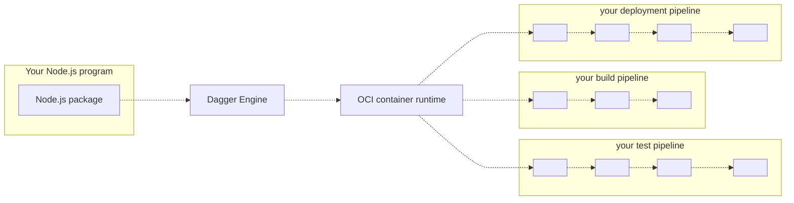

# Dagger Node.js SDK

Technical Preview

## What is the Dagger Node.js SDK?

The Dagger Node.js SDK contains everything you need to develop CI/CD pipelines in Node.js, and run them on any OCI-compatible container runtime.

Currently the Node.js SDK consists of:

* A Node.js package
* This documentation

## Who is it for?

The Dagger Node.js SDK may be a good fit if you are...

* A front-end or back-end developer wishing your CI pipelines were TypeScript or JavaScript code that you can run locally in seconds, instead of YAML that can only run on a proprietary service.
* A developer who needs CI/CD, and is looking for an excuse to learn TypeScript or JavaScript.
* Your team's "designated devops person", hoping to replace a pile of artisanal scripts with something more powerful.
* A platform engineer writing custom TypeScript tooling, with the goal of unifying continuous delivery across organizational silos.

The Dagger Node.js SDK may *not* be a good fit if you are...

* A developer who doesn't know TypeScript or JavaScript, and is not interested in learning it.
* Someone who loves writing YAML all day, thank you very much.
* A container skeptic: the less containers are involved, the happier you are.

## How does it work?

1. Your Node.js program imports the Dagger Node.js package.
2. Using the Node.js package, your program opens a new session to a Dagger Engine: either by connecting to an existing engine, or by provisioning one on-the-fly.
3. Using the Node.js package, your program prepares API requests describing pipelines to run, then sends them to the engine. The wire protocol used to communicate with the engine is private and not yet documented, but this will change in the future. For now, the Node.js package is the only documented API available to your program.
4. When the engine receives an API request, it computes a [Directed Acyclic Graph (DAG)](https://en.wikipedia.org/wiki/Directed_acyclic_graph) of low-level operations required to compute the result, and starts processing operations concurrently.
5. When all operations in the pipeline have been resolved, the engine sends the pipeline result back to your program.
6. Your program may use the pipeline's result as input to new pipelines.

## Get started

To learn more, [install the Node.js SDK](./835948-install.md) and [start using it](./783645-get-started.md).
