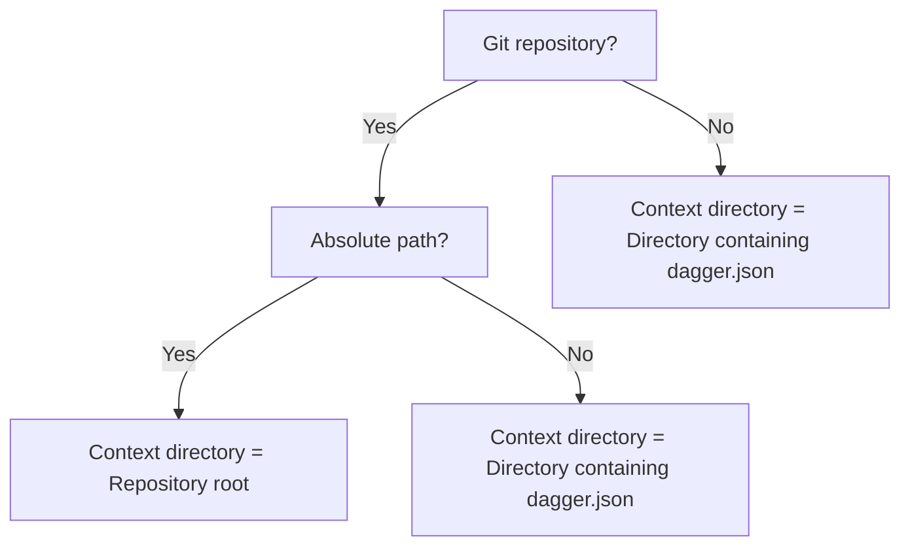

import Tabs from '@theme/Tabs';
import TabItem from '@theme/TabItem';

# Default Paths

It is possible to assign a default path for a `Directory` or `File` argument in a Dagger Function. Dagger will automatically use this default path when no value is specified for the argument. The `Directory` or `File` loaded in this manner is not merely a string, but the actual filesystem state of the directory or file.

:::important
Default paths are only available for `Directory` and `File` arguments. They are commonly used to load constant filesystem locations, such as an application's source code directory. Additionally, when a value is explicitly passed for the argument, it always overrides the default path.
:::

Here's an example:

<Tabs groupId="language" queryString="sdk">
<TabItem value="go" label="Go">

The default path is set by adding a `defaultPath` pragma on the corresponding Dagger Function `source` argument.

```go file=./snippets/default-paths/go/main.go
```
</TabItem>
<TabItem value="python" label="Python">

The default path is set by adding a `DefaultPath` annotation on the corresponding Dagger Function `source` argument.

```python file=./snippets/default-paths/python/main.py
```
</TabItem>
<TabItem value="typescript" label="TypeScript">

The default path is set by adding an `@argument` decorator with a `defaultPath` parameter on the corresponding Dagger Function `source` argument.

```typescript file=./snippets/default-paths/typescript/index.ts
```
</TabItem>
<TabItem value="php" label="PHP">

The default path is set by adding a `#[DefaultPath]` Attribute on the corresponding Dagger Function `source` argument.

```php file=./snippets/default-paths/php/src/MyModule.php
```
</TabItem>
</Tabs>

When determining how to resolve a default path, Dagger first identifies a "context directory", and then resolves the path starting from the context directory.

- For Git repositories (defined by the presence of a `.git` sub-directory), the context directory is the repository root (for absolute paths), or the directory containing a `dagger.json` file (for relative paths).
- For all other cases, the context directory is the directory containing a `dagger.json` file.



:::important
For security reasons, it is not possible to retrieve files or directories outside the context directory.
:::

The following sections contain examples of how a `Directory` argument is resolved for different default path values. The same rules are followed for `File` arguments.

### For Git repositories

| Default path | Context directory | Resolved path |
| --- | --- | --- |
| `/` | Repository root (`/`) | `/` |
| `/src` | Repository root (`/`) | `/src` |
| `.` | Directory with `dagger.json` (`/my-module`) | `/my-module` |
| `..` | Directory with `dagger.json` (`/my-module`) | `/` |

- If the default path is an absolute path `/` (or `/src`), the context directory is the repository root (`/`). The resolved path will then be `/` (or `/src`).
- If the default path is the relative path `.`, the context directory is the directory containing `dagger.json` (say, `/my-module`). The resolved path will then be `/my-module`.
- If the default path is the relative path `..`, the context directory is still the directory containing `dagger.json`. The resolved path will then be the parent of the context directory (`/`).

### For all other cases

| Default path | Context directory | Resolved path |
| --- | --- | --- |
| `/` | Directory with `dagger.json` (`/my-module`) | `/my-module` |
| `/src` | Directory with `dagger.json` (`/my-module`) | `/my-module/src` |
| `.` | Directory with `dagger.json` (`/my-module`) | `/my-module` |
| `..` | Directory with `dagger.json` (`/my-module`) | Outside context directory; error |

- If the default path is an absolute path `/` (or `/src`),  the context directory is the directory containing `dagger.json` (say, `/my-module`). The resolved path will then be `/my-module` (or `/my-module/src`).
- If the default path is the relative path `.`, the context directory is still the directory containing `dagger.json`. The resolved path will then be `/my-module`.
- If the default path is the relative path `..`, the context directory is still the directory containing `dagger.json`. The resolved path will then be the parent of the context directory. This will trigger an error, since Dagger does not permit access to paths outside the context directory.

:::tip
It's also possible to provide an `ignore` parameter to a contextual argument of type `Directory` to [automatically ignore or include files in the directory](./fs-filters.mdx).
:::
