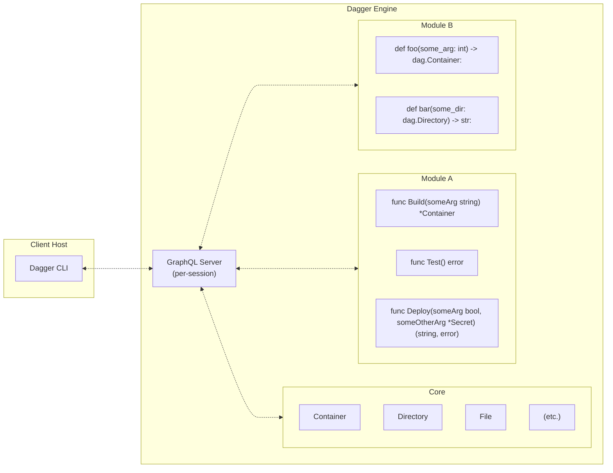

# Execution Environment and Process Flow

## Execution environment

Dagger Functions execute within containers spawned by the Dagger Engine. This "sandboxing" serves a few important purposes:

1. Reproducibility: Executing in a well-defined and well-controlled container ensures that a function to run the same way every time it is invoked. It also guards against creating "hidden dependencies" on ambient properties of the execution environment that could change at any moment.
1. Caching: A reproducible containerized environment makes it possible to cache the result of function execution, which in turn allows Dagger to automatically speed up function execution.
1. Security: Even when running third-party Dagger Functions sourced from a Git repository, those Dagger Functions will not have default access to your host environment (host files, directories, environment variables, etc.). Access to these host resources can only be granted by explicitly passing them as argument values to the Dagger Function.

## Code execution

When implementing Dagger Functions, you are free to write arbitrary code that will execute inside the Dagger module's container. You have access to the Dagger API to make calls to the core Dagger API or other Dagger modules you depend on, but you are also free to just use the language's standard library and/or imported third-party libraries.

The process your code executes in will currently be with the `root` user, but without a full set of Linux capabilities and other standard container sandboxing provided by `runc`.

The current working directory of your code will be an initially empty directory. You can write and read files and directories in this directory if needed. This includes using the `Export` APIs on `File`/`Directory`/`Container` to write those to this local directory if needed.

## `CurrentModule` API

The Dagger API client available to all Dagger Functions includes a `CurrentModule` API that provides abilities to introspect the function's module and interface between the current execution environment and the Dagger API.

For example:

1. The `Source` API on `CurrentModule` returns a `Directory` where your module's source code is stored, which grants access to any files or directories within there.

1. The `Workdir` and `WorkdirFile` APIs on `CurrentModule` allow you to load directories and files, respectively, from your function's current working directory (as described in the above section).

## Host resources

As mentioned above, Dagger Functions execute in containers and thus do not have access to resources on the host you invoke the function from (i.e. the host you execute a CLI command like `dagger call` from). Instead, these resources need to be explicitly passed when executing `dagger call`.

This includes:

1. Files and directories: Dagger Functions can accept arguments of type `File` or `Directory`. Pass files and directories on your host by specifying their path as the value of the argument when using `dagger call`.

1. Environment variables: Pass environment variable values as argument values when invoking a function by just using the standard shell convention of using `$ENV_VAR_NAME` when using `dagger call`.

1. Local network services: Dagger Functions that accept an argument of type `Service` can be passed local network services in the form `tcp://<host>:<port>`.

## Process flow

1. You execute a Dagger CLI command like `dagger call` against a Dagger module. The CLI either connects to an existing engine or provisions one on-the-fly. Once connected, it opens a new session with the Dagger Engine.

   - Each session is associated with its own GraphQL server instance running inside the Dagger Engine. This GraphQL server initially only has the core Dagger API available, which provides basic functionality like running containers, interacting with files and directories, etc.
   - The core API is highly optimized: each request is turned into a [Directed Acyclic Graph (DAG)](https://en.wikipedia.org/wiki/Directed_acyclic_graph) of low-level operations required to compute the result. It uses caching and other optimizations to compute these results as efficiently as possible.

1. The core API also provides functionality for loading Dagger modules. When a module is loaded into the session, the GraphQL API is dynamically extended with new APIs served by that module. So, after loading a module, the CLI client can now call all of the original core APIs _plus_ the new APIs provided by that module.

   - Dagger modules are just source code that is configured to be loaded with a Dagger SDK. When the module is loaded, the source code is pulled into the Dagger Engine (if not already cached) and interfaced with the session via the SDK so that its APIs are parsed and prepared for execution. Once loaded, if an API provided by the module is called, the module will be executed inside a container in the Dagger Engine to obtain the result.
   - Dagger modules are themselves also Dagger clients connected back to the same session they were loaded into. They can call core APIs in addition to other modules on which they have declared a dependency.

1. The Dagger CLI command you executed loads the specified Dagger module and calls the requested API served by that module. It then uses the returned result in the most appropriate way depending on the CLI command being used (print a textual representation, download an asset, open an interactive shell, proxy network ports, etc.).
