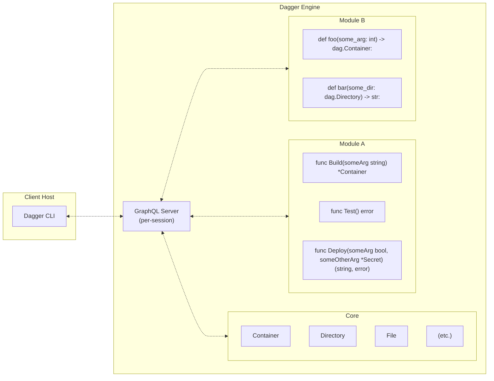

# API Internals

If you're interested in how Dagger uses GraphQL, this page provides additional information on the Dagger API's internals.

## Queries as pipelines

Consider the following GraphQL query:

```graphql
query {
  container {
    from(address: "alpine:latest") {
      withExec(args: ["apk", "info"]) {
        stdout
      }
    }
  }
}
```

This query represents a very simple Dagger pipeline. In plain English, it instructs Dagger to "download the latest `alpine` container image, run the command `apk info` in that image, and print the results of the command to the standard output device". It returns a list of the packages installed in the image:

A GraphQL schema works by defining one or more object types, and then fields (and field arguments) on those object types. The fields of an object type can themselves be objects, allowing for different entities to be logically connected with each other. API users can then perform GraphQL queries to return all or some fields of an object.

With Dagger's GraphQL API, while all of the above is true, each field in a query also resolves to a build operation. To understand this, let's dissect the query above:

1. Consider the first level of the previous query:

    ```graphql
    query {
      container {
        from(address: "alpine:latest") {
          ...
        }
      }
    }
    ```

    This query requests the `from` field of Dagger's [`Container`](https://docs.dagger.io/api/reference/#definition-Container) object type, passing it the address of a container image as argument. To resolve this, Dagger will initialize a container from the image published at the given address and return a [`Container`](https://docs.dagger.io/api/reference/#definition-Container) object representing the new container image.

1. Now, consider the next level of the query:

    ```graphql
    query {
      container {
        from(address: "alpine:latest") {
          withExec(args: ["apk", "info"]) {
            ...
          }
        }
      }
    }
    ```

    Here, the query requests the `withExec` field of the [`Container`](https://docs.dagger.io/api/reference/#definition-Container) object returned in the previous step, passing it the command to be executed as an array of arguments. To resolve this, Dagger will  define the command for execution in the container image and return a [`Container`](https://docs.dagger.io/api/reference/#definition-Container) object containing the execution results.

1. Finally, consider the innermost level of the query:

    ```graphql
    query {
      container {
        from(address: "alpine:latest") {
          withExec(args: ["apk", "info"]) {
            stdout
          }
        }
      }
    }
    ```

    Here, the query requests the `stdout` field of the [`Container`](https://docs.dagger.io/api/reference/#definition-Container) object returned in the previous step. To resolve this, Dagger will return a `String` containing the result of the last executed command.

## State representation

In a GraphQL schema, every object exposes an `id` field. This ID serves to uniquely identify and retrieve an object, and is also used by GraphQL's caching mechanism.

In the Dagger GraphQL API too, objects expose an ID but here, the ID represents the object's state at a given time. Objects like [`Container`](https://docs.dagger.io/api/reference/#definition-Container) and [`Directory`](https://docs.dagger.io/api/reference/#definition-Directory) should be thought of as collections of state, which are updated by subsequent field resolutions and whose ID represents their state at the instant of field resolution.

To illustrate this, consider the following query:

```graphql
query {
  host {
    directory(path: ".") {
      id
    }
  }
}
```

The return value of the previous query is an ID representing the state of the current directory on the host

By using object IDs to represesent object state, Dagger's GraphQL API enables some very powerful features. For example, you can save this state and reference it elsewhere (even in a different Dagger Function). You can then continue updating the state from the point you left off, or use it an input to another query.

To make this clearer, consider the following query:

```graphql
query {
  container {
    from(address: "alpine:latest") {
      withExec(args: ["touch", "/tmp/myfile"]) {
        id
      }
    }
  }
}
```

This query instructs Dagger to:

- initialize a container from the `alpine:latest` image (this resolves the `from` field)
- create an empty file at `/tmp/myfile` using the `touch` command (this resolves the `withExec` field)
- return an identifier representing the state of the container filesystem (this resolves the final `id` field)

The output of this query is an identifier representing the state of the container filesystem and Dagger's execution plan.

Now, execute a second query as follows, replacing the placeholder with the contents of the `id` field from the previous query:

```graphql
query {
  container(id: "YOUR-ID-HERE") {
    withExec(args: ["ls", "/tmp"]) {
      stdout
    }
  }
}
```

This second query instructs Dagger to:

- initialize a container using the filesystem state provided in the ID;
- run the `ls` command to list the files in the `/tmp/` directory (this resolves the `withExec` field);
- return the output of the command (this resolves the final `stdout` field).

This second query will return a listing for the `/tmp` directory of the container built by the first query.

As this example demonstrates, Dagger object IDs hold the state of their corresponding object. This state can be transferred from one query to another, or from one Dagger Function to another.

## Lazy evaluation

GraphQL query resolution is triggered only when a leaf value (scalar) is requested. Dagger uses this feature of GraphQL to evaluate pipelines "lazily".

An example will make this clearer. First, navigate to [Webhook.site](https://webhook.site), a free online tool that lets you receive and log incoming HTTP requests. Obtain and copy your unique webhook URL, as shown below:


Then, execute the following query, replacing the placeholder with your unique webhook URL:

```graphql
query {
  container {
    from(address: "alpine:latest") {
      withExec(args: ["apk", "add", "curl"]) {
        withExec(args: ["curl", "YOUR-WEBHOOK-URL"]) {
          id
        }
      }
    }
  }
}
```

This query instructs Dagger to:

- initialize a container from the `alpine:latest` image (this resolves the `from` field);
- add the `curl` command-line tool to the image via `apk add` (this resolves the `withExec` field);
- send an HTTP request to your webhook URL using `curl` (this resolves the second `withExec` field);
- return an ID representing the container state (this resolves the final `id` field).

The query returns a base64-encoded block, as explained in the previous section.

However, check the Webhook.site dashboard and you will notice that no HTTP request was sent when this query was executed. The reason is laziness: the query requests only an ID and, since resolving this does not require the commands to be executed, Dagger does not do so. It merely returns the container state and execution plan without actually executing the plan or running the `curl` command.

Now, update and execute the query again as follows:

```graphql
query {
  container {
    from(address: "alpine:latest") {
      withExec(args: ["apk", "add", "curl"]) {
        withExec(args: ["curl", "YOUR-WEBHOOK-URL-HERE"]) {
          stdout
        }
      }
    }
  }
}
```

This time, Dagger both prepares and executes the plan, because that is the only way to resolve the `stdout` field. Check the Webhook.site dashboard and the HTTP request sent by the `curl` command will be visible in the request log, as shown below:


This example demonstrates the lazy evaluation model in action. The client requests data, and the Dagger GraphQL API returns that data. If executing a command is necessary to return that data, it will do so; if not, it will not.

:::important
Lazy evaluation is a key advantage of GraphQL. It allows users to write queries (or code, if using an SDK) in a procedural manner, and resolves those queries only when necessary to return data to the user. Dagger leverages this lazy evaluation model to optimize and parallelize query execution for maximum speed and performance.
:::

## Dynamic API extension



1. You execute a Dagger CLI command like `dagger call` against a Dagger module. The CLI either connects to an existing engine or provisions one on-the-fly. Once connected, it opens a new session with the Dagger Engine.

   - Each session is associated with its own GraphQL server instance running inside the Dagger Engine. This GraphQL server initially only has the core Dagger API available, which provides basic functionality like running containers, interacting with files and directories, etc.
   - The core API is highly optimized: each request is turned into a [Directed Acyclic Graph (DAG)](https://en.wikipedia.org/wiki/Directed_acyclic_graph) of low-level operations required to compute the result. It uses caching and other optimizations to compute these results as efficiently as possible.

1. The core API also provides functionality for loading Dagger modules. When a module is loaded into the session, the GraphQL API is dynamically extended with new APIs served by that module. So, after loading a module, the CLI client can now call all of the original core APIs _plus_ the new APIs provided by that module.

   - Dagger modules are just source code that is configured to be loaded with a Dagger SDK. When the module is loaded, the source code is pulled into the Dagger Engine (if not already cached) and interfaced with the session via the SDK so that its APIs are parsed and prepared for execution. Once loaded, if an API provided by the module is called, the module will be executed inside a container in the Dagger Engine to obtain the result.
   - Dagger modules are themselves also Dagger clients connected back to the same session they were loaded into. They can call core APIs in addition to other modules on which they have declared a dependency.

1. The Dagger CLI command you executed loads the specified Dagger module and calls the requested API served by that module. It then uses the returned result in the most appropriate way depending on the CLI command being used (print a textual representation, download an asset, open an interactive shell, proxy network ports, etc.).
