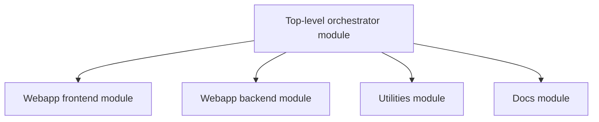
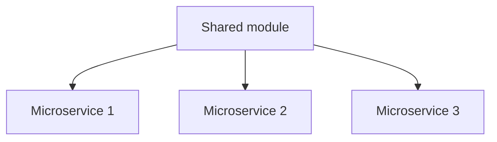

import Tabs from '@theme/Tabs';
import TabItem from '@theme/TabItem';
import DaggerModuleInit from '../partials/_dagger_module_init.mdx';

# Module Structure

<DaggerModuleInit />

## File layout

### Multiple files

<Tabs groupId="language">
<TabItem value="Go">

You can split your Dagger module into multiple files, not just `main.go`. To do this, you can just create another file beside `main.go` (for example, `utils.go`):

```
.
│── ...
│── main.go
│── utils.go
└── dagger.json
```

This file should be inside the same package as `main.go`, and as such, can access any private variables/functions/types inside the package.

Additionally, you can also split your Dagger module into Go subpackages (for example, `utils`):

```
.
│── ...
│── main.go
|── utils
│   └── utils.go
└── dagger.json
```

Because this is a separate package, you can only use the variables/functions/types that are exported from this package in `main.go` (you can't access types from `main.go` in the `utils` package).

:::note
Only types and functions in the top-level package are part of the public-facing API for the module.
:::

You can access other Dagger types from a sub-package by importing the generated sub-package `dagger/<module>/internal/dagger`:

```go
// utils/utils.go

import "dagger/<module>/internal/dagger"

func DoThing(client *dagger.Client) *dagger.Directory {
    // we need to pass *dagger.Client in here, since we don't have access to `dag`
	...
}
```

</TabItem>
<TabItem value="Python">
The Dagger module's code in Python can be split into multiple files by making a [package](https://docs.python.org/3/tutorial/modules.html#packages) and ensuring the *main object* is imported in `__init__.py`. All the other object types should already be imported from there.

For example given this directory structure:

```
.
├── dagger.json
├── src
│   ├── my_module
│   │   ├── __init__.py
│   │   ├── main.py
│   │   ├── test.py
│   │   └── lint.py
```

The `__init__.py` file should import the main object from `main.py`:

```python
# src/my_module/__init__.py
"""My very own Dagger module"""
from .main import MyModule as MyModule
```

And the `main.py` file should import the other objects from their respective files:

```python
# src/my_module/main.py
import dagger

from .test import Test  # in src/my_module/test.py
from .lint import Lint  # in src/my_module/lint.py

@dagger.object_type
class MyModule:
    @dagger.function
    def test(self) -> Test:
        return Test()

    @dagger.function
    def lint(self) -> Lint:
        return Lint()
```

:::important
Dagger expects that a Python Dagger module is structured like a [library](https://docs.astral.sh/uv/concepts/projects/#libraries), so that the SDK is able to load the code with an import, but it's up to the Python [build system](https://docs.astral.sh/uv/concepts/projects/#build-systems) to know where files are located in order to build and install the Python package correctly.

This affords a lot of flexibility in how Dagger Python modules can be structured, and which tools are supported.
:::

The default project template follows known conventions for structuring a Python library (src layout, package name matching project name), which allows Python [build backends](https://www.python.org/dev/peps/pep-0517/) to automatically recognize where the files are.

However, it's possible to change the project's name and file structure with a bit of extra configuration, as long as the build backend correctly builds the code in a way that allows the SDK to import it after installation (i.e., must be installed in `site-packages`).

:::note
Build backends are independent from installers (or *build frontends*, see [PEP 517](https://www.python.org/dev/peps/pep-0517/)), even though some installers may provide both (as separate packages). For example, [hatch](https://pypi.org/project/hatch/) vs [hatchling](https://pypi.org/project/hatchling/), [poetry](https://pypi.org/project/poetry/) vs [poetry-core](https://pypi.org/project/poetry-core/).
:::

:::tip
`dagger init` won't override existing `pyproject.toml` and `.py` files, so it's possible to use an external process to generate a different template, before calling `dagger init`.
:::

:::tip SINGLE FILE MODULE
Here is an example of moving all the code into a single `main.py` [module](https://docs.python.org/3/tutorial/modules.html), resulting in the following structure:

```
.
├── dagger.json
├── main.py
├── pyproject.toml
└── uv.lock
```

And corresponding `pyproject.toml` configuration:

<Tabs groupId="build-systems">
<TabItem value="hatchling">

```toml
[build-system]
requires = ["hatchling>=0.15.0"]
build-backend = "hatchling.build"

[tool.hatch.build.targets.wheel]
packages = ["main.py"]
```

</TabItem>
<TabItem value="poetry-core">

```toml
[build-system]
requires = ["poetry-core>=1.0.0"]
build-backend = "poetry.core.masonry.api"
```

</TabItem>
<TabItem value="setuptools">

```toml
[build-system]
requires = ["setuptools", "wheel"]
build-backend = "setuptools.build_meta"

[tool.setuptools]
py-modules = ["main"]
```

</TabItem>
</Tabs>

:::

:::tip CUSTOMIZE IMPORT PACKAGE
The Python SDK looks for the *main object* of the Dagger module in the Python [import package that is named after the distribution package name](https://packaging.python.org/en/latest/discussions/distribution-package-vs-import-package/#how-do-distribution-package-names-and-import-package-names-compare) (in particular, using underscores `_` as a word separator).

If they are different, you must explicitly tell the Python SDK where the main object needs to be imported from, using the following entry point configuration in `pyproject.toml`:

```toml
[project.entry-points."dagger.mod"]
main_object = "<import package>:<main object>"
```

For example, for a Dagger module named `my-module`:

- Main object: `MyModule` (required to be the name in `dagger.json`, in PascalCase)
- Default distribution package: `my-module` (in `pyproject.toml`; can be changed)
- Default import package: `src/my_module` (normalized after distribution package name; can be changed)

Then, the default `main_object` entry point that the Python SDK looks for is `my_module:MyModule`, with a fallback to `main:MyModule` for backwards compatibility.

Thus, if you have the following configuration:

```toml
[project.entry-points."dagger.mod"]
main_object = "my_module.main:MyModule"
```

Then the import in `__init__.py` is no longer needed since Dagger knows to import from `my_module.main` directly.

:::

</TabItem>
<TabItem value="TypeScript">

Due to TypeScript limitations, it is not possible to split your main class module (`index.ts`) into multiple files. However, it is possible to create sub-classes in different files and access them from your main class module:

```typescript
// src/index.ts
import { func, object } from "@dagger.io/dagger"

import { Test } from "./test" // in src/test.ts
import { Lint } from "./lint" // in src/lint.ts

@object()
class MyModule {
  @func()
  test(): Test {
    return new Test()
  }

  @func()
  lint(): Lint {
    return new Lint()
  }
}
```

</TabItem>
</Tabs>

### Monorepos

A monorepo typically contains multiple independent projects, each of which has different test, build and deployment requirements. Managing these requirements in a single CI workflow or YAML file can be incredibly complex and time-consuming.

Dagger modules provide a framework that you can use to break up this complexity and cleanly separate CI responsibilities in a monorepo without losing reusability or performance. There are two possible patterns you can follow:

1. One top-level Dagger module per project, with sub-modules for the various CI workflows in that project. This pattern is suitable when there are significant differences between the projects in the monorepo (e.g. a monorepo with SDKs, CLIs, web applications, docs, all of which have different CI requirements).



Benefits of this pattern include:

- Easier debugging: Sub-modules provide a way to separate, and therefore easily debug, the business logic for different CI tasks.
- Code reuse: There may be opportunities for sub-modules in different projects to import each other to reuse existing functionality.
- Improved performance: The top-level module of a project can orchestrate the sub-modules using the language’s native concurrency features.

2. A single, shared CI / automation module which all projects use and contribute to. This pattern is suitable when there are significant commonalities between the projects in the monorepo (e.g. a monorepo with only micro-services or only front-end applications).



Benefits of this pattern include:

- Code reuse: This reduces code duplication and ensures a consistent CI environment for all projects. For example, the shared module could create a common build environment and leverage this for multiple projects in the monorepo.
- Reduced onboarding friction: There is no need to create a new CI module when adding a new project or component. New projects can get started faster with their CI implementation.
- Best practices: All projects benefit from the best practices implemented in the shared module.
- Knowledge sharing: By contributing to a shared CI module, project teams can learn from each other's CI strategies.

## Runtime container

Dagger modules run in a runtime container that's bootstrapped by the Dagger Engine, with the necessary environment to run the Dagger module's code.

<Tabs groupId="language">
<TabItem value="Go">

The runtime container is currently hardcoded to run in Go 1.21  (although this may be configurable in future).

</TabItem>
<TabItem value="Python">

The runtime container is based on the [python:3.12-slim](https://hub.docker.com/_/python/tags?name=3.12-slim) base image by default, but it can be overridden by setting [`requires-python`](https://packaging.python.org/en/latest/guides/writing-pyproject-toml/#python-requires), or pinned with a `.python-version` file next to your `pyproject.toml`:

```shell
echo "3.11" > .python-version
```

This will instruct Dagger to use the `python:3.11-slim` base image instead.

Pinning the interpreter version can be useful to prevent an automatic upgrade from a future version of Dagger, or to select a newer version.

:::tip

For more advanced needs, a different base image can be used by adding the following to your `pyproject.toml`:

```toml
[tool.dagger]
base-image = "acme/python:3.11"
```

This can be useful to add a few requirements to the module's execution environment such as system packages like `git`, or to add necessary environment variables, for example. However, don't deviate from the default base image too much or it may break in a future version of Dagger.

⚠️ **Override at own risk!**
:::

</TabItem>
<TabItem value="TypeScript">

The runtime container is currently hardcoded to run in Node.js 22.11.0, but it can be overridden by [setting an alternative base image](../configuration/modules.mdx#alternative-base-images).

[Bun](https://bun.sh/) is experimentally supported and [work is in progress](https://github.com/dagger/dagger/issues/4368) to support [Deno](https://deno.com/).

The TypeScript SDK is installed automatically, including dependencies, with a version that's tied to the currently running Dagger Engine container:

```shell
# executed by the runtime container
yarn install
npm pkg set "dependencies[@dagger.io/dagger]=./sdk"
```

The SDK files are mounted under `/sdk` in the Dagger Engine runtime container.

This is why the initial `package.json` doesn't include any dependencies except a local link to the `sdk` generated directory.

```json
{
  "dependencies": {
    "typescript": "^5.3.2"
    "@dagger.io/dagger": "./sdk"
  }
}
```

[^1]:
</TabItem>
</Tabs>

## Language-native packaging

The structure of a Dagger module mimics that of each language's conventional packaging mechanisms and tools.

<Tabs groupId="language">
<TabItem value="Go">

Dagger modules written for use with the Go SDK are automatically created as [Go modules](https://go.dev/ref/mod). At module creation time, a `go.mod` and `go.sum` file will automatically be created  that import the necessary dependencies. Dependencies can be installed and managed just as for any standard Go environment.

After using new dependencies in your code, update your `go.mod`/`go.sum` with the newly imported dependencies by using [`go mod tidy`](https://go.dev/ref/mod#go-mod-tidy).

#### Go workspaces

Since it's common to have a sub-directory inside your main project containing your Dagger module code, you can manage your modules using [Go workspaces](https://go.dev/ref/mod#workspaces).

When a new Dagger module is created, Dagger attempts to add it to a root `go.work` if it exists. If not, it can be added manually later with `go work use ./path/to/mymodule`.

```go
// go.work
go 1.21.7

use (
	./path/to/mymodule
)
```

#### Go vendor

[Go vendor](https://go.dev/ref/mod#go-mod-vendor) directories are not currently supported. See [https://github.com/dagger/dagger/issues/6076](https://github.com/dagger/dagger/issues/6076) for more information.

</TabItem>
<TabItem value="Python">

Dagger modules in Python are built to be installed, like libraries. At module creation time, a `pyproject.toml` and `uv.lock` file will automatically be created that depend on the locally generated client library (in `./sdk`). This dependency is configured to be editable so that changes in the code don't require a re-install.

With the `uv.lock` file, Dagger uses uv's [project management](https://docs.astral.sh/uv/concepts/projects/) capabilites, but it can be opted out by removing this file, in which case Dagger falls back to [the pip interface](https://docs.astral.sh/uv/pip/) instead.

:::info
Dagger also supports pinning dependencies with a `pip-tools` compatible `requirements.lock` file in order to support the use of other project managers like Poetry or Hatch locally (when developing).

In this case, Dagger installs dependencies with:

```shell
# executed by the runtime
uv pip install -r requirements.lock -e ./sdk -e .
```

Notice that the `./sdk` and `.` packages don't need to be in the `requirements.lock` file, only the third party dependencies.

This means module developers can use any tool they want to manage their virtual environment and install dependencies, but if third-party dependencies aren't pinned in a `requirements.lock` file, the developers may get different versions between the Dagger execution environment and their own local environment.

For example, Poetry has its own `poetry.lock` which Dagger doesn't recognize, but it can be exported as a `requirements.lock` file with:

```shell
poetry export --without main -o requirements.lock
```

It will have to be manually kept in sync, though.
:::

</TabItem>
<TabItem value="TypeScript">
Dagger modules in Typescript are built to be installed, like libraries. The runtime container installs the module code with:

```shell
# executed by the runtime container
yarn install --production
```

This means that so long as the project has a `package.json` file, it can be used as a library and it can be managed using any Node.js package manager such as [`npm`](https://www.npmjs.com/), [`pnpm`](https://pnpm.io/) or [`yarn`](https://yarnpkg.com/).

Only production dependencies are installed, not packages defined in the `devDependencies` field.

</TabItem>
</Tabs>
