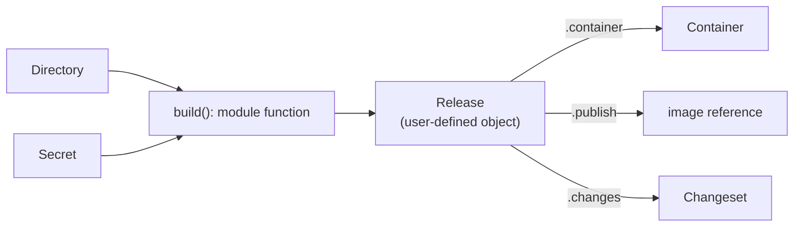

# The Type System

Dagger modules expose typed APIs. Types are not decoration; they are the contract that lets the CLI, SDK clients, other modules, agents, and Cloud understand what a module can do.

This section teaches type design for module authors. The [Types Reference](../types/index.mdx) lists the fields each type exposes; this section explains how to use the type system to make modules discoverable, composable, cache-friendly, and pleasant to call. It is language-agnostic — for the syntax that maps these ideas to a specific language, see the [SDK guides](../sdks/index.mdx).

## What types do for callers

A well-typed API helps callers:

- Discover available functions and object methods.
- Understand which inputs are required and which are optional.
- Compose outputs into later calls.
- Get useful help text and generated clients.
- Avoid passing data in the wrong shape.
- See where host files, services, secrets, generated changes, and external effects enter the workflow.

A weakly-typed API — one built mostly from strings — hides all of that. The engine cannot track content it only knows as a path, cannot keep a credential secret it only knows as text, and cannot help a caller continue a workflow when the only thing returned is a printed log line.

## The mental model

Think of a typed module as a graph that keeps going. A function accepts core values, returns a user-defined object that names a domain concept, and that object exposes methods that return more typed values — each of which the caller can use next.

Every arrow is a type. The richer each type, the further the caller can travel without dropping back to parsing strings or reaching around the module's API. Most weak APIs break one of these arrows: they take a path instead of a `Directory`, or return a status string instead of a `Container`, and the graph stops.

## Learning path

| Chapter | Reader outcome |
| --- | --- |
| [Core Dagger Types](./core-types.mdx) | Design with the platform types the engine understands deeply. |
| [Scalars, Lists, Nullability, and Defaults](./scalars-lists-nullability-defaults.mdx) | Use basic values, optionality, and defaults to shape the caller's first experience. |
| [Enums and Validation](./enums-and-validation.mdx) | Represent closed choices and fail early with useful errors. |
| [Function Arguments and Return Values](./arguments-and-return-values.mdx) | Make module functions explicit, discoverable, and easy to compose. |
| [User-Defined Object Types](./user-defined-object-types.mdx) | Model durable workflow concepts without imitating one SDK's class system. |
| [Constructors, Fields, and Methods](./constructors-fields-methods.mdx) | Decide where state belongs and how object APIs should be organized. |
| [Designing for Composability](./designing-for-composability.mdx) | Return values that other functions, modules, clients, and agents can keep using. |
| [Type Design Clinics](./type-design-clinics.mdx) | Practice turning weak APIs into typed Dagger APIs. |
