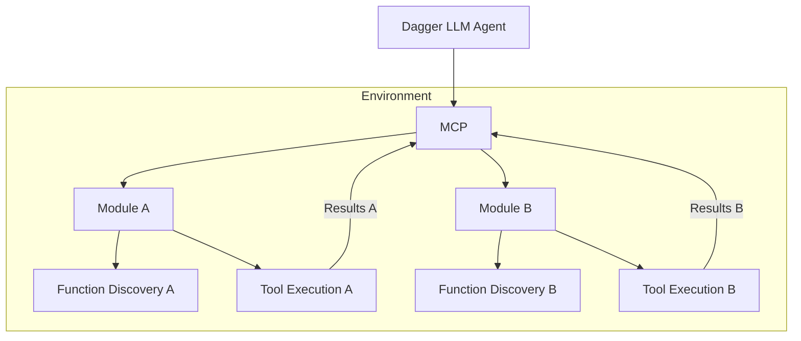
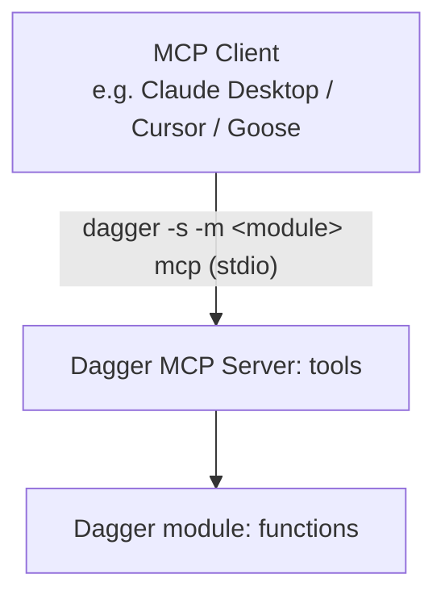

import Tabs from '@theme/Tabs';
import TabItem from '@theme/TabItem';

# MCP

Dagger can be used as a programming environment for AI agents. Dagger provides an `LLM` core type that enables native integration of Large Language Models (LLM) in your workflows.

Model Context Protocol (MCP) support in Dagger can be broken into three categories:

1. MCP within Dagger
2. Exposing MCP outside of Dagger
3. Connecting to external MCP from Dagger

## MCP within Dagger

A key feature of Dagger's LLM integration is out-of-the-box support for MCP using Dagger Functions: an LLM can automatically discover and use any available Dagger Functions in your Module.



### LLM Bindings

Here's an example of Dagger's LLM bindings in action:

<Tabs groupId="shell">

<TabItem value="Dagger Shell">
```shell title="First type 'dagger' for interactive mode."
base=$(container | from alpine)
env=$(env | with-container-input 'base' $base 'a base container' | with-container-output 'python-dev' 'a container with python dev tools')
llm | with-env $env | with-prompt "You have an alpine container. Install tools to develop with Python." | env | output python-dev | as-container | terminal
```
</TabItem>

<TabItem value="System shell">
```shell
dagger <<EOF
base=\$(container | from alpine)
env=\$(env |
  with-container-input 'base' \$base 'a base container' |
  with-container-output 'python-dev' 'a container with python dev tools')
llm |
  with-env \$env |
  with-prompt "You have an alpine container. Install tools to develop with Python." |
  env |
  output python-dev |
  as-container |
  terminal
EOF
```
</TabItem>

</Tabs>


### Agent loop

Consider the following Dagger Function:

<Tabs groupId="language" queryString="sdk">
<TabItem value="Go">
```go file=../quickstart/agent/snippets/go/main.go
```
</TabItem>
<TabItem value="Python">
```python file=../quickstart/agent/snippets/python/src/coding_agent/main.py
```
</TabItem>
<TabItem value="TypeScript">
```typescript file=../quickstart/agent/snippets/typescript/src/index.ts
```
</TabItem>
</Tabs>

This Dagger Function creates a new LLM, gives it an environment (a container with various tools) with an assignment, and prompts it to complete the assignment. The LLM then runs in a loop, calling tools and iterating on its work, until it completes the assignment. This loop all happens inside of the LLM object, so the value of `result` is the environment with the completed assignment.


## Exposing MCP outside of Dagger

Dagger has built-in MCP support that allows you to easily expose Dagger modules as an MCP server. This allows you to configure a client (such as Claude Desktop, Cursor, Goose CLI/Desktop) to consume modules from [the Daggerverse](https://daggerverse.dev) or any git repo as native MCP servers.



:::warning
Today only modules with no required constructor arguments are supported when exposing an MCP server outside of Dagger.
:::

## Connecting to External MCP Server from Dagger

Support for connecting to external MCP servers from Dagger is coming soon.

## Learn more

- [Build an AI agent with our quickstart](../quickstart/agent/index.mdx)
- [Browse AI agent examples](../examples.mdx#ai-agent-examples)
- [Learn about the agent loop and how to work with LLM prompts and responses](../api/llm.mdx)
- [Configure LLM endpoints](../configuration/llm.mdx)
