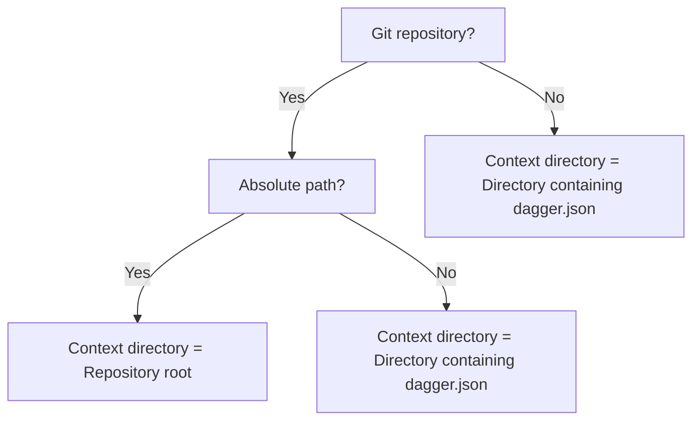

import Directory from '@daggerTypes/_directory.mdx';

import CloneRemoteGit from "@cookbookFilesystem/_clone-remote-git.mdx";
import MountCopyDirectory from "@cookbookFilesystem/_mount-copy-directory.mdx";
import ModifyCopiedDirectory from "@cookbookFilesystem/_modify-copied-directory.mdx";
import CopySubsetDirectory from "@cookbookFilesystem/_copy-subset-directory.mdx";
import CopyPredefinedFilters from "@cookbookFilesystem/_copy-predefined-filters.mdx";
import SetModuleDefault from "@cookbookFilesystem/_set-module-default.mdx";
import ExportDirectoryOrFileToHost from "@cookbookFilesystem/_export-directory-or-file-to-host.mdx";

<Directory />

## Default paths

It is possible to assign a default path for a `Directory` or `File` argument in a Dagger Function. Dagger will automatically use this default path when no value is specified for the argument.

The `Directory` or `File` loaded in this manner is not merely a string, but the actual filesystem state of the directory or file.

:::tip
Default paths are only available for `Directory` and `File` arguments. They
are commonly used to load constant filesystem locations, such as an
application's source code directory. Additionally, when a value is explicitly
passed for the argument, it always overrides the default path.
:::

Here's an example:

<Tabs groupId="language" queryString="sdk">
<TabItem value="go" label="Go">

The default path is set by adding a `defaultPath` pragma on the corresponding Dagger Function `source` argument.

```go file=./snippets/default-paths/go/main.go
```
</TabItem>
<TabItem value="python" label="Python">

The default path is set by adding a `DefaultPath` annotation on the corresponding Dagger Function `source` argument.

```python file=./snippets/default-paths/python/main.py
```
</TabItem>
<TabItem value="typescript" label="TypeScript">

The default path is set by adding an `@argument` decorator with a `defaultPath` parameter on the corresponding Dagger Function `source` argument.

```typescript file=./snippets/default-paths/typescript/index.ts
```
</TabItem>
<TabItem value="php" label="PHP">

The default path is set by adding a `#[DefaultPath]` Attribute on the corresponding Dagger Function `source` argument.

```php file=./snippets/default-paths/php/src/MyModule.php
```
</TabItem>
</Tabs>

When determining how to resolve a default path, Dagger first identifies a "context directory", and then resolves the path starting from the context directory.

- For Git repositories (defined by the presence of a `.git` sub-directory), the context directory is the repository root (for absolute paths), or the directory containing a `dagger.json` file (for relative paths).
- For all other cases, the context directory is the directory containing a `dagger.json` file.



:::tip
For security reasons, it is not possible to retrieve files or directories
outside the context directory.
:::

The following sections contain examples of how a `Directory` argument is resolved for different default path values. The same rules are followed for `File` arguments.

### Git repositories

| Default path | Context directory                           | Resolved path |
| ------------ | ------------------------------------------- | ------------- |
| `/`          | Repository root (`/`)                       | `/`           |
| `/src`       | Repository root (`/`)                       | `/src`        |
| `.`          | Directory with `dagger.json` (`/my-module`) | `/my-module`  |
| `..`         | Directory with `dagger.json` (`/my-module`) | `/`           |

- If the default path is an absolute path `/` (or `/src`), the context directory is the repository root (`/`). The resolved path will then be `/` (or `/src`).
- If the default path is the relative path `.`, the context directory is the directory containing `dagger.json` (say, `/my-module`). The resolved path will then be `/my-module`.
- If the default path is the relative path `..`, the context directory is still the directory containing `dagger.json`. The resolved path will then be the parent of the context directory (`/`).

### Non-Git repositories

| Default path | Context directory                           | Resolved path                    |
| ------------ | ------------------------------------------- | -------------------------------- |
| `/`          | Directory with `dagger.json` (`/my-module`) | `/my-module`                     |
| `/src`       | Directory with `dagger.json` (`/my-module`) | `/my-module/src`                 |
| `.`          | Directory with `dagger.json` (`/my-module`) | `/my-module`                     |
| `..`         | Directory with `dagger.json` (`/my-module`) | Outside context directory; error |

- If the default path is an absolute path `/` (or `/src`), the context directory is the directory containing `dagger.json` (say, `/my-module`). The resolved path will then be `/my-module` (or `/my-module/src`).
- If the default path is the relative path `.`, the context directory is still the directory containing `dagger.json`. The resolved path will then be `/my-module`.
- If the default path is the relative path `..`, the context directory is still the directory containing `dagger.json`. The resolved path will then be the parent of the context directory. This will trigger an error, since Dagger does not permit access to paths outside the context directory.

:::tip
It's also possible to provide an `ignore` parameter to a contextual argument
of type `Directory` to [automatically ignore or include files in the
directory].
:::

### Directory evaluation

When relying on default paths in Dagger Shell, it's important to know that the source file or directory is re-evaluated on each command execution within the shell session. This differs from passing the source explicitly as an argument, where it's evaluated once and cached. This re-evaluation can lead to unintended behavior where changes to the source directory during the session (such as through exports or logs) invalidate the cache, causing the entire pipeline to re-execute.

For example, given the following Dagger Function:

<Tabs groupId="language" queryString="sdk">
<TabItem value="go" label="Go">

```go
func (m *MyModule) Test(
    ctx context.Context,
    // +optional
    // +defaultPath="/"
    // +ignore=["build"]
    source *dagger.Directory,
) (*TestResult, error) {
  // ...
}
```

</TabItem>
<TabItem value="python" label="Python">

```python
@object_type
class MyModule:
    @function
    async def test(
        self,
        source: Annotated[dagger.Directory, DefaultPath("/"), Ignore(["build"])] | None,
    ) -> "TestResult":
        # ...
```

</TabItem>
<TabItem value="typescript" label="TypeScript">

```typescript
class MyModule {
  async test(
    @argument({ defaultPath: "/", ignore: ["build"] }) source?: Directory,
    ): Promise<TestResult> {
      // ...
  }
}
```
</TabItem>
<TabItem value="php" label="PHP">

```php
class MyModule {
    public function test(
      #[DefaultPath('/')]
      #[Ignore('build')]
      ?Directory $source = null,
      ): TestResult {
        // ...
    }
}
```
</TabItem>
</Tabs>

The command below results in the directory being evaluated multiple times (due to a combination of default path usage and cache invalidation from the export):

```shell
dagger shell <<'EOM'
    result=$(test)
    $result | report | export "build/test-report"
    .exit $($result | exit-code)
EOM
```

The command below evaluates the directory once (and then subsequently uses it from the cache, since the directory is explicitly passed):

```shell
dagger shell <<'EOM'
    result=$(test --source=".")
    $result | report | export "build/test-report"
    .exit $($result | exit-code)
EOM
```

## Filters

When you pass a directory to a Dagger Function as argument, Dagger uploads everything in that directory tree to the Dagger Engine. For large monorepos or directories containing large-sized files, this can significantly slow down your Dagger Function while filesystem contents are transferred. To mitigate this problem, Dagger lets you apply filters to control which files and directories are uploaded.

Dagger offers pre- and post-call filtering to mitigate this problem and optimize how your directories are handled.

Filtering improves the performance of your Dagger Functions in three ways:

- It reduces the size of the files being transferred from the host to the Dagger Engine, allowing the upload step to complete faster.
- It ensures that minor unrelated changes in the source directory don't invalidate Dagger's build cache.
- It enables different use-cases, such as setting up component/feature/service-specific workflows for monorepos.

It is worth noting that Dagger already uses caching to optimize file uploads. Subsequent calls to a Dagger Function will only upload files that have changed since the preceding call. Filtering is an additional optimization that you can apply to improve the performance of your Dagger Function.

### Pre-call filtering

Pre-call filtering means that a directory is filtered before it's uploaded to the Dagger Engine container. This is useful for:

- Large monorepos. Typically your Dagger Function only operates on a subset of the monorepo, representing a specific component or feature. Uploading the entire worktree imposes a prohibitive cost.

- Large files, such as audio/video files and other binary content. These files take time to upload. If they're not directly relevant, you'll usually want your Dagger Function to ignore them.

:::tip
The `.git` directory is a good example of both these cases. It contains a lot
of data, including large binary objects, and for projects with a long version
history, it can sometimes be larger than your actual source code.
:::

- Dependencies. If you're developing locally, you'll typically have your project dependencies installed locally: `node_modules` (Node.js), `.venv` (Python), `vendor` (PHP) and so on. When you call your Dagger Function locally, Dagger will upload all these installed dependencies as well. This is both bad practice and inefficient. Typically, you'll want your Dagger Function to ignore locally-installed dependencies and only operate on the project source code.

:::note
Dagger Functions are not aware of the host filesystem, so they cannot
automatically read exclusion patterns from existing `.dockerignore` or
`.gitignore` files. You need to manually implement the same patterns in your
Dagger Function. At the time of writing, Dagger [does not read exclusion
patterns from existing `.dockerignore`/`.gitignore`
files](https://github.com/dagger/dagger/issues/6627). If you already use these
files, you'll need to manually implement the same patterns in your Dagger
Function.
:::

To implement a pre-call filter in your Dagger Function, add an `ignore` parameter to your `Directory` argument. The `ignore` parameter follows the [`.gitignore` syntax](https://git-scm.com/docs/gitignore). Some important points to keep in mind are:

- The order of arguments is significant: the pattern `"**", "!**"` includes everything but `"!**", "**"` excludes everything.
- Prefixing a path with `!` negates a previous ignore: the pattern `"!foo"` has no effect, since nothing is previously ignored, while the pattern `"**", "!foo"` excludes everything except `foo`.

<Tabs groupId="language" queryString="sdk">
<TabItem value="go" label="Go">

Here's an example of a Dagger Function that excludes everything in a given directory except Go source code files:

```go file=./snippets/fs-filters/pre-call/go/main.go

```

</TabItem>
<TabItem value="python" label="Python">

Here's an example of a Dagger Function that excludes everything in a given directory except Python source code files:

```python file=./snippets/fs-filters/pre-call/python/main.py

```

</TabItem>
<TabItem value="typescript" label="TypeScript">

Here's an example of a Dagger Function that excludes everything in a given directory except TypeScript source code files:

```typescript file=./snippets/fs-filters/pre-call/typescript/index.ts

```

</TabItem>
<TabItem value="php" label="PHP">

Here's an example of a Dagger Function that excludes everything in a given directory except PHP source code files:

```php file=./snippets/fs-filters/pre-call/php/src/MyModule.php

```

</TabItem>
<TabItem value="java" label="Java">

Here's an example of a Dagger Function that excludes everything in a given directory except Java source code files:

```java file=./snippets/fs-filters/pre-call/java/MyModule.java

```

</TabItem>
</Tabs>

Here are a few examples of useful patterns:

<Tabs groupId="language" queryString="sdk">
<TabItem value="go" label="Go">
```go
// exclude Go tests and test data
// +ignore=["**_test.go", "**/testdata/**"]

// exclude binaries
// +ignore=["bin"]

// exclude Python dependencies
// +ignore=["**/.venv", "**/__pycache__"]

// exclude Node.js dependencies
// +ignore=["**/node_modules"]

// exclude Git metadata
// +ignore=[".git", "**/.gitignore"]

````

You can also split them into multiple lines:

```go
// +ignore=[
//   "**_test.go",
//   "**/testdata/**"
// ]
````

</TabItem>
<TabItem value="python" label="Python">
```python
# exclude Pytest tests and test data
Ignore(["tests/", ".pytest_cache"])
# exclude binaries
Ignore(["bin"])
# exclude Python dependencies
Ignore(["**/.venv", "**/__pycache__"])
# exclude Node.js dependencies

Ignore(["**/node_modules"])

# exclude Git metadata

Ignore([".git", "**/.gitignore"])

````
</TabItem>
<TabItem value="typescript" label="TypeScript">
```typescript
// exclude Mocha tests
@argument({ ignore: ["**.spec.ts"] })

// exclude binaries
@argument({ ignore: ["bin"] })

// exclude Python dependencies
@argument({ ignore: ["**/.venv", "**/__pycache__"] })

// exclude Node.js dependencies
@argument({ ignore: ["**/node_modules"] })

// exclude Git metadata
@argument({ ignore: [".git", "**/.gitignore"] })
````

</TabItem>
<TabItem value="php" label="PHP">
```php
// exclude PHPUnit tests and test data
#[Ignore('tests/', '.phpunit.cache', '.phpunit.result.cache')]

// exclude binaries #[Ignore('bin')]

// exclude Composer dependencies #[Ignore('vendor/')]

// exclude Node.js dependencies #[Ignore('**/node_modules')]

// exclude Git metadata #[Ignore('.git/', '**/.gitignore')]

````
</TabItem>
<TabItem value="java" label="Java">
```java
// exclude Java tests and test data
@Ignore({"src/test"})

// exclude binaries
@Ignore({"bin"})

// exclude Python dependencies
@Ignore({"**/.venv", "**/__pycache__"})

// exclude Node.js dependencies
@Ignore({"**/node_modules"})

// exclude Git metadata
@Ignore({".git", "**/.gitignore"})
````

</TabItem>
</Tabs>

### Post-call filtering

Post-call filtering means that a directory is filtered after it's uploaded to the Dagger Engine.

This is useful when working with directories that are modified "in place" by a Dagger Function. When building an application, your Dagger Function might modify the source directory during the build by adding new files to it. A post-call filter allows you to use that directory in another operation, only fetching the new files and ignoring the old ones.

A good example of this is a multi-stage build. Imagine a Dagger Function that reads and builds an application from source, placing the compiled binaries in a new sub-directory (stage 1). Instead of then transferring everything to the final container image for distribution (stage 2), you could use a post-call filter to transfer only the compiled files.

<Tabs groupId="language" queryString="sdk">
<TabItem value="go" label="Go">

To implement a post-call filter in your Dagger Function, use the `DirectoryWithDirectoryOpts` or `ContainerWithDirectoryOpts` structs, which support `Include` and `Exclude` patterns for `Directory` objects. Here's an example:

```go file=./snippets/fs-filters/post-call/go/main.go

```

</TabItem>
<TabItem value="python" label="Python">

To implement a post-call filter in your Dagger Function, use the `include` and `exclude` parameters when working with `Directory` objects. Here's an example:

```python file=./snippets/fs-filters/post-call/python/main.py

```

</TabItem>
<TabItem value="typescript" label="TypeScript">

To implement a post-call filter in your Dagger Function, use the `include` and `exclude` parameters when working with `Directory` objects. Here's an example:

```typescript file=./snippets/fs-filters/post-call/typescript/index.ts

```

</TabItem>
<TabItem value="php" label="PHP">

To implement a post-call filter in your Dagger Function, use the `include` and `exclude` parameters when working with `Directory` objects. Here's an example:

```php file=./snippets/fs-filters/post-call/php/src/MyModule.php

```

</TabItem>
<TabItem value="java" label="Java">

To implement a post-call filter in your Dagger Function, use the `Container.WithDirectoryArguments` class which support `withInclude` and `withExclude` functions when working with `Directory` objects. Here's an example:

```java file=./snippets/fs-filters/post-call/java/MyModule.java

```

</TabItem>
</Tabs>

Here are a few examples of useful patterns:

<Tabs groupId="language" queryString="sdk">
<TabItem value="go" label="Go">
```go
// exclude all Markdown files
dirOpts := dagger.ContainerWithDirectoryOpts{
  Exclude: "*.md*",
}

// include only the build output directory
dirOpts := dagger.ContainerWithDirectoryOpts{
Include: "build",
}

// include only ZIP files
dirOpts := dagger.DirectoryWithDirectoryOpts{
Include: "\*.zip",
}

// exclude Git metadata
dirOpts := dagger.DirectoryWithDirectoryOpts{
Exclude: "\*.git",
}

````
</TabItem>
<TabItem value="python" label="Python">
    ```python
    # exclude all Markdown files
    dir_opts = {"exclude": ["*.md*"]}

    # include only the build output directory
    dir_opts = {"include": ["build"]}

    # include only ZIP files
    dir_opts = {"include": ["*.zip"]}

    # exclude Git metadata
    dir_opts = {"exclude": ["*.git"]}
    ```
</TabItem>
<TabItem value="typescript" label="TypeScript">
    ```typescript
    // exclude all Markdown files
    const dirOpts = { exclude: ["*.md*"] }

    // include only the build output directory
    const dirOpts = { include: ["build"] }

    // include only ZIP files
    const dirOpts = { include: ["*.zip"] }

    // exclude Git metadata
    const dirOpts = { exclude: ["*.git"] }
    ```
    </TabItem>
    <TabItem value="php" label="PHP">
    ```php
    // exclude all Markdown files
    $dirOpts = ['exclude' => ['*.md*']];

    // include only the build output directory
    $dirOpts = ['include' => ['build']];

    // include only ZIP files
    $dirOpts = ['include' => ['*.zip']];

    // exclude Git metadata
    $dirOpts = ['exclude' => ['*.git']];
    ```
</TabItem>
<TabItem value="java" label="Java">
    ```java
    // exclude all Markdown files
    var dirOpts = new Container.WithDirectoryArguments()
        .withExclude(List.of("*.md*"));

    // include only the build output directory
    var dirOpts = new Container.WithDirectoryArguments()
        .withInclude(List.of("build"));

    // include only ZIP files
    var dirOpts = new Container.WithDirectoryArguments()
        .withInclude(List.of("*.zip"));

    // exclude Git metadata
    var dirOpts = new Container.WithDirectoryArguments()
        .withExclude(List.of("*.git"));
    ```
</TabItem>
</Tabs>

### Mounts

When working with directories and files, you can choose whether to copy or mount them in the containers created by your Dagger Function. The Dagger API provides the following methods:

- `Container.withDirectory()` returns a container plus a directory written at the given path
- `Container.withFile()` returns a container plus a file written at the given path
- `Container.withMountedDirectory()` returns a container plus a directory mounted at the given path
- `Container.withMountedFile()` returns a container plus a file mounted at the given path

Mounts only take effect within your workflow invocation; they are not copied to, or included, in the final image. In addition, any changes to mounted files and/or directories will only be reflected in the target directory and not in the mount sources.

:::tip
Besides helping with the final image size, mounts are more performant and resource-efficient. The rule of thumb should be to always use mounts where possible.
:::

## Debugging

### Using logs

Both Dagger Cloud and the Dagger TUI provide detailed information on the patterns Dagger uses to filter your directory uploads - look for the upload step in the TUI logs or Trace:


### Inspecting directory contents

Another way to debug how directories are being filtered is to create a function that receives a `Directory` as input, and returns the same `Directory`:

<Tabs groupId="language" queryString="sdk">
<TabItem value="go" label="Go">
```go
func (m *MyModule) Debug(
  ctx context.Context,
  // +ignore=["*", "!analytics"]
  source *dagger.Directory,
) *dagger.Directory {
  return source
}
````

</TabItem>
<TabItem value="python" label="Python">
```python
@function
async def foo(
    self,
    source: Annotated[
        dagger.Directory, Ignore(["*", "!analytics"])
    ],
) -> dagger.Directory:
    return source
```
</TabItem>
<TabItem value="typescript" label="TypeScript">
```typescript
@func()
debug(
   @argument({ ignore: ["*", "!analytics"] }) source: Directory,
): Directory {
  return source
}
```
</TabItem>
<TabItem value="php" label="PHP">
```php
    #[DaggerFunction]
    public function debug(
        #[Ignore('*'/, '!analytics')]
        Directory $source,
    ): Directory {
        return $source;
    }
```
</TabItem>
<TabItem value="java" label="Java">
```java
@Function
public Directory debug(@Ignore({"*", "!analytics"}) Directory source) {
    return source;
}
```
</TabItem>
</Tabs>

Calling the function will show you the directory’s digest and top level entries. The digest is content addressed, so it changes if there are changes in the contents of the directory. Looking at the entries field you may be able to spot an interloper:
`
You can open the directory in an interactive terminal to inspect the filesystem:

You can export the filtered directory to your host and check it with local tools:

## Examples

<CloneRemoteGit />
<MountCopyDirectory />
<ModifyCopiedDirectory />
<CopySubsetDirectory />
<CopyPredefinedFilters />
<SetModuleDefault />
<ExportDirectoryOrFileToHost />
