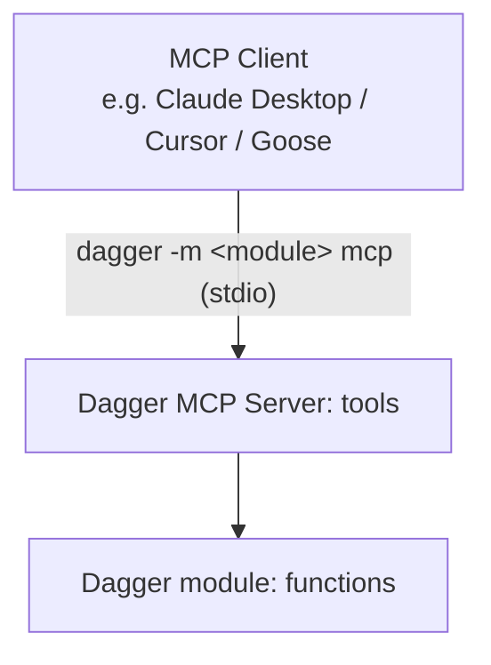

import VideoPlayer from '@components/VideoPlayer';

# LLM Integration

Dagger can be used as a runtime and programming environment for AI agents. Dagger provides an `LLM` type that enables native integration of Large Language Models (LLM) in your workflows.

## Tool use

A key feature of Dagger's LLM integration is out-of-the-box support for tool use using Dagger Functions: an LLM can automatically discover and use any available Dagger Functions in the provided environment.


### Environments

Environments configure any number of inputs and outputs for the LLM. For example, an environment might provide a `Directory`, a `Container`, a custom module, and a `string` variable. The LLM can use these objects and their functions to complete the assigned task.

The documentation for the modules are provided to the LLM via [inline documentation](../../extending/modules/documentation.mdx) in your Dagger Functions. The LLM can then analyze the available tools and select which ones to use.

Here's an example:

<Tabs groupId="shell">

<TabItem value="Dagger Shell">
```shell title="First type 'dagger' for interactive mode."
base=$(container | from alpine)
env=$(env | with-container-input 'base' $base 'a base container' | with-container-output 'python-dev' 'a container with python dev tools')
llm | with-env $env | with-prompt "You have an alpine container. Install tools to develop with Python." | env | output python-dev | as-container | terminal
```
</TabItem>

<TabItem value="System shell">
```shell
dagger <<EOF
base=\$(container | from alpine)
env=\$(env |
  with-container-input 'base' \$base 'a base container' |
  with-container-output 'python-dev' 'a container with python dev tools')
llm |
  with-env \$env |
  with-prompt "You have an alpine container. Install tools to develop with Python." |
  env |
  output python-dev |
  as-container |
  terminal
EOF
```
</TabItem>

</Tabs>

<VideoPlayer src="/img/current_docs/introduction/features/llm-api.webm" alt="LLM bindings example" />

Here, an instance of a `Container` is attached as an input to the `Env` environment. The `Container` is a core type with a number of useful functions, such as `withNewFile()` and `withExec()`. When this environment is attached to an `LLM`, the LLM can call any of these Dagger Functions to change the state of the `Container` and complete the assigned task.

### Agent loop

Consider the following Dagger Function:

<Tabs groupId="language" queryString="sdk">
<TabItem value="go" label="Go">
```go file=../../getting-started/quickstarts/agent/snippets/part1/go/main.go
```
</TabItem>
<TabItem value="python" label="Python">
```python file=../../getting-started/quickstarts/agent/snippets/part1/python/src/coding_agent/main.py
```
</TabItem>
<TabItem value="typescript" label="TypeScript">
```typescript file=../../getting-started/quickstarts/agent/snippets/part1/typescript/src/index.ts
```
</TabItem>
<TabItem value="php" label="PHP">
```php file=../../getting-started/quickstarts/agent/snippets/part1/php/src/CodingAgent.php
```
</TabItem>
</Tabs>

This Dagger Function creates a new LLM, gives it an environment (a container with various tools) with an assignment, and prompts it to complete the assignment. The LLM then runs in a loop, calling tools and iterating on its work, until it completes the assignment. This loop happens inside the LLM object, so the value of `result` is the environment with the completed assignment.

## MCP

Model Context Protocol (MCP) support in Dagger can be broken into two categories:

1. Exposing MCP outside Dagger
1. Connecting to external MCP servers from Dagger

### Expose MCP outside Dagger

Dagger has built-in MCP support that allows you to easily expose Dagger modules as an MCP server. This allows you to configure a client (such as Claude Desktop, Cursor, Goose CLI/Desktop) to consume modules from [the Daggerverse](https://daggerverse.dev) or any Git repository as native MCP servers.



:::warning
Currently, only Dagger modules with no required constructor arguments are supported when exposing an MCP server outside  Dagger.
:::

### Connect to external MCP servers from Dagger

To connect with MCP servers, You can use `LLM.withMCPServer` to attach them to `LLM`. You will need to supply MCP Servers you want to use as `Service`.

Following is an example adds MCP Language Server to `LLM`.

<Tabs groupId="language" queryString="sdk">
<TabItem value="go" label="Go">

```go
mcpServer := dag.Container().
    From("golang").
    WithExec([]string{"go", "install", "golang.org/x/tools/gopls@latest"}).
    WithExec([]string{"go", "install", "github.com/isaacphi/mcp-language-server@latest"}).
    WithWorkdir("/src").
    AsService(dagger.ContainerAsServiceOpts{Args: []string{"mcp-language-server", "--workspace", "/src", "--lsp", "gopls"}})

work := dag.LLM().
		WithEnv(environment).
		WithMCPServer("lsp", mcpServer).
		WithPrompt("yout llm prompt")
```

</TabItem>
<TabItem value="python" label="Python">

```python
mcp_server = (
    dag.container()
    .from_("golang")
    .with_exec(["go", "install", "golang.org/x/tools/gopls@latest"])
    .with_exec(["go", "install", "github.com/isaacphi/mcp-language-server@latest"])
    .with_workdir("/src")
    .as_service(args=["mcp-language-server", "--workspace", "/src", "--lsp", "gopls"])
)

work = (
    dag.llm()
    .with_env(environment)
    .with_mcp_server("lsp", mcp_server)
    .with_prompt("your llm prompt")
)
```

</TabItem>
<TabItem value="typescript" label="TypeScript">

```typescript
const mcpServer = dag
  .container()
  .from("golang")
  .withExec(["go", "install", "golang.org/x/tools/gopls@latest"])
  .withExec(["go", "install", "github.com/isaacphi/mcp-language-server@latest"])
  .withWorkdir("/src")
  .asService({
    args: ["mcp-language-server", "--workspace", "/src", "--lsp", "gopls"],
  })

const work = dag
  .llm()
  .withEnv(environment)
  .withMCPServer("lsp", mcpServer)
  .withPrompt("your llm prompt")
```

</TabItem>
<TabItem value="php" label="PHP">

```php
$mcpServer = dag()
    ->container()
    ->from('golang')
    ->withExec(['go', 'install', 'golang.org/x/tools/gopls@latest'])
    ->withExec(['go', 'install', 'github.com/isaacphi/mcp-language-server@latest'])
    ->withWorkdir('/src')
    ->asService(args: ['mcp-language-server', '--workspace', '/src', '--lsp', 'gopls']);

$work = dag()
    ->llm()
    ->withEnv($environment)
    ->withMCPServer('lsp', $mcpServer)
    ->withPrompt('your llm prompt');
```

</TabItem>
<TabItem value="java" label="Java">

```java
Service mcpServer = dag().container()
    .from("golang")
    .withExec(List.of("go", "install", "golang.org/x/tools/gopls@latest"))
    .withExec(List.of("go", "install", "github.com/isaacphi/mcp-language-server@latest"))
    .withWorkdir("/src")
    .asService(
        new Container.AsServiceArguments()
            .withArgs(List.of("mcp-language-server", "--workspace", "/src", "--lsp", "gopls")));

var work = dag()
    .llm()
    .withEnv(environment)
    .withMCPServer("lsp", mcpServer)
    .withPrompt("your llm prompt");
```

</TabItem>
</Tabs>

## Prompt mode

Dagger Shell lets you interact with the attached LLM using natural language commands. Each input builds upon previous interactions, creating a prompt chain that lets you execute complex workflows without needing to know the exact syntax of the underlying Dagger API.

"Prompt mode" can be accessed at any time in the Dagger Shell by typing `>`. Here's an example:

```shell
source=$(container | from node | with-mounted-directory /src https://github.com/dagger/hello-dagger | with-workdir /src)

You have a container with source code in /src. Describe the source code.

Does the application have unit tests?

Find all the unit tests. Deduce what the application does. Describe it in one paragraph.
```

<VideoPlayer src="/img/current_docs/introduction/features/llm-natural.webm" alt="LLM prompt mode example" />

## Supported models

Dagger supports a wide range of popular language models, including those from OpenAI, Anthropic and Google. Dagger can access these models either through their respective cloud-based APIs or using local providers like Docker Model Runner or Ollama.

Dagger uses your system's standard environment variables to route LLM requests. Dagger will look for these variables in your environment, or in a `.env` file in the current directory. Learn more about [configuring LLM endpoints in Dagger](../../reference/configuration/llm.mdx).

## Observability

Dagger provides [end-to-end tracing](./observability.mdx) of prompts, tool calls, and even low-level system operations. All agent state changes are observable in real time.
