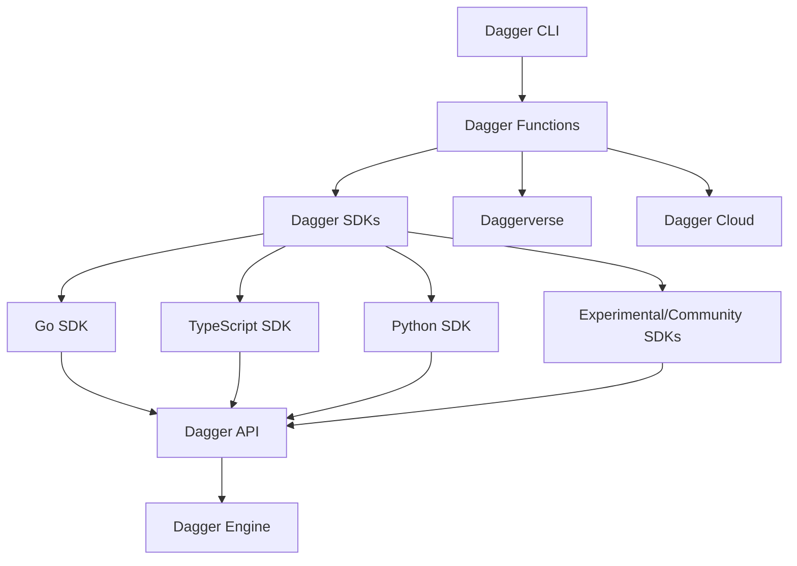

# Manual

Welcome to the Dagger manual!

This manual provides detailed information to help you use Dagger. It covers:

- The Dagger CLI, which is your primary way to call Dagger Functions, either interactively from a terminal or non-interactively from a shell script or a CI configuration;
- Dagger Functions, which let you encapsulate this code into a software component which can be loaded into any Dagger Engine, and called by other Dagger Functions;
- The Dagger API, which provides primitives to stitch together powerful pipelines out of containers, artifacts, network services, and secrets – all in type-safe Go, Python or TypeScript;
- The Dagger Engine, which is a container engine controlled by the Dagger API;
- Dagger Cloud, which provides additional visualization and debugging features;
- The Daggerverse, which is a free service run by Dagger to easily search and consume Dagger Functions.

:::tip
If you're new to Dagger, [try the Dagger Quickstart](../quickstart/index.mdx) first.
:::
