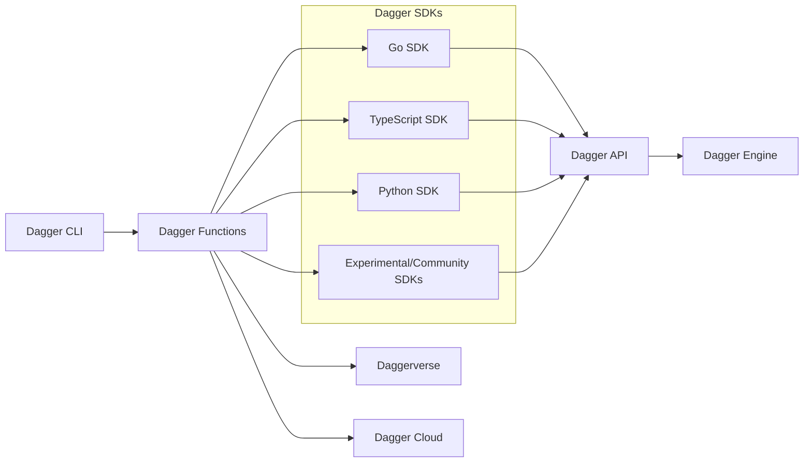

```mermaid
graph LR
    A[Dagger CLI] --> B[Dagger Functions]
    D --> E[Dagger Engine]
    B --> F[Daggerverse]
    B --> G[Dagger Cloud]

    subgraph C[Dagger SDKs]
      direction LR
      H[Go SDK]
      I[TypeScript SDK]
      J[Python SDK]
      K[Experimental/Community SDKs]
    end

    B --> H
    B --> I
    B --> J
    B --> K

    H --> D[Dagger API]
    I --> D
    J --> D
    K --> D
```
