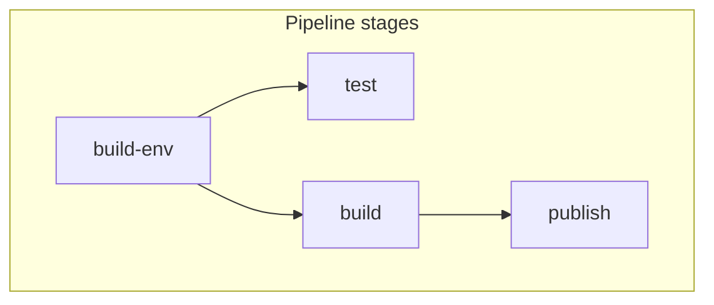

import Tabs from "@theme/Tabs";
import TabItem from "@theme/TabItem";

# Quickstart

## Inspect the build environment stage

You're now ready to dive into Dagger and see how Dagger Functions work!

Here's a graphical representation of the pipeline you just ran:



The `publish` stage depends on the `test` and `build` stages, which in turn depend on the `build-env` stage. Dagger represents these stages and dependencies in a [Directed Acyclic Graph (DAG)](https://en.wikipedia.org/wiki/Directed_acyclic_graph), which it then runs concurrently to maximize pipeline speed and accuracy.

Since the starting point of the DAG is the Dagger Function that builds the base container, let's look at that first.

<Tabs groupId="language">
<TabItem value="Go">

```go file=./snippets/env/go/main.go
```

The first thing to recognize is that this Dagger Function expects a `source` argument. Arguments to Dagger Functions may be simple string, numeric or Boolean arguments, or more complex Dagger-specific types like `Directory`, `File`, or `Container`. This Dagger Function expects a `source` argument of type `Directory`, which tells the Dagger Function the location of the directory containing the application's source code. The `Directory` type can refer to either a local directory or a remote Git repository.

The `BuildEnv()` Dagger Function does the following:

- It begins by calling the `dag` client. `dag` is the Dagger client, which is pre-initialized in every Dagger Function. It contains all the core types (like `Container`, `Directory`, etc.), as well as bindings to any dependencies your module has declared.
- It uses the `dag.CacheVolume()` method to initialize a new Dagger cache volume for the application dependencies. [Caching](./cache.mdx) is discussed in more detail later.
- It uses the `dag` client's `Container().From()` method to initialize a new container from a base image - in this case, the `node:21-slim` image. This base image is the Node.js version to use for testing. The `From()` method returns a new `Container` object representing the container image.
- It uses the `Container().WithDirectory()` method to mount the source code directory at the `/src` mount point in the container. The location of the source code directory is obtained from the `source` argument passed to the Dagger Function.
  - The `source` argument is of type `Directory`, which is a special Dagger type. This type comes with its own methods, one of which is `Directory().WithoutDirectory()`. This method is used to exclude specific directories from the mount - in this case, Dagger's own working directory.
- It uses the `Container().WithMountedCache()` method to mount the cache volume at the `/src/node_modules/` mount point in the container. [Caching](./cache.mdx) is discussed in more detail later.
- It uses the `Container().WithWorkdir()` method to set the working directory to the `/src` mount point.
- It uses the `Container().WithExec()` method to set the `npm install` command to install dependencies in the container.

</TabItem>
<TabItem value="Python">

FIXME

</TabItem>
<TabItem value="TypeScript">

FIXME

</TabItem>
</Tabs>

If you've worked with Dockerfiles, this code listing should look very familiar to you. Similar to the instructions in a Dockerfile, it starts with a base container image, then calls a series of functions in sequence to revise and enhance the base image.

Dagger's core types (`Container`, `Directory`, `Service`, `Secret`, ...) are all objects, each with pre-defined functions of their own. When using these objects, the Dagger API lets you follow up by calling one of that object's functions, which itself can return another object, and so on. This is called ["function chaining"](../manuals/user/functions/539201-chaining.mdx), and is a core feature of Dagger.

The end result of this call chain is a revised `Container` representing the build environment for the application. This is a `node:21-slim` container image with the application source code mounted at `/src` and a cache volume for application dependencies.

Now that you know how the Dagger Function works, call it with the Dagger CLI:

```shell
dagger call \
  build-env --source=.
```

:::tip FUNCTION NAMES
When using `dagger call`, all names (functions, arguments, fields, etc.) are converted into a shell-friendly "kebab-case" style. This is why Dagger Functions named `FooBar` in Go, `foo_bar` in Python and `fooBar` in TypeScript are invoked at the command line as `dagger call foo-bar ...`.
:::

You should see various operations taking place, ending with this output:

```
Container evaluated. Use "dagger call build-env --help" to see available sub-commands.
```

This means that the build succeeded, and a `Container` type representing the built container image was returned. This is a ["just-in-time" container](../manuals/user/artifacts/production/472010-containers.mdx) - a [transient artifact](../manuals/user/artifacts/723090-artifacts.mdx) produced as the result of a Dagger Function.

Just-in-time artifacts come with useful functions of their own, which you can call by chaining them to the artifact in the `dagger call` command. One of the most interesting `Container` functions is `terminal`, which can be used to [open an interactive terminal session with a just-in-time container](../manuals/user/artifacts/consumption/138393-exec.mdx).

To see this in action, revise the previous command and chain an additional function call to `terminal` on the returned `Container`:

```shell
dagger call \
  build-env --source=. \
  terminal --cmd=bash
```

This revised command builds the container image and then drops you into an interactive terminal running the `bash` shell.

You can now directly execute commands in the running container. For example, you can get information about the container operating system and platform:

```shell
uname -a
```

You should see output similar to the below:

```
Linux dn7uagqhmd42g.r5s4kfkvo1mjq.dagger.local 6.1.0-21-cloud-amd64 #1 SMP PREEMPT_DYNAMIC Debian 6.1.90-1 (2024-05-03) x86_64 GNU/Linux
```

Or, you can inspect the contents of the container filesystem and confirm that it contains the application source code:

```shell
ls /src
```

You should see a listing of the application's files, similar to the below:

```
LICENSE    cypress.config.ts  index.html         package.json  tsconfig.app.json   tsconfig.vitest.json
README.md  dagger.json        node_modules       public        tsconfig.json       vite.config.ts
cypress    env.d.ts           package-lock.json  src           tsconfig.node.json  vitest.config.ts
```

:::tip INTERACTIVE CONTAINER DEBUGGING
The `terminal` function is very useful for debugging and experimenting, since it allows you to interact directly with containers and inspect their state, at any stage of your Dagger Function execution.
:::

You can also inspect the list of installed dependencies:

```shell
npm list
```

You should see a list similar to the below (truncated for brevity):

```
hello-dagger@0.0.0 /src
+-- @rushstack/eslint-patch@1.10.2
+-- @tsconfig/node20@20.1.4
+-- @types/jsdom@21.1.6
+-- @types/node@20.12.11
+-- @vitejs/plugin-vue-jsx@3.1.0
...
```

Exit the interactive terminal once done:

```shell
exit
```

:::tip SANDBOXING
The Dagger Function on this page receives the location of the source code directory as a function argument, rather than reading it directly from the host filesystem. This is [by design](../manuals/developer/execution-environment.mdx): Dagger Functions are fully "sandboxed" and do not have direct access to the host system. Therefore, host resources such as directories, files, environment variables, network services and so on must be explicitly passed to Dagger Functions as arguments. This "sandboxing" of Dagger Functions improves security, ensures reproducibility, and assists caching.
:::
