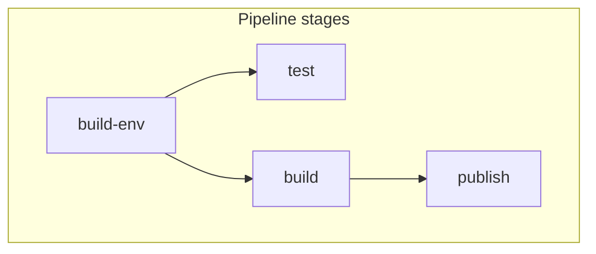

import Tabs from "@theme/Tabs";
import TabItem from "@theme/TabItem";

# Quickstart

## Inspect the publish stage

You're now ready to dive into Dagger and see how Dagger Functions work!

Here's a graphical representation of the pipeline you just ran:



The `publish` stage depends on the `test` and `build` stages, which in turn depend on the `build-env` stage. Dagger represents these stages and dependencies in a [Directed Acyclic Graph (DAG)](https://en.wikipedia.org/wiki/Directed_acyclic_graph), which it then runs concurrently to maximize pipeline speed and accuracy.

Let's start with the result - publishing a container image - and work our way back through through the pipeline stages. Begin by calling the corresponding Dagger Function with the Dagger CLI:

```shell
dagger call \
  publish --source=.
```

You should see various operations taking place, ending with a reference to the published container image on the ttl.sh container registry, like the one below:

```
ttl.sh/hello-dagger-47384@sha256:57c15999fdc59df452161f648aaa9b9a1ea9dbda710a0a0242f509966a286b4b
```

Let's break down the command you just ran to understand what happened:

- `dagger call publish`: The `dagger call` command is the standard way to invoke a Dagger Function. This command tells Dagger to execute the named Dagger Function from the current module.
- `--source=.`: This is an argument, passed to the Dagger Function as a command line flag. Arguments to Dagger Functions may be simple string, numeric or Boolean arguments, or more complex Dagger-specific types like `Directory`, `File`, or `Container`. This `source` argument tells the Dagger Function the location of the application's source code: in the current working directory.


:::tip FUNCTION NAMES
When using `dagger call`, all names (functions, arguments, fields, etc) are converted into a shell-friendly "kebab-case" style. This is why Dagger Functions named `FooBar` in Go, `foo_bar` in Python and `fooBar` in TypeScript are invoked at the command line as `dagger call foo-bar ...`.
:::

Next, let's backtrack to the source code of the Dagger Function to understand what happens when it's invoked via `dagger call`.

<Tabs groupId="language">
<TabItem value="Go">

```go file=./snippets/publish/go/main.go
```

The `Publish()` Dagger Function does the following:

- It calls the `Test()` Dagger Function to run the application's tests and return the results.
- It calls the `Build()` Dagger Function to build and return a container image of the application as a `Container` object.
- It uses the `Container` object's `Publish()` method to publish the container image to the registry and return the image identifier.

Since it looks like most of the work here is being done by the `Test()` and `Build()` Dagger Functions, let's look at those next.

</TabItem>
<TabItem value="Python">

FIXME

</TabItem>
<TabItem value="TypeScript">

FIXME

</TabItem>
</Tabs>

:::tip NO MORE DEPENDENCY HELL
Did you notice that even though you're testing, building and publishing a Node.js application in this quickstart, you didn't need to install any dependencies on your local machine? You only needed the Dagger CLI and the ability to run containers. This is a very powerful feature of Dagger, because it allows development teams to create standardized tooling and eliminates all the variables and dependencies related to the host environment and/or configuration.
:::
