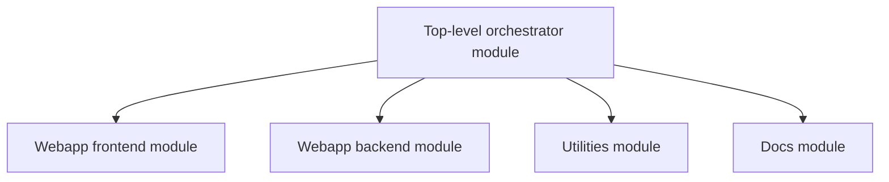
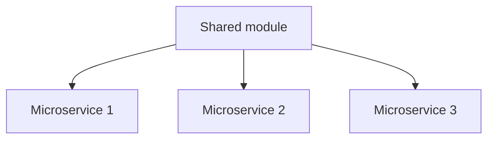

When using Dagger to build a monorepo, you can choose between two common patterns for organizing your Dagger modules. The choice depends on the complexity of the monorepo and the relationships between the projects in it.

### Top-level Dagger module

One common approach is to create a top-level Dagger module for the monorepo, attach sub-modules for each component of the monorepo, and model the Dagger module dependencies on the logical dependencies between components. This pattern is suitable when there are dependencies but differences between the projects in the monorepo (e.g. a monorepo with SDKs, CLIs, web applications, docs, all of which have different requirements).

#### Benefits

The key benefits of this pattern include:

- **Easier debugging**: Sub-modules provide a way to separate, and therefore easily debug, the business logic for different workflows.
- **Code reuse**: There may be opportunities for sub-modules in different projects to import each other to reuse existing functionality.
- **Improved performance**: The top-level module of a project can orchestrate the sub-modules using the language’s native concurrency features.

### Shared Dagger module

An alternative approach is to create a single, shared automation module which all projects use and contribute to. This pattern is suitable when there are significant commonalities between the projects in the monorepo (e.g. a monorepo with only micro-services or only front-end applications).

#### Benefits

The key benefits of this pattern include:

- **Code reuse**: This reduces code duplication and ensures a consistent CI environment for all projects. For example, the shared module could create a common build environment and leverage this for multiple projects in the monorepo.
- **Reduced onboarding friction**: There is no need to create a new CI module when adding a new project or component. New projects can get started faster with their CI implementation.
- **Best practices**: All projects benefit from the best practices implemented in the shared module.
- **Knowledge sharing**: By contributing to a shared CI module, project teams can learn from each other's CI strategies.

:::note
When considering how to optimize monorepo builds, there are two layers to keep in mind:

- Dagger's [layer cache](../../introduction/features/caching.mdx): Even if unnecessary CI jobs are triggered, Dagger's layer cache allows most to finish almost instantly, as it quickly determines there's nothing to run. This minimizes infrastructure overhead and also makes CI configurations smaller and less fragile, by decoupling them from application-specific caching logic.
- CI-specific event filters: CI event filters can serve as a secondary optimization. These filters are typically implemented in CI-specific configuration. As a result, they are not as portable as Dagger modules and therefore should be used only when absolutely necessary.
:::
