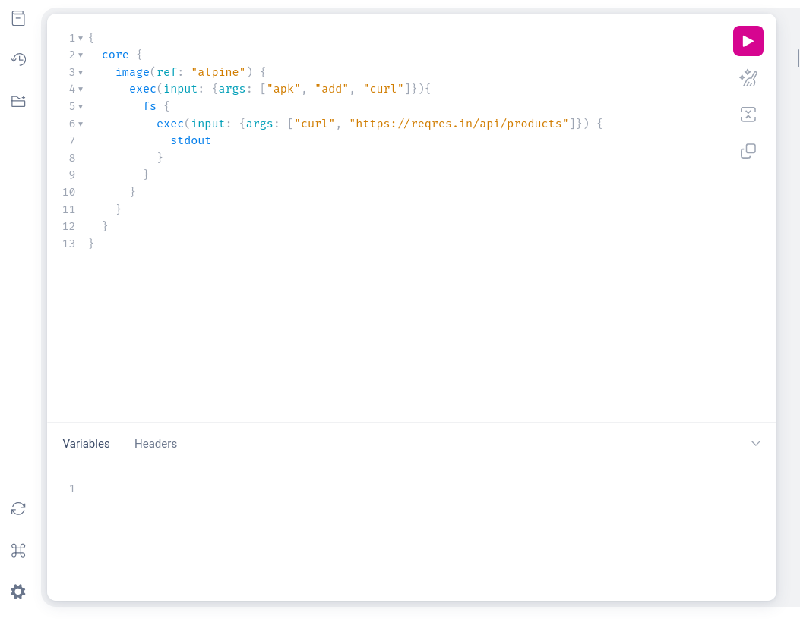
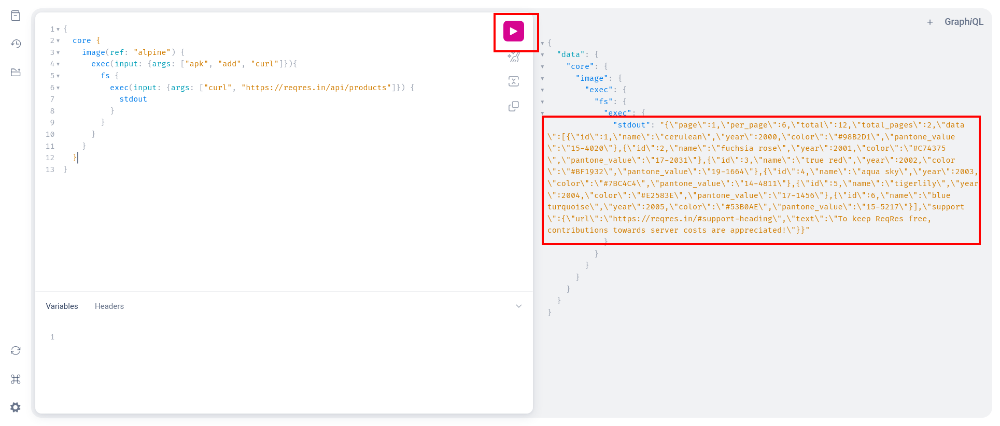
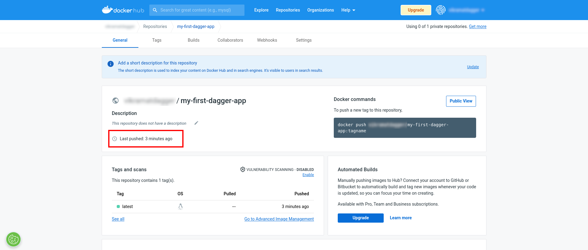
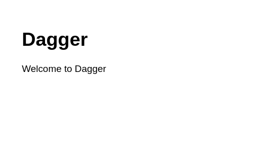

# Get Started

## Introduction

Dagger is a DevOps automation engine. It enables DevOps teams to orchestrate and deliver pipelines in any programming language and embed them into existing scripts, tools and platforms. Popular use cases include multi-stage builds, CI/CD, on-demand staging environments, machine learning pipelines, end-to-end testing, artifact scanning and signing, and more.

This tutorial introduces you to the basics of Dagger. It walks you through installing Dagger, understanding the Dagger API and Dagger SDKs, and building a Node.js application image with Dagger.

## Requirements

This tutorial assumes that:

- You have Docker installed and running on the host system. If not, [install Docker](https://docs.docker.com/engine/install/).
- You have a Node.js development environment on the host system, with Node.js 14.x/16.x/18.x and `npm` installed. If not, [download and install Node.js](https://nodejs.org/en/download/).
- You have a Docker Hub account. If not, [register for a free Docker Hub account](https://hub.docker.com/signup).

## Step 1: Install Dagger

The first step is to install Dagger on the host system.

import Tabs from "@theme/Tabs";
import TabItem from "@theme/TabItem";
import BrowserOnly from "@docusaurus/BrowserOnly";

import CodeBlock from "@theme/CodeBlock";
import styles from "../../website/src/css/install.module.scss";

<BrowserOnly>
{() =>
<Tabs defaultValue={
 window.navigator.userAgent.indexOf('Linux') != -1 ? 'linux':
 window.navigator.userAgent.indexOf('Win') != -1 ? 'windows':
 'macos'}
groupId="os"
values={[
{label: 'macOS', value: 'macos'}, {label: 'Linux', value: 'linux'}, {label: 'Windows', value: 'windows'},
]}>

<TabItem value="macos">

Instructions pending.

</TabItem>

<TabItem value="linux">

Run the following commands:

```shell
git clone https://github.com/dagger/dagger
cd dagger
git checkout cloak
go build ./cmd/cloak
ln -sf "$(PWD)/cloak" /usr/local/bin/cloak
```

This installs `cloak` in `/usr/local/bin`. Test it with the following commands.

```shell
which cloak
cloak is /usr/local/bin/cloak

cloak version
cloak devel (b7f3f4fec) linux/amd64
```

</TabItem>

<TabItem value="windows">

Instructions pending.

</TabItem>

</Tabs>
}
</BrowserOnly>

## Step 2: Try the Dagger API

The Dagger API is a GraphQL API for composing and running powerful pipelines with minimal effort. As a developer or operations engineer, your interaction with Dagger will be through this API, either directly by running GraphQL queries or by using a native-language Dagger SDK.

### Use the query console

To see this API in action, follow the steps below:

1. In a new terminal, start the Dagger API server using the following command.

  ```bash
  cloak dev
  ```

  By default, this will start the Dagger API server on the local host at port 8080. Starting the server will also start an interactive GraphQL query console on the same port.

1. Access the query console by browsing to `http://localhost:8080/`. Here's what you will see.

  

  This query console provides an easy way to work with the Dagger API, allowing you to test actions and workflows by entering and executing queries in an ad-hoc manner. Query results are displayed in the accompanying results window.

1. Try it out by entering the following simple query, which uses the Dagger API to query the [Reqres REST API](https://reqres.in/). Click the "Execute query" button in the right navigation bar or type `Ctrl+Enter` to execute the query.

  ```graphql
  {
    core {
      image(ref: "alpine") {
        exec(input: {args: ["apk", "add", "curl"]}){
          fs {
            exec(input: {args: ["curl", "https://reqres.in/api/products"]}) {
              stdout
            }
          }
        }
      }
    }
  }
  ```

  Let's break this query down to see how it works:
    * The `image()` field accepts an Open Container Initiative (OCI) image reference as argument and retrieves the corresponding image. In this example, it retrieves the `alpine` Docker image. The result of the query - the `alpine` image - is returned as the special Dagger `Filesystem` type and provided as input to the next query in the chain.
    * The first `exec()` field executes a command inside the `Filesystem` returned from the previous query. The commands are provided as input arguments. In this example, it executes the `apk add curl` command to download and install `curl` into the image. The resulting modified `Filesystem` is provided as input to the next query in the chain.
    * The next `exec()` field executes the `curl https://reqres.in/api/products` command to retrieve a list of products from the remote API. The resulting output is printed to the standard output device, which is accessed via the `stdout` field.

  Here's an example of the query result:

  

1. End the Dagger server process by typing `Ctrl+C` in the terminal where it is running.

From the above, it should be clear that Dagger allows you to execute operations (or workflows consisting of multiple operations) by performing one or more queries via its API. The result of one query can be supplied to the next in a nested manner, to maintain continuity and create outputs composed from multiple inputs.

### Use an SDK

One of Dagger's key features is that it allows you build DevOps workflows in any programming language and integrate them into your existing scripts, tools and platforms. It does this by providing SDKs for many common programming languages. These SDKs include an embedded, native-language Dagger engine and GraphQL client, both of which can be directly imported and used in your scripts.

:::note
All GraphQL API servers can be accessed over HTTP. Therefore, even for those programming languages where a Dagger SDK is not currently available, you can still execute Dagger operations by starting the Dagger API server manually and using the HTTP client included with your selected language to communicate with it.
:::

To see how this works, let's execute the same workflow seen in the previous section, but this time using the Dagger SDK for Node.js.

Follow the steps below:

1. In a new directory, install the Dagger SDK for Node.js.

  ```bash
  npm install github:dagger/dagger#cloak
  ```

1. Create a file named `cloak.yaml` in the directory. Add the following content to it.

  ```yaml
  name: myapp
  ```

1. Create a Node.js script named `index.mjs` in the same directory. Add the following content to it.

  ```javascript
  // import SDK
  import { gql, Engine } from "@dagger.io/dagger";

  // create engine
  const engine = new Engine({ ConfigPath: process.env.CLOAK_CONFIG });

  // execute query
  engine.run(async (client) => {
    const qod = await client
      .request(
        gql`
          query {
            core {
              image(ref: "alpine") {
                exec(input: {args: ["apk", "add", "curl"]}){
                  fs {
                    exec(input: {args: ["curl", "https://reqres.in/api/products"]}) {
                      stdout
                    }
                  }
                }
              }
            }
          }
        `
      )
      .then((result) => {
        // parse and process query output
        const json = JSON.parse(result.core.image.exec.fs.exec.stdout);
        json.data.forEach(product => {
          console.log(`Found product: ${product.name}`);
        })
      });
  });
  ```

  This script imports the Dagger SDK, starts an embedded Dagger API server and performs the same query shown in the previous section. However, because this version is written in Node.js, you additionally have access to all the powerful language features of Node.js (for example, asynchronous execution, JSON parsing and loops, as demonstrated above).

Test the script by executing it at the console, as shown below.

```bash
node index.js
```

Here's an example of the script output.

```bash
Found product: cerulean
Found product: fuchsia rose
Found product: true red
Found product: aqua sky
Found product: tigerlily
Found product: blue turquoise
```

## Step 3: Create an Express application

Now that you've understood the basics, let's move on to a more realistic scenario: building and deploying an application using Dagger. This tutorial uses an Express application.

:::note
If you already have a Node.js application, you can proceed directly to Step 4.
:::

Create a simple Express application as follows:

1. In a new directory, create a skeleton application with the Express application generator.

  ```bash
  npx express-generator
  ```

1. Modify the index page of the Express application.

  ```bash
  sed -i 's/Express/Dagger/g' routes/index.js
  ```

## Step 4: Write and test a Dagger build script

The next step is to build a Docker image of the Express application and push it to the Docker Hub registry. Briefly, this involves the following tasks:

1. Start with a suitable base image (for example, `node:18-alpine`).
1. Add required development tools (for example, `git` or `curl`).
1. Copy the application source code to the image.
1. Install application dependencies.
1. Push the final image to the Docker Hub registry.

All these tasks can be easily accomplished with the Dagger API and the Dagger SDK for Node.js. Follow the steps below:

1. In the application directory, install the Dagger SDK for Node.js.

```bash
npm install github:dagger/dagger#cloak --save-dev
```

1. Create a file named `cloak.yaml` in the directory. Add the following content to it.

```yaml
name: my-first-dagger-app
```

1. Create a `scripts/` directory and within that directory, create a Node.js script named `build.mjs`. Add the following content to it, replacing the USERNAME placeholder with your Docker Hub username.

```javascript
// import SDK
import { gql, Engine } from "@dagger.io/dagger";

// create engine
const engine = new Engine({ ConfigPath: process.env.CLOAK_CONFIG });

// execute queries
engine.run(async (client) => {

  // get filesystem id for application source
  const app = await client
    .request(
      gql`
        {
          host {
            workdir {
              read {
                id
              }
            }
          }
        }
      `
    )
    .then((result) => result.host.workdir.read.id);

  // download base image and add tools to it
  // get filesystem id for resulting image
  const baseImage = await client
    .request(
      gql`
        {
          core {
            image(ref: "index.docker.io/node:18-alpine") {
              exec(input: { args: ["apk", "add", "git",] }) {
                fs {
                  id
                }
              }
            }
          }
        }
      `
    )
    .then((result) => result.core.image.exec.fs.id);

  // copy application source to modified base image
  // exclude unwanted files
  // install application dependencies with npm
  const appWithDeps = await client
    .request(
      gql`
      query ($baseImage: FSID!, $app: FSID!) {
        core {
          filesystem(id: $baseImage) {
            copy(from: $app, srcPath:"/", destPath: "/home/node", exclude: ["node_modules", "cloak.yaml", "scripts"]) {
              exec(input: {args: ["npm", "install", "--production=true"], workdir: "/home/node"}) {
                fs {
                  id
                }
              }
            }
          }
        }
      }
      `,
      {
        baseImage,
        app,
      }
    )
    .then((result) => result.core.filesystem.copy.exec.fs.id);

  // push final filesystem to Docker Hub
  const appImage = await client
    .request(
      gql`
        query ($appWithDeps: FSID!) {
          core {
            filesystem(id: $appWithDeps) {
                pushImage(ref: "USERNAME/my-first-dagger-app")
            }
          }
        }
      `,
      {
        appWithDeps
      }
    )
    .then((result) => result.core.filesystem);

});
```

This script is significantly more complex than the one shown in Step 2, so let's step through it in detail:

- The script begins by importing the Dagger SDK and starting an embedded Dagger API server.
- It performs an initial query to read the contents of the host's working directory - in this case, the directory containing the application source code. The resulting filesystem is stored in the `app` constant as a `Filesystem`.
- It performs a query to retrieve the `node:18-alpine` image and add `git` to the image. The resulting modified filesystem is stored in the `baseImage` constant.
- It uses the results of the previous two queries in a third query, which does the following:
  - It creates a merged filesystem by copying the application source code to the `/home/node` directory of modified base image. Note that the `copy()` field can also exclude certain files from being copied; this is used to prevent copying of the `node_ modules` directory from the host.
  - Once the application source code is copied, it uses the `exec()` field to run `npm install --production=true` to create a new build containing only the required dependencies.
  - A reference to the final filesystem, containing the base image, application source code and all required dependencies, is stored in the `appImage` constant as a `Filesystem`.
- It uses the `pushImage()` field to push the final `Filesystem` to Docker Hub.

Before testing the script, sign in to your Docker Hub account on the host, so that Dagger can use the same credentials when pushing the final image to Docker Hub.

```bash
docker login
```

Execute the script to build the application image and push it to Docker Hub.

```bash
node scripts/build.mjs
```

Wait for the script to complete execution. The newly-created container image will appear in your Docker Hub account.



Test the container image by running it locally, as follows:

```bash
docker run -it -p 3000:3000 -w /home/node/ vikramatdagger/my-first-dagger-app npm start
```

Browse to `http://localhost:3000` on the local host. You will see the modified welcome page for the Express application.



## Step 5: Write and test a Dagger deploy script

Instructions pending.

## Conclusion

This tutorial introduced you to the basics of Dagger. It explained how to install Dagger and how to work with the Dagger API using both the interactive query console and a Dagger SDK. It then applied this learning to the process of building a Node.js application image with Dagger.
