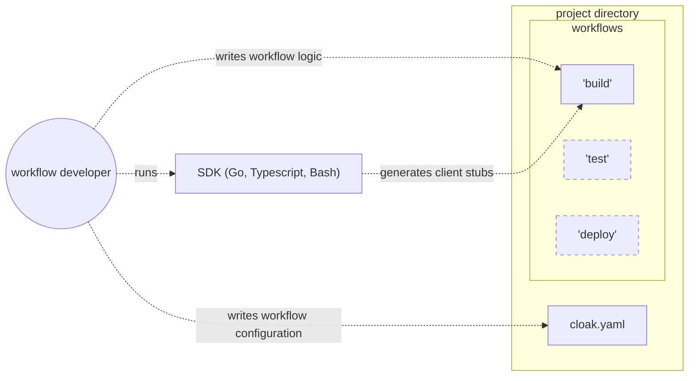
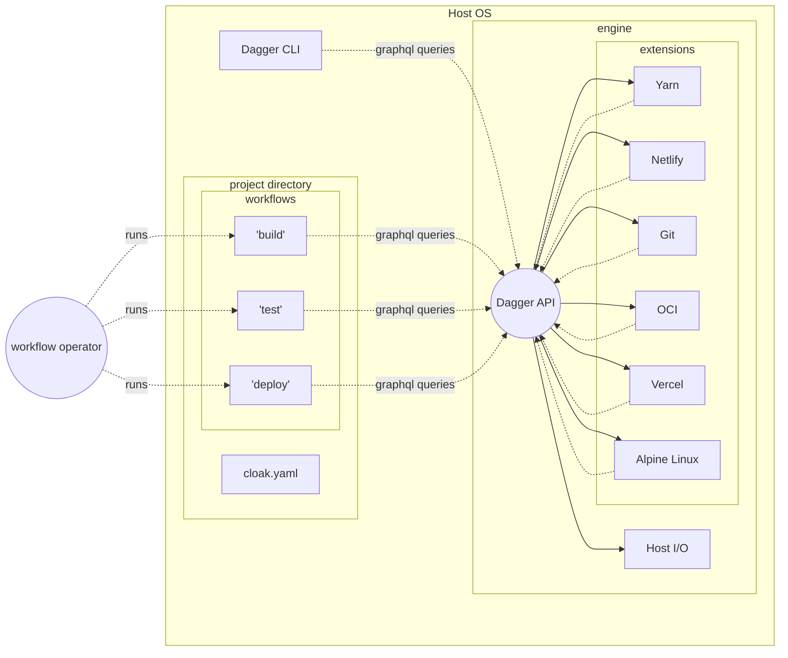
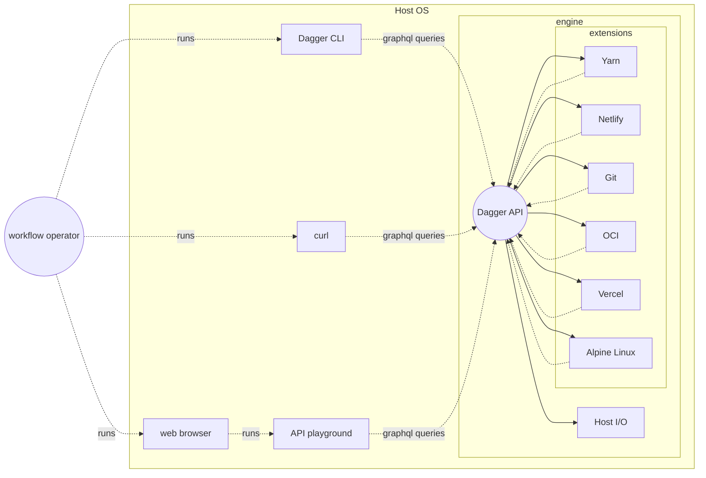

# Introduction to Dagger/Cloak

## What is Dagger?

Dagger is an automation platform for modern software projects.

Software builders use Dagger to automate their workflows, so that they can spend less time fixing artisanal scripts, and more time building.

## What is Cloak?

Cloak is the codename of the future 0.3 release of Dagger. It is still in development. In this documentation, the terms "Cloak" and "Dagger"
are used interchangeably.

## Why Dagger?

The business of building software involves various workflows: build, lint, test, generate docs, deploy, release etc. Each workflow is composed of many inter-connected tasks, and must be run frequently. Orchestrating these workflows manually is too time-consuming, so instead they are automated with scripts.

As the project evolves, these scripts tend to cause problems: they stop working, become very slow, or can't be touched because the person who wrote them has left.

Dagger fixes this problem by making it easy to simplify and modularize existing scripts; and gradually replacing them completely with a modern API and complete developer toolbox.

## How it works

### The Dagger API

The Dagger API is a graphql-compatible API for composing and running powerful pipelines with minimal effort. By relying on the Dagger API to do the heavy lifting, one can write a small script that orchestrates a complex workflow, knowing that it will run in a secure and scalable way out of the box, and can easily be changed later as needed.

### API extensions

Developers can write an *API extensions* to add new capabilities to the Dagger API.
 
API extensions are the killer feature of Dagger. They ensure that as a workflow grows and evolves, it can remain simple and small, by *breaking up its logic into reusable components*. 

API extensions are fully sandboxed, so they can be safely shared and reused between projects.

Client workflows may depend on extensions, and extensions may depend on other extensions.

## Using Dagger

There are 4 dimensions to using Dagger:

1. Writing a workflow
2. Running a workflow
3. Exploring the API
4. Writing an API extension

### Writing a workflow

In Dagger, a workflow is simply software that calls the Dagger API.

A workflow can be written in any programming language; and written *very easily* in any language for which a Dagger SDK is available. Currently Dagger provides SDKs for Bash, Go and Typescript.

The main benefit of using a Dagger SDK is:

1. To facilitate the initialization of the engine
2. To generate client code that hides graphql queries behind a more familiar API

A workflow may declare a dependency on API extensions, using the `dependencies` configuration key.



### Running a workflow

Since a workflow is just a regular program that happens to call the Dagger API, there is nothing special about running a workflow: just run your code the way you usually would.

This makes Dagger very easy to embed in existing projects with minimal disruption.

When a workflow is run, it simply queries the Dagger API in the usual way: all extension types are loaded and available to be queried.




## Exploring the API

Any graphql-compatible client may be used to interact directly with the API. This is most useful for experimentation or running one-off pipelines.




### Writing an API extension

Signs that it may be time to write an extension:

* Your workflow is growing larger and more complex, and is becoming harder to develop
* The same logic is duplicated across workflows, and there's no practical way to share it

Writing an extension is more advanced than writing a workflow, because in addition to being a GraphQL client, it must also implement some parts of a GraphQL *server*. However, Dagger SDKs greatly simplify the process, and after learning a few basic GraphQL concepts, it is quite fun.

* Just like workflows, extensions can be written in any language; and written *easily* with a Dagger SDK.

* Unlike workflows, extensions are fully sandboxed and cannot access the host system.

[Learn more about writing extensions](writing_extensions.md)

## Project File examples

### Todo App (the hard way, no extensions)

```yaml
workflows:
	build: 
		source: ./workflows/build
		sdk: bash
	deploy:
		source: ./workflows/deploy
		sdk: go
```

### Todo App (with extensions)

```yaml
workflows:
	build: 
		source: ./workflows/build
		sdk: bash
		dependencies:
			- yarn
	deploy:
		source: ./workflows/deploy
		sdk: go
		dependencies:
			- yarn
			- netlify
```

### Todo App (advanced)

In this version of Todo App, custom build and deployment logic has been moved into an extension.

* Note that workflows no longer have dependencies (a project's own extensions are always loaded)

* Note that the `deploy` workflow is now a shell script, since it's now much simpler and more people on the team are comfortable with bash than go.

```yaml
workflows:
	build: 
		source: build.sh
		sdk: bash
	deploy:
		source: deploy.sh
		sdk: bash

extensions:
	-
		source: ./dagger/extensions
		sdk: go
		dependencies:
			- yarn
			- netlify
			- aws/s3
```

### Netlify extension

Here we imagine the source code of the "netlify" extension with some types implemented in Go, and others in Typescript (probably not a good idea).

Note that this project combines two extensions. If it is used as a dependency, both extensions will be included. 

```yaml
extensions:
	-
		source: ./ts
		sdk: typescript
	-
		source: ./go
		sdk: go
```
