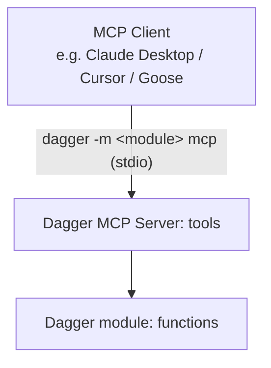

## Modern CI

Dagger lets you encapsulate common tasks and workflows in reusable, shareable Dagger modules. These Dagger modules are simply collections of Dagger Functions, packaged together for easy sharing and consumption. Their design is inspired by Go modules:

- **Modules are just source code**: Binary artifacts are built locally, and aggressively cached
- **Git is the source of truth**: Modules follow semantic versioning using Git tags
- **Dependencies are pinned by default**: The version you install is the version that will run
- **No dependency hell**: Since Dagger Functions are containerized, their dependencies are naturally scoped. Different modules can require different versions of the same dependency, and everything will just work
- **First-class monorepo support**: Dagger is agnostic to repository layout, and any number of Dagger modules can peacefully coexist in a [monorepo](../api/module-structure/#monorepos). It's up to you how to organize your module's source code. Some like to publish each module as a dedicated repository; others like to organize all their modules together, with the Git repository acting as a "catalog"

### Interoperability

Modern development takes place in a mix of languages, tools and platforms. In these environments, no one language or tool can "win"; every component must be interoperable with every other. Dagger is ideally suited to these polyglot environments, because Dagger modules are portable and reusable across languages. For example, a Python function can call a Go function, which can call a TypeScript function, and so on.

This feature immediately unlocks cross-team collaboration: even though different teams might prefer different languages, the Dagger modules they create are instantly compatible and usable by other teams. It also means that you no longer need to care which language your CI tooling is written in; you can use the one that you're most comfortable with or that best suits your requirements.

#### Example

Here's an example, where a Dagger Function written in Python calls both core functions and third-party Dagger Functions written in Go:

```python
@function
async def ci(self, source: dagger.Directory) -> str:
    # Use third-party Golang module to configure project
    go_project = dag.golang().with_project(source)

    # Run Go tests using Golang module
    await go_project.test()

    # Get container with built binaries using Golang module
    image = await go_project.build_container()

    # Push image to a registry using core Dagger API
    ref = await image.publish("ttl.sh/demoapp:1h")

    # Scan image for vulnerabilites using third-party Trivy module
    return await dag.trivy().scan_container(dag.container().from_(ref))
```

### Dagger Cloud

Modules integrate seamlessly with Dagger Cloud, which offers a collaborative environment to manage modules, visualize dependencies, and trace executions.

- A dedicated "Modules" tab in Dagger Cloud: See all your organization’s modules in one place, with metadata like engine versions, descriptions, and linked repositories, automatically pulled and synced from GitHub.
- Views for better organization: Create filtered views of modules by team, service, or domain.
- Documentation: See API documentation for each module and version, directly in the Dagger Cloud dashboard.
- Version-aware navigation: View active branches and tags, ordered by recency.
- Supply chain visibility: See exactly which modules your code depends on, and which depend on yours. This upstream/downstream awareness helps eliminate breakage and fosters stronger collaboration between teams.
- Trace-to-module linkage: Trace failed runs or AI workflows back to the exact module versions that caused them.


### The Daggerverse

To make it easier to search and consume Dagger modules, the [Daggerverse](https://daggerverse.dev) is a free service run by Dagger, which indexes all publicly available Dagger modules. These might be Dagger modules developed by your team, your organization or the broader Dagger community. By importing and reusing these Dagger modules in your workflows and across your teams, you can significantly speed up development.

### Learn more

- [Create a module](../api/custom-functions.mdx)
- [Call a remote module](../api/remote-modules.mdx)
- [Understand module structure](../api/module-structure.mdx)
- [Publish a module](../api/daggerverse.mdx)
- [Use modules in Dagger Cloud](../configuration/cloud.mdx#modules)
- [Find modules in the Daggerverse](https://daggerverse.dev)

## Agentic CI

Dagger can be used as a runtime and programming environment for AI agents. Dagger provides an `LLM` core type that enables native integration of Large Language Models (LLM) in your workflows.

### Tool use

A key feature of Dagger's LLM integration is out-of-the-box support for tool use using Dagger Functions: an LLM can automatically discover and use any available Dagger Functions in the provided environment.


#### Environments

Environments configure any number of inputs and outputs for the LLM. For example, an environment might provide a `Directory`, a `Container`, a custom module, and a `string` variable. The LLM can use these objects and their functions to complete the assigned task.

The documentation for the modules are provided to the LLM via [inline documentation](../api/documentation.mdx) in your Dagger Functions. The LLM can then analyze the available tools and select which ones to use.

Here's an example:

<Tabs groupId="shell">

<Tab title="Dagger Shell">
```shell title="First type 'dagger' for interactive mode."
base=$(container | from alpine)
env=$(env | with-container-input 'base' $base 'a base container' | with-container-output 'python-dev' 'a container with python dev tools')
llm | with-env $env | with-prompt "You have an alpine container. Install tools to develop with Python." | env | output python-dev | as-container | terminal
```
</Tab>

<Tab title="System shell">
```shell
dagger <<EOF
base=\$(container | from alpine)
env=\$(env |
  with-container-input 'base' \$base 'a base container' |
  with-container-output 'python-dev' 'a container with python dev tools')
llm |
  with-env \$env |
  with-prompt "You have an alpine container. Install tools to develop with Python." |
  env |
  output python-dev |
  as-container |
  terminal
EOF
```
</Tab>

</Tabs>

Here, an instance of a `Container` is attached as an input to the `Env` environment. The `Container` is a core type with a number of useful functions, such as `withNewFile()` and `withExec()`. When this environment is attached to an `LLM`, the LLM can call any of these Dagger Functions to change the state of the `Container` and complete the assigned task.

#### Agent loop

Consider the following Dagger Function:

<Tabs groupId="language" queryString="sdk">
<Tab value="go" title="Go">
```go file=../quickstart/agent/snippets/part1/go/main.go
```
</Tab>
<Tab value="python" title="Python">
```python file=../quickstart/agent/snippets/part1/python/src/coding_agent/main.py
```
</Tab>
<Tab value="typescript" title="TypeScript">
```typescript file=../quickstart/agent/snippets/part1/typescript/src/index.ts
```
</Tab>
</Tabs>

This Dagger Function creates a new LLM, gives it an environment (a container with various tools) with an assignment, and prompts it to complete the assignment. The LLM then runs in a loop, calling tools and iterating on its work, until it completes the assignment. This loop happens inside the LLM object, so the value of `result` is the environment with the completed assignment.

### MCP

Model Context Protocol (MCP) support in Dagger can be broken into two categories:

1. Exposing MCP outside Dagger
1. Connecting to external MCP servers from Dagger

#### Expose MCP outside Dagger

Dagger has built-in MCP support that allows you to easily expose Dagger modules as an MCP server. This allows you to configure a client (such as Claude Desktop, Cursor, Goose CLI/Desktop) to consume modules from [the Daggerverse](https://daggerverse.dev) or any Git repository as native MCP servers.



<Warning>
Currently, only Dagger modules with no required constructor arguments are supported when exposing an MCP server outside  Dagger.
</Warning>

### Connect to external MCP servers from Dagger

Support for connecting to external MCP servers from Dagger is coming soon.

### Prompt mode

Dagger Shell lets you interact with the attached LLM using natural language commands. Each input builds upon previous interactions, creating a prompt chain that lets you execute complex workflows without needing to know the exact syntax of the underlying Dagger API.

"Prompt mode" can be accessed at any time in the Dagger Shell by typing `>`. Here's an example:

```shell
source=$(container | from node | with-mounted-directory /src https://github.com/dagger/hello-dagger | with-workdir /src)

You have a container with source code in /src. Describe the source code.

Does the application have unit tests?

Find all the unit tests. Deduce what the application does. Describe it in one paragraph.
```

### Supported models

Dagger supports a wide range of popular language models, including those from OpenAI, Anthropic and Google. Dagger can access these models either through their respective cloud-based APIs or using local providers like Docker Model Runner or Ollama.

Dagger uses your system's standard environment variables to route LLM requests. Dagger will look for these variables in your environment, or in a `.env` file in the current directory. Learn more about [configuring LLM endpoints in Dagger](../configuration/llm.mdx).

### Observability

Dagger provides [end-to-end tracing](./visualization.mdx) of prompts, tool calls, and even low-level system operations. All agent state changes are observable in real time.

<VideoPlayer src="/img/current_docs/features/llm-cloud-trace.webm" alt="LLM observability example" />

### Learn more

- [Build an AI agent with our quickstart](../quickstart/agent/index.mdx)
- [Browse examples of agentic workflows](../examples.mdx)
- [Learn about the agent loop and how to work with LLM prompts and responses](../api/llm.mdx)
- [Configure LLM endpoints](../configuration/llm.mdx)