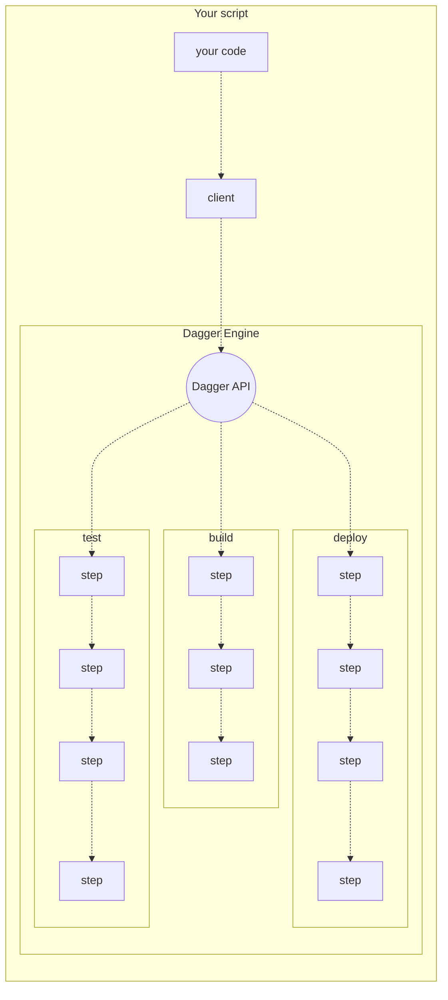
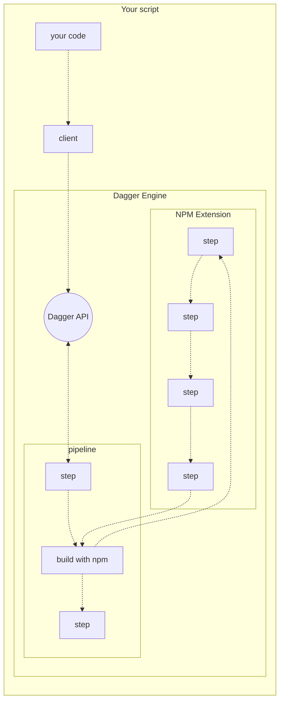

# Introduction to Dagger

## What is Dagger?

Dagger is a devops automation engine. It makes it very easy to develop powerful devops pipelines in any programming language, and embed them into your existing scripts, tools and platforms.

Popular use cases include multi-stage builds, CI/CD, on-demand staging environments, machine learning pipelines, end-to-end testing, artifact scanning and signing, and more.

Popular features include:

* Write pipelines in your favorite programming language
* Run pipelines from your existing tools, instead of learning yet another CLI
* Faster builds with automatic caching
* Highly portable pipelines run entirely in containers
* Easy to test and troubleshoot pipelines locally
* Portability across CI and development platforms

Using Dagger does not require converting to yet another devops platform. Instead it empowers you to retrofit the capabilities of a modern devops platform into the tooling and workflows you already have.

## Supported languages

* Go (alpha)
* Typescript / Javascript (alpha)
* Python (experimental)
* Bash (help wanted)
* Powershell (help wanted)
* Ruby (help wanted)

Want to write devops pipelines in another language? [Tell us about it in an issue](https://github.com/dagger/cloak/issues/new)!

## How it works

### The Dagger API

The Dagger API is a graphql API for composing and running powerful pipelines with minimal effort. By relying on the Dagger API to do the heavy lifting, one can write a small script that orchestrates a complex workflow, knowing that it will run in a secure and scalable way out of the box, and can easily be changed later as needed.

### Extensions

Developers can extend the capabilities of Dagger with *extensions*.

Extensions can define custom steps, which developers can then incorporate into their pipelines. Of course these custom steps may themselves be powered by Dagger pipelines, creating endless possibilities for component reuse and composition.

Extensions are fully sandboxed, so they can be safely shared and reused between projects.

[Learn more about writing extensions](guides/bnzm7-writing_extensions.md)

### Available Extensions
- [Vercel](https://github.com/slumbering/dagger-vercel)
- [Terraform](https://github.com/kpenfound/dagger-terraform)
- [Rails](https://github.com/kpenfound/dagger-rails)
