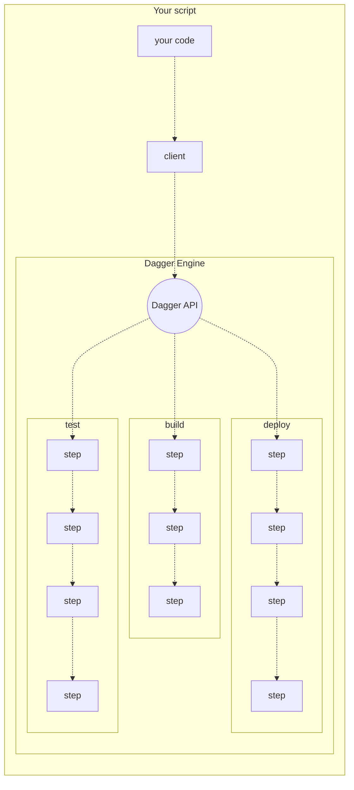
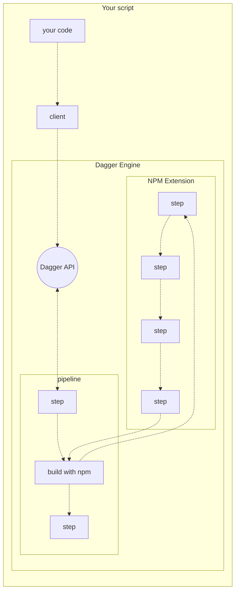

# Introduction to Dagger

## What is Dagger?

Dagger is an engine that lets you create devops pipelines as regular code running in regular containers, rather than proprietary YAML running on a proprietary CI/CD platform.

A Dagger pipeline may be used to build, test, deploy, lint, scan, sign, transform, notify... or perhaps all of the above!

Popular features include:

* SDKs for (almost) all major languages
* Run pipelines from your existing tools, instead of learning yet another CLI
* Drop to GraphQL for complete control over your pipelines
* Faster builds with automatic caching of every step
* Pipelines run in regular containers, making them very portable
* The same pipelines can run in development and CI
* Share and reuse custom pipeline steps using extensions

## Supported languages

* Go (alpha)
* Typescript / Javascript (alpha)
* Python (experimental)
* Bash (help wanted)
* Powershell (help wanted)
* Ruby (help wanted)

Want to write devops pipelines in another language? [Tell us about it in an issue](https://github.com/dagger/dagger/issues/new)!

## How it works

### The Dagger API

The Dagger API is a graphql API for composing and running powerful pipelines with minimal effort. By relying on the Dagger API to do the heavy lifting, one can write a small script that orchestrates a complex workflow, knowing that it will run in a secure and scalable way out of the box, and can easily be changed later as needed.

### Extensions

Developers can extend the capabilities of Dagger with *extensions*.

Extensions can define custom steps, which developers can then incorporate into their pipelines. Of course these custom steps may themselves be powered by Dagger pipelines, creating endless possibilities for component reuse and composition.

Extensions are fully sandboxed, so they can be safely shared and reused between projects.

[Learn more about writing extensions](guides/bnzm7-writing_extensions.md)

### Available Extensions

* [Vercel](https://github.com/slumbering/dagger-vercel)
* [Terraform](https://github.com/kpenfound/dagger-terraform)
* [Rails](https://github.com/kpenfound/dagger-rails)
