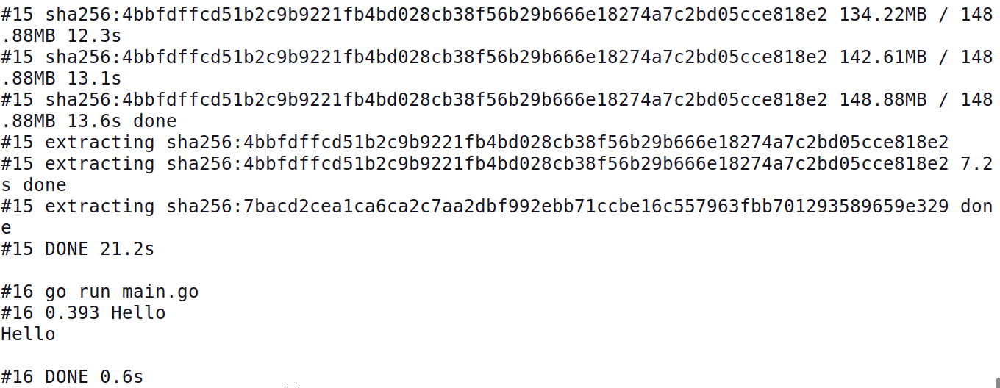
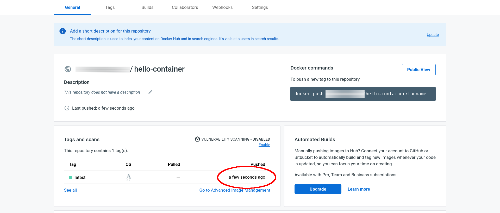

# Get Started with the Dagger Go SDK

## Introduction

This tutorial teaches you the basics of using Dagger in Go. You will learn how to:

- Install the Go SDK
- Create a Go CI/CD tool that runs and tests a Go application using the Go SDK
- Improve the Go CI/CD tool to build and publish an application image to Docker Hub

## Requirements

This tutorial assumes that:

- You have a basic understanding of the Go programming language. If not, [read the Go tutorial](https://go.dev/doc/tutorial/getting-started).
- You have a Go development environment with Go 1.15 or later. If not, [download and install Go](https://go.dev/doc/install).
- You have a Go application with accompanying tests. If not, [create a sample Go application](#appendix-create-a-sample-go-application).
- You have Docker installed and running on the host system. If not, [install Docker](https://docs.docker.com/engine/install/).
- You have a Docker Hub account. If not, [register for a free Docker Hub account](https://hub.docker.com/signup).

:::note
This tutorial creates a Go CI/CD tool using the Dagger Go SDK. It uses this tool to build, test and publish an existing Go application. If you do not already have a Go application, follow the instructions in the [Appendix](#appendix-create-a-sample-go-application) and create a sample Go application before proceeding.
:::

## Step 1: Install the Go SDK

{@include: ../../partials/_install-sdk-go.md}

## Step 2: Create a Go CI/CD tool

Begin creating a Go CI/CD tool that uses the Dagger SDK to build, test and publish your application. In this step, the tool will perform only one task: run the application.

1. Create a new subdirectory named `ci` to hold the Go tool.

  ```shell
  mkdir ci
  ```

1. Create a new file named `ci/main.go` and add the following code to it. Save the file once done.

  ```go
  package main

  import (
    "context"
    "fmt"
    "os"
    "go.dagger.io/dagger/engine"
    "go.dagger.io/dagger/sdk/go/dagger/api"
  )

  const (
    golangImage    = "golang:latest"
  )

  func main() {
    ctx := context.Background()

    task := os.Args[1]

    if len(os.Args) != 2 {
      fmt.Println("Please pass a task as an argument")
      os.Exit(1)
    }

    switch task {
    case "run":
      run(ctx)
    default:
      fmt.Printf("Unknown task %s\n", task)
      os.Exit(1)
    }
  }

  func run(ctx context.Context) {
    if err := engine.Start(ctx, &engine.Config{}, func(ctx engine.Context) error {
      core := api.New(ctx.Client)

      // get working directory on host
      src, err := core.Host().Workdir().Read().ID(ctx)
      if err != nil {
        return err
      }

      // initialize new container from image
      golang := core.Container().From(golangImage)

      // mount working directory to /src
      golang = golang.WithMountedDirectory("/src", src).WithWorkdir("/src")

      // execute command
      cmd := golang.Exec(api.ContainerExecOpts{
        Args: []string{"go", "run", "main.go"},
      })

      // get command output
      out, err := cmd.Stdout().Contents(ctx)
      if err != nil {
        return err
      }

      // print output to console
      fmt.Println(out)

      return nil
    }); err != nil {
      panic(err)
    }
  }
  ```

  This tool imports the Dagger SDK and defines two functions: `main()`, which provides an interface for the user to execute individual steps in the pipeline, and `run()`, which uses the Go SDK to mount the Go application's source code in a container and run it.

  The `run()` function is the main workhorse, so let's step through it in detail.
    - It begins by starting the Dagger engine and create a new API query object with the `New()` function.
    - It uses the `Host().Workdir().Read()` function to read the contents of the current working directory on the host. This is the directory containing the application source code. The `Read()` function returns a new `Directory` struct, and the `ID()` function then returns an identifier for the directory. This identifier is stored in the `src` variable.
    - It initializes a new container from a base image with the `Container().From()` function and returns a new `Container` struct. In this case, the base image is the `golang:latest` image.
    - It mounts the working directory on the host in the container using the `WithMountedDirectory()` function of the `Container`.
      - The first argument to this function is the target path in the container (here, `/src`).
      - The second argument is the directory to be mounted (here, the reference previously created in the `src` variable).
      It also changes the current working directory to the `/src` path of the container using the `WithWorkdir()` function and returns a revised `Container` with the results of these operations.
    - It uses the `Exec()` function to execute a command in the container - in this case, the command `go run main.go`. The command and arguments are specified as a Go struct. The `Exec()` function returns a revised `Container` containing the results of command execution.
    - It uses the `Container.Stdout()` function to retrieve the output stream of the last command as a `File` and, from there, the actual content using the `File.Contents()` function. The output is then printed to the console.

1. Try the `run` step of this pipeline by executing the command below from the application directory:

  ```shell
  go run ci/main.go run
  ```

The Go tool goes to work, downloading the container image, mounting the working directory and executing the `go run` command. At the end of the process, the output `Hello` is displayed, as shown below:



## Step 3: Test the application

Most CI/CD pipelines include a test step, so add this to the Go tool next.

1. Update the file `ci/main.go` and add a new `test()` function to it as shown below. Save the file once done.

  ```go
  package main

  import (
    "context"
    "fmt"
    "os"
    "go.dagger.io/dagger/engine"
    "go.dagger.io/dagger/sdk/go/dagger/api"
  )

  const (
    golangImage    = "golang:latest"
  )

  func main() {
    ctx := context.Background()

    task := os.Args[1]

    if len(os.Args) != 2 {
      fmt.Println("Please pass a task as an argument")
      os.Exit(1)
    }

    switch task {
    case "run":
      run(ctx)
    case "test":
      test(ctx)
    default:
      fmt.Printf("Unknown task %s\n", task)
      os.Exit(1)
    }
  }

  func run(ctx context.Context) {
    // ...
  }

  func test(ctx context.Context) {
    if err := engine.Start(ctx, &engine.Config{}, func(ctx engine.Context) error {
      core := api.New(ctx.Client)

      // get working directory on host
      src, err := core.Host().Workdir().Read().ID(ctx)
      if err != nil {
        return err
      }

      // initialize new container from image
      golang := core.Container().From(golangImage)

      // mount working directory to /src
      golang = golang.WithMountedDirectory("/src", src).WithWorkdir("/src")

      // execute command
      cmd := golang.Exec(api.ContainerExecOpts{
        Args: []string{"go", "test"},
      })

      // get command output
      out, err := cmd.Stdout().Contents(ctx)
      if err != nil {
        return err
      }

      // print output to console
      fmt.Println(out)

      return nil
    }); err != nil {
      panic(err)
    }
  }

  ```

  Most of the new `test()` function will be familiar to you from [Step 2](#step-2-run-the-application). The only difference lies in the arguments to the `Exec()` function, which in this case runs the command `go test`. The resulting output stream is captured and printed to the console as before.

1. Try the `test` step of the pipeline by executing the command below from the application directory:

  ```shell
  go run ci/main.go test
  ```

## Step 4: Build and publish the application image

Once your application has passed its tests, the typical next step in a CI/CD pipeline is to build and publish an image of it to a container registry. Follow the steps below to add this functionality to your Go tool:

1. Update the file `ci/main.go` and add a new `publish()` function and step to it as shown below. Replace the `DOCKER-USERNAME` placeholder with your Docker Hub username. Save the file once done.

  ```go
  package main

  import (
    "context"
    "fmt"
    "os"
    "go.dagger.io/dagger/engine"
    "go.dagger.io/dagger/sdk/go/dagger/api"
  )

  const (
    golangImage    = "golang:latest"
    baseImage      = "alpine:latest"
    publishAddress = "docker.io/DOCKER-USERNAME/hello-container:latest"
  )

  func main() {
    ctx := context.Background()

    task := os.Args[1]

    if len(os.Args) != 2 {
      fmt.Println("Please pass a task as an argument")
      os.Exit(1)
    }

    switch task {
    case "run":
      run(ctx)
    case "test":
      test(ctx)
    case "publish":
      publish(ctx)
    default:
      fmt.Printf("Unknown task %s\n", task)
      os.Exit(1)
    }
  }

  func run(ctx context.Context) {
    // ...
  }

  func test(ctx context.Context) {
    // ...
  }

  func publish(ctx context.Context) {
    if err := engine.Start(ctx, &engine.Config{}, func(ctx engine.Context) error {
      core := api.New(ctx.Client)

      // get working directory on host
      src, err := core.Host().Workdir().Read().ID(ctx)
      if err != nil {
        return err
      }

      // initialize new container from image
      builder := core.Container().From(golangImage)

      // mount working directory to /src
      builder = builder.WithMountedDirectory("/src", src).WithWorkdir("/src")

      // execute build command
      builder = builder.Exec(api.ContainerExecOpts{
        Args: []string{"go", "build", "-o", "hello"},
      })

      // get built binary file
      helloBin, err := builder.File("/src/hello").ID(ctx)
      if err != nil {
        return err
      }

      // initialize new container for publishing from image
      base := core.Container().From(baseImage)

      // mount binary file at container path
      base = base.WithMountedFile("/tmp/hello", helloBin)

      // copy mounted file to container filesystem
      base = base.Exec(api.ContainerExecOpts{
        Args: []string{"cp", "/tmp/hello", "/bin/hello"},
      })

      // set container entrypoint
      base = base.WithEntrypoint([]string{"/bin/hello"})

      // publish image
      addr, err := base.Publish(ctx, publishAddress)
      if err != nil {
        return err
      }

      fmt.Println(addr)

      return nil
    }); err != nil {
      panic(err)
    }
  }
  ```

  The `publish()` function differs from the ones shown previously in that it uses two container images:
    - It uses the `golang:latest` image to compile the Go application source code into a binary file.
    - It uses the `alpine:latest` image to produce an optimized container image with the compiled binary file.

  This `publish()` function is more complex than the ones shown earlier, so let's step through it in detail.

  In the first stage:
    - It begins by starting the Dagger engine and create a new API query object with the `New()` function.
    - It uses the `Host().Workdir().Read().ID()` function to obtain a reference to the current working directory on the host.
    - It initializes a new container from the `golang:latest` image with the `Container().From()` function and mounts the host working directory to the `/src` path in the container using the `WithMountedDirectory()` and `WithWorkdir()` functions.
    - It uses the `Exec()` function to execute the `go build -o hello` compilation instruction. The compiled file is saved to the container path `/src/hello`. The `Exec()` function returns a revised `Container` containing the results of command execution.
    - It uses the `Container.File().ID()` function to retrieve an identifier for the compiled file. This identifier is stored in the `helloBin` variable.

  In the second stage:
    - It initializes a new container from the `alpine:latest` image with the `Container().From()` function and returns a new `Container`.
    - It uses the `withMountedFile()` function to mount the compiled binary at the `/tmp/hello` path of the container using the identifier from the `helloBin` variable.
    - It uses the `Exec()` function to execute the command `cp /tmp/hello /bin/hello`, which copies the mounted file to the `/bin/hello` path of the container. The `Exec()` function returns a revised `Container` containing the updated filesystem.
    - It uses the `withEntrypoint()` function to set the container entrypoint to `/bin/hello`.
    - It uses the `Publish()` function to publish the container to the specified Docker Hub registry.

1. Before trying the `publish()` function, sign in to your Docker Hub account on the host, as Dagger will use the same credentials when pushing the final image to Docker Hub.

  ```shell
  docker login
  ```

1. Try the `publish` step of the pipeline by executing the command below from the application directory:

  ```shell
  go run ci/main.go publish
  ```

You will see the newly-published image in your Docker Hub account, as shown below:



:::tip
As the previous three steps illustrate, the Dagger Go SDK allows you to author your pipeline entirely in Go. This means that you don't need to spend time learning a new language, and you immediately benefit from all the powerful programming capabilities and packages available Go. For instance, this tutorial used native Go variables, conditionals and error handling throughout together with Go's testing package and built-in test framework.
:::

## Conclusion

This tutorial introduced you to the Dagger Go SDK. It explained how to install the SDK and use it to create a Go CI/CD tool. It also provided code samples and explanations of how to run, test, build and publish an application with the Go SDK.

Use the following resources to learn more about the Dagger Go SDK:

- [SDK Reference](https://pkg.go.dev/go.dagger.io/dagger@v0.3.0-alpha.1)
- [FAQ](./xfgss-faq.md)

## Appendix: Create a sample Go application

Create a sample Go application as follows:

1. Create and change into a new directory for the application.

  ```bash
  mkdir myapp
  cd myapp
  ```

1. Declare the module path for your application.

  ```bash
  go mod init myapp
  ```

1. Create a new file named `main.go` and add the following code to it. Save the file once done.

  ```go
  package main

  import "fmt"

  func main() {
      say := greeting()
      fmt.Println(say)
  }

  func greeting() string {
      return "Hello"
  }
  ```

1. Create a new test file named `main_test.go` and add the following code to it. Save the file once done.

  ```go
  package main

  import (
    "testing"

    "gotest.tools/v3/assert"
  )

  func TestGreeting(t *testing.T) {
    g := greeting()
    should := "Hello"
    assert.Equal(t, should, g)
  }
  ```

1. Check that the application works by executing the command below.

  ```bash
  go run main.go
  ```

  The application displays the string `Hello`.
