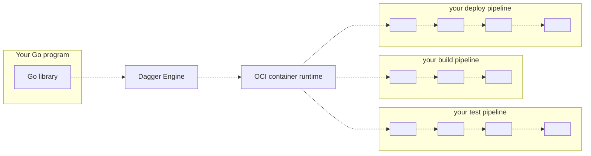

# Dagger Go SDK

Technical Preview

## What is the Dagger Go SDK?

The Dagger Go SDK contains everything you need to develop CI/CD pipelines in Go, and run them on any OCI-compatible container runtime.

Currently the Go SDK consists of:

* A go library: `dagger.io/dagger`
* A CLI (optional)
* Sample apps
* This documentation

In practice, everything is optional except the Go library.

## Who is it for?

The Dagger Go SDK may be a good fit if you are...

* A Go developer wishing their CI pipelines were Go instead of YAML
* A developer who needs CI/CD, and is looking for an excuse to learn Go
* Your team's "designated devops person", hoping to replace a pile of artisanal scripts with something more powerful
* A platform engineer writing custom Go tooling, with the goal unifying continuous delivery across organizational silos
* A cloud-native developer advocate or solutions engineer, looking to demonstrate a complex integration on short notice

The Dagger GO SDK may *not* be a good fit if you are...

* A developer who doesn't know Go, and is not interested in learning it
* A "designated devops person" who doesn't think of themselves as a developer - nothing makes you happier than a battle-hardened shell script.
* Someone who loves writing YAML all day, thank you very much
* A container skeptic: the less containers are involved, the happier you are.

## How it works

1. Your Go program imports the Dagger go library
2. Using the go library, your program opens a new session to a Dagger Engine: either by connecting to an existing engine, or by provisioning one on-the-fly.
3. Using the go library, your program prepares API requests describing pipelines to run, then sends them to the engine. The wire protocol used to communicate with the engine is private and not yet documented, but this will change in the future. For now, the go library is the only documented API available to your program.
4. When the engine receives an API request, it computes a DAG of low-level operations required to compute the result, and starts processing operations concurrently.
5. When all operations in the pipeline have been resolved, the engine sends the pipeline result back to your program
6. Your program may use the pipeline's result as input to new pipelines

## Getting started

To learn more, [install the Go SDK](./r2eu9-install.md) and [start using it](./8g34z-get-started.md).
